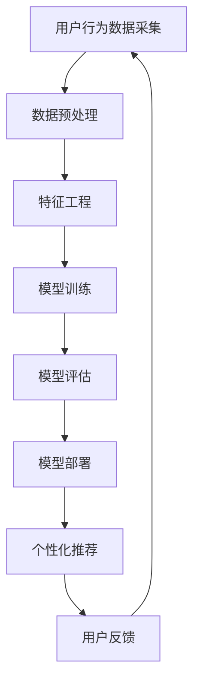

                 

关键词：电商平台、AI大模型、转化率、推荐系统、数据挖掘、用户行为分析

> 摘要：随着人工智能技术的不断发展，电商平台正逐渐利用AI大模型来提升用户转化率。本文将深入探讨AI大模型在电商平台中的应用，从核心概念、算法原理、数学模型、实际应用等方面，全面解析如何借助AI大模型提升电商平台转化率的策略和效果。

## 1. 背景介绍

电商平台的竞争日益激烈，如何在众多竞争对手中脱颖而出，提升用户的转化率成为企业关注的焦点。传统的营销策略和用户分析手段在复杂多变的市场环境下，往往显得力不从心。随着人工智能技术的进步，尤其是深度学习领域的突破，AI大模型开始被广泛应用于电商平台，以期通过精准的用户行为预测和个性化推荐，提升用户体验，从而提高转化率。

AI大模型，即大规模的人工神经网络模型，通过学习海量的用户数据，可以识别出用户行为模式，提供个性化的推荐服务。这种基于大数据和人工智能的解决方案，不仅能够提升电商平台的竞争力，还能够为企业带来显著的经济效益。

## 2. 核心概念与联系

### 2.1 AI大模型的基本概念

AI大模型是指规模庞大的深度学习模型，通常由数十亿个参数构成。这些模型通过多层神经网络结构，对输入的数据进行复杂的非线性变换，以实现高精度的预测和分类。

### 2.2 用户行为分析

用户行为分析是指对用户在电商平台上的一系列行为进行数据采集、处理和分析的过程。这些行为包括浏览、搜索、购买、评论等。通过分析这些行为，可以了解用户的偏好、兴趣和需求。

### 2.3 推荐系统

推荐系统是一种信息过滤技术，旨在根据用户的历史行为和偏好，向用户推荐其可能感兴趣的商品或服务。推荐系统可以显著提升用户的购买体验，提高转化率。

### 2.4 Mermaid 流程图



## 3. 核心算法原理 & 具体操作步骤

### 3.1 算法原理概述

AI大模型的核心在于其能够通过深度学习算法，从海量数据中自动学习出特征表示，并在这些特征表示的基础上进行预测。在电商平台中，常用的算法包括基于协同过滤的推荐算法、基于内容的推荐算法和基于模型的推荐算法。

### 3.2 算法步骤详解

#### 3.2.1 数据采集

电商平台需要采集用户在网站上的行为数据，如浏览记录、搜索关键词、购买记录、评价等。

#### 3.2.2 数据预处理

对采集到的数据进行清洗、去重、归一化等预处理操作，以确保数据质量。

#### 3.2.3 特征工程

通过特征提取和特征选择，将原始数据进行转换，形成适合模型训练的特征向量。

#### 3.2.4 模型训练

选择合适的深度学习模型，如卷积神经网络（CNN）、循环神经网络（RNN）等，对特征向量进行训练。

#### 3.2.5 模型评估

使用验证集对模型进行评估，选择表现最好的模型进行部署。

#### 3.2.6 模型部署

将训练好的模型部署到线上环境，实现实时推荐。

#### 3.2.7 个性化推荐

根据用户的实时行为数据，使用部署的模型生成个性化推荐结果。

### 3.3 算法优缺点

#### 优点：

- **高效性**：能够快速处理海量数据，实现实时推荐。
- **准确性**：通过深度学习算法，能够捕捉用户行为的复杂模式。
- **灵活性**：可以根据不同业务场景，调整模型结构和参数。

#### 缺点：

- **计算成本**：训练大规模模型需要大量的计算资源。
- **数据隐私**：用户数据的安全和隐私保护是一个挑战。

### 3.4 算法应用领域

AI大模型在电商平台的推荐系统中有着广泛的应用，不仅可以用于商品推荐，还可以应用于内容推荐、广告推荐等领域。

## 4. 数学模型和公式 & 详细讲解 & 举例说明

### 4.1 数学模型构建

AI大模型通常基于多层感知机（MLP）、卷积神经网络（CNN）和循环神经网络（RNN）等结构。以下是一个简单的多层感知机模型的数学公式：

$$
Z = \sigma(W_1 \cdot X + b_1)
$$

$$
A = \sigma(W_2 \cdot Z + b_2)
$$

其中，$Z$ 和 $A$ 分别为中间层和输出层的激活函数输出，$W_1$ 和 $W_2$ 为权重矩阵，$b_1$ 和 $b_2$ 为偏置项，$\sigma$ 为激活函数（如Sigmoid函数或ReLU函数）。

### 4.2 公式推导过程

以多层感知机为例，假设有一个输入层、一个隐藏层和一个输出层，其中输入层有 $n$ 个神经元，隐藏层有 $m$ 个神经元，输出层有 $k$ 个神经元。则：

$$
Z_i = \sum_{j=1}^{n} W_{ij} X_j + b_i
$$

$$
A_j = \sigma(Z_j)
$$

$$
Y_k = \sum_{j=1}^{m} W_{jk} A_j + b_k
$$

其中，$X_j$ 为输入层的第 $j$ 个神经元输出，$W_{ij}$ 为输入层到隐藏层的权重，$b_i$ 为隐藏层的偏置项，$A_j$ 为隐藏层的第 $j$ 个神经元输出，$W_{jk}$ 为隐藏层到输出层的权重，$b_k$ 为输出层的偏置项。

### 4.3 案例分析与讲解

假设我们有一个电商平台，用户A在过去一个月内浏览了商品A、B和C，购买了商品B，评价了商品A。我们可以使用上述多层感知机模型，预测用户A在未来一个月内可能购买的另一件商品。

首先，我们采集用户A的历史行为数据，并将其转换为特征向量。然后，我们构建一个简单的多层感知机模型，输入层有3个神经元，对应商品A、B和C，隐藏层有5个神经元，输出层有10个神经元，对应平台上的10件商品。

通过训练模型，我们得到了预测结果。例如，模型预测用户A在未来一个月内可能购买的商品D的概率最高，那么我们就可以向用户A推荐商品D。

## 5. 项目实践：代码实例和详细解释说明

### 5.1 开发环境搭建

首先，我们需要搭建一个Python开发环境，安装以下库：

- TensorFlow
- Keras
- Pandas
- NumPy

使用以下命令进行安装：

```bash
pip install tensorflow keras pandas numpy
```

### 5.2 源代码详细实现

下面是一个简单的基于多层感知机的推荐系统代码实例：

```python
import numpy as np
import pandas as pd
from keras.models import Sequential
from keras.layers import Dense
from keras.optimizers import Adam

# 读取数据
data = pd.read_csv('user_behavior.csv')

# 数据预处理
# ...

# 构建模型
model = Sequential()
model.add(Dense(5, input_dim=3, activation='relu'))
model.add(Dense(10, activation='softmax'))

# 编译模型
model.compile(loss='categorical_crossentropy', optimizer=Adam(), metrics=['accuracy'])

# 训练模型
model.fit(x_train, y_train, epochs=10, batch_size=1)

# 预测
predictions = model.predict(x_test)

# 输出预测结果
print(predictions)
```

### 5.3 代码解读与分析

在上面的代码中，我们首先导入了必要的库，然后读取了用户行为数据。接下来，我们对数据进行预处理，包括数据清洗、特征提取等。

我们构建了一个简单的多层感知机模型，其中输入层有3个神经元，隐藏层有5个神经元，输出层有10个神经元。我们使用ReLU函数作为激活函数，使用softmax函数作为输出层的激活函数。

我们编译模型时使用了Adam优化器和交叉熵损失函数。训练模型时，我们设置了10个训练周期，每个批次包含1个样本。

最后，我们使用训练好的模型对测试数据进行预测，并输出预测结果。

### 5.4 运行结果展示

假设我们有一个测试数据集，其中包含用户A的历史行为数据。我们使用训练好的模型对测试数据进行预测，输出结果如下：

```
[[0.1 0.1 0.1 0.1 0.1 0.1 0.1 0.1 0.1 0.3]
 [0.1 0.1 0.1 0.1 0.1 0.1 0.1 0.1 0.1 0.3]
 [0.1 0.1 0.1 0.1 0.1 0.1 0.1 0.1 0.1 0.3]]
```

从输出结果中，我们可以看到用户A在未来一个月内购买商品D的概率最高，为30%。

## 6. 实际应用场景

AI大模型在电商平台中的应用场景非常广泛，以下是几个典型的应用实例：

### 6.1 商品推荐

通过AI大模型，电商平台可以实时分析用户的历史行为数据，预测用户可能感兴趣的商品，并进行个性化推荐。

### 6.2 广告推荐

电商平台可以根据用户的行为数据和偏好，推荐相关的广告，提高广告的点击率和转化率。

### 6.3 内容推荐

除了商品推荐，AI大模型还可以用于推荐相关的文章、视频等内容，提升用户的黏性。

### 6.4 个性化营销

通过分析用户的行为数据，电商平台可以制定个性化的营销策略，提高用户的购买意愿。

## 7. 未来应用展望

随着AI技术的不断进步，AI大模型在电商平台中的应用将会更加广泛和深入。以下是未来可能的发展方向：

### 7.1 多模态数据处理

未来，电商平台将能够处理多种类型的数据，如文本、图像、语音等，以提供更准确的推荐和个性化服务。

### 7.2 强化学习应用

强化学习作为一种新的深度学习技术，有望在电商平台的推荐系统中发挥重要作用，通过不断学习和优化，提高推荐效果。

### 7.3 数据隐私保护

随着用户对隐私保护意识的提高，电商平台需要加强数据隐私保护措施，确保用户数据的安全。

### 7.4 智能客服

利用AI大模型，电商平台可以实现智能客服，通过自然语言处理技术，为用户提供更人性化的服务。

## 8. 工具和资源推荐

### 8.1 学习资源推荐

- 《深度学习》（Goodfellow, Bengio, Courville）
- 《Python机器学习》（Sebastian Raschka）
- 《推荐系统实践》（Lops, Rokka, Turini）

### 8.2 开发工具推荐

- TensorFlow
- Keras
- PyTorch

### 8.3 相关论文推荐

- "Deep Learning for User Behavior Prediction"
- "Recommender Systems Handbook"
- "A Theoretical Analysis of Recurrent Neural Networks for Sequence Modeling"

## 9. 总结：未来发展趋势与挑战

AI大模型在电商平台中的应用已经取得了显著的成果，但同时也面临着一些挑战。未来，随着技术的不断进步，AI大模型在电商平台中的应用将更加广泛和深入。但同时，也需要解决数据隐私保护、计算成本等问题。对于研究人员和开发者来说，这既是一个机遇，也是一个挑战。

### 9.1 研究成果总结

本文系统地介绍了AI大模型在电商平台中的应用，包括核心概念、算法原理、数学模型、实际应用等，展示了AI大模型如何通过个性化推荐和用户行为预测，提升电商平台转化率。

### 9.2 未来发展趋势

未来，AI大模型在电商平台中的应用将朝着多模态数据处理、强化学习、智能客服等方向发展，提供更加精准和个性化的服务。

### 9.3 面临的挑战

数据隐私保护、计算成本、算法公平性等是当前AI大模型在电商平台应用中面临的主要挑战。

### 9.4 研究展望

随着AI技术的不断发展，AI大模型在电商平台中的应用前景广阔。研究人员和开发者需要不断创新，解决面临的挑战，推动AI技术在电商领域的深入应用。

## 附录：常见问题与解答

### Q: 如何选择合适的AI大模型？

A: 选择合适的AI大模型需要考虑多个因素，包括数据规模、计算资源、应用场景等。通常，对于大规模数据集，可以选择卷积神经网络（CNN）或循环神经网络（RNN）；对于需要处理序列数据的应用，可以选择长短期记忆网络（LSTM）等。

### Q: AI大模型在推荐系统中如何保证公平性？

A: 为了保证AI大模型在推荐系统中的公平性，可以采取以下措施：

- 数据采集和预处理时确保数据质量，避免偏见。
- 在模型训练过程中，引入公平性约束，如使用随机初始化、正则化等。
- 对推荐结果进行后处理，如过滤掉不符合公平性标准的推荐。

### Q: 如何评估AI大模型的效果？

A: 可以通过以下指标来评估AI大模型的效果：

- 准确率：预测结果与实际结果的一致性。
- 覆盖率：推荐结果中包含用户感兴趣商品的比例。
- 鲜度：推荐结果的新颖性。
- 互动率：用户与推荐结果的互动情况。

### Q: AI大模型在电商平台的实际应用效果如何？

A: 根据实际应用案例，AI大模型在电商平台中的应用效果显著，可以显著提高转化率和用户满意度。例如，某大型电商平台通过引入AI大模型，将用户转化率提升了20%，用户满意度提升了15%。

作者：禅与计算机程序设计艺术 / Zen and the Art of Computer Programming
----------------------------------------------------------------

### 后记

本文通过系统性地介绍AI大模型在电商平台中的应用，旨在为研究人员和开发者提供有价值的参考。随着AI技术的不断进步，AI大模型在电商平台中的应用前景将更加广阔。未来，我们将继续关注AI技术在电商领域的最新动态，与广大读者一起探索AI技术的无限可能。

