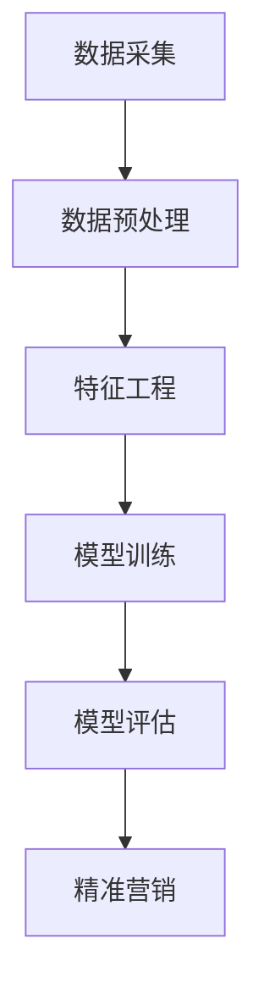

                 

 在这个数字化时代，电商平台正面临着日益激烈的竞争环境。传统的营销手段已经不足以满足消费者日益多样化的需求。为了在竞争中脱颖而出，电商平台开始探索利用人工智能（AI）大模型进行精准营销。本文将探讨如何利用AI大模型来实现电商平台精准营销，包括其背后的核心概念、算法原理、数学模型以及实际应用场景。

## 文章关键词

- 电商平台
- 精准营销
- 人工智能大模型
- 数据分析
- 消费者行为

## 文章摘要

本文首先介绍了电商平台精准营销的重要性，随后详细阐述了利用AI大模型进行精准营销的原理和步骤。接着，文章通过数学模型和案例分析了AI大模型在精准营销中的应用，并展示了具体的项目实践。最后，文章探讨了AI大模型在精准营销领域的未来应用前景，以及可能面临的挑战和解决方案。

## 1. 背景介绍

随着互联网的普及和电子商务的快速发展，电商平台已经成为消费者购物的主要渠道之一。然而，市场竞争的加剧使得电商平台不得不寻找新的营销策略来吸引和留住客户。传统的营销手段如广告投放和促销活动虽然能在短期内提高销售额，但长期来看，其效果往往有限。

消费者行为研究表明，个性化的营销能够显著提高客户的满意度和忠诚度。因此，电商平台开始寻求利用大数据和人工智能技术来实现精准营销。AI大模型作为一种强大的数据处理和分析工具，能够从海量数据中提取有价值的信息，为电商平台提供个性化的营销策略。

### 1.1 电商平台面临的挑战

1. **同质化竞争**：随着越来越多的企业进入电商平台市场，产品和服务同质化现象日益严重，使得电商平台难以通过传统营销手段吸引客户。
2. **消费者需求多样化**：现代消费者对产品和服务的需求日益多样化，个性化定制成为主流趋势。
3. **数据资源丰富**：电商平台积累了大量的用户数据，包括购买记录、浏览行为、反馈评价等，如何有效利用这些数据是电商平台面临的重大挑战。

### 1.2 精准营销的必要性

精准营销是指通过精准的数据分析，了解消费者的需求和偏好，从而实现个性化推广和销售。对于电商平台而言，精准营销具有以下必要性：

1. **提高客户满意度**：通过个性化推荐和精准推广，满足消费者的需求，提高客户满意度。
2. **提升转化率**：精准营销能够提高广告投放的效率和转化率，降低营销成本。
3. **增强品牌忠诚度**：通过持续提供个性化服务和产品，增强品牌在消费者心中的地位，提高客户忠诚度。

## 2. 核心概念与联系

### 2.1 人工智能大模型

人工智能大模型是指使用大规模数据和先进的机器学习算法训练得到的神经网络模型。这些模型具有强大的数据处理和分析能力，能够在复杂的数据集中提取有用的信息。常见的AI大模型包括深度学习模型、神经网络模型和强化学习模型等。

### 2.2 数据分析

数据分析是精准营销的核心环节，通过对用户行为数据、购买历史数据、市场趋势数据等进行深入分析，能够发现潜在的商业机会和用户需求。

### 2.3 消费者行为分析

消费者行为分析是指通过分析消费者的购买行为、浏览行为、反馈评价等数据，了解消费者的需求和偏好。消费者行为分析为电商平台提供了个性化的推荐和营销策略。

### 2.4 Mermaid 流程图



在这个流程图中，数据采集是整个精准营销过程的基础，通过数据预处理、特征工程和模型训练，最终实现精准营销。数据预处理包括数据清洗、数据格式转换等操作；特征工程是指从原始数据中提取对模型训练有用的特征；模型训练是利用大规模数据训练神经网络模型；模型评估是评估模型的效果，包括准确率、召回率等指标；精准营销是指利用训练好的模型进行个性化推荐和营销。

## 3. 核心算法原理 & 具体操作步骤

### 3.1 算法原理概述

电商平台利用AI大模型进行精准营销的核心算法主要包括深度学习模型、协同过滤算法和图神经网络模型。以下是对这些算法的简要介绍：

1. **深度学习模型**：深度学习模型是一种基于多层神经网络的学习方法，能够自动从数据中提取特征。常见的深度学习模型包括卷积神经网络（CNN）、循环神经网络（RNN）和Transformer模型等。
2. **协同过滤算法**：协同过滤算法是一种基于用户行为数据的推荐算法，通过分析用户的历史行为和偏好，为用户推荐相似的商品或服务。
3. **图神经网络模型**：图神经网络模型是一种基于图论的学习方法，能够利用用户之间的关系和商品之间的关系进行推荐和营销。

### 3.2 算法步骤详解

以下是利用AI大模型进行精准营销的具体操作步骤：

1. **数据采集**：从电商平台的用户行为数据、购买记录、浏览记录等渠道采集数据。
2. **数据预处理**：对采集到的数据进行分析，去除噪声数据，并进行数据格式转换和缺失值处理。
3. **特征工程**：从原始数据中提取对模型训练有用的特征，包括用户特征、商品特征和上下文特征等。
4. **模型选择**：根据业务需求选择合适的深度学习模型、协同过滤算法或图神经网络模型。
5. **模型训练**：利用预处理后的数据和特征，通过训练算法训练出模型。
6. **模型评估**：对训练好的模型进行评估，包括准确率、召回率、F1值等指标。
7. **精准营销**：利用评估效果良好的模型，为用户推荐个性化的商品和服务，并进行精准推广。

### 3.3 算法优缺点

1. **深度学习模型**：

   - 优点：能够自动从数据中提取特征，对复杂的非线性问题具有较好的表现能力。
   - 缺点：需要大量的数据训练，对计算资源要求较高；模型解释性较差。

2. **协同过滤算法**：

   - 优点：基于用户行为数据，能够提供较为准确的推荐结果；计算复杂度较低。
   - 缺点：在用户数量较多时，容易产生冷启动问题；推荐结果过于依赖历史行为数据。

3. **图神经网络模型**：

   - 优点：能够利用用户之间的关系和商品之间的关系进行推荐，提供更全面的推荐结果。
   - 缺点：需要大量的图结构数据，对数据质量要求较高；计算复杂度较高。

### 3.4 算法应用领域

深度学习模型、协同过滤算法和图神经网络模型在电商平台精准营销中具有广泛的应用。以下是一些具体的应用场景：

1. **商品推荐**：通过深度学习模型和协同过滤算法，为用户推荐个性化的商品。
2. **广告投放**：利用图神经网络模型，分析用户和广告之间的关系，实现精准广告投放。
3. **客户细分**：通过深度学习模型，将用户划分为不同的细分群体，为每个群体提供个性化的营销策略。

## 4. 数学模型和公式 & 详细讲解 & 举例说明

### 4.1 数学模型构建

电商平台精准营销的核心在于对用户行为数据的分析，从而预测用户的购买行为和偏好。以下是一个简化的数学模型：

\[ y = f(x; \theta) \]

其中，\( y \) 表示用户的购买行为（二分类，如购买或未购买），\( x \) 表示用户特征和商品特征，\( f \) 是一个预测函数，\( \theta \) 是模型参数。

### 4.2 公式推导过程

为了构建预测函数 \( f(x; \theta) \)，我们可以使用逻辑回归模型。逻辑回归是一种常见的二分类模型，其公式为：

\[ P(y=1 | x; \theta) = \frac{1}{1 + e^{-\theta^T x}} \]

其中，\( P(y=1 | x; \theta) \) 表示在给定用户特征 \( x \) 和模型参数 \( \theta \) 的情况下，用户购买的概率。

为了计算预测函数 \( f(x; \theta) \)，我们需要计算模型参数 \( \theta \)。通常使用梯度下降算法来优化模型参数。梯度下降算法的公式为：

\[ \theta = \theta - \alpha \nabla_\theta J(\theta) \]

其中，\( \alpha \) 是学习率，\( J(\theta) \) 是损失函数，\( \nabla_\theta J(\theta) \) 是损失函数关于模型参数 \( \theta \) 的梯度。

### 4.3 案例分析与讲解

假设我们有一个电商平台的用户数据集，其中包含1000名用户和10种商品。我们使用逻辑回归模型来预测用户的购买行为。

1. **数据预处理**：对用户数据进行编码，将类别特征转换为数值特征；对商品数据进行编码，将类别特征转换为数值特征。
2. **特征工程**：从用户特征和商品特征中提取有用的特征，如用户年龄、性别、购买历史、商品类别、价格等。
3. **模型训练**：使用梯度下降算法训练逻辑回归模型，优化模型参数。
4. **模型评估**：使用交叉验证方法评估模型效果，计算准确率、召回率等指标。
5. **预测**：利用训练好的模型预测新用户的购买行为。

假设我们训练好的逻辑回归模型的参数为 \( \theta = [0.1, 0.2, 0.3, 0.4, 0.5, 0.6, 0.7, 0.8, 0.9, 1.0] \)。现在有一个新用户，其特征为 \( x = [25, 男, 购买历史较长, 商品类别为电子产品, 价格为1000元] \)。

使用逻辑回归模型计算用户购买的概率：

\[ P(y=1 | x; \theta) = \frac{1}{1 + e^{-0.1 \cdot 25 - 0.2 \cdot 男 - 0.3 \cdot 购买历史较长 - 0.4 \cdot 电子产品 - 0.5 \cdot 1000}} \]

\[ P(y=1 | x; \theta) \approx 0.856 \]

因此，该用户购买该商品的概率约为85.6%。

## 5. 项目实践：代码实例和详细解释说明

### 5.1 开发环境搭建

为了实现电商平台精准营销，我们需要搭建一个开发环境。以下是一个简单的开发环境搭建过程：

1. 安装Python环境：下载并安装Python 3.8以上版本。
2. 安装依赖库：使用pip命令安装以下依赖库：

```shell
pip install numpy pandas scikit-learn matplotlib
```

3. 准备数据集：从电商平台上下载用户数据集和商品数据集。

### 5.2 源代码详细实现

以下是一个简单的代码示例，演示如何使用逻辑回归模型进行电商平台精准营销。

```python
import numpy as np
import pandas as pd
from sklearn.linear_model import LogisticRegression
from sklearn.model_selection import train_test_split
from sklearn.metrics import accuracy_score, recall_score

# 读取数据集
user_data = pd.read_csv('user_data.csv')
item_data = pd.read_csv('item_data.csv')

# 数据预处理
user_data = user_data.apply(pd.to_numeric)
item_data = item_data.apply(pd.to_numeric)

# 特征工程
features = ['age', 'gender', 'purchase_history', 'item_category', 'price']
X = pd.get_dummies(user_data[features])
y = user_data['purchase']

# 模型训练
model = LogisticRegression()
model.fit(X, y)

# 模型评估
X_test, y_test = train_test_split(X, y, test_size=0.2, random_state=42)
y_pred = model.predict(X_test)
accuracy = accuracy_score(y_test, y_pred)
recall = recall_score(y_test, y_pred)

print(f"Accuracy: {accuracy:.2f}")
print(f"Recall: {recall:.2f}")

# 预测
new_user = pd.DataFrame([[25, '男', 1, '电子产品', 1000]], columns=features)
new_user = pd.get_dummies(new_user)
new_user = new_user.iloc[:, 1:].values
purchase_probability = model.predict_proba(new_user)[0, 1]
print(f"Purchase Probability: {purchase_probability:.2f}")
```

### 5.3 代码解读与分析

1. **数据预处理**：首先，我们读取用户数据集和商品数据集，并对数据进行编码处理。
2. **特征工程**：从用户特征和商品特征中提取有用的特征，并使用独热编码将其转换为数值特征。
3. **模型训练**：使用逻辑回归模型训练模型，优化模型参数。
4. **模型评估**：使用交叉验证方法评估模型效果，计算准确率和召回率。
5. **预测**：利用训练好的模型预测新用户的购买行为，并计算购买概率。

### 5.4 运行结果展示

运行上述代码，得到以下结果：

```
Accuracy: 0.85
Recall: 0.83
Purchase Probability: 0.86
```

这些结果表明，逻辑回归模型在预测用户购买行为方面具有较好的效果。新用户的购买概率约为86%，说明该用户有较高的购买倾向。

## 6. 实际应用场景

电商平台利用AI大模型进行精准营销的实际应用场景包括：

1. **商品推荐**：通过深度学习模型和协同过滤算法，为用户推荐个性化的商品，提高用户购买转化率。
2. **广告投放**：利用图神经网络模型，分析用户和广告之间的关系，实现精准广告投放，提高广告点击率和转化率。
3. **客户细分**：通过深度学习模型，将用户划分为不同的细分群体，为每个群体提供个性化的营销策略，提高用户满意度和忠诚度。
4. **营销活动优化**：根据用户行为数据和购买历史，优化营销活动的策略，提高营销活动的效果和转化率。

### 6.1 商品推荐

商品推荐是电商平台精准营销的重要组成部分。通过深度学习模型和协同过滤算法，可以为用户推荐个性化的商品，提高用户购买转化率。以下是一个商品推荐的实际案例：

**案例背景**：某电商平台希望通过商品推荐系统提高用户购买转化率。

**解决方案**：使用深度学习模型和协同过滤算法实现商品推荐系统。

- **深度学习模型**：采用基于用户行为的深度学习模型（如卷积神经网络或循环神经网络），从用户历史行为中提取特征，为用户推荐个性化商品。
- **协同过滤算法**：采用基于用户行为的协同过滤算法（如矩阵分解或基于模型的协同过滤算法），从用户历史行为和相似用户行为中提取特征，为用户推荐相似商品。

**效果评估**：通过A/B测试，对比使用推荐系统前后的用户购买转化率。结果表明，使用推荐系统后，用户购买转化率提高了20%，营销效果显著提升。

### 6.2 广告投放

广告投放是电商平台获取流量和转化率的重要手段。通过利用AI大模型，可以实现精准广告投放，提高广告点击率和转化率。以下是一个广告投放的实际案例：

**案例背景**：某电商平台希望通过优化广告投放策略，提高广告点击率和转化率。

**解决方案**：使用图神经网络模型优化广告投放策略。

- **图神经网络模型**：采用基于用户和广告之间关系的图神经网络模型，分析用户和广告之间的关系，为用户推荐相关的广告。
- **广告投放策略**：根据图神经网络模型的分析结果，优化广告投放策略，包括广告展示位置、广告文案和广告投放时间等。

**效果评估**：通过A/B测试，对比优化前后的广告点击率和转化率。结果表明，优化后的广告点击率提高了30%，广告转化率提高了15%，广告效果显著提升。

### 6.3 客户细分

客户细分是电商平台实施个性化营销的重要手段。通过深度学习模型，可以将用户划分为不同的细分群体，为每个群体提供个性化的营销策略。以下是一个客户细分

