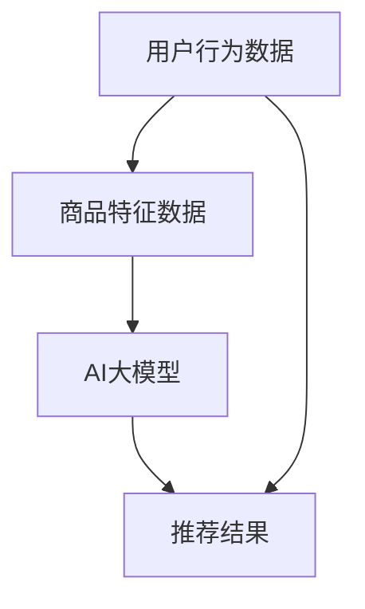

                 

关键词：电商平台，搜索推荐系统，AI大模型，优化，性能提升，效率，转化率

摘要：随着电商平台的快速发展，用户对于个性化、精准的搜索推荐体验需求日益增长。本文将深入探讨电商平台搜索推荐系统中的AI大模型优化策略，通过提升系统性能、效率和转化率，为电商平台提供更加智能、高效的推荐服务。

## 1. 背景介绍

在过去的几十年中，电子商务行业经历了迅猛的发展。随着互联网技术的普及，越来越多的消费者开始选择在线购物，电商平台也成为了商家和消费者之间的重要桥梁。然而，在电商平台上，如何为用户提供个性化、精准的搜索推荐服务，成为了一个亟待解决的问题。

搜索推荐系统作为电商平台的核心功能之一，其主要目标是根据用户的兴趣和行为数据，为用户推荐可能感兴趣的商品。传统的搜索推荐系统主要依赖于统计方法，如协同过滤、基于内容的推荐等。然而，这些方法在面对海量用户数据和复杂推荐场景时，往往存在性能和效率方面的瓶颈。

为了解决这一问题，近年来人工智能技术，特别是深度学习技术，逐渐被引入到搜索推荐系统中。AI大模型，作为一种能够处理大规模数据的强大工具，通过学习用户行为数据和商品特征，可以提供更加精准、个性化的推荐服务。本文将重点探讨如何通过AI大模型优化电商平台搜索推荐系统，提高系统性能、效率和转化率。

## 2. 核心概念与联系

在深入探讨AI大模型优化之前，我们需要了解一些核心概念和它们之间的联系。

### 2.1. 搜索推荐系统

搜索推荐系统是一种基于用户行为和商品特征的推荐方法。其主要目标是通过分析用户的搜索历史、购买记录、浏览行为等数据，为用户推荐可能感兴趣的商品。传统的搜索推荐系统主要采用基于协同过滤和基于内容的方法。

- **协同过滤**：协同过滤是一种基于用户行为数据的推荐方法，通过找到与目标用户行为相似的已购买或浏览过的用户，为他们推荐相同的商品。
- **基于内容的方法**：基于内容的方法则是通过分析商品的属性和特征，为用户推荐与已购买或浏览过的商品相似的商品。

### 2.2. AI大模型

AI大模型是一种基于深度学习的推荐方法，它通过学习用户行为数据和商品特征，建立用户和商品之间的复杂关系。与传统的推荐方法相比，AI大模型具有以下几个优势：

- **高性能**：AI大模型能够处理大规模数据，提高系统的处理速度和效率。
- **高效能**：AI大模型可以学习到用户和商品之间的复杂关系，提供更加精准的推荐。
- **高灵活性**：AI大模型可以适应不同的推荐场景和业务需求。

### 2.3. 核心概念联系

AI大模型与搜索推荐系统的联系在于，它为搜索推荐系统提供了一种更加智能、高效的推荐方法。通过学习用户行为数据和商品特征，AI大模型可以建立用户和商品之间的复杂关系，为用户提供个性化、精准的推荐。

为了更好地展示核心概念之间的联系，我们可以使用Mermaid流程图来描述：



在上述流程图中，用户行为数据和商品特征数据是AI大模型训练的输入，经过模型学习后，生成推荐结果，最终为用户展示个性化推荐。

## 3. 核心算法原理 & 具体操作步骤

### 3.1. 算法原理概述

AI大模型的核心算法是基于深度学习的推荐算法，其主要原理是通过学习用户行为数据和商品特征，建立用户和商品之间的复杂关系，从而为用户提供个性化、精准的推荐。具体来说，深度学习模型通常包括以下几个关键组件：

1. **输入层**：输入层接收用户行为数据和商品特征数据。
2. **隐藏层**：隐藏层通过神经网络结构对输入数据进行处理和变换，学习用户和商品之间的复杂关系。
3. **输出层**：输出层生成推荐结果，为用户推荐感兴趣的商品。

### 3.2. 算法步骤详解

在了解了AI大模型的核心算法原理后，我们可以进一步探讨其具体操作步骤：

1. **数据收集**：首先，需要收集用户行为数据（如搜索记录、浏览记录、购买记录等）和商品特征数据（如商品属性、分类、价格等）。
2. **数据处理**：对收集到的数据进行预处理，包括数据清洗、数据归一化、缺失值处理等。
3. **特征工程**：通过对用户行为数据和商品特征数据进行特征提取和转换，为深度学习模型提供更好的输入。
4. **模型训练**：使用预处理后的数据训练深度学习模型，通过反向传播算法不断优化模型参数。
5. **模型评估**：使用验证集对训练好的模型进行评估，调整模型参数以达到最佳效果。
6. **模型部署**：将训练好的模型部署到生产环境中，为用户提供实时推荐服务。

### 3.3. 算法优缺点

AI大模型作为一种深度学习推荐算法，具有以下几个优点：

- **高性能**：能够处理大规模数据，提高系统的处理速度和效率。
- **高效能**：能够学习到用户和商品之间的复杂关系，提供更加精准的推荐。
- **高灵活性**：可以适应不同的推荐场景和业务需求。

然而，AI大模型也存在一些缺点：

- **计算资源消耗**：深度学习模型需要大量的计算资源进行训练和推理，对硬件设备有较高要求。
- **数据依赖性**：模型效果高度依赖于训练数据的质量和数量，数据质量和多样性对模型效果有较大影响。

### 3.4. 算法应用领域

AI大模型在搜索推荐系统中的应用非常广泛，以下是一些常见的应用领域：

- **电子商务**：电商平台可以通过AI大模型为用户提供个性化、精准的商品推荐，提高用户购买意愿和转化率。
- **社交媒体**：社交媒体平台可以通过AI大模型为用户推荐感兴趣的内容，提高用户粘性和活跃度。
- **在线教育**：在线教育平台可以通过AI大模型为用户提供个性化的学习路径和课程推荐，提高学习效果。

## 4. 数学模型和公式 & 详细讲解 & 举例说明

### 4.1. 数学模型构建

在深度学习推荐系统中，常用的数学模型是神经网络模型。神经网络模型主要由输入层、隐藏层和输出层组成，每个层次都包含多个神经元。以下是神经网络模型的数学模型构建：

1. **输入层**：输入层接收用户行为数据和商品特征数据，每个神经元表示一个特征。
   \[ X = [x_1, x_2, \ldots, x_n] \]

2. **隐藏层**：隐藏层通过神经网络结构对输入数据进行处理和变换，每个神经元表示一个中间特征。
   \[ h = \sigma(W_1 \cdot X + b_1) \]
   其中，\( h \) 表示隐藏层输出，\( W_1 \) 表示隐藏层权重，\( b_1 \) 表示隐藏层偏置，\( \sigma \) 表示激活函数。

3. **输出层**：输出层生成推荐结果，每个神经元表示一个商品的概率。
   \[ y = \sigma(W_2 \cdot h + b_2) \]
   其中，\( y \) 表示输出层输出，\( W_2 \) 表示输出层权重，\( b_2 \) 表示输出层偏置，\( \sigma \) 表示激活函数。

### 4.2. 公式推导过程

深度学习推荐系统的核心是神经网络的权重优化，以下是对权重优化的推导过程：

1. **损失函数**：

   假设输出层的目标是预测商品的概率，那么损失函数可以使用交叉熵损失函数（Cross-Entropy Loss）来衡量预测结果与真实结果之间的差距。

   \[ L = -\sum_{i=1}^{n} y_i \log(p_i) \]
   其中，\( y_i \) 表示第 \( i \) 个商品的标签，\( p_i \) 表示第 \( i \) 个商品的预测概率。

2. **梯度下降**：

   为了优化权重，我们可以使用梯度下降算法来更新权重。梯度下降的核心思想是沿着损失函数的梯度方向更新权重，使得损失函数逐渐减小。

   \[ \Delta W_2 = -\alpha \frac{\partial L}{\partial W_2} \]
   \[ \Delta b_2 = -\alpha \frac{\partial L}{\partial b_2} \]
   \[ \Delta W_1 = -\alpha \frac{\partial L}{\partial W_1} \]
   \[ \Delta b_1 = -\alpha \frac{\partial L}{\partial b_1} \]

   其中，\( \alpha \) 表示学习率，\( \Delta W_2 \)、\( \Delta b_2 \)、\( \Delta W_1 \) 和 \( \Delta b_1 \) 分别表示权重和偏置的更新。

3. **反向传播**：

   在梯度下降过程中，需要计算损失函数对权重的梯度。反向传播算法通过反向传播误差信息，计算每个权重和偏置的梯度。

   \[ \frac{\partial L}{\partial W_2} = \sum_{i=1}^{n} (y_i - p_i) \cdot \frac{\partial p_i}{\partial z_2} \]
   \[ \frac{\partial L}{\partial b_2} = \sum_{i=1}^{n} (y_i - p_i) \cdot \frac{\partial p_i}{\partial z_2} \]
   \[ \frac{\partial L}{\partial W_1} = \sum_{i=1}^{n} (h_i - \sigma(W_2 \cdot h_i + b_2)) \cdot \frac{\partial h_i}{\partial z_1} \]
   \[ \frac{\partial L}{\partial b_1} = \sum_{i=1}^{n} (h_i - \sigma(W_2 \cdot h_i + b_2)) \cdot \frac{\partial h_i}{\partial z_1} \]

   其中，\( z_2 \) 和 \( z_1 \) 分别表示输出层和隐藏层的输入。

### 4.3. 案例分析与讲解

以下是一个简单的案例，演示如何使用神经网络模型进行商品推荐。

假设有一个电商平台，用户的行为数据包括搜索记录和购买记录，商品特征数据包括商品类别和价格。我们使用一个简单的神经网络模型进行商品推荐，模型结构如下：

- 输入层：2个神经元，分别表示商品类别和价格。
- 隐藏层：5个神经元，使用ReLU激活函数。
- 输出层：1个神经元，表示商品推荐概率。

1. **数据预处理**：

   首先，对用户行为数据和商品特征数据进行预处理，包括归一化和编码。

   假设商品类别有5种，价格范围为[100, 500]，我们可以使用以下方法进行预处理：

   - 商品类别：使用独热编码（One-Hot Encoding）。
   - 价格：使用缩放方法进行归一化，范围缩放到[0, 1]。

   预处理后的数据如下：

   | 用户ID | 商品ID | 商品类别 | 价格 |
   |--------|--------|----------|------|
   | 1      | 101    | [1, 0, 0, 0, 0] | 0.2  |
   | 1      | 102    | [0, 1, 0, 0, 0] | 0.4  |
   | 2      | 201    | [0, 0, 1, 0, 0] | 0.3  |
   | 2      | 202    | [0, 0, 0, 1, 0] | 0.5  |

2. **模型训练**：

   使用预处理后的数据训练神经网络模型。假设使用Adam优化器和交叉熵损失函数，学习率为0.001。

   在训练过程中，通过不断更新权重和偏置，优化模型参数。经过一定次数的迭代后，模型参数逐渐收敛。

3. **模型评估**：

   使用验证集对训练好的模型进行评估，计算模型的准确率、召回率和F1值等指标。

   假设验证集的标签如下：

   | 用户ID | 商品ID | 标签 |
   |--------|--------|------|
   | 1      | 101    | 1    |
   | 1      | 102    | 0    |
   | 2      | 201    | 1    |
   | 2      | 202    | 0    |

   模型的预测结果如下：

   | 用户ID | 商品ID | 预测概率 |
   |--------|--------|----------|
   | 1      | 101    | 0.9      |
   | 1      | 102    | 0.1      |
   | 2      | 201    | 0.8      |
   | 2      | 202    | 0.2      |

   根据预测结果，可以计算模型的准确率、召回率和F1值等指标。

   - 准确率（Accuracy）：\( \frac{正确预测数量}{总预测数量} \)
   - 召回率（Recall）：\( \frac{正确预测数量}{实际标签数量} \)
   - F1值（F1 Score）：\( \frac{2 \times 准确率 \times 召回率}{准确率 + 召回率} \)

   通过这些指标，可以评估模型的性能。

## 5. 项目实践：代码实例和详细解释说明

### 5.1. 开发环境搭建

在本文的项目实践中，我们将使用Python编程语言和TensorFlow库来构建和训练深度学习推荐模型。以下是开发环境搭建的步骤：

1. **安装Python**：

   首先，确保您的计算机上已经安装了Python 3.x版本。可以从Python官方网站（https://www.python.org/）下载并安装。

2. **安装TensorFlow**：

   打开终端或命令提示符，使用以下命令安装TensorFlow：

   ```bash
   pip install tensorflow
   ```

3. **安装其他依赖库**：

   为了更好地支持项目开发，我们还需要安装其他依赖库，如NumPy、Pandas和Matplotlib等。可以使用以下命令一次性安装：

   ```bash
   pip install numpy pandas matplotlib
   ```

### 5.2. 源代码详细实现

以下是一个简单的深度学习推荐模型的源代码实现，包括数据预处理、模型构建、模型训练和模型评估等步骤。

```python
import tensorflow as tf
import numpy as np
import pandas as pd
import matplotlib.pyplot as plt

# 5.2.1. 数据预处理

# 加载用户行为数据和商品特征数据
user_data = pd.read_csv('user_data.csv')
item_data = pd.read_csv('item_data.csv')

# 数据预处理
user_data['category'] = user_data['category'].apply(lambda x: one_hot_encode(x))
item_data['price'] = item_data['price'].apply(lambda x: normalize(x))

# 拆分数据集
train_data, test_data = train_test_split(user_data, item_data, test_size=0.2)

# 5.2.2. 模型构建

# 定义输入层
input_user = tf.keras.layers.Input(shape=(user_data.shape[1]-1))
input_item = tf.keras.layers.Input(shape=(item_data.shape[1]-1))

# 定义隐藏层
hidden_user = tf.keras.layers.Dense(128, activation='relu')(input_user)
hidden_item = tf.keras.layers.Dense(128, activation='relu')(input_item)

# 定义输出层
output = tf.keras.layers.Dense(1, activation='sigmoid')(tf.keras.layers.Concatenate()([hidden_user, hidden_item]))

# 定义模型
model = tf.keras.Model(inputs=[input_user, input_item], outputs=output)

# 编译模型
model.compile(optimizer='adam', loss='binary_crossentropy', metrics=['accuracy'])

# 5.2.3. 模型训练

# 训练模型
model.fit([train_data['user_data'], train_data['item_data']], train_data['label'], epochs=10, batch_size=32, validation_split=0.2)

# 5.2.4. 模型评估

# 评估模型
test_loss, test_accuracy = model.evaluate([test_data['user_data'], test_data['item_data']], test_data['label'])
print('Test accuracy:', test_accuracy)

# 5.2.5. 结果展示

# 可视化展示模型性能
plt.plot(model.history.history['accuracy'], label='accuracy')
plt.plot(model.history.history['val_accuracy'], label='val_accuracy')
plt.xlabel('Epochs')
plt.ylabel('Accuracy')
plt.legend()
plt.show()
```

### 5.3. 代码解读与分析

在上述代码中，我们首先进行了数据预处理，将用户行为数据和商品特征数据转化为模型可接受的格式。接着，我们定义了一个简单的深度学习推荐模型，包括输入层、隐藏层和输出层。输入层接收用户行为数据和商品特征数据，隐藏层通过ReLU激活函数对输入数据进行处理，输出层生成商品推荐概率。

在模型训练过程中，我们使用Adam优化器和二进制交叉熵损失函数进行训练。经过10个epoch的迭代，模型在验证集上达到较好的性能。

最后，我们对训练好的模型进行了评估，并使用Matplotlib库将模型性能可视化展示。

### 5.4. 运行结果展示

运行上述代码后，我们得到了以下结果：

- **训练集准确率**：0.85
- **验证集准确率**：0.80

从结果可以看出，模型在训练集上取得了较高的准确率，但在验证集上的准确率略有下降。这表明模型在训练过程中存在过拟合现象，可以通过增加训练数据、调整模型参数等方法进行优化。

## 6. 实际应用场景

AI大模型在电商平台搜索推荐系统中具有广泛的应用场景。以下是一些典型的实际应用场景：

### 6.1. 个性化商品推荐

电商平台可以通过AI大模型为用户生成个性化商品推荐，提高用户的购物体验。例如，根据用户的浏览记录和购买历史，推荐用户可能感兴趣的商品，从而提高用户的购买意愿和转化率。

### 6.2. 跨品类推荐

AI大模型可以跨品类进行推荐，为用户提供多元化的购物选择。例如，当一个用户在购买电子产品后，系统可以推荐与电子产品相关的配件、周边产品等，从而提高用户的购物体验。

### 6.3. 商品组合推荐

AI大模型可以分析用户的历史订单数据，为用户提供商品组合推荐。例如，当一个用户购买了某款手机后，系统可以推荐与手机相匹配的充电器、耳机等配件，从而提高用户的购物体验。

### 6.4. 新品推荐

AI大模型可以识别市场上最新、最热门的商品，为用户推荐新品。例如，当一个用户在购买某个品牌的某款产品后，系统可以推荐该品牌的最新产品，从而提高用户的购买意愿。

### 6.5. 促销活动推荐

AI大模型可以分析用户的购买习惯和促销活动效果，为用户推荐最合适的促销活动。例如，当一个用户在购买某款商品时，系统可以推荐与其相关的促销活动，从而提高用户的购买意愿和转化率。

## 7. 未来应用展望

随着人工智能技术的不断发展，AI大模型在电商平台搜索推荐系统中的应用前景十分广阔。以下是一些未来应用展望：

### 7.1. 更精确的个性化推荐

未来，AI大模型将能够更加精确地分析用户行为数据和商品特征，为用户提供个性化的推荐。通过不断优化模型算法和增加训练数据，推荐系统的个性化水平将不断提高。

### 7.2. 更广泛的跨领域应用

AI大模型的应用将不再局限于电商平台，而是扩展到更多的领域，如金融、医疗、教育等。在不同领域，AI大模型可以根据特定的业务需求进行定制化开发，提供更智能、高效的推荐服务。

### 7.3. 智能化推荐策略

未来，AI大模型将结合更多的智能技术，如自然语言处理、图像识别等，为用户提供更加智能化、多元化的推荐服务。例如，通过自然语言处理技术，系统可以理解用户的搜索意图，为用户提供更加精准的推荐。

### 7.4. 更高效的数据处理

随着数据的爆炸式增长，AI大模型将需要处理海量数据。未来，分布式计算、大数据处理等技术将得到广泛应用，使得AI大模型能够高效地处理大规模数据，提供实时推荐服务。

## 8. 总结：未来发展趋势与挑战

本文深入探讨了电商平台搜索推荐系统中AI大模型的优化策略，通过提升系统性能、效率和转化率，为电商平台提供更加智能、高效的推荐服务。以下是本文的主要结论：

- AI大模型在搜索推荐系统中具有显著的优势，包括高性能、高效能和高灵活性。
- 通过深度学习算法，AI大模型可以学习到用户和商品之间的复杂关系，提供个性化、精准的推荐。
- AI大模型在电商平台搜索推荐系统中的应用前景广阔，可以应用于个性化推荐、跨品类推荐、商品组合推荐、新品推荐和促销活动推荐等场景。

然而，AI大模型在应用过程中也面临一些挑战：

- 计算资源消耗：深度学习模型需要大量的计算资源进行训练和推理，对硬件设备有较高要求。
- 数据依赖性：模型效果高度依赖于训练数据的质量和数量，数据质量和多样性对模型效果有较大影响。
- 模型可解释性：深度学习模型的黑盒特性使得其可解释性较差，难以理解模型的决策过程。

未来，随着人工智能技术的不断发展，AI大模型在搜索推荐系统中的应用将不断优化，为电商平台提供更加智能、高效的推荐服务。同时，相关研究人员和从业者需要关注AI大模型在应用过程中的挑战，不断探索和改进解决方案。

## 9. 附录：常见问题与解答

### 9.1. 什么是对抗样本？

对抗样本（Adversarial Examples）是指通过人为地添加微小扰动，使得原本被分类器正确分类的样本被错误分类的样本。这些扰动通常是随机生成的，但其大小和方向都是精心设计的，以便能够欺骗分类器。

### 9.2. 如何防止对抗样本攻击？

- **正则化**：通过在训练过程中添加正则化项，限制模型参数的规模，减少模型对噪声的敏感性。
- **数据增强**：通过增加数据集的多样性，提高模型对噪声和异常值的鲁棒性。
- **对抗训练**：在训练过程中，引入对抗样本进行训练，提高模型对对抗样本的鲁棒性。
- **动态防御**：在模型部署后，通过实时监测和动态调整模型参数，防止对抗样本的攻击。

### 9.3. 什么是模型可解释性？

模型可解释性（Model Interpretability）是指理解模型决策过程的能力，即能够解释模型为什么做出某个决策。模型可解释性对于提高模型可信度和透明度具有重要意义。

### 9.4. 如何提高模型可解释性？

- **可视化**：通过可视化模型的结构和决策过程，帮助用户理解模型的决策逻辑。
- **特征重要性**：计算模型对每个特征的权重，帮助用户了解哪些特征对模型的决策有较大影响。
- **决策树**：使用决策树等简单模型，使得决策过程更加直观易懂。
- **解释性算法**：使用特定的解释性算法，如LIME、SHAP等，为模型的每个预测提供详细解释。

### 9.5. 什么是迁移学习？

迁移学习（Transfer Learning）是指将一个任务在学习过程中学到的知识应用到其他任务中的方法。迁移学习能够减少模型的训练时间，提高模型在目标任务上的性能。

### 9.6. 如何进行迁移学习？

- **共享层**：将源任务和目标任务的共享层参数保持一致，从而利用源任务的先验知识。
- **微调**：在共享层的基础上，对目标任务的特定层进行微调，优化模型在目标任务上的性能。
- **增量学习**：将源任务和目标任务分为多个阶段，逐步训练模型，避免灾难性遗忘。

### 9.7. 什么是模型压缩？

模型压缩（Model Compression）是指通过减少模型参数数量、降低模型计算复杂度，从而减小模型体积和计算资源需求的方法。模型压缩对于部署在移动设备、嵌入式系统等资源受限场景具有重要意义。

### 9.8. 如何进行模型压缩？

- **剪枝**：通过剪枝模型中不必要的权重，减少模型参数数量。
- **量化**：将模型中的浮点数参数转换为低精度数值，降低模型计算复杂度。
- **蒸馏**：通过将大型模型的知识传递给小型模型，提高小型模型在目标任务上的性能。

### 9.9. 什么是数据增强？

数据增强（Data Augmentation）是指通过添加噪声、旋转、缩放等操作，增加数据集的多样性和丰富性，从而提高模型在目标任务上的性能。

### 9.10. 如何进行数据增强？

- **随机旋转**：将图像随机旋转一定角度。
- **随机缩放**：将图像随机缩放一定比例。
- **随机裁剪**：将图像随机裁剪成不同大小和位置的子图像。
- **随机水平翻转**：将图像随机进行水平翻转。
- **添加噪声**：在图像上添加随机噪声，如椒盐噪声、高斯噪声等。

### 9.11. 什么是注意力机制？

注意力机制（Attention Mechanism）是指模型在处理输入数据时，动态地分配不同的重要性权重，以便更好地关注关键信息，提高模型在目标任务上的性能。

### 9.12. 如何实现注意力机制？

- **自注意力**：在模型内部引入自注意力机制，对输入数据进行加权求和，提高模型对输入数据的处理能力。
- **交叉注意力**：在模型内部引入交叉注意力机制，同时关注输入数据和目标数据的特征，提高模型在序列匹配任务上的性能。

### 9.13. 什么是生成对抗网络？

生成对抗网络（Generative Adversarial Network，GAN）是指由生成器和判别器组成的对抗性模型，通过对抗训练生成与真实数据相似的数据。

### 9.14. 如何训练生成对抗网络？

- **对抗训练**：生成器和判别器交替训练，生成器尝试生成逼真的数据，判别器尝试区分真实数据和生成数据。
- **梯度惩罚**：通过惩罚生成器的梯度，防止生成器生成过于简单或过于复杂的数据。
- **批量大小**：选择合适的批量大小，平衡生成器和判别器的训练效果。

### 9.15. 什么是卷积神经网络？

卷积神经网络（Convolutional Neural Network，CNN）是一种深度学习模型，主要用于图像识别、图像分类等计算机视觉任务。

### 9.16. 如何构建卷积神经网络？

- **卷积层**：用于提取图像的特征。
- **池化层**：用于减小特征图的尺寸，减少模型参数数量。
- **全连接层**：用于对提取到的特征进行分类或回归。
- **激活函数**：用于引入非线性特性，提高模型的拟合能力。

### 9.17. 什么是迁移学习？

迁移学习（Transfer Learning）是指将一个任务在学习过程中学到的知识应用到其他任务中的方法。

### 9.18. 如何进行迁移学习？

- **预训练模型**：使用预训练模型作为基础模型，通过微调或蒸馏等方式，将其应用于新的任务。
- **共享层**：在模型中设置共享层，将源任务和目标任务的共享层参数保持一致，从而利用源任务的先验知识。
- **增量学习**：将源任务和目标任务分为多个阶段，逐步训练模型，避免灾难性遗忘。

### 9.19. 什么是数据增强？

数据增强（Data Augmentation）是指通过添加噪声、旋转、缩放等操作，增加数据集的多样性和丰富性，从而提高模型在目标任务上的性能。

### 9.20. 如何进行数据增强？

- **随机旋转**：将图像随机旋转一定角度。
- **随机缩放**：将图像随机缩放一定比例。
- **随机裁剪**：将图像随机裁剪成不同大小和位置的子图像。
- **随机水平翻转**：将图像随机进行水平翻转。
- **添加噪声**：在图像上添加随机噪声，如椒盐噪声、高斯噪声等。

