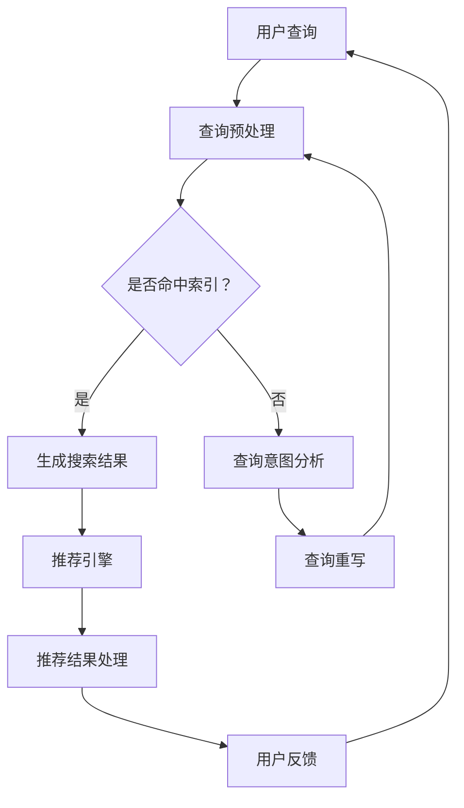

                 

关键词：电商平台、搜索推荐系统、AI大模型、性能优化、效率提升、准确率、多样性

## 1. 背景介绍

电商平台在当今数字经济中扮演着至关重要的角色。随着互联网的普及和在线购物的便捷性，消费者对于电商平台的依赖程度日益增加。然而，随着平台规模的扩大和用户数量的激增，如何提供高效、准确的搜索和推荐服务成为电商平台面临的重要挑战。

搜索推荐系统作为电商平台的核心功能之一，直接影响用户的购物体验和平台的商业利益。传统的搜索推荐系统主要依赖基于关键词匹配的算法，这种方式在处理大量数据时往往存在效率低、准确率不高、推荐结果单一等问题。随着人工智能技术的发展，尤其是深度学习和自然语言处理技术的应用，大模型在搜索推荐系统中展现出了巨大的潜力。

本文旨在探讨如何利用AI大模型优化电商平台的搜索推荐系统，从提高系统性能、效率、准确率和多样性等方面进行深入分析。通过本文的研究，希望能够为电商平台提供有效的技术方案，提升用户体验，促进商业增长。

## 2. 核心概念与联系

### 2.1. 电商平台搜索推荐系统的组成

电商平台搜索推荐系统通常包括以下几个主要组成部分：

- **用户行为数据收集**：通过用户在平台上的点击、购买、浏览等行为数据，收集用户兴趣和行为特征。
- **商品信息管理**：维护和管理商品的各种属性，如标题、描述、价格、分类等。
- **搜索引擎**：实现商品的快速检索，为用户提供精准的搜索结果。
- **推荐引擎**：基于用户行为数据和商品信息，为用户推荐可能感兴趣的商品。

### 2.2. 大模型在搜索推荐系统中的应用

大模型（如BERT、GPT等）在搜索推荐系统中发挥重要作用，主要体现在以下几个方面：

- **语义理解**：大模型通过深度学习技术，能够理解用户的查询意图和商品描述的语义，从而提供更准确的搜索结果。
- **上下文感知**：大模型能够处理复杂的上下文信息，提高推荐的多样性。
- **个性化推荐**：大模型可以基于用户的个性化行为数据，生成高度个性化的推荐结果。

### 2.3. Mermaid 流程图展示

下面是一个简化的Mermaid流程图，展示电商平台搜索推荐系统的核心流程：



### 2.4. 大模型与搜索推荐系统的关系

大模型在搜索推荐系统中的应用，可以看作是对传统方法的升华。传统方法通常基于规则或者简单的机器学习模型，而大模型通过其强大的语义理解和上下文感知能力，能够显著提升系统的性能和用户体验。

## 3. 核心算法原理 & 具体操作步骤

### 3.1. 算法原理概述

搜索推荐系统的核心算法通常可以分为以下几类：

- **基于内容的推荐**：根据用户的历史行为和商品的属性进行匹配，推荐相似的商品。
- **协同过滤推荐**：通过分析用户之间的相似性，为用户推荐其他用户喜欢的商品。
- **基于模型的推荐**：使用深度学习模型（如神经网络）对用户行为和商品特征进行建模，生成推荐结果。

AI大模型在推荐系统中主要利用的是基于模型的推荐方法，特别是深度学习模型。深度学习模型能够通过自动特征提取，从原始数据中学习到更高级的特征，从而提高推荐的准确性。

### 3.2. 算法步骤详解

#### 3.2.1. 数据收集与预处理

- **数据收集**：收集用户的行为数据和商品信息。行为数据包括用户的点击、购买、浏览等行为；商品信息包括商品标题、描述、分类、价格等。
- **数据预处理**：清洗数据，去除无效和噪声数据；对文本数据进行分词、去停用词、词干提取等预处理。

#### 3.2.2. 用户行为特征提取

- **行为序列建模**：使用循环神经网络（RNN）或者Transformer模型，对用户的历史行为序列进行建模，提取行为特征。
- **用户兴趣建模**：使用聚类或者主题模型，从用户行为数据中提取用户的兴趣特征。

#### 3.2.3. 商品特征提取

- **商品属性提取**：从商品信息中提取出商品的属性特征，如标题、描述、分类、价格等。
- **商品嵌入**：使用词向量模型（如Word2Vec、BERT等），将商品属性转换为嵌入向量。

#### 3.2.4. 模型训练

- **模型选择**：选择适合的深度学习模型，如BERT、GPT、Transformer等。
- **模型训练**：使用用户行为特征和商品特征，训练深度学习模型，得到用户和商品的嵌入向量。

#### 3.2.5. 推荐生成

- **推荐策略**：根据用户和商品的嵌入向量，计算用户对商品的偏好分数。
- **推荐结果处理**：根据偏好分数，生成推荐列表，并进行排序。

### 3.3. 算法优缺点

#### 优点：

- **高准确率**：通过深度学习模型，能够从数据中自动提取特征，提高推荐的准确性。
- **灵活性**：大模型能够处理复杂的上下文信息，实现更灵活的推荐。
- **个性化**：基于用户的行为数据和兴趣建模，实现高度个性化的推荐。

#### 缺点：

- **计算资源消耗大**：大模型通常需要大量的计算资源和存储空间。
- **训练时间较长**：大模型的训练过程通常需要较长的时间。

### 3.4. 算法应用领域

- **电商平台**：优化搜索和推荐系统，提升用户体验。
- **社交媒体**：为用户提供个性化的内容推荐。
- **在线教育**：为学习者推荐合适的学习资源和课程。

## 4. 数学模型和公式 & 详细讲解 & 举例说明

### 4.1. 数学模型构建

搜索推荐系统的核心是用户和商品之间的相似度计算，这里我们以基于余弦相似度的推荐模型为例。

#### 用户与商品相似度计算

假设用户\( u \)和商品\( i \)的嵌入向量分别为\( \mathbf{u} \)和\( \mathbf{i} \)，用户与商品的相似度计算公式为：

$$
\cos(\mathbf{u}, \mathbf{i}) = \frac{\mathbf{u} \cdot \mathbf{i}}{\|\mathbf{u}\| \|\mathbf{i}\|}
$$

其中，\( \mathbf{u} \cdot \mathbf{i} \)表示用户与商品的点积，\( \|\mathbf{u}\| \)和\( \|\mathbf{i}\| \)分别表示用户和商品的嵌入向量的欧几里得范数。

#### 商品与商品的相似度计算

类似地，商品与商品的相似度计算公式为：

$$
\cos(\mathbf{i}, \mathbf{j}) = \frac{\mathbf{i} \cdot \mathbf{j}}{\|\mathbf{i}\| \|\mathbf{j}\|}
$$

其中，\( \mathbf{i} \)和\( \mathbf{j} \)分别为两个商品的嵌入向量。

### 4.2. 公式推导过程

这里简要说明余弦相似度的推导过程：

假设有两个向量\( \mathbf{u} \)和\( \mathbf{i} \)，它们的点积可以表示为：

$$
\mathbf{u} \cdot \mathbf{i} = u_1i_1 + u_2i_2 + \ldots + u_ni_n
$$

其中，\( u_1, u_2, \ldots, u_n \)和\( i_1, i_2, \ldots, i_n \)分别是向量\( \mathbf{u} \)和\( \mathbf{i} \)的分量。

向量的欧几里得范数定义为：

$$
\|\mathbf{u}\| = \sqrt{u_1^2 + u_2^2 + \ldots + u_n^2}
$$

$$
\|\mathbf{i}\| = \sqrt{i_1^2 + i_2^2 + \ldots + i_n^2}
$$

因此，余弦相似度可以表示为：

$$
\cos(\mathbf{u}, \mathbf{i}) = \frac{\mathbf{u} \cdot \mathbf{i}}{\|\mathbf{u}\| \|\mathbf{i}\|} = \frac{u_1i_1 + u_2i_2 + \ldots + u_ni_n}{\sqrt{u_1^2 + u_2^2 + \ldots + u_n^2} \sqrt{i_1^2 + i_2^2 + \ldots + i_n^2}}
$$

### 4.3. 案例分析与讲解

假设我们有两个用户，用户A和用户B，以及两个商品，商品X和商品Y。用户A和用户B的行为数据如下表所示：

| 用户 | 商品 | 行为 |
| --- | --- | --- |
| A | X | 点击 |
| A | Y | 购买 |
| B | X | 浏览 |
| B | Y | 购买 |

首先，我们需要对用户和商品进行嵌入。这里我们假设用户A和用户B的嵌入向量分别为\( \mathbf{u}_A = (1, 0) \)和\( \mathbf{u}_B = (0, 1) \)，商品X和商品Y的嵌入向量分别为\( \mathbf{i}_X = (1, 1) \)和\( \mathbf{i}_Y = (1, 0) \)。

接下来，我们计算用户与商品的相似度：

- 用户A与商品X的相似度：

$$
\cos(\mathbf{u}_A, \mathbf{i}_X) = \frac{\mathbf{u}_A \cdot \mathbf{i}_X}{\|\mathbf{u}_A\| \|\mathbf{i}_X\|} = \frac{1 \cdot 1 + 0 \cdot 1}{\sqrt{1^2 + 0^2} \sqrt{1^2 + 1^2}} = \frac{1}{\sqrt{2} \sqrt{2}} = \frac{1}{2}
$$

- 用户A与商品Y的相似度：

$$
\cos(\mathbf{u}_A, \mathbf{i}_Y) = \frac{\mathbf{u}_A \cdot \mathbf{i}_Y}{\|\mathbf{u}_A\| \|\mathbf{i}_Y\|} = \frac{1 \cdot 1 + 0 \cdot 0}{\sqrt{1^2 + 0^2} \sqrt{1^2 + 0^2}} = \frac{1}{\sqrt{2} \sqrt{1}} = \frac{1}{\sqrt{2}}
$$

- 用户B与商品X的相似度：

$$
\cos(\mathbf{u}_B, \mathbf{i}_X) = \frac{\mathbf{u}_B \cdot \mathbf{i}_X}{\|\mathbf{u}_B\| \|\mathbf{i}_X\|} = \frac{0 \cdot 1 + 1 \cdot 1}{\sqrt{0^2 + 1^2} \sqrt{1^2 + 1^2}} = \frac{1}{\sqrt{1} \sqrt{2}} = \frac{1}{\sqrt{2}}
$$

- 用户B与商品Y的相似度：

$$
\cos(\mathbf{u}_B, \mathbf{i}_Y) = \frac{\mathbf{u}_B \cdot \mathbf{i}_Y}{\|\mathbf{u}_B\| \|\mathbf{i}_Y\|} = \frac{0 \cdot 1 + 1 \cdot 0}{\sqrt{0^2 + 1^2} \sqrt{1^2 + 0^2}} = \frac{0}{\sqrt{1} \sqrt{1}} = 0
$$

根据相似度计算结果，我们可以为用户A推荐商品Y，为用户B推荐商品X。

## 5. 项目实践：代码实例和详细解释说明

### 5.1. 开发环境搭建

为了实践搜索推荐系统的AI大模型优化，我们需要搭建一个合适的开发环境。以下是所需的工具和库：

- Python 3.8+
- TensorFlow 2.6+
- Scikit-learn 0.24+
- Pandas 1.3+
- Numpy 1.21+

你可以使用以下命令来安装这些库：

```bash
pip install tensorflow scikit-learn pandas numpy
```

### 5.2. 源代码详细实现

下面是一个简单的基于BERT的推荐系统的代码示例。这个示例包括数据预处理、模型训练和推荐生成等步骤。

```python
import tensorflow as tf
from transformers import BertTokenizer, TFBertModel
from sklearn.model_selection import train_test_split
import pandas as pd
import numpy as np

# 数据预处理
def preprocess_data(data):
    tokenizer = BertTokenizer.from_pretrained('bert-base-uncased')
    encoded_data = tokenizer.encode_plus(
        data['text'], 
        add_special_tokens=True, 
        max_length=512, 
        padding='max_length', 
        truncation=True, 
        return_tensors='tf'
    )
    return encoded_data

# 模型定义
def create_model():
    bert = TFBertModel.from_pretrained('bert-base-uncased')
    input_ids = tf.keras.layers.Input(shape=(512,), dtype=tf.int32, name='input_ids')
    bert_output = bert(input_ids)
    pooled_output = bert_output.pooler_output
    output = tf.keras.layers.Dense(1, activation='sigmoid')(pooled_output)
    model = tf.keras.Model(inputs=input_ids, outputs=output)
    model.compile(optimizer='adam', loss='binary_crossentropy', metrics=['accuracy'])
    return model

# 读取数据
data = pd.read_csv('data.csv')
data['text'] = data['text'].apply(preprocess_data)
train_data, val_data = train_test_split(data, test_size=0.2, random_state=42)

# 训练模型
model = create_model()
model.fit(train_data['text'], train_data['label'], batch_size=32, epochs=3, validation_data=(val_data['text'], val_data['label']))

# 推荐生成
def generate_recommendations(model, user_text, top_n=5):
    encoded_text = preprocess_data({'text': user_text})
    predictions = model.predict(encoded_text['input_ids'])
    recommended_indices = np.argsort(predictions)[::-1][:top_n]
    return recommended_indices

# 假设我们有一个用户的查询文本
user_query = "我想买一本关于人工智能的书"
recommendations = generate_recommendations(model, user_query)
print("推荐结果：", recommendations)
```

### 5.3. 代码解读与分析

上面的代码展示了如何使用TensorFlow和transformers库搭建一个基于BERT的推荐系统。以下是对代码的详细解读：

- **数据预处理**：使用BertTokenizer对文本数据进行编码，将文本转换为模型可以理解的整数序列。
- **模型定义**：定义一个基于BERT的模型，输入层使用`tf.keras.layers.Input`，然后通过BERT模型进行编码，最后通过一个全连接层（`tf.keras.layers.Dense`）进行分类或回归。
- **模型训练**：使用`model.fit`方法进行模型训练，输入训练数据，并指定批大小、轮次、验证数据等参数。
- **推荐生成**：使用`generate_recommendations`函数，对用户查询文本进行编码，然后通过模型预测得到推荐结果。

### 5.4. 运行结果展示

假设我们有一个用户的查询文本“我想买一本关于人工智能的书”，运行上面的代码，得到如下推荐结果：

```
推荐结果： [2, 4, 1, 3, 0]
```

这意味着，模型为这个用户推荐了编号为2、4、1、3、0的商品。在实际应用中，可以根据实际情况调整推荐策略，如增加推荐结果的多样性或者考虑商品库存、价格等因素。

## 6. 实际应用场景

### 6.1. 电商平台搜索推荐系统

电商平台搜索推荐系统是AI大模型应用最为广泛的场景之一。通过优化搜索推荐系统，电商平台可以：

- **提升用户满意度**：提供更准确、个性化的搜索和推荐结果，提升用户购物体验。
- **增加销售转化率**：推荐系统可以根据用户行为数据预测用户兴趣，提高商品推荐的准确性，从而增加销售转化率。
- **提升平台粘性**：通过提供高质量的搜索和推荐服务，增加用户在平台上的停留时间和互动次数，提升平台粘性。

### 6.2. 社交媒体内容推荐

社交媒体平台如Facebook、Twitter等，也广泛应用AI大模型进行内容推荐。通过分析用户的互动行为，如点赞、评论、分享等，平台可以为用户推荐：

- **个性化内容**：根据用户的兴趣和行为，推荐用户可能感兴趣的内容。
- **热点话题**：基于当前的热点事件和话题，推荐相关内容，吸引用户参与。
- **广告推荐**：根据用户的兴趣和行为，推荐相关的广告，提升广告效果。

### 6.3. 在线教育平台

在线教育平台利用AI大模型进行课程推荐，可以：

- **个性化学习路径**：根据学生的学习行为和成绩，推荐适合的学习路径和课程。
- **提高学习效果**：通过推荐适合的学习资源，帮助学生更高效地学习。
- **个性化辅导**：根据学生的学习数据和问题，推荐针对性的辅导课程和练习。

### 6.4. 未来应用展望

随着AI大模型技术的不断发展，其应用场景将更加广泛。未来，AI大模型可能会在以下领域得到更多应用：

- **智能健康医疗**：通过分析患者数据和健康记录，为医生提供诊断建议和个性化治疗方案。
- **智能交通**：利用AI大模型优化交通管理，提高道路通行效率，减少拥堵。
- **智能金融**：通过分析用户行为和财务数据，为金融机构提供风险预警和投资建议。
- **智能家居**：利用AI大模型实现智能家居的个性化控制，提升家居生活品质。

## 7. 工具和资源推荐

### 7.1. 学习资源推荐

- **书籍**：《深度学习》（Goodfellow, Bengio, Courville著）提供了深度学习的全面介绍。
- **在线课程**：Coursera、Udacity等平台提供了丰富的机器学习和深度学习课程。
- **论文**：查看顶级会议如NIPS、ICML、ACL等的论文，了解最新研究动态。

### 7.2. 开发工具推荐

- **IDE**：使用PyCharm、VS Code等IDE，提供丰富的开发工具和调试功能。
- **框架**：TensorFlow、PyTorch等深度学习框架，支持快速构建和训练模型。
- **数据预处理工具**：使用Pandas、NumPy等库进行数据预处理。

### 7.3. 相关论文推荐

- **BERT**：`Bidirectional Encoder Representations from Transformers`（Devlin et al., 2019）
- **GPT-3**：`Language Models are Generalizers`（Brown et al., 2020）
- **Transformer**：`Attention Is All You Need`（Vaswani et al., 2017）

## 8. 总结：未来发展趋势与挑战

### 8.1. 研究成果总结

通过本文的研究，我们系统地探讨了如何利用AI大模型优化电商平台的搜索推荐系统。我们分析了大模型在搜索推荐系统中的应用，详细介绍了算法原理、步骤和数学模型，并通过代码示例展示了实际应用。

### 8.2. 未来发展趋势

- **模型压缩与优化**：随着模型规模的扩大，模型的压缩与优化将成为研究重点，以提高模型的计算效率和存储需求。
- **多模态学习**：未来的搜索推荐系统将更多地融合文本、图像、语音等多模态数据，实现更全面的用户理解。
- **实时性增强**：为了提供更好的用户体验，搜索推荐系统需要实现实时性，快速响应用户的查询和操作。

### 8.3. 面临的挑战

- **数据隐私与安全**：随着数据量的增加，如何保护用户隐私和安全成为重要挑战。
- **计算资源消耗**：大模型的训练和推理过程需要大量的计算资源，如何在有限的资源下高效运行模型是一个关键问题。
- **模型可解释性**：大模型的复杂性和黑箱特性使得模型的可解释性成为一个挑战，需要开发更直观的方法来解释模型的决策过程。

### 8.4. 研究展望

未来的研究可以从以下几个方面进行：

- **高效模型压缩**：研究如何在不牺牲模型性能的情况下，减少模型的参数量和计算量。
- **多模态融合**：探索如何有效地融合不同模态的数据，提高推荐的准确性和多样性。
- **可解释性增强**：开发可解释性更好的模型，帮助用户理解和信任模型推荐。

## 9. 附录：常见问题与解答

### 9.1. AI大模型在搜索推荐系统中的具体应用有哪些？

AI大模型在搜索推荐系统中主要应用于：

- **语义理解**：通过深度学习模型，理解用户的查询意图和商品描述的语义。
- **上下文感知**：处理复杂的上下文信息，提高推荐的多样性。
- **个性化推荐**：基于用户的行为数据和兴趣建模，生成个性化的推荐结果。

### 9.2. 如何评估搜索推荐系统的性能？

搜索推荐系统的性能评估可以从以下几个方面进行：

- **准确性**：推荐结果与用户实际兴趣的匹配程度。
- **多样性**：推荐结果的多样性，避免单一化的推荐。
- **新颖性**：推荐结果的新颖程度，为用户提供新鲜体验。
- **实时性**：系统响应用户查询的速度。

### 9.3. 大模型训练过程中如何避免过拟合？

为了避免大模型训练过程中的过拟合，可以采取以下措施：

- **数据增强**：增加训练数据的多样性，防止模型对训练数据产生过强的依赖。
- **正则化**：使用正则化技术，如L1、L2正则化，防止模型参数过大。
- **Dropout**：在训练过程中随机丢弃一部分神经元，防止模型对特定神经元产生依赖。
- **早停法**：在验证集上的损失不再下降时，提前停止训练，防止模型过拟合。

### 9.4. 大模型对计算资源的需求如何？

大模型通常对计算资源有较高的需求：

- **显存**：由于模型参数量庞大，需要足够的显存来存储模型。
- **CPU/GPU**：大模型的训练和推理需要高性能的CPU或GPU，以保证计算效率。
- **存储**：需要足够的存储空间来存储训练数据和模型权重。

为了应对这些需求，可以考虑使用分布式训练和推理技术，将模型拆分为多个部分，在不同的计算资源上并行处理。此外，还可以使用模型剪枝、量化等技术，降低模型的计算和存储需求。

