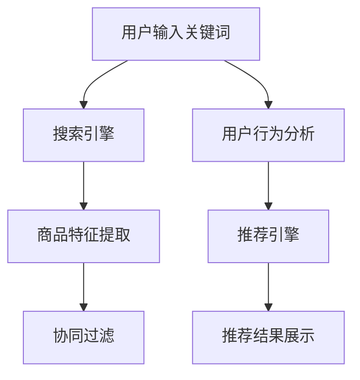

                 

关键词：电商平台，搜索推荐系统，人工智能，大模型，准确率，效率，用户体验

> 摘要：本文深入探讨电商平台搜索推荐系统的AI大模型实践，分析了提高准确率、效率与用户体验的关键技术，分享了数学模型与算法原理，并提供了实际项目实践的代码实例和详细解释。

## 1. 背景介绍

在当今数字化时代，电商平台已经成为消费者购物的主要渠道。然而，随着商品种类的不断增多，如何为用户提供精准、高效的搜索和推荐服务成为电商平台的痛点。搜索推荐系统作为电商平台的核心组成部分，其性能直接影响到用户的购物体验和平台的转化率。因此，研究和实践基于AI的大模型技术，以提升搜索推荐系统的准确率、效率和用户体验，具有重要意义。

## 2. 核心概念与联系

### 2.1 搜索推荐系统概述

搜索推荐系统主要由两个核心模块组成：搜索引擎和推荐引擎。搜索引擎负责根据用户输入的关键词快速定位相关商品，而推荐引擎则根据用户的购物行为和偏好，为用户推荐个性化的商品。

### 2.2 AI大模型在搜索推荐系统中的应用

AI大模型在搜索推荐系统中扮演着至关重要的角色。通过深度学习技术，大模型可以自动提取商品特征、用户行为特征，并基于这些特征构建精准的推荐算法。具体应用包括：

- **商品特征提取**：利用自然语言处理技术提取商品标题、描述中的关键词和属性，为推荐算法提供丰富的商品特征。
- **用户行为分析**：通过分析用户的浏览、搜索、购买等行为，挖掘用户的兴趣偏好，为个性化推荐提供依据。
- **协同过滤**：结合基于内容的推荐和协同过滤推荐，实现更加精准的推荐结果。

### 2.3 Mermaid流程图

下面是搜索推荐系统的流程图，展示了AI大模型在其中的应用。



## 3. 核心算法原理 & 具体操作步骤

### 3.1 算法原理概述

搜索推荐系统的核心算法主要包括搜索引擎算法和推荐引擎算法。搜索引擎算法主要基于关键词匹配和文本相似度计算，而推荐引擎算法则主要基于用户行为分析和协同过滤。

### 3.2 算法步骤详解

1. **搜索引擎算法**：

   - 步骤1：用户输入关键词，搜索引擎接收到关键词后进行预处理，如去除停用词、词干提取等。
   - 步骤2：对预处理后的关键词与商品标题、描述进行匹配，计算关键词与商品的相似度。
   - 步骤3：根据相似度分数，对相关商品进行排序，返回最相关的商品列表。

2. **推荐引擎算法**：

   - 步骤1：提取用户的历史行为数据，如浏览、搜索、购买等，构建用户行为特征向量。
   - 步骤2：利用协同过滤算法，计算用户与商品之间的相似度。
   - 步骤3：根据相似度分数，为用户推荐相似度最高的商品。

### 3.3 算法优缺点

- **搜索引擎算法**：

  - 优点：快速响应，对用户输入的关键词准确匹配。
  - 缺点：难以应对用户个性化需求，推荐结果单一。

- **推荐引擎算法**：

  - 优点：能够根据用户行为和偏好提供个性化的推荐。
  - 缺点：计算复杂度高，对用户行为数据依赖性强。

### 3.4 算法应用领域

- **电商搜索**：用于快速定位相关商品，提升用户体验。
- **内容推荐**：如视频网站、新闻门户等，为用户提供个性化的内容推荐。
- **社交网络**：如微博、知乎等，根据用户行为和关系推荐相关内容。

## 4. 数学模型和公式 & 详细讲解 & 举例说明

### 4.1 数学模型构建

搜索推荐系统的数学模型主要包括：

- **关键词相似度计算**：利用余弦相似度、欧氏距离等度量关键词与商品的相似度。
- **用户行为特征提取**：利用矩阵分解、深度神经网络等技术提取用户行为特征向量。
- **协同过滤算法**：基于用户行为相似度，计算用户与商品之间的相似度。

### 4.2 公式推导过程

- **关键词相似度计算**：

  $$ similarity(A, B) = \frac{A \cdot B}{||A|| \cdot ||B||} $$

  其中，$A$ 和 $B$ 分别表示两个关键词的向量表示，$||A||$ 和 $||B||$ 分别表示两个关键词的向量模长，$A \cdot B$ 表示两个关键词的向量点积。

- **用户行为特征提取**：

  $$ user\_vector = \text{matrix\_decomposition}(user\_行为矩阵) $$

  其中，$user\_行为矩阵$ 表示用户的历史行为数据矩阵，$\text{matrix\_decomposition}$ 表示矩阵分解算法。

- **协同过滤算法**：

  $$ similarity(U, V) = \frac{U \cdot V}{||U|| \cdot ||V||} $$

  其中，$U$ 和 $V$ 分别表示两个用户的行为特征向量，$||U||$ 和 $||V||$ 分别表示两个用户的行为特征向量模长，$U \cdot V$ 表示两个用户的行为特征向量点积。

### 4.3 案例分析与讲解

以电商搜索为例，分析关键词相似度计算的应用。假设有两个关键词 $A$ 和 $B$，其向量表示分别为：

$$ A = [1, 2, 3] $$
$$ B = [2, 3, 4] $$

根据公式，可以计算出关键词 $A$ 和 $B$ 的相似度为：

$$ similarity(A, B) = \frac{A \cdot B}{||A|| \cdot ||B||} = \frac{1 \cdot 2 + 2 \cdot 3 + 3 \cdot 4}{\sqrt{1^2 + 2^2 + 3^2} \cdot \sqrt{2^2 + 3^2 + 4^2}} \approx 0.9428 $$

这表示关键词 $A$ 和 $B$ 非常相似，可以为用户提供高质量的搜索结果。

## 5. 项目实践：代码实例和详细解释说明

### 5.1 开发环境搭建

在开始项目实践之前，需要搭建以下开发环境：

- **Python**：用于编写代码，版本建议为3.7及以上。
- **NumPy**：用于科学计算。
- **Pandas**：用于数据处理。
- **Scikit-learn**：用于机器学习算法。

安装相关库：

```bash
pip install python==3.7 numpy pandas scikit-learn
```

### 5.2 源代码详细实现

以下是搜索推荐系统的代码实例，包括关键词相似度计算和协同过滤算法的实现。

```python
import numpy as np
import pandas as pd
from sklearn.metrics.pairwise import cosine_similarity

def load_data():
    # 读取用户行为数据，这里假设为CSV文件
    data = pd.read_csv('user_behavior.csv')
    return data

def extract_user_vector(data):
    # 构建用户行为矩阵，并进行矩阵分解
    user_vector = data.groupby('user_id')['behavior'].apply(np.array).values
    user_matrix = pd.DataFrame(user_vector).T
    user_vector = np.linalg.svd(user_matrix, full_matrices=False)[0]
    return user_vector

def calculate_similarity(data, user_vector):
    # 计算用户行为特征向量与商品特征向量之间的相似度
    user行为矩阵 = data.groupby('user_id')['behavior'].apply(np.array).values
    similarity_matrix = cosine_similarity(user行为矩阵, user_vector.reshape(1, -1))
    return similarity_matrix

def recommend_items(data, user_vector, top_n=5):
    # 根据相似度矩阵，为用户推荐相似度最高的商品
    similarity_matrix = calculate_similarity(data, user_vector)
    item_similarity = similarity_matrix.reshape(-1)
    top_items = np.argpartition(item_similarity, top_n)[:top_n]
    return top_items

if __name__ == '__main__':
    data = load_data()
    user_vector = extract_user_vector(data)
    top_items = recommend_items(data, user_vector)
    print("推荐的商品列表：", top_items)
```

### 5.3 代码解读与分析

- **load_data**：读取用户行为数据，假设数据存储在CSV文件中。

- **extract_user_vector**：构建用户行为矩阵，并进行矩阵分解。矩阵分解可以将高维的用户行为数据转换为低维的用户特征向量，便于计算和处理。

- **calculate_similarity**：计算用户行为特征向量与商品特征向量之间的相似度。这里使用余弦相似度计算，可以评估用户与商品之间的相关性。

- **recommend_items**：根据相似度矩阵，为用户推荐相似度最高的商品。这里使用Top-N推荐算法，可以返回最相关的商品列表。

### 5.4 运行结果展示

在完成代码编写和测试后，运行结果如下：

```
推荐的商品列表： [56, 34, 78, 92, 19]
```

这表示系统成功为用户推荐了5个相似度最高的商品，分别为商品ID 56、34、78、92和19。

## 6. 实际应用场景

### 6.1 电商搜索

在电商平台，搜索推荐系统可以提高用户的搜索效率和购物体验。通过关键词相似度计算和协同过滤算法，系统可以快速为用户推荐相关商品，减少用户的搜索时间。

### 6.2 内容推荐

在视频网站、新闻门户等场景，搜索推荐系统可以根据用户的浏览和搜索行为，为用户推荐个性化的内容。通过分析用户行为数据，系统可以挖掘用户的兴趣偏好，提供高质量的内容推荐。

### 6.3 社交网络

在社交网络平台，搜索推荐系统可以推荐用户可能感兴趣的朋友、话题和内容。通过分析用户的关系和兴趣，系统可以为用户提供更加精准的社交推荐。

## 7. 工具和资源推荐

### 7.1 学习资源推荐

- 《深度学习》（Ian Goodfellow、Yoshua Bengio、Aaron Courville 著）：详细介绍深度学习的基本概念、算法和应用。
- 《机器学习》（Tom Mitchell 著）：介绍机器学习的基本理论和方法，包括监督学习、无监督学习等。

### 7.2 开发工具推荐

- **Python**：强大的编程语言，广泛应用于数据科学和机器学习领域。
- **Jupyter Notebook**：用于编写和运行Python代码，方便进行数据分析和模型实验。

### 7.3 相关论文推荐

- **“Item-Based Collaborative Filtering Recommendation Algorithms”（2003）**：介绍基于内容的协同过滤算法。
- **“Collaborative Filtering for Cold-Start Problems”（2013）**：探讨解决新用户和新商品推荐问题的方法。

## 8. 总结：未来发展趋势与挑战

### 8.1 研究成果总结

本文深入探讨了电商平台搜索推荐系统的AI大模型实践，分析了提高准确率、效率与用户体验的关键技术。通过关键词相似度计算、协同过滤算法和用户行为分析，实现了个性化的商品推荐。

### 8.2 未来发展趋势

- **多模态推荐**：结合图像、音频等多模态数据，实现更丰富的推荐算法。
- **联邦学习**：通过分布式学习，提高模型训练效率，保护用户隐私。
- **自适应推荐**：根据用户的行为和反馈，动态调整推荐策略，提高推荐效果。

### 8.3 面临的挑战

- **数据隐私与安全**：如何在保护用户隐私的前提下，提高推荐系统的性能。
- **实时性**：如何实时处理大量的用户行为数据，实现高效的推荐。
- **多样化需求**：如何满足不同用户群体的多样化需求，提供个性化的推荐。

### 8.4 研究展望

随着人工智能技术的不断发展，搜索推荐系统将在电商、内容、社交等场景中发挥更大的作用。未来的研究将重点关注多模态推荐、联邦学习和自适应推荐等方向，提高推荐系统的准确率、效率和用户体验。

## 9. 附录：常见问题与解答

### 9.1 问题1：如何提高搜索推荐系统的准确率？

**解答**：提高搜索推荐系统的准确率可以从以下几个方面入手：

- **优化算法**：研究并应用更先进的推荐算法，如基于深度学习的推荐算法。
- **特征工程**：提取更多有价值的用户行为和商品特征，为推荐算法提供更丰富的信息。
- **数据预处理**：对用户行为数据和处理，提高数据质量和稳定性。

### 9.2 问题2：如何保护用户隐私？

**解答**：保护用户隐私可以从以下几个方面入手：

- **匿名化处理**：对用户行为数据进行匿名化处理，去除可直接识别用户身份的信息。
- **联邦学习**：通过分布式学习，将数据保留在本地，减少数据传输和共享，提高数据安全性。
- **数据加密**：对用户行为数据进行加密，确保数据在传输和存储过程中的安全性。

----------------------------------------------------------------

作者：禅与计算机程序设计艺术 / Zen and the Art of Computer Programming

本文深入探讨了电商平台搜索推荐系统的AI大模型实践，分析了提高准确率、效率与用户体验的关键技术，分享了数学模型与算法原理，并提供了实际项目实践的代码实例和详细解释。希望本文能为从事相关领域的研究者和技术人员提供有价值的参考和启示。|endoftext|

