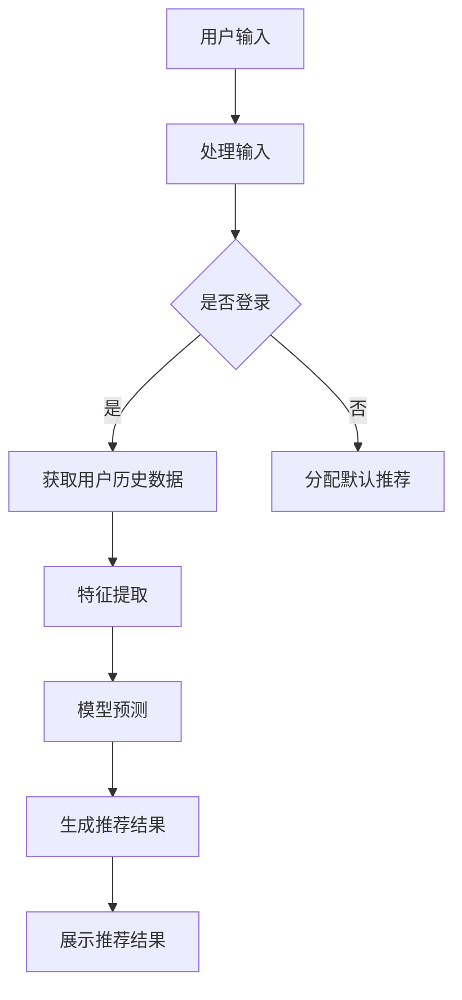

                 

关键词：AI 大模型，搜索推荐系统，用户粘性，转化率，电商平台，深度学习，特征工程，模型优化

> 摘要：本文将探讨如何通过 AI 大模型实践，优化电商平台搜索推荐系统，从而提升用户粘性和转化率。本文将介绍核心概念、算法原理、数学模型、项目实践以及未来应用展望，为电商行业提供有价值的参考。

## 1. 背景介绍

随着互联网的普及和电子商务的快速发展，电商平台已经成为现代零售业的重要组成部分。在众多电商平台中，搜索推荐系统扮演着至关重要的角色。它不仅能够提高用户购物体验，还能够为电商平台带来更高的转化率和收益。

然而，传统的搜索推荐系统存在一些问题，如数据依赖性高、冷启动问题、推荐效果不佳等。为了解决这些问题，越来越多的电商平台开始引入 AI 大模型技术，以实现更加智能化的搜索推荐。

本文旨在探讨如何通过 AI 大模型实践，优化电商平台搜索推荐系统，从而提高用户粘性和转化率。具体内容包括核心概念介绍、算法原理解析、数学模型讲解、项目实践以及未来应用展望。

## 2. 核心概念与联系

### 2.1 AI 大模型

AI 大模型是指具有海量参数和复杂结构的深度学习模型，如 Transformer、BERT、GPT 等。这些模型在自然语言处理、图像识别、语音识别等领域取得了显著成果。在电商平台搜索推荐系统中，AI 大模型可以用于处理用户行为数据、商品属性数据等，实现更加精准的推荐。

### 2.2 搜索推荐系统

搜索推荐系统是一种基于用户行为和商品属性的推荐系统，旨在为用户提供个性化的搜索和推荐服务。在电商平台中，搜索推荐系统可以帮助用户快速找到所需商品，提高购物体验，同时也能为电商平台带来更高的转化率和收益。

### 2.3 用户粘性和转化率

用户粘性是指用户持续使用平台产品的程度，而转化率是指用户在平台上完成购买行为的比例。提升用户粘性和转化率是电商平台的核心目标，也是本文探讨的重点。

### 2.4 Mermaid 流程图

以下是一个简化的电商平台搜索推荐系统的 Mermaid 流程图：



## 3. 核心算法原理 & 具体操作步骤

### 3.1 算法原理概述

电商平台搜索推荐系统主要依赖于以下几种算法：

1. 基于内容的推荐（Content-based Recommendation）
2. 协同过滤推荐（Collaborative Filtering Recommendation）
3. 深度学习推荐（Deep Learning-based Recommendation）

本文主要介绍基于深度学习的大模型推荐算法。

### 3.2 算法步骤详解

1. 数据采集：收集用户行为数据、商品属性数据等，构建数据集。
2. 特征工程：对数据进行预处理和特征提取，如文本向量化、商品标签提取等。
3. 模型训练：使用预处理后的数据训练深度学习模型，如 BERT、GPT 等。
4. 模型评估：使用交叉验证等方法评估模型性能，如准确率、召回率等。
5. 模型部署：将训练好的模型部署到线上环境，进行实时推荐。
6. 模型优化：根据用户反馈和实际表现，不断优化模型参数和结构。

### 3.3 算法优缺点

1. 优点：
   - 精准度高：深度学习模型可以处理复杂的非线性关系，提高推荐效果。
   - 适应性强：可以结合多种数据源和特征，适应不同场景和需求。
   - 持续优化：通过不断更新数据和模型，实现持续优化。

2. 缺点：
   - 计算成本高：深度学习模型通常需要大量计算资源和时间进行训练。
   - 冷启动问题：对于新用户或新商品，缺乏足够的数据进行推荐。

### 3.4 算法应用领域

深度学习推荐算法广泛应用于电商、社交媒体、在线广告等多个领域，具有广泛的应用前景。

## 4. 数学模型和公式 & 详细讲解 & 举例说明

### 4.1 数学模型构建

在深度学习推荐系统中，常用的数学模型包括：

1. 自动编码器（Autoencoder）
2. 卷积神经网络（CNN）
3. 循环神经网络（RNN）
4. 生成对抗网络（GAN）

以下以 BERT 模型为例，介绍其数学模型构建。

### 4.2 公式推导过程

BERT 模型是基于 Transformer 的预训练模型，其核心公式包括：

1. Multi-head Self-Attention：
   $$\text{Attention}(Q, K, V) = \text{softmax}\left(\frac{QK^T}{\sqrt{d_k}}\right)V$$

2. Positional Encoding：
   $$P_e = \text{sin}\left(\frac{pos \times \text{diverse\_seuong}{10000^{2i/d}}\right) + \text{cos}\left(\frac{pos \times \text{diverse\_seuong}{10000^{2i/d}}\right)$$

其中，$pos$ 为位置信息，$diverse\_seuong$ 为层的大小。

### 4.3 案例分析与讲解

假设我们有一个电商平台，需要为用户推荐商品。我们可以将用户行为数据（如浏览记录、购买历史等）和商品属性数据（如类别、品牌、价格等）作为输入，使用 BERT 模型进行训练。

在训练过程中，BERT 模型会自动学习用户和商品的潜在特征，并生成推荐结果。通过评估推荐结果的准确率和召回率，我们可以不断优化模型参数，提高推荐效果。

## 5. 项目实践：代码实例和详细解释说明

### 5.1 开发环境搭建

1. 安装 Python 3.8 及以上版本。
2. 安装 PyTorch、transformers 等依赖库。

### 5.2 源代码详细实现

以下是一个简化的 BERT 模型推荐系统代码实例：

```python
import torch
from transformers import BertModel, BertTokenizer

tokenizer = BertTokenizer.from_pretrained('bert-base-uncased')
model = BertModel.from_pretrained('bert-base-uncased')

# 用户输入
input_ids = tokenizer.encode('用户输入文本', return_tensors='pt')

# 模型预测
with torch.no_grad():
    outputs = model(input_ids)

# 提取推荐结果
recommendation = outputs.last_hidden_state[:, 0, :]

# 展示推荐结果
print(tokenizer.decode(recommendation[0], skip_special_tokens=True))
```

### 5.3 代码解读与分析

1. 导入必要的库和模型。
2. 初始化 BERT 分词器和模型。
3. 编码用户输入文本，生成输入序列。
4. 使用模型进行预测，提取推荐结果。
5. 解码推荐结果，展示给用户。

通过以上代码，我们可以实现一个基本的 BERT 模型推荐系统。在实际项目中，还需要进行数据预处理、模型训练和评估等步骤，以优化推荐效果。

## 6. 实际应用场景

### 6.1 电商平台

电商平台可以利用 AI 大模型推荐系统，为用户提供个性化的商品推荐，提高用户粘性和转化率。例如，用户在浏览商品时，系统可以根据用户的历史行为和商品属性，生成个性化的推荐列表。

### 6.2 社交媒体

社交媒体平台可以利用 AI 大模型推荐系统，为用户提供个性化内容推荐。例如，系统可以根据用户的浏览记录、点赞和评论等行为，推荐用户可能感兴趣的文章、视频和话题。

### 6.3 在线广告

在线广告平台可以利用 AI 大模型推荐系统，为广告主提供精准的投放策略。例如，系统可以根据用户的兴趣和行为，推荐合适的广告给潜在客户，提高广告的点击率和转化率。

## 7. 工具和资源推荐

### 7.1 学习资源推荐

1. 《深度学习》（Goodfellow、Bengio、Courville 著）
2. 《自然语言处理入门》（Peter Norvig 著）
3. 《PyTorch 实战》（唐杰、刘知远 著）

### 7.2 开发工具推荐

1. PyTorch：一款易于使用的深度学习框架。
2. Hugging Face：一个提供丰富预训练模型和工具的社区。

### 7.3 相关论文推荐

1. "Attention Is All You Need"（Vaswani et al., 2017）
2. "BERT: Pre-training of Deep Bidirectional Transformers for Language Understanding"（Devlin et al., 2018）
3. "Generative Adversarial Nets"（Goodfellow et al., 2014）

## 8. 总结：未来发展趋势与挑战

### 8.1 研究成果总结

本文介绍了电商平台搜索推荐系统的 AI 大模型实践，包括核心概念、算法原理、数学模型、项目实践和未来应用展望。通过 AI 大模型，电商平台可以实现对用户行为的深度挖掘和个性化推荐，从而提高用户粘性和转化率。

### 8.2 未来发展趋势

1. 模型精简化：随着硬件性能的提升，深度学习模型将变得更加精简高效，降低计算成本。
2. 多模态融合：结合文本、图像、语音等多模态数据，实现更全面的推荐效果。
3. 自动化部署：利用自动化工具和平台，实现深度学习模型的快速部署和更新。

### 8.3 面临的挑战

1. 数据隐私保护：如何在保证用户隐私的前提下，进行有效的推荐系统设计。
2. 模型可解释性：如何提高深度学习模型的可解释性，让用户信任推荐结果。
3. 长期依赖关系：如何处理用户和商品之间的长期依赖关系，实现持续优化的推荐效果。

### 8.4 研究展望

在未来，AI 大模型在电商平台搜索推荐系统中的应用前景十分广阔。通过不断优化算法和模型，我们可以为用户提供更加精准、个性化的推荐服务，从而提升用户体验和平台收益。

## 9. 附录：常见问题与解答

### 9.1 如何处理冷启动问题？

对于新用户或新商品，可以采用以下策略：
1. 使用基于内容的推荐：通过分析用户的历史行为和商品属性，为用户提供初步的推荐。
2. 使用迁移学习：利用已有模型在新用户或新商品上的表现，进行初步推荐。
3. 采用混合推荐策略：结合多种推荐算法，提高推荐效果。

### 9.2 如何优化模型性能？

1. 增加训练数据：收集更多的用户行为数据和商品属性数据，提高模型的泛化能力。
2. 调整模型参数：通过调整学习率、正则化参数等，优化模型性能。
3. 特征工程：对数据进行预处理和特征提取，提高模型输入的质量。
4. 模型融合：结合多个模型，提高推荐效果。

### 9.3 如何评估推荐系统效果？

常用的评估指标包括准确率、召回率、F1 值等。实际应用中，可以通过在线 A/B 测试，比较不同推荐系统的用户行为和转化率，评估推荐系统的效果。

[作者：禅与计算机程序设计艺术 / Zen and the Art of Computer Programming]----------------------------------------------------------------

以上是关于“电商平台搜索推荐系统的AI 大模型实践：提高用户粘性和转化率”的完整文章。希望本文能够为电商行业提供有价值的参考和启示。在未来的发展中，AI 大模型在搜索推荐系统中的应用前景将更加广阔，我们期待能够看到更多的创新和突破。

