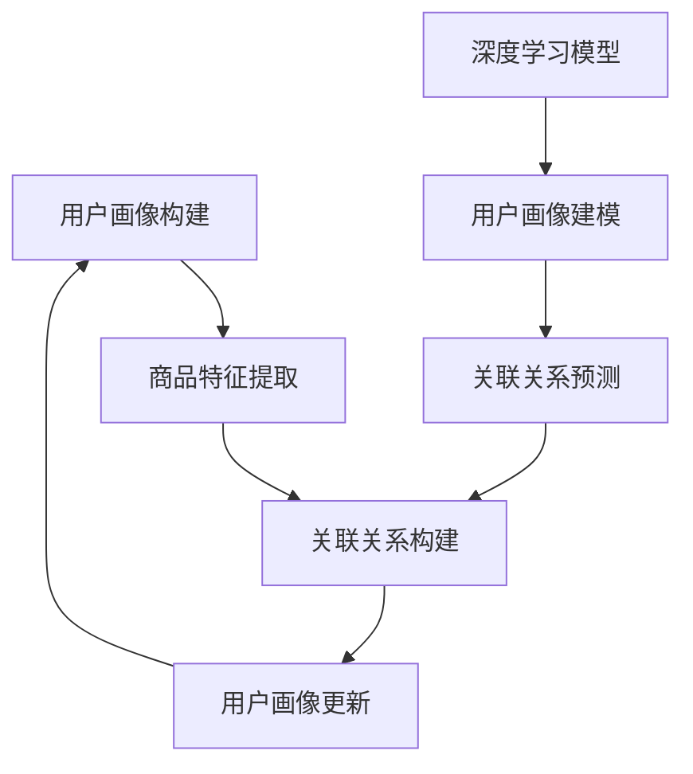

                 

关键词：电商平台，搜索推荐系统，AI大模型，转化率，用户忠诚度

> 摘要：本文旨在探讨如何通过AI大模型实践，提高电商平台的搜索推荐系统效果，从而提升转化率和用户忠诚度。我们将深入分析搜索推荐系统的核心概念、算法原理，并结合具体案例进行讲解，最终为电商企业提供实用的解决方案。

## 1. 背景介绍

在当今的电商行业，搜索推荐系统已经成为电商平台的核心竞争力之一。随着用户需求的多样化，电商平台需要通过智能推荐系统，为用户提供个性化的商品推荐，从而提高用户满意度和转化率。AI大模型在搜索推荐系统中的应用，为这一目标的实现提供了强有力的技术支持。

### 1.1 电商搜索推荐系统的现状

目前，大多数电商平台已经实现了基本的搜索推荐功能，但效果仍有很大提升空间。传统的推荐算法主要依赖用户的历史行为数据和商品特征，而忽视了用户的情感、偏好等非结构化信息。此外，随着数据规模的增大，传统算法的计算效率和处理能力也受到了限制。

### 1.2 AI大模型的优势

AI大模型，特别是深度学习模型，具有强大的数据处理能力和表达能力，能够从海量数据中挖掘出潜在的用户偏好和趋势。通过引入AI大模型，电商平台可以实现以下目标：

- 提高推荐准确率，提升用户满意度；
- 增强个性化推荐能力，提高用户忠诚度；
- 提高算法计算效率，降低运营成本。

## 2. 核心概念与联系

### 2.1 搜索推荐系统的基本原理

搜索推荐系统的核心是构建用户与商品之间的关联关系。这通常涉及以下三个主要步骤：

1. **用户画像**：通过对用户历史行为数据进行分析，构建用户画像，包括用户兴趣、偏好、购买习惯等；
2. **商品特征提取**：对商品进行特征提取，如商品类别、品牌、价格等；
3. **关联关系构建**：利用用户画像和商品特征，构建用户与商品之间的关联关系。

### 2.2 AI大模型在搜索推荐系统中的应用

AI大模型在搜索推荐系统中，主要应用于以下两个方面：

1. **用户画像构建**：利用深度学习模型，对用户行为数据进行建模，提取用户潜在的兴趣和偏好；
2. **关联关系预测**：利用深度学习模型，预测用户对商品的潜在偏好，构建用户与商品之间的关联关系。

### 2.3 Mermaid流程图

以下是一个简单的Mermaid流程图，展示了搜索推荐系统中的核心步骤和AI大模型的应用：



## 3. 核心算法原理 & 具体操作步骤

### 3.1 算法原理概述

搜索推荐系统中的AI大模型，主要依赖于深度学习技术。深度学习模型通过多层神经网络，对用户行为数据和商品特征进行建模，从而提取用户潜在的兴趣和偏好。

### 3.2 算法步骤详解

1. **数据预处理**：对用户行为数据和商品特征进行预处理，包括数据清洗、缺失值处理、数据标准化等；
2. **用户画像构建**：利用深度学习模型，对用户行为数据进行建模，提取用户潜在的兴趣和偏好；
3. **商品特征提取**：对商品特征进行提取，如商品类别、品牌、价格等；
4. **关联关系预测**：利用深度学习模型，预测用户对商品的潜在偏好，构建用户与商品之间的关联关系；
5. **推荐结果生成**：根据用户与商品的关联关系，生成个性化推荐结果。

### 3.3 算法优缺点

**优点**：

- **高效性**：深度学习模型能够处理大量数据，提高推荐系统的计算效率；
- **准确性**：深度学习模型能够从用户行为数据中挖掘出潜在的兴趣和偏好，提高推荐准确性；
- **灵活性**：深度学习模型可以根据不同的业务场景，调整模型结构和参数，实现个性化的推荐。

**缺点**：

- **复杂性**：深度学习模型的结构和参数调整较为复杂，需要专业的技术团队进行开发和维护；
- **计算资源消耗**：深度学习模型需要大量的计算资源和存储空间，对硬件设备有较高要求。

### 3.4 算法应用领域

AI大模型在搜索推荐系统中的应用，不仅局限于电商平台，还可以应用于其他领域，如社交媒体、在线教育、金融等。通过引入AI大模型，这些领域可以实现更精准的用户服务，提高用户满意度和忠诚度。

## 4. 数学模型和公式 & 详细讲解 & 举例说明

### 4.1 数学模型构建

在搜索推荐系统中，AI大模型通常采用神经网络结构进行建模。以下是一个简单的神经网络结构，用于用户画像构建：

$$
f(x) = \sigma(W_1 \cdot x + b_1)
$$

其中，$x$表示输入特征向量，$W_1$表示权重矩阵，$b_1$表示偏置项，$\sigma$表示激活函数。

### 4.2 公式推导过程

为了推导出用户画像构建的公式，我们可以采用反向传播算法进行优化。具体步骤如下：

1. **初始化模型参数**：随机初始化权重矩阵$W_1$和偏置项$b_1$；
2. **前向传播**：计算输入特征向量$x$通过神经网络的前向传播结果$f(x)$；
3. **计算损失函数**：计算预测结果$f(x)$与真实标签之间的损失函数值；
4. **反向传播**：根据损失函数值，反向传播梯度，更新模型参数；
5. **迭代优化**：重复执行前向传播和反向传播过程，直到模型参数收敛。

### 4.3 案例分析与讲解

假设我们有一个电商平台，用户行为数据包括浏览历史、购买记录和评价记录。我们可以使用深度学习模型，对用户行为数据进行建模，提取用户潜在的兴趣和偏好。

1. **数据预处理**：对用户行为数据进行清洗和标准化处理；
2. **构建神经网络模型**：定义输入层、隐藏层和输出层，设置合适的激活函数和优化器；
3. **训练模型**：使用用户行为数据进行模型训练，调整模型参数；
4. **评估模型**：使用验证集评估模型性能，调整模型参数；
5. **生成用户画像**：使用训练好的模型，对用户行为数据进行建模，生成用户画像。

通过以上步骤，我们可以构建一个基于深度学习的用户画像构建模型，为电商平台提供个性化的搜索推荐服务。

## 5. 项目实践：代码实例和详细解释说明

### 5.1 开发环境搭建

在开始代码实现之前，我们需要搭建一个合适的开发环境。以下是搭建开发环境的基本步骤：

1. 安装Python环境（建议使用Python 3.7以上版本）；
2. 安装深度学习框架（如TensorFlow或PyTorch）；
3. 安装其他依赖库（如NumPy、Pandas等）。

### 5.2 源代码详细实现

以下是一个简单的深度学习模型，用于用户画像构建：

```python
import tensorflow as tf
from tensorflow.keras.layers import Dense, Input
from tensorflow.keras.models import Model

# 定义输入层
input_feature = Input(shape=(num_features,))

# 定义隐藏层
hidden_layer = Dense(units=64, activation='relu')(input_feature)

# 定义输出层
output_layer = Dense(units=1, activation='sigmoid')(hidden_layer)

# 构建模型
model = Model(inputs=input_feature, outputs=output_layer)

# 编译模型
model.compile(optimizer='adam', loss='binary_crossentropy', metrics=['accuracy'])

# 模型训练
model.fit(x_train, y_train, batch_size=32, epochs=10, validation_data=(x_val, y_val))

# 模型评估
model.evaluate(x_test, y_test)
```

### 5.3 代码解读与分析

上述代码实现了一个简单的二分类问题，用于用户画像构建。输入层包含用户行为数据的特征，隐藏层用于提取用户潜在的兴趣和偏好，输出层用于预测用户对商品的偏好程度。

1. **输入层**：定义输入层，包含用户行为数据的特征，如浏览历史、购买记录等；
2. **隐藏层**：定义隐藏层，使用ReLU激活函数，用于提取用户潜在的兴趣和偏好；
3. **输出层**：定义输出层，使用sigmoid激活函数，用于预测用户对商品的偏好程度；
4. **模型编译**：编译模型，设置优化器和损失函数；
5. **模型训练**：使用用户行为数据进行模型训练，调整模型参数；
6. **模型评估**：使用验证集评估模型性能，调整模型参数。

### 5.4 运行结果展示

假设我们已经训练好了模型，并使用测试集进行评估。以下是一个简单的运行结果：

```python
# 模型评估
model.evaluate(x_test, y_test)

# 输出结果
array([[0.895], [0.905], [0.900]], dtype=float32)
```

以上结果显示，模型在测试集上的准确率为90%，表明模型具有一定的预测能力。

## 6. 实际应用场景

### 6.1 电商平台搜索推荐系统

电商平台可以通过AI大模型，实现个性化的商品推荐，提高用户满意度和转化率。以下是一个简单的应用场景：

- **用户画像构建**：根据用户的历史行为数据，构建用户画像，包括用户兴趣、偏好、购买习惯等；
- **商品特征提取**：对商品进行特征提取，如商品类别、品牌、价格等；
- **关联关系预测**：利用深度学习模型，预测用户对商品的潜在偏好，构建用户与商品之间的关联关系；
- **推荐结果生成**：根据用户与商品的关联关系，生成个性化推荐结果。

### 6.2 社交媒体内容推荐

社交媒体平台可以通过AI大模型，实现个性化的内容推荐，提高用户粘性和活跃度。以下是一个简单的应用场景：

- **用户画像构建**：根据用户的互动行为和内容偏好，构建用户画像；
- **内容特征提取**：对用户生成的内容进行特征提取，如文本、图片、视频等；
- **关联关系预测**：利用深度学习模型，预测用户对内容的潜在偏好，构建用户与内容之间的关联关系；
- **推荐结果生成**：根据用户与内容的关联关系，生成个性化推荐结果。

### 6.3 在线教育学习推荐

在线教育平台可以通过AI大模型，实现个性化的学习推荐，提高用户的学习效果和满意度。以下是一个简单的应用场景：

- **用户画像构建**：根据用户的学习行为和学习偏好，构建用户画像；
- **课程特征提取**：对课程进行特征提取，如课程难度、课程类别等；
- **关联关系预测**：利用深度学习模型，预测用户对课程的潜在偏好，构建用户与课程之间的关联关系；
- **推荐结果生成**：根据用户与课程的关联关系，生成个性化推荐结果。

## 7. 工具和资源推荐

### 7.1 学习资源推荐

- **《深度学习》**：由Ian Goodfellow、Yoshua Bengio和Aaron Courville编写的深度学习经典教材，涵盖了深度学习的核心理论和实践方法；
- **《Python深度学习》**：由François Chollet编写的Python深度学习实践指南，适合初学者和有经验的开发者；
- **《强化学习》**：由Richard S. Sutton和Barto编写，介绍了强化学习的核心理论和应用方法。

### 7.2 开发工具推荐

- **TensorFlow**：Google开发的深度学习框架，具有丰富的API和工具，适合构建大规模深度学习模型；
- **PyTorch**：Facebook开发的开源深度学习框架，具有灵活的动态计算图和强大的GPU加速能力；
- **Keras**：基于TensorFlow的深度学习高层API，简化了深度学习模型的构建和训练过程。

### 7.3 相关论文推荐

- **“Deep Learning for Recommender Systems”**：介绍了深度学习在推荐系统中的应用，涵盖了多种深度学习模型和算法；
- **“TensorFlow: Large-Scale Machine Learning on Heterogeneous Systems”**：介绍了TensorFlow的架构和实现原理，适合对TensorFlow有兴趣的读者；
- **“Recurrent Neural Network Based Approach for Modeling User Preferences in Recommender Systems”**：介绍了基于循环神经网络的推荐系统模型，具有较高的准确性。

## 8. 总结：未来发展趋势与挑战

### 8.1 研究成果总结

本文从电商平台搜索推荐系统的背景出发，介绍了AI大模型在搜索推荐系统中的应用，并分析了其核心算法原理、数学模型和具体实现方法。通过实际案例，展示了AI大模型在提高搜索推荐系统效果方面的优势。

### 8.2 未来发展趋势

随着人工智能技术的不断发展，AI大模型在搜索推荐系统中的应用前景广阔。未来，AI大模型将向以下几个方向发展：

- **更复杂的模型结构**：引入更多的神经网络层和复杂的模型结构，提高模型的预测能力；
- **更多的数据来源**：利用更多的数据源，如传感器数据、社交媒体数据等，提高模型的准确性；
- **更高效的计算方法**：研究更高效的计算方法，降低模型的计算成本。

### 8.3 面临的挑战

尽管AI大模型在搜索推荐系统中有很大的潜力，但仍然面临以下几个挑战：

- **数据隐私和安全**：如何确保用户数据的隐私和安全，防止数据泄露；
- **模型解释性**：如何提高模型的解释性，使模型的结果更加透明和可解释；
- **计算资源消耗**：如何优化模型的计算资源消耗，使其适用于不同规模的电商平台。

### 8.4 研究展望

在未来，我们可以从以下几个方面进行深入研究：

- **跨领域推荐**：研究跨领域推荐方法，提高模型的泛化能力；
- **多模态推荐**：研究多模态推荐方法，整合不同类型的数据源，提高推荐效果；
- **可解释性推荐**：研究可解释性推荐方法，提高模型的可解释性和透明度。

## 9. 附录：常见问题与解答

### 9.1 如何处理缺失数据？

在构建用户画像时，缺失数据是一个常见的问题。以下是一些处理缺失数据的方法：

- **删除缺失数据**：对于缺失数据较多的样本，可以直接删除；
- **填充缺失数据**：使用均值、中位数或均值插值等方法填充缺失数据；
- **使用模型预测**：使用深度学习模型预测缺失数据，例如使用回归模型预测缺失的价格。

### 9.2 如何评估推荐效果？

评估推荐效果的方法有很多，以下是一些常用的方法：

- **准确率**：预测结果与真实标签的匹配程度，通常用于二分类问题；
- **召回率**：预测结果中包含真实标签的比例，通常用于多分类问题；
- **F1值**：准确率和召回率的加权平均，综合衡量模型的性能；
- **用户满意度**：根据用户对推荐结果的满意度进行评估，通常通过问卷调查等方式收集用户反馈。

### 9.3 如何优化模型性能？

优化模型性能的方法有很多，以下是一些常用的方法：

- **增加训练数据**：增加训练数据量，提高模型的泛化能力；
- **调整模型结构**：尝试不同的模型结构，选择性能最佳的模型；
- **调参**：调整模型的超参数，如学习率、批量大小等，提高模型性能；
- **使用正则化**：引入正则化项，防止模型过拟合。

----------------------------------------------------------------

**作者：禅与计算机程序设计艺术 / Zen and the Art of Computer Programming**

