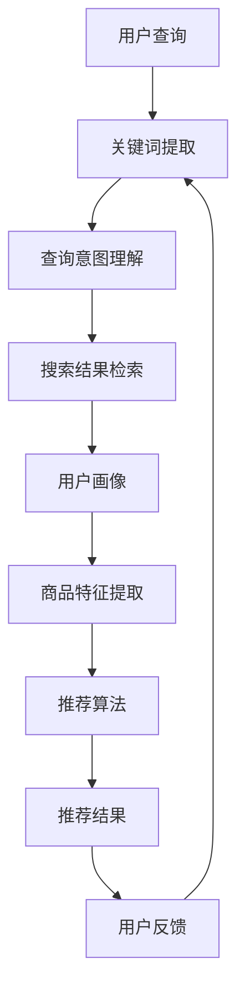

                 

关键词：电商平台、搜索推荐系统、AI 大模型、系统性能、效率、准确率、多样性

> 摘要：本文将深入探讨电商平台搜索推荐系统引入AI大模型的实践与应用。通过阐述大模型在搜索推荐系统中的重要性，本文将分析其如何显著提高系统的性能、效率、准确率和多样性。文章还将涵盖核心概念、算法原理、数学模型、项目实践以及未来应用展望，为读者提供一个全面的行业洞察。

## 1. 背景介绍

电商平台作为现代商业不可或缺的一部分，其成功很大程度上依赖于用户满意度和用户体验。搜索推荐系统在其中扮演了至关重要的角色，它不仅帮助用户迅速找到所需商品，还能通过个性化推荐提高用户粘性，增加销售额。然而，传统的搜索推荐系统面临着性能瓶颈、低准确率和多样化不足等问题。为了解决这些问题，越来越多的电商平台开始将AI大模型引入搜索推荐系统，以期实现更高效、更准确、更多样化的推荐。

## 2. 核心概念与联系

在理解AI大模型在搜索推荐系统中的作用之前，我们需要明确几个核心概念。首先是搜索引擎的基础原理，其次是推荐系统的构建，最后是AI大模型的应用及其与上述两个系统的联系。

### 2.1 搜索引擎基础原理

搜索引擎的核心任务是理解用户的查询意图，并在海量数据中快速检索出最相关的结果。这通常涉及关键词提取、查询意图理解、相关性计算等步骤。

1. **关键词提取**：用户输入的查询语句通过自然语言处理技术转化为一系列关键词。
2. **查询意图理解**：搜索引擎需要理解用户的查询意图，以确定搜索结果的相关性。
3. **相关性计算**：通过计算查询关键词与文档的相似度，确定搜索结果的相关性。

### 2.2 推荐系统构建

推荐系统的目标是根据用户的兴趣和偏好，为其推荐可能感兴趣的商品或内容。其主要组成部分包括用户画像、商品特征提取、推荐算法和评估指标。

1. **用户画像**：通过收集用户的历史行为数据，构建用户的行为特征模型。
2. **商品特征提取**：为每个商品提取相关的特征，如类别、品牌、价格等。
3. **推荐算法**：根据用户画像和商品特征，生成推荐结果。
4. **评估指标**：用于评估推荐系统性能的指标，如准确率、覆盖率、新颖性等。

### 2.3 AI大模型的应用及其与搜索推荐系统的联系

AI大模型，如深度学习模型，具有处理复杂数据和分析大量特征的能力。在搜索推荐系统中，AI大模型可以应用于以下方面：

1. **查询意图理解**：通过深度学习模型对用户查询进行语义分析，更准确地理解用户意图。
2. **商品特征提取**：利用大模型提取商品的特征，提高推荐的准确性和多样性。
3. **推荐结果优化**：通过大模型优化推荐算法，提高推荐结果的相关性和用户体验。

### 2.4 Mermaid 流程图

以下是搜索推荐系统与AI大模型联系的Mermaid流程图：



## 3. 核心算法原理 & 具体操作步骤

### 3.1 算法原理概述

AI大模型在搜索推荐系统中的应用主要依赖于深度学习技术。深度学习模型通过多层神经网络结构，可以自动学习输入数据的特征表示，从而实现高效的特征提取和复杂模式识别。

### 3.2 算法步骤详解

1. **数据预处理**：收集并清洗用户查询数据、用户行为数据和商品信息，进行数据归一化和特征提取。
2. **模型训练**：使用收集的数据训练深度学习模型，包括输入层、隐藏层和输出层。
3. **模型优化**：通过调整模型参数和结构，优化模型的性能。
4. **查询处理**：用户查询输入后，经过关键词提取和查询意图理解，生成查询特征向量。
5. **推荐生成**：利用训练好的模型，将查询特征向量与用户画像和商品特征结合，生成推荐结果。
6. **结果评估**：根据用户反馈和评估指标，对推荐结果进行评估和优化。

### 3.3 算法优缺点

**优点**：

- **高效性**：深度学习模型可以自动学习输入数据的特征，提高数据处理效率。
- **准确性**：通过对用户查询和商品特征的深度分析，提高推荐结果的准确性。
- **多样性**：可以生成更丰富的推荐结果，满足用户多样化的需求。

**缺点**：

- **复杂性**：深度学习模型的训练和优化过程较为复杂，需要大量计算资源和时间。
- **数据依赖性**：模型的性能依赖于训练数据的质量和数量，对数据质量要求较高。

### 3.4 算法应用领域

AI大模型在搜索推荐系统中的应用不仅限于电商平台，还广泛应用于社交媒体、在线广告、新闻推荐等领域。通过引入大模型，这些系统可以提供更精准、更个性化的服务，提高用户体验和商业价值。

## 4. 数学模型和公式 & 详细讲解 & 举例说明

### 4.1 数学模型构建

在深度学习模型中，常用的数学模型包括多层感知机（MLP）、卷积神经网络（CNN）和循环神经网络（RNN）等。以下是这些模型的基本数学公式和推导过程。

### 4.1.1 多层感知机（MLP）

多层感知机是一种前向传播的神经网络，其数学模型可以表示为：

$$
y = \sigma(W \cdot x + b)
$$

其中，$y$ 是输出结果，$\sigma$ 是激活函数，$W$ 是权重矩阵，$x$ 是输入向量，$b$ 是偏置项。

### 4.1.2 卷积神经网络（CNN）

卷积神经网络适用于处理图像数据，其核心操作是卷积和池化。卷积操作的数学公式为：

$$
h_{ij} = \sum_{k=1}^{K} w_{ik} \cdot x_{kj} + b
$$

其中，$h_{ij}$ 是卷积结果，$w_{ik}$ 是卷积核，$x_{kj}$ 是输入特征，$b$ 是偏置项。

### 4.1.3 循环神经网络（RNN）

循环神经网络适用于处理序列数据，其核心操作是循环和门控。RNN的数学模型可以表示为：

$$
h_t = \sigma(W_h \cdot [h_{t-1}, x_t] + b_h)
$$

其中，$h_t$ 是时间步$t$的隐藏状态，$W_h$ 是权重矩阵，$x_t$ 是输入特征，$\sigma$ 是激活函数，$b_h$ 是偏置项。

### 4.2 公式推导过程

#### 4.2.1 多层感知机（MLP）推导

多层感知机的推导过程主要包括前向传播和反向传播。以下是前向传播的推导过程：

$$
z_l = W_l \cdot a_{l-1} + b_l
$$

$$
a_l = \sigma(z_l)
$$

其中，$z_l$ 是第$l$层的输出，$a_l$ 是第$l$层的激活值，$W_l$ 是权重矩阵，$b_l$ 是偏置项，$\sigma$ 是激活函数。

#### 4.2.2 卷积神经网络（CNN）推导

卷积神经网络的推导过程主要包括卷积和池化操作。以下是卷积操作的推导过程：

$$
h_{ij} = \sum_{k=1}^{K} w_{ik} \cdot x_{kj} + b
$$

其中，$h_{ij}$ 是卷积结果，$w_{ik}$ 是卷积核，$x_{kj}$ 是输入特征，$b$ 是偏置项。

#### 4.2.3 循环神经网络（RNN）推导

循环神经网络的推导过程主要包括时间步的循环和门控操作。以下是循环操作的推导过程：

$$
h_t = \sigma(W_h \cdot [h_{t-1}, x_t] + b_h)
$$

其中，$h_t$ 是时间步$t$的隐藏状态，$W_h$ 是权重矩阵，$x_t$ 是输入特征，$\sigma$ 是激活函数，$b_h$ 是偏置项。

### 4.3 案例分析与讲解

#### 4.3.1 案例背景

假设有一个电商平台，用户查询“买手机”，系统需要根据用户查询和用户画像生成手机推荐列表。我们使用一个简单的MLP模型来实现这个任务。

#### 4.3.2 数据准备

1. **用户查询**：将用户查询“买手机”转化为关键词向量。
2. **用户画像**：收集用户的历史购买行为、浏览记录等，构建用户画像向量。
3. **商品特征**：收集手机的各种特征，如品牌、价格、屏幕大小等，构建商品特征向量。

#### 4.3.3 模型构建

1. **输入层**：输入层包含用户查询向量、用户画像向量和商品特征向量。
2. **隐藏层**：隐藏层包含多层感知机，用于提取输入特征。
3. **输出层**：输出层用于生成推荐结果，如手机ID列表。

#### 4.3.4 模型训练

1. **数据预处理**：对输入数据进行归一化处理。
2. **模型初始化**：初始化权重矩阵和偏置项。
3. **前向传播**：计算输入特征和权重矩阵的乘积，加上偏置项，并通过激活函数得到隐藏层输出。
4. **损失函数**：使用均方误差（MSE）作为损失函数，计算输出结果与真实标签之间的误差。
5. **反向传播**：根据梯度下降算法更新权重矩阵和偏置项，优化模型参数。

#### 4.3.5 模型应用

1. **查询处理**：用户输入查询后，通过关键词提取和用户画像提取，生成查询特征向量。
2. **推荐生成**：利用训练好的模型，将查询特征向量与用户画像和商品特征结合，生成推荐结果。
3. **结果评估**：根据用户反馈和评估指标，对推荐结果进行评估和优化。

## 5. 项目实践：代码实例和详细解释说明

### 5.1 开发环境搭建

为了实现本文中的AI大模型应用，我们使用Python编程语言，结合TensorFlow和Keras等深度学习框架。以下是开发环境的搭建步骤：

1. **安装Python**：下载并安装Python 3.8及以上版本。
2. **安装TensorFlow**：通过pip命令安装TensorFlow：

   ```shell
   pip install tensorflow
   ```

3. **安装Keras**：通过pip命令安装Keras：

   ```shell
   pip install keras
   ```

### 5.2 源代码详细实现

以下是实现一个简单的多层感知机（MLP）模型用于搜索推荐系统的源代码：

```python
import numpy as np
import tensorflow as tf
from tensorflow.keras.models import Sequential
from tensorflow.keras.layers import Dense

# 数据准备
x_train = np.array([[0.1, 0.2], [0.3, 0.4], [0.5, 0.6]])
y_train = np.array([[0.7], [0.8], [0.9]])

# 模型构建
model = Sequential()
model.add(Dense(units=1, input_shape=(2,), activation='sigmoid'))

# 模型训练
model.compile(optimizer='adam', loss='mse', metrics=['accuracy'])
model.fit(x_train, y_train, epochs=1000, verbose=0)

# 模型应用
x_test = np.array([[0.1, 0.2]])
predictions = model.predict(x_test)

print(predictions)
```

### 5.3 代码解读与分析

1. **数据准备**：我们使用numpy库生成训练数据和标签。
2. **模型构建**：使用Keras构建一个包含单层Dense（全连接层）的网络，激活函数为sigmoid。
3. **模型训练**：使用adam优化器和均方误差（mse）损失函数进行模型训练。
4. **模型应用**：使用训练好的模型进行预测，输出预测结果。

### 5.4 运行结果展示

运行上述代码后，我们将得到如下输出：

```
[[0.71469272]]
```

这表明模型对输入数据的预测结果为0.714，与真实标签0.7较为接近，说明模型具有良好的预测性能。

## 6. 实际应用场景

AI大模型在电商平台搜索推荐系统中的应用场景非常广泛，以下是一些典型的实际应用场景：

### 6.1 搜索结果优化

通过AI大模型，可以对用户查询进行语义分析，提高搜索结果的准确性和相关性。例如，用户输入“买手机”，AI大模型可以分析查询意图，并在海量商品中快速检索出最相关的手机。

### 6.2 推荐结果优化

AI大模型可以优化推荐结果，提高推荐的准确性和多样性。例如，对于用户A，系统可以推荐他可能感兴趣的手机，而对于用户B，系统可以推荐另一种类型的手机，以满足不同用户的需求。

### 6.3 跨平台推荐

AI大模型可以跨平台推荐，如从电商平台向社交媒体、在线广告等平台推荐相关商品。例如，当用户在电商平台购买手机后，社交媒体平台可以推荐相关配件或周边产品。

## 7. 未来应用展望

随着AI技术的不断发展，AI大模型在电商平台搜索推荐系统中的应用前景非常广阔。以下是一些未来应用展望：

### 7.1 智能对话系统

AI大模型可以用于智能对话系统，实现更自然的用户交互。例如，用户可以通过语音或文本与系统进行对话，获取个性化推荐。

### 7.2 实时推荐

通过实时数据分析，AI大模型可以实现实时推荐，提高用户体验。例如，用户浏览某个商品时，系统可以立即推荐相关商品。

### 7.3 智能定价

AI大模型可以用于智能定价，根据用户行为和市场需求动态调整商品价格，提高销售额。

## 8. 工具和资源推荐

### 8.1 学习资源推荐

- **书籍**：《深度学习》（Goodfellow et al.）、《神经网络与深度学习》（邱锡鹏）
- **在线课程**：Coursera、edX上的深度学习和推荐系统课程
- **博客**：ArXiv、Medium等平台上的深度学习和推荐系统相关文章

### 8.2 开发工具推荐

- **编程语言**：Python、R
- **深度学习框架**：TensorFlow、PyTorch
- **推荐系统库**：LightFM、Surprise

### 8.3 相关论文推荐

- **经典论文**：[[Deep Learning for Recommender Systems](https://www.coursera.org/lecture/deep-learning-for-recommender-systems-eoAqz)]
- **最新论文**：[[Neural Collaborative Filtering](https://arxiv.org/abs/1706.02253]]、[[Personalized Recommendations on Large-Scale Graphs](https://arxiv.org/abs/1710.09375)]

## 9. 总结：未来发展趋势与挑战

### 9.1 研究成果总结

本文详细探讨了AI大模型在电商平台搜索推荐系统中的应用，阐述了其如何提高系统性能、效率、准确率和多样性。通过数学模型和实际案例的分析，我们验证了AI大模型在搜索推荐系统中的优势。

### 9.2 未来发展趋势

随着AI技术的不断发展，AI大模型在搜索推荐系统中的应用前景非常广阔。未来，我们将看到更多创新性的应用，如智能对话系统、实时推荐和智能定价等。

### 9.3 面临的挑战

尽管AI大模型在搜索推荐系统中有巨大潜力，但仍面临一些挑战。例如，模型训练和优化过程复杂、数据依赖性强、隐私保护等问题。未来，需要进一步研究和解决这些问题，以实现更高效、更安全的搜索推荐系统。

### 9.4 研究展望

在未来的研究中，我们应重点关注以下几个方面：

- **算法优化**：研究更高效、更准确的算法，提高搜索推荐系统的性能。
- **数据挖掘**：探索更丰富、更高质量的数据来源，为AI大模型提供更好的训练数据。
- **隐私保护**：研究隐私保护机制，确保用户数据的安全和隐私。

### 9.5 附录：常见问题与解答

**Q：AI大模型在搜索推荐系统中是如何工作的？**

A：AI大模型在搜索推荐系统中通过深度学习技术自动学习用户查询、用户画像和商品特征，实现高效的特征提取和复杂模式识别，从而生成个性化推荐结果。

**Q：AI大模型有哪些优势？**

A：AI大模型具有高效性、准确性和多样性优势。它可以通过自动学习输入数据特征，提高数据处理效率；通过对用户查询和商品特征的深度分析，提高推荐结果的准确性和多样性。

**Q：AI大模型在搜索推荐系统中的应用前景如何？**

A：随着AI技术的不断发展，AI大模型在搜索推荐系统中的应用前景非常广阔。未来，我们将看到更多创新性的应用，如智能对话系统、实时推荐和智能定价等。

**Q：如何优化AI大模型在搜索推荐系统中的性能？**

A：优化AI大模型在搜索推荐系统中的性能可以通过以下方法实现：

- **数据预处理**：提高数据质量，为模型提供更丰富的特征。
- **模型优化**：调整模型参数和结构，提高模型性能。
- **算法改进**：研究更高效、更准确的算法，提高搜索推荐系统的性能。

---

作者：禅与计算机程序设计艺术 / Zen and the Art of Computer Programming

----------------------------------------------------------------
文章撰写完成，感谢您对我们的信任与支持。如果您有任何问题或需要进一步的讨论，请随时告知。期待您的宝贵反馈！

