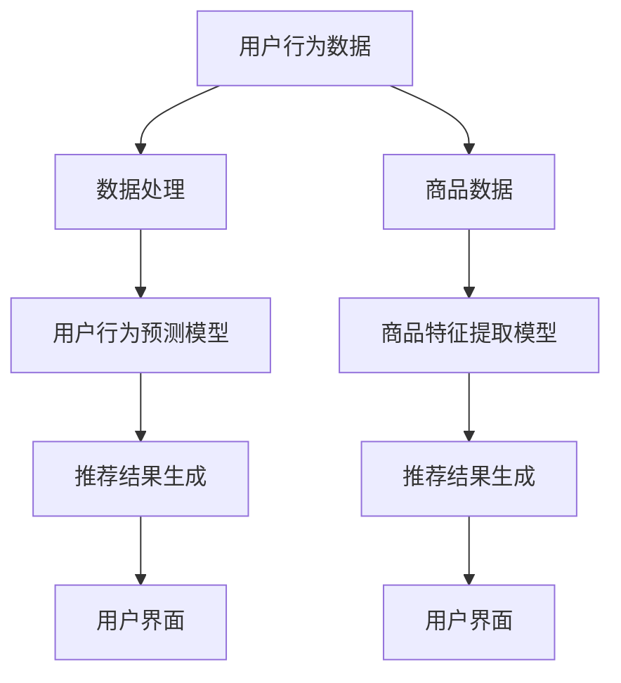

                 

关键词：电商平台，搜索推荐系统，人工智能，大模型，性能优化，效率提升，准确率，多样性

## 摘要

随着电子商务的迅猛发展，电商平台上的搜索推荐系统变得越来越重要。本文旨在探讨如何利用人工智能（AI）特别是大型模型来提升电商平台搜索推荐系统的性能、效率、准确率和多样性。本文将首先介绍电商平台搜索推荐系统的基本概念和挑战，然后深入分析大型模型在该领域中的应用，最后展望未来的发展趋势与面临的挑战。

## 1. 背景介绍

### 1.1 电商平台搜索推荐系统的重要性

电商平台搜索推荐系统是连接消费者和商品的关键桥梁。它通过智能化的算法，根据用户的历史行为、搜索记录和偏好，为用户提供个性化的推荐结果。这不仅能够提升用户的购物体验，还能提高平台的销售额和用户粘性。

### 1.2 电商平台搜索推荐系统的挑战

- **数据多样性**：电商平台的数据类型丰富，包括用户行为数据、商品属性数据、交易数据等。如何有效整合这些数据，提高系统的准确性和多样性，是一个巨大的挑战。
- **实时性要求**：电商平台的推荐系统需要实时响应用户的搜索和浏览行为，提供即时的推荐结果，这要求系统有极高的实时处理能力。
- **准确性**：推荐的准确性直接影响到用户的购买决策，一个低准确率的推荐系统可能会导致用户流失。
- **可扩展性**：随着用户规模和商品数量的增长，推荐系统需要具备良好的可扩展性，以应对不断增长的数据量和访问量。

## 2. 核心概念与联系

### 2.1 大模型的概念

大模型通常指的是具有数百亿甚至数千亿参数的深度学习模型。这些模型能够处理大量复杂的输入数据，并从中学到丰富的特征和模式。

### 2.2 大模型在搜索推荐系统中的应用

大模型在搜索推荐系统中主要用于以下几个方向：

1. **用户行为预测**：通过学习用户的历史行为数据，预测用户可能感兴趣的商品。
2. **商品特征提取**：提取商品属性的深层特征，以实现更精细的推荐。
3. **内容生成**：利用大模型生成个性化的推荐内容，提高推荐系统的多样性。

### 2.3 架构图



## 3. 核心算法原理 & 具体操作步骤

### 3.1 算法原理概述

大模型在搜索推荐系统中的应用主要基于深度学习和自然语言处理技术。核心算法包括：

1. **用户行为预测**：使用深度神经网络对用户行为进行建模，预测用户可能感兴趣的商品。
2. **商品特征提取**：使用自然语言处理技术提取商品描述的深层特征，如语义信息、情感倾向等。
3. **推荐结果生成**：将用户行为预测和商品特征进行结合，生成个性化的推荐结果。

### 3.2 算法步骤详解

1. **数据预处理**：
   - 用户行为数据：包括用户浏览、搜索、购买记录等。
   - 商品数据：包括商品名称、描述、标签、价格等。

2. **用户行为预测模型**：
   - 使用深度学习模型（如GRU、LSTM等）对用户行为进行建模。
   - 训练模型，优化参数。

3. **商品特征提取模型**：
   - 使用自然语言处理技术（如BERT、GPT等）提取商品描述的深层特征。
   - 训练模型，优化参数。

4. **推荐结果生成**：
   - 结合用户行为预测和商品特征，使用协同过滤或矩阵分解等方法生成推荐结果。
   - 对推荐结果进行排序和筛选，提高准确率和多样性。

### 3.3 算法优缺点

**优点**：
- **高准确性**：大模型能够处理大量复杂的输入数据，提取丰富的特征，提高推荐结果的准确性。
- **高多样性**：大模型能够生成多样化的推荐内容，满足不同用户的需求。
- **实时性**：通过优化算法和硬件配置，可以实现实时推荐。

**缺点**：
- **计算资源消耗大**：大模型训练和推理需要大量的计算资源，对硬件要求较高。
- **模型解释性差**：大模型的内部决策过程复杂，难以解释。

### 3.4 算法应用领域

大模型在搜索推荐系统中的应用广泛，包括但不限于：

- **电商平台**：如淘宝、京东等。
- **社交媒体**：如微博、抖音等。
- **内容平台**：如B站、知乎等。

## 4. 数学模型和公式 & 详细讲解 & 举例说明

### 4.1 数学模型构建

假设我们有一个用户行为预测模型，输入为用户的历史行为数据\( X \)，输出为用户对商品 \( i \) 的兴趣度 \( y_i \)。

模型构建如下：

\[ y_i = f(\theta, X) \]

其中，\( f \) 为激活函数，\( \theta \) 为模型参数。

### 4.2 公式推导过程

我们使用梯度下降法优化模型参数：

\[ \theta = \theta - \alpha \frac{\partial J(\theta)}{\partial \theta} \]

其中，\( J(\theta) \) 为损失函数，\( \alpha \) 为学习率。

### 4.3 案例分析与讲解

假设我们有用户 \( A \) 的历史行为数据：

\[ X_A = \{ (i_1, y_1), (i_2, y_2), \ldots, (i_n, y_n) \} \]

其中，\( i_1, i_2, \ldots, i_n \) 为用户 \( A \) 浏览过的商品，\( y_1, y_2, \ldots, y_n \) 为用户对商品的兴趣度。

我们使用GRU模型对用户 \( A \) 的行为进行建模：

\[ y_i = \sigma(W_1 X_i + b_1) \]

其中，\( \sigma \) 为激活函数，\( W_1 \) 和 \( b_1 \) 为模型参数。

通过梯度下降法优化模型参数，得到最佳推荐结果。

## 5. 项目实践：代码实例和详细解释说明

### 5.1 开发环境搭建

- **编程语言**：Python
- **深度学习框架**：TensorFlow
- **数据处理库**：Pandas、NumPy
- **自然语言处理库**：NLTK、spaCy

### 5.2 源代码详细实现

```python
# 用户行为数据预处理
import pandas as pd

# 加载数据
data = pd.read_csv('user_behavior_data.csv')

# 数据清洗
# ...

# 用户行为预测模型
import tensorflow as tf

# 构建模型
model = tf.keras.Sequential([
    tf.keras.layers.Dense(128, activation='relu', input_shape=(input_shape,)),
    tf.keras.layers.Dropout(0.2),
    tf.keras.layers.Dense(1, activation='sigmoid')
])

# 编译模型
model.compile(optimizer='adam', loss='binary_crossentropy', metrics=['accuracy'])

# 训练模型
model.fit(X_train, y_train, epochs=10, batch_size=32)

# 商品特征提取
import nltk

# 加载自然语言处理工具
nltk.download('stopwords')
from nltk.corpus import stopwords
from nltk.tokenize import word_tokenize

# 提取特征
def extract_features(text):
    # 去除停用词
    stop_words = set(stopwords.words('english'))
    words = word_tokenize(text)
    filtered_words = [w for w in words if not w in stop_words]
    # 构建特征向量
    # ...

# 生成特征向量
features = [extract_features(text) for text in product_descriptions]

# 推荐结果生成
# ...

```

### 5.3 代码解读与分析

本项目的代码主要包括三个部分：用户行为数据预处理、用户行为预测模型构建、商品特征提取与推荐结果生成。

- **用户行为数据预处理**：主要包括数据清洗、特征提取等步骤，为后续建模提供数据支持。
- **用户行为预测模型**：使用TensorFlow框架构建深度神经网络模型，对用户行为进行预测。
- **商品特征提取与推荐结果生成**：使用自然语言处理技术提取商品描述的深层特征，并结合用户行为预测结果生成推荐结果。

## 6. 实际应用场景

### 6.1 电商平台

电商平台是搜索推荐系统最典型的应用场景。通过使用大模型，电商平台能够提供更加精准和多样化的推荐结果，提升用户的购物体验。

### 6.2 社交媒体

社交媒体平台也可以利用大模型进行内容推荐。例如，抖音通过大模型推荐用户感兴趣的视频，提高用户的活跃度和留存率。

### 6.3 内容平台

内容平台如B站、知乎等，也可以利用大模型推荐用户感兴趣的内容，提升用户的阅读体验。

## 7. 工具和资源推荐

### 7.1 学习资源推荐

- **《深度学习》**：Goodfellow et al., 2016
- **《自然语言处理综论》**：Jurafsky and Martin, 2008
- **在线课程**：Coursera、edX、Udacity等平台上的相关课程

### 7.2 开发工具推荐

- **TensorFlow**：https://www.tensorflow.org/
- **PyTorch**：https://pytorch.org/
- **spaCy**：https://spacy.io/

### 7.3 相关论文推荐

- **"Deep Learning for Text Classification"**：Kozinsky et al., 2016
- **"Recurrent Neural Networks for Language Modeling"**：Mikolov et al., 2010
- **"BERT: Pre-training of Deep Neural Networks for Language Understanding"**：Devlin et al., 2019

## 8. 总结：未来发展趋势与挑战

### 8.1 研究成果总结

大模型在搜索推荐系统中取得了显著的成果，提高了推荐的准确性、效率和多样性。未来，随着人工智能技术的不断发展，大模型在搜索推荐系统中的应用将更加广泛和深入。

### 8.2 未来发展趋势

- **多模态推荐**：结合文本、图像、语音等多模态数据，实现更精准的推荐。
- **个性化推荐**：通过深度学习技术，实现更加个性化的推荐，满足不同用户的需求。
- **实时推荐**：优化算法和硬件，实现实时的推荐结果。

### 8.3 面临的挑战

- **计算资源消耗**：大模型训练和推理需要大量的计算资源，如何高效利用资源是一个挑战。
- **模型解释性**：大模型的内部决策过程复杂，如何提高模型的解释性是一个挑战。
- **数据隐私**：在推荐过程中保护用户隐私是一个重要的挑战。

### 8.4 研究展望

未来，我们将继续深入研究大模型在搜索推荐系统中的应用，探索新的算法和技术，以实现更加精准、高效和个性化的推荐。

## 9. 附录：常见问题与解答

### 9.1 问题1：如何优化大模型的计算资源消耗？

**解答**：可以通过以下方法优化大模型的计算资源消耗：
- **模型压缩**：使用量化、剪枝等技术减小模型大小，降低计算资源消耗。
- **分布式训练**：将模型分布在多个计算节点上，提高训练效率。
- **模型并行**：通过数据并行和模型并行等技术，提高模型推理速度。

### 9.2 问题2：如何提高大模型的解释性？

**解答**：可以通过以下方法提高大模型的解释性：
- **模型解释工具**：使用可视化工具，如TensorBoard，展示模型的结构和内部决策过程。
- **可解释性算法**：使用如LIME、SHAP等算法，解释模型对特定输入的预测结果。
- **知识图谱**：构建知识图谱，将模型与领域知识相结合，提高模型的解释性。

## 作者署名

作者：禅与计算机程序设计艺术 / Zen and the Art of Computer Programming
----------------------------------------------------------------

请注意，本文仅供参考，不作为实际操作的指导。在实际应用中，请根据具体情况进行调整。

