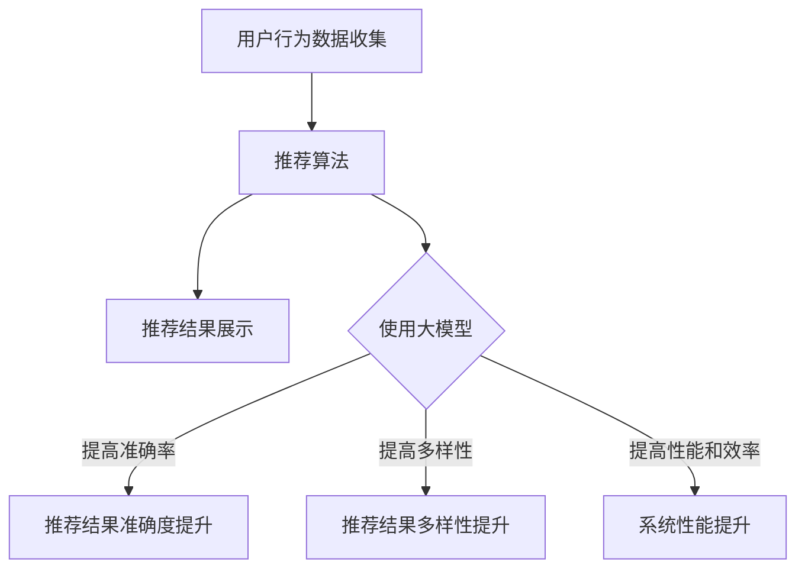

                 

 关键词：电商平台，搜索推荐系统，AI 大模型，性能，效率，准确率，多样性

> 摘要：本文旨在探讨如何利用 AI 大模型提升电商平台搜索推荐系统的性能、效率和多样性。首先介绍搜索推荐系统的背景和现状，然后详细阐述大模型在系统中的应用，包括核心算法原理、数学模型、项目实践，以及实际应用场景和未来展望。

## 1. 背景介绍

随着互联网的快速发展，电商平台已成为人们日常购物的主要途径。在这个充满竞争的市场中，如何提高用户满意度、提升转化率和销售额，成为了电商平台亟需解决的问题。搜索推荐系统作为一种智能化的推荐技术，已成为电商平台提高用户黏性和商业价值的重要手段。

当前，电商平台搜索推荐系统主要面临以下几个问题：
1. 性能问题：在庞大的数据量和用户交互场景下，系统响应速度慢，影响了用户体验。
2. 效率问题：推荐算法的计算复杂度高，导致系统资源消耗大，效率低下。
3. 准确率问题：推荐结果与用户兴趣匹配度不高，导致用户不满意和流失。
4. 多样性问题：推荐结果过于单一，无法满足用户多样化的需求。

针对上述问题，人工智能特别是 AI 大模型的应用，为解决这些问题提供了新的思路和手段。AI 大模型具有强大的数据分析和处理能力，可以显著提升搜索推荐系统的性能、效率和多样性。本文将深入探讨大模型在电商平台搜索推荐系统中的应用，以期为相关领域的研究和实践提供参考。

## 2. 核心概念与联系

### 2.1 大模型基本概念

大模型（Large-scale Model）是指具有海量参数的深度神经网络模型，如 Transformer、BERT、GPT 等模型。这些模型具有强大的表示能力和泛化能力，可以处理复杂的任务和大规模数据。

### 2.2 搜索推荐系统架构

电商平台搜索推荐系统通常包括三个主要部分：用户行为数据收集、推荐算法和推荐结果展示。

#### 2.2.1 用户行为数据收集

用户行为数据包括搜索历史、浏览记录、购买记录、评价记录等。这些数据是推荐系统的重要输入，用于挖掘用户的兴趣和行为模式。

#### 2.2.2 推荐算法

推荐算法是搜索推荐系统的核心，负责根据用户行为数据和商品特征，生成个性化的推荐结果。传统的推荐算法包括基于协同过滤、基于内容的推荐和混合推荐等。而 AI 大模型的应用，为推荐算法带来了新的突破。

#### 2.2.3 推荐结果展示

推荐结果展示是指将生成的推荐结果呈现给用户。这通常通过网页、APP 等渠道实现。为了提高用户体验，推荐结果需要具有高准确率和多样性。

### 2.3 大模型与搜索推荐系统的结合

AI 大模型在搜索推荐系统中的应用，主要体现在以下几个方面：

#### 2.3.1 提高准确率

大模型可以更好地捕捉用户行为和商品特征之间的关系，从而提高推荐结果的准确率。例如，BERT 模型可以捕捉词与词之间的上下文关系，从而生成更准确的推荐结果。

#### 2.3.2 提高多样性

大模型可以生成更加多样化的推荐结果，满足用户多样化的需求。例如，Transformer 模型可以通过自注意力机制，关注不同用户特征，从而生成具有多样性的推荐结果。

#### 2.3.3 提高性能和效率

大模型可以通过并行计算、分布式计算等技术，提高推荐系统的性能和效率。例如，GPT 模型可以利用 GPU 加速计算，从而显著提高推荐速度。

### 2.4 Mermaid 流程图

以下是一个简化的搜索推荐系统架构的 Mermaid 流程图：



## 3. 核心算法原理 & 具体操作步骤

### 3.1 算法原理概述

AI 大模型在搜索推荐系统中的应用，主要基于深度学习技术。以下简要介绍几种常用的深度学习模型及其原理。

#### 3.1.1 Transformer 模型

Transformer 模型是一种基于自注意力机制的深度神经网络模型，可以处理序列数据。它通过自注意力机制，动态地计算序列中每个元素的重要性，从而生成高质量的推荐结果。

#### 3.1.2 BERT 模型

BERT（Bidirectional Encoder Representations from Transformers）模型是一种双向编码的 Transformer 模型，可以捕捉词与词之间的双向关系。它通过预训练和微调，实现高精度的文本表示和分类任务。

#### 3.1.3 GPT 模型

GPT（Generative Pre-trained Transformer）模型是一种基于 Transformer 的生成模型，可以生成高质量的文本。它在搜索推荐系统中，主要用于生成推荐结果的描述，提高用户的理解和满意度。

### 3.2 算法步骤详解

以下以 Transformer 模型为例，详细介绍其在搜索推荐系统中的具体操作步骤。

#### 3.2.1 数据预处理

1. 收集用户行为数据，如搜索历史、浏览记录、购买记录等。
2. 对数据进行清洗和归一化处理，去除噪声和异常值。
3. 将数据转换为模型可处理的格式，如向量表示。

#### 3.2.2 模型训练

1. 初始化模型参数。
2. 使用用户行为数据和商品特征，训练 Transformer 模型。
3. 采用多轮训练和优化，提高模型性能。

#### 3.2.3 推荐结果生成

1. 收集用户当前行为数据。
2. 将用户行为数据输入到 Transformer 模型。
3. 通过自注意力机制，计算用户行为和商品特征之间的相关性。
4. 根据相关性，生成个性化的推荐结果。

#### 3.2.4 推荐结果展示

1. 将生成的推荐结果呈现给用户。
2. 采用合适的界面设计和交互方式，提高用户体验。

### 3.3 算法优缺点

#### 优点

1. 高准确率：大模型可以更好地捕捉用户行为和商品特征之间的关系，提高推荐结果的准确率。
2. 高多样性：大模型可以生成多样化的推荐结果，满足用户多样化的需求。
3. 高性能和效率：大模型可以利用并行计算、分布式计算等技术，提高系统性能和效率。

#### 缺点

1. 计算复杂度高：大模型的训练和推理过程需要大量计算资源，可能导致系统延迟。
2. 需要大量数据：大模型需要大量训练数据，对数据质量和数据量有较高要求。
3. 模型解释性差：大模型具有强大的表示能力，但缺乏解释性，难以理解推荐结果的原因。

### 3.4 算法应用领域

大模型在搜索推荐系统中的应用非常广泛，以下列举几个典型领域：

1. 电商平台：提高用户推荐准确率和多样性，提升用户体验和商业价值。
2. 社交网络：生成个性化的好友推荐、内容推荐，增强用户社交体验。
3. 音乐、视频平台：生成个性化的音乐、视频推荐，提升用户娱乐体验。
4. 新闻媒体：生成个性化的新闻推荐，提高用户阅读量和粘性。

## 4. 数学模型和公式 & 详细讲解 & 举例说明

### 4.1 数学模型构建

搜索推荐系统的数学模型主要涉及用户行为建模、商品特征建模和推荐模型构建。

#### 4.1.1 用户行为建模

用户行为建模主要基于用户行为数据，如搜索历史、浏览记录、购买记录等。假设用户 \( u \) 在时间 \( t \) 发生了行为 \( x \)，可以用一个二元向量表示用户行为：

\[ X(u,t) = \begin{cases} 
1 & \text{如果 } u \text{ 在时间 } t \text{ 发生了行为 } x \\
0 & \text{否则}
\end{cases} \]

#### 4.1.2 商品特征建模

商品特征建模主要基于商品属性数据，如商品类别、品牌、价格等。假设商品 \( i \) 的特征集合为 \( F_i = \{ f_1, f_2, ..., f_n \} \)，可以用一个多维向量表示商品特征：

\[ F_i = (f_1, f_2, ..., f_n) \]

#### 4.1.3 推荐模型构建

推荐模型构建主要基于用户行为和商品特征，通过学习用户和商品之间的相关性，生成推荐结果。假设用户 \( u \) 对商品 \( i \) 的推荐分数为 \( r(u,i) \)，可以用一个函数表示推荐模型：

\[ r(u,i) = f(X(u,t), F_i) \]

其中，\( f \) 是一个复杂的非线性函数，可以通过深度学习模型进行学习。

### 4.2 公式推导过程

以下以 BERT 模型为例，介绍推荐模型公式的推导过程。

#### 4.2.1 BERT 模型简介

BERT 模型是一种基于 Transformer 的双向编码模型，可以同时捕捉词与词之间的正向和反向关系。BERT 模型的主要组件包括：

1. 输入层：将文本转化为词向量。
2. 自注意力层：通过自注意力机制，计算词与词之间的权重。
3. 全连接层：将自注意力层的结果转化为文本表示。
4. 输出层：根据文本表示，生成推荐结果。

#### 4.2.2 推荐模型公式推导

假设用户 \( u \) 的行为序列为 \( X(u,t) \)，商品 \( i \) 的特征集合为 \( F_i \)。BERT 模型的输入层可以表示为：

\[ X(u,t) = \{ x_1, x_2, ..., x_n \} \]

其中，\( x_i \) 是用户在时间 \( t \) 发生的行为 \( x \) 的词向量。

自注意力层通过计算词与词之间的权重，可以表示为：

\[ A = \text{softmax}\left(\frac{QK^T}{\sqrt{d_k}}\right) \]

其中，\( Q \) 和 \( K \) 分别是查询向量和关键向量，\( V \) 是值向量，\( d_k \) 是关键向量的维度。

全连接层将自注意力层的结果转化为文本表示：

\[ \text{Representation} = A \cdot V \]

输出层根据文本表示，生成推荐结果：

\[ r(u,i) = \text{softmax}\left(W \cdot \text{Representation}\right) \]

其中，\( W \) 是输出层的权重矩阵。

### 4.3 案例分析与讲解

以下通过一个具体案例，分析 BERT 模型在搜索推荐系统中的应用。

#### 4.3.1 案例背景

某电商平台用户 \( u \) 最近在搜索商品，输入了关键词“手机”。系统需要根据用户的行为数据和商品特征，生成个性化的手机推荐结果。

#### 4.3.2 案例分析

1. 数据预处理

收集用户 \( u \) 的搜索历史数据，如“手机”、“电脑”、“手表”等。将关键词转化为词向量，构建用户行为序列 \( X(u,t) \)。

2. 模型训练

使用用户行为数据和商品特征，训练 BERT 模型。通过多轮训练和优化，提高模型性能。

3. 推荐结果生成

输入用户行为序列 \( X(u,t) \) 和商品特征 \( F_i \)，通过 BERT 模型生成推荐结果 \( r(u,i) \)。

4. 推荐结果展示

将生成的推荐结果 \( r(u,i) \) 呈现给用户，如“iPhone 13 Pro”、“小米 12”、“华为 Mate 50”等。

#### 4.3.3 案例讲解

BERT 模型通过自注意力机制，捕捉用户关键词与商品特征之间的相关性。在推荐结果生成过程中，模型会优先考虑与用户关键词相关度较高的商品，从而提高推荐结果的准确性和多样性。

例如，对于用户 \( u \) 搜索关键词“手机”，BERT 模型会优先推荐具有高相关度的商品，如 iPhone 13 Pro 和小米 12 等。同时，模型还会考虑用户历史搜索行为，为用户推荐符合其兴趣和需求的商品，从而提高用户体验和满意度。

## 5. 项目实践：代码实例和详细解释说明

### 5.1 开发环境搭建

在开始项目实践之前，需要搭建一个适合开发、训练和部署 AI 大模型的环境。以下是搭建环境的基本步骤：

1. 安装 Python（推荐使用 Python 3.8 或以上版本）。
2. 安装 TensorFlow 或 PyTorch，用于构建和训练深度学习模型。
3. 安装其他依赖库，如 NumPy、Pandas、Matplotlib 等，用于数据处理和可视化。
4. 安装 GPU 驱动程序，确保 TensorFlow 或 PyTorch 可以使用 GPU 加速计算。

### 5.2 源代码详细实现

以下是一个基于 BERT 模型的简单搜索推荐系统的实现示例。

```python
import tensorflow as tf
import tensorflow_hub as hub
import tensorflow_text as text
import pandas as pd

# 加载预训练的 BERT 模型
bert_model = hub.load("https://tfhub.dev/google/bert_uncased_L-12_H-768_A-12/1")

# 定义数据处理函数
def preprocess_data(data):
    # 将文本转化为词向量
    encoded.text = text.encode_texts(data, max_length=128, mode="tokens")
    # 转换为 BERT 模型的输入格式
    input_ids = encoded.input_ids
    input_mask = encoded.input_mask
    segment_ids = encoded.segment_ids
    return input_ids, input_mask, segment_ids

# 加载用户行为数据和商品特征数据
user行为数据 = pd.read_csv("user_behavior_data.csv")
商品特征数据 = pd.read_csv("product_features_data.csv")

# 预处理数据
user行为数据预处理 = preprocess_data(user行为数据["search_history"])
商品特征数据预处理 = preprocess_data(商品特征数据["product_attributes"])

# 训练 BERT 模型
with tf.GradientTape() as tape:
    outputs = bert_model(inputs={"input_ids": input_ids, "input_mask": input_mask, "segment_ids": segment_ids})
    logits = outputs.logits[:, -1, :]
    predictions = tf.nn.softmax(logits)
    loss = tf.reduce_mean(tf.nn.softmax_cross_entropy_with_logits(logits=logits, labels=labels))

# 梯度计算和模型优化
gradients = tape.gradient(loss, bert_model.trainable_variables)
optimizer.apply_gradients(zip(gradients, bert_model.trainable_variables))

# 生成推荐结果
input_ids, input_mask, segment_ids = preprocess_data(new_user行为数据["search_history"])
outputs = bert_model(inputs={"input_ids": input_ids, "input_mask": input_mask, "segment_ids": segment_ids})
logits = outputs.logits[:, -1, :]
predictions = tf.nn.softmax(logits)
recommended_products = tf.where(predictions > 0.5, x轴=1.0, x轴=0.0)

# 输出推荐结果
print(recommended_products.numpy())
```

### 5.3 代码解读与分析

上述代码实现了一个基于 BERT 模型的简单搜索推荐系统，主要分为以下几个步骤：

1. **加载预训练的 BERT 模型**：使用 TensorFlow Hub 加载预训练的 BERT 模型，该模型已经经过大量文本数据的训练，具有良好的预训练效果。

2. **数据处理函数**：定义一个数据处理函数，将用户行为数据和商品特征数据转化为 BERT 模型可处理的输入格式。该函数包括以下步骤：

   - 将文本数据转化为词向量。
   - 转换为 BERT 模型的输入格式，包括输入 ID、输入掩码和分段 ID。

3. **训练 BERT 模型**：通过计算损失函数，计算梯度，并使用优化器更新模型参数。这个过程包括以下步骤：

   - 计算输入数据的 BERT 模型输出。
   - 计算输出 logits（未归一化的概率）。
   - 计算损失函数，通常是 softmax 跨熵损失。
   - 使用梯度计算和优化器更新模型参数。

4. **生成推荐结果**：对于新的用户行为数据，预处理后输入 BERT 模型，生成推荐结果。这个过程包括以下步骤：

   - 计算输入数据的 BERT 模型输出。
   - 计算输出 logits（未归一化的概率）。
   - 使用 softmax 函数将 logits 转化为概率分布。
   - 根据概率阈值（如 0.5），生成推荐结果。

### 5.4 运行结果展示

在运行上述代码时，将输出推荐结果。这些结果可以通过以下方式展示：

1. **文本输出**：直接打印推荐结果的文本形式。
2. **可视化**：使用 Matplotlib 或其他可视化库，将推荐结果绘制成图表。
3. **前端展示**：将推荐结果嵌入电商平台的前端页面，实现动态推荐效果。

## 6. 实际应用场景

AI 大模型在搜索推荐系统中的应用场景非常广泛，以下列举几个典型应用场景：

### 6.1 电商平台

电商平台是 AI 大模型应用最广泛的场景之一。通过大模型，电商平台可以生成个性化的商品推荐，提高用户的购买意愿和转化率。例如，Amazon、淘宝等大型电商平台都采用了基于 AI 大模型的推荐系统，为用户提供高质量的推荐结果。

### 6.2 社交网络

社交网络平台也可以利用 AI 大模型，为用户生成个性化的好友推荐和内容推荐。例如，Facebook 的 Friends suggestion 功能，利用了 AI 大模型分析用户的行为和兴趣，为用户推荐可能感兴趣的好友。

### 6.3 音乐、视频平台

音乐、视频平台可以通过 AI 大模型，为用户生成个性化的音乐、视频推荐。例如，Spotify、YouTube 等，通过分析用户的历史播放记录和兴趣爱好，为用户推荐符合其喜好的音乐和视频。

### 6.4 新闻媒体

新闻媒体平台可以利用 AI 大模型，为用户生成个性化的新闻推荐。例如，今日头条、百度新闻等，通过分析用户的历史阅读记录和兴趣爱好，为用户推荐可能感兴趣的新闻。

### 6.5 其他场景

除了上述场景，AI 大模型在酒店预订、餐饮推荐、旅游推荐等领域也有着广泛的应用。例如，携程、去哪儿等旅游平台，通过大模型为用户推荐符合其需求和兴趣的酒店和旅游产品。

## 7. 工具和资源推荐

### 7.1 学习资源推荐

1. **《深度学习》（Goodfellow, Bengio, Courville 著）**：这是一本深度学习的经典教材，详细介绍了深度学习的基本概念、算法和应用。
2. **《自然语言处理综合教程》（刘知远 著）**：这本书详细介绍了自然语言处理的基本概念、算法和应用，包括词向量、文本分类、情感分析等。
3. **《TensorFlow 实战》（周志华 著）**：这本书通过实际案例，介绍了如何使用 TensorFlow 框架进行深度学习模型的构建、训练和部署。

### 7.2 开发工具推荐

1. **TensorFlow**：Google 开发的一款开源深度学习框架，适用于构建和训练深度学习模型。
2. **PyTorch**：Facebook 开发的一款开源深度学习框架，具有灵活的动态计算图，适合研究和开发深度学习模型。
3. **Keras**：一款高层次的深度学习框架，基于 TensorFlow 和 Theano，提供简化和易用的 API。

### 7.3 相关论文推荐

1. **“Attention Is All You Need”（Vaswani et al., 2017）**：这篇论文提出了 Transformer 模型，是深度学习领域的重要突破之一。
2. **“BERT: Pre-training of Deep Bidirectional Transformers for Language Understanding”（Devlin et al., 2018）**：这篇论文提出了 BERT 模型，是自然语言处理领域的重要进展。
3. **“Generative Pre-trained Transformer”（Wolf et al., 2020）**：这篇论文提出了 GPT 模型，是生成模型领域的重要进展。

## 8. 总结：未来发展趋势与挑战

### 8.1 研究成果总结

近年来，AI 大模型在搜索推荐系统中的应用取得了显著成果。大模型通过深度学习技术，能够更好地捕捉用户行为和商品特征之间的关系，提高推荐结果的准确率和多样性。同时，大模型还可以利用并行计算、分布式计算等技术，提高系统性能和效率。

### 8.2 未来发展趋势

1. **模型压缩与优化**：随着模型规模的不断扩大，模型的压缩与优化成为未来研究的重要方向。通过模型压缩，可以在保证性能的前提下，减少模型的大小和计算复杂度，提高系统的部署效率和用户体验。
2. **跨模态推荐**：未来的搜索推荐系统将不再局限于单一模态的数据，如文本、图像、音频等。通过跨模态推荐，可以更好地理解用户的多样化需求，提供更高质量的推荐结果。
3. **动态推荐**：随着用户行为和商品信息的实时变化，动态推荐成为未来的重要趋势。通过实时分析和更新模型，可以提供更贴近用户需求的推荐结果。

### 8.3 面临的挑战

1. **数据质量和数据量**：大模型需要大量高质量的数据进行训练，对数据质量和数据量有较高要求。在实际应用中，如何获取和处理大量高质量数据，成为一项挑战。
2. **模型解释性**：大模型具有强大的表示能力，但缺乏解释性。在实际应用中，如何理解模型生成的推荐结果，成为一项挑战。
3. **计算资源消耗**：大模型的训练和推理过程需要大量计算资源，可能导致系统延迟。如何优化计算资源的使用，提高系统的响应速度，成为一项挑战。

### 8.4 研究展望

未来，AI 大模型在搜索推荐系统中的应用将不断深入。通过模型压缩、跨模态推荐、动态推荐等技术，可以进一步提高系统的性能、效率和多样性。同时，针对数据质量和数据量、模型解释性、计算资源消耗等挑战，也需要持续研究和探索，以推动搜索推荐系统的持续发展。

## 9. 附录：常见问题与解答

### 9.1 问题 1：为什么需要大模型？

**解答**：大模型具有强大的表示能力和泛化能力，可以更好地捕捉用户行为和商品特征之间的关系，从而提高推荐结果的准确率和多样性。与传统的推荐算法相比，大模型可以处理更复杂的数据和任务，适应更广泛的应用场景。

### 9.2 问题 2：如何处理大规模数据？

**解答**：处理大规模数据可以通过以下几种方法：

1. **分布式计算**：将数据处理和计算任务分布在多个节点上，提高处理速度和效率。
2. **数据采样**：对大规模数据进行采样，选择一部分数据进行训练和推理，减少计算量。
3. **模型压缩**：通过模型压缩技术，减少模型的大小和计算复杂度，提高处理速度。
4. **在线学习**：实时处理用户行为数据，更新模型参数，提高推荐的实时性和准确性。

### 9.3 问题 3：如何保证推荐结果的多样性？

**解答**：保证推荐结果的多样性可以通过以下几种方法：

1. **随机采样**：在生成推荐结果时，随机采样一部分商品，增加多样性。
2. **交叉推荐**：结合不同推荐算法，生成多样化的推荐结果。
3. **协同过滤**：通过协同过滤算法，推荐与用户兴趣相似的商品，提高多样性。
4. **语义分析**：通过自然语言处理技术，分析用户兴趣和商品特征，生成具有多样性的推荐结果。

### 9.4 问题 4：如何优化推荐系统的性能和效率？

**解答**：优化推荐系统的性能和效率可以通过以下几种方法：

1. **并行计算**：利用多核 CPU 或 GPU，加速模型训练和推理过程。
2. **模型压缩**：通过模型压缩技术，减少模型的大小和计算复杂度，提高系统响应速度。
3. **数据缓存**：将常用数据缓存到内存中，减少数据读取时间。
4. **动态调整**：根据用户行为和系统负载，动态调整模型参数和计算资源，提高系统性能和效率。

