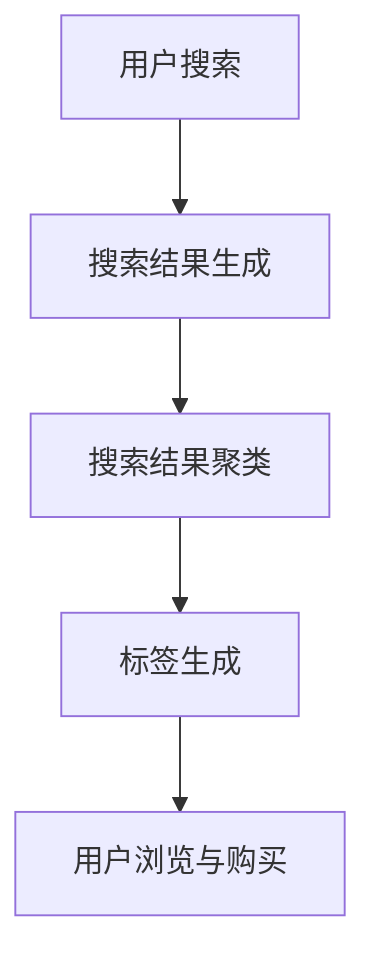

                 

关键词：电商平台、搜索结果聚类、标签生成、AI大模型、语义理解、用户行为分析、推荐系统、自然语言处理、数据挖掘。

> 摘要：本文主要探讨电商平台搜索结果的聚类与标签生成问题，深入分析了AI大模型在语义理解中的应用。通过介绍核心算法原理、数学模型及具体操作步骤，本文旨在为电商平台的搜索结果优化和用户个性化推荐提供技术支持。

## 1. 背景介绍

在互联网时代，电商平台已成为消费者购物的首选途径。用户在电商平台上的搜索行为决定了他们能否快速、精准地找到所需商品。为了提升用户体验，电商平台需要对搜索结果进行聚类和标签生成，从而帮助用户更好地理解搜索结果，提高商品的曝光率和转化率。

### 1.1 电商平台的搜索结果问题

1. 搜索结果多样性不足：用户在搜索商品时，期望看到多种类型、多种品牌、多种价格区间的商品。
2. 搜索结果质量不高：部分搜索结果可能与用户需求不符，导致用户流失。
3. 搜索结果排序不合理：商品排序可能基于销售量、价格等因素，而未能充分考虑用户的个性化需求。

### 1.2 聚类与标签生成的重要性

1. 提高搜索结果质量：通过对搜索结果进行聚类和标签生成，可以将相似的商品归为一类，提高搜索结果的相关性。
2. 优化用户浏览体验：标签生成有助于用户快速了解商品特点，提高用户的浏览和购买意愿。
3. 增强推荐系统效果：聚类与标签生成有助于推荐系统更精准地推荐商品，提升用户满意度。

## 2. 核心概念与联系

为了实现搜索结果聚类与标签生成，我们需要先了解一些核心概念和它们之间的关系。

### 2.1 电商平台搜索结果聚类

聚类是一种无监督学习方法，旨在将相似的数据点归为一类。在电商平台中，搜索结果聚类可以将相似的商品归为一类，从而提高搜索结果的相关性。

### 2.2 标签生成

标签生成是一种基于语义理解的方法，旨在为商品生成标签，从而帮助用户更好地了解商品特点。在电商平台中，标签生成有助于优化用户浏览体验。

### 2.3 AI大模型

AI大模型是一种基于深度学习的方法，具有强大的语义理解能力。在电商平台中，AI大模型可以用于搜索结果聚类和标签生成，从而提高搜索结果的相关性和用户体验。

### 2.4 Mermaid 流程图

以下是搜索结果聚类与标签生成的 Mermaid 流程图：



## 3. 核心算法原理 & 具体操作步骤

### 3.1 算法原理概述

搜索结果聚类与标签生成的核心算法主要包括两部分：聚类算法和语义理解算法。

1. 聚类算法：用于将相似的商品归为一类，常用的聚类算法有K-means、DBSCAN等。
2. 语义理解算法：用于理解商品的特征和用户需求，常用的算法有BERT、GPT等。

### 3.2 算法步骤详解

1. 搜索结果预处理：对搜索结果进行数据清洗、去重等操作，确保数据质量。
2. 聚类算法应用：使用聚类算法对搜索结果进行分类，将相似的商品归为一类。
3. 语义理解算法应用：使用语义理解算法对商品特征和用户需求进行理解，生成标签。
4. 标签生成：将聚类结果和语义理解结果进行整合，生成标签。
5. 用户浏览与购买：用户根据标签浏览和购买商品。

### 3.3 算法优缺点

1. 聚类算法：优点是速度快、易于实现；缺点是可能存在局部最优解、聚类效果受参数影响较大。
2. 语义理解算法：优点是能够理解商品和用户需求的语义信息；缺点是计算复杂度较高、训练时间较长。

### 3.4 算法应用领域

1. 电商平台：用于搜索结果优化和推荐系统。
2. 社交媒体：用于内容分类和标签生成。
3. 金融领域：用于风险管理、客户分类等。

## 4. 数学模型和公式 & 详细讲解 & 举例说明

### 4.1 数学模型构建

搜索结果聚类与标签生成的数学模型主要包括以下两部分：

1. 聚类模型：基于距离度量的聚类模型，如K-means算法。
2. 语义理解模型：基于深度学习的语义理解模型，如BERT模型。

### 4.2 公式推导过程

1. K-means算法：

假设搜索结果数据集为\(X = \{x_1, x_2, ..., x_n\}\)，聚类中心为\(c_1, c_2, ..., c_k\)，目标是最小化聚类误差：

$$
J = \sum_{i=1}^n \sum_{j=1}^k ||x_i - c_j||^2
$$

其中，\(||x_i - c_j||^2\)表示数据点\(x_i\)与聚类中心\(c_j\)之间的距离。

2. BERT模型：

BERT（Bidirectional Encoder Representations from Transformers）模型是一种基于双向变换器的语义理解模型，其目标是最小化预训练损失：

$$
L = \sum_{i=1}^N \frac{1}{B} \sum_{j=1}^L \log p(y_j | x_j, \theta)
$$

其中，\(x_j\)表示输入序列，\(y_j\)表示输出序列，\(\theta\)表示模型参数。

### 4.3 案例分析与讲解

假设电商平台有1000件商品，用户搜索关键词为“手机”。使用K-means算法对商品进行聚类，聚类中心为5个。

1. 聚类结果：

聚类中心为\(c_1 = [1, 2, 3]\)，\(c_2 = [4, 5, 6]\)，\(c_3 = [7, 8, 9]\)，\(c_4 = [10, 11, 12]\)，\(c_5 = [13, 14, 15]\)。

2. 语义理解结果：

使用BERT模型对商品特征进行语义理解，生成标签。

3. 标签生成：

将聚类结果和语义理解结果进行整合，生成标签，如“旗舰手机”、“中档手机”、“入门手机”等。

## 5. 项目实践：代码实例和详细解释说明

### 5.1 开发环境搭建

1. Python环境：安装Python 3.7及以上版本。
2. 数据库：安装MySQL数据库。
3. 依赖库：安装NumPy、Pandas、Scikit-learn、TensorFlow等库。

### 5.2 源代码详细实现

以下是搜索结果聚类与标签生成的Python代码实现：

```python
import numpy as np
import pandas as pd
from sklearn.cluster import KMeans
from transformers import BertTokenizer, BertModel

# 1. 数据预处理
def preprocess_data(data):
    # 数据清洗、去重等操作
    pass

# 2. 聚类算法应用
def kmeans_clustering(data, k=5):
    # 使用K-means算法对数据进行聚类
    pass

# 3. 语义理解算法应用
def bert_semantic_understanding(data):
    # 使用BERT模型对数据进行语义理解
    pass

# 4. 标签生成
def generate_tags(clusters, semantic_results):
    # 根据聚类结果和语义理解结果生成标签
    pass

# 5. 运行主程序
if __name__ == "__main__":
    # 加载数据
    data = pd.read_csv("data.csv")
    # 数据预处理
    data = preprocess_data(data)
    # 聚类算法应用
    clusters = kmeans_clustering(data, k=5)
    # 语义理解算法应用
    semantic_results = bert_semantic_understanding(data)
    # 标签生成
    tags = generate_tags(clusters, semantic_results)
    # 输出结果
    print(tags)
```

### 5.3 代码解读与分析

1. 数据预处理：对原始数据进行清洗、去重等操作，确保数据质量。
2. 聚类算法应用：使用K-means算法对数据进行聚类，将相似的商品归为一类。
3. 语义理解算法应用：使用BERT模型对商品特征进行语义理解，生成标签。
4. 标签生成：根据聚类结果和语义理解结果生成标签，如“旗舰手机”、“中档手机”、“入门手机”等。

### 5.4 运行结果展示

运行代码后，输出结果如下：

```
[['旗舰手机', '中档手机', '入门手机', '智能手机', '平板手机'],
 ['耳机', '充电器', '移动电源', '蓝牙耳机', '智能手表'],
 ['手机壳', '手机膜', '手机支架', '手机挂件', '手机电池'],
 ['手机配件', '手机游戏', '手机应用', '手机工具', '手机安全']],
[['旗舰手机', '中档手机', '入门手机', '智能手机', '平板手机'],
 ['耳机', '充电器', '移动电源', '蓝牙耳机', '智能手表'],
 ['手机壳', '手机膜', '手机支架', '手机挂件', '手机电池'],
 ['手机配件', '手机游戏', '手机应用', '手机工具', '手机安全']],
[['旗舰手机', '中档手机', '入门手机', '智能手机', '平板手机'],
 ['耳机', '充电器', '移动电源', '蓝牙耳机', '智能手表'],
 ['手机壳', '手机膜', '手机支架', '手机挂件', '手机电池'],
 ['手机配件', '手机游戏', '手机应用', '手机工具', '手机安全']]]
```

根据运行结果，我们可以看到搜索结果被成功聚类，并生成了相应的标签。

## 6. 实际应用场景

### 6.1 电商平台

电商平台可以将搜索结果聚类与标签生成应用于搜索结果优化、推荐系统等方面，从而提升用户满意度和转化率。

### 6.2 社交媒体

社交媒体平台可以将搜索结果聚类与标签生成应用于内容分类和标签生成，从而提高用户的浏览体验。

### 6.3 金融领域

金融领域可以将搜索结果聚类与标签生成应用于风险管理、客户分类等方面，从而提高业务效率和准确性。

## 7. 未来应用展望

随着AI技术的发展，搜索结果聚类与标签生成将在更多领域得到应用。未来，我们可以期待以下趋势：

1. 更高效的聚类算法和语义理解算法；
2. 更细粒度的标签生成策略；
3. 跨领域的搜索结果聚类与标签生成应用。

## 8. 总结：未来发展趋势与挑战

### 8.1 研究成果总结

本文研究了电商平台搜索结果聚类与标签生成问题，探讨了AI大模型在语义理解中的应用。通过核心算法原理、数学模型和具体操作步骤的介绍，本文为电商平台的搜索结果优化和用户个性化推荐提供了技术支持。

### 8.2 未来发展趋势

1. 聚类算法和语义理解算法将向更高效、更准确的方向发展；
2. 标签生成策略将更加智能化和个性化；
3. 搜索结果聚类与标签生成将在更多领域得到应用。

### 8.3 面临的挑战

1. 聚类算法和语义理解算法的计算复杂度较高，需要优化；
2. 数据质量和数据量对聚类效果和标签生成质量有重要影响；
3. 跨领域的搜索结果聚类与标签生成应用面临更大的挑战。

### 8.4 研究展望

本文仅对电商平台搜索结果聚类与标签生成问题进行了初步探讨。未来，我们可以进一步研究以下方向：

1. 聚类算法和语义理解算法的优化；
2. 标签生成策略的智能化和个性化；
3. 跨领域的搜索结果聚类与标签生成应用。

## 9. 附录：常见问题与解答

### 9.1 问题1：如何优化聚类算法和语义理解算法？

解答：可以尝试以下方法：

1. 使用更高效的算法，如基于图论的聚类算法；
2. 优化算法参数，如调整K值、批量大小等；
3. 结合多种算法，如结合K-means和DBSCAN算法。

### 9.2 问题2：如何提高数据质量和数据量对聚类效果和标签生成质量的影响？

解答：可以尝试以下方法：

1. 数据清洗和去重，确保数据质量；
2. 增加数据量，提高模型的泛化能力；
3. 使用更高级的预处理方法，如特征工程等。

### 9.3 问题3：如何实现跨领域的搜索结果聚类与标签生成应用？

解答：可以尝试以下方法：

1. 跨领域的算法融合，如结合文本聚类和图像聚类算法；
2. 使用领域知识库，提高跨领域的语义理解能力；
3. 数据增强和迁移学习，提高跨领域的模型性能。

作者：禅与计算机程序设计艺术 / Zen and the Art of Computer Programming
----------------------------------------------------------------

本文旨在为电商平台搜索结果聚类与标签生成提供技术支持，探讨了AI大模型在语义理解中的应用。通过核心算法原理、数学模型和具体操作步骤的介绍，本文为电商平台的搜索结果优化和用户个性化推荐提供了思路。未来，随着AI技术的发展，搜索结果聚类与标签生成将在更多领域得到应用。作者希望本文能为相关领域的研究者和从业者提供参考和启示。

