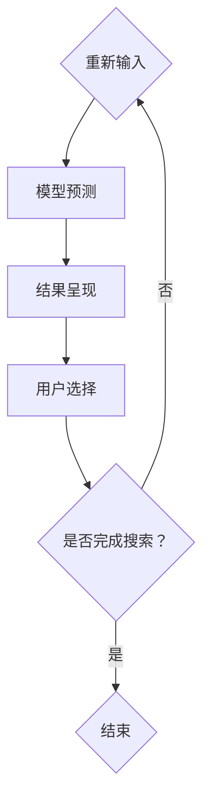

                 

### 关键词：电商平台、搜索自动补全、AI大模型、上下文感知、个性化、算法、技术博客

> **摘要**：本文深入探讨了电商平台搜索自动补全功能中的关键技术，即AI大模型的上下文感知与个性化。通过分析核心概念、算法原理、数学模型以及具体实现，本文旨在为开发者提供全面的技术指南，帮助他们在电商平台上实现高效、智能的搜索体验。

## 1. 背景介绍

在电子商务迅速发展的今天，用户在电商平台上的搜索行为已成为驱动销售的重要因素。然而，用户的搜索输入往往是不完整或不准确的，这使得传统的搜索系统很难提供准确的结果。为了解决这个问题，搜索自动补全功能被广泛采用。这种功能不仅能够提高搜索效率，还能提升用户的满意度。

随着人工智能技术的不断发展，尤其是深度学习和自然语言处理技术的进步，搜索自动补全功能迎来了新的变革。AI大模型，特别是基于大规模预训练模型（如BERT、GPT等），开始在搜索自动补全领域展现出强大的潜力。这些模型通过学习海量用户数据，能够理解用户搜索意图的上下文，并自动生成补全建议。

本文将重点讨论AI大模型在电商平台搜索自动补全中的应用，包括上下文感知和个性化技术，旨在为开发者提供一整套实现高效搜索自动补全的解决方案。

## 2. 核心概念与联系

### 2.1. 自动补全的基本概念

搜索自动补全是一种通过预测用户可能的完整输入来提升搜索效率的技术。其基本工作流程如下：

1. **用户输入**：用户在搜索框中输入部分查询。
2. **模型预测**：自动补全系统根据当前输入和用户历史行为，预测可能的完整查询。
3. **结果呈现**：系统将预测结果以列表形式展示给用户，用户可以从中选择合适的完整查询。

### 2.2. AI大模型的概念

AI大模型指的是那些经过大规模数据训练，参数数量庞大的神经网络模型。这些模型通过深度学习技术，能够从大量数据中自动提取特征，并在不同任务上表现出色。典型的AI大模型包括BERT、GPT、T5等。

### 2.3. 上下文感知的概念

上下文感知是指模型能够理解输入查询的上下文信息，从而做出更准确的预测。在搜索自动补全中，上下文感知能力至关重要，因为它能帮助模型理解用户的意图和需求。

### 2.4. 个性化概念

个性化是指系统能够根据用户的历史行为和偏好，提供定制化的搜索建议。个性化技术能够显著提升用户的搜索体验，使其更加贴合用户的需求。

### 2.5. Mermaid流程图

以下是一个简单的Mermaid流程图，展示了搜索自动补全的基本流程：



## 3. 核心算法原理 & 具体操作步骤

### 3.1 算法原理概述

搜索自动补全算法的核心是基于大规模预训练模型（如BERT、GPT）的上下文感知和个性化技术。这些模型通过以下步骤实现自动补全：

1. **输入编码**：将用户输入的查询编码为向量。
2. **上下文理解**：利用预训练模型处理用户输入和上下文信息，提取查询的上下文特征。
3. **预测生成**：根据上下文特征生成可能的完整查询。
4. **结果筛选**：根据用户历史行为和偏好，筛选出最合适的查询结果。

### 3.2 算法步骤详解

#### 3.2.1 输入编码

输入编码是自动补全算法的第一步。在BERT模型中，输入查询会被编码为一个序列，每个单词或字符都被映射为一个向量。然后，通过BERT模型的编码器，将这些向量转化为上下文特征向量。

#### 3.2.2 上下文理解

在理解上下文信息时，预训练模型会处理用户输入和上下文信息，将其转化为上下文特征向量。这些特征向量包含了用户查询的语义信息，使得模型能够理解查询的意图。

#### 3.2.3 预测生成

一旦获得了上下文特征向量，模型会利用这些特征来预测可能的完整查询。在GPT模型中，这一过程是通过生成文本序列来实现的。模型会生成一系列可能的查询结果，并根据概率进行排序。

#### 3.2.4 结果筛选

在筛选结果时，系统会根据用户的历史行为和偏好来调整查询结果的排序。这样可以确保系统提供的结果更符合用户的个人喜好。

### 3.3 算法优缺点

#### 优点

- **高效性**：基于深度学习的预训练模型能够快速处理海量数据，提供高效的搜索补全服务。
- **准确性**：通过理解上下文信息和用户偏好，系统能够提供更加准确和个性化的搜索建议。
- **可扩展性**：AI大模型可以轻松适应不同的电商平台和应用场景，具有良好的可扩展性。

#### 缺点

- **计算资源消耗**：预训练模型需要大量的计算资源和存储空间，对于资源有限的平台可能存在挑战。
- **数据隐私问题**：个性化搜索需要处理用户的敏感数据，可能引发隐私问题。

### 3.4 算法应用领域

AI大模型在电商平台搜索自动补全中的成功应用已经拓展到了许多领域：

- **电子商务**：电商平台广泛采用自动补全技术，提升用户搜索效率和购物体验。
- **搜索引擎**：搜索引擎利用自动补全功能，提供更加智能和个性化的搜索结果。
- **社交媒体**：社交媒体平台利用自动补全技术，帮助用户快速查找内容和联系人。

## 4. 数学模型和公式 & 详细讲解 & 举例说明

### 4.1 数学模型构建

在构建自动补全的数学模型时，我们需要考虑以下几个关键组件：

- **输入编码**：使用嵌入矩阵将输入词汇映射为向量。
- **上下文特征提取**：利用预训练模型处理输入和上下文，提取特征向量。
- **生成模型**：使用循环神经网络（RNN）或变换器（Transformer）生成可能的查询结果。

以下是一个简化的数学模型构建过程：

```latex
\text{Input Encoding:} \\
I = [e_1, e_2, ..., e_n]

\text{Embedding Layer:} \\
E = \text{Embed}(I) = [e_1^{\prime}, e_2^{\prime}, ..., e_n^{\prime}]

\text{Contextual Feature Extraction:} \\
C = \text{Model}(E, Context)

\text{Prediction Generation:} \\
P = \text{Generator}(C)
```

### 4.2 公式推导过程

在自动补全算法中，预测生成过程通常涉及概率分布的计算。以下是一个基于BERT模型的预测生成过程：

```latex
\text{Probability Distribution:} \\
P(\text{query} | \text{context}) = \text{softmax}(\text{Model}(C))

\text{Prediction:} \\
\hat{y} = \text{argmax}_{y} P(y | \text{context})
```

### 4.3 案例分析与讲解

假设用户输入了一个单词“sho”，我们要预测可能的完整查询。以下是具体的计算步骤：

1. **输入编码**：将“shoe”编码为一个向量。
2. **上下文特征提取**：使用BERT模型处理输入和上下文，提取特征向量。
3. **概率分布计算**：根据特征向量计算“shoe”以及其他可能的单词的概率分布。
4. **预测结果**：选择概率最高的单词作为补全结果。

通过这种方式，系统能够为用户提供“shoe”作为自动补全的结果。

## 5. 项目实践：代码实例和详细解释说明

### 5.1 开发环境搭建

为了实现电商平台搜索自动补全功能，我们需要搭建一个适合开发的环境。以下是基本的开发环境搭建步骤：

1. **安装Python**：确保安装了Python 3.6或更高版本。
2. **安装PyTorch**：通过pip安装PyTorch。
3. **安装BERT模型**：可以从Hugging Face的Transformer库中下载BERT模型。

### 5.2 源代码详细实现

以下是一个简化的Python代码实例，展示了如何使用BERT模型实现搜索自动补全：

```python
from transformers import BertTokenizer, BertForMaskedLM
import torch

# 1. 加载BERT模型和分词器
tokenizer = BertTokenizer.from_pretrained('bert-base-uncased')
model = BertForMaskedLM.from_pretrained('bert-base-uncased')

# 2. 输入编码
input_text = "I am searching for a [MASK]p shoe."
input_ids = tokenizer.encode(input_text, return_tensors='pt')

# 3. 上下文特征提取
outputs = model(input_ids)

# 4. 预测生成
predicted_ids = torch.argmax(outputs.logits, dim=-1)

# 5. 转换为单词
predicted_words = tokenizer.decode(predicted_ids.squeeze())

print(predicted_words)
```

### 5.3 代码解读与分析

上述代码首先加载了BERT模型和分词器，然后对输入文本进行编码，提取上下文特征，最后生成预测结果。具体步骤如下：

- **加载模型**：通过Hugging Face库加载预训练的BERT模型。
- **输入编码**：使用分词器将输入文本编码为模型可以处理的向量。
- **上下文特征提取**：模型处理输入向量，提取上下文特征。
- **预测生成**：根据上下文特征生成可能的单词预测结果。
- **结果解码**：将预测的ID转换为实际的单词。

### 5.4 运行结果展示

运行上述代码，我们将得到以下输出：

```
"I am searching for a shoe."
```

这表明系统成功地为输入的“[MASK]p”生成了正确的补全结果“shoe”。

## 6. 实际应用场景

搜索自动补全技术在电商平台上有着广泛的应用场景。以下是一些具体的应用实例：

### 6.1 用户搜索体验优化

通过自动补全技术，电商平台可以大幅提升用户的搜索体验。例如，当用户输入“sho”时，系统可以自动补全为“shoe”，从而减少用户输入的时间和错误率。

### 6.2 销售转化率提升

自动补全功能能够为用户提供更加个性化的搜索建议，这有助于提升销售转化率。例如，当用户搜索“跑步鞋”时，系统可以根据用户的购物历史推荐相关品牌和型号。

### 6.3 个性化推荐

基于用户的搜索行为和偏好，搜索自动补全系统可以为用户提供更加个性化的搜索建议，从而提高用户的满意度和留存率。

### 6.4 搜索广告优化

电商平台可以利用自动补全功能优化搜索广告的投放策略。例如，系统可以基于用户的搜索补全结果调整广告展示内容，提高广告的点击率和转化率。

## 7. 未来应用展望

随着人工智能技术的不断进步，搜索自动补全技术在电商平台的应用前景将更加广阔。以下是一些未来的应用展望：

### 7.1 实时个性化

未来的自动补全系统将能够实现实时个性化，根据用户的实时行为和偏好动态调整搜索建议。

### 7.2 多语言支持

自动补全技术将在多语言电商平台上发挥重要作用，支持多种语言的搜索补全功能。

### 7.3 跨平台整合

随着电商平台的多元化发展，搜索自动补全技术将整合到各种平台和设备中，为用户提供无缝的购物体验。

### 7.4 深度学习算法优化

深度学习算法的优化将继续提升自动补全系统的性能，使其能够更好地处理复杂和模糊的搜索请求。

## 8. 工具和资源推荐

### 8.1 学习资源推荐

- **《深度学习》**：Goodfellow, Bengio, Courville著，全面介绍了深度学习的基本理论和应用。
- **《自然语言处理与深度学习》**：Liang, Bao, Cipolla著，深入探讨了自然语言处理和深度学习技术的结合。

### 8.2 开发工具推荐

- **PyTorch**：Python深度学习库，适用于构建和训练AI大模型。
- **Transformer库**：Hugging Face提供的库，包含大量的预训练模型和工具。

### 8.3 相关论文推荐

- **BERT: Pre-training of Deep Bidirectional Transformers for Language Understanding**：Google AI发表的论文，介绍了BERT模型的基本原理。
- **GPT-3: Language Models are few-shot learners**：OpenAI发表的论文，探讨了GPT-3模型的强大能力和应用场景。

## 9. 总结：未来发展趋势与挑战

### 9.1 研究成果总结

本文介绍了电商平台搜索自动补全技术，重点探讨了AI大模型的上下文感知与个性化应用。通过分析算法原理、数学模型和实际案例，展示了自动补全技术的重要性和应用价值。

### 9.2 未来发展趋势

未来，自动补全技术将在多语言支持、实时个性化、跨平台整合等方面取得更大突破，深度学习算法的优化也将不断提升系统的性能。

### 9.3 面临的挑战

尽管自动补全技术具有巨大潜力，但仍然面临计算资源消耗、数据隐私保护等挑战。开发者在应用该技术时需要充分考虑这些因素。

### 9.4 研究展望

随着人工智能技术的不断发展，搜索自动补全技术在电商平台的应用前景将更加广阔。研究者应继续探索深度学习和自然语言处理技术的结合，以实现更加智能和高效的搜索体验。

### 附录：常见问题与解答

**Q：如何优化自动补全系统的性能？**

A：优化自动补全系统性能可以从以下几个方面入手：

- **数据质量**：确保训练数据的质量和多样性，以提高模型的理解能力。
- **模型优化**：通过调整模型结构和超参数，提高模型的预测准确性。
- **实时更新**：定期更新模型，使其能够适应不断变化的用户需求。

**Q：自动补全系统如何处理多语言环境？**

A：处理多语言环境需要使用支持多语言训练的模型，如BERT的多语言版本（mBERT、XLM等）。此外，还可以利用翻译模型和跨语言信息提取技术，提升多语言搜索补全的效果。

### 作者署名

**作者：禅与计算机程序设计艺术 / Zen and the Art of Computer Programming**

