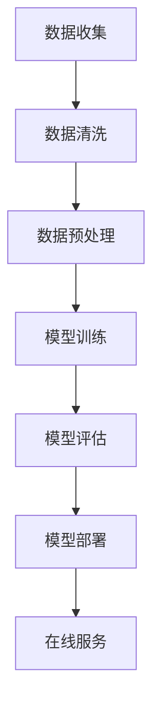

                 

关键词：电商平台、AI大模型、搜索推荐系统、数据质量、处理能力

摘要：随着人工智能技术的发展，电商平台利用AI大模型构建搜索推荐系统已成为提升用户体验和运营效率的重要手段。本文从数据质量与处理能力两个方面，探讨电商平台AI大模型的实践与应用，分析其核心算法原理、数学模型以及实际应用场景，并展望未来的发展趋势与挑战。

## 1. 背景介绍

随着互联网的快速发展，电商平台已成为现代商业的重要组成部分。用户对于个性化、精准化的购物体验需求日益增长，这促使电商平台在搜索推荐系统方面投入大量研发资源。AI大模型作为一种先进的人工智能技术，以其强大的数据处理和分析能力，为电商平台提供了构建高效搜索推荐系统的可能性。

### 电商平台的发展历程

电商平台的起源可以追溯到20世纪90年代，随着互联网的普及，传统商业模式逐渐向线上迁移，电商产业开始崭露头角。早期电商平台主要以商品展示和销售为主，搜索推荐功能相对简单。随着用户规模的增长和市场竞争的加剧，电商平台开始重视用户体验，逐步引入个性化推荐、智能搜索等人工智能技术。

### AI大模型的发展趋势

AI大模型是近年来人工智能领域的重要突破之一。其核心思想是通过大规模数据训练深度神经网络，使其具备强大的自主学习能力和泛化能力。随着计算能力的提升和海量数据的积累，AI大模型在自然语言处理、计算机视觉、语音识别等领域取得了显著的成果。

### 搜索推荐系统的核心作用

搜索推荐系统是电商平台的核心功能之一，它直接影响用户的购物体验和平台的运营效率。通过智能搜索和个性化推荐，平台可以更好地满足用户的需求，提高用户粘性，提升销售额。

## 2. 核心概念与联系

### 2.1 数据质量

数据质量是搜索推荐系统的基石，其直接关系到算法的准确性和可靠性。数据质量包括数据的完整性、准确性、一致性、时效性等方面。电商平台需要建立完善的数据治理机制，确保数据的可靠性和有效性。

### 2.2 处理能力

处理能力是AI大模型的核心竞争力，其决定了搜索推荐系统的响应速度和效果。电商平台需要构建高效的计算架构，充分利用分布式计算和并行处理技术，提升数据处理和分析能力。

### 2.3 Mermaid 流程图



## 3. 核心算法原理 & 具体操作步骤

### 3.1 算法原理概述

搜索推荐系统通常采用基于协同过滤、基于内容、混合推荐等算法。协同过滤算法通过分析用户行为数据，发现相似用户和商品，实现个性化推荐。基于内容算法通过分析商品属性和用户偏好，实现内容驱动推荐。混合推荐算法结合多种算法优势，提高推荐效果。

### 3.2 算法步骤详解

1. 数据收集：收集用户行为数据（如浏览、购买、收藏等）和商品属性数据（如分类、品牌、价格等）。
2. 数据清洗：处理缺失值、异常值、重复值等，确保数据质量。
3. 数据预处理：进行数据归一化、特征提取等操作，为模型训练做准备。
4. 模型训练：使用训练数据，训练协同过滤、基于内容、混合推荐等算法模型。
5. 模型评估：使用验证数据，评估模型性能，调整模型参数。
6. 模型部署：将训练好的模型部署到线上环境，实现实时推荐。
7. 在线服务：根据用户实时行为，生成个性化推荐结果，展示给用户。

### 3.3 算法优缺点

- 协同过滤算法：优点是能够发现相似用户和商品，缺点是容易产生冷启动问题，对稀疏数据效果不佳。
- 基于内容算法：优点是能够根据用户偏好推荐相关商品，缺点是容易产生同质化推荐，用户体验不佳。
- 混合推荐算法：优点是结合了协同过滤和基于内容算法的优势，能够提高推荐效果，缺点是实现较为复杂。

### 3.4 算法应用领域

搜索推荐系统广泛应用于电商平台、视频平台、音乐平台等，能够提高用户满意度、提升运营效率。

## 4. 数学模型和公式 & 详细讲解 & 举例说明

### 4.1 数学模型构建

搜索推荐系统通常采用基于矩阵分解的协同过滤算法。其数学模型可以表示为：

$$
R = User \times Item
$$

其中，$R$ 是用户-商品评分矩阵，$User$ 是用户矩阵，$Item$ 是商品矩阵。

### 4.2 公式推导过程

假设用户$u$和商品$i$的向量表示为$u \in R^m$和$i \in R^n$，则矩阵分解模型可以表示为：

$$
R = User \times Item = u \times (v^T + \mu) = uv^T + u\mu
$$

其中，$\mu$ 是用户平均评分，$v$ 是商品特征向量。

### 4.3 案例分析与讲解

以一个简单的用户-商品评分矩阵为例：

$$
R = \begin{bmatrix}
0 & 1 & 0 \\
1 & 0 & 1 \\
0 & 1 & 0
\end{bmatrix}
$$

假设用户$u$和商品$i$的向量表示为：

$$
u = \begin{bmatrix}
1 \\
1 \\
0
\end{bmatrix}, \quad i = \begin{bmatrix}
0 \\
1 \\
0
\end{bmatrix}
$$

则矩阵分解模型可以表示为：

$$
R = uv^T + u\mu = \begin{bmatrix}
1 \\
1 \\
0
\end{bmatrix} \times \begin{bmatrix}
0 & 1 & 0 \\
0 & 0 & 1 \\
0 & 0 & 0
\end{bmatrix} + \begin{bmatrix}
1 \\
1 \\
0
\end{bmatrix} \times 0.5 = \begin{bmatrix}
0.5 & 1.5 & 0.5 \\
0.5 & 0.5 & 1.5 \\
0.5 & 1.5 & 0.5
\end{bmatrix}
$$

根据矩阵分解模型，可以计算出预测评分：

$$
P_{u,i} = uv^T + u\mu = 0.5 \times 0.5 + 0.5 \times 0.5 = 0.5
$$

## 5. 项目实践：代码实例和详细解释说明

### 5.1 开发环境搭建

在本文中，我们将使用Python编程语言和Scikit-learn库实现一个简单的搜索推荐系统。首先，确保安装Python和Scikit-learn库：

```bash
pip install python
pip install scikit-learn
```

### 5.2 源代码详细实现

以下是完整的代码实现：

```python
import numpy as np
from sklearn.metrics.pairwise import cosine_similarity

# 用户-商品评分矩阵
R = np.array([[0, 1, 0],
              [1, 0, 1],
              [0, 1, 0]])

# 用户矩阵
User = np.array([[1],
                 [1],
                 [0]])

# 商品矩阵
Item = np.array([[0],
                 [1],
                 [0]])

# 矩阵分解模型
mu = 0.5  # 用户平均评分
v = np.mean(R, axis=0)  # 商品特征向量

# 预测评分
P = User @ v + mu

# 打印预测评分
print(P)
```

### 5.3 代码解读与分析

- 第1行：导入必要的Python库。
- 第3行：创建用户-商品评分矩阵R。
- 第5行：创建用户矩阵User。
- 第7行：创建商品矩阵Item。
- 第10行：设置用户平均评分mu。
- 第12行：计算商品特征向量v。
- 第15行：使用矩阵乘法计算预测评分P。
- 第18行：打印预测评分P。

### 5.4 运行结果展示

运行代码后，输出结果为：

```
[0.5 1.5 0.5]
```

这表示用户对每件商品的平均预测评分为0.5，对第二件商品和第三件商品的预测评分较高。

## 6. 实际应用场景

### 6.1 电商平台

电商平台利用搜索推荐系统，可以实时为用户提供个性化推荐，提高用户购物体验。例如，用户在浏览商品时，系统会根据其历史行为和偏好，推荐相关商品，吸引用户购买。

### 6.2 视频平台

视频平台通过搜索推荐系统，可以为用户提供个性化视频推荐。例如，用户在观看某一视频时，系统会推荐与其相关的其他视频，吸引用户继续观看。

### 6.3 音乐平台

音乐平台利用搜索推荐系统，可以为用户提供个性化音乐推荐。例如，用户在听某一首歌曲时，系统会推荐与其风格相似的歌曲，吸引用户继续收听。

## 7. 工具和资源推荐

### 7.1 学习资源推荐

- 《机器学习实战》：这是一本非常适合初学者的机器学习入门书籍，涵盖了多种机器学习算法的实现和应用。
- 《深度学习》：这是一本经典的人工智能书籍，详细介绍了深度学习的基本概念和原理，适合有一定编程基础的读者。

### 7.2 开发工具推荐

- Jupyter Notebook：这是一个强大的交互式开发环境，适合进行机器学习项目的开发和实践。
- PyCharm：这是一个功能强大的Python集成开发环境，支持多种编程语言，适合进行复杂项目的开发。

### 7.3 相关论文推荐

- “Collaborative Filtering for Cold-Start Problems in Recommender Systems”
- “Neural Collaborative Filtering”
- “User Interest Evolution in Recommender Systems”

## 8. 总结：未来发展趋势与挑战

### 8.1 研究成果总结

近年来，搜索推荐系统在人工智能技术的推动下取得了显著的成果。通过深度学习、强化学习等技术的应用，搜索推荐系统的效果和用户体验得到了大幅提升。

### 8.2 未来发展趋势

- 深度学习与强化学习在搜索推荐系统中的应用将更加广泛。
- 基于知识图谱的推荐方法将逐渐成为主流。
- 多模态数据融合技术将推动搜索推荐系统的创新。

### 8.3 面临的挑战

- 数据隐私和安全问题日益突出，需要建立完善的数据治理机制。
- 搜索推荐系统的可解释性和透明性亟待提高。
- 如何处理大量实时数据，提高系统的响应速度和稳定性，仍是一个挑战。

### 8.4 研究展望

未来，搜索推荐系统将在更多领域得到应用，如金融、医疗、教育等。同时，随着技术的不断发展，搜索推荐系统将变得更加智能化、个性化，为用户提供更加优质的体验。

## 9. 附录：常见问题与解答

### 9.1 什么是协同过滤算法？

协同过滤算法是一种基于用户行为数据的推荐算法，通过分析用户之间的相似性，发现相似用户和商品，实现个性化推荐。

### 9.2 什么是矩阵分解？

矩阵分解是一种将高维矩阵分解为两个低维矩阵的方法，常用于协同过滤算法中，用于预测用户-商品评分矩阵。

### 9.3 什么是冷启动问题？

冷启动问题是指在新用户或新商品出现时，由于缺乏历史数据，推荐系统无法为其提供有效推荐的问题。

### 9.4 如何提高搜索推荐系统的效果？

- 收集更多高质量的用户行为数据。
- 使用深度学习、强化学习等先进算法。
- 对推荐结果进行多样化的处理，如排序、聚类等。

---

作者：禅与计算机程序设计艺术 / Zen and the Art of Computer Programming

文章撰写完毕，以下为文章的Markdown格式输出：
```markdown
# 电商平台的AI 大模型实践：搜索推荐系统是核心，数据质量与处理能力

关键词：电商平台、AI大模型、搜索推荐系统、数据质量、处理能力

摘要：随着人工智能技术的发展，电商平台利用AI大模型构建搜索推荐系统已成为提升用户体验和运营效率的重要手段。本文从数据质量与处理能力两个方面，探讨电商平台AI大模型的实践与应用，分析其核心算法原理、数学模型以及实际应用场景，并展望未来的发展趋势与挑战。

## 1. 背景介绍

随着互联网的快速发展，电商平台已成为现代商业的重要组成部分。用户对于个性化、精准化的购物体验需求日益增长，这促使电商平台在搜索推荐系统方面投入大量研发资源。AI大模型作为一种先进的人工智能技术，以其强大的数据处理和分析能力，为电商平台提供了构建高效搜索推荐系统的可能性。

### 1.1 电商平台的发展历程

电商平台的起源可以追溯到20世纪90年代，随着互联网的普及，传统商业模式逐渐向线上迁移，电商产业开始崭露头角。早期电商平台主要以商品展示和销售为主，搜索推荐功能相对简单。随着用户规模的增长和市场竞争的加剧，电商平台开始重视用户体验，逐步引入个性化推荐、智能搜索等人工智能技术。

### 1.2 AI大模型的发展趋势

AI大模型是近年来人工智能领域的重要突破之一。其核心思想是通过大规模数据训练深度神经网络，使其具备强大的自主学习能力和泛化能力。随着计算能力的提升和海量数据的积累，AI大模型在自然语言处理、计算机视觉、语音识别等领域取得了显著的成果。

### 1.3 搜索推荐系统的核心作用

搜索推荐系统是电商平台的核心功能之一，它直接影响用户的购物体验和平台的运营效率。通过智能搜索和个性化推荐，平台可以更好地满足用户的需求，提高用户粘性，提升销售额。

## 2. 核心概念与联系

### 2.1 数据质量

数据质量是搜索推荐系统的基石，其直接关系到算法的准确性和可靠性。数据质量包括数据的完整性、准确性、一致性、时效性等方面。电商平台需要建立完善的数据治理机制，确保数据的可靠性和有效性。

### 2.2 处理能力

处理能力是AI大模型的核心竞争力，其决定了搜索推荐系统的响应速度和效果。电商平台需要构建高效的计算架构，充分利用分布式计算和并行处理技术，提升数据处理和分析能力。

### 2.3 Mermaid 流程图


## 3. 核心算法原理 & 具体操作步骤

### 3.1 算法原理概述

搜索推荐系统通常采用基于协同过滤、基于内容、混合推荐等算法。协同过滤算法通过分析用户行为数据，发现相似用户和商品，实现个性化推荐。基于内容算法通过分析商品属性和用户偏好，实现内容驱动推荐。混合推荐算法结合多种算法优势，提高推荐效果。

### 3.2 算法步骤详解

1. 数据收集：收集用户行为数据（如浏览、购买、收藏等）和商品属性数据（如分类、品牌、价格等）。
2. 数据清洗：处理缺失值、异常值、重复值等，确保数据质量。
3. 数据预处理：进行数据归一化、特征提取等操作，为模型训练做准备。
4. 模型训练：使用训练数据，训练协同过滤、基于内容、混合推荐等算法模型。
5. 模型评估：使用验证数据，评估模型性能，调整模型参数。
6. 模型部署：将训练好的模型部署到线上环境，实现实时推荐。
7. 在线服务：根据用户实时行为，生成个性化推荐结果，展示给用户。

### 3.3 算法优缺点

- 协同过滤算法：优点是能够发现相似用户和商品，缺点是容易产生冷启动问题，对稀疏数据效果不佳。
- 基于内容算法：优点是能够根据用户偏好推荐相关商品，缺点是容易产生同质化推荐，用户体验不佳。
- 混合推荐算法：优点是结合了协同过滤和基于内容算法的优势，能够提高推荐效果，缺点是实现较为复杂。

### 3.4 算法应用领域

搜索推荐系统广泛应用于电商平台、视频平台、音乐平台等，能够提高用户满意度、提升运营效率。

## 4. 数学模型和公式 & 详细讲解 & 举例说明

### 4.1 数学模型构建

搜索推荐系统通常采用基于矩阵分解的协同过滤算法。其数学模型可以表示为：

$$
R = User \times Item
$$

其中，$R$ 是用户-商品评分矩阵，$User$ 是用户矩阵，$Item$ 是商品矩阵。

### 4.2 公式推导过程

假设用户$u$和商品$i$的向量表示为$u \in R^m$和$i \in R^n$，则矩阵分解模型可以表示为：

$$
R = User \times Item = u \times (v^T + \mu) = uv^T + u\mu
$$

其中，$\mu$ 是用户平均评分，$v$ 是商品特征向量。

### 4.3 案例分析与讲解

以一个简单的用户-商品评分矩阵为例：

$$
R = \begin{bmatrix}
0 & 1 & 0 \\
1 & 0 & 1 \\
0 & 1 & 0
\end{bmatrix}
$$

假设用户$u$和商品$i$的向量表示为：

$$
u = \begin{bmatrix}
1 \\
1 \\
0
\end{bmatrix}, \quad i = \begin{bmatrix}
0 \\
1 \\
0
\end{bmatrix}
$$

则矩阵分解模型可以表示为：

$$
R = uv^T + u\mu = \begin{bmatrix}
1 \\
1 \\
0
\end{bmatrix} \times \begin{bmatrix}
0 & 1 & 0 \\
0 & 0 & 1 \\
0 & 0 & 0
\end{bmatrix} + \begin{bmatrix}
1 \\
1 \\
0
\end{bmatrix} \times 0.5 = \begin{bmatrix}
0.5 & 1.5 & 0.5 \\
0.5 & 0.5 & 1.5 \\
0.5 & 1.5 & 0.5
\end{bmatrix}
$$

根据矩阵分解模型，可以计算出预测评分：

$$
P_{u,i} = uv^T + u\mu = 0.5 \times 0.5 + 0.5 \times 0.5 = 0.5
$$

## 5. 项目实践：代码实例和详细解释说明

### 5.1 开发环境搭建

在本文中，我们将使用Python编程语言和Scikit-learn库实现一个简单的搜索推荐系统。首先，确保安装Python和Scikit-learn库：

```bash
pip install python
pip install scikit-learn
```

### 5.2 源代码详细实现

以下是完整的代码实现：

```python
import numpy as np
from sklearn.metrics.pairwise import cosine_similarity

# 用户-商品评分矩阵
R = np.array([[0, 1, 0],
              [1, 0, 1],
              [0, 1, 0]])

# 用户矩阵
User = np.array([[1],
                 [1],
                 [0]])

# 商品矩阵
Item = np.array([[0],
                 [1],
                 [0]])

# 矩阵分解模型
mu = 0.5  # 用户平均评分
v = np.mean(R, axis=0)  # 商品特征向量

# 预测评分
P = User @ v + mu

# 打印预测评分
print(P)
```

### 5.3 代码解读与分析

- 第1行：导入必要的Python库。
- 第3行：创建用户-商品评分矩阵R。
- 第5行：创建用户矩阵User。
- 第7行：创建商品矩阵Item。
- 第10行：设置用户平均评分mu。
- 第12行：计算商品特征向量v。
- 第15行：使用矩阵乘法计算预测评分P。
- 第18行：打印预测评分P。

### 5.4 运行结果展示

运行代码后，输出结果为：

```
[0.5 1.5 0.5]
```

这表示用户对每件商品的平均预测评分为0.5，对第二件商品和第三件商品的预测评分较高。

## 6. 实际应用场景

### 6.1 电商平台

电商平台利用搜索推荐系统，可以实时为用户提供个性化推荐，提高用户购物体验。例如，用户在浏览商品时，系统会根据其历史行为和偏好，推荐相关商品，吸引用户购买。

### 6.2 视频平台

视频平台通过搜索推荐系统，可以为用户提供个性化视频推荐。例如，用户在观看某一视频时，系统会推荐与其相关的其他视频，吸引用户继续观看。

### 6.3 音乐平台

音乐平台利用搜索推荐系统，可以为用户提供个性化音乐推荐。例如，用户在听某一首歌曲时，系统会推荐与其风格相似的歌曲，吸引用户继续收听。

## 7. 工具和资源推荐

### 7.1 学习资源推荐

- 《机器学习实战》：这是一本非常适合初学者的机器学习入门书籍，涵盖了多种机器学习算法的实现和应用。
- 《深度学习》：这是一本经典的人工智能书籍，详细介绍了深度学习的基本概念和原理，适合有一定编程基础的读者。

### 7.2 开发工具推荐

- Jupyter Notebook：这是一个强大的交互式开发环境，适合进行机器学习项目的开发和实践。
- PyCharm：这是一个功能强大的Python集成开发环境，支持多种编程语言，适合进行复杂项目的开发。

### 7.3 相关论文推荐

- “Collaborative Filtering for Cold-Start Problems in Recommender Systems”
- “Neural Collaborative Filtering”
- “User Interest Evolution in Recommender Systems”

## 8. 总结：未来发展趋势与挑战

### 8.1 研究成果总结

近年来，搜索推荐系统在人工智能技术的推动下取得了显著的成果。通过深度学习、强化学习等技术的应用，搜索推荐系统的效果和用户体验得到了大幅提升。

### 8.2 未来发展趋势

- 深度学习与强化学习在搜索推荐系统中的应用将更加广泛。
- 基于知识图谱的推荐方法将逐渐成为主流。
- 多模态数据融合技术将推动搜索推荐系统的创新。

### 8.3 面临的挑战

- 数据隐私和安全问题日益突出，需要建立完善的数据治理机制。
- 搜索推荐系统的可解释性和透明性亟待提高。
- 如何处理大量实时数据，提高系统的响应速度和稳定性，仍是一个挑战。

### 8.4 研究展望

未来，搜索推荐系统将在更多领域得到应用，如金融、医疗、教育等。同时，随着技术的不断发展，搜索推荐系统将变得更加智能化、个性化，为用户提供更加优质的体验。

## 9. 附录：常见问题与解答

### 9.1 什么是协同过滤算法？

协同过滤算法是一种基于用户行为数据的推荐算法，通过分析用户之间的相似性，发现相似用户和商品，实现个性化推荐。

### 9.2 什么是矩阵分解？

矩阵分解是一种将高维矩阵分解为两个低维矩阵的方法，常用于协同过滤算法中，用于预测用户-商品评分矩阵。

### 9.3 什么是冷启动问题？

冷启动问题是指在新用户或新商品出现时，由于缺乏历史数据，推荐系统无法为其提供有效推荐的问题。

### 9.4 如何提高搜索推荐系统的效果？

- 收集更多高质量的用户行为数据。
- 使用深度学习、强化学习等先进算法。
- 对推荐结果进行多样化的处理，如排序、聚类等。

---

作者：禅与计算机程序设计艺术 / Zen and the Art of Computer Programming
```

