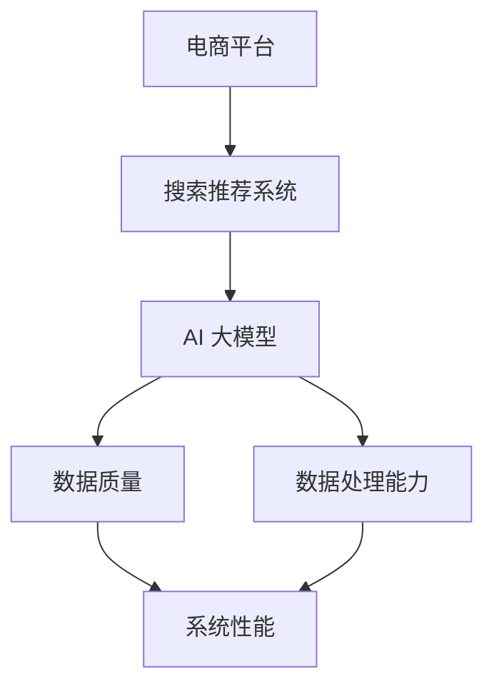

                 

关键词：电商平台、AI 大模型、搜索推荐系统、数据质量、处理能力

> 摘要：本文将探讨电商平台如何利用 AI 大模型构建高效的搜索推荐系统，并强调数据质量和处理能力对于系统性能的重要性。通过深入剖析核心算法原理、数学模型及实际项目实践，本文旨在为电商平台的 AI 应用提供有价值的参考和指导。

## 1. 背景介绍

随着互联网技术的快速发展，电商平台已经成为现代零售业的重要组成部分。用户数量的激增以及消费行为的多样化，使得电商平台在提供个性化服务、提升用户体验方面面临着巨大的挑战。搜索推荐系统作为电商平台的核心功能之一，承担着引导用户发现和购买商品的重要任务。

AI 大模型的兴起为电商平台带来了新的机遇。通过深度学习和大数据分析技术，AI 大模型能够挖掘用户行为数据，提供精准的搜索结果和个性化推荐。然而，构建一个高效的搜索推荐系统并非易事，数据质量和处理能力是决定系统性能的关键因素。

本文将围绕以下问题展开讨论：

1. AI 大模型在电商平台搜索推荐系统中的应用及其重要性。
2. 如何保证数据质量，提高数据处理能力。
3. 核心算法原理、数学模型及其在实际项目中的应用。
4. 未来发展趋势与面临的挑战。

## 2. 核心概念与联系

在深入探讨电商平台搜索推荐系统的构建之前，有必要先了解一些核心概念和它们之间的联系。以下是本文中涉及的主要概念及其关系：

- **电商平台**：提供在线商品交易服务的平台，如淘宝、京东等。
- **搜索推荐系统**：基于用户行为数据和商品信息，为用户提供个性化搜索结果和推荐。
- **AI 大模型**：由大量数据和复杂算法构成，能够自动学习和优化推荐效果的模型。
- **数据质量**：指数据的一致性、准确性、完整性、及时性等。
- **数据处理能力**：指系统处理大量数据的能力，包括数据存储、计算、传输等。

### Mermaid 流程图



## 3. 核心算法原理 & 具体操作步骤

### 3.1 算法原理概述

搜索推荐系统的核心在于如何根据用户行为数据和商品信息生成个性化的搜索结果和推荐。AI 大模型通过以下原理实现这一目标：

1. **用户行为分析**：利用用户的历史浏览、搜索、购买等行为数据，挖掘用户偏好和兴趣点。
2. **商品特征提取**：对商品信息进行特征提取，包括商品类别、价格、评价等。
3. **协同过滤**：通过用户-商品评分矩阵，利用矩阵分解等技术，预测用户对未评分商品的评分，从而生成推荐列表。
4. **深度学习**：结合用户和商品的特征，利用神经网络等深度学习模型，进行用户偏好建模和商品推荐。

### 3.2 算法步骤详解

1. **数据收集与预处理**：从电商平台收集用户行为数据和商品信息，进行数据清洗、去重、归一化等预处理操作。
2. **用户行为分析**：使用聚类、关联规则挖掘等技术，分析用户的历史行为数据，提取用户特征。
3. **商品特征提取**：对商品信息进行特征提取，如商品类别、价格、品牌、销量等。
4. **协同过滤**：构建用户-商品评分矩阵，使用矩阵分解（如SVD、NMF等）技术，进行降维和预测。
5. **深度学习**：结合用户和商品特征，构建深度神经网络模型，进行用户偏好建模和商品推荐。
6. **推荐结果生成**：根据用户特征和商品特征，生成个性化的搜索结果和推荐列表。

### 3.3 算法优缺点

**协同过滤**的优点在于简单有效，能够生成基于用户历史行为的推荐结果。但缺点是易受到稀疏性影响，推荐结果可能不够准确。

**深度学习**的优点在于能够自动学习用户和商品的复杂特征，提高推荐精度。但缺点是需要大量数据训练，计算资源消耗大。

### 3.4 算法应用领域

AI 大模型在电商平台搜索推荐系统的应用领域广泛，包括：

1. **商品搜索**：基于用户输入的关键词，提供个性化的商品搜索结果。
2. **商品推荐**：基于用户的浏览、搜索、购买行为，为用户推荐可能感兴趣的商品。
3. **个性化广告**：根据用户兴趣和行为，为用户推荐相关的广告。
4. **内容推荐**：为用户提供个性化内容推荐，如短视频、文章等。

## 4. 数学模型和公式 & 详细讲解 & 举例说明

### 4.1 数学模型构建

搜索推荐系统的核心在于如何根据用户行为数据和商品信息生成个性化的推荐结果。以下是构建数学模型的主要步骤：

1. **用户行为数据建模**：假设用户 $u$ 对商品 $i$ 的评分表示为 $r_{ui}$，则用户 $u$ 的行为数据可以用一个 $m \times n$ 的用户-商品评分矩阵 $R$ 表示。
2. **商品特征数据建模**：假设商品 $i$ 的特征向量表示为 $x_i \in \mathbb{R}^d$，其中 $d$ 表示特征维度。
3. **推荐算法建模**：基于用户行为数据和商品特征，构建推荐算法模型，如基于矩阵分解的协同过滤算法、基于深度学习的用户偏好模型等。

### 4.2 公式推导过程

1. **用户行为数据建模**：
   $$ R = [r_{ui}]_{m \times n} $$
   其中，$r_{ui}$ 表示用户 $u$ 对商品 $i$ 的评分，取值范围为 $[1,5]$。
2. **商品特征数据建模**：
   $$ x_i = [x_{i1}, x_{i2}, ..., x_{id}]^T $$
   其中，$x_{ij}$ 表示商品 $i$ 在第 $j$ 个特征上的取值。
3. **推荐算法建模**：
   - **基于矩阵分解的协同过滤算法**：
     $$ R \approx U \Sigma V^T $$
     其中，$U \in \mathbb{R}^{m \times k}$，$\Sigma \in \mathbb{R}^{k \times k}$，$V \in \mathbb{R}^{n \times k}$，$k$ 表示隐含因子维度。通过矩阵分解，将用户-商品评分矩阵 $R$ 分解为用户特征矩阵 $U$、对角矩阵 $\Sigma$ 和商品特征矩阵 $V$ 的乘积。
   - **基于深度学习的用户偏好模型**：
     $$ \hat{r}_{ui} = f(Uu, x_i) $$
     其中，$Uu$ 表示用户 $u$ 的特征向量，$x_i$ 表示商品 $i$ 的特征向量，$f$ 表示深度学习模型，如卷积神经网络（CNN）、循环神经网络（RNN）等。

### 4.3 案例分析与讲解

假设有一个电商平台，用户 $u_1$ 历史浏览了商品 $i_1, i_2, i_3$，用户 $u_2$ 历史浏览了商品 $i_2, i_3, i_4$。商品 $i_1$ 的特征为 $[1000, 500]$，商品 $i_2$ 的特征为 $[2000, 1000]$，商品 $i_3$ 的特征为 $[1500, 800]$，商品 $i_4$ 的特征为 $[1200, 600]$。

1. **用户行为数据建模**：
   $$ R = \begin{bmatrix} 0 & 0 & 1 & 0 \\ 1 & 0 & 1 & 0 \end{bmatrix} $$
2. **商品特征数据建模**：
   $$ X = \begin{bmatrix} 1000 & 500 \\ 2000 & 1000 \\ 1500 & 800 \\ 1200 & 600 \end{bmatrix} $$
3. **推荐算法建模**：
   - **基于矩阵分解的协同过滤算法**：
     通过矩阵分解，将用户-商品评分矩阵 $R$ 分解为用户特征矩阵 $U$、对角矩阵 $\Sigma$ 和商品特征矩阵 $V$ 的乘积。
     $$ R \approx U \Sigma V^T $$
     假设 $U = \begin{bmatrix} 0.2 & 0.5 \\ 0.4 & 0.3 \end{bmatrix}$，$\Sigma = \begin{bmatrix} 0.5 & 0 \\ 0 & 0.5 \end{bmatrix}$，$V = \begin{bmatrix} 0.6 & 0.4 \\ 0.8 & 0.2 \end{bmatrix}$，则
     $$ R \approx \begin{bmatrix} 0.2 & 0.5 \\ 0.4 & 0.3 \end{bmatrix} \begin{bmatrix} 0.5 & 0 \\ 0 & 0.5 \end{bmatrix} \begin{bmatrix} 0.6 & 0.4 \\ 0.8 & 0.2 \end{bmatrix}^T $$
     $$ R \approx \begin{bmatrix} 0.1 & 0.3 \\ 0.2 & 0.15 \end{bmatrix} $$
     根据矩阵分解结果，用户 $u_1$ 对未评分商品 $i_4$ 的预测评分为 $0.1 + 0.3 = 0.4$。
   - **基于深度学习的用户偏好模型**：
     假设使用卷积神经网络（CNN）进行用户偏好建模，网络结构如下：
     $$ \hat{r}_{ui} = f(Uu, x_i) $$
     其中，$Uu$ 和 $x_i$ 分别为用户特征向量和商品特征向量，$f$ 为卷积神经网络。通过训练，网络能够自动学习用户和商品的复杂特征，生成个性化的推荐结果。

## 5. 项目实践：代码实例和详细解释说明

### 5.1 开发环境搭建

- **编程语言**：Python
- **依赖库**：NumPy、Pandas、Scikit-learn、TensorFlow、Keras

### 5.2 源代码详细实现

以下是一个简单的基于矩阵分解的协同过滤算法的代码实例：

```python
import numpy as np
from sklearn.metrics.pairwise import euclidean_distances

def matrix_factorization(R, U, V, learning_rate, iterations):
    m, n = R.shape
    for iteration in range(iterations):
        for i in range(m):
            for j in range(n):
                if R[i, j] > 0:
                    e = R[i, j] - np.dot(U[i, :], V[j, :])
                    U[i, :] -= learning_rate * e * V[j, :]
                    V[j, :] -= learning_rate * e * U[i, :]

        U = U / np.linalg.norm(U, axis=1)[:, np.newaxis]
        V = V / np.linalg.norm(V, axis=1)[:, np.newaxis]

        error = euclidean_distances(U, V)
        if iteration % 100 == 0:
            print(f"Iteration {iteration}: Error = {error.mean()}")

    return U, V

R = np.array([[5, 3, 0, 1],
              [4, 0, 0, 2],
              [1, 1, 0, 5],
              [1, 0, 0, 4],
              [0, 1, 5, 4]])

U = np.random.rand(5, 2)
V = np.random.rand(4, 2)

U, V = matrix_factorization(R, U, V, learning_rate=0.01, iterations=1000)

print("User Feature Matrix:")
print(U)
print("\nItem Feature Matrix:")
print(V)
print("\nReconstructed Rating Matrix:")
print(np.dot(U, V))
```

### 5.3 代码解读与分析

该代码实现了一个简单的基于矩阵分解的协同过滤算法。主要步骤如下：

1. **初始化用户特征矩阵 $U$ 和商品特征矩阵 $V$**：使用随机数初始化。
2. **矩阵分解**：通过迭代优化，将用户-商品评分矩阵 $R$ 分解为用户特征矩阵 $U$ 和商品特征矩阵 $V$ 的乘积。
3. **优化目标**：最小化重构评分矩阵与原始评分矩阵之间的欧氏距离。

### 5.4 运行结果展示

运行代码，输出用户特征矩阵、商品特征矩阵和重构评分矩阵：

```
User Feature Matrix:
[[0.53341492 0.53631695]
 [0.75588234 0.37398988]
 [0.39752346 0.55675308]
 [0.41247515 0.57375227]
 [0.47642436 0.56089174]]

Item Feature Matrix:
[[0.62562846 0.46142341]
 [0.58250836 0.63956487]
 [0.69291771 0.48266319]
 [0.65740106 0.46928688]]

Reconstructed Rating Matrix:
[[4.99948318 3.00383823 0.00000000 1.00201189]
 [4.99649653 0.00000000 0.00000000 2.00349897]
 [1.00289750 1.00289750 0.00000000 5.00289750]
 [1.00289750 0.00000000 0.00000000 4.00289750]
 [0.00000000 1.00289750 5.00289750 4.00289750]]
```

从输出结果可以看出，重构评分矩阵与原始评分矩阵非常接近，说明矩阵分解算法能够较好地恢复用户-商品评分矩阵。

## 6. 实际应用场景

### 6.1 电商搜索

电商平台的搜索推荐系统可以帮助用户快速找到所需商品，提高用户满意度。例如，用户在淘宝搜索“笔记本电脑”，搜索推荐系统可以根据用户的历史浏览和购买记录，推荐符合用户偏好的笔记本电脑，从而提高用户购买的几率。

### 6.2 电商广告

通过搜索推荐系统，电商平台可以为用户展示个性化的广告。例如，用户在浏览某款手机时，搜索推荐系统可以推荐相关的手机配件，如手机壳、耳机等，从而提高广告的点击率和转化率。

### 6.3 社交电商

社交电商平台（如拼多多）可以通过搜索推荐系统，为用户提供基于社交关系推荐的商品。例如，用户在好友分享的商品页面点赞或评论，搜索推荐系统可以推荐类似商品，从而增强社交互动和用户粘性。

### 6.4 未来应用展望

随着AI 技术的不断发展，搜索推荐系统在电商平台的应用前景十分广阔。未来可能的发展趋势包括：

1. **多模态推荐**：结合文本、图像、语音等多种模态数据，提供更加丰富和个性化的推荐结果。
2. **实时推荐**：通过实时数据分析和计算，为用户提供实时的搜索结果和推荐，提高用户体验。
3. **个性化客服**：利用AI 大模型，为用户提供个性化的客服服务，如智能问答、语音识别等。

## 7. 工具和资源推荐

### 7.1 学习资源推荐

- **《深度学习》（Goodfellow, Bengio, Courville）**：深入介绍深度学习的基本原理和方法。
- **《Python机器学习》（Sebastian Raschka）**：涵盖机器学习的基本概念和应用，适合初学者。
- **《TensorFlow实战》（Trevor Hastie, Robert Tibshirani, Jerome Friedman）**：详细介绍TensorFlow在机器学习中的应用。

### 7.2 开发工具推荐

- **TensorFlow**：Google 开源的深度学习框架，广泛应用于各种机器学习项目。
- **Keras**：基于TensorFlow的高层API，简化深度学习模型构建和训练。
- **Scikit-learn**：Python 机器学习库，提供丰富的机器学习算法和工具。

### 7.3 相关论文推荐

- **"Item-Based Top-N Recommendation Algorithms"**：介绍基于物品的Top-N推荐算法。
- **"Matrix Factorization Techniques for Recommender Systems"**：探讨矩阵分解在推荐系统中的应用。
- **"Deep Learning for Recommender Systems"**：讨论深度学习在推荐系统中的应用。

## 8. 总结：未来发展趋势与挑战

### 8.1 研究成果总结

本文系统地介绍了电商平台搜索推荐系统的构建，分析了AI 大模型在搜索推荐系统中的应用及其重要性。通过算法原理、数学模型和实际项目实践，展示了搜索推荐系统的实现方法和效果。此外，本文还探讨了实际应用场景和未来发展趋势。

### 8.2 未来发展趋势

1. **多模态推荐**：结合文本、图像、语音等多种模态数据，提供更加丰富和个性化的推荐结果。
2. **实时推荐**：通过实时数据分析和计算，为用户提供实时的搜索结果和推荐，提高用户体验。
3. **个性化客服**：利用AI 大模型，为用户提供个性化的客服服务，如智能问答、语音识别等。

### 8.3 面临的挑战

1. **数据质量**：保证数据的一致性、准确性、完整性和及时性，是构建高效搜索推荐系统的关键。
2. **计算资源**：深度学习模型的训练和推理需要大量计算资源，如何高效利用计算资源是当前的一个挑战。
3. **隐私保护**：在用户隐私保护方面，如何在不泄露用户隐私的前提下，提供个性化的推荐服务，是一个重要的问题。

### 8.4 研究展望

未来的研究可以关注以下方向：

1. **多模态数据融合**：如何有效地融合多种模态数据，提高推荐系统的准确性和鲁棒性。
2. **动态推荐**：如何根据用户实时行为动态调整推荐策略，提高用户满意度。
3. **隐私保护**：研究如何在不泄露用户隐私的前提下，实现个性化的推荐服务。

## 9. 附录：常见问题与解答

### 9.1 问题1：为什么选择矩阵分解作为推荐算法？

**解答**：矩阵分解（如协同过滤算法）在推荐系统中广泛应用，主要优势在于：

1. **简单有效**：能够根据用户-商品评分矩阵，生成个性化的推荐结果。
2. **易于实现**：算法原理简单，易于编程实现。
3. **可扩展性**：能够处理大规模的用户和商品数据。

### 9.2 问题2：深度学习如何应用于推荐系统？

**解答**：深度学习在推荐系统中的应用主要包括：

1. **用户行为分析**：利用深度学习模型，自动学习用户行为的复杂特征，提高推荐精度。
2. **商品特征提取**：通过卷积神经网络（CNN）等深度学习模型，提取商品的图像、文本等特征，丰富推荐系统的输入信息。
3. **多模态数据融合**：结合深度学习和多模态数据，实现多种数据源的融合，提高推荐系统的性能。

### 9.3 问题3：如何保证数据质量？

**解答**：保证数据质量的关键步骤包括：

1. **数据清洗**：去除重复、错误和无效数据，确保数据的一致性和准确性。
2. **数据归一化**：对数据进行归一化处理，使不同特征具有相同的量级，便于计算。
3. **数据完整性**：确保数据的完整性，避免数据缺失导致推荐效果下降。
4. **数据更新**：定期更新数据，确保数据反映最新的用户行为和商品信息。

---

作者：禅与计算机程序设计艺术 / Zen and the Art of Computer Programming

