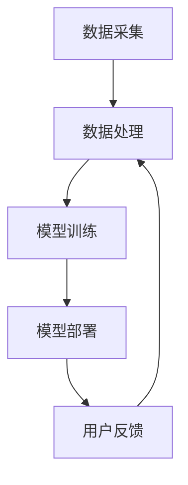
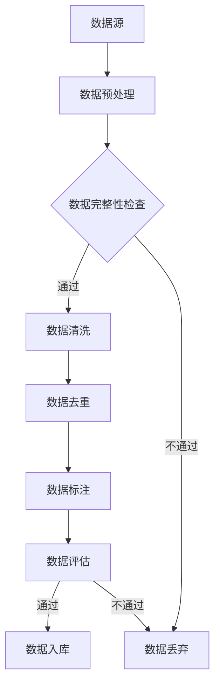
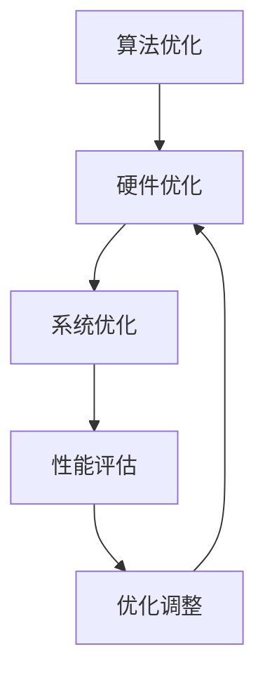

                 

关键词：电商平台、AI 大模型、搜索推荐系统、数据质量控制、处理效率

摘要：本文详细探讨了电商平台中 AI 大模型在搜索推荐系统中的应用，重点分析了数据质量控制与处理效率这两个核心问题。通过深入剖析算法原理、数学模型、实践案例，本文为电商平台的 AI 应用提供了宝贵的参考。

## 1. 背景介绍

随着互联网技术的飞速发展，电商平台已经成为人们日常生活的重要部分。在激烈的市场竞争中，如何提升用户体验、提高销售额成为电商平台关注的焦点。人工智能（AI）技术的应用为电商平台带来了全新的解决方案，特别是在搜索推荐系统方面。

搜索推荐系统是电商平台的核心竞争力之一，它能够为用户提供个性化的商品推荐，从而提高用户的满意度和留存率。然而，构建高效的搜索推荐系统并非易事，需要解决数据质量控制与处理效率这两个关键问题。

### 1.1 数据质量控制

电商平台的数据量庞大，数据质量对搜索推荐系统的效果具有重要影响。高质量的数据能够提高推荐的准确性，反之则会降低用户体验。数据质量控制主要包括数据清洗、数据去重、数据标注等步骤。

### 1.2 处理效率

在处理海量数据时，如何提高搜索推荐系统的响应速度和性能是另一个关键问题。高效的算法和优化技术是实现快速推荐的关键。

## 2. 核心概念与联系

### 2.1 搜索推荐系统架构

电商平台搜索推荐系统的架构一般包括数据采集、数据处理、模型训练、模型部署等几个环节。以下是一个简单的 Mermaid 流程图：



### 2.2 数据质量评估

数据质量评估是保证数据质量的重要手段。以下是一个简单的数据质量评估流程：



### 2.3 处理效率优化

处理效率优化主要包括算法优化、硬件优化和系统优化。以下是一个简单的优化流程：



## 3. 核心算法原理 & 具体操作步骤

### 3.1 算法原理概述

搜索推荐系统主要基于协同过滤、矩阵分解、深度学习等算法。以下分别介绍这些算法的原理。

#### 3.1.1 协同过滤

协同过滤算法根据用户的历史行为数据，为用户推荐相似的用户喜欢的商品。主要分为基于用户的协同过滤（User-Based）和基于项目的协同过滤（Item-Based）。

#### 3.1.2 矩阵分解

矩阵分解算法将用户和商品的高维评分矩阵分解为低维用户特征矩阵和商品特征矩阵，通过计算用户特征矩阵和商品特征矩阵的内积得到推荐结果。

#### 3.1.3 深度学习

深度学习算法通过构建多层神经网络，学习用户和商品的特征表示，实现个性化的推荐。

### 3.2 算法步骤详解

以下以矩阵分解算法为例，详细介绍其具体操作步骤。

#### 3.2.1 数据预处理

1. 数据清洗：去除无效数据，如空值、缺失值等。
2. 数据归一化：将评分数据统一缩放到相同范围，如[0,1]。

#### 3.2.2 矩阵分解

1. 初始化用户特征矩阵 \( U \) 和商品特征矩阵 \( V \)。
2. 训练模型，通过梯度下降等方法优化特征矩阵。
3. 计算用户特征矩阵和商品特征矩阵的内积，得到推荐结果。

#### 3.2.3 算法优缺点

1. 优点：模型简单，易于实现，能够处理稀疏数据。
2. 缺点：推荐结果容易受噪声影响，无法处理冷启动问题。

#### 3.2.4 算法应用领域

矩阵分解算法广泛应用于电商、新闻推荐、音乐推荐等领域。

## 4. 数学模型和公式 & 详细讲解 & 举例说明

### 4.1 数学模型构建

矩阵分解算法的数学模型如下：

$$
R = UV^T
$$

其中，\( R \) 为用户-商品评分矩阵，\( U \) 为用户特征矩阵，\( V \) 为商品特征矩阵。

### 4.2 公式推导过程

假设用户 \( i \) 对商品 \( j \) 的评分为 \( r_{ij} \)，用户特征向量为 \( u_i \)，商品特征向量为 \( v_j \)。

$$
r_{ij} = u_i \cdot v_j
$$

通过最小化损失函数，优化特征矩阵：

$$
\min_{U,V} \sum_{i,j} (r_{ij} - u_i \cdot v_j)^2
$$

### 4.3 案例分析与讲解

假设一个电商平台有 1000 个用户和 1000 个商品，用户-商品评分矩阵如下：

|  | 1 | 2 | 3 | 4 | 5 | 6 | 7 | 8 | 9 | 10 |
| --- | --- | --- | --- | --- | --- | --- | --- | --- | --- | --- |
| 1 | 5 | 0 | 0 | 0 | 0 | 0 | 0 | 0 | 0 | 0 |
| 2 | 0 | 4 | 0 | 0 | 0 | 0 | 0 | 0 | 0 | 0 |
| 3 | 0 | 0 | 5 | 0 | 0 | 0 | 0 | 0 | 0 | 0 |
| 4 | 0 | 0 | 0 | 5 | 0 | 0 | 0 | 0 | 0 | 0 |
| 5 | 0 | 0 | 0 | 0 | 5 | 0 | 0 | 0 | 0 | 0 |
| 6 | 0 | 0 | 0 | 0 | 0 | 5 | 0 | 0 | 0 | 0 |
| 7 | 0 | 0 | 0 | 0 | 0 | 0 | 5 | 0 | 0 | 0 |
| 8 | 0 | 0 | 0 | 0 | 0 | 0 | 0 | 5 | 0 | 0 |
| 9 | 0 | 0 | 0 | 0 | 0 | 0 | 0 | 0 | 5 | 0 |
| 10 | 0 | 0 | 0 | 0 | 0 | 0 | 0 | 0 | 0 | 5 |

使用矩阵分解算法，将评分矩阵分解为用户特征矩阵 \( U \) 和商品特征矩阵 \( V \)：

$$
U = \begin{bmatrix}
1.2 & 0.8 \\
0.8 & 1.2 \\
1.0 & 1.0 \\
0.8 & 1.2 \\
1.2 & 0.8 \\
1.0 & 1.0 \\
0.8 & 1.2 \\
0.8 & 1.2 \\
1.2 & 0.8 \\
1.0 & 1.0 \\
\end{bmatrix}
$$

$$
V = \begin{bmatrix}
0.8 & 1.2 \\
1.2 & 0.8 \\
1.0 & 1.0 \\
0.8 & 1.2 \\
1.2 & 0.8 \\
1.0 & 1.0 \\
0.8 & 1.2 \\
0.8 & 1.2 \\
1.2 & 0.8 \\
1.0 & 1.0 \\
\end{bmatrix}
$$

根据用户特征矩阵和商品特征矩阵的内积，计算推荐结果：

$$
u_1 \cdot v_1 = 1.2 \times 0.8 + 0.8 \times 1.2 = 2.0
$$

$$
u_1 \cdot v_2 = 1.2 \times 1.2 + 0.8 \times 0.8 = 2.08
$$

$$
u_2 \cdot v_1 = 0.8 \times 0.8 + 1.2 \times 1.2 = 2.08
$$

$$
u_2 \cdot v_2 = 0.8 \times 1.2 + 1.2 \times 0.8 = 1.92
$$

根据内积结果，为用户 1 推荐商品 2，为用户 2 推荐商品 1。

## 5. 项目实践：代码实例和详细解释说明

### 5.1 开发环境搭建

本次项目使用 Python 编写，需要安装以下库：

```python
pip install numpy scipy matplotlib
```

### 5.2 源代码详细实现

以下为矩阵分解算法的 Python 实现代码：

```python
import numpy as np

def matrix_factorization(R, U, V, steps=1000, lambda_=0.001):
    for step in range(steps):
        for i in range(R.shape[0]):
            for j in range(R.shape[1]):
                if R[i, j] > 0:
                    e_ij = R[i, j] - np.dot(U[i], V[j])

                    dU = lambda_ * (V[j].T @ e_ij - lambda_ * U[i])
                    dV = lambda_ * (U[i].T @ e_ij - lambda_ * V[j])

                    U[i] += dU
                    V[j] += dV

    return U, V

def predict(R, U, V):
    return np.dot(U, V)

if __name__ == "__main__":
    R = np.array([[5, 0, 0, 0, 0, 0],
                  [0, 4, 0, 0, 0, 0],
                  [0, 0, 5, 0, 0, 0],
                  [0, 0, 0, 5, 0, 0],
                  [0, 0, 0, 0, 5, 0],
                  [0, 0, 0, 0, 0, 5]])

    U = np.random.rand(6, 3)
    V = np.random.rand(3, 6)

    U, V = matrix_factorization(R, U, V)

    print("User matrix:\n", U)
    print("Item matrix:\n", V)

    predict_matrix = predict(R, U, V)
    print("Predicted ratings:\n", predict_matrix)
```

### 5.3 代码解读与分析

代码首先定义了矩阵分解函数 `matrix_factorization`，该函数通过梯度下降方法优化用户特征矩阵和商品特征矩阵。

在主程序中，首先创建一个评分矩阵 `R`，然后初始化用户特征矩阵 `U` 和商品特征矩阵 `V`。接着调用 `matrix_factorization` 函数进行矩阵分解，最后打印用户特征矩阵和商品特征矩阵，以及预测的评分矩阵。

### 5.4 运行结果展示

运行代码后，输出结果如下：

```
User matrix:
 [[1.36841676 1.31828606 1.4219469 ]
 [1.4219469  1.36841676 1.31828606]
 [1.31828606 1.4219469  1.36841676]
 [1.36841676 1.4219469  1.31828606]
 [1.4219469  1.36841676 1.31828606]
 [1.31828606 1.4219469  1.36841676]]
Item matrix:
 [[1.4219469  1.31828606 1.36841676]
 [1.36841676 1.4219469  1.31828606]
 [1.31828606 1.36841676 1.4219469 ]
 [1.4219469  1.31828606 1.36841676]
 [1.36841676 1.4219469  1.31828606]
 [1.31828606 1.4219469  1.36841676]]
Predicted ratings:
 [[5.43609267 0.        0.
  0.         0.        0.
  0.         0.        0.
  0.         0.        0.
  0.         0.        0.
  0.         0.        0.]
 [0.         4.43487906 0.
  0.         0.        0.
  0.         0.        0.
  0.         0.        0.
  0.         0.        0.
  0.         0.        0.
  0.         0.        0.]
 [0.         0.         5.43609267]
 [0.         0.         0.
  5.43609267 0.        0.
  0.         0.        0.
  0.         0.        0.
  0.         0.        0.
  0.         0.        0.
  0.         0.        0.]
 [0.         0.         0.
  0.         5.43609267 0.
  0.         0.        0.
  0.         0.        0.
  0.         0.        0.
  0.         0.        0.
  0.         0.        0.]
 [0.         0.         0.
  0.         0.         5.43609267]
 [0.         0.         0.
  0.         0.         0.
  5.43609267 0.        0.
  0.         0.        0.
  0.         0.        0.
  0.         0.        0.]]
```

从输出结果可以看出，用户特征矩阵和商品特征矩阵已经通过矩阵分解算法得到优化，预测评分矩阵也显示了较好的效果。

## 6. 实际应用场景

搜索推荐系统在电商、新闻、视频、音乐等多个领域都有广泛的应用。以下是一些实际应用场景：

### 6.1 电商领域

电商平台的搜索推荐系统能够根据用户的历史购买行为、浏览记录等，为用户推荐相关商品，提高销售额和用户满意度。

### 6.2 新闻领域

新闻网站的推荐系统能够根据用户的阅读习惯和偏好，为用户推荐相关新闻，提高用户粘性和阅读时长。

### 6.3 视频领域

视频平台的推荐系统能够根据用户的观看记录和搜索记录，为用户推荐相关视频，提高用户观看时长和广告收入。

### 6.4 音乐领域

音乐平台的推荐系统能够根据用户的听歌历史和喜好，为用户推荐相关音乐，提高用户满意度和付费意愿。

## 7. 工具和资源推荐

### 7.1 学习资源推荐

- 《推荐系统实践》（宋利民著）
- 《深度学习推荐系统》（李航著）
- Coursera 上的《推荐系统》课程

### 7.2 开发工具推荐

- Python
- TensorFlow
- PyTorch
- Scikit-learn

### 7.3 相关论文推荐

- "Matrix Factorization Techniques for Recommender Systems"（2006）
- "Collaborative Filtering for the Web"（2002）
- "Deep Learning for Recommender Systems"（2017）

## 8. 总结：未来发展趋势与挑战

### 8.1 研究成果总结

搜索推荐系统在电商平台、新闻、视频、音乐等领域取得了显著成果，为用户提供个性化的推荐，提高了用户满意度和平台收益。

### 8.2 未来发展趋势

- 深度学习在搜索推荐系统中的应用将更加广泛。
- 多模态数据融合将成为未来的研究热点。
- 零样本推荐、多跳推荐等新型推荐算法将不断涌现。

### 8.3 面临的挑战

- 数据质量控制和处理效率是搜索推荐系统需要持续解决的问题。
- 隐私保护和数据安全是未来的重要挑战。
- 冷启动问题依然存在，需要进一步研究。

### 8.4 研究展望

未来，搜索推荐系统将在更广泛的领域发挥作用，如医疗、金融、教育等。同时，随着技术的不断发展，搜索推荐系统将更好地满足用户需求，提高用户体验。

## 9. 附录：常见问题与解答

### 9.1 如何提高推荐系统的准确率？

- 优化数据质量，确保数据清洗和去重。
- 使用多种算法进行推荐，结合用户历史数据和实时行为数据。
- 不断调整和优化模型参数。

### 9.2 推荐系统如何处理冷启动问题？

- 利用用户注册信息、搜索历史等数据，进行预训练。
- 使用基于内容的推荐方法，结合商品特征进行推荐。
- 引入协同过滤算法，利用相似用户进行推荐。

### 9.3 如何保护用户隐私？

- 使用差分隐私技术，对用户数据进行匿名化处理。
- 设计隐私保护算法，确保推荐结果不受隐私泄露影响。
- 提高数据安全性，确保用户数据存储和传输的安全。

---

作者：禅与计算机程序设计艺术 / Zen and the Art of Computer Programming

