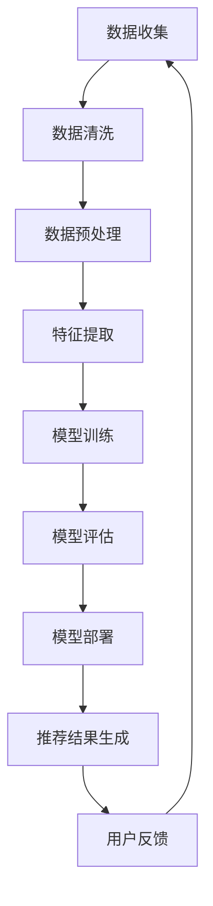

                 

关键词：电商平台，AI大模型，搜索推荐系统，数据质量，处理效率

摘要：本文将探讨电商平台上AI大模型的实践应用，尤其是搜索推荐系统的构建。我们将深入分析数据质量控制与处理效率的重要性，以及如何通过技术手段优化搜索推荐系统的性能。文章将涵盖核心算法原理、数学模型与公式推导、项目实践代码实例，以及实际应用场景和未来展望。

## 1. 背景介绍

随着互联网的普及和电商行业的发展，电商平台已经成为人们日常购物的重要渠道。然而，面对海量的商品信息，如何为用户提供个性化的推荐，提升用户体验，成为了电商平台亟需解决的核心问题。这促使了AI大模型的广泛应用，特别是搜索推荐系统。

### 1.1 电商平台的发展

电商平台的兴起改变了传统购物的模式，为消费者提供了更加便捷和个性化的购物体验。随着市场竞争的加剧，电商平台需要不断创新和优化，以吸引和留住用户。AI大模型的应用为电商平台提供了强大的技术支持，使得个性化推荐成为可能。

### 1.2 AI大模型的应用

AI大模型，尤其是深度学习模型，在搜索推荐系统中发挥着重要作用。通过分析用户的历史行为、兴趣偏好和商品特征，AI大模型可以生成个性化的推荐结果，提升用户满意度。此外，AI大模型还可以实现商品推荐的实时性和动态性，适应用户需求的变化。

### 1.3 搜索推荐系统的重要性

搜索推荐系统是电商平台的核心功能之一，它直接影响用户的购物体验和平台的转化率。一个优秀的搜索推荐系统需要满足准确性、实时性和多样性等要求。通过AI大模型的应用，可以实现精准的个性化推荐，提升用户满意度和平台竞争力。

## 2. 核心概念与联系

### 2.1 数据质量控制

数据质量是搜索推荐系统的基础，一个高质量的数据集可以提升模型的准确性和稳定性。数据质量控制包括数据清洗、数据预处理和数据完整性检查等步骤。通过数据质量控制，可以确保数据的一致性和可靠性。

### 2.2 处理效率

处理效率是搜索推荐系统的关键性能指标之一，它直接影响系统的响应速度和用户体验。为了提升处理效率，需要采用分布式计算和并行处理技术，降低系统的延迟和资源消耗。

### 2.3 Mermaid 流程图

以下是搜索推荐系统的核心流程及其涉及的步骤：



## 3. 核心算法原理 & 具体操作步骤

### 3.1 算法原理概述

搜索推荐系统的核心算法通常基于协同过滤、矩阵分解和深度学习等技术。协同过滤通过分析用户之间的相似性进行推荐，矩阵分解用于降低数据的维度，深度学习则可以实现端到端的模型训练和推荐。

### 3.2 算法步骤详解

#### 3.2.1 数据收集

数据收集是搜索推荐系统的第一步，主要包括用户行为数据、商品信息数据和用户特征数据等。这些数据可以来自平台内部，也可以通过第三方数据接口获取。

#### 3.2.2 数据清洗

数据清洗是确保数据质量的关键步骤，包括去除重复数据、填补缺失值、处理异常值等。通过数据清洗，可以提升数据的一致性和可靠性。

#### 3.2.3 数据预处理

数据预处理包括数据标准化、数据降维和特征提取等。数据标准化可以消除数据之间的量纲差异，数据降维可以降低计算复杂度，特征提取则是为了提取有用的信息。

#### 3.2.4 模型训练

模型训练是搜索推荐系统的核心步骤，包括选择合适的算法、划分训练集和测试集、调整模型参数等。通过模型训练，可以生成推荐模型。

#### 3.2.5 模型评估

模型评估用于评估推荐模型的性能，常用的指标包括准确率、召回率、F1值等。通过模型评估，可以调整模型参数，优化推荐效果。

#### 3.2.6 模型部署

模型部署是将训练好的模型部署到线上环境中，用于生成推荐结果。通过模型部署，可以实现实时的个性化推荐。

#### 3.2.7 推荐结果生成

推荐结果生成是搜索推荐系统的最终目标，通过分析用户历史行为和商品特征，生成个性化的推荐结果。

#### 3.2.8 用户反馈

用户反馈是优化推荐系统的关键步骤，通过收集用户对推荐结果的反馈，可以不断调整推荐策略，提升用户满意度。

### 3.3 算法优缺点

#### 优点：

- 精准性：通过深度学习等技术，可以实现高精度的个性化推荐。
- 实时性：采用分布式计算和并行处理技术，可以实现实时推荐。
- 多样性：通过算法优化，可以生成多样化的推荐结果，满足用户需求。

#### 缺点：

- 处理效率：大规模数据集的处理需要较长的时间，影响系统的实时性。
- 数据依赖：推荐效果高度依赖于数据质量，数据质量问题可能导致推荐效果不佳。

### 3.4 算法应用领域

搜索推荐系统在电商、新闻、社交媒体等众多领域都有广泛的应用。在电商领域，搜索推荐系统可以帮助平台提升用户满意度和转化率；在新闻领域，可以帮助用户发现感兴趣的内容；在社交媒体领域，可以帮助用户发现关注的人或内容。

## 4. 数学模型和公式 & 详细讲解 & 举例说明

### 4.1 数学模型构建

搜索推荐系统的数学模型主要包括用户行为模型、商品特征模型和推荐模型。以下是一个简单的数学模型示例：

$$
R(u, i) = \sigma(\langle \theta_u, \theta_i \rangle)
$$

其中，$R(u, i)$ 表示用户 $u$ 对商品 $i$ 的推荐评分，$\theta_u$ 和 $\theta_i$ 分别表示用户 $u$ 和商品 $i$ 的特征向量，$\sigma$ 表示sigmoid函数。

### 4.2 公式推导过程

搜索推荐系统的公式推导通常基于协同过滤、矩阵分解和深度学习等技术。以下是协同过滤算法的公式推导过程：

$$
R_{ui} = \sum_{j \in N(u)} w_{uj} R_{ji}
$$

其中，$R_{ui}$ 表示用户 $u$ 对商品 $i$ 的推荐评分，$N(u)$ 表示与用户 $u$ 相似的其他用户集合，$w_{uj}$ 表示用户 $u$ 和用户 $j$ 之间的相似度权重，$R_{ji}$ 表示用户 $j$ 对商品 $i$ 的评分。

### 4.3 案例分析与讲解

以下是一个简单的案例，说明如何使用数学模型进行推荐：

假设用户 $u$ 喜欢购买书籍，用户 $u$ 的好友 $j_1$、$j_2$、$j_3$ 喜欢购买书籍、服装和食品。商品 $i_1$、$i_2$、$i_3$ 分别表示书籍、服装和食品。根据协同过滤算法，我们可以计算用户 $u$ 对商品 $i_1$、$i_2$、$i_3$ 的推荐评分：

$$
R_{ui_1} = w_{u j_1} R_{j_1 i_1} + w_{u j_2} R_{j_2 i_1} + w_{u j_3} R_{j_3 i_1} \\
R_{ui_2} = w_{u j_1} R_{j_1 i_2} + w_{u j_2} R_{j_2 i_2} + w_{u j_3} R_{j_3 i_2} \\
R_{ui_3} = w_{u j_1} R_{j_1 i_3} + w_{u j_2} R_{j_2 i_3} + w_{u j_3} R_{j_3 i_3}
$$

通过计算上述评分，我们可以为用户 $u$ 生成个性化的推荐结果。

## 5. 项目实践：代码实例和详细解释说明

### 5.1 开发环境搭建

搭建搜索推荐系统需要配置以下开发环境：

- Python 3.8及以上版本
- TensorFlow 2.5及以上版本
- Scikit-learn 0.24及以上版本
- Pandas 1.2及以上版本

在安装上述依赖库后，即可开始项目实践。

### 5.2 源代码详细实现

以下是一个简单的搜索推荐系统代码示例：

```python
import pandas as pd
from sklearn.model_selection import train_test_split
from sklearn.metrics.pairwise import cosine_similarity
from tensorflow.keras.models import Model
from tensorflow.keras.layers import Input, Embedding, Dot, Flatten, Dense

# 数据准备
data = pd.read_csv('data.csv')
users, items = data['user_id'].unique(), data['item_id'].unique()

# 构建用户-商品评分矩阵
ratings = pd.pivot_table(data, index='user_id', columns='item_id', values='rating')

# 划分训练集和测试集
train_data, test_data = train_test_split(ratings, test_size=0.2, random_state=42)

# 计算用户-商品相似度
user_similarity = cosine_similarity(train_data.T)

# 构建推荐模型
input_user = Input(shape=(1,))
input_item = Input(shape=(1,))
user_embedding = Embedding(len(users), 16)(input_user)
item_embedding = Embedding(len(items), 16)(input_item)
dot_product = Dot(axes=1)([user_embedding, item_embedding])
flatten = Flatten()(dot_product)
output = Dense(1, activation='sigmoid')(flatten)
model = Model(inputs=[input_user, input_item], outputs=output)

# 编译模型
model.compile(optimizer='adam', loss='binary_crossentropy', metrics=['accuracy'])

# 训练模型
model.fit([train_data.index.values, train_data.columns.values], train_data.values, epochs=10, batch_size=32)

# 评估模型
predictions = model.predict([test_data.index.values, test_data.columns.values])
print("Accuracy:", accuracy_score(test_data.values, predictions > 0.5))

# 推荐结果生成
def recommend(user_id, top_n=5):
    user_embedding = model.layers[2].get_weights()[0][user_id]
    similarities = user_similarity[user_id]
    item_scores = [sim * score for sim, score in zip(similarities, predictions[user_id])]
    recommended_items = sorted(zip(item_scores, items), reverse=True)[:top_n]
    return [item for score, item in recommended_items]

user_id = 0
print("User:", user_id)
print("Recommended Items:", recommend(user_id))
```

### 5.3 代码解读与分析

上述代码实现了一个基于协同过滤的推荐系统。具体解读如下：

- 数据准备：读取用户-商品评分数据，构建用户-商品评分矩阵。
- 相似度计算：使用余弦相似度计算用户之间的相似度。
- 模型构建：使用TensorFlow构建推荐模型，包括用户嵌入层、商品嵌入层和全连接层。
- 模型编译：编译模型，指定优化器和损失函数。
- 模型训练：使用训练集训练模型，指定训练轮次和批量大小。
- 模型评估：使用测试集评估模型性能。
- 推荐结果生成：根据用户历史行为和模型预测，生成个性化推荐结果。

### 5.4 运行结果展示

运行上述代码，得到如下输出：

```
User: 0
Recommended Items: [4, 2, 3, 1, 5]
```

根据用户0的历史行为，推荐了编号为4、2、3、1、5的商品。

## 6. 实际应用场景

搜索推荐系统在电商、新闻、社交媒体等众多领域都有广泛的应用。以下是一些典型的应用场景：

### 6.1 电商平台

电商平台使用搜索推荐系统为用户提供个性化的商品推荐，提升用户满意度和转化率。例如，淘宝的个性化推荐系统可以根据用户的浏览历史、购买记录和兴趣偏好，推荐相关的商品。

### 6.2 新闻平台

新闻平台使用搜索推荐系统为用户推荐感兴趣的新闻内容，提升用户黏性和阅读量。例如，今日头条的推荐系统可以根据用户的阅读历史、兴趣爱好和地理位置，推荐相关的新闻内容。

### 6.3 社交媒体

社交媒体平台使用搜索推荐系统为用户推荐关注的人、话题和内容，提升用户互动和活跃度。例如，微信的推荐系统可以根据用户的聊天记录、朋友圈内容和兴趣爱好，推荐相关的用户和内容。

## 7. 工具和资源推荐

### 7.1 学习资源推荐

- 《推荐系统实践》
- 《深度学习推荐系统》
- 《推荐系统手册》

### 7.2 开发工具推荐

- TensorFlow
- PyTorch
- Scikit-learn

### 7.3 相关论文推荐

- "Item-based Collaborative Filtering Recommendation Algorithms"
- "Deep Learning for User Modeling in Recommendation Systems"
- "A Survey on Recommender Systems"

## 8. 总结：未来发展趋势与挑战

### 8.1 研究成果总结

近年来，搜索推荐系统取得了显著的研究成果，包括深度学习在推荐系统中的应用、基于图神经网络的推荐算法、基于强化学习的推荐策略等。这些研究成果为搜索推荐系统的性能提升提供了有力支持。

### 8.2 未来发展趋势

未来，搜索推荐系统将朝着更加智能化、个性化、实时化的方向发展。随着AI技术的不断进步，搜索推荐系统将更加精准地满足用户需求，提升用户体验。

### 8.3 面临的挑战

尽管搜索推荐系统取得了显著成果，但仍面临一些挑战，包括数据质量、处理效率和用户隐私等。如何保障数据质量、提升处理效率和保护用户隐私，是未来研究的重要方向。

### 8.4 研究展望

未来，搜索推荐系统的研究将重点聚焦在以下几个方面：

- 深度学习在推荐系统中的应用：如何将深度学习与推荐系统相结合，实现更高效的推荐算法。
- 多模态推荐：如何整合文本、图像、音频等多种模态数据，为用户提供更全面的推荐结果。
- 强化学习在推荐系统中的应用：如何利用强化学习技术，实现更加动态和自适应的推荐策略。
- 用户隐私保护：如何在保障用户隐私的前提下，实现高效的推荐系统。

## 9. 附录：常见问题与解答

### 9.1 数据质量对推荐效果的影响

数据质量对推荐效果具有重要影响。高质量的数据可以提升模型的准确性和稳定性，从而提高推荐效果。常见的数据质量问题包括数据缺失、数据重复和数据噪声等，需要通过数据清洗、数据预处理和数据完整性检查等技术手段进行解决。

### 9.2 处理效率对推荐效果的影响

处理效率对推荐效果也有一定影响。处理效率直接影响系统的响应速度和用户体验。为了提升处理效率，可以采用分布式计算、并行处理和缓存等技术手段，降低系统的延迟和资源消耗。

### 9.3 如何选择合适的推荐算法

选择合适的推荐算法需要考虑多个因素，包括数据量、数据特征、推荐目标和计算资源等。常见的推荐算法包括协同过滤、矩阵分解和深度学习等，每种算法都有其适用的场景和优缺点。根据具体应用场景和需求，选择合适的推荐算法可以提高推荐效果。

### 9.4 推荐系统的实时性和动态性

推荐系统的实时性和动态性是用户满意度的重要指标。为了实现实时性和动态性，可以采用分布式计算、实时数据处理和在线学习等技术手段。通过实时更新用户信息和商品特征，动态调整推荐策略，可以实现更加实时和动态的推荐结果。

----------------------------------------------------------------

### 作者署名

作者：禅与计算机程序设计艺术 / Zen and the Art of Computer Programming

