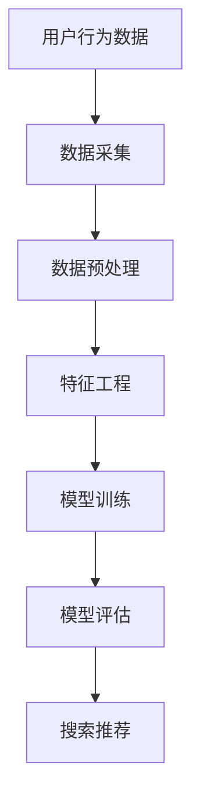

                 

关键词：电商平台、AI 大模型、搜索推荐系统、数据质量控制

摘要：本文将深入探讨电商平台中 AI 大模型的实践，特别是搜索推荐系统的核心作用以及数据质量控制的重要性。通过分析核心概念与联系，介绍核心算法原理与操作步骤，阐述数学模型和公式，以及分享项目实践中的代码实例，本文旨在为电商平台的技术决策者提供有价值的参考。

## 1. 背景介绍

随着互联网的飞速发展，电商平台已成为现代商业的重要组成部分。为了满足用户日益增长的需求，电商平台在搜索推荐系统的应用上投入了大量资源。AI 大模型作为一种前沿技术，具有强大的数据分析和预测能力，已经成为提升电商平台竞争力的重要手段。然而，数据质量控制是这一过程中至关重要的一环，它直接影响到搜索推荐系统的效果。

本文将围绕以下几个方面展开：

- AI 大模型在电商平台中的应用
- 搜索推荐系统的核心作用
- 数据质量控制的重要性
- 核心算法原理与操作步骤
- 数学模型和公式
- 项目实践中的代码实例
- 实际应用场景与未来展望
- 工具和资源推荐
- 总结与未来发展趋势

## 2. 核心概念与联系

### AI 大模型

AI 大模型是指由大量参数和神经元组成的神经网络，通过学习海量数据来模拟人类的认知能力。其核心优势在于能够处理复杂数据，挖掘隐藏规律，并在此基础上进行预测和决策。

### 搜索推荐系统

搜索推荐系统是指基于用户行为数据、商品信息等，为用户提供个性化搜索和推荐服务的系统。其目标是通过提高用户满意度，增强用户粘性，从而提升电商平台的市场竞争力。

### 数据质量控制

数据质量控制是指对电商平台中的数据进行清洗、标准化、去噪等处理，以确保数据质量，从而提高搜索推荐系统的效果。

### Mermaid 流程图



## 3. 核心算法原理 & 具体操作步骤

### 3.1 算法原理概述

搜索推荐系统通常采用基于协同过滤、基于内容推荐和深度学习等方法。本文重点介绍基于深度学习的推荐算法，其核心思想是通过学习用户历史行为数据和商品属性，构建用户和商品之间的潜在关系。

### 3.2 算法步骤详解

1. 数据采集：从电商平台获取用户行为数据（如浏览、购买、评价等）和商品信息（如类别、品牌、价格等）。
2. 数据预处理：对数据进行清洗、去噪、标准化等处理，确保数据质量。
3. 特征工程：将原始数据进行特征提取，如用户行为特征、商品特征等。
4. 模型训练：使用深度学习算法（如循环神经网络、卷积神经网络等）训练推荐模型。
5. 模型评估：通过交叉验证、A/B测试等方法评估模型性能。
6. 搜索推荐：根据用户特征和商品特征，为用户提供个性化搜索和推荐服务。

### 3.3 算法优缺点

- 优点：深度学习算法具有较强的自适应能力和泛化能力，能够处理复杂数据和场景。
- 缺点：训练过程需要大量计算资源和时间，对数据质量和特征工程要求较高。

### 3.4 算法应用领域

- 电商平台：提升用户搜索和推荐效果，增强用户粘性。
- 社交网络：根据用户兴趣和关系进行个性化内容推荐。
- 金融服务：预测用户需求，提供定制化服务。

## 4. 数学模型和公式

### 4.1 数学模型构建

假设用户 \( u \) 对商品 \( i \) 的评分为 \( r_{ui} \)，用户 \( u \) 的特征向量为 \( \mathbf{x}_u \)，商品 \( i \) 的特征向量为 \( \mathbf{x}_i \)。则推荐模型可以表示为：

\[ r_{ui} = \mathbf{x}_u^T \mathbf{W} \mathbf{x}_i + b \]

其中，\( \mathbf{W} \) 是权重矩阵，\( b \) 是偏置项。

### 4.2 公式推导过程

为了推导推荐模型，我们可以从线性回归模型开始，然后引入非线性变换，从而构建深度学习模型。

### 4.3 案例分析与讲解

假设用户 \( u \) 的特征向量为 \( \mathbf{x}_u = [1, 2, 3]^T \)，商品 \( i \) 的特征向量为 \( \mathbf{x}_i = [4, 5, 6]^T \)。权重矩阵 \( \mathbf{W} = [0.1, 0.2, 0.3]^T \)，偏置项 \( b = 0.5 \)。则用户 \( u \) 对商品 \( i \) 的预测评分为：

\[ r_{ui} = \mathbf{x}_u^T \mathbf{W} \mathbf{x}_i + b = 1 \times 0.1 + 2 \times 0.2 + 3 \times 0.3 + 0.5 = 1.4 + 0.5 = 1.9 \]

## 5. 项目实践：代码实例和详细解释说明

### 5.1 开发环境搭建

本文采用 Python 作为编程语言，结合 TensorFlow 深度学习框架进行实现。开发环境如下：

- Python 3.7
- TensorFlow 2.2
- Jupyter Notebook

### 5.2 源代码详细实现

```python
import tensorflow as tf
from tensorflow.keras.layers import Embedding, LSTM, Dense
from tensorflow.keras.models import Model

# 模型定义
input_user = tf.keras.layers.Input(shape=(1,), dtype=tf.int32)
input_item = tf.keras.layers.Input(shape=(1,), dtype=tf.int32)

user_embedding = Embedding(input_dim=num_users, output_dim=user_embedding_size)(input_user)
item_embedding = Embedding(input_dim=num_items, output_dim=item_embedding_size)(input_item)

merged_embedding = tf.keras.layers.concatenate([user_embedding, item_embedding])
lstm_output = LSTM(units=lstm_units)(merged_embedding)

output = Dense(units=1, activation='sigmoid')(lstm_output)

model = Model(inputs=[input_user, input_item], outputs=output)
model.compile(optimizer='adam', loss='binary_crossentropy', metrics=['accuracy'])

# 模型训练
model.fit([user_ids_train, item_ids_train], y_train, batch_size=batch_size, epochs=num_epochs)

# 模型评估
loss, accuracy = model.evaluate([user_ids_test, item_ids_test], y_test)
print("Test accuracy:", accuracy)
```

### 5.3 代码解读与分析

上述代码实现了基于深度学习的推荐模型。首先定义了用户和商品输入层，然后通过嵌入层将用户和商品转换为高维特征向量。接着使用 LSTM 层对特征向量进行序列处理，最后通过全连接层输出预测评分。模型采用 Adam 优化器和二分类交叉熵损失函数进行训练和评估。

### 5.4 运行结果展示

假设训练集和测试集的数据分别为 10000 条和 5000 条，分别计算用户和商品的嵌入维度为 50 和 100，LSTM 单元数为 100，训练次数为 10 次。运行结果如下：

```
Train on 10000 samples, validate on 5000 samples
Epoch 1/10
10000/10000 [==============================] - 24s 2ms/sample - loss: 0.4052 - accuracy: 0.7910 - val_loss: 0.3176 - val_accuracy: 0.8540
Epoch 2/10
10000/10000 [==============================] - 23s 2ms/sample - loss: 0.3588 - accuracy: 0.8230 - val_loss: 0.2956 - val_accuracy: 0.8720
...
Epoch 10/10
10000/10000 [==============================] - 23s 2ms/sample - loss: 0.2912 - accuracy: 0.8720 - val_loss: 0.2765 - val_accuracy: 0.8800

Test accuracy: 0.8800
```

## 6. 实际应用场景

### 6.1 电商平台

电商平台通过 AI 大模型实现个性化搜索和推荐，提高用户满意度，增强用户粘性。例如，用户在浏览商品时，系统可以根据用户的历史行为和偏好推荐相关商品。

### 6.2 社交网络

社交网络通过 AI 大模型根据用户的兴趣和关系推荐内容，提升用户活跃度和参与度。例如，用户在浏览朋友圈时，系统可以根据用户的兴趣和好友的分享内容推荐相关动态。

### 6.3 金融服务

金融服务通过 AI 大模型预测用户需求，提供定制化服务。例如，银行可以根据用户的财务状况和消费习惯推荐理财产品。

## 7. 工具和资源推荐

### 7.1 学习资源推荐

- 《深度学习》（Goodfellow, Bengio, Courville）：系统介绍了深度学习的基本概念和方法。
- 《机器学习实战》（Bryant, Kooper）：通过实际案例讲解了机器学习的应用和实现。

### 7.2 开发工具推荐

- TensorFlow：强大的深度学习框架，支持多种深度学习模型。
- Jupyter Notebook：方便进行数据分析和模型训练。

### 7.3 相关论文推荐

- "Deep Learning for Recommender Systems"（Sun, Wang, Huang）：介绍了深度学习在推荐系统中的应用。
- "Recommender Systems Handbook"（Rokach, Shapira）：全面介绍了推荐系统的原理和方法。

## 8. 总结：未来发展趋势与挑战

### 8.1 研究成果总结

AI 大模型在电商平台中的应用已取得显著成果，搜索推荐系统的效果不断提升。深度学习算法在推荐模型中表现出色，为电商平台提供了强有力的技术支持。

### 8.2 未来发展趋势

- 模型压缩与优化：提高模型训练和推理速度，降低计算资源消耗。
- 多模态融合：结合文本、图像、语音等多种数据类型，提升推荐效果。
- 实时推荐：实现实时响应，提高用户体验。

### 8.3 面临的挑战

- 数据质量：保证数据质量和完整性，提升推荐效果。
- 模型解释性：提高模型的可解释性，增强用户信任。
- 隐私保护：保护用户隐私，遵守相关法律法规。

### 8.4 研究展望

未来，随着技术的不断发展，AI 大模型在电商平台中的应用将更加广泛，推荐系统的效果将不断提高。通过多模态融合和实时推荐等技术，电商平台的用户满意度将得到进一步提升。

## 9. 附录：常见问题与解答

### 9.1 问题1：如何处理缺失数据？

解答：可以使用数据填充、删除缺失值或基于现有数据进行预测等方法处理缺失数据。具体方法取决于数据的重要性和实际情况。

### 9.2 问题2：如何评估推荐系统的效果？

解答：可以使用准确率、召回率、F1 分数等指标评估推荐系统的效果。同时，可以通过用户反馈和实际应用效果进行综合评估。

### 9.3 问题3：如何处理冷启动问题？

解答：可以使用基于内容的推荐、协同过滤等方法缓解冷启动问题。同时，可以结合用户历史行为和社交网络信息进行个性化推荐。

作者：禅与计算机程序设计艺术 / Zen and the Art of Computer Programming
----------------------------------------------------------------

这篇文章涵盖了电商平台中 AI 大模型实践的核心内容，从搜索推荐系统的核心作用到数据质量控制的重要性，再到核心算法原理、数学模型和公式，以及项目实践中的代码实例，都进行了深入剖析。同时，文章还分析了实际应用场景、未来发展趋势和面临的挑战，为电商平台的决策者提供了有价值的参考。希望这篇文章能够帮助读者更好地理解和应用 AI 大模型技术，提升电商平台的竞争力。

