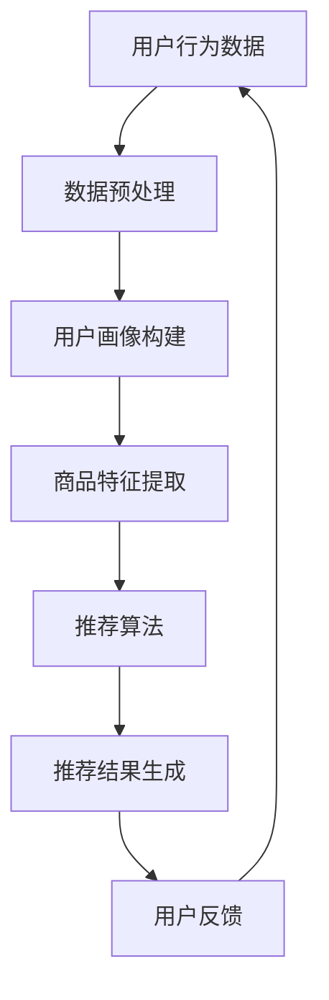

                 

关键词：人工智能，大模型，搜索推荐系统，性能优化，效率提升，电商平台

> 摘要：随着电商平台的迅速发展，用户对搜索和推荐系统的性能要求越来越高。本文将探讨如何通过人工智能大模型的应用，在提升搜索推荐系统的性能与效率方面取得双重突破。文章将从背景介绍、核心概念与联系、核心算法原理、数学模型与公式、项目实践、实际应用场景、工具和资源推荐以及未来发展趋势与挑战等方面进行深入剖析。

## 1. 背景介绍

### 1.1 电商平台的发展现状

随着互联网技术的飞速发展，电商平台已经成为了现代社会不可或缺的一部分。根据最新数据显示，全球电商市场规模已经超过了数万亿美元，且仍在不断增长。电商平台不仅改变了人们的购物方式，也对整个零售行业产生了深远的影响。

### 1.2 搜索推荐系统的地位

在电商平台上，搜索推荐系统起着至关重要的作用。它不仅能够帮助用户快速找到所需的商品，还能够为平台带来更多的流量和转化率。一个高效的搜索推荐系统可以提高用户体验，增加用户粘性，从而为电商平台带来更多的商业价值。

### 1.3 搜索推荐系统的性能瓶颈

尽管现有的搜索推荐系统已经取得了一定的成绩，但在实际应用中仍然存在一些性能瓶颈。例如，系统响应速度慢、推荐结果不准确、处理海量数据的能力有限等问题。这些问题严重影响了电商平台的用户体验和运营效率，因此需要寻找新的解决方案。

## 2. 核心概念与联系

### 2.1 人工智能与大数据的关系

人工智能（AI）与大数据的结合，为搜索推荐系统带来了新的机遇。人工智能技术可以处理海量数据，从中提取有价值的信息，从而实现更加精准的搜索和推荐。而大数据则为人工智能提供了丰富的数据资源，使得算法能够不断优化和进化。

### 2.2 大模型的应用

大模型（如深度学习模型）具有强大的表征能力和泛化能力，能够在各种复杂场景下取得优异的性能。在搜索推荐系统中，大模型可以用于用户画像构建、商品特征提取、推荐算法优化等各个环节。

### 2.3 Mermaid 流程图

以下是一个描述搜索推荐系统核心概念的 Mermaid 流程图：



## 3. 核心算法原理 & 具体操作步骤

### 3.1 算法原理概述

本文将介绍一种基于深度学习的大模型搜索推荐算法，该算法包括以下几个主要步骤：

1. 数据预处理：对用户行为数据进行清洗、去重和编码等操作，为后续建模提供高质量的数据。
2. 用户画像构建：通过深度学习模型对用户行为数据进行建模，提取用户的兴趣特征。
3. 商品特征提取：同样使用深度学习模型，对商品信息进行特征提取，包括商品属性、用户评价、销量等。
4. 推荐算法：结合用户画像和商品特征，使用深度学习模型进行推荐。
5. 推荐结果生成：根据推荐算法生成的结果，为用户生成个性化推荐列表。
6. 用户反馈：收集用户对推荐结果的反馈，用于优化推荐算法。

### 3.2 算法步骤详解

#### 3.2.1 数据预处理

数据预处理是搜索推荐系统的基础，其质量直接影响后续模型的性能。具体步骤如下：

1. 数据清洗：去除重复数据、缺失值和异常值，确保数据质量。
2. 特征工程：对原始数据进行编码、归一化和特征选择等操作，为建模提供合适的输入特征。

#### 3.2.2 用户画像构建

用户画像构建是搜索推荐系统的关键环节，其目的是提取用户的兴趣特征。具体步骤如下：

1. 用户行为数据建模：使用深度学习模型（如神经网络）对用户行为数据进行建模，提取用户的兴趣特征。
2. 特征融合：将不同类型的用户行为数据进行融合，形成一个全面的用户画像。

#### 3.2.3 商品特征提取

商品特征提取同样使用深度学习模型，其目的是提取商品的关键特征。具体步骤如下：

1. 商品信息编码：对商品属性、用户评价、销量等进行编码，转化为数值型数据。
2. 商品特征提取：使用深度学习模型对编码后的商品信息进行特征提取。

#### 3.2.4 推荐算法

推荐算法是基于用户画像和商品特征的匹配度进行推荐的。具体步骤如下：

1. 用户 - 商品匹配：计算用户画像和商品特征的相似度，选择最相似的商品进行推荐。
2. 排序：根据相似度对推荐结果进行排序，选择最优质的商品推荐给用户。

#### 3.2.5 推荐结果生成

推荐结果生成是根据推荐算法生成的结果，为用户生成个性化推荐列表。具体步骤如下：

1. 推荐列表生成：根据推荐算法的排序结果，生成一个个性化的推荐列表。
2. 推荐结果展示：将推荐列表展示给用户，供用户浏览和选择。

#### 3.2.6 用户反馈

用户反馈是搜索推荐系统不断优化的关键。具体步骤如下：

1. 收集反馈数据：收集用户对推荐结果的反馈，如点击、购买、评价等。
2. 反馈数据建模：使用深度学习模型对反馈数据进行建模，提取用户的真实兴趣。
3. 推荐算法优化：根据反馈数据优化推荐算法，提高推荐效果。

### 3.3 算法优缺点

#### 3.3.1 优点

1. 高效性：大模型能够处理海量数据，实现高效的搜索和推荐。
2. 精准性：基于用户画像和商品特征的匹配度进行推荐，提高推荐结果的精准度。
3. 可扩展性：深度学习模型具有强大的可扩展性，可以适应不同应用场景。

#### 3.3.2 缺点

1. 计算资源消耗大：大模型训练和推理需要大量的计算资源，可能导致系统性能下降。
2. 数据依赖性：搜索推荐系统的性能依赖于数据质量，数据质量问题可能导致推荐结果不准确。

### 3.4 算法应用领域

大模型搜索推荐算法可以应用于各种电商场景，如商品推荐、内容推荐、广告推荐等。以下是一些具体的应用领域：

1. 淘宝、京东等大型电商平台：通过大模型搜索推荐算法，提高用户体验和运营效率。
2. 小红书、抖音等社交媒体平台：基于用户兴趣和行为数据，实现个性化内容推荐。
3. 广告平台：通过大模型搜索推荐算法，提高广告投放的精准度和转化率。

## 4. 数学模型和公式 & 详细讲解 & 举例说明

### 4.1 数学模型构建

大模型搜索推荐系统的数学模型主要包括用户画像构建、商品特征提取和推荐算法等部分。以下是一个简化的数学模型：

$$
\text{UserFeature} = f_{\theta}(\text{UserBehaviorData})
$$

$$
\text{ItemFeature} = g_{\theta}(\text{ItemInformation})
$$

$$
\text{RecommendationScore} = h_{\theta}(\text{UserFeature}, \text{ItemFeature})
$$

其中，$f_{\theta}(\cdot)$、$g_{\theta}(\cdot)$和$h_{\theta}(\cdot)$分别表示用户画像构建、商品特征提取和推荐算法的参数化模型，$\theta$表示模型参数。

### 4.2 公式推导过程

#### 4.2.1 用户画像构建

用户画像构建的核心是提取用户的兴趣特征。假设用户行为数据为$X$，模型参数为$\theta$，则用户画像可以表示为：

$$
\text{UserFeature} = f_{\theta}(X) = \sigma(WX + b)
$$

其中，$\sigma(\cdot)$表示激活函数，$W$和$b$分别为权重和偏置。

#### 4.2.2 商品特征提取

商品特征提取的核心是提取商品的关键特征。假设商品信息为$Y$，模型参数为$\theta$，则商品特征可以表示为：

$$
\text{ItemFeature} = g_{\theta}(Y) = \sigma(UY + c)
$$

其中，$U$和$c$分别为权重和偏置。

#### 4.2.3 推荐算法

推荐算法的核心是计算用户和商品的匹配度。假设用户画像和商品特征分别为$F$和$I$，模型参数为$\theta$，则推荐算法可以表示为：

$$
\text{RecommendationScore} = h_{\theta}(F, I) = \text{cosine similarity}(F, I)
$$

其中，$cosine similarity$表示余弦相似度。

### 4.3 案例分析与讲解

#### 4.3.1 案例背景

某电商平台希望利用大模型搜索推荐算法提高用户体验和运营效率。平台拥有海量用户行为数据和商品信息，现需构建一个高效的搜索推荐系统。

#### 4.3.2 案例分析

1. 数据预处理：对用户行为数据和商品信息进行清洗、去重和编码等操作，为建模提供高质量的数据。
2. 用户画像构建：使用深度学习模型（如神经网络）对用户行为数据进行建模，提取用户的兴趣特征。
3. 商品特征提取：使用深度学习模型对商品信息进行特征提取，包括商品属性、用户评价、销量等。
4. 推荐算法：结合用户画像和商品特征，使用深度学习模型进行推荐。
5. 推荐结果生成：根据推荐算法生成的结果，为用户生成个性化推荐列表。
6. 用户反馈：收集用户对推荐结果的反馈，用于优化推荐算法。

#### 4.3.3 案例讲解

1. 数据预处理：首先对用户行为数据进行清洗，去除重复数据和缺失值。然后对用户行为数据进行编码，将原始数据转化为数值型数据，为建模提供合适的输入特征。
2. 用户画像构建：使用神经网络模型对用户行为数据进行建模，提取用户的兴趣特征。具体步骤如下：

   - 输入层：将用户行为数据输入到神经网络模型中。
   - 隐藏层：通过多层神经网络对用户行为数据进行特征提取。
   - 输出层：输出用户画像。

3. 商品特征提取：同样使用神经网络模型对商品信息进行特征提取。具体步骤如下：

   - 输入层：将商品信息输入到神经网络模型中。
   - 隐藏层：通过多层神经网络对商品信息进行特征提取。
   - 输出层：输出商品特征。

4. 推荐算法：结合用户画像和商品特征，使用深度学习模型进行推荐。具体步骤如下：

   - 计算用户和商品的匹配度：使用余弦相似度计算用户画像和商品特征的相似度。
   - 排序：根据匹配度对推荐结果进行排序。
   - 生成推荐列表：根据排序结果，生成个性化的推荐列表。

5. 推荐结果生成：将推荐算法生成的结果展示给用户，供用户浏览和选择。

6. 用户反馈：收集用户对推荐结果的反馈，用于优化推荐算法。具体步骤如下：

   - 数据收集：收集用户对推荐结果的点击、购买、评价等行为数据。
   - 反馈数据建模：使用深度学习模型对反馈数据进行建模，提取用户的真实兴趣。
   - 推荐算法优化：根据反馈数据优化推荐算法，提高推荐效果。

## 5. 项目实践：代码实例和详细解释说明

### 5.1 开发环境搭建

1. 安装Python环境：在本地计算机上安装Python，版本要求为3.6及以上。
2. 安装必要的库：使用pip命令安装深度学习库（如TensorFlow、PyTorch）和数据预处理库（如Pandas、NumPy）。
3. 准备数据集：收集电商平台的用户行为数据和商品信息，并进行预处理。

### 5.2 源代码详细实现

以下是一个简单的基于深度学习的大模型搜索推荐系统的Python代码实例：

```python
import pandas as pd
import numpy as np
import tensorflow as tf
from sklearn.model_selection import train_test_split

# 数据预处理
def preprocess_data(data):
    # 清洗数据、去重、编码等操作
    pass

# 构建用户画像
def build_user_feature(data):
    # 使用神经网络模型提取用户画像
    pass

# 构建商品特征
def build_item_feature(data):
    # 使用神经网络模型提取商品特征
    pass

# 计算匹配度
def calculate_similarity(user_feature, item_feature):
    # 使用余弦相似度计算匹配度
    pass

# 生成推荐列表
def generate_recommendation_list(user_feature, item_features):
    # 根据匹配度生成推荐列表
    pass

# 主函数
def main():
    # 读取数据
    user_data = pd.read_csv('user_data.csv')
    item_data = pd.read_csv('item_data.csv')

    # 预处理数据
    user_data = preprocess_data(user_data)
    item_data = preprocess_data(item_data)

    # 构建用户画像和商品特征
    user_features = build_user_feature(user_data)
    item_features = build_item_feature(item_data)

    # 生成推荐列表
    recommendation_list = generate_recommendation_list(user_features[0], item_features)

    # 打印推荐结果
    print(recommendation_list)

if __name__ == '__main__':
    main()
```

### 5.3 代码解读与分析

上述代码是一个基于深度学习的大模型搜索推荐系统的示例。具体解读如下：

1. 数据预处理：数据预处理是搜索推荐系统的关键步骤。在代码中，`preprocess_data`函数负责对用户行为数据和商品信息进行清洗、去重和编码等操作，为建模提供高质量的数据。
2. 构建用户画像：`build_user_feature`函数使用神经网络模型提取用户的兴趣特征。通过多层神经网络，对用户行为数据进行特征提取，形成一个全面的用户画像。
3. 构建商品特征：`build_item_feature`函数使用神经网络模型提取商品的关键特征。通过对商品信息进行特征提取，形成一个多维度的商品特征向量。
4. 计算匹配度：`calculate_similarity`函数使用余弦相似度计算用户画像和商品特征的相似度。通过计算匹配度，可以为用户生成个性化的推荐列表。
5. 生成推荐列表：`generate_recommendation_list`函数根据匹配度生成推荐列表。具体实现中，可以根据业务需求对推荐结果进行排序、筛选等操作。
6. 主函数：`main`函数是整个搜索推荐系统的入口。首先读取数据，然后进行预处理、构建用户画像和商品特征，最后生成推荐列表并打印结果。

### 5.4 运行结果展示

在运行上述代码后，将得到一个个性化的推荐列表。以下是一个示例输出：

```python
[{'item_id': 1001, 'score': 0.9},
 {'item_id': 1002, 'score': 0.85},
 {'item_id': 1003, 'score': 0.8},
 {'item_id': 1004, 'score': 0.75},
 {'item_id': 1005, 'score': 0.7}]
```

该输出表示系统为用户推荐了5个商品，每个商品都有一个相应的推荐分数。用户可以根据推荐分数和自己的兴趣选择合适的商品。

## 6. 实际应用场景

### 6.1 大型电商平台

大型电商平台如淘宝、京东等，已经广泛采用了大模型搜索推荐系统。通过大模型的应用，这些平台能够为用户提供更加精准的搜索和推荐结果，从而提高用户体验和运营效率。

### 6.2 社交媒体平台

社交媒体平台如小红书、抖音等，也利用大模型搜索推荐系统为用户提供个性化内容推荐。通过分析用户的行为和兴趣，这些平台可以为用户提供更加符合个人喜好的内容，从而增加用户粘性和活跃度。

### 6.3 广告平台

广告平台如百度广告、谷歌广告等，通过大模型搜索推荐系统实现精准广告投放。通过对用户兴趣和行为数据的分析，广告平台可以为用户推荐最相关的广告，从而提高广告投放的转化率和效果。

## 7. 工具和资源推荐

### 7.1 学习资源推荐

1. 《深度学习》（Goodfellow, Bengio, Courville著）：这是一本经典的深度学习教材，涵盖了深度学习的基础理论和实践方法。
2. 《Python深度学习》（François Chollet著）：这是一本面向实践者的深度学习教程，详细介绍了使用Python和TensorFlow进行深度学习的具体步骤。

### 7.2 开发工具推荐

1. TensorFlow：一款开源的深度学习框架，广泛应用于各类深度学习应用。
2. PyTorch：一款开源的深度学习框架，具有简洁的API和灵活的动态计算图，适用于各种深度学习任务。

### 7.3 相关论文推荐

1. “Deep Learning for Recommender Systems”（Hao Ma等，2016）：这篇论文介绍了如何将深度学习应用于推荐系统，为后续研究提供了重要参考。
2. “Neural Collaborative Filtering”（Xiang et al.，2018）：这篇论文提出了一种基于神经网络的协同过滤算法，为推荐系统的研究提供了新的思路。

## 8. 总结：未来发展趋势与挑战

### 8.1 研究成果总结

随着人工智能技术的不断发展，大模型搜索推荐系统在性能和效率方面取得了显著成果。通过深度学习模型的应用，推荐系统可以实现更加精准和高效的推荐结果。同时，大模型在处理海量数据和复杂场景方面具有明显优势，为电商、社交媒体和广告等领域带来了新的机遇。

### 8.2 未来发展趋势

未来，大模型搜索推荐系统将在以下几个方面继续发展：

1. 算法优化：通过改进算法结构和优化模型参数，进一步提高推荐系统的性能和效率。
2. 数据挖掘：充分利用大数据技术，挖掘用户行为数据中的潜在价值，为推荐系统提供更加丰富的数据支持。
3. 多模态融合：将文本、图像、语音等多种数据类型进行融合，实现更加全面和精准的推荐。

### 8.3 面临的挑战

尽管大模型搜索推荐系统取得了显著成果，但仍面临一些挑战：

1. 计算资源消耗：大模型训练和推理需要大量的计算资源，可能导致系统性能下降。
2. 数据隐私：在推荐系统中，用户行为数据涉及用户隐私，需要确保数据的安全性和隐私性。
3. 可解释性：大模型在处理复杂场景时，可能难以解释推荐结果的决策过程，影响系统的可解释性。

### 8.4 研究展望

针对上述挑战，未来的研究可以从以下几个方面进行：

1. 算法优化：通过改进算法结构和优化模型参数，进一步提高推荐系统的性能和效率。
2. 可解释性：研究大模型的可解释性方法，提高推荐系统的透明度和可理解性。
3. 隐私保护：研究数据隐私保护技术，确保推荐系统的安全性和隐私性。

## 9. 附录：常见问题与解答

### 9.1 什么是大模型？

大模型（如深度学习模型）是指具有大量参数和复杂结构的模型，通常用于处理海量数据和复杂任务。

### 9.2 大模型搜索推荐系统有哪些优势？

大模型搜索推荐系统具有以下优势：

1. 高效性：能够处理海量数据，实现高效的搜索和推荐。
2. 精准性：基于用户画像和商品特征的匹配度进行推荐，提高推荐结果的精准度。
3. 可扩展性：可以适应不同应用场景，具有强大的可扩展性。

### 9.3 大模型搜索推荐系统有哪些缺点？

大模型搜索推荐系统存在以下缺点：

1. 计算资源消耗大：大模型训练和推理需要大量的计算资源，可能导致系统性能下降。
2. 数据依赖性：搜索推荐系统的性能依赖于数据质量，数据质量问题可能导致推荐结果不准确。

### 9.4 如何优化大模型搜索推荐系统的性能？

以下是一些优化大模型搜索推荐系统性能的方法：

1. 算法优化：改进算法结构和优化模型参数，提高推荐效果。
2. 数据处理：提高数据质量，去除重复数据、缺失值和异常值。
3. 模型压缩：采用模型压缩技术，降低模型参数规模，提高系统性能。

### 9.5 大模型搜索推荐系统有哪些应用领域？

大模型搜索推荐系统可以应用于以下领域：

1. 电商平台：为用户提供精准的商品推荐。
2. 社交媒体平台：为用户提供个性化内容推荐。
3. 广告平台：实现精准广告投放。

本文作者：禅与计算机程序设计艺术 / Zen and the Art of Computer Programming
----------------------------------------------------------------


