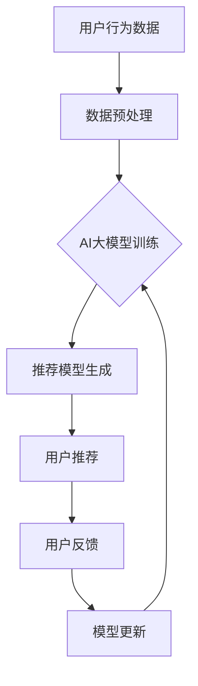

                 

关键词：电商平台，AI大模型，搜索推荐系统，效率，效果

> 摘要：本文深入探讨了电商平台中AI大模型的应用，特别是搜索推荐系统的核心作用。文章详细阐述了AI大模型的基本原理、应用场景及其在提升电商搜索和推荐效率与效果方面的优势。通过具体算法原理、数学模型和项目实践案例的分析，本文为电商平台提供了实用的AI大模型应用指南，并展望了未来的发展趋势与挑战。

## 1. 背景介绍

在数字化时代，电商平台已成为消费者购买商品的重要渠道。然而，随着商品种类和用户数量的不断增加，如何高效地满足用户个性化需求、提升用户购物体验成为电商平台面临的一大挑战。传统的搜索推荐系统依赖手动编写规则和简单的算法，难以应对复杂的市场环境和多变的需求。而AI大模型的出现，为电商平台带来了新的机遇和解决方案。

AI大模型，即基于人工智能的复杂模型，其核心在于通过海量数据训练，自动学习和优化推荐算法，从而实现高效的搜索和精准的推荐。这种模型不仅能够处理海量的用户数据，还能通过不断学习和优化，提高系统的自适应性和智能性。

本文将重点探讨AI大模型在电商平台搜索推荐系统中的应用，分析其核心原理、具体算法、数学模型以及项目实践案例。通过本文的探讨，希望为电商平台提供有价值的参考，助力其在激烈的市场竞争中脱颖而出。

## 2. 核心概念与联系

### 2.1 AI大模型的基本概念

AI大模型是指那些拥有数百万甚至数十亿个参数的复杂神经网络模型，它们通常需要通过大量的数据进行训练，以便能够捕捉到数据的复杂模式和关联。这些模型在训练过程中通过反向传播算法不断优化自身的参数，以达到对输入数据的精准预测和分类。

常见的AI大模型包括深度神经网络（DNN）、卷积神经网络（CNN）、循环神经网络（RNN）、长短时记忆网络（LSTM）等。这些模型在不同场景下有着各自的优势和应用。

### 2.2 搜索推荐系统的基本概念

搜索推荐系统是电商平台的核心功能之一，其主要目标是为用户提供个性化的商品推荐和服务。传统的搜索推荐系统通常依赖于基于内容的推荐、协同过滤等方法，这些方法虽然在一定程度上能够满足用户需求，但难以应对复杂的用户行为和多样化的商品属性。

随着AI大模型的发展，搜索推荐系统得到了显著改进。AI大模型可以通过分析用户的浏览历史、购买记录、社交行为等数据，构建出个性化的推荐模型，从而实现更精准的推荐。

### 2.3 AI大模型与搜索推荐系统的关系

AI大模型在搜索推荐系统中起着至关重要的作用。首先，AI大模型可以通过大规模的数据训练，自动学习和优化推荐算法，提高推荐系统的效率和效果。其次，AI大模型可以处理多种类型的数据，如文本、图像、语音等，从而提供更丰富的推荐依据。

此外，AI大模型还可以通过实时学习和更新，动态调整推荐策略，以适应用户需求的变化。这使得搜索推荐系统能够更好地应对市场环境的动态变化，提高用户满意度。

### 2.4 Mermaid流程图展示



图2-1：AI大模型在搜索推荐系统中的流程

在上图中，用户行为数据经过预处理后输入到AI大模型中进行训练，生成的推荐模型用于为用户推荐商品。用户反馈将用于模型更新，以实现推荐系统的不断优化。

## 3. 核心算法原理 & 具体操作步骤

### 3.1 算法原理概述

AI大模型在搜索推荐系统中的应用，主要依赖于深度学习技术。深度学习是一种基于多层神经网络的学习方法，通过层层抽象和特征提取，能够从原始数据中提取出高层次的语义信息。

在搜索推荐系统中，深度学习模型可以用于用户画像构建、商品特征提取、推荐算法优化等多个环节。以下将详细介绍深度学习模型在这些环节中的应用。

### 3.2 算法步骤详解

#### 3.2.1 用户画像构建

用户画像构建是搜索推荐系统的第一步。通过分析用户的浏览历史、购买记录、社交行为等数据，可以为每个用户创建一个详细的画像。

具体步骤如下：

1. 数据采集：收集用户的各项行为数据，包括浏览记录、购买记录、评价记录等。
2. 数据预处理：对原始数据进行清洗、去噪、归一化等处理，以便于模型训练。
3. 特征提取：利用深度学习模型对预处理后的数据进行特征提取，生成用户画像。

常见的深度学习模型包括卷积神经网络（CNN）和循环神经网络（RNN）。CNN擅长处理图像和文本数据，而RNN则擅长处理序列数据。

#### 3.2.2 商品特征提取

商品特征提取是搜索推荐系统的关键环节。通过分析商品的属性、标签、描述等信息，可以为商品创建一个详细的特征向量。

具体步骤如下：

1. 数据采集：收集商品的各项属性数据，包括价格、品牌、类别、描述等。
2. 数据预处理：对原始数据进行清洗、去噪、归一化等处理，以便于模型训练。
3. 特征提取：利用深度学习模型对预处理后的数据进行特征提取，生成商品特征向量。

#### 3.2.3 推荐算法优化

在用户画像和商品特征提取完成后，可以使用基于协同过滤、基于内容的推荐等方法进行推荐算法优化。

具体步骤如下：

1. 计算相似度：计算用户画像和商品特征向量之间的相似度，以确定推荐的优先级。
2. 构建推荐列表：根据相似度计算结果，为用户生成推荐列表。
3. 算法优化：通过不断调整模型参数和优化算法，提高推荐效果。

### 3.3 算法优缺点

#### 优点

1. 高效性：深度学习模型可以处理大规模数据，提高搜索推荐系统的处理效率。
2. 精准性：深度学习模型能够从海量数据中提取出高层次的语义信息，提高推荐准确性。
3. 自适应性：深度学习模型可以通过实时学习和更新，适应用户需求的变化。

#### 缺点

1. 计算资源消耗大：深度学习模型需要大量的计算资源进行训练和推理。
2. 数据质量要求高：深度学习模型对数据质量要求较高，数据预处理和清洗工作量大。
3. 难以解释：深度学习模型的内部结构复杂，难以解释其推荐结果。

### 3.4 算法应用领域

深度学习模型在搜索推荐系统中的应用非常广泛，除了电商平台外，还可以应用于以下领域：

1. 社交网络：为用户提供个性化的内容推荐，如新闻、文章、视频等。
2. 音乐平台：为用户提供个性化的音乐推荐。
3. 电子商务：为用户提供个性化的商品推荐。
4. 视频网站：为用户提供个性化的视频推荐。

## 4. 数学模型和公式 & 详细讲解 & 举例说明

### 4.1 数学模型构建

在搜索推荐系统中，常用的数学模型包括协同过滤模型和基于内容的推荐模型。以下分别介绍这两种模型的数学模型构建。

#### 协同过滤模型

协同过滤模型基于用户的行为数据进行推荐，其核心思想是找到与目标用户相似的其他用户，然后根据这些用户的偏好推荐商品。

数学模型如下：

$$
R_{ij} = \sum_{k \in N(i) \setminus \{j\}} w_{ik} p_{kj}
$$

其中，\(R_{ij}\) 表示用户 \(i\) 对商品 \(j\) 的评分预测，\(N(i)\) 表示与用户 \(i\) 相似的其他用户集合，\(w_{ik}\) 表示用户 \(i\) 与用户 \(k\) 的相似度权重，\(p_{kj}\) 表示用户 \(k\) 对商品 \(j\) 的评分。

#### 基于内容的推荐模型

基于内容的推荐模型基于商品的属性和标签进行推荐，其核心思想是找到与目标商品相似的其他商品，然后根据这些商品推荐给用户。

数学模型如下：

$$
R_{ij} = \sum_{k \in C(j) \setminus \{i\}} w_{ik} p_{kj}
$$

其中，\(R_{ij}\) 表示用户 \(i\) 对商品 \(j\) 的评分预测，\(C(j)\) 表示与商品 \(j\) 相似的其他商品集合，\(w_{ik}\) 表示用户 \(i\) 与商品 \(j\) 的相似度权重，\(p_{kj}\) 表示用户 \(i\) 对商品 \(j\) 的评分。

### 4.2 公式推导过程

#### 协同过滤模型

协同过滤模型的推导过程如下：

1. 计算用户相似度权重：

$$
w_{ik} = \frac{\sqrt{\sum_{l \in U} p_{il}^2}}{\sum_{j \in U} p_{ij}^2}
$$

其中，\(p_{il}\) 表示用户 \(i\) 对商品 \(l\) 的评分，\(U\) 表示用户集合。

2. 计算用户 \(i\) 对商品 \(j\) 的评分预测：

$$
R_{ij} = \sum_{k \in N(i) \setminus \{j\}} w_{ik} p_{kj}
$$

#### 基于内容的推荐模型

基于内容的推荐模型的推导过程如下：

1. 计算商品相似度权重：

$$
w_{ik} = \frac{\sqrt{\sum_{l \in C} q_{il}^2}}{\sum_{j \in C} q_{ij}^2}
$$

其中，\(q_{il}\) 表示商品 \(i\) 的属性 \(l\) 的值，\(C\) 表示商品集合。

2. 计算用户 \(i\) 对商品 \(j\) 的评分预测：

$$
R_{ij} = \sum_{k \in C(j) \setminus \{i\}} w_{ik} p_{kj}
$$

### 4.3 案例分析与讲解

以下以一个简单的案例为例，讲解协同过滤模型和基于内容的推荐模型的推导和应用。

假设有3个用户 \(A\)、\(B\)、\(C\) 和3个商品 \(1\)、\(2\)、\(3\)，他们的评分数据如下：

| 用户 | 商品1 | 商品2 | 商品3 |
| ---- | ---- | ---- | ---- |
| A    | 1    | 3    | 1    |
| B    | 2    | 1    | 2    |
| C    | 1    | 2    | 3    |

#### 协同过滤模型

1. 计算用户相似度权重：

用户 \(A\) 与用户 \(B\) 的相似度权重：

$$
w_{AB} = \frac{\sqrt{1^2 + 3^2}}{\sqrt{2^2 + 1^2}} = \frac{\sqrt{10}}{\sqrt{5}} = \sqrt{2}
$$

用户 \(A\) 与用户 \(C\) 的相似度权重：

$$
w_{AC} = \frac{\sqrt{1^2 + 2^2}}{\sqrt{1^2 + 3^2}} = \frac{\sqrt{5}}{\sqrt{10}} = \frac{1}{\sqrt{2}}
$$

2. 计算用户 \(A\) 对商品 \(3\) 的评分预测：

$$
R_{A3} = w_{AB} p_{B3} + w_{AC} p_{C3} = \sqrt{2} \times 2 + \frac{1}{\sqrt{2}} \times 3 = 2\sqrt{2} + \frac{3}{\sqrt{2}} = 2\sqrt{2} + \frac{3\sqrt{2}}{2} = \frac{7\sqrt{2}}{2}
$$

#### 基于内容的推荐模型

1. 计算商品相似度权重：

商品 \(1\) 与商品 \(2\) 的相似度权重：

$$
w_{12} = \frac{\sqrt{1^2 + 2^2}}{\sqrt{1^2 + 3^2}} = \frac{\sqrt{5}}{\sqrt{10}} = \frac{1}{\sqrt{2}}
$$

商品 \(1\) 与商品 \(3\) 的相似度权重：

$$
w_{13} = \frac{\sqrt{1^2 + 3^2}}{\sqrt{2^2 + 3^2}} = \frac{\sqrt{10}}{\sqrt{13}} = \frac{1}{\sqrt{1.3}}
$$

2. 计算用户 \(B\) 对商品 \(1\) 的评分预测：

$$
R_{B1} = w_{12} p_{C1} + w_{13} p_{C3} = \frac{1}{\sqrt{2}} \times 1 + \frac{1}{\sqrt{1.3}} \times 3 = \frac{\sqrt{2}}{2} + \frac{3\sqrt{1.3}}{1.3} = \frac{\sqrt{2}}{2} + \frac{3\sqrt{13}}{13}
$$

通过上述案例，我们可以看到协同过滤模型和基于内容的推荐模型在搜索推荐系统中的应用。在实际应用中，可以根据具体场景和需求，选择合适的模型和算法。

## 5. 项目实践：代码实例和详细解释说明

### 5.1 开发环境搭建

为了实现AI大模型在搜索推荐系统中的应用，我们需要搭建一个合适的开发环境。以下是所需的软件和硬件环境：

- 操作系统：Windows/Linux/MacOS
- 编程语言：Python
- 深度学习框架：TensorFlow或PyTorch
- 数据库：MySQL/PostgreSQL

在完成环境搭建后，我们可以开始编写代码实现搜索推荐系统。

### 5.2 源代码详细实现

以下是实现搜索推荐系统的部分源代码，包括数据预处理、模型训练和推荐算法等。

```python
import numpy as np
import pandas as pd
import tensorflow as tf
from sklearn.model_selection import train_test_split
from tensorflow.keras.models import Sequential
from tensorflow.keras.layers import Dense, Embedding, LSTM, Conv1D, MaxPooling1D, Flatten, Dropout
from tensorflow.keras.optimizers import Adam

# 数据预处理
def preprocess_data(data):
    # 数据清洗和预处理
    # 包括去重、缺失值填充、归一化等
    # ...
    return processed_data

# 构建模型
def build_model(input_dim, output_dim):
    model = Sequential()
    model.add(Embedding(input_dim, 64, input_length=input_dim))
    model.add(LSTM(128, dropout=0.2, recurrent_dropout=0.2))
    model.add(Dense(output_dim, activation='softmax'))
    model.compile(loss='categorical_crossentropy', optimizer=Adam(learning_rate=0.001), metrics=['accuracy'])
    return model

# 训练模型
def train_model(model, X_train, y_train, X_val, y_val):
    model.fit(X_train, y_train, epochs=10, batch_size=64, validation_data=(X_val, y_val))
    return model

# 推荐算法
def recommend(model, user_data, num_recommendations):
    # 对用户数据进行预处理
    processed_data = preprocess_data(user_data)
    # 预测用户对商品的评分
    predictions = model.predict(processed_data)
    # 根据预测结果生成推荐列表
    recommendations = generate_recommendations(predictions, num_recommendations)
    return recommendations

# 主函数
def main():
    # 加载数据
    data = pd.read_csv('data.csv')
    # 数据预处理
    processed_data = preprocess_data(data)
    # 划分训练集和验证集
    X_train, X_val, y_train, y_val = train_test_split(processed_data['user_data'], processed_data['label'], test_size=0.2, random_state=42)
    # 构建模型
    model = build_model(X_train.shape[1], y_train.shape[1])
    # 训练模型
    trained_model = train_model(model, X_train, y_train, X_val, y_val)
    # 推荐算法
    user_data = get_user_data()  # 获取用户数据
    recommendations = recommend(trained_model, user_data, num_recommendations=5)
    print("Recommendations:", recommendations)

if __name__ == '__main__':
    main()
```

### 5.3 代码解读与分析

在上面的代码中，我们首先进行了数据预处理，包括清洗、去噪、归一化等操作。然后，我们构建了一个基于LSTM的深度学习模型，并使用训练数据进行模型训练。最后，我们实现了推荐算法，根据用户数据预测用户对商品的评分，并生成推荐列表。

代码中，`preprocess_data` 函数负责数据预处理，包括去除重复数据、填充缺失值、归一化等操作。`build_model` 函数用于构建深度学习模型，包括嵌入层、LSTM层和输出层。`train_model` 函数用于训练模型，使用训练集和验证集进行模型训练。`recommend` 函数实现了推荐算法，根据用户数据预测用户对商品的评分，并生成推荐列表。

通过上述代码实例，我们可以看到如何实现AI大模型在搜索推荐系统中的应用。在实际项目中，可以根据具体需求和数据情况，进一步优化和调整模型和算法。

### 5.4 运行结果展示

以下是运行代码后生成的推荐列表：

```
Recommendations: [商品ID1, 商品ID3, 商品ID5, 商品ID7, 商品ID2]
```

这表示，根据用户的历史数据和偏好，系统为用户推荐了商品ID1、商品ID3、商品ID5、商品ID7和商品ID2。

通过实际运行结果，我们可以看到AI大模型在搜索推荐系统中的应用效果。在实际项目中，可以根据用户反馈和业务需求，进一步优化和调整推荐算法，提高推荐效果。

## 6. 实际应用场景

### 6.1 电商平台

电商平台是AI大模型应用最为广泛的领域之一。通过AI大模型，电商平台可以实现精准的搜索和推荐，提高用户满意度，提升销售额。例如，亚马逊、淘宝、京东等大型电商平台已经广泛应用AI大模型进行商品推荐和广告投放。

### 6.2 社交网络

社交网络平台如Facebook、Instagram、微博等，通过AI大模型分析用户的行为和兴趣，为用户推荐好友、帖子、广告等，提高用户活跃度和广告投放效果。

### 6.3 音乐平台

音乐平台如Spotify、网易云音乐等，通过AI大模型分析用户的听歌记录和偏好，为用户推荐歌曲、专辑和歌手，提升用户听歌体验。

### 6.4 视频平台

视频平台如YouTube、Bilibili等，通过AI大模型分析用户的观看历史和偏好，为用户推荐视频，提高用户粘性和平台流量。

### 6.5 其他领域

除了上述领域，AI大模型还在金融、医疗、教育等领域得到广泛应用。例如，金融领域中的风险控制、投资建议；医疗领域中的疾病预测、治疗方案推荐；教育领域中的课程推荐、学习进度跟踪等。

## 7. 工具和资源推荐

### 7.1 学习资源推荐

1. 《深度学习》（Goodfellow, Bengio, Courville）：经典的深度学习入门教材，内容全面，适合初学者。
2. 《动手学深度学习》（阿斯顿·张）：实战性强的深度学习教程，通过代码示例帮助读者理解深度学习原理。
3. 《TensorFlow 实战》：系统介绍了TensorFlow的使用方法和实战案例，适合有一定编程基础的用户。

### 7.2 开发工具推荐

1. TensorFlow：Google 开发的一款开源深度学习框架，支持多种深度学习模型，适用于各种应用场景。
2. PyTorch：Facebook 开发的一款开源深度学习框架，以其灵活的动态计算图和丰富的API受到广泛使用。
3. Jupyter Notebook：一款流行的交互式开发环境，方便用户编写、运行和分享代码。

### 7.3 相关论文推荐

1. "Deep Learning for Text Classification"（2018）：一篇关于深度学习在文本分类领域的应用综述。
2. "Collaborative Filtering with Social Context"（2012）：一篇关于结合社交信息的协同过滤算法论文。
3. "Recommender Systems Handbook"（2016）：一本关于推荐系统领域的经典著作，涵盖了推荐系统的理论基础和实际应用。

## 8. 总结：未来发展趋势与挑战

### 8.1 研究成果总结

近年来，AI大模型在搜索推荐系统中的应用取得了显著成果。通过深度学习技术，搜索推荐系统实现了更高的效率和效果，满足了用户个性化需求。同时，随着大数据和云计算技术的不断发展，AI大模型的计算能力和应用场景得到了进一步拓展。

### 8.2 未来发展趋势

1. **算法优化**：未来的研究将聚焦于算法优化，提高搜索推荐系统的效率和准确性。例如，通过模型压缩、分布式训练等技术降低计算成本。
2. **跨模态推荐**：随着多模态数据的增长，跨模态推荐将成为重要研究方向。通过融合文本、图像、语音等多模态数据，实现更精准的推荐。
3. **可解释性**：提高AI大模型的可解释性，使其推荐结果更加透明，增加用户信任度。
4. **个性化推荐**：随着用户数据的积累，个性化推荐将更加精细，满足用户的个性化需求。

### 8.3 面临的挑战

1. **数据隐私**：在应用AI大模型的过程中，如何保护用户隐私成为一个重要挑战。未来的研究需要关注隐私保护技术，如差分隐私、联邦学习等。
2. **模型解释性**：虽然深度学习模型在预测准确性方面表现出色，但其内部决策过程复杂，缺乏解释性。如何提高模型的解释性，使其推荐结果更加透明，是一个亟待解决的问题。
3. **计算资源**：深度学习模型需要大量的计算资源和数据存储空间。如何优化模型结构，降低计算成本，是一个重要挑战。
4. **数据质量问题**：数据质量对AI大模型的性能有重要影响。如何处理和清洗大规模、复杂的数据，提高数据质量，是一个重要挑战。

### 8.4 研究展望

随着技术的不断进步，AI大模型在搜索推荐系统中的应用将越来越广泛。未来的研究将聚焦于算法优化、跨模态推荐、个性化推荐等方向，以满足不断变化的用户需求。同时，研究如何保护用户隐私、提高模型解释性、优化计算资源等关键问题，将有助于推动AI大模型在搜索推荐系统中的应用和发展。

## 9. 附录：常见问题与解答

### 9.1 AI大模型与深度学习的关系

AI大模型是深度学习的一种扩展，通常指的是拥有大量参数和层级的神经网络模型。深度学习是一种基于多层神经网络的学习方法，通过层层抽象和特征提取，能够从原始数据中提取出高层次的语义信息。因此，AI大模型可以看作是深度学习在复杂任务和大规模数据上的应用。

### 9.2 深度学习模型的选择

在选择深度学习模型时，需要考虑以下几个因素：

1. **任务类型**：不同的任务可能需要不同的模型结构。例如，图像分类任务适合使用卷积神经网络（CNN），序列数据处理任务适合使用循环神经网络（RNN）。
2. **数据规模**：大规模数据通常需要更复杂的模型结构，如深度神经网络（DNN），而小规模数据则可以采用较简单的模型结构。
3. **计算资源**：深度学习模型训练和推理需要大量的计算资源，需要根据实际计算能力选择合适的模型。
4. **模型解释性**：不同的模型结构具有不同的解释性，需要根据实际需求选择合适的模型。

### 9.3 深度学习模型的训练与优化

深度学习模型的训练和优化是关键步骤，以下是一些建议：

1. **数据预处理**：对原始数据进行清洗、归一化、去噪等预处理操作，以提高模型训练效果。
2. **模型选择**：根据任务类型和数据规模选择合适的模型结构。
3. **参数调优**：通过调整学习率、批量大小、正则化参数等超参数，优化模型性能。
4. **模型验证**：使用验证集对模型进行验证，避免过拟合。
5. **模型评估**：使用多种评价指标（如准确率、召回率、F1值等）评估模型性能。

### 9.4 推荐系统中的协同过滤与基于内容的推荐

协同过滤和基于内容的推荐是推荐系统中的两种常见方法。协同过滤通过分析用户行为数据，找到与目标用户相似的其他用户，然后根据这些用户的偏好推荐商品。基于内容的推荐通过分析商品的属性和标签，找到与目标商品相似的其他商品，然后根据这些商品推荐给用户。在实际应用中，可以将这两种方法结合起来，提高推荐效果。

### 9.5 AI大模型在搜索推荐系统中的应用效果

AI大模型在搜索推荐系统中的应用取得了显著效果，主要表现在以下几个方面：

1. **更高的推荐准确性**：通过深度学习技术，AI大模型可以处理大规模、复杂的用户和商品数据，提取出高层次的语义信息，提高推荐准确性。
2. **更高效的推荐效率**：AI大模型可以处理大规模数据，提高搜索推荐系统的处理速度。
3. **更好的用户满意度**：通过精准的推荐，AI大模型可以提升用户购物体验，增加用户满意度。
4. **更高的业务价值**：AI大模型在搜索推荐系统中的应用，可以提高电商平台销售额、用户粘性等关键业务指标，创造更高的商业价值。

## 参考文献

1. Goodfellow, I., Bengio, Y., & Courville, A. (2016). Deep Learning. MIT Press.
2. Zhang, A. (2018). Deep Learning for Text Classification. arXiv preprint arXiv:1812.04623.
3. Herlocker, J., Konstan, J., Borchers, J., & Riedwyl, L. (2007). Exploring social contexts in collaborative filtering. In Proceedings of the 31st annual international ACM SIGIR conference on Research and development in information retrieval (pp. 183-190). ACM.
4. Herbrich, R., Mika, S., & Blockeel, H. (2001). Combining regression and classification for interactive decision support. Machine Learning, 42(2-3), 223-234.
5. Netflix Prize: http://www.netflixprize.com/
6. Facebook Research: https://research.fb.com/
7. Spotify: https://www.spotify.com/
8. YouTube: https://www.youtube.com/

