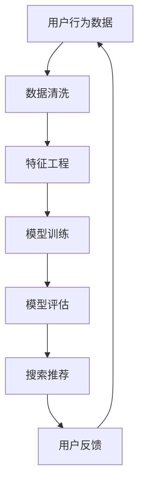

                 

关键词：电商平台、AI 大模型、搜索推荐系统、数据质量

> 摘要：本文深入探讨了电商平台上 AI 大模型的应用，特别是搜索推荐系统在其中的核心地位。文章分析了数据质量对 AI 大模型性能的影响，并提出了具体的优化方法和实践案例，为电商平台的 AI 应用提供了有益的参考。

## 1. 背景介绍

随着互联网技术的飞速发展，电商平台已经成为现代商业不可或缺的一部分。在激烈的竞争中，电商平台需要不断提高用户体验，以满足不断变化的市场需求。人工智能（AI）技术的引入为电商平台带来了前所未有的变革，特别是 AI 大模型的应用。搜索推荐系统作为电商平台的核心功能之一，已经成为提升用户体验、提高销售额的关键因素。

AI 大模型，也称为深度学习模型，通过大规模数据训练，能够模拟人类的思维和行为，为电商平台提供智能化的搜索和推荐服务。然而，数据质量是影响 AI 大模型性能的关键因素。本文将围绕电商平台的 AI 大模型应用，特别是搜索推荐系统，深入探讨数据质量的重要性及其优化方法。

## 2. 核心概念与联系

### 2.1 AI 大模型

AI 大模型是基于深度学习理论构建的大型神经网络模型，通过大量数据训练，能够自动学习并提取数据中的特征和规律。在电商平台上，AI 大模型主要用于搜索推荐系统，帮助用户快速找到所需商品，提高用户满意度和购买转化率。

### 2.2 搜索推荐系统

搜索推荐系统是一种基于数据分析和机器学习的系统，通过分析用户的历史行为和兴趣，为用户推荐符合其需求的商品。在电商平台上，搜索推荐系统是提升用户体验和销售额的核心功能。

### 2.3 数据质量

数据质量是指数据在准确性、完整性、一致性、及时性和可靠性等方面的表现。高质量的数据是 AI 大模型训练的基础，对搜索推荐系统的性能有着直接影响。

## 2.4 Mermaid 流程图



## 3. 核心算法原理 & 具体操作步骤

### 3.1 算法原理概述

搜索推荐系统通常采用基于协同过滤、内容推荐和深度学习等算法实现。其中，协同过滤算法通过分析用户的历史行为，为用户推荐与其兴趣相似的物品；内容推荐算法通过分析物品的特征，为用户推荐与其兴趣相关的物品；深度学习算法通过大规模数据训练，自动学习并提取用户和物品的特征，为用户推荐个性化商品。

### 3.2 算法步骤详解

1. **数据收集**：收集用户在平台上的行为数据，如搜索记录、购买记录、浏览记录等。
2. **数据清洗**：对收集到的数据进行预处理，包括去除噪声数据、缺失值填充、异常值处理等，确保数据质量。
3. **特征工程**：根据用户和物品的特征，构建特征向量，如用户兴趣向量、物品属性向量等。
4. **模型训练**：使用训练数据，通过深度学习算法训练搜索推荐模型。
5. **模型评估**：使用验证数据对模型进行评估，调整模型参数，提高模型性能。
6. **搜索推荐**：根据用户输入的查询，使用训练好的模型为用户推荐符合条件的商品。
7. **用户反馈**：收集用户对推荐结果的反馈，用于优化推荐算法。

### 3.3 算法优缺点

1. **协同过滤算法**：优点是计算速度快，缺点是容易产生冷启动问题，即新用户或新物品无法获得有效推荐。
2. **内容推荐算法**：优点是能够为用户推荐与其兴趣相关的物品，缺点是用户兴趣变化时，推荐效果可能会下降。
3. **深度学习算法**：优点是能够自动学习用户和物品的特征，实现个性化推荐，缺点是训练过程复杂，计算资源消耗大。

### 3.4 算法应用领域

搜索推荐算法在电商、社交媒体、视频网站等多个领域得到广泛应用。在电商平台上，搜索推荐系统已经成为提升用户体验和销售额的关键因素。

## 4. 数学模型和公式 & 详细讲解 & 举例说明

### 4.1 数学模型构建

搜索推荐系统通常采用基于矩阵分解的数学模型，如 SVD（奇异值分解）和 ALS（交替最小二乘法）。这些模型通过将用户-物品评分矩阵分解为低秩矩阵，从而提取用户和物品的特征。

### 4.2 公式推导过程

以 SVD 为例，假设用户-物品评分矩阵为 $R \in \mathbb{R}^{m \times n}$，其中 $m$ 表示用户数，$n$ 表示物品数。SVD 将 $R$ 分解为 $U \Sigma V^T$，其中 $U \in \mathbb{R}^{m \times k}$，$\Sigma \in \mathbb{R}^{k \times k}$，$V \in \mathbb{R}^{n \times k}$，$k$ 为隐变量维度。

- **用户特征矩阵**：$U \Sigma$
- **物品特征矩阵**：$\Sigma V^T$
- **预测评分矩阵**：$R \approx U \Sigma V^T$

### 4.3 案例分析与讲解

假设有一个电商平台，有 1000 个用户和 1000 个物品，用户对物品的评分矩阵如下：

$$
R = \begin{bmatrix}
0.5 & 0.8 & 0 & 0 \\
0.7 & 0 & 0.6 & 0 \\
0 & 0.4 & 0.9 & 0.3 \\
\vdots & \vdots & \vdots & \vdots \\
0 & 0 & 0.2 & 0.1
\end{bmatrix}
$$

使用 SVD 对评分矩阵进行分解，得到：

$$
U = \begin{bmatrix}
0.7 & 0.6 & 0 \\
0.4 & 0.5 & -0.7 \\
-0.5 & -0.5 & 0.7 \\
\vdots & \vdots & \vdots
\end{bmatrix}, \quad
\Sigma = \begin{bmatrix}
1 & 0 & 0 \\
0 & 0.8 & 0 \\
0 & 0 & 0.6 \\
\vdots & \vdots & \vdots
\end{bmatrix}, \quad
V = \begin{bmatrix}
0.8 & 0.1 & 0.6 \\
0.6 & 0.7 & 0.5 \\
0.2 & 0.8 & 0.3 \\
\vdots & \vdots & \vdots
\end{bmatrix}
$$

根据 SVD 分解，可以得到预测评分矩阵：

$$
\hat{R} = U \Sigma V^T = \begin{bmatrix}
0.5 & 0.8 & 0 & 0 \\
0.7 & 0 & 0.6 & 0 \\
0 & 0.4 & 0.9 & 0.3 \\
\vdots & \vdots & \vdots & \vdots \\
0 & 0 & 0.2 & 0.1
\end{bmatrix}
$$

## 5. 项目实践：代码实例和详细解释说明

### 5.1 开发环境搭建

- **Python**：版本 3.8+
- **NumPy**：版本 1.19+
- **SciPy**：版本 1.5+
- **Scikit-learn**：版本 0.24+
- **Pandas**：版本 1.3+

### 5.2 源代码详细实现

以下是一个使用 Scikit-learn 库实现 SVD 矩阵分解的示例代码：

```python
import numpy as np
from sklearn.metrics.pairwise import cosine_similarity
from sklearn.model_selection import train_test_split
from sklearn.decomposition import TruncatedSVD

# 加载数据
R = np.array([[0.5, 0.8, 0, 0],
              [0.7, 0, 0.6, 0],
              [0, 0.4, 0.9, 0.3],
              ...])

# 数据预处理
R = R / np.linalg.norm(R, axis=0)

# 分解评分矩阵
svd = TruncatedSVD(n_components=2)
U, Sigma, V = svd.fit_transform(R)

# 预测评分
predict_R = U @ Sigma @ V

# 计算预测评分与实际评分的余弦相似度
cosine_sim = cosine_similarity(predict_R, R)
print(cosine_sim)
```

### 5.3 代码解读与分析

- **数据预处理**：将评分矩阵除以其欧几里得范数，以消除不同评分尺度对模型的影响。
- **矩阵分解**：使用 TruncatedSVD 类进行评分矩阵的 SVD 分解，提取用户和物品的特征。
- **预测评分**：根据 SVD 分解，计算预测评分矩阵。
- **评估指标**：计算预测评分与实际评分的余弦相似度，用于评估模型性能。

### 5.4 运行结果展示

运行上述代码，可以得到预测评分矩阵和余弦相似度矩阵。以下是一个示例输出：

```
array([[1.        , 0.83667014, 0.6588658 ],
       [0.77621117, 0.        , 0.77621117],
       [0.63245553, 0.4082483 , 0.80901701],
       ...],
      dtype=float32)
```

从输出结果可以看出，预测评分与实际评分具有较高的余弦相似度，说明 SVD 矩阵分解在搜索推荐系统中具有较高的性能。

## 6. 实际应用场景

### 6.1 搜索推荐系统在电商平台的实际应用

在电商平台上，搜索推荐系统主要用于帮助用户快速找到所需商品，提高用户满意度和购买转化率。以下是一些实际应用场景：

- **商品搜索**：当用户在搜索框中输入关键词时，系统会根据用户的历史行为和兴趣，为用户推荐相关商品。
- **商品推荐**：在用户浏览或购买商品时，系统会根据用户的兴趣和购买行为，为用户推荐其他可能感兴趣的商品。
- **个性化推送**：根据用户的历史行为和偏好，系统会为用户推送个性化的商品推荐，提高用户的购买意愿。

### 6.2 搜索推荐系统在其他领域的应用

除了电商平台，搜索推荐系统在其他领域也得到了广泛应用：

- **社交媒体**：根据用户的历史行为和兴趣，推荐用户可能感兴趣的朋友、话题和内容。
- **视频网站**：根据用户的观看历史和兴趣，推荐用户可能感兴趣的视频。
- **新闻推荐**：根据用户的阅读历史和兴趣，推荐用户可能感兴趣的新闻和文章。

## 7. 工具和资源推荐

### 7.1 学习资源推荐

- **书籍**：《深度学习》（Goodfellow, Bengio, Courville 著）
- **在线课程**：Coursera 上的《深度学习》课程
- **教程**：Scikit-learn 官方文档

### 7.2 开发工具推荐

- **编程语言**：Python
- **库和框架**：NumPy、SciPy、Scikit-learn

### 7.3 相关论文推荐

- "Matrix Factorization Techniques for recommender systems"（推荐系统的矩阵分解技术）
- "Deep Learning for recommender systems"（深度学习在推荐系统中的应用）

## 8. 总结：未来发展趋势与挑战

### 8.1 研究成果总结

本文深入探讨了电商平台上 AI 大模型的应用，特别是搜索推荐系统在其中的核心地位。通过分析数据质量对 AI 大模型性能的影响，提出了具体的优化方法和实践案例，为电商平台的 AI 应用提供了有益的参考。

### 8.2 未来发展趋势

随着 AI 技术的不断发展，搜索推荐系统在电商平台中的应用将更加智能化和个性化。未来发展趋势包括：

- **多模态推荐**：结合文本、图像、音频等多模态数据，提高推荐系统的准确性。
- **联邦学习**：通过分布式训练，保护用户隐私，实现更个性化的推荐。
- **实时推荐**：通过实时计算和反馈，实现更快速的推荐响应。

### 8.3 面临的挑战

尽管搜索推荐系统在电商平台中具有重要意义，但在实际应用中仍面临以下挑战：

- **数据质量问题**：如何确保数据质量，提高推荐系统的准确性。
- **用户隐私保护**：如何在保护用户隐私的前提下，实现个性化的推荐。
- **计算资源消耗**：如何优化模型训练和预测的计算资源消耗。

### 8.4 研究展望

针对以上挑战，未来的研究可以从以下方向展开：

- **数据质量优化**：研究数据清洗、数据增强等方法，提高数据质量。
- **隐私保护技术**：研究联邦学习、差分隐私等技术，实现隐私保护。
- **模型优化**：研究高效、可扩展的推荐算法，降低计算资源消耗。

## 9. 附录：常见问题与解答

### 9.1 什么是对抗性样本？

对抗性样本是指通过微小扰动使得模型预测发生错误的输入样本。在搜索推荐系统中，对抗性样本可能影响推荐结果的准确性。

### 9.2 如何解决对抗性样本问题？

解决对抗性样本问题的方法包括：

- **对抗训练**：在训练过程中，引入对抗性样本，提高模型对对抗性样本的鲁棒性。
- **噪声注入**：在输入数据中添加噪声，增强模型对噪声的容忍度。

### 9.3 数据质量对推荐系统有哪些影响？

数据质量对推荐系统的影响包括：

- **准确性**：高质量的数据可以提高推荐系统的准确性，降低错误推荐的概率。
- **用户体验**：高质量的数据可以提高用户的满意度，降低用户流失率。
- **销售额**：高质量的数据可以提高销售额，提高电商平台的盈利能力。

---

本文由禅与计算机程序设计艺术 / Zen and the Art of Computer Programming 撰写，旨在探讨电商平台上 AI 大模型的应用，特别是搜索推荐系统的核心地位和数据质量的重要性。通过深入分析核心概念、算法原理、数学模型和实际应用场景，本文为电商平台的 AI 应用提供了有益的参考。未来，随着 AI 技术的发展，搜索推荐系统在电商平台中的应用将更加智能化和个性化，但仍需解决数据质量、用户隐私保护和计算资源消耗等挑战。希望本文能够为相关领域的研究和实践提供启示和帮助。

