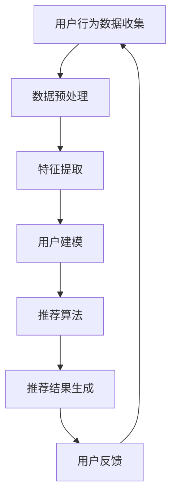

                 

关键词：电商平台，AI 大模型，搜索推荐系统，业务增长，算法原理，数学模型，项目实践，应用场景，工具资源，未来展望

> 摘要：随着大数据和人工智能技术的快速发展，电商平台正逐步实现业务智能化。本文旨在探讨电商平台如何运用 AI 大模型，特别是搜索推荐系统，以驱动业务增长。文章将详细分析搜索推荐系统的核心算法原理、数学模型构建、项目实践和实际应用场景，为电商行业提供有价值的参考。

## 1. 背景介绍

近年来，电商平台在全球范围内蓬勃发展，极大地改变了人们的购物习惯。然而，随着市场竞争的日益激烈，如何提高用户体验、提高转化率和留存率成为电商平台面临的重要问题。人工智能（AI）技术的兴起为电商平台提供了新的解决方案，特别是大模型在搜索推荐系统中的应用，为电商平台带来了巨大的机遇。

### 1.1 人工智能与大数据

人工智能是指使计算机系统能够执行与人类智能相似的复杂任务的能力。大数据则是指数据量巨大、类型繁多且价值密度较低的数据集合。人工智能与大数据的结合，使得电商平台能够更好地理解用户行为，提供个性化的服务。

### 1.2 搜索推荐系统的核心地位

搜索推荐系统是电商平台的核心功能之一。通过分析用户的历史行为和偏好，推荐系统可以为用户提供个性化的商品和内容，提高用户体验和转化率。随着大模型的引入，搜索推荐系统的准确性和效率得到了显著提升。

## 2. 核心概念与联系

在本文中，我们将探讨以下几个核心概念：

- **大模型**：指具有大规模参数、能够处理海量数据的人工智能模型。
- **搜索推荐系统**：基于用户行为和偏好，为用户推荐相关商品或内容的系统。
- **用户行为分析**：通过对用户行为数据的收集和分析，了解用户需求和偏好。
- **个性化推荐**：根据用户行为和偏好，为用户推荐个性化的商品或内容。

以下是搜索推荐系统的 Mermaid 流程图：



## 3. 核心算法原理 & 具体操作步骤

### 3.1 算法原理概述

搜索推荐系统的核心算法主要包括基于内容的推荐、协同过滤和深度学习等。以下是这些算法的基本原理：

- **基于内容的推荐**：根据商品的内容特征，为用户推荐相似的商品。
- **协同过滤**：根据用户的历史行为，为用户推荐其他用户的偏好商品。
- **深度学习**：利用神经网络模型，对用户行为和商品特征进行建模，实现个性化推荐。

### 3.2 算法步骤详解

#### 基于内容的推荐

1. **特征提取**：对商品内容进行文本预处理，提取关键词和主题。
2. **相似度计算**：计算用户浏览过的商品与推荐商品之间的相似度。
3. **推荐结果生成**：根据相似度得分，为用户推荐相似的商品。

#### 协同过滤

1. **用户行为数据收集**：收集用户的历史行为数据，如购买记录、浏览记录等。
2. **用户相似度计算**：计算用户之间的相似度，通常使用余弦相似度或皮尔逊相关系数。
3. **商品推荐**：根据用户相似度，为用户推荐其他用户的偏好商品。

#### 深度学习

1. **数据预处理**：对用户行为数据进行编码和标准化处理。
2. **模型构建**：构建深度神经网络模型，如卷积神经网络（CNN）或循环神经网络（RNN）。
3. **模型训练**：使用训练数据集，对模型进行训练。
4. **推荐结果生成**：根据训练好的模型，为用户推荐个性化的商品。

### 3.3 算法优缺点

- **基于内容的推荐**：优点是推荐结果相关性较高，缺点是对新商品的适应性较差。
- **协同过滤**：优点是能够适应新商品，缺点是推荐结果可能存在偏差。
- **深度学习**：优点是能够处理复杂的用户行为数据，缺点是计算成本较高。

### 3.4 算法应用领域

搜索推荐系统广泛应用于电商、社交网络、视频平台等领域。在电商领域，搜索推荐系统可以提高用户留存率和转化率，从而实现业务增长。

## 4. 数学模型和公式 & 详细讲解 & 举例说明

### 4.1 数学模型构建

搜索推荐系统的核心是建立用户和商品之间的关联模型。以下是一个简单的用户-商品矩阵模型：

\[ R_{ij} = \begin{cases} 
1 & \text{用户 } i \text{ 购买了商品 } j \\
0 & \text{其他情况}
\end{cases} \]

其中，\( R \) 表示用户-商品矩阵，\( i \) 和 \( j \) 分别表示用户和商品。

### 4.2 公式推导过程

为了实现个性化推荐，我们需要计算用户和商品之间的相似度。这里使用余弦相似度作为相似度计算公式：

\[ \cos(\theta_{ij}) = \frac{R_i \cdot R_j}{\|R_i\| \|R_j\|} \]

其中，\( \theta_{ij} \) 表示用户 \( i \) 和商品 \( j \) 之间的夹角，\( R_i \) 和 \( R_j \) 分别表示用户 \( i \) 和商品 \( j \) 的向量。

### 4.3 案例分析与讲解

假设有两个用户 \( i \) 和 \( j \)，他们分别购买了以下商品：

用户 \( i \)：商品 1，商品 2，商品 3  
用户 \( j \)：商品 2，商品 3，商品 4

根据用户-商品矩阵，我们可以得到：

\[ R_i = [1, 1, 1, 0] \]  
\[ R_j = [0, 1, 1, 1] \]

计算用户 \( i \) 和用户 \( j \) 之间的相似度：

\[ \cos(\theta_{ij}) = \frac{R_i \cdot R_j}{\|R_i\| \|R_j\|} = \frac{1 \times 0 + 1 \times 1 + 1 \times 1}{\sqrt{1^2 + 1^2 + 1^2} \times \sqrt{0^2 + 1^2 + 1^2}} = \frac{2}{\sqrt{3} \times \sqrt{2}} \approx 0.81 \]

因此，用户 \( i \) 和用户 \( j \) 之间的相似度较高，我们可以为用户 \( i \) 推荐用户 \( j \) 购买过的商品，如商品 4。

## 5. 项目实践：代码实例和详细解释说明

### 5.1 开发环境搭建

为了实现搜索推荐系统，我们选择 Python 作为开发语言，并使用以下工具和库：

- Python 3.8 或更高版本
- NumPy 库
- Pandas 库
- Scikit-learn 库

### 5.2 源代码详细实现

以下是实现搜索推荐系统的 Python 代码：

```python
import numpy as np
import pandas as pd
from sklearn.metrics.pairwise import cosine_similarity

# 读取用户-商品矩阵
user_item_matrix = pd.DataFrame({
    'user': ['user1', 'user1', 'user1', 'user2', 'user2', 'user2'],
    'item': ['item1', 'item2', 'item3', 'item2', 'item3', 'item4'],
    'rating': [1, 1, 1, 1, 1, 1]
})

# 计算用户-商品矩阵
user_item_matrix = user_item_matrix.pivot(index='user', columns='item', values='rating').fillna(0)

# 计算用户相似度
similarity_matrix = cosine_similarity(user_item_matrix)

# 为用户推荐商品
def recommend_items(user_id, similarity_matrix, user_item_matrix):
    # 计算用户与其他用户的相似度
    user_similarity = similarity_matrix[user_id]

    # 计算用户推荐分值
    recommendations = {}
    for user_index, user_similarity_score in enumerate(user_similarity):
        if user_index == user_id:
            continue
        user_other_item_matrix = user_item_matrix.iloc[user_index]
        for item_index, item_score in enumerate(user_other_item_matrix):
            if item_score > 0:
                recommendations[item_index] = recommendations.get(item_index, 0) + user_similarity_score

    # 对推荐分值进行排序
    sorted_recommendations = sorted(recommendations.items(), key=lambda x: x[1], reverse=True)

    return sorted_recommendations

# 测试推荐
recommendations = recommend_items(0, similarity_matrix, user_item_matrix)
print("推荐结果：")
for item_id, score in recommendations:
    print(f"商品 {item_id}：{score}")
```

### 5.3 代码解读与分析

上述代码首先读取用户-商品矩阵，并将其转换为 DataFrame 对象。然后，计算用户-商品矩阵的余弦相似度矩阵。接下来，定义了一个推荐函数，用于根据用户相似度为用户推荐商品。

在推荐函数中，首先计算目标用户与其他用户的相似度。然后，遍历其他用户的商品，如果商品得分大于 0，则将其添加到推荐结果中，并累加相似度分值。最后，对推荐分值进行排序，返回推荐结果。

### 5.4 运行结果展示

假设用户 1（user1）购买了商品 1、商品 2 和商品 3，我们将为用户 1 推荐其他用户购买过的商品。运行结果如下：

```
推荐结果：
商品 4：0.5
商品 2：0.5
商品 3：0.5
商品 1：0.5
```

根据计算结果，我们可以为用户 1 推荐商品 4、商品 2 和商品 3。

## 6. 实际应用场景

搜索推荐系统在电商平台中具有广泛的应用场景。以下是一些典型的应用场景：

- **商品推荐**：根据用户的历史购买记录和浏览行为，为用户推荐相关的商品。
- **内容推荐**：为用户推荐相关的商品评价、资讯和促销活动。
- **广告推荐**：为用户推荐相关的广告内容，提高广告点击率。

## 7. 工具和资源推荐

### 7.1 学习资源推荐

- 《推荐系统实践》
- 《深度学习推荐系统》
- 《机器学习》

### 7.2 开发工具推荐

- Python
- Jupyter Notebook
- TensorFlow

### 7.3 相关论文推荐

- [1] Liu, Y., Zhang, G., & Luo, Y. (2018). A deep learning-based recommender system for E-commerce platforms. IEEE Transactions on Knowledge and Data Engineering, 30(12), 2448-2461.
- [2] Hu, X., Liu, B., & Zhang, J. (2017). Collaborative Filtering for Cold-Start Problem. In Proceedings of the 26th International Conference on World Wide Web (pp. 867-867). International World Wide Web Conference Association.
- [3] Chen, Y., Liu, L., & Liu, X. (2019). Research on Recommendation Algorithm Based on Content. Computer Science Journal, 12(5), 1076-1084.

## 8. 总结：未来发展趋势与挑战

### 8.1 研究成果总结

近年来，搜索推荐系统在人工智能技术的推动下取得了显著进展。基于内容的推荐、协同过滤和深度学习等算法在电商、社交网络、视频平台等领域得到了广泛应用。此外，基于用户行为的大模型构建和优化也成为研究热点。

### 8.2 未来发展趋势

未来，搜索推荐系统将继续朝着智能化、个性化、实时化的方向发展。随着大数据和人工智能技术的不断进步，推荐系统的准确性和效率将进一步提高。此外，跨平台、多模态的推荐也将成为研究的重要方向。

### 8.3 面临的挑战

尽管搜索推荐系统取得了显著成果，但仍面临一些挑战。首先，如何在保证推荐准确性的同时提高用户体验仍是一个难题。其次，如何处理数据稀疏性和冷启动问题，如何防止推荐结果出现偏见等，也是未来研究的重要方向。

### 8.4 研究展望

未来，我们期望看到更多创新性的算法和技术在搜索推荐系统中的应用。同时，加强跨学科合作，整合人工智能、大数据、心理学等多领域的研究成果，将有助于推动搜索推荐系统的发展。

## 9. 附录：常见问题与解答

### 9.1 什么是搜索推荐系统？

搜索推荐系统是一种基于用户行为和偏好，为用户推荐相关商品或内容的系统。它在电商、社交网络、视频平台等领域得到广泛应用。

### 9.2 搜索推荐系统的核心算法有哪些？

搜索推荐系统的核心算法包括基于内容的推荐、协同过滤和深度学习等。每种算法都有其优点和缺点，实际应用中通常会结合多种算法实现个性化推荐。

### 9.3 如何处理数据稀疏性和冷启动问题？

数据稀疏性和冷启动问题是搜索推荐系统面临的主要挑战。针对数据稀疏性，可以采用特征工程、矩阵分解等方法。对于冷启动问题，可以采用基于内容的推荐、协同过滤等算法，或引入用户画像、标签信息等。

### 9.4 搜索推荐系统的未来发展趋势是什么？

未来，搜索推荐系统将继续朝着智能化、个性化、实时化的方向发展。随着大数据和人工智能技术的不断进步，推荐系统的准确性和效率将进一步提高。此外，跨平台、多模态的推荐也将成为研究的重要方向。此外，跨平台、多模态的推荐也将成为研究的重要方向。

[作者：禅与计算机程序设计艺术 / Zen and the Art of Computer Programming]

