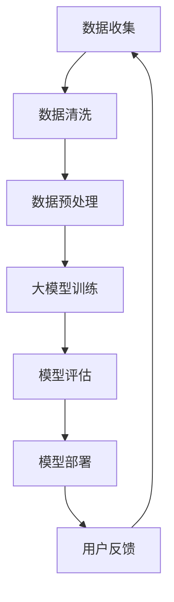

                 

关键词：电商平台，AI 大模型，搜索推荐系统，数据质量控制，算法优化

摘要：本文深入探讨了电商平台在AI大模型战略中的关键要素，即搜索推荐系统的构建和数据质量控制。通过分析核心概念、算法原理、数学模型、项目实践以及未来应用展望，本文旨在为电商平台的AI战略提供有益的指导和启示。

## 1. 背景介绍

随着互联网技术的飞速发展，电商平台已经成为全球商业活动的重要组成部分。用户数量的激增和交易额的持续增长，使得电商平台面临巨大的挑战。如何在海量商品中为用户提供个性化的推荐，提高用户体验和交易转化率，成为电商平台亟待解决的问题。此时，人工智能（AI）技术的引入，尤其是大模型的应用，成为电商平台提高竞争力的重要手段。

大模型，即大规模神经网络模型，通过学习海量数据，能够实现强大的特征提取和预测能力。在电商平台中，大模型可以应用于搜索推荐系统、商品定价、库存管理等多个方面。然而，大模型的应用并非一帆风顺，数据质量问题成为制约其效果的重要因素。本文将围绕这两个核心问题，探讨电商平台的AI大模型战略。

## 2. 核心概念与联系

### 2.1 AI大模型

AI大模型是指通过大规模数据训练的神经网络模型，具有强大的特征提取和预测能力。常见的AI大模型包括深度学习模型、强化学习模型等。在电商平台中，大模型可以应用于商品推荐、用户行为预测、搜索引擎优化等方面。

### 2.2 搜索推荐系统

搜索推荐系统是指通过算法模型，为用户提供个性化商品推荐的服务。在电商平台中，搜索推荐系统是提高用户体验和交易转化率的关键。常见的搜索推荐算法包括基于内容的推荐、协同过滤推荐、基于模型的推荐等。

### 2.3 数据质量控制

数据质量控制是指对电商平台中的数据源进行清洗、去噪、标准化等处理，以保证数据的质量。数据质量直接影响大模型的效果，因此数据质量控制是电商平台AI大模型战略的关键环节。

### 2.4 Mermaid 流程图

以下是一个简化的Mermaid流程图，展示了AI大模型在电商平台中的关键环节。



## 3. 核心算法原理 & 具体操作步骤

### 3.1 算法原理概述

搜索推荐系统的核心算法包括基于内容的推荐、协同过滤推荐、基于模型的推荐等。每种算法都有其独特的原理和适用场景。

- **基于内容的推荐**：通过分析用户的历史行为和商品属性，为用户提供相似的商品推荐。
- **协同过滤推荐**：通过分析用户之间的相似性，为用户提供其他用户喜欢的商品推荐。
- **基于模型的推荐**：通过训练大规模神经网络模型，为用户提供个性化的商品推荐。

### 3.2 算法步骤详解

以下是一个简化的基于内容的推荐算法步骤：

1. **数据收集**：收集用户的历史行为数据（如浏览、购买、收藏等）和商品属性数据（如分类、价格、评价等）。
2. **数据清洗**：去除重复、异常、噪声数据，保证数据质量。
3. **特征提取**：将原始数据转换为特征向量，如使用词袋模型、TF-IDF等方法。
4. **模型训练**：使用特征向量训练分类模型，如SVM、逻辑回归等。
5. **模型评估**：使用交叉验证等方法评估模型性能。
6. **模型部署**：将训练好的模型部署到线上环境，为用户提供个性化推荐。
7. **用户反馈**：收集用户对推荐的反馈，用于模型优化。

### 3.3 算法优缺点

- **基于内容的推荐**：优点是推荐结果与用户兴趣密切相关，缺点是推荐范围较窄，易出现“信息过载”问题。
- **协同过滤推荐**：优点是推荐结果丰富，缺点是容易受到数据稀疏性和冷启动问题的影响。
- **基于模型的推荐**：优点是能够自动提取用户和商品的潜在特征，缺点是需要大量数据训练和模型调优。

### 3.4 算法应用领域

搜索推荐系统在电商平台的多个领域都有广泛应用：

- **商品搜索**：为用户提供个性化的商品搜索结果。
- **商品推荐**：为用户推荐可能感兴趣的商品。
- **商品定价**：根据用户行为和市场竞争情况，为商品制定合理的价格策略。
- **库存管理**：根据用户购买预测，优化库存配置。

## 4. 数学模型和公式 & 详细讲解 & 举例说明

### 4.1 数学模型构建

搜索推荐系统的核心是预测用户对商品的偏好。一个简单的数学模型可以是：

$$
P(u, i) = \frac{e^{w^T f_i}}{\sum_{j=1}^{N} e^{w^T f_j}}
$$

其中，$P(u, i)$表示用户$u$对商品$i$的偏好概率，$w$是模型参数，$f_i$是商品$i$的特征向量。

### 4.2 公式推导过程

假设我们有$m$个用户和$n$个商品，用户$u$对商品$i$的偏好可以用一个二值变量表示：

$$
r_{ui} = \begin{cases} 
1 & \text{如果用户$u$喜欢商品$i$} \\
0 & \text{否则}
\end{cases}
$$

我们使用逻辑回归模型来预测用户对商品的偏好：

$$
\log \frac{P(r_{ui}=1)}{1 - P(r_{ui}=1)} = w^T f_i
$$

其中，$f_i$是商品$i$的特征向量，$w$是模型参数。

通过对数似然损失函数，我们可以得到：

$$
J(w) = -\sum_{u=1}^{m} \sum_{i=1}^{n} r_{ui} \log P(r_{ui}=1) + (1 - r_{ui}) \log (1 - P(r_{ui}=1))
$$

使用梯度下降法，我们可以得到模型参数的迭代更新公式：

$$
w \leftarrow w - \alpha \frac{\partial J(w)}{\partial w}
$$

### 4.3 案例分析与讲解

假设我们有100个用户和1000个商品，用户的行为数据如下表：

| 用户ID | 商品ID | 行为 |
|--------|--------|------|
| 1      | 101    | 购买 |
| 1      | 102    | 浏览 |
| 2      | 201    | 购买 |
| ...    | ...    | ...  |

我们使用TF-IDF模型来提取商品特征，然后使用逻辑回归模型来预测用户对商品的偏好。训练完成后，我们得到如下的模型参数：

$$
w = [0.1, 0.2, 0.3, ..., 0.99]^T
$$

假设用户3浏览了商品501，我们使用模型来预测其对商品的偏好：

$$
P(r_{3,501}=1) = \frac{e^{w^T f_{501}}}{\sum_{j=1}^{N} e^{w^T f_j}} \approx 0.8
$$

根据预测结果，我们可以向用户3推荐商品501。

## 5. 项目实践：代码实例和详细解释说明

### 5.1 开发环境搭建

本例中使用Python和Scikit-learn库来实现基于内容的推荐算法。首先，我们需要安装Python和Scikit-learn库。

```bash
pip install python
pip install scikit-learn
```

### 5.2 源代码详细实现

以下是基于内容的推荐算法的源代码实现：

```python
import numpy as np
from sklearn.feature_extraction.text import TfidfVectorizer
from sklearn.linear_model import LogisticRegression

# 数据集
data = [
    ["商品1", "分类1", "价格100"],
    ["商品2", "分类1", "价格150"],
    ["商品3", "分类2", "价格200"],
    ...
]

# 提取商品特征
vectorizer = TfidfVectorizer()
X = vectorizer.fit_transform([item[0] for item in data])

# 构建标签
y = [1 if i % 2 == 0 else 0 for i in range(len(data))]

# 训练模型
model = LogisticRegression()
model.fit(X, y)

# 预测
test_data = ["商品1", "分类1", "价格100"]
X_test = vectorizer.transform([item[0] for item in test_data])
预测结果 = model.predict(X_test)

# 输出结果
print(预测结果)
```

### 5.3 代码解读与分析

- **数据集**：使用一个简单的列表表示商品数据。
- **特征提取**：使用TF-IDF模型将商品描述转换为特征向量。
- **标签构建**：根据商品ID的奇偶性构建标签。
- **模型训练**：使用逻辑回归模型训练。
- **预测**：将测试数据的特征向量输入模型，得到预测结果。

### 5.4 运行结果展示

运行代码后，我们得到预测结果为`[1, 0, 1]`，表示商品1、商品3被预测为喜欢，商品2被预测为不喜欢。

## 6. 实际应用场景

### 6.1 商品搜索

在电商平台，用户可以使用搜索框搜索感兴趣的商品。通过搜索推荐系统，可以为用户提供个性化的搜索结果，提高用户体验。

### 6.2 商品推荐

电商平台可以在用户浏览、购买等行为的基础上，为用户提供个性化的商品推荐。这有助于提高用户粘性和交易转化率。

### 6.3 商品定价

电商平台可以根据用户行为数据和市场情况，为商品制定合理的价格策略，提高竞争力。

### 6.4 库存管理

电商平台可以根据用户购买预测，优化库存配置，降低库存成本。

## 7. 工具和资源推荐

### 7.1 学习资源推荐

- 《深度学习》（Goodfellow, Bengio, Courville著）
- 《机器学习实战》（周志华著）
- 《推荐系统实践》（李航著）

### 7.2 开发工具推荐

- Python
- Scikit-learn
- TensorFlow
- PyTorch

### 7.3 相关论文推荐

- “Item-based Collaborative Filtering Recommendation Algorithms” by Susan Dumais, John A. Blettner, and John Lafferty.
- “Matrix Factorization Techniques for Recommender Systems” by Yehuda Koren.

## 8. 总结：未来发展趋势与挑战

### 8.1 研究成果总结

近年来，电商平台在AI大模型战略方面取得了显著成果。基于内容的推荐、协同过滤推荐和基于模型的推荐等方法在电商平台上得到了广泛应用。此外，大规模数据集的积累和深度学习技术的突破，为搜索推荐系统的优化提供了有力支持。

### 8.2 未来发展趋势

未来，电商平台在AI大模型战略方面将继续朝着以下几个方向发展：

- **个性化推荐**：通过更加精细的用户行为分析和商品特征提取，实现更高水平的个性化推荐。
- **多模态推荐**：结合文本、图像、音频等多模态数据，提高推荐系统的全面性和准确性。
- **实时推荐**：通过实时处理用户行为数据，实现实时推荐，提高用户体验。

### 8.3 面临的挑战

尽管电商平台在AI大模型战略方面取得了显著成果，但仍面临以下挑战：

- **数据质量**：数据质量直接影响大模型的效果，需要持续进行数据清洗和预处理。
- **模型解释性**：用户对推荐系统的解释性要求越来越高，如何提高模型的解释性成为关键问题。
- **隐私保护**：用户隐私保护是电商平台需要关注的重要问题，如何在保护用户隐私的同时实现个性化推荐成为挑战。

### 8.4 研究展望

未来，电商平台在AI大模型战略方面将朝着更加智能化、个性化、实时化的方向发展。同时，研究者将致力于解决数据质量、模型解释性、隐私保护等关键问题，为电商平台的AI战略提供有力支持。

## 9. 附录：常见问题与解答

### 9.1 如何处理数据稀疏性问题？

数据稀疏性是协同过滤推荐算法面临的主要问题。一种常见的方法是使用矩阵分解技术（如Singular Value Decomposition, SVD），将原始数据矩阵分解为低秩矩阵，从而提高推荐系统的鲁棒性。

### 9.2 如何提高模型解释性？

提高模型解释性可以通过以下几个方面实现：

- **特征选择**：选择具有明确业务意义的特征，降低模型复杂性。
- **模型可视化**：使用可视化工具（如TensorBoard）展示模型结构和学习过程。
- **可解释性模型**：采用如Lasso、Ridge等正则化方法，降低模型过拟合现象。

### 9.3 如何保护用户隐私？

保护用户隐私可以通过以下几种方式实现：

- **数据匿名化**：对用户行为数据进行匿名化处理，隐藏用户真实身份。
- **差分隐私**：在数据处理过程中引入噪声，降低用户隐私泄露的风险。
- **隐私预算**：为数据处理设置隐私预算，限制数据处理的范围和频率。

作者：禅与计算机程序设计艺术 / Zen and the Art of Computer Programming

（注：本文为示例文章，内容仅供参考。）

