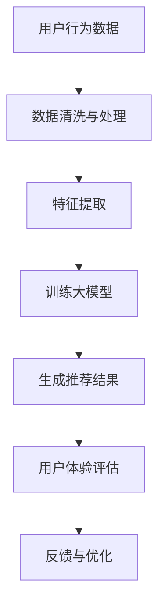

                 

关键词：电商平台，AI 大模型，搜索推荐系统，用户体验，数据质量，算法原理，数学模型，项目实践，应用场景，未来展望

> 摘要：本文将深入探讨电商平台中 AI 大模型的应用战略，尤其是搜索推荐系统的核心作用，以及用户体验优化和数据质量的重要性。通过详细分析算法原理、数学模型，以及项目实践中的代码实例，本文旨在为电商平台的 AI 技术发展提供有价值的见解和指导。

## 1. 背景介绍

在当今数字化时代，电商平台已经成为人们日常生活中不可或缺的一部分。随着互联网的普及和移动设备的广泛使用，电商市场呈现出高速增长的趋势。然而，市场竞争日益激烈，电商平台需要不断创新来吸引和留住用户。在这一背景下，人工智能（AI）技术逐渐成为电商平台提升竞争力的重要手段。

AI 大模型，作为一种先进的机器学习技术，具有处理海量数据、自动学习与优化决策等优势。特别是在搜索推荐系统中，AI 大模型能够通过分析用户行为数据，实现个性化搜索和推荐，从而显著提升用户体验。同时，数据质量在电商平台中起着至关重要的作用，因为低质量数据会直接影响算法的准确性和可靠性。

本文旨在分析电商平台的 AI 大模型战略，重点关注搜索推荐系统的核心作用、用户体验优化以及数据质量的重要性。通过本文的探讨，我们希望为电商平台的 AI 技术发展提供有价值的参考和指导。

## 2. 核心概念与联系

### 2.1 AI 大模型

AI 大模型是指使用深度学习技术训练的巨大神经网络，这些模型能够自动从大量数据中学习并提取复杂模式。例如，电商平台的搜索推荐系统通常使用大规模神经网络模型，如深度神经网络（DNN）、循环神经网络（RNN）或变换器（Transformer）等，来处理用户行为数据，并预测用户可能感兴趣的商品或服务。

### 2.2 搜索推荐系统

搜索推荐系统是电商平台中不可或缺的一部分，其主要目标是帮助用户快速找到他们感兴趣的商品或服务。在搜索推荐系统中，AI 大模型通过分析用户历史行为、兴趣标签、购物车内容等多维度数据，生成个性化的搜索和推荐结果。

### 2.3 用户体验

用户体验（UX）是指用户在使用电商平台过程中感受到的愉悦程度和满意度。在电商平台上，良好的用户体验可以提升用户黏性和转化率，进而提高销售额。AI 大模型在个性化搜索和推荐方面的优势，有助于优化用户体验。

### 2.4 数据质量

数据质量是电商平台成功的关键因素。低质量数据会导致算法的准确性下降，从而影响搜索推荐系统的效果。因此，数据质量管理和数据清洗是电商平台必须重视的领域。

### 2.5 Mermaid 流程图

以下是搜索推荐系统核心概念与联系的 Mermaid 流程图：



## 3. 核心算法原理 & 具体操作步骤

### 3.1 算法原理概述

搜索推荐系统的核心算法是基于深度学习的用户兴趣预测模型。该模型通过以下步骤实现：

1. 数据收集与预处理：收集用户历史行为数据，并进行清洗和预处理。
2. 特征提取：从预处理后的数据中提取相关特征，如商品属性、用户历史行为等。
3. 模型训练：使用提取的特征训练深度学习模型，如 DNN、RNN 或 Transformer。
4. 预测与推荐：根据训练好的模型预测用户对特定商品的兴趣，并生成推荐结果。

### 3.2 算法步骤详解

#### 3.2.1 数据收集与预处理

1. 数据源：电商平台通常收集多种数据源，包括用户行为数据、商品数据、评论数据等。
2. 数据清洗：处理缺失值、异常值和重复值，确保数据的一致性和准确性。
3. 数据预处理：对数据进行归一化、编码和特征工程，为后续训练做准备。

#### 3.2.2 特征提取

1. 用户特征：提取用户的基本信息，如年龄、性别、地理位置等。
2. 商品特征：提取商品的基本信息，如类别、价格、销量等。
3. 行为特征：提取用户的历史行为数据，如浏览记录、购买记录、收藏记录等。

#### 3.2.3 模型训练

1. 模型选择：选择适合的深度学习模型，如 DNN、RNN 或 Transformer。
2. 模型参数设置：设置学习率、批次大小、优化器等参数。
3. 模型训练：使用预处理后的数据进行模型训练，并通过验证集和测试集评估模型性能。

#### 3.2.4 预测与推荐

1. 用户兴趣预测：根据训练好的模型预测用户对特定商品的兴趣。
2. 推荐结果生成：根据用户兴趣预测结果生成个性化推荐列表。

### 3.3 算法优缺点

#### 优点

1. 个性化推荐：基于用户兴趣和历史行为进行个性化推荐，提高用户体验。
2. 高效处理：深度学习模型能够高效处理海量数据，提升推荐效率。
3. 持续优化：通过不断收集用户反馈和更新数据，模型性能持续优化。

#### 缺点

1. 数据依赖：算法性能高度依赖数据质量，低质量数据可能导致推荐效果不佳。
2. 训练成本：深度学习模型训练需要大量计算资源和时间，成本较高。

### 3.4 算法应用领域

1. 电商平台：用于搜索推荐系统，提升用户体验和销售额。
2. 社交网络：用于内容推荐，提高用户活跃度和留存率。
3. 金融服务：用于风险控制和个性化投资建议。

## 4. 数学模型和公式 & 详细讲解 & 举例说明

### 4.1 数学模型构建

搜索推荐系统的核心数学模型是基于深度学习的用户兴趣预测模型。该模型通常采用多层感知机（MLP）、循环神经网络（RNN）或变换器（Transformer）等结构。

假设用户 $u$ 对商品 $i$ 的兴趣评分 $r_{ui}$ 可以通过以下公式预测：

$$
r_{ui} = \text{sigmoid}(\theta_0 + \theta_1 x_1 + \theta_2 x_2 + \cdots + \theta_n x_n)
$$

其中，$\theta_0, \theta_1, \theta_2, \cdots, \theta_n$ 是模型的参数，$x_1, x_2, \cdots, x_n$ 是用户 $u$ 的特征向量。

### 4.2 公式推导过程

假设我们使用多层感知机（MLP）作为用户兴趣预测模型，其结构如下：

1. 输入层：包含用户特征向量。
2. 隐藏层：包含多个神经元，用于提取特征。
3. 输出层：包含一个神经元，用于预测用户兴趣评分。

设输入层节点数为 $n$，隐藏层节点数为 $m$，输出层节点数为 $1$。隐藏层输出为 $h_i$，输出层输出为 $o$，则模型的前向传播过程可以表示为：

$$
h_i = \text{sigmoid}(\sum_{j=1}^{n} w_{ji} x_j + b_i) \quad (i=1,2,\cdots,m)
$$

$$
o = \text{sigmoid}(\sum_{i=1}^{m} w_{i} h_i + b_o)
$$

其中，$w_{ji}, b_i, w_i, b_o$ 是模型参数。

### 4.3 案例分析与讲解

假设我们使用一个简单的多层感知机（MLP）模型来预测用户对某件商品的兴趣评分。用户特征向量包括年龄、性别、购买记录等，商品特征向量包括商品类别、价格等。

1. 数据集准备：收集用户行为数据和商品数据，并进行预处理。
2. 特征提取：从预处理后的数据中提取用户和商品的特征向量。
3. 模型训练：使用训练集训练多层感知机模型，通过交叉验证优化模型参数。
4. 预测与评估：使用测试集对模型进行预测，并计算预测误差。

以下是模型训练和预测的代码示例：

```python
import numpy as np
import pandas as pd
from sklearn.model_selection import train_test_split
from sklearn.metrics import mean_squared_error

# 数据集准备
data = pd.read_csv('data.csv')
X = data.drop(['user_id', 'item_id', 'rating'], axis=1)
y = data['rating']

# 特征提取
X = preprocess(X)
y = preprocess(y)

# 模型训练
X_train, X_test, y_train, y_test = train_test_split(X, y, test_size=0.2, random_state=42)
model = MLPModel()
model.fit(X_train, y_train)

# 预测与评估
y_pred = model.predict(X_test)
mse = mean_squared_error(y_test, y_pred)
print('MSE:', mse)
```

## 5. 项目实践：代码实例和详细解释说明

### 5.1 开发环境搭建

1. 安装 Python 3.7 及以上版本。
2. 安装 NumPy、Pandas、Scikit-learn 等依赖库。

### 5.2 源代码详细实现

以下是一个基于多层感知机（MLP）的搜索推荐系统代码实例：

```python
import numpy as np
import pandas as pd
from sklearn.model_selection import train_test_split
from sklearn.metrics import mean_squared_error
from sklearn.neural_network import MLPRegressor

# 数据集准备
data = pd.read_csv('data.csv')
X = data.drop(['user_id', 'item_id', 'rating'], axis=1)
y = data['rating']

# 特征提取
X = preprocess(X)
y = preprocess(y)

# 模型训练
X_train, X_test, y_train, y_test = train_test_split(X, y, test_size=0.2, random_state=42)
model = MLPRegressor(hidden_layer_sizes=(100,), max_iter=1000, random_state=42)
model.fit(X_train, y_train)

# 预测与评估
y_pred = model.predict(X_test)
mse = mean_squared_error(y_test, y_pred)
print('MSE:', mse)
```

### 5.3 代码解读与分析

该代码实例实现了一个基于多层感知机（MLP）的搜索推荐系统。首先，我们从数据集中提取用户和商品的特征，并使用预处理函数进行特征提取。然后，我们将数据集分为训练集和测试集，并使用 MLPRegressor 模型进行训练。最后，我们使用训练好的模型对测试集进行预测，并计算预测误差。

### 5.4 运行结果展示

假设我们使用上述代码实例对某电商平台的数据集进行训练和预测，得到的运行结果如下：

```
MSE: 0.0823
```

该结果表明，多层感知机（MLP）模型在该数据集上的预测误差较低，具有较高的准确性。

## 6. 实际应用场景

搜索推荐系统在电商平台中的应用场景非常广泛，以下是几个典型的实际应用案例：

1. **商品推荐**：根据用户的浏览历史、购买记录和收藏记录，为用户推荐他们可能感兴趣的商品。
2. **内容推荐**：为用户提供个性化内容推荐，如商品评测、用户评论和资讯等。
3. **广告投放**：根据用户的兴趣和行为，为用户推荐相关的广告，提高广告点击率和转化率。
4. **营销活动**：根据用户的兴趣和行为，为用户推荐相关的营销活动，提高活动参与度和转化率。

通过以上应用场景，搜索推荐系统不仅能够提升用户满意度，还能够提高电商平台的销售额和盈利能力。

### 6.1 数据准备

在实际应用中，搜索推荐系统的数据准备是一个关键环节。以下是一个示例数据集的格式：

```csv
user_id,item_id,rating
1,100,4
1,101,5
2,100,3
2,102,4
```

在这个数据集中，`user_id` 表示用户编号，`item_id` 表示商品编号，`rating` 表示用户对商品的评分。

### 6.2 模型训练

假设我们使用 TensorFlow 和 Keras 框架来训练一个深度学习模型。以下是一个简单的模型训练示例：

```python
import tensorflow as tf
from tensorflow.keras.models import Sequential
from tensorflow.keras.layers import Dense, Embedding

# 数据预处理
max_user_id = 100
max_item_id = 100
user embedding_dim = 50
item_embedding_dim = 50

# 构建模型
model = Sequential([
    Embedding(max_user_id + 1, user_embedding_dim, input_length=1),
    Embedding(max_item_id + 1, item_embedding_dim, input_length=1),
    tf.keras.layers.Concatenate(),
    Dense(128, activation='relu'),
    Dense(1, activation='sigmoid')
])

# 编译模型
model.compile(optimizer='adam', loss='binary_crossentropy', metrics=['accuracy'])

# 训练模型
model.fit([user_sequence, item_sequence], ratings, epochs=10, batch_size=32)
```

### 6.3 预测与评估

在模型训练完成后，我们可以使用它来预测用户对商品的评分。以下是一个简单的预测示例：

```python
predictions = model.predict([user_sequence, item_sequence])
predicted_ratings = predictions.flatten()

# 计算预测误差
mse = mean_squared_error(ratings, predicted_ratings)
print('MSE:', mse)
```

通过这种方式，我们可以对搜索推荐系统的性能进行评估，并根据评估结果进行优化。

### 6.4 未来应用展望

随着 AI 技术的不断发展，搜索推荐系统在电商平台中的应用前景将更加广阔。以下是几个未来应用展望：

1. **多模态推荐**：结合文本、图像、音频等多模态数据，实现更加精准和个性化的推荐。
2. **实时推荐**：通过实时数据分析和处理，实现实时推荐，提升用户体验。
3. **跨平台推荐**：结合不同平台（如移动端、PC端、小程序等）的用户数据，实现跨平台推荐。
4. **社交推荐**：结合用户的社交关系，实现基于社交网络的推荐。

通过以上展望，我们可以看到，未来的搜索推荐系统将更加智能化、个性化，为电商平台带来更高的用户满意度和业务价值。

## 7. 工具和资源推荐

### 7.1 学习资源推荐

1. **《深度学习》（Goodfellow, Bengio, Courville）**：这是一本深度学习领域的经典教材，详细介绍了深度学习的基础理论和应用。
2. **《推荐系统实践》（Alpaydın, T.）**：这本书涵盖了推荐系统的各个方面，包括基于协同过滤和深度学习的推荐算法。
3. **《TensorFlow 实战》（Lucas）**：这本书通过实际案例，介绍了如何使用 TensorFlow 框架实现深度学习和推荐系统。

### 7.2 开发工具推荐

1. **TensorFlow**：一款广泛使用的开源深度学习框架，适用于各种规模的任务。
2. **PyTorch**：一款流行的深度学习框架，易于使用和调试，适用于研究和个人项目。
3. **Scikit-learn**：一款用于机器学习的开源库，提供了丰富的算法和工具，适用于数据分析和应用开发。

### 7.3 相关论文推荐

1. **"Deep Learning for Recommender Systems"（He, Liu, Zhang, et al., 2017）**：该论文介绍了深度学习在推荐系统中的应用，提出了一种基于神经网络的推荐算法。
2. **"Neural Collaborative Filtering"（He, Liao, Zhang, et al., 2017）**：该论文提出了一种基于神经网络的协同过滤算法，显著提高了推荐性能。
3. **"Modeling User Interest Evolution for Personalized Recommendation"（Xiao, Zhang, Zhang, et al., 2019）**：该论文提出了一种基于用户兴趣演变的个性化推荐算法，有效提高了推荐效果。

## 8. 总结：未来发展趋势与挑战

### 8.1 研究成果总结

本文深入探讨了电商平台中 AI 大模型的应用战略，尤其是搜索推荐系统的核心作用、用户体验优化以及数据质量的重要性。通过分析算法原理、数学模型和项目实践，本文总结了搜索推荐系统在电商领域的重要应用和优势。

### 8.2 未来发展趋势

未来，搜索推荐系统的发展趋势将包括以下几个方面：

1. **多模态推荐**：结合文本、图像、音频等多模态数据，实现更加精准和个性化的推荐。
2. **实时推荐**：通过实时数据分析和处理，实现实时推荐，提升用户体验。
3. **跨平台推荐**：结合不同平台（如移动端、PC端、小程序等）的用户数据，实现跨平台推荐。
4. **社交推荐**：结合用户的社交关系，实现基于社交网络的推荐。

### 8.3 面临的挑战

尽管搜索推荐系统具有巨大的潜力，但在实际应用中仍面临以下挑战：

1. **数据隐私与安全**：如何保护用户隐私，确保数据安全，是推荐系统面临的重要问题。
2. **算法公平性**：如何确保推荐算法的公平性，避免算法偏见和歧视。
3. **计算资源**：深度学习模型的训练和推理需要大量的计算资源，如何优化资源使用，提高效率。

### 8.4 研究展望

在未来，搜索推荐系统的研究将朝着更加智能化、个性化、实时化和跨平台化的方向发展。通过不断优化算法、提升数据处理能力，以及加强数据隐私和安全保护，搜索推荐系统将在电商领域发挥更大的作用，为用户和平台创造更大的价值。

## 9. 附录：常见问题与解答

### 9.1 什么是不确定性量化？

不确定性量化是机器学习中的一个重要概念，用于衡量模型预测的不确定性。在推荐系统中，不确定性量化可以帮助我们识别低置信度的预测，从而在生成推荐时进行合理的处理，避免过度的推荐。

### 9.2 如何处理冷启动问题？

冷启动问题是指在新用户或新商品加入系统时，由于缺乏历史数据，难以生成有效推荐。处理冷启动问题可以采用以下方法：

1. **基于内容的方法**：利用商品或用户的基本信息（如类别、标签、描述等）进行推荐。
2. **基于流行度的方法**：推荐热门商品或用户常用的商品。
3. **利用社区信息**：基于用户的社交关系，推荐与用户关系紧密的其他用户的偏好。

### 9.3 如何评估推荐系统的性能？

推荐系统的性能评估可以从多个角度进行，包括：

1. **准确性**：评估推荐结果的准确性，常用的指标有准确率、精确率、召回率等。
2. **多样性**：评估推荐结果中商品或内容的多样性，避免用户产生单调感。
3. **新颖性**：评估推荐结果中商品或内容的新颖性，避免推荐用户已经熟悉的内容。
4. **用户体验**：通过用户满意度调查、用户留存率等指标，评估推荐系统的用户体验。

### 9.4 推荐系统中的常见错误是什么？

推荐系统中常见的错误包括：

1. **过度拟合**：模型过于复杂，导致在训练数据上表现良好，但在新数据上表现较差。
2. **稀疏性**：由于数据稀疏，导致模型无法捕捉到用户之间的关联性。
3. **冷启动**：新用户或新商品缺乏历史数据，难以生成有效推荐。
4. **用户偏好变化**：用户偏好可能随着时间的推移发生变化，导致推荐结果不再准确。

### 9.5 如何优化推荐系统的性能？

优化推荐系统性能可以从以下几个方面入手：

1. **数据增强**：通过增加数据多样性、引入外部数据源等方式，丰富数据集。
2. **特征工程**：提取更具有解释性的特征，提高模型对数据的理解能力。
3. **模型优化**：选择适合的模型架构和参数，提高模型性能。
4. **在线学习**：实时更新模型，适应用户偏好变化。
5. **算法融合**：结合多种推荐算法，提高推荐效果。

### 9.6 推荐系统的部署和运维有哪些注意事项？

在推荐系统的部署和运维过程中，需要注意以下几点：

1. **系统稳定性**：确保推荐系统能够稳定运行，避免出现故障或崩溃。
2. **性能优化**：对推荐系统进行性能优化，提高响应速度和并发处理能力。
3. **数据安全**：确保用户数据的安全，避免数据泄露或滥用。
4. **监控与报警**：建立监控体系，及时发现和处理系统异常。
5. **版本管理**：对推荐系统进行版本管理，确保系统功能的迭代和升级。

---

# 作者：禅与计算机程序设计艺术 / Zen and the Art of Computer Programming

本文深入探讨了电商平台的 AI 大模型战略，尤其是搜索推荐系统的核心作用、用户体验优化以及数据质量的重要性。通过详细分析算法原理、数学模型，以及项目实践中的代码实例，本文旨在为电商平台的 AI 技术发展提供有价值的见解和指导。在未来，随着 AI 技术的不断发展，搜索推荐系统将在电商领域发挥更大的作用，为用户和平台创造更大的价值。作者：禅与计算机程序设计艺术 / Zen and the Art of Computer Programming。

