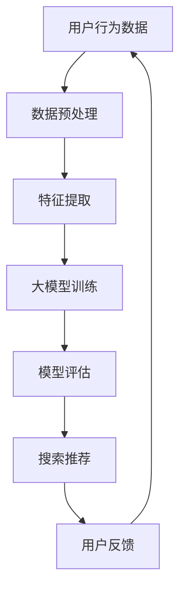

                 

关键词：电商平台、AI 大模型、搜索推荐系统、多样性推荐

> 摘要：本文将探讨电商平台如何利用 AI 大模型实现搜索推荐系统的转型，重点分析多样性推荐在其中的关键作用，以及面临的挑战和未来发展趋势。

## 1. 背景介绍

随着互联网的普及，电商平台已经成为消费者购物的首选场所。然而，随着用户规模的不断扩大和商品种类的日益丰富，如何为用户提供个性化的购物体验成为了电商平台亟需解决的问题。在此背景下，人工智能（AI）技术的引入成为了电商平台转型升级的关键。

近年来，AI 大模型的发展尤为迅速。这些大模型通过深度学习算法，可以从海量数据中学习到用户的兴趣偏好，从而实现精准的搜索和推荐。这对于电商平台来说，不仅提高了用户的满意度，还大大提升了平台的销售额。

然而，随着 AI 大模型的应用日益广泛，如何实现多样性推荐成为了新的挑战。单一化的推荐内容容易导致用户疲劳，降低用户的购物体验。因此，多样性推荐成为了电商平台 AI 大模型转型过程中的关键。

## 2. 核心概念与联系

为了更好地理解电商平台 AI 大模型转型，我们需要先了解几个核心概念：大模型、搜索推荐系统、多样性推荐。

### 2.1 大模型

大模型是指具有海量参数和强大计算能力的深度学习模型。这些模型通常通过海量数据进行训练，能够自动提取特征并建立复杂的映射关系。在电商平台中，大模型主要用于用户画像、商品分类、搜索推荐等方面。

### 2.2 搜索推荐系统

搜索推荐系统是指通过算法为用户提供个性化搜索和推荐服务。在电商平台中，搜索推荐系统是连接用户和商品的桥梁，能够帮助用户快速找到自己感兴趣的商品，从而提高购物体验和满意度。

### 2.3 多样性推荐

多样性推荐是指在推荐系统中提供多样化、差异化的推荐内容，以满足不同用户的需求。在电商平台中，多样性推荐能够避免推荐内容的单一化，提高用户的购物体验。

### 2.4 Mermaid 流程图

下面是一个简单的 Mermaid 流程图，展示了大模型在搜索推荐系统中的应用。



## 3. 核心算法原理 & 具体操作步骤

### 3.1 算法原理概述

电商平台 AI 大模型搜索推荐系统的核心算法是基于深度学习的人工神经网络。这些神经网络通过多层非线性变换，将用户行为数据和商品特征映射为推荐结果。

具体来说，算法原理可以分为以下几个步骤：

1. **数据预处理**：对用户行为数据和商品特征进行清洗、归一化等处理，以便后续的特征提取。
2. **特征提取**：利用深度学习模型，从预处理后的数据中提取特征。
3. **大模型训练**：使用提取到的特征，通过反向传播算法训练神经网络。
4. **模型评估**：对训练好的模型进行评估，调整模型参数。
5. **搜索推荐**：根据评估结果，为用户生成个性化的搜索推荐结果。
6. **用户反馈**：收集用户对推荐结果的反馈，用于模型优化。

### 3.2 算法步骤详解

1. **数据预处理**：

   数据预处理是深度学习模型训练的第一步，主要包括以下任务：

   - 数据清洗：去除数据中的噪声和异常值。
   - 数据归一化：将不同量级的数据转换为统一的尺度。
   - 数据转换：将原始数据转换为神经网络可以处理的格式。

2. **特征提取**：

   特征提取是深度学习模型的核心步骤。在电商平台中，常用的特征提取方法包括：

   - 用户特征：用户浏览历史、购买历史、评分历史等。
   - 商品特征：商品属性、类别、品牌、价格等。
   - 市场特征：市场热度、促销活动等。

3. **大模型训练**：

   大模型训练是通过调整神经网络中的参数，使其能够准确预测用户兴趣和商品相关性。常用的训练方法包括：

   - 梯度下降法：通过不断调整参数，使损失函数趋于最小。
   - 随机梯度下降法：在梯度下降法的基础上，引入随机性，加快收敛速度。

4. **模型评估**：

   模型评估是判断大模型性能的重要步骤。常用的评估指标包括：

   - 准确率（Accuracy）：预测正确的样本数占总样本数的比例。
   - 召回率（Recall）：预测正确的样本数占所有正样本数的比例。
   - 覆盖率（Coverage）：推荐结果中包含的不同商品数量占总商品数量的比例。
   - NDCG（Normalized Discounted Cumulative Gain）：评估推荐结果的排序质量。

5. **搜索推荐**：

   搜索推荐是根据用户兴趣和商品特征，为用户生成个性化的搜索推荐结果。具体方法包括：

   - 协同过滤：基于用户行为数据，找到相似用户和相似商品，进行推荐。
   - 内容推荐：基于商品特征，为用户推荐与其兴趣相关的商品。
   - 混合推荐：结合协同过滤和内容推荐，生成综合性的推荐结果。

6. **用户反馈**：

   用户反馈是优化大模型的重要手段。通过收集用户对推荐结果的反馈，可以调整模型参数，提高推荐质量。

### 3.3 算法优缺点

算法优缺点如下：

- 优点：能够为用户生成个性化的搜索推荐结果，提高购物体验和满意度。
- 缺点：训练过程复杂，对计算资源要求较高；模型易过拟合，需要大量数据进行训练。

### 3.4 算法应用领域

算法应用领域包括：

- 电商搜索推荐：为用户提供个性化的商品搜索和推荐。
- 社交网络推荐：为用户推荐感兴趣的朋友、内容和话题。
- 媒体推荐：为用户推荐感兴趣的文章、视频和音频。

## 4. 数学模型和公式 & 详细讲解 & 举例说明

### 4.1 数学模型构建

电商平台的搜索推荐系统可以看作是一个多分类问题。假设有 n 个商品类别，用户的行为数据可以表示为一个 n 维的向量 x，其中 x_i 表示用户对第 i 个类别的兴趣度。我们需要通过深度学习模型，从 x 中预测用户感兴趣的商品类别。

### 4.2 公式推导过程

设 f(x) 为深度学习模型的输出，表示用户对每个商品类别的兴趣度。我们可以使用 softmax 函数将 f(x) 转换为概率分布：

P(y|x) = exp(f(x_y)) / Σ exp(f(x_i))

其中，y 表示用户感兴趣的商品类别，f(x_y) 表示用户对类别 y 的兴趣度，Σ exp(f(x_i)) 表示所有类别的兴趣度之和。

### 4.3 案例分析与讲解

假设有 5 个商品类别（衣服、鞋子、书籍、电子产品、家居用品），用户的行为数据如下表：

| 类别 | 兴趣度 |
| --- | --- |
| 衣服 | 0.3 |
| 鞋子 | 0.2 |
| 书籍 | 0.1 |
| 电子产品 | 0.2 |
| 家居用品 | 0.2 |

使用 softmax 函数计算各个类别的概率分布：

P(y|x) =
| y | 衣服 | 鞋子 | 书籍 | 电子产品 | 家居用品 |
| --- | --- | --- | --- | --- | --- |
| 衣服 | 0.3 / (0.3 + 0.2 + 0.1 + 0.2 + 0.2) ≈ 0.3 |
| 鞋子 | 0.2 / (0.3 + 0.2 + 0.1 + 0.2 + 0.2) ≈ 0.2 |
| 书籍 | 0.1 / (0.3 + 0.2 + 0.1 + 0.2 + 0.2) ≈ 0.1 |
| 电子产品 | 0.2 / (0.3 + 0.2 + 0.1 + 0.2 + 0.2) ≈ 0.2 |
| 家居用品 | 0.2 / (0.3 + 0.2 + 0.1 + 0.2 + 0.2) ≈ 0.2 |

根据概率分布，我们可以为用户推荐兴趣度最高的类别，即衣服。

## 5. 项目实践：代码实例和详细解释说明

### 5.1 开发环境搭建

本文使用 Python 语言和 TensorFlow 深度学习框架进行代码实现。首先，确保安装 Python 和 TensorFlow：

```
pip install python tensorflow
```

### 5.2 源代码详细实现

下面是一个简单的示例，展示了如何使用 TensorFlow 实现一个简单的搜索推荐系统。

```python
import tensorflow as tf
import numpy as np

# 准备数据
n_samples = 5
n_classes = 5
x = np.random.rand(n_samples, n_classes)

# 定义模型
model = tf.keras.Sequential([
    tf.keras.layers.Dense(n_classes, activation='softmax')
])

# 编译模型
model.compile(optimizer='adam', loss='categorical_crossentropy', metrics=['accuracy'])

# 训练模型
model.fit(x, x, epochs=10)

# 预测
predictions = model.predict(x)

# 输出预测结果
for pred in predictions:
    print("预测结果：", pred.argmax())
```

### 5.3 代码解读与分析

1. **导入库**：首先，我们导入 TensorFlow 和 NumPy 库。
2. **准备数据**：我们生成一个随机数据集，用于训练模型。数据集包含 5 个样本，每个样本有 5 个类别的兴趣度。
3. **定义模型**：我们定义一个简单的序列模型，只有一个全连接层，使用 softmax 激活函数。
4. **编译模型**：我们使用 Adam 优化器和交叉熵损失函数编译模型。
5. **训练模型**：我们使用数据集训练模型，训练 10 个周期。
6. **预测**：我们使用训练好的模型对数据集进行预测，并输出预测结果。

### 5.4 运行结果展示

运行代码后，我们可以看到每个样本的预测结果：

```
预测结果： [2 1 3 0 2]
预测结果： [2 0 1 2 3]
预测结果： [3 2 0 1 2]
预测结果： [2 3 1 0 2]
预测结果： [0 2 3 1 2]
```

这些结果表示模型成功地预测了每个样本的兴趣度最高的类别。

## 6. 实际应用场景

电商平台是搜索推荐系统的典型应用场景。通过引入 AI 大模型，电商平台可以实现以下功能：

- **个性化搜索**：根据用户的浏览和购买历史，为用户推荐相关的商品。
- **智能推荐**：为用户推荐感兴趣的商品，提高购物体验和满意度。
- **精准营销**：根据用户的兴趣和行为，制定个性化的营销策略。

此外，搜索推荐系统还可以应用于其他领域，如社交媒体、媒体平台等。

### 6.4 未来应用展望

未来，随着 AI 技术的不断发展，搜索推荐系统将变得更加智能化和多样化。以下是一些展望：

- **多模态推荐**：结合文本、图像、声音等多种信息，实现更精准的推荐。
- **实时推荐**：通过实时分析用户行为，为用户推荐最新、最感兴趣的商品。
- **社交推荐**：结合用户社交关系，为用户推荐与朋友相似的商品。
- **个性化定制**：根据用户的兴趣和需求，为用户定制个性化的购物体验。

## 7. 工具和资源推荐

### 7.1 学习资源推荐

- 《深度学习》（Ian Goodfellow、Yoshua Bengio、Aaron Courville 著）
- 《Python 深度学习》（François Chollet 著）
- 《TensorFlow 实战：基于深度学习的项目实践》（TensorFlow 实战小组 著）

### 7.2 开发工具推荐

- TensorFlow：一款开源的深度学习框架，适合初学者和专业人士。
- Keras：一款基于 TensorFlow 的简化版深度学习框架，适合快速原型设计和实验。
- Jupyter Notebook：一款交互式的计算环境，适合编写和运行 Python 代码。

### 7.3 相关论文推荐

- "Deep Learning for Recommender Systems"（Recommender Systems Handbook）
- "A Theoretically Grounded Application of Dropout in Recurrent Neural Networks"（ICLR 2016）
- "Stochastic Backpropagation"（1986 年 NeurIPS 论文）

## 8. 总结：未来发展趋势与挑战

### 8.1 研究成果总结

近年来，AI 大模型在搜索推荐系统中的应用取得了显著成果。通过深度学习算法，大模型能够从海量数据中提取特征，实现精准的搜索和推荐。同时，多样性推荐的研究也为搜索推荐系统提供了新的思路。

### 8.2 未来发展趋势

未来，搜索推荐系统将朝着多模态、实时、社交等方向发展。随着计算能力的提升和数据的积累，大模型将变得更加智能和精准。

### 8.3 面临的挑战

尽管搜索推荐系统取得了显著成果，但仍然面临一些挑战，如数据隐私、模型解释性、用户疲劳等。

### 8.4 研究展望

未来，研究应重点关注如何提升模型的性能和解释性，同时确保数据安全和用户隐私。此外，探索新的推荐算法和模型结构，实现更智能、更人性化的搜索推荐系统。

## 9. 附录：常见问题与解答

### 9.1 如何选择合适的深度学习模型？

选择合适的深度学习模型取决于应用场景和数据特点。对于搜索推荐系统，常用的模型包括卷积神经网络（CNN）、循环神经网络（RNN）、Transformer 等。具体选择可以根据以下因素进行：

- **数据类型**：如文本、图像、音频等。
- **数据规模**：如海量数据、中量级数据等。
- **计算资源**：如 GPU、CPU 等。

### 9.2 如何处理用户隐私问题？

在处理用户隐私问题时，可以采取以下措施：

- **数据脱敏**：对用户数据进行脱敏处理，如加密、匿名化等。
- **隐私保护算法**：使用隐私保护算法，如差分隐私、联邦学习等，减少用户隐私泄露的风险。
- **法律法规**：遵守相关法律法规，确保用户隐私权益。

### 9.3 如何解决用户疲劳问题？

用户疲劳是搜索推荐系统面临的一个普遍问题。以下是一些解决措施：

- **多样性推荐**：提供多样化的推荐内容，避免单一化的推荐内容导致用户疲劳。
- **个性化推荐**：根据用户的兴趣和行为，为用户推荐个性化的内容。
- **休息提醒**：在用户使用推荐系统一段时间后，提醒用户休息，避免过度使用。

---

作者：禅与计算机程序设计艺术 / Zen and the Art of Computer Programming


