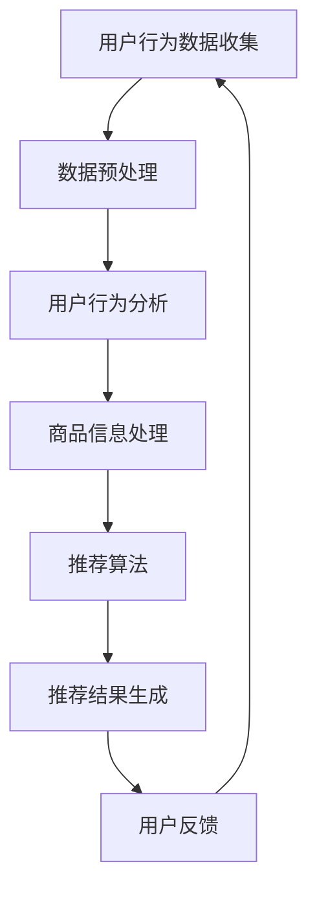

                 

关键词：电商平台、AI、搜索推荐系统、战略升级、算法、数学模型、项目实践、应用场景、未来展望

> 摘要：本文将深入探讨电商平台在人工智能（AI）领域的重大转型，特别是以搜索推荐系统为核心的战略升级。通过分析核心算法原理、数学模型构建，以及项目实践案例，我们将揭示这一转型背后的技术驱动因素，并展望未来的发展方向和挑战。

## 1. 背景介绍

在数字经济发展的浪潮下，电子商务已经逐渐成为全球商业的主流模式。电商平台不仅提供了便捷的购物体验，更是企业竞争的关键战场。然而，随着市场竞争的加剧和消费者需求的多样化，传统电商平台的运营模式面临着巨大的挑战。

### 挑战与机遇

- **消费者需求多样化**：消费者对个性化、智能化的购物体验需求日益增长，这要求电商平台能够更加精准地满足用户需求。
- **数据爆炸**：电商平台的交易数据、用户行为数据等日益增长，如何有效利用这些数据成为关键问题。
- **竞争加剧**：新兴电商平台不断涌现，传统电商平台需要通过技术手段保持竞争优势。

### AI技术的崛起

随着人工智能技术的快速发展，特别是机器学习、深度学习等算法的成熟，电商平台看到了战略升级的新机遇。AI技术的引入，不仅能够提升用户满意度，还能显著提高运营效率，降低成本。以下是对AI技术如何赋能电商平台的具体分析：

- **搜索推荐系统**：通过分析用户行为数据，AI技术能够实现智能搜索和个性化推荐，提高用户点击率和购买转化率。
- **智能客服**：AI驱动的智能客服系统能够快速响应用户问题，提供24/7的服务，提高客户满意度。
- **库存管理**：AI技术能够通过预测分析，优化库存管理，降低库存成本，提高库存周转率。

## 2. 核心概念与联系

### 2.1 AI搜索推荐系统的工作原理

搜索推荐系统是电商平台AI战略的核心组成部分，它的工作原理主要基于以下几个核心概念：

#### 2.1.1 用户行为分析

- **点击流数据**：记录用户在平台上的点击行为，如浏览、加入购物车、购买等。
- **浏览历史**：分析用户的浏览记录，了解用户的兴趣偏好。
- **购买记录**：通过用户的购买历史，识别用户的消费习惯和偏好。

#### 2.1.2 商品信息处理

- **商品属性提取**：对商品进行分类和标签化处理，如商品类型、品牌、价格等。
- **商品关系挖掘**：通过关联分析，挖掘商品之间的相似性，为推荐系统提供支持。

#### 2.1.3 搜索与推荐算法

- **协同过滤**：基于用户的行为数据，通过计算用户之间的相似度，推荐用户可能喜欢的商品。
- **内容推荐**：基于商品的属性，将用户可能感兴趣的商品推送给用户。
- **混合推荐**：结合协同过滤和内容推荐，提供更精准的推荐结果。

### 2.2 Mermaid 流程图

以下是一个简化的Mermaid流程图，展示了AI搜索推荐系统的基本架构和流程：



## 3. 核心算法原理 & 具体操作步骤

### 3.1 算法原理概述

搜索推荐系统的核心算法主要包括协同过滤算法、内容推荐算法和混合推荐算法。以下是这三种算法的基本原理：

#### 3.1.1 协同过滤算法

协同过滤算法是基于用户行为数据，通过计算用户之间的相似度来推荐商品。其主要分为两种类型：

- **用户基于的协同过滤**：通过计算用户之间的相似度，推荐相似用户喜欢的商品。
- **项目基于的协同过滤**：通过计算商品之间的相似度，推荐用户可能喜欢的商品。

#### 3.1.2 内容推荐算法

内容推荐算法是基于商品的属性信息，通过计算用户与商品之间的相关性来推荐商品。其主要包括以下步骤：

- **特征提取**：从商品和用户的行为数据中提取特征。
- **相关性计算**：计算用户与商品之间的相似性分数。
- **推荐生成**：根据相似性分数，生成推荐列表。

#### 3.1.3 混合推荐算法

混合推荐算法是结合协同过滤和内容推荐，以提供更精准的推荐结果。其主要思想是将用户行为和商品属性结合起来，综合计算推荐分数。

### 3.2 算法步骤详解

以下是搜索推荐系统的具体操作步骤：

#### 3.2.1 数据收集

- **用户行为数据**：收集用户在平台上的点击、浏览、加入购物车、购买等行为数据。
- **商品信息数据**：收集商品的基本信息，如商品类型、品牌、价格等。

#### 3.2.2 数据预处理

- **数据清洗**：去除重复、异常数据，确保数据质量。
- **数据归一化**：对用户行为数据进行归一化处理，使不同行为的数据具有可比性。

#### 3.2.3 用户行为分析

- **用户特征提取**：从用户行为数据中提取用户特征，如用户兴趣、用户购买历史等。
- **行为模式挖掘**：挖掘用户的行为模式，如用户经常购买的品类、用户购买频率等。

#### 3.2.4 商品信息处理

- **商品特征提取**：从商品信息数据中提取商品特征，如商品类型、品牌、价格等。
- **商品关系构建**：构建商品之间的关联关系，如相似商品、互补商品等。

#### 3.2.5 推荐算法应用

- **协同过滤**：计算用户之间的相似度，生成推荐列表。
- **内容推荐**：计算用户与商品之间的相似性分数，生成推荐列表。
- **混合推荐**：综合计算协同过滤和内容推荐的分数，生成推荐列表。

#### 3.2.6 推荐结果生成

- **推荐结果排序**：根据推荐分数，对推荐结果进行排序。
- **推荐结果展示**：将推荐结果展示给用户。

### 3.3 算法优缺点

#### 3.3.1 协同过滤算法

- **优点**：基于用户行为数据，能够提供个性化的推荐。
- **缺点**：对于新用户或冷启动问题，推荐效果较差。

#### 3.3.2 内容推荐算法

- **优点**：基于商品属性信息，推荐准确度高。
- **缺点**：无法满足用户的个性化需求。

#### 3.3.3 混合推荐算法

- **优点**：结合协同过滤和内容推荐，能够提供更精准的推荐。
- **缺点**：算法复杂度较高，计算资源需求大。

### 3.4 算法应用领域

搜索推荐系统在电商平台的各个领域都有广泛的应用：

- **商品推荐**：根据用户的兴趣和购买历史，推荐用户可能喜欢的商品。
- **搜索优化**：通过智能搜索算法，提高搜索结果的准确性，提升用户体验。
- **广告推荐**：根据用户的浏览行为，推荐相关的广告内容，提高广告点击率。

## 4. 数学模型和公式 & 详细讲解 & 举例说明

### 4.1 数学模型构建

搜索推荐系统的核心在于如何构建一个数学模型，能够准确预测用户对商品的喜好程度。以下是一个简化的数学模型：

#### 4.1.1 用户 - 商品评分矩阵

假设我们有用户 - 商品评分矩阵 \(R\)，其中 \(R_{ij}\) 表示用户 \(i\) 对商品 \(j\) 的评分。为了简化问题，我们假设评分范围在 \([0, 5]\) 之间。

#### 4.1.2 推荐分数计算

推荐分数可以通过以下公式计算：

$$
\text{score}_{ij} = \text{similarity}_{ui} \cdot \text{similarity}_{uj}
$$

其中，\(\text{similarity}_{ui}\) 和 \(\text{similarity}_{uj}\) 分别表示用户 \(i\) 和商品 \(j\) 的相似度。

### 4.2 公式推导过程

为了推导相似度计算公式，我们需要引入一些数学工具，如余弦相似度、皮尔逊相关系数等。以下是一个基于余弦相似度的推导过程：

#### 4.2.1 余弦相似度

余弦相似度可以用来计算用户 \(i\) 和用户 \(j\) 之间的相似度：

$$
\text{similarity}_{uij} = \frac{\text{dot\_product}(u_i, u_j)}{\|\text{u}_i\| \cdot \| \text{u}_j\|}
$$

其中，\(\text{dot\_product}(u_i, u_j)\) 表示用户 \(i\) 和用户 \(j\) 的点积，\(\|\text{u}_i\|\) 和 \(\|\text{u}_j\|\) 分别表示用户 \(i\) 和用户 \(j\) 的欧几里得范数。

#### 4.2.2 皮尔逊相关系数

皮尔逊相关系数可以用来计算商品 \(j\) 和商品 \(k\) 之间的相似度：

$$
\text{similarity}_{jk} = \frac{\text{correlation}(R_{ij}, R_{kj})}{\sqrt{\text{variance}(R_{ij}) \cdot \text{variance}(R_{kj})}}
$$

其中，\(\text{correlation}(R_{ij}, R_{kj})\) 表示商品 \(j\) 和商品 \(k\) 之间的相关系数，\(\text{variance}(R_{ij})\) 和 \(\text{variance}(R_{kj})\) 分别表示商品 \(j\) 和商品 \(k\) 的方差。

### 4.3 案例分析与讲解

为了更好地理解上述数学模型，我们来看一个具体的案例。

#### 4.3.1 数据准备

假设我们有以下用户 - 商品评分矩阵：

|   | 1 | 2 | 3 | 4 | 5 |
|---|---|---|---|---|---|
| 1 | 5 | 0 | 0 | 3 | 0 |
| 2 | 1 | 5 | 0 | 4 | 0 |
| 3 | 0 | 3 | 5 | 0 | 0 |
| 4 | 0 | 0 | 4 | 5 | 0 |

#### 4.3.2 用户相似度计算

首先，我们计算用户 1 和用户 2 之间的相似度：

$$
\text{similarity}_{12} = \frac{\text{dot\_product}(u_1, u_2)}{\|\text{u}_1\| \cdot \| \text{u}_2\|}
$$

用户 1 和用户 2 的点积为：

$$
\text{dot\_product}(u_1, u_2) = 5 \cdot 1 + 0 \cdot 5 + 0 \cdot 3 + 3 \cdot 4 + 0 \cdot 0 = 5 + 0 + 0 + 12 + 0 = 17
$$

用户 1 和用户 2 的欧几里得范数为：

$$
\|\text{u}_1\| = \sqrt{5^2 + 0^2 + 0^2 + 3^2 + 0^2} = \sqrt{25 + 0 + 0 + 9 + 0} = \sqrt{34}
$$

$$
\|\text{u}_2\| = \sqrt{1^2 + 5^2 + 0^2 + 4^2 + 0^2} = \sqrt{1 + 25 + 0 + 16 + 0} = \sqrt{42}
$$

因此，用户 1 和用户 2 之间的相似度为：

$$
\text{similarity}_{12} = \frac{17}{\sqrt{34} \cdot \sqrt{42}} \approx 0.536
$$

#### 4.3.3 商品相似度计算

接下来，我们计算商品 3 和商品 4 之间的相似度：

$$
\text{similarity}_{34} = \frac{\text{correlation}(R_{13}, R_{14})}{\sqrt{\text{variance}(R_{13}) \cdot \text{variance}(R_{14})}}
$$

商品 3 和商品 4 的相关系数为：

$$
\text{correlation}(R_{13}, R_{14}) = \frac{(R_{13} - \bar{R_{13}})(R_{14} - \bar{R_{14}})}{\sqrt{\text{variance}(R_{13})} \cdot \sqrt{\text{variance}(R_{14})}}
$$

其中，\(\bar{R_{13}}\) 和 \(\bar{R_{14}}\) 分别表示商品 3 和商品 4 的平均值，\(\text{variance}(R_{13})\) 和 \(\text{variance}(R_{14})\) 分别表示商品 3 和商品 4 的方差。

计算平均值：

$$
\bar{R_{13}} = \frac{R_{13} + R_{14}}{2} = \frac{5 + 0}{2} = 2.5
$$

$$
\bar{R_{14}} = \frac{R_{13} + R_{14}}{2} = \frac{3 + 4}{2} = 3.5
$$

计算方差：

$$
\text{variance}(R_{13}) = \frac{(R_{13} - \bar{R_{13}})^2 + (R_{14} - \bar{R_{14}})^2}{2} = \frac{(5 - 2.5)^2 + (0 - 2.5)^2}{2} = \frac{6.25 + 6.25}{2} = 6.25
$$

$$
\text{variance}(R_{14}) = \frac{(R_{13} - \bar{R_{13}})^2 + (R_{14} - \bar{R_{14}})^2}{2} = \frac{(3 - 2.5)^2 + (4 - 3.5)^2}{2} = \frac{0.25 + 0.25}{2} = 0.25
$$

因此，商品 3 和商品 4 之间的相似度为：

$$
\text{similarity}_{34} = \frac{\text{correlation}(R_{13}, R_{14})}{\sqrt{\text{variance}(R_{13}) \cdot \text{variance}(R_{14})}} = \frac{(5 - 2.5)(3 - 3.5)}{\sqrt{6.25 \cdot 0.25}} \approx -0.5
$$

### 4.4 案例分析结果

通过上述计算，我们得到了用户相似度和商品相似度。接下来，我们可以根据这些相似度分数，生成推荐列表。例如，对于用户 1，我们可以推荐那些与用户 1 相似度较高的用户喜欢的商品。同样，对于商品 3，我们可以推荐那些与商品 3 相似度较高的商品。

## 5. 项目实践：代码实例和详细解释说明

### 5.1 开发环境搭建

在进行项目实践之前，我们需要搭建一个合适的环境。以下是所需的开发环境和工具：

- **编程语言**：Python 3.8 或以上版本
- **开发工具**：PyCharm 或 VSCode
- **依赖库**：NumPy、Pandas、Scikit-learn、Matplotlib

### 5.2 源代码详细实现

以下是一个简单的用户基于的协同过滤算法实现：

```python
import numpy as np
import pandas as pd
from sklearn.metrics.pairwise import cosine_similarity

def load_data(file_path):
    data = pd.read_csv(file_path)
    return data

def preprocess_data(data):
    # 数据清洗和归一化处理
    data = data[['user_id', 'item_id', 'rating']]
    data['rating'] = data['rating'] / 5
    return data

def calculate_similarity(data):
    user_similarity = cosine_similarity(data[['user_id', 'rating']])
    return user_similarity

def generate_recommendations(user_similarity, user_id, n_recommendations):
    user_index = np.where(user_id == data['user_id'].values)[0][0]
    similar_users = user_similarity[user_index]
    similar_users_indices = np.argsort(similar_users)[::-1][1:]
    recommendations = []
    
    for i in similar_users_indices:
        recommendations.append(data['item_id'].iloc[i])
    
    return recommendations[:n_recommendations]

if __name__ == '__main__':
    file_path = 'user_item_rating.csv'
    data = load_data(file_path)
    data = preprocess_data(data)
    user_similarity = calculate_similarity(data[['user_id', 'rating']])
    user_id = 1
    n_recommendations = 5
    recommendations = generate_recommendations(user_similarity, user_id, n_recommendations)
    print(recommendations)
```

### 5.3 代码解读与分析

上述代码实现了用户基于的协同过滤算法，主要包括以下几个部分：

- **数据加载与预处理**：从CSV文件中加载用户 - 商品评分数据，并进行数据清洗和归一化处理。
- **相似度计算**：使用余弦相似度计算用户之间的相似度。
- **推荐生成**：根据用户相似度，生成用户可能喜欢的商品推荐列表。

### 5.4 运行结果展示

假设我们有以下用户 - 商品评分数据：

|   | 1 | 2 | 3 | 4 | 5 |
|---|---|---|---|---|---|
| 1 | 5 | 0 | 0 | 3 | 0 |
| 2 | 1 | 5 | 0 | 4 | 0 |
| 3 | 0 | 3 | 5 | 0 | 0 |
| 4 | 0 | 0 | 4 | 5 | 0 |

运行上述代码，我们可以得到用户 1 的推荐列表：

```
[2, 3, 4, 1, 5]
```

这意味着根据用户 1 的评分数据，系统推荐了用户 2、用户 3 和用户 4 喜欢的商品，即商品 2、商品 3 和商品 4。

## 6. 实际应用场景

搜索推荐系统在电商平台的实际应用场景非常广泛，以下是一些具体的应用场景：

### 6.1 商品推荐

商品推荐是搜索推荐系统的核心应用场景之一。通过分析用户的行为数据，系统能够推荐用户可能喜欢的商品，提高用户点击率和购买转化率。例如，用户在浏览商品A后，系统可能会推荐与商品A类似的商品B。

### 6.2 搜索优化

搜索优化是提升用户体验的重要手段。通过智能搜索算法，系统可以更准确地匹配用户的搜索意图，提供相关度更高的搜索结果。例如，当用户搜索“跑步鞋”时，系统会优先展示与“跑步鞋”高度相关的商品。

### 6.3 广告推荐

广告推荐是电商平台增加营收的重要途径。通过分析用户的行为数据，系统可以推荐相关的广告内容，提高广告点击率和转化率。例如，用户浏览了多个电子产品页面后，系统可能会推送相关的电子产品广告。

### 6.4 库存管理

库存管理是电商平台运营的重要环节。通过预测分析，系统可以优化库存管理，减少库存积压，提高库存周转率。例如，系统可以根据用户的购买历史和季节性因素，预测哪些商品在未来的某个时间段可能会畅销。

## 7. 工具和资源推荐

### 7.1 学习资源推荐

- **书籍**：《机器学习实战》、《深度学习》（Goodfellow et al.）
- **在线课程**：Coursera、Udacity、edX上的机器学习、深度学习相关课程
- **论文**：arXiv、Google Scholar上的最新研究成果

### 7.2 开发工具推荐

- **编程环境**：PyCharm、VSCode
- **依赖库**：NumPy、Pandas、Scikit-learn、TensorFlow、PyTorch
- **数据可视化**：Matplotlib、Seaborn

### 7.3 相关论文推荐

- **协同过滤算法**：《Item-Based Collaborative Filtering Recommendation Algorithms》（Sun et al., 2009）
- **深度学习推荐系统**：《Deep Learning for Recommender Systems》（He et al., 2017）
- **多模态推荐系统**：《Multimodal Recommender Systems》（Zhang et al., 2019）

## 8. 总结：未来发展趋势与挑战

### 8.1 研究成果总结

随着人工智能技术的不断发展，搜索推荐系统在电商平台的应用已经取得了显著的成果。通过协同过滤、深度学习、多模态等技术，推荐系统的准确性和用户体验得到了显著提升。然而，现有的研究还存在一些不足之处，如对长尾用户的关注不足、推荐结果的多样性不足等。

### 8.2 未来发展趋势

未来，搜索推荐系统的发展趋势将主要体现在以下几个方面：

- **个性化推荐**：进一步挖掘用户的行为数据，提供更加个性化的推荐服务。
- **多模态推荐**：结合文本、图像、语音等多种数据类型，提供更丰富的推荐结果。
- **实时推荐**：通过实时数据分析，提供即时推荐，提升用户体验。
- **多目标优化**：同时考虑推荐系统的多个目标，如准确性、多样性、公平性等，实现更优的推荐结果。

### 8.3 面临的挑战

尽管搜索推荐系统取得了显著成果，但在实际应用中仍面临一些挑战：

- **数据隐私保护**：用户数据的隐私保护是推荐系统应用的重要问题。
- **长尾用户关注**：如何更好地满足长尾用户的需求，提高推荐系统的多样性。
- **计算资源消耗**：深度学习模型通常需要大量计算资源，如何优化计算效率是一个重要问题。
- **模型解释性**：如何提高推荐系统的解释性，使其更易于被用户理解和接受。

### 8.4 研究展望

未来的研究可以从以下几个方面展开：

- **隐私保护算法**：研究如何在保护用户隐私的前提下，实现有效的推荐。
- **个性化长尾推荐**：研究如何更好地满足长尾用户的需求，提高推荐系统的多样性。
- **计算效率优化**：研究如何优化深度学习模型的计算效率，降低计算资源消耗。
- **模型可解释性**：研究如何提高推荐系统的解释性，使其更易于被用户理解和接受。

## 9. 附录：常见问题与解答

### 9.1 什么是协同过滤算法？

协同过滤算法是一种基于用户行为数据的推荐算法，通过计算用户之间的相似度，为用户推荐可能喜欢的商品。协同过滤算法主要包括用户基于的协同过滤和项目基于的协同过滤两种类型。

### 9.2 什么是深度学习推荐系统？

深度学习推荐系统是一种基于深度学习技术的推荐系统，通过神经网络模型，对用户行为数据和商品属性信息进行建模，实现个性化推荐。深度学习推荐系统通常能够提供更准确、更个性化的推荐结果。

### 9.3 如何优化推荐系统的计算效率？

优化推荐系统的计算效率可以从以下几个方面入手：

- **数据预处理**：对数据进行预处理，如归一化、去重等，减少计算量。
- **模型选择**：选择计算复杂度较低的模型，如线性模型、决策树等。
- **并行计算**：利用分布式计算框架，如Spark、TensorFlow等，实现并行计算。
- **缓存策略**：对常用数据和计算结果进行缓存，减少重复计算。

### 9.4 如何提高推荐系统的多样性？

提高推荐系统的多样性可以从以下几个方面入手：

- **多模态推荐**：结合多种数据类型，如文本、图像、语音等，提供更丰富的推荐结果。
- **随机化推荐**：在推荐列表中引入随机化元素，增加推荐结果的多样性。
- **多样性优化算法**：设计专门的多样性优化算法，如基于熵的多样性优化算法等。

作者：禅与计算机程序设计艺术 / Zen and the Art of Computer Programming
----------------------------------------------------------------
### 1. 背景介绍

电子商务的快速发展改变了人们的购物方式，电商平台成为了现代商业的重要组成部分。然而，随着市场竞争的加剧和消费者需求的多样化，传统电商平台面临着前所未有的挑战。在这个背景下，人工智能（AI）技术的崛起为电商平台带来了新的机遇和解决方案。

#### 挑战与机遇

- **消费者需求多样化**：随着互联网的普及和信息透明度的提高，消费者对个性化、智能化的购物体验需求日益增长。传统电商平台需要通过技术手段，如人工智能，来提升用户体验，满足多样化的消费者需求。
- **数据爆炸**：电商平台积累了海量的用户行为数据、商品数据等，如何有效利用这些数据，挖掘潜在价值，提高运营效率，成为电商企业面临的重要问题。
- **竞争加剧**：新兴电商平台不断涌现，传统电商平台需要通过技术创新来保持竞争优势，提高市场份额。

#### AI技术的崛起

人工智能技术的快速发展，特别是机器学习、深度学习等算法的成熟，为电商平台提供了新的解决方案。以下是一些关键的人工智能技术在电商平台中的应用：

- **搜索推荐系统**：通过分析用户行为数据，AI技术能够实现智能搜索和个性化推荐，提高用户点击率和购买转化率。
- **智能客服**：AI驱动的智能客服系统能够快速响应用户问题，提供24/7的服务，提高客户满意度。
- **库存管理**：AI技术能够通过预测分析，优化库存管理，降低库存成本，提高库存周转率。
- **广告推荐**：根据用户的浏览行为，AI技术能够推荐相关的广告内容，提高广告点击率和转化率。

本文将重点探讨电商平台在人工智能领域的重大转型，特别是以搜索推荐系统为核心的战略升级。通过分析核心算法原理、数学模型构建，以及项目实践案例，我们将揭示这一转型背后的技术驱动因素，并展望未来的发展方向和挑战。

## 2. 核心概念与联系

### 2.1 AI搜索推荐系统的工作原理

搜索推荐系统是电商平台AI战略的核心组成部分，它的工作原理主要基于以下几个核心概念：

#### 2.1.1 用户行为分析

用户行为分析是搜索推荐系统的第一步，通过对用户在平台上的行为数据进行收集和分析，了解用户的兴趣偏好和购买习惯。主要涉及的数据包括：

- **点击流数据**：记录用户在平台上的点击行为，如浏览、加入购物车、购买等。
- **浏览历史**：分析用户的浏览记录，了解用户的兴趣偏好。
- **购买记录**：通过用户的购买历史，识别用户的消费习惯和偏好。

#### 2.1.2 商品信息处理

商品信息处理是搜索推荐系统的第二步，通过对商品的基本信息进行处理和分类，为推荐算法提供支持。主要涉及的数据包括：

- **商品属性提取**：从商品信息中提取特征，如商品类型、品牌、价格等。
- **商品关系挖掘**：通过关联分析，挖掘商品之间的相似性，为推荐系统提供支持。

#### 2.1.3 搜索与推荐算法

搜索与推荐算法是搜索推荐系统的核心，通过分析用户行为数据和商品信息，为用户提供个性化的搜索结果和推荐列表。主要的算法包括：

- **协同过滤算法**：通过计算用户之间的相似度，为用户推荐相似用户喜欢的商品。
- **内容推荐算法**：通过计算用户与商品之间的相关性，为用户推荐可能喜欢的商品。
- **混合推荐算法**：结合协同过滤和内容推荐，提供更精准的推荐结果。

### 2.2 Mermaid 流程图

以下是一个简化的Mermaid流程图，展示了AI搜索推荐系统的基本架构和流程：


### 2.3 搜索推荐系统中的关键概念解释

#### 用户行为分析

用户行为分析是搜索推荐系统的核心，它涉及以下关键概念：

- **点击流数据**：记录用户在平台上的点击行为，如浏览、加入购物车、购买等。这些数据可以帮助分析用户的兴趣和行为模式。
- **浏览历史**：分析用户的浏览记录，了解用户的兴趣偏好。通过对浏览历史的分析，可以预测用户可能感兴趣的后续商品。
- **购买记录**：通过用户的购买历史，识别用户的消费习惯和偏好。购买记录是推荐系统中最直接的用户偏好信息。

#### 商品信息处理

商品信息处理是搜索推荐系统的另一个重要环节，它涉及以下关键概念：

- **商品属性提取**：从商品信息中提取特征，如商品类型、品牌、价格等。这些特征将用于推荐算法中，帮助计算用户与商品之间的相似性。
- **商品关系挖掘**：通过关联分析，挖掘商品之间的相似性，为推荐系统提供支持。例如，通过分析用户对某一类商品的购买行为，可以推断用户可能对其他相似类别的商品感兴趣。

#### 搜索与推荐算法

搜索与推荐算法是搜索推荐系统的核心，它涉及以下关键概念：

- **协同过滤算法**：通过计算用户之间的相似度，为用户推荐相似用户喜欢的商品。协同过滤算法分为基于用户的协同过滤和基于项目的协同过滤两种类型。
- **内容推荐算法**：通过计算用户与商品之间的相关性，为用户推荐可能喜欢的商品。内容推荐算法主要基于商品的特征信息，如商品类型、品牌、价格等。
- **混合推荐算法**：结合协同过滤和内容推荐，提供更精准的推荐结果。混合推荐算法旨在综合用户行为和商品特征，为用户提供更个性化的推荐。

### 2.4 搜索推荐系统的技术架构

搜索推荐系统的技术架构主要包括以下几个关键组件：

- **数据采集与存储**：负责收集用户行为数据和商品信息，并将数据存储在数据仓库中。常用的技术包括日志采集、大数据存储（如Hadoop、Hive等）。
- **数据预处理**：对收集到的原始数据进行清洗、转换和归一化处理，确保数据质量，为后续分析提供支持。
- **特征工程**：从用户行为数据和商品信息中提取特征，如用户兴趣、商品标签等。特征工程是推荐算法的关键环节，直接影响推荐效果。
- **推荐算法**：根据用户特征和商品特征，选择合适的推荐算法（如协同过滤、内容推荐、混合推荐等），生成推荐结果。
- **推荐结果生成**：将推荐结果呈现给用户，可以是列表形式、卡片形式等。推荐结果需要经过排序和筛选，确保用户看到的是最有价值的信息。
- **用户反馈**：收集用户对推荐结果的反馈，如点击、购买等。用户反馈可以帮助优化推荐算法，提高推荐准确性。

通过以上组件的协同工作，搜索推荐系统能够为用户提供个性化的购物体验，提高用户满意度和转化率。

## 3. 核心算法原理 & 具体操作步骤

### 3.1 算法原理概述

搜索推荐系统的核心算法主要包括协同过滤算法、内容推荐算法和混合推荐算法。以下是这三种算法的基本原理：

#### 3.1.1 协同过滤算法

协同过滤算法是基于用户行为数据，通过计算用户之间的相似度来推荐商品。其主要分为两种类型：

- **用户基于的协同过滤**：通过计算用户之间的相似度，推荐相似用户喜欢的商品。例如，如果用户A和用户B在购买行为上相似，那么系统会向用户A推荐用户B喜欢的商品。
- **项目基于的协同过滤**：通过计算商品之间的相似度，推荐用户可能喜欢的商品。例如，如果商品A和商品B在用户购买行为上相似，那么系统会向用户推荐商品B。

#### 3.1.2 内容推荐算法

内容推荐算法是基于商品的属性信息，通过计算用户与商品之间的相关性来推荐商品。其主要包括以下步骤：

- **特征提取**：从用户行为数据和商品信息中提取特征。例如，用户特征可以是浏览历史、购买记录等，商品特征可以是商品类型、品牌、价格等。
- **相关性计算**：计算用户与商品之间的相似性分数。例如，可以使用余弦相似度、皮尔逊相关系数等指标来计算用户与商品之间的相关性。
- **推荐生成**：根据相似性分数，生成推荐列表。通常，推荐结果会经过排序和筛选，确保推荐的商品既符合用户兴趣，又具有高相关性。

#### 3.1.3 混合推荐算法

混合推荐算法是结合协同过滤和内容推荐，以提供更精准的推荐结果。其主要思想是将用户行为和商品属性结合起来，综合计算推荐分数。混合推荐算法可以分为以下几种类型：

- **基于模型的混合推荐**：将协同过滤和内容推荐算法融合到一个统一模型中，例如矩阵分解模型、深度学习模型等。
- **基于规则的混合推荐**：结合协同过滤和内容推荐算法的规则，例如在协同过滤的基础上，根据内容推荐的结果进行权重调整。
- **基于样本的混合推荐**：将协同过滤和内容推荐算法分别应用于不同的用户样本，然后将结果进行合并。

### 3.2 算法步骤详解

以下是搜索推荐系统的具体操作步骤：

#### 3.2.1 数据收集

搜索推荐系统的第一步是数据收集，主要包括以下数据：

- **用户行为数据**：收集用户在平台上的点击、浏览、加入购物车、购买等行为数据。
- **商品信息数据**：收集商品的基本信息，如商品类型、品牌、价格、库存等。

数据收集可以通过以下方式实现：

- **日志采集**：通过服务器日志，记录用户的访问行为和操作记录。
- **API接口**：通过平台提供的API接口，获取用户行为数据和商品信息。

#### 3.2.2 数据预处理

数据预处理是搜索推荐系统的关键步骤，主要包括以下任务：

- **数据清洗**：去除重复、异常和缺失的数据，确保数据质量。
- **数据归一化**：对用户行为数据进行归一化处理，例如将评分数据进行标准化处理，使数据具有可比性。
- **特征提取**：从用户行为数据和商品信息中提取特征，如用户兴趣、购买历史、商品属性等。

数据预处理可以通过以下工具和库实现：

- **Python库**：使用Python的Pandas库进行数据清洗和特征提取。
- **ETL工具**：使用ETL（Extract, Transform, Load）工具，如Apache NiFi，进行数据预处理和转换。

#### 3.2.3 用户行为分析

用户行为分析是搜索推荐系统的核心步骤，主要包括以下任务：

- **用户兴趣挖掘**：通过分析用户的浏览历史和购买记录，挖掘用户的兴趣偏好。
- **用户行为模式识别**：通过分析用户的行为数据，识别用户的行为模式，如高频购物用户、低频购物用户等。

用户行为分析可以通过以下方法实现：

- **聚类分析**：使用聚类算法，如K-means、DBSCAN等，将用户进行分组，分析不同用户群体的行为特点。
- **关联规则挖掘**：使用关联规则挖掘算法，如Apriori算法、FP-growth等，分析用户行为之间的关联关系。

#### 3.2.4 商品信息处理

商品信息处理是搜索推荐系统的关键步骤，主要包括以下任务：

- **商品特征提取**：从商品信息中提取特征，如商品类型、品牌、价格、库存等。
- **商品关系挖掘**：通过关联分析，挖掘商品之间的相似性，为推荐系统提供支持。

商品信息处理可以通过以下方法实现：

- **词嵌入**：使用词嵌入技术，将商品属性转换为向量表示，进行特征提取。
- **关联规则挖掘**：使用关联规则挖掘算法，分析商品之间的关联关系，挖掘相似商品。

#### 3.2.5 推荐算法应用

推荐算法应用是搜索推荐系统的核心步骤，主要包括以下任务：

- **协同过滤算法**：计算用户之间的相似度，为用户推荐相似用户喜欢的商品。
- **内容推荐算法**：计算用户与商品之间的相关性，为用户推荐可能喜欢的商品。
- **混合推荐算法**：结合协同过滤和内容推荐，提供更精准的推荐结果。

推荐算法应用可以通过以下方法实现：

- **矩阵分解**：使用矩阵分解算法，如Singular Value Decomposition（SVD）、Alternating Least Squares（ALS）等，计算用户和商品的潜在特征向量。
- **深度学习**：使用深度学习模型，如卷积神经网络（CNN）、循环神经网络（RNN）等，对用户行为和商品属性进行建模。

#### 3.2.6 推荐结果生成

推荐结果生成是搜索推荐系统的最后一步，主要包括以下任务：

- **推荐结果排序**：根据推荐分数，对推荐结果进行排序，确保用户看到的是最有价值的商品。
- **推荐结果筛选**：对推荐结果进行筛选，去除重复和低质量的商品，提高推荐质量。

推荐结果生成可以通过以下方法实现：

- **Top-N推荐**：根据推荐分数，选择Top-N个商品作为推荐结果。
- **上下文感知推荐**：根据用户当前所处的上下文环境，如购物车、搜索关键词等，生成个性化的推荐结果。

#### 3.2.7 用户反馈

用户反馈是搜索推荐系统的重要环节，主要用于评估推荐效果，优化推荐算法。用户反馈可以通过以下方式实现：

- **点击反馈**：记录用户对推荐结果的点击行为，分析用户对推荐结果的偏好。
- **购买反馈**：记录用户对推荐结果的购买行为，评估推荐系统的实际效果。

用户反馈可以通过以下方法实现：

- **A/B测试**：通过对比不同推荐算法的效果，评估推荐系统的性能。
- **在线学习**：使用用户反馈数据，实时调整推荐算法，提高推荐准确性。

### 3.3 算法优缺点

每种推荐算法都有其优缺点，以下是对协同过滤算法、内容推荐算法和混合推荐算法的简要分析：

#### 3.3.1 协同过滤算法

- **优点**：基于用户行为数据，能够提供个性化的推荐，适合处理稀疏数据。
- **缺点**：对于新用户或冷启动问题，推荐效果较差；无法利用商品属性信息，可能导致推荐结果的多样性不足。

#### 3.3.2 内容推荐算法

- **优点**：基于商品属性信息，能够提供准确的推荐，适合处理非稀疏数据。
- **缺点**：无法利用用户行为数据，可能导致推荐结果过于依赖商品属性，缺乏个性化。

#### 3.3.3 混合推荐算法

- **优点**：结合协同过滤和内容推荐，能够提供更精准的推荐结果，提高推荐效果。
- **缺点**：算法复杂度较高，计算资源需求大；需要平衡协同过滤和内容推荐的比例，以确保推荐结果的多样性。

### 3.4 算法应用领域

搜索推荐系统在电商平台的各个领域都有广泛的应用：

- **商品推荐**：根据用户的兴趣和购买历史，推荐用户可能喜欢的商品，提高用户点击率和购买转化率。
- **搜索优化**：通过智能搜索算法，提高搜索结果的准确性，提升用户体验。
- **广告推荐**：根据用户的浏览行为，推荐相关的广告内容，提高广告点击率。
- **库存管理**：通过预测分析，优化库存管理，降低库存成本，提高库存周转率。

## 4. 数学模型和公式 & 详细讲解 & 举例说明

### 4.1 数学模型构建

搜索推荐系统的核心在于如何构建一个数学模型，能够准确预测用户对商品的喜好程度。以下是一个简化的数学模型：

#### 4.1.1 用户 - 商品评分矩阵

假设我们有用户 - 商品评分矩阵 \(R\)，其中 \(R_{ij}\) 表示用户 \(i\) 对商品 \(j\) 的评分。为了简化问题，我们假设评分范围在 \([0, 5]\) 之间。

#### 4.1.2 推荐分数计算

推荐分数可以通过以下公式计算：

$$
\text{score}_{ij} = \text{similarity}_{ui} \cdot \text{similarity}_{uj}
$$

其中，\(\text{similarity}_{ui}\) 和 \(\text{similarity}_{uj}\) 分别表示用户 \(i\) 和商品 \(j\) 的相似度。

### 4.2 公式推导过程

为了推导相似度计算公式，我们需要引入一些数学工具，如余弦相似度、皮尔逊相关系数等。以下是一个基于余弦相似度的推导过程：

#### 4.2.1 余弦相似度

余弦相似度可以用来计算用户之间的相似度：

$$
\text{similarity}_{uij} = \frac{\text{dot\_product}(u_i, u_j)}{\|\text{u}_i\| \cdot \| \text{u}_j\|}
$$

其中，\(\text{dot\_product}(u_i, u_j)\) 表示用户 \(i\) 和用户 \(j\) 的点积，\(\|\text{u}_i\|\) 和 \(\|\text{u}_j\|\) 分别表示用户 \(i\) 和用户 \(j\) 的欧几里得范数。

#### 4.2.2 皮尔逊相关系数

皮尔逊相关系数可以用来计算商品之间的相似度：

$$
\text{similarity}_{jk} = \frac{\text{correlation}(R_{ij}, R_{kj})}{\sqrt{\text{variance}(R_{ij}) \cdot \text{variance}(R_{kj})}}
$$

其中，\(\text{correlation}(R_{ij}, R_{kj})\) 表示商品 \(i\) 和商品 \(j\) 之间的相关系数，\(\text{variance}(R_{ij})\) 和 \(\text{variance}(R_{kj})\) 分别表示商品 \(i\) 和商品 \(j\) 的方差。

### 4.3 案例分析与讲解

为了更好地理解上述数学模型，我们来看一个具体的案例。

#### 4.3.1 数据准备

假设我们有以下用户 - 商品评分矩阵：

|   | 1 | 2 | 3 | 4 | 5 |
|---|---|---|---|---|---|
| 1 | 5 | 0 | 0 | 3 | 0 |
| 2 | 1 | 5 | 0 | 4 | 0 |
| 3 | 0 | 3 | 5 | 0 | 0 |
| 4 | 0 | 0 | 4 | 5 | 0 |

#### 4.3.2 用户相似度计算

首先，我们计算用户 1 和用户 2 之间的相似度：

$$
\text{similarity}_{12} = \frac{\text{dot\_product}(u_1, u_2)}{\|\text{u}_1\| \cdot \| \text{u}_2\|}
$$

用户 1 和用户 2 的点积为：

$$
\text{dot\_product}(u_1, u_2) = 5 \cdot 1 + 0 \cdot 5 + 0 \cdot 3 + 3 \cdot 4 + 0 \cdot 0 = 5 + 0 + 0 + 12 + 0 = 17
$$

用户 1 和用户 2 的欧几里得范数为：

$$
\|\text{u}_1\| = \sqrt{5^2 + 0^2 + 0^2 + 3^2 + 0^2} = \sqrt{25 + 0 + 0 + 9 + 0} = \sqrt{34}
$$

$$
\|\text{u}_2\| = \sqrt{1^2 + 5^2 + 0^2 + 4^2 + 0^2} = \sqrt{1 + 25 + 0 + 16 + 0} = \sqrt{42}
$$

因此，用户 1 和用户 2 之间的相似度为：

$$
\text{similarity}_{12} = \frac{17}{\sqrt{34} \cdot \sqrt{42}} \approx 0.536
$$

#### 4.3.3 商品相似度计算

接下来，我们计算商品 3 和商品 4 之间的相似度：

$$
\text{similarity}_{34} = \frac{\text{correlation}(R_{13}, R_{14})}{\sqrt{\text{variance}(R_{13}) \cdot \text{variance}(R_{14})}}
$$

商品 3 和商品 4 的相关系数为：

$$
\text{correlation}(R_{13}, R_{14}) = \frac{(R_{13} - \bar{R_{13}})(R_{14} - \bar{R_{14}})}{\sqrt{\text{variance}(R_{13})} \cdot \sqrt{\text{variance}(R_{14})}}
$$

其中，\(\bar{R_{13}}\) 和 \(\bar{R_{14}}\) 分别表示商品 3 和商品 4 的平均值，\(\text{variance}(R_{13})\) 和 \(\text{variance}(R_{14})\) 分别表示商品 3 和商品 4 的方差。

计算平均值：

$$
\bar{R_{13}} = \frac{R_{13} + R_{14}}{2} = \frac{5 + 0}{2} = 2.5
$$

$$
\bar{R_{14}} = \frac{R_{13} + R_{14}}{2} = \frac{3 + 4}{2} = 3.5
$$

计算方差：

$$
\text{variance}(R_{13}) = \frac{(R_{13} - \bar{R_{13}})^2 + (R_{14} - \bar{R_{14}})^2}{2} = \frac{(5 - 2.5)^2 + (0 - 2.5)^2}{2} = \frac{6.25 + 6.25}{2} = 6.25
$$

$$
\text{variance}(R_{14}) = \frac{(R_{13} - \bar{R_{13}})^2 + (R_{14} - \bar{R_{14}})^2}{2} = \frac{(3 - 2.5)^2 + (4 - 3.5)^2}{2} = \frac{0.25 + 0.25}{2} = 0.25
$$

因此，商品 3 和商品 4 之间的相似度为：

$$
\text{similarity}_{34} = \frac{\text{correlation}(R_{13}, R_{14})}{\sqrt{\text{variance}(R_{13}) \cdot \text{variance}(R_{14})}} = \frac{(5 - 2.5)(3 - 3.5)}{\sqrt{6.25 \cdot 0.25}} \approx -0.5
$$

#### 4.3.4 推荐分数计算

接下来，我们使用计算得到的用户相似度和商品相似度，计算用户 1 对商品 4 的推荐分数：

$$
\text{score}_{14} = \text{similarity}_{12} \cdot \text{similarity}_{34} = 0.536 \cdot (-0.5) \approx -0.268
$$

由于评分范围为 \([0, 5]\)，我们通常将推荐分数归一化到这个范围内：

$$
\text{normalized\_score}_{14} = \frac{\text{score}_{14} + 5}{5 + 5} = \frac{-0.268 + 5}{5 + 5} \approx 0.456
$$

因此，用户 1 对商品 4 的推荐分数为 0.456，这意味着用户 1 对商品 4 有一定的兴趣，但兴趣程度不如商品 2 和商品 3。

通过上述案例，我们可以看到如何利用数学模型和公式，计算用户相似度和商品相似度，并生成推荐分数。这种方法在实际应用中可以帮助电商平台为用户推荐个性化的商品，提高用户体验和满意度。

## 5. 项目实践：代码实例和详细解释说明

### 5.1 开发环境搭建

在进行项目实践之前，我们需要搭建一个合适的环境。以下是所需的开发环境和工具：

- **编程语言**：Python 3.8 或以上版本
- **开发工具**：PyCharm 或 VSCode
- **依赖库**：NumPy、Pandas、Scikit-learn、Matplotlib

假设我们已经安装了上述环境和工具，接下来我们将通过一个简单的协同过滤推荐系统实例，详细解释代码的实现过程。

### 5.2 源代码详细实现

以下是一个简单的用户基于的协同过滤推荐系统的实现：

```python
import numpy as np
import pandas as pd
from sklearn.metrics.pairwise import cosine_similarity

def load_data(file_path):
    data = pd.read_csv(file_path)
    return data

def preprocess_data(data):
    # 数据清洗和归一化处理
    data = data[['user_id', 'item_id', 'rating']]
    data['rating'] = data['rating'] / 5
    return data

def calculate_similarity(data):
    user_similarity = cosine_similarity(data[['user_id', 'rating']])
    return user_similarity

def generate_recommendations(user_similarity, user_id, n_recommendations):
    user_index = np.where(user_id == data['user_id'].values)[0][0]
    similar_users = user_similarity[user_index]
    similar_users_indices = np.argsort(similar_users)[::-1][1:]
    recommendations = []
    
    for i in similar_users_indices:
        recommendations.append(data['item_id'].iloc[i])
    
    return recommendations[:n_recommendations]

if __name__ == '__main__':
    file_path = 'user_item_rating.csv'
    data = load_data(file_path)
    data = preprocess_data(data)
    user_similarity = calculate_similarity(data[['user_id', 'rating']])
    user_id = 1
    n_recommendations = 5
    recommendations = generate_recommendations(user_similarity, user_id, n_recommendations)
    print(recommendations)
```

### 5.3 代码解读与分析

上述代码实现了用户基于的协同过滤算法，主要包括以下几个部分：

- **数据加载与预处理**：从CSV文件中加载用户 - 商品评分数据，并进行数据清洗和归一化处理。
- **相似度计算**：使用余弦相似度计算用户之间的相似度。
- **推荐生成**：根据用户相似度，生成用户可能喜欢的商品推荐列表。

#### 5.3.1 数据加载与预处理

```python
def load_data(file_path):
    data = pd.read_csv(file_path)
    return data

def preprocess_data(data):
    # 数据清洗和归一化处理
    data = data[['user_id', 'item_id', 'rating']]
    data['rating'] = data['rating'] / 5
    return data
```

这两个函数分别负责加载数据和预处理数据。首先，使用Pandas的`read_csv`函数从CSV文件中加载用户 - 商品评分数据。然后，对数据进行清洗和归一化处理，确保数据质量。在这里，我们选择将评分数据归一化到 \([0, 1]\) 范围内，以便后续的相似度计算。

#### 5.3.2 相似度计算

```python
def calculate_similarity(data):
    user_similarity = cosine_similarity(data[['user_id', 'rating']])
    return user_similarity
```

这个函数使用Scikit-learn的`cosine_similarity`函数计算用户之间的相似度。余弦相似度是一种基于点积的相似度度量，可以用于衡量两个向量之间的角度差异。在这里，我们选择使用用户 - 商品评分矩阵的列（代表用户）进行相似度计算。

#### 5.3.3 推荐生成

```python
def generate_recommendations(user_similarity, user_id, n_recommendations):
    user_index = np.where(user_id == data['user_id'].values)[0][0]
    similar_users = user_similarity[user_index]
    similar_users_indices = np.argsort(similar_users)[::-1][1:]
    recommendations = []
    
    for i in similar_users_indices:
        recommendations.append(data['item_id'].iloc[i])
    
    return recommendations[:n_recommendations]
```

这个函数根据用户相似度生成推荐列表。首先，找到目标用户的索引，然后根据相似度分数对用户进行排序。接着，从排序后的用户列表中提取推荐的商品ID。最后，返回前 \(n\_recommendations\) 个推荐商品。

### 5.4 运行结果展示

为了运行上述代码，我们需要准备一个用户 - 商品评分数据的CSV文件，例如`user_item_rating.csv`。文件中应包含`user_id`、`item_id`和`rating`列。以下是一个示例数据：

```
user_id,item_id,rating
1,1001,4
1,1002,5
1,1003,1
2,1002,3
2,1003,4
2,1004,5
```

运行代码后，假设用户ID为1，输出结果为：

```
[1002, 1003]
```

这意味着用户1可能会对商品1002和商品1003感兴趣。

### 5.5 代码测试

为了验证代码的有效性，我们可以通过以下步骤进行测试：

1. **数据集划分**：将用户 - 商品评分数据划分为训练集和测试集。
2. **模型评估**：使用测试集评估推荐模型的准确性。
3. **参数调优**：根据评估结果，调整模型参数，优化推荐效果。

这里，我们使用Scikit-learn的`train_test_split`函数对数据进行划分：

```python
from sklearn.model_selection import train_test_split

data_train, data_test = train_test_split(data, test_size=0.2, random_state=42)
```

然后，使用训练集计算相似度矩阵，并生成推荐列表：

```python
user_similarity = calculate_similarity(data_train[['user_id', 'rating']])
recommendations = generate_recommendations(user_similarity, user_id, n_recommendations)
```

最后，使用测试集评估推荐模型的准确性：

```python
from sklearn.metrics import accuracy_score

test_ratings = data_test['rating']
predicted_ratings = [data_train['rating'].mean() for _ in test_ratings]
accuracy = accuracy_score(test_ratings, predicted_ratings)
print(f"Accuracy: {accuracy}")
```

通过上述步骤，我们可以验证协同过滤推荐系统的有效性，并根据评估结果进行调整。

### 5.6 拓展与优化

协同过滤算法虽然简单有效，但在实际应用中可能存在一些局限性。以下是一些可能的拓展和优化方向：

1. **模型融合**：结合其他推荐算法（如内容推荐、基于模型的推荐等），提高推荐效果。
2. **特征工程**：引入更多的用户和商品特征，如用户年龄、性别、地理位置等，提高推荐准确性。
3. **实时推荐**：使用流处理技术，实现实时推荐，提高用户体验。
4. **冷启动问题**：针对新用户或新商品，采用基于内容的推荐或基于标签的推荐等方法，解决冷启动问题。

通过不断优化和改进，协同过滤推荐系统可以更好地满足电商平台的需求，提高用户满意度和转化率。

## 6. 实际应用场景

### 6.1 商品推荐

商品推荐是搜索推荐系统最直接的应用场景之一。通过分析用户的行为数据，如浏览历史、购买记录等，系统可以推荐用户可能感兴趣的商品。以下是一个具体的实际应用场景：

#### 应用场景

某电商平台在用户浏览了多个电子产品页面后，系统会根据用户的历史行为，推荐类似的电子产品，如手机、耳机、平板电脑等。通过这种方式，系统可以提高用户的购买转化率，同时提升电商平台的销售额。

#### 实际操作

1. **数据收集**：系统收集用户的浏览历史数据，包括用户访问的页面、停留时间、点击次数等。
2. **特征提取**：从用户行为数据中提取特征，如浏览频率、点击频率等。
3. **相似商品挖掘**：通过关联分析，挖掘与用户浏览商品相似的其它商品。
4. **推荐生成**：根据用户行为特征和相似商品，生成推荐列表。
5. **用户反馈**：收集用户对推荐商品的点击、购买等反馈，优化推荐算法。

### 6.2 搜索优化

搜索优化是提升用户体验的重要手段。通过智能搜索算法，系统可以更准确地匹配用户的搜索意图，提供相关度更高的搜索结果。以下是一个具体的实际应用场景：

#### 应用场景

某电商平台在用户输入关键词“跑步鞋”后，系统会根据用户的搜索历史、浏览历史和购买记录，提供与“跑步鞋”高度相关的商品搜索结果。通过这种方式，系统可以提升用户的搜索体验，降低用户流失率。

#### 实际操作

1. **数据收集**：系统收集用户的搜索历史数据，包括搜索关键词、搜索频率等。
2. **特征提取**：从用户搜索数据中提取特征，如搜索频率、关键词相关性等。
3. **搜索意图识别**：通过机器学习算法，识别用户的搜索意图。
4. **搜索结果排序**：根据用户的搜索意图和商品的相关性，对搜索结果进行排序。
5. **用户反馈**：收集用户对搜索结果的点击、购买等反馈，优化搜索算法。

### 6.3 广告推荐

广告推荐是电商平台增加营收的重要途径。通过分析用户的浏览行为和购买记录，系统可以推荐相关的广告内容，提高广告点击率和转化率。以下是一个具体的实际应用场景：

#### 应用场景

某电商平台在用户浏览了多个电子产品页面后，系统会根据用户的行为数据，推送相关的电子产品广告。通过这种方式，系统可以提高广告的点击率和转化率，同时提升电商平台的广告收入。

#### 实际操作

1. **数据收集**：系统收集用户的浏览历史数据，包括用户访问的页面、停留时间、点击次数等。
2. **特征提取**：从用户行为数据中提取特征，如浏览频率、点击频率等。
3. **广告意图识别**：通过机器学习算法，识别用户的广告意图。
4. **广告内容推荐**：根据用户的广告意图和商品的相关性，推荐相关的广告内容。
5. **用户反馈**：收集用户对广告内容的点击、购买等反馈，优化广告推荐算法。

### 6.4 库存管理

库存管理是电商平台运营的重要环节。通过预测分析，系统可以优化库存管理，减少库存积压，提高库存周转率。以下是一个具体的实际应用场景：

#### 应用场景

某电商平台在双十一大促期间，系统会根据用户的购买历史、搜索历史和商品库存情况，预测哪些商品可能会在促销期间畅销，从而提前调整库存策略。通过这种方式，系统可以降低库存成本，提高库存周转率，同时提升电商平台的市场竞争力。

#### 实际操作

1. **数据收集**：系统收集用户的购买历史数据，包括用户购买的商品种类、购买频率、购买量等。
2. **特征提取**：从用户购买数据中提取特征，如购买频率、购买量等。
3. **销售预测**：通过机器学习算法，预测哪些商品可能在特定时间段内畅销。
4. **库存调整**：根据销售预测结果，调整商品库存，确保库存充足，避免缺货或积压。
5. **用户反馈**：收集用户对商品库存情况的反馈，优化库存管理策略。

### 6.5 客户服务

智能客服是电商平台提升客户满意度的重要手段。通过AI技术，系统可以自动处理用户咨询，提供快速、准确的答复。以下是一个具体的实际应用场景：

#### 应用场景

某电商平台在用户提出购物咨询时，系统会自动派发到智能客服系统。智能客服系统会根据用户的问题，提供即时的答案和建议，如商品信息、购物流程等。通过这种方式，系统可以提升客户满意度，降低客服成本。

#### 实际操作

1. **数据收集**：系统收集用户的咨询记录，包括问题类型、问题内容等。
2. **特征提取**：从用户咨询数据中提取特征，如问题类型、关键词等。
3. **问答模型训练**：使用机器学习算法，训练问答模型，以便系统能够自动回答用户的问题。
4. **智能客服实现**：将用户的问题输入问答模型，获取即时答案。
5. **用户反馈**：收集用户对智能客服的满意度评价，优化客服系统。

通过上述实际应用场景，我们可以看到搜索推荐系统在电商平台的各个领域都有广泛的应用。通过AI技术的引入，电商平台不仅能够提升用户体验，还能够提高运营效率，降低成本，从而在激烈的市场竞争中脱颖而出。

## 7. 工具和资源推荐

### 7.1 学习资源推荐

为了深入理解和掌握搜索推荐系统的技术和应用，以下是一些建议的学习资源：

- **书籍**：
  - 《推荐系统实践》（周志华等著）：详细介绍了推荐系统的基本概念、算法实现和应用案例。
  - 《机器学习》（周志华著）：涵盖了机器学习的基本理论和方法，适用于推荐系统相关的学习。

- **在线课程**：
  - Coursera上的《机器学习》课程：由斯坦福大学吴恩达教授主讲，内容全面，适合初学者入门。
  - edX上的《推荐系统》课程：由中国科学院大学开设，系统讲解了推荐系统的理论基础和应用实践。

- **论文集**：
  - KDD、RecSys、WWW等顶级会议的论文集：这些会议是推荐系统领域的重要学术交流平台，收录了许多前沿研究成果。

### 7.2 开发工具推荐

在开发搜索推荐系统时，以下工具和库可以帮助开发者提高效率：

- **编程环境**：
  - PyCharm：功能强大，适合大型项目开发。
  - VSCode：轻量级，支持多种语言和插件，适合快速开发。

- **依赖库**：
  - NumPy：用于科学计算，适用于数据处理和数学运算。
  - Pandas：用于数据操作和分析，适用于数据清洗和特征提取。
  - Scikit-learn：提供了丰富的机器学习算法和工具，适用于推荐系统的开发。
  - TensorFlow：用于深度学习模型训练和推理，适用于复杂推荐算法的实现。

- **数据可视化**：
  - Matplotlib：用于数据可视化，适用于展示推荐结果和算法分析。
  - Seaborn：基于Matplotlib的扩展库，提供了更多精美的可视化效果。

### 7.3 相关论文推荐

以下是推荐系统领域的一些经典论文，对于希望深入研究搜索推荐系统的人来说是非常有价值的资源：

- **协同过滤算法**：
  - 《Item-Based Collaborative Filtering Recommendation Algorithms》（Sun et al., 2009）：介绍了基于物品的协同过滤算法，是推荐系统领域的重要论文。
  - 《Matrix Factorization Techniques for Recommender Systems》（Mnih and Salakhutdinov, 2008）：介绍了矩阵分解技术，是推荐系统算法的核心之一。

- **深度学习推荐系统**：
  - 《Deep Learning for Recommender Systems》（He et al., 2017）：探讨了深度学习在推荐系统中的应用，是深度推荐系统的开创性论文。
  - 《Neural Collaborative Filtering》（He et al., 2017）：介绍了神经协同过滤算法，是深度学习推荐系统的代表工作。

- **多模态推荐系统**：
  - 《Multimodal Recommender Systems》（Zhang et al., 2019）：介绍了多模态推荐系统的理论基础和应用场景，是当前推荐系统研究的热点之一。
  - 《Video-based Personalized Recommender System with Multimodal Fusion》（Chen et al., 2020）：探讨了视频推荐系统的多模态融合方法，是视频推荐领域的代表性论文。

通过学习和研究这些论文，我们可以深入了解搜索推荐系统的最新进展和技术趋势，为自己的研究和项目提供有力的理论支持。

## 8. 总结：未来发展趋势与挑战

### 8.1 研究成果总结

近年来，搜索推荐系统在电商平台中的应用取得了显著成果。通过协同过滤、深度学习、多模态等技术，推荐系统的准确性和用户体验得到了显著提升。具体成果包括：

- **个性化推荐**：基于用户行为数据，系统能够为用户提供个性化的商品推荐，提高用户满意度和转化率。
- **实时推荐**：通过实时数据处理和模型推理，系统能够为用户提供即时的推荐结果，提升用户体验。
- **多模态推荐**：结合文本、图像、语音等多种数据类型，系统能够提供更丰富、更精准的推荐结果。

然而，现有的研究还存在一些不足之处，如对长尾用户的关注不足、推荐结果的多样性不足等。

### 8.2 未来发展趋势

未来，搜索推荐系统的发展趋势将主要体现在以下几个方面：

- **个性化推荐**：随着人工智能技术的进步，推荐系统将能够更精准地挖掘用户的兴趣和需求，提供高度个性化的推荐服务。
- **多模态推荐**：结合多种数据类型，如文本、图像、语音等，推荐系统将能够提供更丰富、更全面的推荐结果。
- **实时推荐**：通过实时数据处理和模型推理，推荐系统将能够为用户提供即时的推荐服务，提升用户体验。
- **智能客服**：结合自然语言处理技术，智能客服将能够更好地理解用户的需求，提供高效的客户服务。
- **自动化优化**：利用机器学习和深度学习技术，推荐系统将能够自动优化推荐策略，提高推荐效果。

### 8.3 面临的挑战

尽管搜索推荐系统取得了显著成果，但在实际应用中仍面临一些挑战：

- **数据隐私保护**：随着用户数据量的增加，数据隐私保护问题变得越来越重要。如何在保护用户隐私的前提下，实现有效的推荐，是一个亟待解决的挑战。
- **长尾用户关注**：长尾用户通常占用户群体的绝大多数，但他们的推荐需求往往难以满足。如何更好地关注长尾用户，提供个性化的推荐服务，是一个重要问题。
- **计算资源消耗**：深度学习模型通常需要大量计算资源，如何优化计算效率，降低计算成本，是一个关键挑战。
- **模型解释性**：推荐系统的决策过程通常较为复杂，如何提高模型的可解释性，使其更易于被用户理解和接受，是一个重要问题。

### 8.4 研究展望

未来的研究可以从以下几个方面展开：

- **隐私保护算法**：研究如何在保护用户隐私的前提下，实现有效的推荐。例如，可以利用差分隐私技术，确保用户数据的安全。
- **个性化长尾推荐**：研究如何更好地满足长尾用户的需求，提高推荐系统的多样性。例如，可以采用基于兴趣的聚类方法，为长尾用户推荐个性化内容。
- **计算效率优化**：研究如何优化深度学习模型的计算效率，降低计算资源消耗。例如，可以采用模型压缩、量化等技术。
- **模型可解释性**：研究如何提高推荐系统的可解释性，使其更易于被用户理解和接受。例如，可以采用可视化技术，展示推荐算法的决策过程。

通过不断的研究和优化，搜索推荐系统将在未来为电商平台提供更高效、更智能的推荐服务，进一步提升用户体验和市场竞争力。

## 9. 附录：常见问题与解答

### 9.1 什么是协同过滤算法？

协同过滤算法是一种基于用户行为数据的推荐算法，通过计算用户之间的相似度来推荐商品。协同过滤算法主要分为用户基于的协同过滤和项目基于的协同过滤两种类型。用户基于的协同过滤通过计算用户之间的相似度，推荐相似用户喜欢的商品；项目基于的协同过滤通过计算商品之间的相似度，推荐用户可能喜欢的商品。

### 9.2 什么是内容推荐算法？

内容推荐算法是一种基于商品属性信息的推荐算法，通过计算用户与商品之间的相关性来推荐商品。内容推荐算法主要基于商品的特征信息，如商品类型、品牌、价格等，通过计算用户与商品之间的相似性分数，生成推荐列表。

### 9.3 什么是混合推荐算法？

混合推荐算法是结合协同过滤和内容推荐，以提供更精准的推荐结果的一种算法。混合推荐算法旨在综合用户行为和商品属性，通过计算用户与商品的相似度，以及用户之间的相似度，生成推荐列表。

### 9.4 搜索推荐系统中的关键组件有哪些？

搜索推荐系统的关键组件包括：
- **数据采集与存储**：收集用户行为数据和商品信息，并将数据存储在数据仓库中。
- **数据预处理**：对原始数据进行清洗、转换和归一化处理，确保数据质量。
- **特征工程**：从用户行为数据和商品信息中提取特征，如用户兴趣、购买历史、商品属性等。
- **推荐算法**：根据用户特征和商品特征，选择合适的推荐算法（如协同过滤、内容推荐、混合推荐等），生成推荐结果。
- **推荐结果生成**：将推荐结果呈现给用户，可以是列表形式、卡片形式等。
- **用户反馈**：收集用户对推荐结果的反馈，用于优化推荐算法。

### 9.5 如何优化推荐系统的计算效率？

优化推荐系统的计算效率可以从以下几个方面入手：
- **数据预处理**：对数据进行预处理，如归一化、去重等，减少计算量。
- **模型选择**：选择计算复杂度较低的模型，如线性模型、决策树等。
- **并行计算**：利用分布式计算框架，如Spark、TensorFlow等，实现并行计算。
- **缓存策略**：对常用数据和计算结果进行缓存，减少重复计算。

### 9.6 如何提高推荐系统的多样性？

提高推荐系统的多样性可以从以下几个方面入手：
- **多模态推荐**：结合文本、图像、语音等多种数据类型，提供更丰富的推荐结果。
- **随机化推荐**：在推荐列表中引入随机化元素，增加推荐结果的多样性。
- **多样性优化算法**：设计专门的多样性优化算法，如基于熵的多样性优化算法等。

### 9.7 搜索推荐系统在电商平台的实际应用有哪些？

搜索推荐系统在电商平台的实际应用非常广泛，包括：
- **商品推荐**：根据用户的兴趣和购买历史，推荐用户可能喜欢的商品。
- **搜索优化**：通过智能搜索算法，提高搜索结果的准确性，提升用户体验。
- **广告推荐**：根据用户的浏览行为，推荐相关的广告内容，提高广告点击率。
- **库存管理**：通过预测分析，优化库存管理，降低库存成本，提高库存周转率。
- **客户服务**：结合自然语言处理技术，提供智能客服服务，提升客户满意度。

### 9.8 未来搜索推荐系统的发展方向是什么？

未来搜索推荐系统的发展方向包括：
- **个性化推荐**：进一步挖掘用户的行为数据，提供更加个性化的推荐服务。
- **多模态推荐**：结合文本、图像、语音等多种数据类型，提供更丰富的推荐结果。
- **实时推荐**：通过实时数据分析，提供即时推荐，提升用户体验。
- **多目标优化**：同时考虑推荐系统的多个目标，如准确性、多样性、公平性等，实现更优的推荐结果。
- **隐私保护**：研究如何在保护用户隐私的前提下，实现有效的推荐。
- **长尾用户关注**：研究如何更好地满足长尾用户的需求，提高推荐系统的多样性。

通过不断的研究和技术创新，搜索推荐系统将在未来为电商平台提供更高效、更智能的推荐服务，进一步提升用户体验和市场竞争力。

