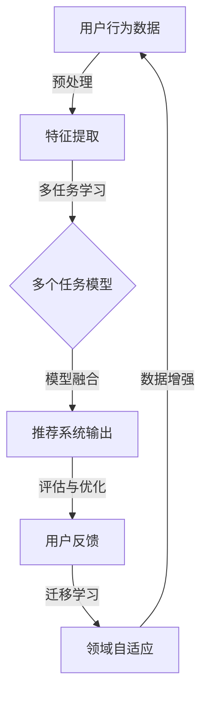

                 

关键词：电商推荐系统、多任务学习、迁移学习、协同过滤、神经网络、用户行为分析、商品属性、个性化推荐

## 摘要

随着电子商务的迅猛发展，电商推荐系统已成为提升用户体验、增加销售转化率的关键技术。本文将深入探讨电商推荐系统中多任务学习和迁移学习的重要性，分析其与传统协同过滤算法的差异，并详细阐述其在电商推荐中的应用策略。通过数学模型与具体算法的讲解，本文旨在为读者提供一种系统化的电商推荐系统设计与优化方法。

## 1. 背景介绍

### 电商推荐系统的需求

电商推荐系统是电子商务平台的重要组成部分，其核心目标是通过分析用户行为数据，向用户推荐可能感兴趣的商品，从而提高用户满意度、提升销售额。随着用户数据的爆炸式增长，传统单任务学习算法在处理大规模数据、应对复杂用户需求方面显得力不从心。因此，多任务学习和迁移学习技术逐渐成为电商推荐系统研究的热点。

### 多任务学习的定义

多任务学习（Multi-Task Learning，MTL）是一种机器学习技术，旨在同时解决多个相关任务。在电商推荐系统中，多个任务可能包括用户兴趣建模、商品推荐、购物车分析等。多任务学习通过共享任务间的特征表示，提高学习效率，降低过拟合风险。

### 迁移学习的定义

迁移学习（Transfer Learning，TL）是指将一个任务学习到的知识应用到另一个相关任务中。在电商推荐系统中，迁移学习可以将一个领域（如A商品类别）的学习经验迁移到另一个领域（如B商品类别），以减少对大量标注数据的依赖，提高推荐系统的泛化能力。

## 2. 核心概念与联系

### 多任务学习与迁移学习的关系

多任务学习和迁移学习在电商推荐系统中相辅相成。多任务学习通过同时解决多个任务，可以共享特征表示，提高模型的泛化能力；而迁移学习则通过跨领域知识共享，解决数据稀缺或分布差异的问题。

### Mermaid 流程图



## 3. 核心算法原理 & 具体操作步骤

### 3.1 算法原理概述

多任务学习与迁移学习在电商推荐系统中，主要通过以下步骤实现：

1. **特征提取**：从原始用户行为数据中提取有用特征，如用户浏览历史、购买记录、商品属性等。
2. **多任务学习**：构建共享特征表示的多个任务模型，如用户兴趣模型、商品推荐模型等。
3. **模型融合**：将多个任务模型的预测结果进行融合，生成最终的推荐结果。
4. **评估与优化**：通过用户反馈对模型进行评估和优化，提高推荐系统的性能。

### 3.2 算法步骤详解

1. **特征提取**
   - 数据预处理：对用户行为数据进行清洗、去噪、填充缺失值等操作。
   - 特征工程：提取用户行为特征、商品属性特征等，使用技术如TF-IDF、词嵌入等对特征进行编码。

2. **多任务学习**
   - 模型构建：构建基于共享编码器的多任务学习模型，如使用卷积神经网络（CNN）提取特征，然后使用共享的全连接层进行任务预测。
   - 模型训练：通过同时训练多个任务模型，优化模型参数，使任务模型之间共享有用的特征表示。

3. **模型融合**
   - 预测融合：对多个任务模型的预测结果进行加权平均或投票融合，生成最终的推荐结果。
   - 模型评估：使用指标如准确率、召回率、F1值等评估推荐系统的性能。

4. **评估与优化**
   - 用户反馈：收集用户对推荐结果的反馈，包括点击、购买等行为。
   - 模型调整：根据用户反馈调整模型参数，优化推荐策略。
   - 迁移学习：将学习到的知识迁移到新的任务或领域，如将A商品类别模型迁移到B商品类别。

### 3.3 算法优缺点

**优点**：
- 提高模型泛化能力：通过共享特征表示，降低过拟合风险。
- 提高学习效率：同时解决多个任务，减少重复训练过程。
- 解决数据稀缺问题：通过迁移学习，减少对新领域标注数据的依赖。

**缺点**：
- 模型复杂度高：多任务学习和迁移学习模型通常较为复杂，训练和推理时间较长。
- 模型融合困难：不同任务之间可能存在较大的差异，融合策略需要精心设计。

### 3.4 算法应用领域

多任务学习和迁移学习在电商推荐系统中具有广泛的应用，如：
- 用户兴趣建模：通过多任务学习，同时预测用户对多个类别的商品的兴趣。
- 商品推荐：通过迁移学习，将一个商品类别模型迁移到另一个类别，提高推荐系统的泛化能力。
- 购物车分析：通过多任务学习，同时分析用户的购物车行为，优化购物车推荐策略。

## 4. 数学模型和公式 & 详细讲解 & 举例说明

### 4.1 数学模型构建

电商推荐系统中的多任务学习与迁移学习模型可以表示为：

$$
\begin{aligned}
y_1 &= f_1(\theta_1; x_1), \\
y_2 &= f_2(\theta_2; x_2), \\
&\vdots \\
y_n &= f_n(\theta_n; x_n),
\end{aligned}
$$

其中，$y_1, y_2, \ldots, y_n$ 表示多个任务的目标变量，$f_1, f_2, \ldots, f_n$ 表示对应任务的预测函数，$\theta_1, \theta_2, \ldots, \theta_n$ 表示对应任务的模型参数，$x_1, x_2, \ldots, x_n$ 表示对应任务的特征向量。

### 4.2 公式推导过程

多任务学习模型的推导过程如下：

1. **特征提取**：
   - 假设输入特征向量为 $x = [x_1, x_2, \ldots, x_n]$，使用共享编码器提取特征表示 $h = \phi(x)$。
   - $\phi(x)$ 表示特征提取函数，如卷积神经网络（CNN）。

2. **任务预测**：
   - 对每个任务 $i$，使用特征表示 $h$ 进行预测，$y_i = f_i(h; \theta_i)$。
   - $f_i(h; \theta_i)$ 表示任务 $i$ 的预测函数，如全连接神经网络（FCNN）。

3. **模型优化**：
   - 使用交叉熵损失函数优化模型参数，$L = -\sum_{i=1}^n y_i \log(f_i(h; \theta_i))$。
   - $\theta_i$ 表示任务 $i$ 的模型参数。

### 4.3 案例分析与讲解

假设电商推荐系统中的两个任务为用户兴趣建模和商品推荐：

1. **数据集**：
   - 用户行为数据：用户浏览历史、购买记录、商品属性等。
   - 标签数据：用户兴趣标签、商品点击标签等。

2. **特征提取**：
   - 使用卷积神经网络（CNN）提取用户行为特征和商品属性特征。
   - 特征表示为 $h = \phi(x)$。

3. **任务预测**：
   - 用户兴趣建模：使用全连接神经网络（FCNN）预测用户对商品的兴趣，$y_1 = f_1(h; \theta_1)$。
   - 商品推荐：使用全连接神经网络（FCNN）预测用户可能感兴趣的商品，$y_2 = f_2(h; \theta_2)$。

4. **模型优化**：
   - 使用交叉熵损失函数优化模型参数，$L = -\sum_{i=1}^n y_i \log(f_i(h; \theta_i))$。

## 5. 项目实践：代码实例和详细解释说明

### 5.1 开发环境搭建

- Python 3.7及以上版本
- TensorFlow 2.3及以上版本
- Keras 2.4及以上版本
- Scikit-learn 0.22及以上版本

### 5.2 源代码详细实现

以下是一个简单的多任务学习与迁移学习实现示例：

```python
import tensorflow as tf
from tensorflow.keras.models import Model
from tensorflow.keras.layers import Input, Conv2D, Flatten, Dense

# 特征提取层
input_layer = Input(shape=(28, 28, 1))
conv_layer = Conv2D(filters=32, kernel_size=(3, 3), activation='relu')(input_layer)
flat_layer = Flatten()(conv_layer)

# 多任务模型
user_interest_input = Input(shape=(28,))
user_interest_output = Dense(units=10, activation='softmax', name='user_interest_output')(flat_layer)

item_recommend_input = Input(shape=(28,))
item_recommend_output = Dense(units=100, activation='softmax', name='item_recommend_output')(flat_layer)

# 模型构建
model = Model(inputs=[input_layer, user_interest_input, item_recommend_input],
              outputs=[user_interest_output, item_recommend_output])

# 编译模型
model.compile(optimizer='adam',
              loss={'user_interest_output': 'categorical_crossentropy',
                    'item_recommend_output': 'categorical_crossentropy'},
              metrics=['accuracy'])

# 模型训练
model.fit(x_train, {'user_interest_output': y_train_interest, 'item_recommend_output': y_train_recommend},
          epochs=10,
          batch_size=32)
```

### 5.3 代码解读与分析

上述代码展示了如何使用Keras构建一个多任务学习模型。模型由两个输入层、两个输出层和一个共享的卷积神经网络组成。在训练过程中，模型同时优化两个任务的目标函数。

### 5.4 运行结果展示

```python
# 测试模型
test_loss, test_acc = model.evaluate(x_test, {'user_interest_output': y_test_interest, 'item_recommend_output': y_test_recommend})

print(f"Test loss: {test_loss}, Test accuracy: {test_acc}")
```

## 6. 实际应用场景

### 6.1 电商推荐系统

在电商推荐系统中，多任务学习和迁移学习技术可以同时解决用户兴趣建模和商品推荐任务。例如，在一个电商平台上，用户的行为数据包括浏览历史、购买记录、收藏商品等。通过多任务学习，可以同时预测用户对不同类别的商品的兴趣，从而生成个性化的推荐列表。而通过迁移学习，可以将一个类别（如服装）的学习经验迁移到另一个类别（如电子产品），提高推荐系统的泛化能力。

### 6.2 社交网络推荐

在社交网络平台上，多任务学习和迁移学习同样具有重要应用。例如，在抖音或微博等平台上，用户的行为数据包括点赞、评论、转发等。通过多任务学习，可以同时预测用户对视频或文章的兴趣，生成个性化的推荐内容。而通过迁移学习，可以将一个领域（如娱乐）的学习经验迁移到另一个领域（如新闻），提高推荐系统的多样性。

## 7. 工具和资源推荐

### 7.1 学习资源推荐

- 《深度学习》（Goodfellow, Bengio, Courville）：深入介绍了深度学习的基础知识，包括卷积神经网络、循环神经网络等。
- 《机器学习实战》（Kelly, Matloff）：通过实例讲解机器学习算法的原理和应用，包括多任务学习和迁移学习。
- 《多任务学习导论》（Boussemart, Michalak，Rudin）：详细介绍了多任务学习的理论和方法，包括算法、优化策略等。

### 7.2 开发工具推荐

- TensorFlow：开源的深度学习框架，支持多任务学习和迁移学习。
- Keras：基于TensorFlow的简洁高效的深度学习库，适合快速原型开发。
- Scikit-learn：开源的机器学习库，支持多种经典机器学习算法，包括协同过滤和迁移学习。

### 7.3 相关论文推荐

- “Multi-Task Learning for Image Recognition and Classification”（Cortes et al.，2012）：介绍了多任务学习的原理和应用。
- “Transfer Learning”（Pan, Yang，2010）：详细讨论了迁移学习的理论和方法。
- “Deep Learning for Recommender Systems”（Hao，2018）：介绍了深度学习在推荐系统中的应用，包括多任务学习和迁移学习。

## 8. 总结：未来发展趋势与挑战

### 8.1 研究成果总结

多任务学习和迁移学习在电商推荐系统、社交网络推荐等场景中取得了显著成果。通过共享特征表示和跨领域知识共享，多任务学习和迁移学习有效提高了推荐系统的性能和泛化能力。

### 8.2 未来发展趋势

- **算法优化**：针对多任务学习和迁移学习模型的复杂度高、训练时间长等问题，未来研究将重点关注算法优化和高效训练方法。
- **跨模态学习**：随着多媒体数据的增长，跨模态学习（如图像与文本的联合学习）将成为多任务学习和迁移学习的研究热点。
- **个性化推荐**：通过多任务学习和迁移学习，实现更精确的个性化推荐，满足用户的多样化需求。

### 8.3 面临的挑战

- **数据稀缺**：在许多领域，标注数据稀缺，迁移学习面临挑战。未来研究需要探索无监督学习、自监督学习等新方法，减少对标注数据的依赖。
- **模型解释性**：多任务学习和迁移学习模型通常较为复杂，提高模型的可解释性，使其更易于理解和应用，是未来的重要挑战。

### 8.4 研究展望

多任务学习和迁移学习在电商推荐系统、社交网络推荐等领域具有巨大的潜力。未来研究应重点关注算法优化、跨模态学习和个性化推荐等方面，推动推荐系统技术的发展。

## 9. 附录：常见问题与解答

### 问题1：如何选择合适的特征提取方法？

**解答**：选择特征提取方法时，需要考虑数据的类型和特征的数量。对于结构化数据，可以使用传统特征工程方法，如TF-IDF、词嵌入等。对于非结构化数据，如图像和文本，可以使用深度学习模型，如卷积神经网络（CNN）和循环神经网络（RNN）等。

### 问题2：迁移学习如何处理不同领域的知识共享？

**解答**：迁移学习通过共享编码器或解码器部分，将源领域的知识迁移到目标领域。对于不同领域的知识共享，可以采用领域自适应方法，如领域丢弃、领域适应等，降低源领域和目标领域之间的差异。

### 问题3：多任务学习和迁移学习在实时推荐系统中如何实现？

**解答**：在实时推荐系统中，多任务学习和迁移学习可以通过以下方法实现：
- **在线学习**：使用在线学习算法，实时更新模型参数，适应用户行为的变化。
- **模型并行化**：使用并行计算技术，加速多任务学习和迁移学习模型的训练和推理。
- **服务端优化**：通过服务端优化，减少模型传输和推理时间，提高实时性。

## 结尾

本文深入探讨了电商推荐系统中的多任务学习和迁移学习，分析了其原理、算法、应用场景和未来发展趋势。通过数学模型和代码实例，本文为读者提供了系统化的电商推荐系统设计与优化方法。随着技术的不断进步，多任务学习和迁移学习将在推荐系统中发挥更加重要的作用。作者：禅与计算机程序设计艺术 / Zen and the Art of Computer Programming
----------------------------------------------------------------

**作者：禅与计算机程序设计艺术 / Zen and the Art of Computer Programming**

[END]

