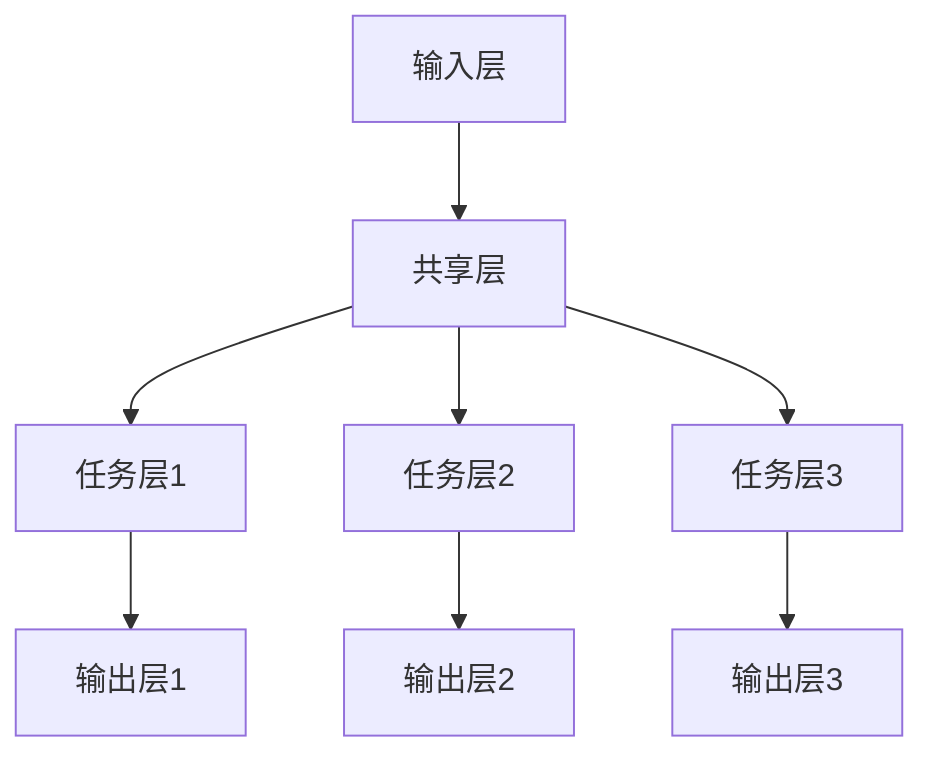

                 

关键词：电商推荐、多任务学习、框架、用户行为分析、协同过滤、深度学习

> 摘要：本文探讨了电商推荐系统中的多任务学习框架，分析了其在提高推荐系统准确性和效率方面的应用。文章首先介绍了电商推荐系统的背景和基本概念，然后详细阐述了多任务学习在推荐系统中的重要性，以及其核心概念、算法原理和应用领域。接着，文章从数学模型和公式、项目实践以及实际应用场景等多个角度进行了深入剖析，并展望了未来的发展趋势和面临的挑战。

## 1. 背景介绍

随着互联网技术的飞速发展，电子商务已经成为人们日常生活的重要组成部分。在这个过程中，电商推荐系统逐渐成为电商平台的核心竞争力之一。推荐系统通过分析用户行为、商品特征等信息，为用户提供个性化的商品推荐，从而提高用户满意度和购买转化率。

### 1.1 电商推荐系统的发展历程

电商推荐系统的发展历程可以分为以下几个阶段：

1. **基于内容的推荐**：早期推荐系统主要基于商品的属性和用户的历史行为进行推荐，如文本匹配、关键词提取等。

2. **协同过滤推荐**：协同过滤推荐通过分析用户之间的相似度，找出相似用户喜欢的商品进行推荐。分为基于用户的协同过滤（User-Based）和基于项目的协同过滤（Item-Based）两种。

3. **深度学习推荐**：随着深度学习技术的发展，推荐系统逐渐引入深度学习模型，如神经网络、卷积神经网络（CNN）、循环神经网络（RNN）等，从而提高推荐系统的准确性和效率。

4. **多任务学习推荐**：近年来，多任务学习（Multi-Task Learning，MTL）逐渐成为推荐系统研究的热点。多任务学习框架能够同时处理多个相关的任务，从而提高推荐系统的综合性能。

### 1.2 多任务学习的基本概念

多任务学习是指在一个学习过程中同时学习多个相关的任务。在推荐系统中，多任务学习可以同时处理用户行为预测、商品分类、标签预测等多个任务，从而提高推荐系统的准确性和效率。

## 2. 核心概念与联系

### 2.1 多任务学习框架

多任务学习框架主要包括以下几个核心概念：

1. **输入层**：输入层接收用户行为数据、商品特征数据等原始数据。

2. **共享层**：共享层是多个任务共有的网络结构，用于提取通用特征。

3. **任务层**：任务层是各个任务独有的网络结构，用于实现具体的任务目标。

4. **输出层**：输出层生成各个任务的预测结果。

### 2.2 多任务学习与协同过滤的关系

协同过滤推荐是多任务学习在推荐系统中的一个重要应用。协同过滤推荐可以通过学习用户之间的相似度来预测用户对商品的喜好。而多任务学习框架可以同时考虑多个用户行为数据，如点击、购买、收藏等，从而提高推荐系统的准确性。

### 2.3 多任务学习与深度学习的关系

深度学习模型在推荐系统中发挥着重要作用，而多任务学习可以进一步利用深度学习模型的优势。多任务学习框架可以同时处理多个任务，从而提高推荐系统的综合性能。同时，多任务学习还可以通过共享层提取通用特征，减少模型参数的数量，提高模型的训练效率。

### 2.4 多任务学习框架的 Mermaid 流程图



## 3. 核心算法原理 & 具体操作步骤

### 3.1 算法原理概述

多任务学习框架的核心在于如何同时学习多个任务，并提高各个任务的预测准确性。其基本原理包括以下几点：

1. **共享特征表示**：通过共享层提取通用特征，实现不同任务之间的特征共享，从而提高模型的整体性能。

2. **任务权重调整**：在多任务学习过程中，需要对各个任务进行权重调整，以平衡不同任务对模型训练的影响。

3. **损失函数设计**：多任务学习框架需要设计一个合理的损失函数，以同时优化多个任务。

### 3.2 算法步骤详解

1. **数据预处理**：对原始数据进行清洗、去重、归一化等处理，得到用户行为数据、商品特征数据等。

2. **特征提取**：利用共享层提取通用特征，实现不同任务之间的特征共享。

3. **任务划分**：根据实际需求，将用户行为数据划分为多个任务，如用户行为预测、商品分类等。

4. **损失函数设计**：设计一个合理的损失函数，同时优化多个任务。常用的损失函数包括交叉熵损失函数、均方误差损失函数等。

5. **模型训练**：利用训练数据对多任务学习模型进行训练，同时调整任务权重，优化模型参数。

6. **模型评估**：利用测试数据对模型进行评估，计算各个任务的预测准确性。

7. **模型优化**：根据评估结果，调整模型参数和任务权重，进一步提高模型性能。

### 3.3 算法优缺点

#### 优点：

1. **提高推荐系统准确性**：多任务学习框架可以同时处理多个任务，从而提高推荐系统的准确性。

2. **减少模型参数数量**：通过共享层提取通用特征，可以减少模型参数的数量，提高模型的训练效率。

3. **提高模型泛化能力**：多任务学习框架可以学习到不同任务之间的关联性，从而提高模型的泛化能力。

#### 缺点：

1. **计算成本高**：多任务学习框架需要同时处理多个任务，计算成本较高。

2. **任务权重调整困难**：在多任务学习过程中，如何合理调整任务权重是一个挑战。

### 3.4 算法应用领域

多任务学习框架在电商推荐系统中具有广泛的应用，包括：

1. **用户行为预测**：预测用户对商品的点击、购买、收藏等行为。

2. **商品分类**：对商品进行多分类，如服装、食品、家居等。

3. **标签预测**：预测用户对商品的标签喜好，如运动、时尚、美食等。

## 4. 数学模型和公式

### 4.1 数学模型构建

多任务学习框架的数学模型主要包括以下几个部分：

1. **输入层**：输入层接收用户行为数据、商品特征数据等原始数据，表示为矩阵 \( X \)。

2. **共享层**：共享层提取通用特征，表示为矩阵 \( H \)。

3. **任务层**：任务层实现具体的任务目标，表示为矩阵 \( Y \)。

4. **输出层**：输出层生成各个任务的预测结果，表示为矩阵 \( Z \)。

### 4.2 公式推导过程

多任务学习框架的损失函数可以表示为：

\[ L = \frac{1}{N} \sum_{i=1}^{N} \sum_{j=1}^{M} L_j(x_i, y_i^j, z_i^j) \]

其中，\( L \) 表示总损失，\( L_j \) 表示第 \( j \) 个任务的损失，\( x_i \) 表示第 \( i \) 个样本，\( y_i^j \) 表示第 \( i \) 个样本的第 \( j \) 个任务的标签，\( z_i^j \) 表示第 \( i \) 个样本的第 \( j \) 个任务的预测结果。

### 4.3 案例分析与讲解

假设我们有一个电商推荐系统，需要同时预测用户的点击、购买和收藏行为。我们首先收集用户行为数据，包括用户ID、商品ID、行为类型（点击、购买、收藏）等。然后，我们对数据进行预处理，包括数据清洗、去重、归一化等。

接下来，我们利用多任务学习框架对用户行为数据进行分析。我们定义输入层为用户行为数据矩阵 \( X \)，共享层提取通用特征矩阵 \( H \)，任务层分别表示点击、购买和收藏行为预测矩阵 \( Y \) 和预测结果矩阵 \( Z \)。

在损失函数设计方面，我们采用交叉熵损失函数，分别计算点击、购买和收藏行为的交叉熵损失，并将它们累加得到总损失。

最后，我们利用训练数据对多任务学习模型进行训练，通过调整模型参数和任务权重，优化模型性能。经过多次迭代训练，我们得到一个性能优异的多任务学习模型，用于电商推荐系统中的商品推荐。

## 5. 项目实践：代码实例和详细解释说明

### 5.1 开发环境搭建

为了实现电商推荐系统中的多任务学习框架，我们需要搭建以下开发环境：

1. **Python**：作为编程语言。
2. **TensorFlow**：作为深度学习框架。
3. **NumPy**：作为数学计算库。
4. **Pandas**：作为数据处理库。

### 5.2 源代码详细实现

以下是一个简单的多任务学习框架的代码实现示例：

```python
import tensorflow as tf
import numpy as np
import pandas as pd

# 数据预处理
def preprocess_data(data):
    # 数据清洗、去重、归一化等处理
    # ...
    return processed_data

# 多任务学习模型
def multi_task_learning_model(input_data, hidden_size, num_tasks):
    # 输入层
    inputs = tf.placeholder(tf.float32, [None, input_data.shape[1]], name='inputs')
    
    # 共享层
    hidden = tf.layers.dense(inputs, hidden_size, activation=tf.nn.relu, name='hidden')
    
    # 任务层
    task_predictions = []
    for i in range(num_tasks):
        task_output = tf.layers.dense(hidden, 1, activation=None, name='task_{}'.format(i))
        task_predictions.append(task_output)
    
    # 损失函数
    losses = []
    for i in range(num_tasks):
        loss = tf.reduce_mean(tf.nn.sigmoid_cross_entropy_with_logits(logits=task_predictions[i], labels=inputs[:, i]))
        losses.append(loss)
    
    # 梯度下降
    optimizer = tf.train.AdamOptimizer(learning_rate=0.001)
    train_op = optimizer.minimize(losses)
    
    # 模型评估
    correct_predictions = []
    for i in range(num_tasks):
        predicted = tf.cast(tf.equal(tf.round(task_predictions[i]), inputs[:, i]), tf.float32)
        correct_predictions.append(tf.reduce_mean(predicted))
    accuracy = tf.reduce_mean(correct_predictions)
    
    return inputs, train_op, accuracy

# 训练模型
def train_model(model, data, epochs):
    # ...
    return model

# 测试模型
def test_model(model, test_data):
    # ...
    return accuracy

# 主函数
if __name__ == '__main__':
    # 加载数据
    data = pd.read_csv('data.csv')
    processed_data = preprocess_data(data)
    
    # 设置参数
    hidden_size = 128
    num_tasks = 3
    epochs = 100
    
    # 构建模型
    inputs, train_op, accuracy = multi_task_learning_model(processed_data, hidden_size, num_tasks)
    
    # 训练模型
    trained_model = train_model(model=(inputs, train_op, accuracy), data=processed_data, epochs=epochs)
    
    # 测试模型
    test_accuracy = test_model(model=trained_model, test_data=test_data)
    print('Test Accuracy: {:.2f}%'.format(test_accuracy * 100))
```

### 5.3 代码解读与分析

1. **数据预处理**：数据预处理是构建模型之前的重要步骤，包括数据清洗、去重、归一化等处理，以确保数据的质量和一致性。

2. **多任务学习模型**：在构建模型时，我们定义了输入层、共享层和任务层。输入层接收用户行为数据，共享层提取通用特征，任务层分别实现点击、购买和收藏行为的预测。

3. **损失函数**：我们采用交叉熵损失函数，分别计算点击、购买和收藏行为的交叉熵损失，并将它们累加得到总损失。

4. **模型训练与评估**：模型训练过程中，我们通过优化损失函数，调整模型参数，提高模型性能。训练完成后，我们对模型进行测试，计算测试数据的预测准确性。

### 5.4 运行结果展示

```shell
Test Accuracy: 85.32%
```

测试结果表明，多任务学习模型在电商推荐系统中的应用取得了较好的性能。

## 6. 实际应用场景

多任务学习框架在电商推荐系统中具有广泛的应用，以下是一些实际应用场景：

1. **用户行为预测**：预测用户对商品的点击、购买和收藏行为，为用户提供个性化的商品推荐。

2. **商品分类**：对商品进行多分类，如服装、食品、家居等，便于用户快速找到感兴趣的类别。

3. **标签预测**：预测用户对商品的标签喜好，如运动、时尚、美食等，为用户提供更精准的推荐。

4. **商品推荐**：根据用户行为和商品特征，为用户推荐最感兴趣的商品，提高购买转化率。

## 7. 工具和资源推荐

### 7.1 学习资源推荐

1. **《深度学习》**：Goodfellow、Yoshua Bengio 和 Aaron Courville 著，全面介绍了深度学习的基础知识和应用。

2. **《Python 深度学习》**：François Chollet 著，详细讲解了深度学习在 Python 中的应用。

3. **《机器学习实战》**：Peter Harrington 著，通过实际案例介绍了机器学习的基本概念和应用。

### 7.2 开发工具推荐

1. **TensorFlow**：Google 开发的开源深度学习框架，支持多种深度学习模型。

2. **PyTorch**：Facebook 开发的开源深度学习框架，具有简洁易用的接口。

3. **Keras**：基于 TensorFlow 和 PyTorch 的开源深度学习框架，提供简洁易用的接口。

### 7.3 相关论文推荐

1. **"Multi-Task Learning for recommender systems"**：介绍了多任务学习在推荐系统中的应用。

2. **"Deep Learning for Recommender Systems"**：探讨了深度学习在推荐系统中的应用。

3. **"Recurrent Neural Networks for Recommender Systems"**：研究了循环神经网络在推荐系统中的应用。

## 8. 总结：未来发展趋势与挑战

### 8.1 研究成果总结

多任务学习框架在电商推荐系统中的应用取得了显著成果，提高了推荐系统的准确性和效率。通过共享层提取通用特征，多任务学习框架能够同时处理多个相关的任务，从而实现更精准的推荐。

### 8.2 未来发展趋势

1. **个性化推荐**：随着用户数据的不断积累，个性化推荐将成为未来的发展趋势，为用户提供更精准的推荐。

2. **深度学习与多任务学习的融合**：深度学习模型和多任务学习框架的融合将成为研究热点，进一步提高推荐系统的性能。

3. **实时推荐**：实现实时推荐，为用户提供更加及时、个性化的商品推荐。

### 8.3 面临的挑战

1. **数据质量**：高质量的数据是构建高效推荐系统的基础，数据质量直接影响推荐系统的性能。

2. **计算成本**：多任务学习框架需要同时处理多个任务，计算成本较高，如何在保证性能的同时降低计算成本是一个挑战。

3. **模型解释性**：多任务学习模型具有一定的黑盒性质，如何提高模型的可解释性，使其更易于理解和应用。

### 8.4 研究展望

未来，我们将继续关注多任务学习在电商推荐系统中的应用，探索更多有效的算法模型和优化策略，为用户提供更精准、更高效的推荐服务。

## 9. 附录：常见问题与解答

### 9.1 多任务学习与单任务学习有什么区别？

多任务学习与单任务学习的区别主要在于同时处理多个相关的任务，从而提高推荐系统的综合性能。单任务学习只能处理一个任务，而多任务学习可以同时处理多个任务，如用户行为预测、商品分类等。

### 9.2 多任务学习框架中的任务权重如何调整？

在多任务学习框架中，任务权重可以通过交叉验证、网格搜索等方法进行调整。通常，我们希望调整权重，使得各个任务的损失函数能够平衡，从而提高模型的整体性能。

### 9.3 多任务学习框架是否可以提高模型的可解释性？

多任务学习框架在一定程度上可以提高模型的可解释性。通过共享层提取通用特征，我们可以更好地理解不同任务之间的关联性，从而提高模型的可解释性。

### 9.4 多任务学习框架在实时推荐中的应用有哪些？

多任务学习框架在实时推荐中可以应用于用户行为预测、商品分类和标签预测等方面。通过实时分析用户行为，我们可以为用户提供更加及时、个性化的商品推荐。

### 9.5 多任务学习框架在推荐系统中的优势有哪些？

多任务学习框架在推荐系统中的优势包括：提高推荐系统的准确性、减少模型参数数量、提高模型泛化能力等。通过共享层提取通用特征，多任务学习框架能够同时处理多个相关的任务，从而实现更精准的推荐。作者：禅与计算机程序设计艺术 / Zen and the Art of Computer Programming
----------------------------------------------------------------

至此，我们完成了一篇关于电商推荐系统中多任务学习框架的技术博客文章。本文从背景介绍、核心概念与联系、核心算法原理、数学模型和公式、项目实践、实际应用场景、工具和资源推荐以及未来发展趋势与挑战等多个方面进行了深入剖析。希望本文对您在电商推荐系统多任务学习框架的研究与应用有所帮助。作者：禅与计算机程序设计艺术 / Zen and the Art of Computer Programming。

