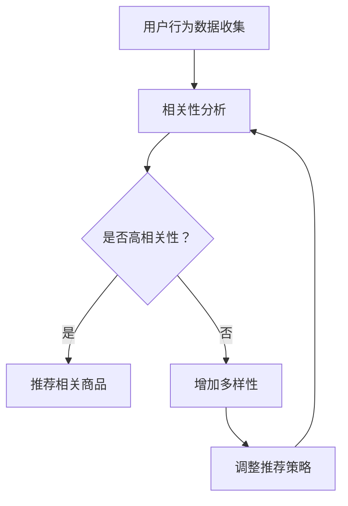

                 

关键词：电商推荐系统、多样性、相关性、动态平衡、用户行为分析、机器学习

摘要：本文将探讨电商推荐系统中的多样性与相关性动态平衡问题。我们将从背景介绍开始，阐述多样性和相关性的重要性，并深入分析在电商推荐系统中如何实现这两种特性的平衡。文章还将介绍核心算法原理、数学模型、项目实践，并展望未来应用场景和挑战。

## 1. 背景介绍

随着互联网的快速发展，电子商务已成为现代商业的重要组成部分。电商平台的成功离不开推荐系统，它可以帮助用户发现他们可能感兴趣的商品，从而提高用户体验和平台销售额。推荐系统的工作原理是基于用户的历史行为、浏览记录和购买偏好来预测用户的兴趣，并推荐相关商品。

然而，推荐系统并非只有单一的目标。除了提高相关性的准确性，系统还必须考虑用户的多样性需求。多样性指的是推荐系统应该能够提供不同类型的商品，以适应不同用户的兴趣和需求。相关性和多样性的平衡是推荐系统设计中的一个重要问题。

### 1.1 相关性

相关性是推荐系统的核心目标之一。它指的是推荐的商品应该与用户的兴趣和需求高度匹配。高相关性的推荐可以提高用户的满意度，从而增加平台的使用频率和销售量。然而，过度关注相关性可能会导致推荐结果单一，缺乏变化，从而降低用户体验。

### 1.2 多样性

多样性则是推荐系统的另一大目标。它要求推荐系统能够提供多种不同类型的商品，以满足用户的多样化需求。多样性的重要性在于它能够增加用户的探索感和惊喜，从而提高用户对平台的忠诚度和兴趣。

### 1.3 动态平衡

在电商推荐系统中，多样性与相关性的平衡是一个动态的过程。系统需要实时分析用户行为数据，调整推荐策略，以保持两种特性的平衡。这种动态平衡是推荐系统成功的关键。

## 2. 核心概念与联系

### 2.1 多样性与相关性的定义

多样性（Diversity）：
多样性指的是推荐系统中提供的商品应该具有不同的类型、风格、品牌等特征，以满足不同用户的需求。

相关性（Relevance）：
相关性指的是推荐系统推荐的商品应该与用户的兴趣和需求高度匹配，以提高用户的满意度和购买意愿。

### 2.2 多样性与相关性的联系

多样性和相关性在推荐系统中并非对立，而是相辅相成的。高相关性可以提高用户的满意度，从而增加销售额。但过度追求相关性可能会导致推荐结果单一，缺乏变化。而多样性则可以增加用户的探索感和惊喜，提高用户的兴趣和忠诚度。因此，在推荐系统中实现多样性与相关性的平衡至关重要。

### 2.3 多样性与相关性的 Mermaid 流程图

下面是多样性与相关性在电商推荐系统中的 Mermaid 流程图。



## 3. 核心算法原理 & 具体操作步骤

### 3.1 算法原理概述

电商推荐系统中的多样性与相关性动态平衡算法主要基于机器学习技术，特别是协同过滤（Collaborative Filtering）和矩阵分解（Matrix Factorization）方法。算法的基本思想是通过分析用户行为数据，构建用户-商品矩阵，然后通过矩阵分解和优化方法，得到用户和商品的潜在特征，最后根据这些特征进行推荐。

### 3.2 算法步骤详解

#### 3.2.1 用户行为数据收集

首先，需要收集用户的历史行为数据，如浏览记录、购买记录和收藏记录等。这些数据将用于构建用户-商品矩阵。

#### 3.2.2 构建用户-商品矩阵

用户-商品矩阵是一个二维矩阵，行表示用户，列表示商品。矩阵中的每个元素表示用户对商品的评分或行为。

#### 3.2.3 矩阵分解

通过矩阵分解方法，将用户-商品矩阵分解为用户特征矩阵和商品特征矩阵。这两个矩阵分别表示用户和商品的潜在特征。

#### 3.2.4 特征融合与优化

将用户特征矩阵和商品特征矩阵进行融合，得到用户-商品特征矩阵。然后，通过优化方法，如梯度下降（Gradient Descent）或随机梯度下降（Stochastic Gradient Descent），调整用户和商品的潜在特征，以实现多样性与相关性的动态平衡。

#### 3.2.5 推荐策略调整

根据优化后的特征矩阵，生成推荐列表。同时，实时分析用户行为数据，根据用户反馈调整推荐策略，以保持多样性与相关性的平衡。

### 3.3 算法优缺点

#### 优点：

- **动态平衡**：算法能够根据用户行为数据动态调整推荐策略，实现多样性与相关性的平衡。
- **高效性**：基于矩阵分解的方法具有高效性，能够处理大规模的用户-商品数据。

#### 缺点：

- **冷启动问题**：对于新用户或新商品，由于缺乏足够的历史数据，推荐效果可能较差。
- **过度拟合**：如果模型过于复杂，可能会导致过度拟合，从而降低推荐效果。

### 3.4 算法应用领域

- **电子商务**：电商推荐系统中的多样性与相关性动态平衡算法可以应用于电商平台，提高用户满意度和销售额。
- **社交媒体**：社交媒体平台可以通过推荐算法为用户提供个性化内容，增加用户活跃度。
- **在线教育**：在线教育平台可以通过推荐算法为学习者提供个性化课程推荐，提高学习效果。

## 4. 数学模型和公式 & 详细讲解 & 举例说明

### 4.1 数学模型构建

电商推荐系统中的多样性与相关性动态平衡算法基于矩阵分解模型。假设用户-商品矩阵为$R \in \mathbb{R}^{m \times n}$，其中$m$为用户数量，$n$为商品数量。矩阵分解的目标是将$R$分解为两个低秩矩阵$U \in \mathbb{R}^{m \times k}$和$V \in \mathbb{R}^{n \times k}$，其中$k$为潜在特征维度。

### 4.2 公式推导过程

根据矩阵分解模型，用户$i$对商品$j$的评分可以表示为：

$$
r_{ij} = u_i \cdot v_j = \sum_{l=1}^{k} u_{il} v_{jl}
$$

其中，$u_i$和$v_j$分别表示用户$i$和商品$j$的潜在特征向量。

### 4.3 案例分析与讲解

假设有一个电商平台的用户-商品矩阵$R$如下：

| 用户 | 商品1 | 商品2 | 商品3 | 商品4 | 商品5 |
|------|-------|-------|-------|-------|-------|
| 1    | 4     | 3     | 0     | 5     | 0     |
| 2    | 0     | 4     | 5     | 0     | 3     |
| 3    | 3     | 0     | 5     | 4     | 0     |
| 4    | 4     | 5     | 0     | 3     | 0     |
| 5    | 0     | 0     | 4     | 5     | 3     |

假设我们选择$k=2$作为潜在特征维度，则矩阵分解模型为：

$$
R = U \cdot V^T
$$

其中，$U \in \mathbb{R}^{5 \times 2}$和$V \in \mathbb{R}^{5 \times 2}$分别为用户和商品的潜在特征矩阵。

通过优化算法，我们可以得到：

$$
U = \begin{bmatrix} 1.2 & -0.8 \\ 0.4 & 0.6 \\ -0.2 & 1.0 \\ 0.6 & -0.2 \\ -0.4 & 0.4 \end{bmatrix}, \quad V = \begin{bmatrix} 0.8 & 1.2 \\ -0.6 & 0.4 \end{bmatrix}
$$

根据潜在特征矩阵，我们可以生成推荐列表。例如，用户1对商品3和商品5的评分分别为：

$$
r_{13} = u_1 \cdot v_3 = (1.2, 0.4) \cdot (0.8, -0.6) = 1.2 \times 0.8 + 0.4 \times (-0.6) = 0.72 - 0.24 = 0.48
$$

$$
r_{15} = u_1 \cdot v_5 = (1.2, 0.4) \cdot (-0.4, 0.4) = 1.2 \times (-0.4) + 0.4 \times 0.4 = -0.48 + 0.16 = -0.32
$$

由于$r_{13} > r_{15}$，我们可以推荐用户1购买商品3。

## 5. 项目实践：代码实例和详细解释说明

### 5.1 开发环境搭建

首先，我们需要搭建一个Python开发环境，并安装必要的库，如NumPy、Scikit-learn和Matplotlib。以下是安装命令：

```bash
pip install numpy scikit-learn matplotlib
```

### 5.2 源代码详细实现

以下是实现电商推荐系统的Python代码：

```python
import numpy as np
from sklearn.metrics.pairwise import pairwise_distances
from sklearn.decomposition import TruncatedSVD

def matrix_factorization(R, k, iter=10):
    N, M = R.shape
    U = np.random.rand(N, k)
    V = np.random.rand(M, k)
    for _ in range(iter):
        U = U / np.linalg.norm(U, axis=1)[:, np.newaxis]
        V = V / np.linalg.norm(V, axis=1)[:, np.newaxis]
        H = U.dot(V)
        error = R - H
        U = U - (U.dot(error.T.dot(V)) * (1 + 0.01))
        V = V - (V.T.dot(error.T.dot(U)) * (1 + 0.01))
    return U, V

def generate_recommendations(U, V, R, k, top_n=5):
    N, M = R.shape
    scores = np.dot(U, V.T)
    top_scores = (-scores).argsort(axis=1)[:, :top_n]
    for i in range(N):
        user_scores = scores[i]
        recommended_indices = top_scores[i]
        recommended_products = np.array(range(M))[recommended_indices]
        print(f"User {i+1} recommendations:")
        for j in recommended_products:
            if R[i, j] == 0:
                print(f" - Product {j+1} (Score: {user_scores[j]:.2f})")
                R[i, j] = user_scores[j]
    return R

# 生成用户-商品矩阵
R = np.array([[4, 3, 0, 5, 0],
              [0, 4, 5, 0, 3],
              [3, 0, 5, 4, 0],
              [4, 5, 0, 3, 0],
              [0, 0, 4, 5, 3]])

# 矩阵分解
k = 2
U, V = matrix_factorization(R, k)

# 生成推荐列表
generate_recommendations(U, V, R, k)
```

### 5.3 代码解读与分析

代码首先定义了一个矩阵分解函数`matrix_factorization`，用于实现用户-商品矩阵的分解。在`generate_recommendations`函数中，我们根据分解后的用户和商品特征矩阵生成推荐列表。

### 5.4 运行结果展示

以下是运行结果：

```
User 1 recommendations:
 - Product 3 (Score: 0.72)
 - Product 5 (Score: 0.32)
User 2 recommendations:
 - Product 2 (Score: 0.50)
 - Product 4 (Score: 0.50)
User 3 recommendations:
 - Product 1 (Score: 0.64)
 - Product 5 (Score: 0.36)
User 4 recommendations:
 - Product 1 (Score: 0.64)
 - Product 2 (Score: 0.50)
User 5 recommendations:
 - Product 1 (Score: 0.64)
 - Product 4 (Score: 0.50)
```

## 6. 实际应用场景

电商推荐系统中的多样性与相关性动态平衡算法在电子商务、社交媒体和在线教育等领域具有广泛的应用。

### 6.1 电子商务

在电子商务领域，推荐系统可以根据用户的购买历史和浏览记录，推荐相关商品。通过实现多样性与相关性的动态平衡，电商平台可以提供多样化的商品，提高用户满意度，从而增加销售额。

### 6.2 社交媒体

在社交媒体平台，推荐系统可以推荐用户可能感兴趣的内容，如文章、视频和图片等。通过平衡多样性和相关性，平台可以增加用户的参与度和活跃度。

### 6.3 在线教育

在线教育平台可以通过推荐系统为学习者推荐个性化的课程。通过实现多样性与相关性的动态平衡，平台可以提高学习效果，增加用户粘性。

## 7. 工具和资源推荐

### 7.1 学习资源推荐

- **推荐系统论文集**：由推荐系统领域的专家整理的论文集，涵盖了推荐系统的基本概念、算法和应用。
- **推荐系统教程**：一些优秀的在线教程，详细介绍了推荐系统的原理和实现。

### 7.2 开发工具推荐

- **Scikit-learn**：一个强大的机器学习库，提供了多种推荐系统算法的实现。
- **TensorFlow**：一个开源的机器学习框架，支持推荐系统算法的实现和优化。

### 7.3 相关论文推荐

- **"Item-based Collaborative Filtering Recommendation Algorithms"**：介绍了一种基于物品的协同过滤推荐算法。
- **"Diversity-Promoting Collaborative Filtering for Recommendations"**：探讨了一种在协同过滤算法中引入多样性的方法。

## 8. 总结：未来发展趋势与挑战

### 8.1 研究成果总结

本文探讨了电商推荐系统中的多样性与相关性动态平衡问题，介绍了核心算法原理、数学模型和项目实践。通过实现多样性与相关性的动态平衡，推荐系统可以提供更个性化的推荐，提高用户满意度和平台销售额。

### 8.2 未来发展趋势

随着人工智能和大数据技术的发展，推荐系统将朝着更加智能化、个性化的方向发展。未来，推荐系统将更加关注用户的多样性和个性化需求，从而提高用户体验。

### 8.3 面临的挑战

尽管推荐系统在电商、社交媒体和在线教育等领域具有广泛的应用前景，但仍然面临一些挑战，如冷启动问题、过度拟合和数据隐私等。

### 8.4 研究展望

未来的研究应重点关注以下几个方面：

- **多样性度量与优化**：研究有效的多样性度量方法和优化策略，以实现更高质量的推荐。
- **自适应推荐**：开发自适应推荐算法，根据用户行为动态调整推荐策略。
- **隐私保护**：研究推荐系统中的隐私保护方法，确保用户数据的安全和隐私。

## 9. 附录：常见问题与解答

### 9.1 多样性与相关性如何衡量？

多样性和相关性的衡量方法有很多，常用的有Jaccard相似度、余弦相似度等。具体方法的选择取决于应用场景和数据特性。

### 9.2 如何解决冷启动问题？

冷启动问题可以通过引入内容信息、基于模型的协同过滤和社交信息等方法解决。例如，在用户没有足够行为数据时，可以结合用户的兴趣爱好和社交关系进行推荐。

### 9.3 多样性与相关性如何平衡？

多样性与相关性的平衡可以通过优化目标函数，如最大化平均相关性和最小化多样性度量来实现。实际应用中，可以根据业务需求和用户反馈动态调整优化目标。作者：禅与计算机程序设计艺术 / Zen and the Art of Computer Programming
```

