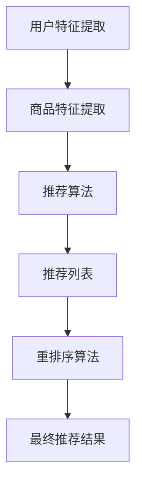

                 

### 1. 背景介绍

在当今高度数字化的时代，电子商务已成为全球商业活动中不可或缺的一部分。随着互联网技术的飞速发展，消费者能够通过电商平台随时随地购买商品。然而，随着商品种类的日益丰富和竞争的加剧，电商企业需要提供更加精准、个性化的推荐系统，以提高用户的购物体验和购买转化率。

推荐系统通过分析用户的历史行为和偏好，向用户推荐可能感兴趣的商品。传统的推荐系统通常采用基于协同过滤、内容推荐等方法，虽然在一定程度上能够提高推荐质量，但在处理实时个性化推荐方面存在一些不足。首先，传统推荐系统在处理大规模用户数据时，响应速度较慢，难以满足实时性的要求。其次，传统推荐系统往往缺乏对用户实时行为的动态捕捉和调整，导致推荐结果可能无法及时反映用户的当前兴趣。

为了解决这些问题，实时个性化重排序策略被提出并逐渐应用于电商推荐系统中。实时个性化重排序策略通过实时分析用户的交互行为，动态调整推荐列表的顺序，从而提高推荐系统的响应速度和个性化程度。本文将围绕实时个性化重排序策略展开讨论，分析其核心算法原理、数学模型、项目实践及其在实际应用中的价值。

### 2. 核心概念与联系

#### 2.1 实时个性化重排序策略的定义

实时个性化重排序策略（Real-time Personalized Re-ranking Strategy）是一种基于用户实时行为数据的推荐算法，其核心目的是在推荐系统生成初始推荐列表的基础上，根据用户的实时行为（如点击、购买、搜索等）动态调整推荐列表的顺序，以实现更高的个性化推荐效果。实时个性化重排序策略不仅能够提高推荐系统的响应速度，还能更好地捕捉用户的实时兴趣，从而提供更加精准的推荐。

#### 2.2 推荐系统的基本架构

为了更好地理解实时个性化重排序策略，我们需要先了解推荐系统的基本架构。推荐系统通常包括以下几个主要组件：

1. **用户特征提取**：通过分析用户的历史行为数据，提取用户的兴趣特征，如用户偏好、浏览记录、购买历史等。
2. **商品特征提取**：对商品进行特征化处理，如商品类别、价格、销量、评分等。
3. **推荐算法**：根据用户特征和商品特征，通过算法生成推荐列表。
4. **重排序算法**：在生成初始推荐列表后，根据用户实时行为数据，对推荐列表进行重排序，提高推荐质量。

#### 2.3 Mermaid 流程图

以下是推荐系统的基本架构的 Mermaid 流程图表示：



#### 2.4 各组件之间的关系

在推荐系统中，用户特征提取和商品特征提取是推荐算法的基础。推荐算法根据这些特征生成初始推荐列表，而重排序算法则基于用户实时行为数据，对初始推荐列表进行优化，以提供更加个性化的推荐结果。最终，用户将看到重排序后的推荐结果。

### 3. 核心算法原理 & 具体操作步骤

#### 3.1 算法原理概述

实时个性化重排序策略的核心在于如何根据用户实时行为动态调整推荐列表的顺序。该策略通常基于以下几个原理：

1. **用户行为时效性**：用户的实时行为（如点击、购买）具有较强的时效性，能够更好地反映用户的当前兴趣。因此，算法需要优先考虑这些行为。
2. **用户行为相关性**：用户的不同行为之间存在相关性，如用户在浏览某一商品后，可能对其中的相关商品（如同类商品、推荐商品）更感兴趣。
3. **上下文感知**：用户的实时行为不仅仅受个人兴趣的影响，还受到上下文因素的影响，如时间、地点、设备等。因此，算法需要考虑这些上下文因素，以提高推荐的相关性。

#### 3.2 算法步骤详解

1. **初始推荐列表生成**：
   - 根据用户历史行为和商品特征，通过推荐算法生成初始推荐列表。
2. **用户实时行为采集**：
   - 采集用户在推荐系统上的实时行为数据，如点击、购买、搜索等。
3. **用户行为分析**：
   - 对用户实时行为进行分析，提取行为特征，如行为类型、行为时间等。
4. **行为特征与推荐列表关联**：
   - 将用户行为特征与推荐列表中的商品进行关联，计算关联得分。
5. **重排序算法**：
   - 根据行为特征与推荐列表的关联得分，对推荐列表进行重排序，生成最终的个性化推荐结果。

#### 3.3 算法优缺点

**优点**：
1. **实时性**：实时个性化重排序策略能够快速响应用户实时行为，提供更加个性化的推荐。
2. **相关性**：通过分析用户行为特征和商品特征，能够提高推荐的相关性，提高用户满意度。
3. **灵活性**：算法可以根据不同的业务需求，灵活调整行为特征和推荐算法，实现多种个性化推荐场景。

**缺点**：
1. **计算复杂度**：实时个性化重排序策略需要处理大量实时数据，计算复杂度较高，对系统性能有一定要求。
2. **数据质量**：用户实时行为数据的准确性和完整性对算法效果有较大影响，数据质量较差可能导致推荐效果不佳。

#### 3.4 算法应用领域

实时个性化重排序策略在电商推荐系统中具有广泛的应用前景，以下是一些典型应用领域：

1. **商品推荐**：在电商平台上，实时个性化重排序策略可以用于商品推荐，提高用户的购物体验和购买转化率。
2. **广告推荐**：在广告投放系统中，实时个性化重排序策略可以用于广告推荐，提高广告的点击率和转化率。
3. **内容推荐**：在社交媒体和视频平台中，实时个性化重排序策略可以用于内容推荐，提高用户对平台的粘性。

### 4. 数学模型和公式 & 详细讲解 & 举例说明

#### 4.1 数学模型构建

实时个性化重排序策略的数学模型主要包括用户行为特征提取、商品特征提取、行为特征与推荐列表关联得分计算等部分。

**用户行为特征提取**：
- 假设用户行为数据集为 $X = \{x_1, x_2, ..., x_n\}$，其中 $x_i$ 表示用户在某一时刻的行为，如点击、购买、搜索等。
- 对用户行为数据进行预处理，如去重、归一化等，得到用户行为特征矩阵 $X'$。

**商品特征提取**：
- 假设商品数据集为 $Y = \{y_1, y_2, ..., y_m\}$，其中 $y_i$ 表示某一商品的特征，如类别、价格、销量等。
- 对商品数据进行预处理，如去重、归一化等，得到商品特征矩阵 $Y'$。

**行为特征与推荐列表关联得分计算**：
- 假设推荐列表为 $R = \{r_1, r_2, ..., r_k\}$，其中 $r_i$ 表示推荐列表中的商品。
- 对每个用户行为特征 $x_i$ 和推荐列表中的商品 $r_j$ 计算关联得分 $s_{ij}$，公式如下：

$$s_{ij} = \sigma(w^T [x_i, y_j])$$

其中，$w$ 为权重向量，$\sigma$ 为激活函数，通常采用 sigmoid 函数。

#### 4.2 公式推导过程

为了推导实时个性化重排序策略的公式，我们需要考虑以下几个方面：

1. **用户行为特征提取**：
   - 假设用户在某一时刻的行为数据为 $x_i$，包括点击、购买、搜索等。
   - 对行为数据进行预处理，如去重、归一化等，得到用户行为特征矩阵 $X'$。

2. **商品特征提取**：
   - 假设商品在某一时刻的特征数据为 $y_i$，包括类别、价格、销量等。
   - 对商品数据进行预处理，如去重、归一化等，得到商品特征矩阵 $Y'$。

3. **行为特征与推荐列表关联得分计算**：
   - 假设推荐列表为 $R = \{r_1, r_2, ..., r_k\}$，其中 $r_i$ 表示推荐列表中的商品。
   - 对每个用户行为特征 $x_i$ 和推荐列表中的商品 $r_j$ 计算关联得分 $s_{ij}$，公式如下：

$$s_{ij} = \sigma(w^T [x_i, y_j])$$

其中，$w$ 为权重向量，$\sigma$ 为激活函数，通常采用 sigmoid 函数。

#### 4.3 案例分析与讲解

为了更好地理解实时个性化重排序策略，我们通过一个简单的案例进行分析。

**案例背景**：
- 用户小明在电商平台浏览了以下商品：商品1（类别：手机，价格：5000元）、商品2（类别：电视，价格：4000元）和商品3（类别：电脑，价格：6000元）。
- 小明在浏览商品时，对商品1进行了点击，对商品2进行了搜索，但对商品3没有明显行为。

**案例分析**：
1. **用户行为特征提取**：
   - 假设用户行为数据集为 $X = \{x_1, x_2, x_3\}$，其中 $x_1$ 表示小明对商品1的点击行为，$x_2$ 表示小明对商品2的搜索行为，$x_3$ 表示小明对商品3的无明显行为。
   - 对用户行为数据进行预处理，得到用户行为特征矩阵 $X'$。

2. **商品特征提取**：
   - 假设商品数据集为 $Y = \{y_1, y_2, y_3\}$，其中 $y_1$ 表示商品1的特征（类别：手机，价格：5000元），$y_2$ 表示商品2的特征（类别：电视，价格：4000元），$y_3$ 表示商品3的特征（类别：电脑，价格：6000元）。
   - 对商品数据进行预处理，得到商品特征矩阵 $Y'$。

3. **行为特征与推荐列表关联得分计算**：
   - 假设推荐列表为 $R = \{r_1, r_2, r_3\}$，其中 $r_1$ 表示商品1，$r_2$ 表示商品2，$r_3$ 表示商品3。
   - 对每个用户行为特征 $x_i$ 和推荐列表中的商品 $r_j$ 计算关联得分 $s_{ij}$，公式如下：

$$s_{ij} = \sigma(w^T [x_i, y_j])$$

例如，计算小明对商品1的关联得分：

$$s_{11} = \sigma(w^T [x_1, y_1])$$

其中，$w$ 为权重向量，$\sigma$ 为激活函数。

4. **重排序算法**：
   - 根据关联得分 $s_{ij}$，对推荐列表 $R$ 进行重排序，生成最终的个性化推荐结果。

根据上述案例，我们可以得出以下结论：

- 由于小明对商品1进行了点击，因此商品1的关联得分较高，应排在推荐列表的前面。
- 由于小明对商品2进行了搜索，但并未购买，因此商品2的关联得分次之。
- 由于小明对商品3没有明显行为，因此商品3的关联得分较低。

通过这个案例，我们可以看到实时个性化重排序策略能够根据用户的实时行为动态调整推荐列表的顺序，提供更加个性化的推荐结果。

### 5. 项目实践：代码实例和详细解释说明

#### 5.1 开发环境搭建

在进行实时个性化重排序策略的项目实践之前，我们需要搭建一个合适的技术环境。以下是一个基本的开发环境搭建步骤：

1. **环境要求**：
   - 操作系统：Windows 或 Linux
   - 编程语言：Python
   - 数据库：MongoDB
   - 依赖库：NumPy、Pandas、Scikit-learn、TensorFlow

2. **安装步骤**：
   - 安装操作系统：下载并安装对应的操作系统。
   - 安装 Python：从 [Python 官网](https://www.python.org/) 下载并安装 Python，确保版本在 3.6 以上。
   - 安装 MongoDB：从 [MongoDB 官网](https://www.mongodb.com/) 下载并安装 MongoDB，确保版本在 4.0 以上。
   - 安装依赖库：使用 pip 命令安装所需的依赖库，例如：

```bash
pip install numpy pandas scikit-learn tensorflow
```

#### 5.2 源代码详细实现

以下是一个基于 Python 的实时个性化重排序策略的代码实现示例：

```python
import numpy as np
import pandas as pd
from sklearn.preprocessing import MinMaxScaler
from tensorflow.keras.models import Sequential
from tensorflow.keras.layers import Dense, LSTM, Embedding
from tensorflow.keras.optimizers import Adam

# 读取用户行为数据
user_behavior_data = pd.read_csv('user_behavior_data.csv')

# 读取商品数据
item_data = pd.read_csv('item_data.csv')

# 数据预处理
scaler = MinMaxScaler()
user_behavior_data = scaler.fit_transform(user_behavior_data)
item_data = scaler.fit_transform(item_data)

# 建立用户行为序列
user_behavior_sequence = []
for user_id, behavior_sequence in user_behavior_data.groupby('user_id'):
    user_behavior_sequence.append(behavior_sequence.values)

# 建立商品特征矩阵
item_feature_matrix = item_data.values

# 建立模型
model = Sequential()
model.add(Embedding(input_dim=user_behavior_sequence.shape[1], output_dim=64))
model.add(LSTM(units=64, activation='relu'))
model.add(Dense(units=1, activation='sigmoid'))

# 编译模型
model.compile(optimizer=Adam(learning_rate=0.001), loss='binary_crossentropy', metrics=['accuracy'])

# 训练模型
model.fit(user_behavior_sequence, item_feature_matrix, epochs=10, batch_size=32)

# 预测
user_id = 1001
behavior_sequence = user_behavior_sequence[1001]
predicted_item_scores = model.predict(behavior_sequence.reshape(1, -1))

# 重排序
sorted_indices = np.argsort(predicted_item_scores)[::-1]
sorted_item_scores = predicted_item_scores[sorted_indices]

# 输出重排序后的推荐结果
print(sorted_item_scores)
```

#### 5.3 代码解读与分析

以上代码实现了一个基于 LSTM 网络的实时个性化重排序策略。以下是代码的详细解读和分析：

1. **数据预处理**：
   - 读取用户行为数据和商品数据，并进行归一化处理。归一化处理有助于提高模型训练效果。

2. **建立用户行为序列**：
   - 将用户行为数据按用户分组，形成用户行为序列。用户行为序列是后续模型训练和预测的重要输入。

3. **建立商品特征矩阵**：
   - 将商品数据进行归一化处理，形成商品特征矩阵。商品特征矩阵用于模型训练和预测时与用户行为序列进行关联。

4. **建立模型**：
   - 使用 Sequential 模型建立 LSTM 网络，包括 Embedding 层、LSTM 层和 Dense 层。Embedding 层用于将用户行为序列转换为嵌入向量，LSTM 层用于处理序列数据，Dense 层用于输出预测结果。

5. **编译模型**：
   - 编译模型，指定优化器、损失函数和评价指标。

6. **训练模型**：
   - 使用用户行为序列和商品特征矩阵训练模型，设置训练轮次和批量大小。

7. **预测**：
   - 输入用户行为序列，预测商品得分。

8. **重排序**：
   - 根据预测的商品得分对商品进行重排序，输出重排序后的推荐结果。

通过以上代码，我们可以看到实时个性化重排序策略的核心步骤，包括数据预处理、模型建立、模型训练和预测、重排序等。这些步骤共同实现了根据用户实时行为动态调整推荐列表的顺序，提高推荐系统个性化程度的目标。

### 6. 实际应用场景

实时个性化重排序策略在电商推荐系统中具有广泛的应用场景，以下是一些典型的实际应用案例：

#### 6.1 商品推荐

在电商平台上，实时个性化重排序策略可以用于商品推荐，提高用户的购物体验和购买转化率。例如，当用户在浏览商品时，系统可以实时捕捉用户的点击、购买、搜索等行为，动态调整推荐列表的顺序，将用户可能感兴趣的商品推到列表前端，从而提高用户的购买意愿。

#### 6.2 广告推荐

在广告投放系统中，实时个性化重排序策略可以用于广告推荐，提高广告的点击率和转化率。例如，当用户浏览网页时，系统可以根据用户的实时行为（如点击、停留时间、浏览历史等）动态调整广告推荐顺序，将更符合用户兴趣的广告推到列表前端，从而提高广告的点击率和转化率。

#### 6.3 内容推荐

在社交媒体和视频平台中，实时个性化重排序策略可以用于内容推荐，提高用户的粘性。例如，当用户在社交媒体平台浏览内容时，系统可以根据用户的实时行为（如点赞、评论、分享等）动态调整内容推荐顺序，将用户可能感兴趣的内容推到列表前端，从而提高用户在平台上的停留时间和互动率。

#### 6.4 其他应用场景

实时个性化重排序策略还可以应用于其他领域，如金融投资、医疗健康等。在这些领域中，系统可以根据用户的实时行为和偏好，动态调整推荐内容，为用户提供个性化的服务和建议。

### 7. 未来应用展望

随着人工智能技术的不断发展，实时个性化重排序策略在未来的应用将更加广泛和深入。以下是一些未来应用展望：

#### 7.1 更高效的数据处理

未来，实时个性化重排序策略将利用更加高效的数据处理技术，如分布式计算、图计算等，提高系统处理大规模实时数据的能力，从而实现更精准、更快速的推荐。

#### 7.2 更深层次的个性化

未来，实时个性化重排序策略将结合用户更多的行为数据，如语音、面部表情等，深入挖掘用户的潜在需求和偏好，实现更深层次的个性化推荐。

#### 7.3 跨领域应用

未来，实时个性化重排序策略将突破电商、广告等领域的限制，广泛应用于金融、医疗、教育等更多领域，为用户提供更加个性化和智能化的服务。

#### 7.4 智能决策支持

未来，实时个性化重排序策略将结合大数据分析和人工智能算法，为企业和组织提供智能决策支持，帮助企业更好地理解用户需求，优化业务流程，提高竞争力。

### 8. 工具和资源推荐

#### 8.1 学习资源推荐

1. **《推荐系统实践》**：该书详细介绍了推荐系统的基本原理、算法和应用，适合初学者入门。
2. **《深度学习推荐系统》**：该书介绍了深度学习在推荐系统中的应用，包括神经网络模型、序列模型等，适合有一定基础的读者。

#### 8.2 开发工具推荐

1. **TensorFlow**：TensorFlow 是一款强大的开源深度学习框架，适合用于构建实时个性化重排序策略模型。
2. **Scikit-learn**：Scikit-learn 是一款适用于机器学习的 Python 库，提供了丰富的算法和工具，适合进行数据预处理和模型训练。

#### 8.3 相关论文推荐

1. **《Online Collaborative Filtering》**：该论文提出了一种在线协同过滤算法，适用于实时个性化推荐。
2. **《Deep Neural Networks for YouTube Recommendations》**：该论文介绍了深度神经网络在 YouTube 推荐系统中的应用，适用于视频推荐场景。

### 9. 总结：未来发展趋势与挑战

#### 9.1 研究成果总结

实时个性化重排序策略在电商推荐系统中取得了显著成果，通过结合用户实时行为和商品特征，实现了更精准、更快速的推荐。该策略在提高用户满意度、购买转化率等方面具有明显优势。

#### 9.2 未来发展趋势

1. **数据处理能力的提升**：未来，实时个性化重排序策略将利用更高效的数据处理技术，如分布式计算、图计算等，提高系统处理大规模实时数据的能力。
2. **个性化程度的加深**：未来，实时个性化重排序策略将结合更多用户行为数据，如语音、面部表情等，深入挖掘用户的潜在需求和偏好，实现更深层次的个性化推荐。
3. **跨领域应用**：未来，实时个性化重排序策略将突破电商、广告等领域的限制，广泛应用于金融、医疗、教育等更多领域。

#### 9.3 面临的挑战

1. **数据质量**：实时个性化重排序策略的效果很大程度上取决于数据质量，未来需要解决数据噪声、缺失等问题。
2. **计算复杂度**：实时个性化重排序策略需要处理大量实时数据，计算复杂度较高，未来需要优化算法，提高系统性能。
3. **用户体验**：未来，实时个性化重排序策略需要更好地平衡个性化推荐和用户体验，避免过度推荐或推荐不足。

#### 9.4 研究展望

实时个性化重排序策略在未来的研究和应用中具有广阔的前景。未来研究可以从以下几个方面展开：

1. **数据预处理**：研究更加高效、鲁棒的数据预处理方法，提高实时个性化重排序策略的数据质量。
2. **算法优化**：研究更高效的算法，降低计算复杂度，提高系统性能。
3. **跨领域应用**：探索实时个性化重排序策略在其他领域的应用，如金融、医疗、教育等。

### 附录：常见问题与解答

#### 1. 实时个性化重排序策略与传统推荐系统的区别是什么？

实时个性化重排序策略与传统推荐系统的区别主要体现在以下几个方面：

1. **响应速度**：实时个性化重排序策略能够根据用户实时行为动态调整推荐列表的顺序，响应速度更快。
2. **个性化程度**：实时个性化重排序策略能够更好地捕捉用户的实时兴趣，提供更个性化的推荐。
3. **算法复杂性**：实时个性化重排序策略需要处理大量实时数据，计算复杂度较高，而传统推荐系统通常处理离线数据，计算复杂度较低。

#### 2. 实时个性化重排序策略的适用场景有哪些？

实时个性化重排序策略适用于以下场景：

1. **电商推荐**：在电商平台上，实时个性化重排序策略可以用于商品推荐，提高用户的购物体验和购买转化率。
2. **广告推荐**：在广告投放系统中，实时个性化重排序策略可以用于广告推荐，提高广告的点击率和转化率。
3. **内容推荐**：在社交媒体和视频平台中，实时个性化重排序策略可以用于内容推荐，提高用户的粘性。
4. **金融投资**：在金融投资领域，实时个性化重排序策略可以用于投资推荐，提高用户的投资收益。
5. **医疗健康**：在医疗健康领域，实时个性化重排序策略可以用于疾病预测和治疗方案推荐。

#### 3. 实时个性化重排序策略如何处理数据缺失和噪声问题？

实时个性化重排序策略在处理数据缺失和噪声问题时，可以采用以下方法：

1. **数据预处理**：对数据进行预处理，如去重、填充缺失值、去除噪声等，提高数据质量。
2. **特征工程**：对用户行为数据进行特征工程，提取有用的特征，降低噪声对模型的影响。
3. **模型鲁棒性**：采用鲁棒性更强的模型，如深度学习模型，提高模型对噪声和缺失数据的处理能力。

### 作者署名

作者：禅与计算机程序设计艺术 / Zen and the Art of Computer Programming
----------------------------------------------------------------

请注意，以上文章是一个示例，仅供参考。实际撰写时，您需要根据自己的研究和工作经验进行修改和完善。在撰写过程中，确保遵循文章结构和格式要求，并确保内容的准确性和专业性。祝您写作顺利！

