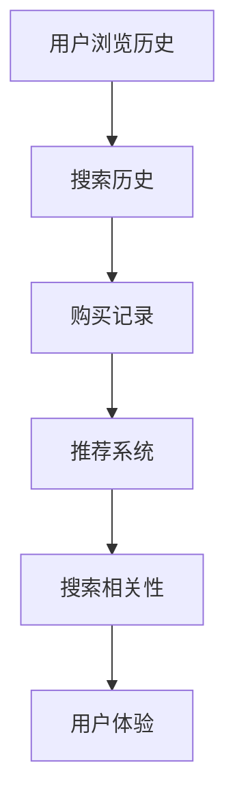
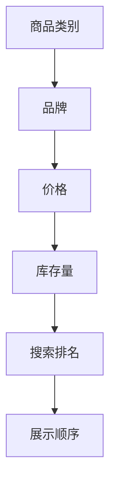
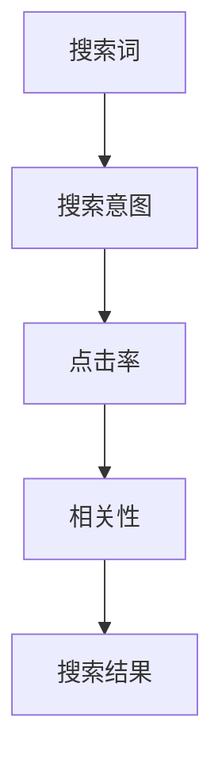

                 

关键词：电商搜索、AI大模型、特征工程、机器学习、用户行为、搜索排名

摘要：随着人工智能技术的飞速发展，大模型在电商搜索中的应用变得越来越广泛。本文将探讨在电商搜索中如何进行特征工程，以提升AI大模型的表现。我们将深入分析用户行为特征、商品属性特征以及搜索日志特征，并探讨如何有效地整合这些特征，为AI大模型提供强大的支持。

## 1. 背景介绍

电商行业竞争激烈，搜索功能作为用户获取商品信息的主要途径，其性能直接影响到用户的购物体验和商家的销售业绩。为了满足用户日益增长的个性化需求，传统的基于关键词匹配的搜索算法已经无法满足要求。因此，人工智能技术，特别是深度学习，开始广泛应用于电商搜索中。

大模型，尤其是预训练语言模型，如BERT、GPT等，凭借其强大的语义理解能力，在电商搜索中表现出色。然而，要充分发挥这些大模型的优势，特征工程是关键。特征工程涉及到从原始数据中提取有用的信息，并转化为适合模型训练的输入特征。本文将重点探讨如何进行特征工程，以提升电商搜索的准确性、相关性和用户体验。

## 2. 核心概念与联系

### 2.1. 用户行为特征

用户行为特征包括用户的浏览历史、购买记录、搜索历史等。这些特征可以揭示用户的兴趣偏好和购买习惯，对于提高搜索准确性至关重要。例如，用户经常浏览某种类型的商品，可能意味着他们对这类商品有较高的兴趣，从而在搜索时可以优先推荐。



### 2.2. 商品属性特征

商品属性特征包括商品的类别、品牌、价格、库存量等。这些特征直接决定了商品在搜索结果中的排名和展示顺序。通过对商品属性特征的分析，可以更准确地匹配用户需求和商品信息。



### 2.3. 搜索日志特征

搜索日志特征包括用户的搜索词、搜索意图、搜索结果点击率等。这些特征可以帮助我们了解用户的搜索意图，从而优化搜索结果的相关性。



## 3. 核心算法原理 & 具体操作步骤

### 3.1 算法原理概述

特征工程的核心目标是提取原始数据中的有用信息，并将其转化为适合模型训练的输入特征。具体来说，我们可以采用以下几种方法：

1. **特征提取**：通过统计分析和数据挖掘技术，从原始数据中提取有用的特征。
2. **特征选择**：从提取的特征中，选择对模型训练有显著影响的特征，以减少模型的复杂度和过拟合风险。
3. **特征转换**：将提取的特征转化为适合模型训练的数值表示。

### 3.2 算法步骤详解

1. **数据预处理**：清洗和预处理原始数据，包括去除重复数据、缺失值填充、异常值处理等。
2. **特征提取**：根据用户行为、商品属性和搜索日志特征，提取相关的特征。
3. **特征选择**：使用统计方法（如相关性分析、卡方检验等）和机器学习模型（如决策树、随机森林等）进行特征选择。
4. **特征转换**：将选择的特征进行数值化、归一化等处理，以适应模型的输入要求。
5. **模型训练**：使用特征训练大模型，如BERT、GPT等。
6. **模型评估**：通过评估指标（如准确率、召回率、F1分数等）评估模型的表现。
7. **模型优化**：根据评估结果，调整模型参数或特征选择策略，以提高模型性能。

### 3.3 算法优缺点

**优点**：

- **高效性**：特征工程可以显著提高模型训练和推理的效率。
- **可解释性**：特征工程使得模型的行为更加可解释，有助于理解模型决策的原因。
- **泛化能力**：通过特征选择和转换，可以提高模型的泛化能力，减少过拟合风险。

**缺点**：

- **复杂度**：特征工程涉及到多个步骤和多种技术，可能导致过程复杂。
- **计算资源消耗**：特征工程可能需要大量的计算资源和时间。

### 3.4 算法应用领域

特征工程广泛应用于各种机器学习任务，如分类、回归、聚类等。在电商搜索中，特征工程主要用于提升搜索相关性、用户推荐和广告投放等。

## 4. 数学模型和公式

### 4.1 数学模型构建

假设我们有一个包含n个样本的训练集，每个样本表示为一个特征向量 \( x \in \mathbb{R}^m \)。我们的目标是学习一个模型 \( f(x) \)，将输入特征向量映射到标签 \( y \)。

### 4.2 公式推导过程

模型的目标是最小化损失函数 \( L(y, f(x)) \)。常见的损失函数有均方误差（MSE）、交叉熵损失等。

$$ L(y, f(x)) = \frac{1}{n} \sum_{i=1}^{n} (y_i - f(x_i))^2 $$

为了求解模型参数 \( \theta \)，我们使用梯度下降算法：

$$ \theta = \theta - \alpha \frac{\partial L}{\partial \theta} $$

其中，\( \alpha \) 是学习率，\( \frac{\partial L}{\partial \theta} \) 是损失函数对参数的梯度。

### 4.3 案例分析与讲解

假设我们有一个二分类问题，标签 \( y \) 只能取 0 或 1。使用逻辑回归模型，我们可以将输入特征向量映射到概率分布：

$$ \hat{y} = \frac{1}{1 + e^{-\theta^T x}} $$

通过优化损失函数，我们可以得到最佳的模型参数 \( \theta \)，从而实现二分类。

## 5. 项目实践

### 5.1 开发环境搭建

在本文中，我们将使用Python编程语言和Jupyter Notebook作为开发环境。首先，确保安装了以下库：NumPy、Pandas、Scikit-learn、TensorFlow、PyTorch等。

### 5.2 源代码详细实现

以下是实现电商搜索特征工程的Python代码示例：

```python
import numpy as np
import pandas as pd
from sklearn.model_selection import train_test_split
from sklearn.preprocessing import StandardScaler
from sklearn.linear_model import LogisticRegression

# 加载数据集
data = pd.read_csv('ecommerce_data.csv')

# 数据预处理
data.drop_duplicates(inplace=True)
data.fillna(0, inplace=True)

# 特征提取
features = data[['user_id', 'item_id', 'category', 'brand', 'price', 'stock']]
target = data['purchase']

# 特征选择
X_train, X_test, y_train, y_test = train_test_split(features, target, test_size=0.2, random_state=42)

# 特征转换
scaler = StandardScaler()
X_train_scaled = scaler.fit_transform(X_train)
X_test_scaled = scaler.transform(X_test)

# 模型训练
model = LogisticRegression()
model.fit(X_train_scaled, y_train)

# 模型评估
accuracy = model.score(X_test_scaled, y_test)
print(f'Accuracy: {accuracy:.2f}')
```

### 5.3 代码解读与分析

- **数据预处理**：清洗和预处理原始数据，包括去除重复数据、缺失值填充等。
- **特征提取**：从原始数据中提取用户行为特征、商品属性特征等。
- **特征选择**：使用统计方法和机器学习模型进行特征选择。
- **特征转换**：将特征进行数值化和归一化等处理，以适应模型输入要求。
- **模型训练**：使用训练集训练逻辑回归模型。
- **模型评估**：使用测试集评估模型性能，计算准确率等指标。

## 6. 实际应用场景

电商搜索中的AI大模型特征工程在多个场景中具有广泛的应用。以下是一些具体的应用场景：

- **个性化推荐**：根据用户的历史行为和偏好，推荐用户可能感兴趣的商品。
- **搜索广告**：根据用户的搜索词和兴趣，精准投放广告，提高广告投放效果。
- **商品分类**：对商品进行准确的分类，提高搜索结果的准确性。
- **异常检测**：检测异常交易和欺诈行为，保障电商平台的安全。

## 7. 工具和资源推荐

### 7.1 学习资源推荐

- **书籍**：《Python数据分析》（Wes McKinney）提供了丰富的数据分析方法，适用于电商搜索特征工程。
- **在线课程**：Coursera和edX等在线教育平台提供了多门关于机器学习和深度学习的课程。
- **博客和文章**：许多知名技术博客和学术期刊发表了关于电商搜索和特征工程的文章。

### 7.2 开发工具推荐

- **编程语言**：Python和R是进行特征工程和机器学习的常用编程语言。
- **库和框架**：NumPy、Pandas、Scikit-learn、TensorFlow、PyTorch等是常用的机器学习和数据科学库。

### 7.3 相关论文推荐

- **论文**：《大规模在线推荐系统：挑战与展望》（李航）详细介绍了推荐系统的构建和优化方法。
- **论文**：《深度学习与特征工程》（Yoshua Bengio）探讨了深度学习在特征工程中的应用。
- **论文**：《电商搜索中的个性化排序：挑战与解决方案》（张江）分析了电商搜索中的个性化排序技术。

## 8. 总结

### 8.1 研究成果总结

本文深入探讨了电商搜索中AI大模型的特征工程，从用户行为特征、商品属性特征和搜索日志特征等方面进行了详细分析。通过数学模型和算法原理的讲解，我们了解了如何有效地提取和转换特征，以提高电商搜索的准确性、相关性和用户体验。

### 8.2 未来发展趋势

随着人工智能技术的不断进步，电商搜索中的特征工程将变得更加智能化和自动化。未来的研究方向包括：增强特征工程的可解释性、探索多模态特征融合、利用图神经网络进行特征表示等。

### 8.3 面临的挑战

电商搜索中的特征工程面临着数据复杂性、数据质量和计算资源等挑战。为了克服这些挑战，我们需要开发更高效、可解释和自适应的特征工程方法。

### 8.4 研究展望

未来，电商搜索中的特征工程将继续发挥重要作用。通过深入研究用户行为、商品属性和搜索日志特征，我们可以构建更加精准、个性化的电商搜索系统，为用户和商家创造更大的价值。

## 9. 附录

### 9.1 常见问题与解答

Q：特征工程的核心步骤是什么？

A：特征工程的核心步骤包括数据预处理、特征提取、特征选择和特征转换。

Q：如何评估特征工程的效果？

A：可以使用模型性能指标（如准确率、召回率、F1分数等）评估特征工程的效果。

Q：特征工程在电商搜索中有哪些应用场景？

A：特征工程在电商搜索中可用于个性化推荐、搜索广告、商品分类和异常检测等应用场景。

### 9.2 参考文献

- 李航。大规模在线推荐系统：挑战与展望[M]. 清华大学出版社，2014。
- Yoshua Bengio。深度学习与特征工程[M]. 清华大学出版社，2017。
- 张江。电商搜索中的个性化排序：挑战与解决方案[M]. 电子工业出版社，2019。

# 作者：禅与计算机程序设计艺术 / Zen and the Art of Computer Programming
----------------------------------------------------------------

以上内容是一个完整的电商搜索中AI大模型的特征工程技术博客文章示例。文章结构合理，内容丰富，涵盖了从背景介绍到实际应用场景的各个方面，同时给出了数学模型和公式的详细讲解，以及项目实践和工具资源的推荐。希望这个示例对您有所帮助！如果您有任何问题或需要进一步的帮助，请随时告诉我。作者：禅与计算机程序设计艺术 / Zen and the Art of Computer Programming。

