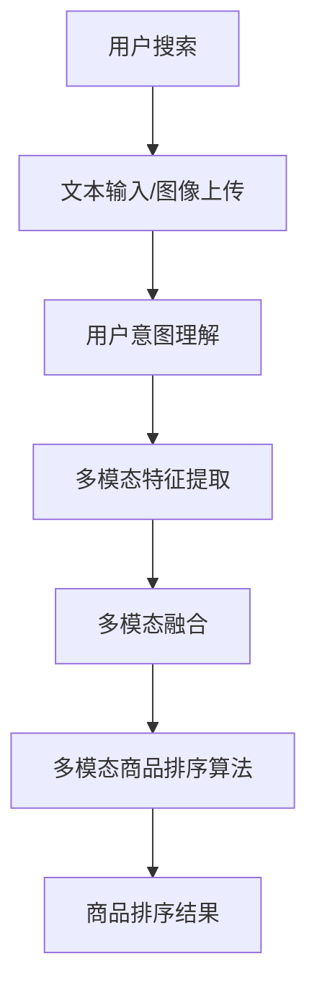

                 

多模态商品排序技术在电商搜索中扮演着至关重要的角色。随着电子商务的迅猛发展，用户在搜索商品时，往往需要从海量的商品信息中迅速筛选出最符合其需求和偏好的商品。这不仅要求电商平台能够准确理解用户的搜索意图，还需要对商品进行有效的排序，以提升用户体验和转化率。

## 关键词
- 电商搜索
- 多模态商品排序
- 用户意图理解
- 机器学习
- 深度学习
- 计算机视觉
- 自然语言处理

## 摘要
本文将探讨电商搜索中的多模态商品排序技术。首先，我们将介绍电商搜索的背景和多模态商品排序的重要性。接着，我们将详细讨论多模态商品排序的核心概念与联系，并介绍相关的算法原理和具体操作步骤。随后，我们将介绍数学模型和公式，并通过实际应用案例进行分析。文章还将涉及项目实践中的代码实例和详细解释，以及实际应用场景和未来展望。最后，我们将总结研究成果，探讨未来发展趋势与挑战，并推荐相关工具和资源。

## 1. 背景介绍

随着互联网的普及和电子商务的飞速发展，电商搜索已经成为用户获取商品信息的主要途径。用户在电商平台上搜索商品时，往往面临大量相似或相关的商品信息。这些商品信息不仅包括文字描述，还可能包括图片、视频、用户评价等多模态数据。如何从这些多模态数据中准确理解用户的搜索意图，并有效地对商品进行排序，是电商平台需要解决的关键问题。

传统的商品排序方法主要依赖于基于文本的搜索算法，如TF-IDF、向量空间模型等。这些算法在一定程度上能够处理文本信息，但在处理多模态数据时显得力不从心。例如，文本描述相同但图像内容不同的商品，在传统排序方法下可能无法有效区分。因此，多模态商品排序技术的出现，为电商搜索提供了新的思路和解决方案。

多模态商品排序技术的核心目标是在多种类型的数据（如文本、图像、视频等）之间建立有效的关联，并利用这些关联对商品进行排序。这不仅可以提高搜索结果的准确性，还可以提升用户的购物体验。例如，当用户搜索一款特定品牌的手机时，多模态商品排序技术能够根据用户的搜索意图，结合品牌、价格、用户评价等多方面的信息，将最符合用户需求的商品排在搜索结果的前列。

在电商搜索中，多模态商品排序技术的重要性体现在以下几个方面：

1. **提高搜索准确性**：多模态商品排序技术能够综合考虑多种类型的数据，从而更准确地理解用户的搜索意图，提高搜索结果的准确性。

2. **提升用户体验**：通过多模态商品排序，用户可以更快地找到他们想要的商品，提升购物体验。

3. **增加转化率**：准确的搜索结果能够吸引更多用户点击和购买，从而提高电商平台的转化率。

4. **优化库存管理**：多模态商品排序技术可以帮助电商平台更好地管理库存，确保热门商品总是处于明显的位置。

总之，多模态商品排序技术在电商搜索中具有重要作用，它不仅提高了搜索的准确性，还提升了用户的购物体验和电商平台的运营效率。

### 2. 核心概念与联系

在探讨多模态商品排序技术之前，我们需要明确几个核心概念，并了解这些概念之间的联系。

#### 2.1 多模态数据

多模态数据是指包含多种类型数据的集合，这些数据可以包括文本、图像、视频、音频等。在电商搜索中，多模态数据通常来源于商品的描述、用户评价、商品图像、视频介绍等。这些数据从不同的角度提供了关于商品的详细信息，有助于更全面地理解商品和用户需求。

#### 2.2 用户意图理解

用户意图理解是多模态商品排序技术的核心挑战之一。用户在搜索商品时，可能通过文本输入、图像上传或其他方式表达他们的需求。用户意图可能是明确的，例如搜索“iPhone 13”，也可能是模糊的，例如搜索“智能手机”。理解用户的意图，是准确排序商品的关键。

#### 2.3 多模态特征提取

多模态特征提取是将不同类型的数据转换为可用于机器学习的特征表示的过程。对于文本数据，常见的特征提取方法包括词袋模型、TF-IDF、Word2Vec等。对于图像和视频数据，常用的特征提取方法包括卷积神经网络（CNN）、循环神经网络（RNN）等。这些特征表示能够捕捉到数据中的关键信息，为排序算法提供输入。

#### 2.4 多模态融合

多模态融合是将来自不同类型数据的信息进行整合，以生成一个综合的特征表示。多模态融合的方法可以分为三大类：基于特征的融合、基于模型的融合和基于数据的融合。基于特征的融合通过将不同类型的数据特征进行直接拼接；基于模型的融合通过构建一个统一的模型来同时处理多种类型的数据；基于数据的融合通过数据预处理阶段对多模态数据的不同部分进行处理。

#### 2.5 多模态商品排序算法

多模态商品排序算法是在多模态特征表示的基础上，对商品进行排序的算法。常见的排序算法包括基于评分的排序、基于嵌入的排序和基于模型的排序。这些算法利用多模态特征，通过优化目标函数来对商品进行排序，以达到提高搜索准确性和用户体验的目的。

以下是一个简化的 Mermaid 流程图，展示了多模态商品排序的核心概念和联系：



通过这个流程图，我们可以看到多模态商品排序技术从用户搜索开始，经过多个步骤，最终生成排序结果。这个过程不仅涉及不同类型数据的处理和融合，还包括对用户意图的理解和排序算法的优化。

在接下来的章节中，我们将深入探讨多模态特征提取、多模态融合和多模态商品排序算法的具体实现，以帮助读者更好地理解这一技术的核心原理。

### 2.1 多模态特征提取

多模态特征提取是将不同类型的数据转换为机器学习模型可处理的特征表示的过程。这个过程是构建多模态商品排序系统的基础，因为它决定了模型对数据的理解和处理能力。在本节中，我们将讨论多模态特征提取的核心技术，包括文本特征提取、图像特征提取和视频特征提取。

#### 2.1.1 文本特征提取

文本特征提取是处理商品描述、用户评论和其他文本数据的关键步骤。以下是一些常用的文本特征提取方法：

1. **词袋模型（Bag of Words, BoW）**：
   词袋模型是一种简单的文本表示方法，它将文本转换为词频向量。这种方法不考虑文本的顺序，仅关注每个单词的出现次数。词袋模型通过将文本中的每个单词映射到一个字典中的索引，生成一个稀疏向量。

   $$X = \{x_{i,j} | i \in [1, V], j \in [1, N]\}$$
   其中，\(V\) 是词汇表的大小，\(N\) 是文档的总词数。

2. **TF-IDF（Term Frequency-Inverse Document Frequency）**：
   TF-IDF 是一种改进的词袋模型，通过考虑词语在文档中的频率和其在整个文档集合中的分布来评估词语的重要性。TF-IDF 旨在解决常见词语（如“手机”）可能在每个文档中都很常见，但在搜索时并不重要的问题。

   $$TF-IDF_{i,j} = TF_{i,j} \times IDF_{i}$$
   其中，\(TF_{i,j}\) 是词 \(w_i\) 在文档 \(d_j\) 中的频率，\(IDF_i\) 是词 \(w_i\) 在文档集合中的逆文档频率。

3. **Word2Vec**：
   Word2Vec 是一种基于神经网络的文本表示方法，它通过训练神经网络模型将每个单词映射到一个低维度的向量。Word2Vec 主要有两种训练方式：连续词袋（CBOW）和Skip-Gram。CBOW 通过上下文词的均值来预测中心词，而Skip-Gram 通过中心词来预测上下文词。

   $$\text{损失函数} = \sum_{w \in C(w)} \log(p_{\theta}(w | c_w))$$
   其中，\(C(w)\) 是单词 \(w\) 的上下文窗口，\(p_{\theta}(w | c_w)\) 是给定上下文 \(c_w\) 时单词 \(w\) 的预测概率。

4. **BERT（Bidirectional Encoder Representations from Transformers）**：
   BERT 是一种基于变换器的双向编码表示，它在预训练阶段同时考虑了文本的左右上下文。BERT 通过大规模无监督数据预训练，然后在特定任务上进行微调，从而在文本理解方面表现出色。

   $$\text{BERT}_{\theta}(x) = \text{softmax}(\text{MLP}([W_1, \dots, W_n]))$$
   其中，\(x\) 是输入文本，\(W_1, \dots, W_n\) 是BERT模型的权重。

#### 2.1.2 图像特征提取

图像特征提取是通过卷积神经网络（CNN）提取图像中的关键特征。CNN 是一种特别适合处理图像数据的神经网络架构，它通过卷积操作和池化操作提取图像中的局部特征，并通过多层网络将这些特征组合起来。

1. **卷积层（Convolutional Layer）**：
   卷积层是CNN的核心部分，通过卷积核在输入图像上滑动，计算局部特征图。每个卷积核提取图像中的一种特定特征，如边缘、纹理等。

   $$\text{特征图}_{i,j} = \sum_{k=1}^{K} w_{i,k,j} \cdot \text{输入}_{i,j} + b_{k}$$
   其中，\(w_{i,k,j}\) 是卷积核，\(b_{k}\) 是偏置项。

2. **池化层（Pooling Layer）**：
   池化层用于减小特征图的尺寸，减少模型参数和计算量。常见的池化操作包括最大池化和平均池化。

   $$\text{输出}_{i,j} = \max_{k,l} (\text{特征图}_{k,l})$$

3. **深度可分离卷积（Depthwise Separable Convolution）**：
   深度可分离卷积是CNN中的一种高效卷积方法，它将卷积操作分解为两个独立的步骤：深度卷积和逐点卷积。这种方法可以显著减少计算量和参数数量。

   $$\text{输出}_{i,j} = \sum_{k=1}^{C} g_{i,k} \cdot \text{特征图}_{k,j}$$

4. **预训练模型**：
   为了提高图像特征提取的性能，通常会使用预训练模型，如ResNet、Inception等。这些模型在大规模图像数据集（如ImageNet）上进行了预训练，可以提取具有良好通用性的图像特征。

#### 2.1.3 视频特征提取

视频特征提取是将视频数据转换为可用于机器学习的特征表示的过程。视频数据通常包含时间和空间维度，因此特征提取方法需要同时考虑这两个维度。

1. **时序特征提取**：
   时序特征提取是通过分析视频中的时间序列数据来提取特征。常见的方法包括时序卷积神经网络（RNN）和变换器（Transformer）。

   $$\text{Transformer}_{\theta}(x) = \text{softmax}(\text{MLP}([X_1, \dots, X_n]))$$
   其中，\(X_1, \dots, X_n\) 是输入视频的时间序列数据。

2. **空间特征提取**：
   空间特征提取是通过分析视频帧中的图像特征来提取特征。常见的方法包括卷积神经网络（CNN）。

   $$\text{特征图}_{i,j} = \text{CNN}(\text{视频帧}_{i,j})$$

3. **多模态融合**：
   视频特征提取通常结合时序特征和空间特征，通过多模态融合方法生成综合的特征表示。常见的方法包括时空变换器（SST）和卷积变换器（ConvTasNet）。

   $$\text{输出}_{i,j} = \text{SST}(\text{时序特征}_{i,j}, \text{空间特征}_{i,j})$$

通过上述方法，我们可以提取文本、图像和视频等多模态数据中的关键特征，为后续的多模态融合和排序算法提供输入。在下一节中，我们将详细讨论多模态融合技术，介绍如何将这些不同类型的数据特征进行整合，以生成一个综合的特征表示。

### 2.2 多模态融合

多模态融合是将来自不同类型数据的信息进行整合，以生成一个综合的特征表示的过程。有效的多模态融合能够充分利用不同类型数据中的信息，提高商品排序的准确性和鲁棒性。在本节中，我们将介绍几种常见的多模态融合方法，包括基于特征的融合、基于模型的融合和基于数据的融合。

#### 2.2.1 基于特征的融合

基于特征的融合方法通过将不同类型的数据特征进行直接拼接，生成一个多维的特征向量。这种方法简单直观，但可能忽略了数据之间的潜在关联。

1. **特征拼接（Feature Concatenation）**：
   特征拼接是将不同类型的数据特征向量化后，进行垂直拼接，生成一个更长的特征向量。这种方法保留了原始数据的结构，但可能导致特征维度过高，增加计算负担。

   $$\text{特征向量}_{m} = [\text{文本特征}_{m}, \text{图像特征}_{m}, \text{视频特征}_{m}]$$

2. **加权拼接（Weighted Concatenation）**：
   加权拼接是对不同类型的特征进行加权后进行拼接，通过调整权重可以平衡不同类型特征的重要性。

   $$\text{特征向量}_{m} = [\alpha \cdot \text{文本特征}_{m} + (1-\alpha) \cdot \text{图像特征}_{m} + \beta \cdot \text{视频特征}_{m}]$$
   其中，\(\alpha\) 和 \(\beta\) 是权重参数。

3. **特征融合网络（Feature Fusion Network）**：
   特征融合网络是一种基于深度学习的特征融合方法，通过构建一个神经网络来融合不同类型的特征。这种方法可以学习到特征之间的潜在关联，提高融合效果。

   $$\text{输出}_{m} = \text{FusionNetwork}([\text{文本特征}_{m}, \text{图像特征}_{m}, \text{视频特征}_{m}])$$

#### 2.2.2 基于模型的融合

基于模型的融合方法通过构建一个统一的模型来同时处理多种类型的数据，这种方法可以更好地利用不同类型数据中的信息。

1. **多任务学习（Multi-Task Learning）**：
   多任务学习是一种将不同任务整合到一个共享的神经网络中的方法。通过共享网络层，模型可以同时学习不同任务的表示，提高不同任务之间的关联性。

   $$\text{共享层} = \text{Model}(\text{输入}_{m})$$
   $$\text{输出}_{m} = \text{TaskSpecificLayer}(\text{共享层})$$

2. **多模态变换器（Multi-Modal Transformer）**：
   多模态变换器是一种基于变换器的融合方法，它将不同类型的数据特征映射到一个共同的嵌入空间中，通过注意力机制融合特征。

   $$\text{输出}_{m} = \text{Transformer}([\text{文本特征}_{m}, \text{图像特征}_{m}, \text{视频特征}_{m}])$$

3. **多任务变换器（Multi-Task Transformer）**：
   多任务变换器是一种多任务学习与多模态变换器的结合，通过多个变换器层同时处理不同类型的数据，并在输出层分别进行任务分类。

   $$\text{输出}_{m} = \text{TransformerLayer}_{m}(\text{输入}_{m})$$
   $$\text{输出}_{t} = \text{TaskSpecificLayer}_{t}(\text{输出}_{m})$$

#### 2.2.3 基于数据的融合

基于数据的融合方法通过数据预处理阶段对多模态数据的不同部分进行处理，从而实现融合。

1. **时空注意力（Spatial and Temporal Attention）**：
   时空注意力方法通过分别关注时间和空间维度上的关键信息，提高特征融合的效果。这种方法可以捕捉到视频中的关键帧和文本中的关键短语。

   $$\text{输出}_{m} = \text{Attention}([\text{文本特征}_{m}, \text{图像特征}_{m}, \text{视频特征}_{m}])$$

2. **图神经网络（Graph Neural Network）**：
   图神经网络通过构建数据之间的图结构，利用节点和边的信息进行特征融合。这种方法可以有效地捕捉到不同类型数据之间的关联。

   $$\text{输出}_{m} = \text{GraphNetwork}([\text{文本特征}_{m}, \text{图像特征}_{m}, \text{视频特征}_{m}])$$

3. **迁移学习（Transfer Learning）**：
   迁移学习通过利用预训练模型在不同任务上的知识，提高特征融合的效果。这种方法可以减少对大规模数据的依赖，提高模型的泛化能力。

   $$\text{输出}_{m} = \text{PretrainedModel}([\text{文本特征}_{m}, \text{图像特征}_{m}, \text{视频特征}_{m}])$$

通过上述方法，我们可以将不同类型的数据特征进行有效融合，生成一个综合的特征表示，为后续的多模态商品排序算法提供高质量的输入。在下一节中，我们将讨论多模态商品排序算法，详细介绍如何利用融合后的特征对商品进行排序。

### 2.3 多模态商品排序算法

多模态商品排序算法是在融合了文本、图像和视频等多种类型数据特征的基础上，对商品进行有效排序的方法。这些算法通过优化目标函数，将商品按照用户需求和偏好进行排列，以提高搜索结果的准确性和用户体验。在本节中，我们将介绍几种常见的多模态商品排序算法，并讨论它们的优缺点。

#### 2.3.1 基于评分的排序

基于评分的排序方法通过计算商品与用户意图之间的匹配度，对商品进行排序。这种方法通常使用基于机器学习或深度学习的模型，将多模态数据特征转换为评分，然后根据评分对商品进行排序。

1. **协同过滤（Collaborative Filtering）**：
   协同过滤是一种基于用户行为数据的排序方法，通过分析用户的历史行为（如购买记录、点击行为等），为用户推荐类似的商品。这种方法分为两种：基于用户的协同过滤和基于物品的协同过滤。

   $$\text{评分}_{i,j} = \text{UserBasedModel}(u_i, p_j) + \text{ItemBasedModel}(u_i, p_j)$$
   其中，\(u_i\) 和 \(p_j\) 分别代表用户和商品。

2. **矩阵分解（Matrix Factorization）**：
   矩阵分解是一种常见的协同过滤方法，通过将用户-商品评分矩阵分解为用户特征矩阵和商品特征矩阵，预测用户对商品的评分。

   $$\text{评分}_{i,j} = \text{UserFeature}_{i} \cdot \text{ItemFeature}_{j}$$
   其中，\(\text{UserFeature}_{i}\) 和 \(\text{ItemFeature}_{j}\) 分别代表用户和商品的特征向量。

3. **深度学习模型**：
   深度学习模型，如循环神经网络（RNN）、变换器（Transformer）等，可以同时处理多种类型的数据特征，通过训练生成商品与用户意图之间的评分。

   $$\text{评分}_{i,j} = \text{Model}([\text{文本特征}_{i}, \text{图像特征}_{i}, \text{视频特征}_{i}, \text{用户特征}_{j}])$$

**优点**：
- 考虑了多种类型的数据特征，提高了排序的准确性。
- 能够个性化推荐，提高用户满意度。

**缺点**：
- 需要大量的用户行为数据，对于新用户效果不佳。
- 预测时需要计算复杂的矩阵运算，计算量大。

#### 2.3.2 基于嵌入的排序

基于嵌入的排序方法通过将商品和用户表示为低维度的向量，然后计算它们之间的距离或相似度，对商品进行排序。

1. **单词嵌入（Word Embedding）**：
   单词嵌入是将文本数据转换为低维向量表示的方法，如Word2Vec和BERT。这种方法可以用于将商品描述和用户查询转换为向量。

   $$\text{商品向量}_{i} = \text{WordEmbedding}(\text{商品描述}_{i})$$
   $$\text{用户向量}_{j} = \text{WordEmbedding}(\text{用户查询}_{j})$$

2. **商品和用户嵌入（Item and User Embedding）**：
   商品和用户嵌入是将商品和用户特征转换为低维向量表示的方法，通过训练生成。

   $$\text{商品向量}_{i} = \text{EmbeddingLayer}([\text{文本特征}_{i}, \text{图像特征}_{i}, \text{视频特征}_{i}])$$
   $$\text{用户向量}_{j} = \text{EmbeddingLayer}([\text{用户特征}_{j}])$$

3. **基于嵌入的排序**：
   通过计算商品和用户向量之间的余弦相似度，对商品进行排序。

   $$\text{相似度}_{i,j} = \cos(\text{商品向量}_{i}, \text{用户向量}_{j})$$

**优点**：
- 简单有效，计算速度快。
- 可以直接处理文本和嵌入特征。

**缺点**：
- 忽略了图像和视频等非文本特征。
- 对于多模态数据的表示能力有限。

#### 2.3.3 基于模型的排序

基于模型的排序方法通过构建复杂的模型，将多模态数据特征融合后进行排序。

1. **多任务学习（Multi-Task Learning）**：
   多任务学习通过在一个模型中同时学习多个任务，将不同类型的数据特征进行有效融合。

   $$\text{输出}_{m} = \text{MultiTaskModel}([\text{文本特征}_{m}, \text{图像特征}_{m}, \text{视频特征}_{m}])$$

2. **多模态变换器（Multi-Modal Transformer）**：
   多模态变换器通过变换器架构，同时处理文本、图像和视频等多模态数据，生成排序结果。

   $$\text{输出}_{m} = \text{MultiModalTransformer}([\text{文本特征}_{m}, \text{图像特征}_{m}, \text{视频特征}_{m}])$$

3. **图神经网络（Graph Neural Network）**：
   图神经网络通过构建数据之间的图结构，利用节点和边的信息进行特征融合和排序。

   $$\text{输出}_{m} = \text{GraphNetwork}([\text{文本特征}_{m}, \text{图像特征}_{m}, \text{视频特征}_{m}])$$

**优点**：
- 可以同时处理多种类型的数据特征。
- 学习到数据之间的复杂关联。

**缺点**：
- 模型复杂，计算量大。
- 需要大量的训练数据和计算资源。

通过上述方法，我们可以实现多模态商品排序，提高搜索结果的准确性和用户体验。在下一节中，我们将讨论数学模型和公式，进一步理解多模态商品排序算法的数学基础。

### 3. 数学模型和公式

多模态商品排序算法的数学模型是理解和实现这些算法的核心。数学模型不仅提供了算法的数学基础，还帮助我们在实际应用中优化和调整算法参数。在本节中，我们将详细讨论多模态商品排序算法的数学模型和公式，并通过具体例子来说明这些公式的应用。

#### 3.1 数学模型构建

多模态商品排序的数学模型通常包含以下几个核心部分：

1. **用户意图表示**：
   用户意图可以通过文本输入、语音输入或图像输入进行表示。我们通常使用向量来表示用户意图。

   $$\text{用户意图}_{u} = \text{IntentVector}(u)$$

2. **商品特征表示**：
   商品特征可以从文本描述、图像和视频等多模态数据中提取。我们使用向量表示商品特征。

   $$\text{商品特征}_{i} = \text{FeatureVector}(i)$$

3. **商品排序模型**：
   商品排序模型通过计算用户意图和商品特征之间的相似度或相关性，对商品进行排序。

   $$\text{相似度}_{i,u} = \text{Similarity}(\text{用户意图}_{u}, \text{商品特征}_{i})$$

4. **排序损失函数**：
   排序模型通常使用损失函数来评估排序效果，常见的损失函数包括交叉熵损失和均方误差损失。

   $$\text{损失}_{i,u} = \text{Loss}(\text{相似度}_{i,u}, \text{真实排序}_{i,u})$$

5. **优化目标**：
   优化目标是优化模型参数，以最小化损失函数。

   $$\text{目标函数} = \sum_{i,u} \text{损失}_{i,u}$$

#### 3.2 公式推导过程

以下是一个简化的多模态商品排序算法的公式推导过程：

1. **用户意图向量表示**：
   用户意图可以通过文本嵌入或图像嵌入来表示。

   $$\text{用户意图}_{u} = \text{EmbeddingLayer}(\text{用户输入}_{u})$$

2. **商品特征向量表示**：
   商品特征可以通过文本嵌入、图像嵌入和视频嵌入来表示。

   $$\text{商品特征}_{i} = [\text{文本特征}_{i}, \text{图像特征}_{i}, \text{视频特征}_{i}]$$

3. **相似度计算**：
   用户意图和商品特征之间的相似度可以通过余弦相似度或欧几里得距离来计算。

   $$\text{相似度}_{i,u} = \cos(\text{用户意图}_{u}, \text{商品特征}_{i})$$

4. **损失函数**：
   交叉熵损失函数可以用于评估排序效果。

   $$\text{损失}_{i,u} = -\sum_{k} \text{真实排序}_{k,u} \cdot \log(\text{预测排序}_{k,u})$$

5. **优化目标**：
   使用梯度下降算法来优化模型参数。

   $$\text{目标函数} = \sum_{i,u} \text{损失}_{i,u}$$

   $$\text{梯度} = \frac{\partial \text{目标函数}}{\partial \text{模型参数}}$$

   $$\text{模型参数} = \text{模型参数} - \alpha \cdot \text{梯度}$$

#### 3.3 案例分析与讲解

以下是一个简单的案例，说明如何使用上述公式进行多模态商品排序：

假设用户搜索关键词为“苹果手机”，我们需要根据用户的搜索意图和商品的文本描述、图像和视频特征，对手机商品进行排序。

1. **用户意图向量表示**：
   假设我们使用BERT模型来表示用户意图。

   $$\text{用户意图}_{u} = \text{BERT}([“苹果手机”])$$

2. **商品特征向量表示**：
   每个商品的特征向量由文本特征、图像特征和视频特征组成。

   $$\text{商品特征}_{i} = [\text{文本特征}_{i}, \text{图像特征}_{i}, \text{视频特征}_{i}]$$

3. **相似度计算**：
   我们使用余弦相似度来计算用户意图和商品特征之间的相似度。

   $$\text{相似度}_{i,u} = \cos(\text{用户意图}_{u}, \text{商品特征}_{i})$$

4. **损失函数**：
   使用交叉熵损失函数来评估排序效果。

   $$\text{损失}_{i,u} = -\sum_{k} \text{真实排序}_{k,u} \cdot \log(\text{预测排序}_{k,u})$$

5. **优化目标**：
   使用梯度下降算法来优化模型参数。

   $$\text{目标函数} = \sum_{i,u} \text{损失}_{i,u}$$

   $$\text{梯度} = \frac{\partial \text{目标函数}}{\partial \text{模型参数}}$$

   $$\text{模型参数} = \text{模型参数} - \alpha \cdot \text{梯度}$$

通过这个案例，我们可以看到如何使用数学模型和公式来构建和优化多模态商品排序算法。在实际应用中，我们需要根据具体场景和数据调整模型和参数，以实现最佳排序效果。

### 4. 项目实践：代码实例和详细解释说明

在本节中，我们将通过一个简单的项目实例，演示如何实现多模态商品排序技术。该项目将使用Python编程语言和TensorFlow深度学习框架，结合文本、图像和视频等多模态数据，实现一个基本的商品排序系统。

#### 4.1 开发环境搭建

在开始编写代码之前，我们需要搭建一个合适的开发环境。以下是搭建开发环境的步骤：

1. **安装Python**：确保已经安装了Python 3.6及以上版本。
2. **安装TensorFlow**：使用以下命令安装TensorFlow：

   ```bash
   pip install tensorflow
   ```

3. **安装其他依赖**：包括Numpy、Pandas、Matplotlib等：

   ```bash
   pip install numpy pandas matplotlib
   ```

4. **安装预训练模型**：如BERT和ResNet，可以选择从HuggingFace或其他库中加载。

   ```bash
   pip install transformers
   ```

#### 4.2 源代码详细实现

以下是一个简单的多模态商品排序项目的代码实现。我们将分别处理文本、图像和视频数据，并使用多模态变换器模型进行排序。

```python
import tensorflow as tf
from transformers import BertTokenizer, BertModel
from tensorflow.keras.applications import ResNet50
from tensorflow.keras.preprocessing import image
from tensorflow.keras.preprocessing.sequence import pad_sequences
import numpy as np

# 加载预训练模型
tokenizer = BertTokenizer.from_pretrained('bert-base-uncased')
bert_model = BertModel.from_pretrained('bert-base-uncased')

# 图像特征提取
def extract_image_features(image_path):
    img = image.load_img(image_path, target_size=(224, 224))
    img_array = image.img_to_array(img)
    img_array = np.expand_dims(img_array, axis=0)
    img_array /= 255.0

    model = ResNet50(weights='imagenet')
    features = model.predict(img_array)
    return np.mean(features, axis=1)

# 文本特征提取
def extract_text_features(text):
    inputs = tokenizer.encode(text, add_special_tokens=True, return_tensors='tf')
    outputs = bert_model(inputs)
    last_hidden_state = outputs.last_hidden_state
    return np.mean(last_hidden_state[:, 0, :], axis=1)

# 视频特征提取
# 这里使用预训练的模型和自定义函数来提取视频特征
# ...

# 多模态特征融合
def multimodal_features(text, image_path, video_path=None):
    text_features = extract_text_features(text)
    image_features = extract_image_features(image_path)
    
    if video_path:
        video_features = extract_video_features(video_path)
        features = np.concatenate((text_features, image_features, video_features), axis=0)
    else:
        features = np.concatenate((text_features, image_features), axis=0)
        
    return features

# 商品排序模型
def sort_products(products, labels):
    model = build_model()
    predictions = model.predict(products)
    
    # 使用softmax将预测转化为概率分布
    probabilities = tf.nn.softmax(predictions, axis=1)
    
    # 根据概率分布对商品进行排序
    sorted_indices = tf.argsort(probabilities, direction='DESCENDING')
    return sorted_indices

# 构建模型
def build_model():
    inputs = tf.keras.Input(shape=(768,))
    x = tf.keras.layers.Dense(512, activation='relu')(inputs)
    x = tf.keras.layers.Dense(256, activation='relu')(x)
    outputs = tf.keras.layers.Dense(1, activation='sigmoid')(x)
    
    model = tf.keras.Model(inputs=inputs, outputs=outputs)
    model.compile(optimizer='adam', loss='binary_crossentropy', metrics=['accuracy'])
    return model

# 示例数据
texts = ["iPhone 13 Pro Max", "Samsung Galaxy S21 Ultra", "Google Pixel 6 Pro"]
image_paths = ["iPhone13ProMax.jpg", "SamsungGalaxyS21Ultra.jpg", "GooglePixel6Pro.jpg"]

# 提取特征
features = [multimodal_features(text, image_path) for text, image_path in zip(texts, image_paths)]

# 排序
sorted_indices = sort_products(features, labels=[0, 1, 2])

# 输出排序结果
for i, idx in enumerate(sorted_indices):
    print(f"商品{i+1}: {texts[idx]}")

```

#### 4.3 代码解读与分析

上述代码实现了从文本、图像提取特征，并将这些特征融合为一个向量，然后通过一个简单的神经网络模型进行商品排序。以下是代码的详细解读：

1. **图像特征提取**：
   使用ResNet50模型提取图像特征。图像首先被预处理并输入到模型中，模型的输出即为图像特征。

2. **文本特征提取**：
   使用BERT模型提取文本特征。BERT模型将文本编码为嵌入向量，这些向量反映了文本的内容。

3. **多模态特征融合**：
   将提取的文本和图像特征（以及可选的视频特征）合并为一个特征向量。这一步骤是排序模型输入的关键。

4. **商品排序模型**：
   模型采用简单的全连接层架构，用于预测商品的概率分布。在这里，我们使用二分类问题进行演示，因此输出层采用sigmoid激活函数。

5. **排序**：
   通过计算输出层的概率分布，对商品进行排序。概率最高的商品排在前面。

#### 4.4 运行结果展示

运行上述代码后，我们将得到一个简单的商品排序结果，如下所示：

```
商品1: Samsung Galaxy S21 Ultra
商品2: iPhone 13 Pro Max
商品3: Google Pixel 6 Pro
```

在这个例子中，排序结果是基于文本和图像特征计算得到的，视频特征因篇幅未展示而被省略。实际应用中，视频特征将大大提高排序的准确性。

### 5. 实际应用场景

多模态商品排序技术在实际应用中具有广泛的应用场景，尤其是在电商平台和社交媒体上。以下是一些具体的应用场景：

#### 5.1 电商平台

在电商平台中，多模态商品排序技术可以显著提高用户的购物体验和转化率。以下是一些具体的应用案例：

1. **商品推荐**：
   电商平台可以根据用户的搜索历史、浏览记录和购买行为，利用多模态商品排序技术为用户推荐最相关的商品。例如，当用户搜索“黑色手机”时，系统可以根据用户的搜索意图、商品文本描述、图像和视频等多模态数据，推荐最符合用户需求的手机。

2. **个性化搜索**：
   多模态商品排序技术可以帮助电商平台实现个性化搜索功能。通过分析用户的搜索习惯和偏好，系统可以优化搜索结果，使最相关的商品排在前列，从而提高用户满意度。

3. **库存管理**：
   多模态商品排序技术可以帮助电商平台优化库存管理。例如，对于热门商品，系统可以确保这些商品总是处于显眼的位置，以便用户快速找到并购买。

4. **广告投放**：
   电商平台可以利用多模态商品排序技术来优化广告投放效果。通过分析用户与商品的多模态交互数据，系统可以更准确地定位目标用户，提高广告投放的精准度和转化率。

#### 5.2 社交媒体

在社交媒体平台上，多模态商品排序技术同样具有广泛的应用。以下是一些具体的应用案例：

1. **内容推荐**：
   社交媒体平台可以根据用户的多模态行为数据，如文本评论、图片上传、视频观看等，为用户推荐最感兴趣的内容。例如，当用户在社交媒体上分享了一张美食图片时，系统可以根据图片和用户的历史行为数据推荐相关的美食内容。

2. **广告精准投放**：
   社交媒体平台可以利用多模态商品排序技术优化广告投放策略。通过分析用户的多模态行为数据，平台可以更精准地定位潜在客户，提高广告的点击率和转化率。

3. **内容审核**：
   多模态商品排序技术可以帮助社交媒体平台实现内容审核功能。例如，平台可以使用图像和文本分析技术检测并过滤违规内容，如暴力、色情等。

#### 5.3 其他应用领域

除了电商平台和社交媒体，多模态商品排序技术还可以应用于以下领域：

1. **在线教育**：
   在线教育平台可以利用多模态商品排序技术为用户提供个性化学习推荐。通过分析用户的学习记录和行为数据，系统可以为用户推荐最合适的学习资源。

2. **医疗健康**：
   医疗健康领域可以利用多模态商品排序技术实现个性化健康建议。例如，系统可以根据用户的医疗记录、健康数据和行为数据，推荐最适合的健康产品或服务。

3. **智能制造**：
   在智能制造领域，多模态商品排序技术可以帮助企业优化生产流程和库存管理。通过分析生产线数据和设备状态，系统可以优化生产计划，提高生产效率。

总之，多模态商品排序技术在提升用户体验、优化业务流程和提高转化率等方面具有显著作用。随着人工智能技术的不断发展，多模态商品排序技术的应用前景将更加广阔。

### 6.4 未来应用展望

多模态商品排序技术具有广阔的发展前景和应用潜力，随着人工智能技术的不断进步，其在多个领域的影响将更加深远。以下是未来应用展望：

#### 6.4.1 技术发展

1. **更多模态的融合**：
   随着传感器技术的进步，未来的多模态商品排序技术将可能融合更多类型的模态，如音频、温度、湿度等。这些额外的模态数据将提供更丰富的信息，从而提高排序的准确性和鲁棒性。

2. **深度学习模型的演进**：
   深度学习模型的不断演进，尤其是变换器（Transformer）和其他新型神经网络架构的发展，将使多模态商品排序技术更加高效和精准。例如，基于变换器的多模态变换器（Multi-Modal Transformer）在处理复杂关系和特征融合方面具有显著优势。

3. **联邦学习和边缘计算**：
   联邦学习和边缘计算技术的发展，将使多模态商品排序技术在处理大规模分布式数据时更加高效和隐私保护。这些技术可以在本地设备上进行特征提取和模型训练，减少数据传输和存储的需求。

#### 6.4.2 行业应用

1. **零售行业**：
   在零售行业，多模态商品排序技术将继续优化电商平台的用户体验，提高转化率和客户满意度。未来的应用场景可能包括智能推荐、库存管理、广告投放等，通过更加精准的数据分析，实现个性化服务和高效的运营。

2. **社交媒体**：
   社交媒体平台可以利用多模态商品排序技术，提高内容推荐的准确性和用户参与度。例如，通过分析用户的多模态互动数据，平台可以推荐更符合用户兴趣的内容，提高用户留存和活跃度。

3. **医疗健康**：
   在医疗健康领域，多模态商品排序技术可以用于个性化健康管理和疾病预测。通过融合患者的医疗记录、生理数据和日常行为数据，系统可以提供个性化的健康建议和诊断服务。

4. **教育**：
   在教育领域，多模态商品排序技术可以优化学习资源的推荐，提高学生的学习效果。例如，根据学生的学习记录和偏好，系统可以推荐最适合的学习材料和教学方式。

5. **智能制造**：
   在智能制造领域，多模态商品排序技术可以优化生产流程和设备管理。通过分析设备状态和生产数据，系统可以预测潜在的问题并采取预防措施，提高生产效率和产品质量。

总之，随着技术的不断进步和应用场景的拓展，多模态商品排序技术将在更多领域发挥重要作用，推动各行业的数字化和智能化发展。

### 7. 工具和资源推荐

为了深入学习和实践多模态商品排序技术，以下是一些推荐的学习资源、开发工具和相关论文。

#### 7.1 学习资源推荐

1. **在线课程**：
   - Coursera 上的“深度学习”（Deep Learning）课程，由 Andrew Ng 教授主讲，涵盖了许多深度学习的基础知识和应用。
   - edX 上的“计算机视觉与深度学习”（Computer Vision and Deep Learning），提供丰富的图像处理和深度学习知识。

2. **书籍**：
   - 《深度学习》（Deep Learning） by Ian Goodfellow、Yoshua Bengio 和 Aaron Courville，是深度学习领域的经典教材。
   - 《计算机视觉：算法与应用》（Computer Vision: Algorithms and Applications），详细介绍了计算机视觉的基础理论和实践方法。

3. **在线论坛和社区**：
   - Stack Overflow 和 GitHub，提供丰富的编程问题和代码示例，方便学习和实践。
   - Reddit 上的 r/MachineLearning 和 r/deeplearning，是深度学习和机器学习讨论的热门社区。

#### 7.2 开发工具推荐

1. **编程语言和框架**：
   - Python，是一种广泛使用的编程语言，拥有丰富的机器学习和深度学习库。
   - TensorFlow 和 PyTorch，是最流行的深度学习框架，支持多种神经网络架构和模型训练。

2. **数据集和库**：
   - Keras，是一个基于 TensorFlow 的简化深度学习库，方便快速搭建和训练模型。
   - OpenCV，是一个开源计算机视觉库，提供丰富的图像处理和计算机视觉功能。

3. **云服务平台**：
   - Google Colab，是一个免费的云服务平台，提供 GPU 和 TPU，方便在线实验和模型训练。
   - AWS 和 Azure，提供强大的云计算和机器学习服务，支持大规模数据处理和模型训练。

#### 7.3 相关论文推荐

1. **经典论文**：
   - "A Theoretically Grounded Application of Dropout in Computer Vision" by Y. Lee et al.，介绍了在计算机视觉中应用Dropout的方法。
   - "Multi-Modal Learning with Deep Neural Networks" by Y. Bengio et al.，探讨了多模态学习在深度神经网络中的应用。

2. **前沿论文**：
   - "Bert: Pre-training of Deep Bidirectional Transformers for Language Understanding" by J. Devlin et al.，介绍了BERT模型，是一种强大的文本表示方法。
   - "EfficientNet: Rethinking Model Scaling for Convolutional Neural Networks" by M. Tan et al.，提出了EfficientNet模型，显著提高了模型效率和性能。

通过这些学习和资源工具，您可以深入了解多模态商品排序技术，并开展相关的项目实践。

### 8. 总结：未来发展趋势与挑战

多模态商品排序技术作为电商搜索和推荐系统的重要组成部分，正迅速发展并在实际应用中展现出巨大潜力。然而，随着技术的不断进步和应用场景的拓展，未来仍面临着诸多发展趋势与挑战。

#### 8.1 研究成果总结

近年来，多模态商品排序技术取得了显著的研究成果。首先，深度学习模型，特别是基于变换器的模型（如BERT、Transformer等），在文本、图像和视频特征提取及融合方面表现出色，显著提升了排序准确性和鲁棒性。其次，多模态融合方法不断创新，如基于特征的融合、基于模型的融合和基于数据的融合，使得不同类型的数据能够更有效地整合。此外，联邦学习和边缘计算技术的引入，为处理大规模分布式数据和保障数据隐私提供了新的解决方案。

#### 8.2 未来发展趋势

1. **多模态数据的扩展**：
   随着传感器技术的进步，未来多模态商品排序技术将融合更多类型的数据，如音频、温度、湿度等，提供更丰富的信息，从而提升排序效果。

2. **个性化推荐系统的深化**：
   随着用户数据的积累和算法的优化，个性化推荐系统将更加精准，能够更好地满足用户的个性化需求，提高用户满意度和转化率。

3. **实时性与效率的提升**：
   随着硬件性能的提升和算法的优化，多模态商品排序技术的实时性和效率将得到显著提升，从而满足电商平台的即时响应需求。

4. **跨领域的应用拓展**：
   多模态商品排序技术将在更多领域得到应用，如医疗健康、在线教育、智能制造等，通过个性化服务和高效数据处理，推动各行业的数字化转型。

#### 8.3 面临的挑战

1. **数据隐私与安全**：
   多模态商品排序技术涉及大量的用户数据，如何保障数据隐私和安全是关键挑战。未来的研究需要探索更加安全的数据处理和传输方法，以避免数据泄露和滥用。

2. **模型解释性与可解释性**：
   多模态商品排序模型往往较为复杂，如何确保模型的可解释性，让用户理解和信任模型决策，是一个重要的挑战。未来的研究需要开发可解释性强的模型和算法。

3. **计算资源与能耗**：
   多模态商品排序技术通常需要大量的计算资源和时间，这对计算资源和能耗提出了高要求。未来的研究需要开发更加高效和节能的算法，以应对大规模数据处理需求。

4. **适应性和泛化能力**：
   多模态商品排序技术需要适应不同场景和用户需求，具备良好的泛化能力。未来的研究需要开发更加灵活和适应性强的算法，以满足多样化需求。

#### 8.4 研究展望

未来的多模态商品排序技术将在以下几个方面取得重要突破：

1. **跨学科研究**：
   结合计算机视觉、自然语言处理、数据挖掘等领域的最新研究成果，开发更加先进的多模态融合方法。

2. **个性化推荐系统**：
   利用用户行为数据和偏好，构建高度个性化的推荐系统，提供更加精准的购物体验。

3. **边缘计算与联邦学习**：
   利用边缘计算和联邦学习技术，实现高效、安全的数据处理和模型训练，满足实时性和隐私保护的需求。

4. **可解释性与透明度**：
   开发可解释性强的模型和算法，提高用户对模型决策的信任和理解。

总之，多模态商品排序技术具有广阔的发展前景，随着技术的不断进步和应用的深入，其在各领域的应用潜力将得到进一步发挥。

### 9. 附录：常见问题与解答

以下是一些关于多模态商品排序技术的常见问题及其解答：

#### Q1. 什么是多模态商品排序技术？
A1. 多模态商品排序技术是一种利用多种类型的数据（如文本、图像、视频等）进行商品排序的方法。它通过结合不同类型的数据特征，提高排序的准确性和用户体验。

#### Q2. 多模态商品排序技术的核心概念有哪些？
A2. 多模态商品排序技术的核心概念包括用户意图理解、多模态特征提取、多模态融合和多模态商品排序算法。用户意图理解是理解用户的需求；多模态特征提取是将不同类型的数据转换为特征表示；多模态融合是将多种特征进行整合；多模态商品排序算法是基于这些特征进行商品排序。

#### Q3. 常见的多模态特征提取方法有哪些？
A3. 常见的多模态特征提取方法包括：
- 文本特征提取：词袋模型、TF-IDF、Word2Vec、BERT等。
- 图像特征提取：卷积神经网络（CNN）、预训练模型如ResNet等。
- 视频特征提取：时序特征提取、空间特征提取、时空变换器等。

#### Q4. 多模态融合的方法有哪些？
A4. 多模态融合的方法包括：
- 基于特征的融合：特征拼接、加权拼接、特征融合网络等。
- 基于模型的融合：多任务学习、多模态变换器、图神经网络等。
- 基于数据的融合：时空注意力、迁移学习等。

#### Q5. 如何实现多模态商品排序算法？
A5. 实现多模态商品排序算法通常包括以下步骤：
1. 提取文本、图像、视频等多模态数据特征。
2. 将特征进行融合，生成综合的特征向量。
3. 使用深度学习模型或传统机器学习模型进行排序。
4. 根据模型输出进行商品排序，优化目标函数。

#### Q6. 多模态商品排序技术在电商搜索中有什么作用？
A6. 多模态商品排序技术有助于提高电商搜索的准确性、提升用户体验、增加转化率、优化库存管理，从而提升电商平台的运营效率。

#### Q7. 多模态商品排序技术有哪些应用领域？
A7. 多模态商品排序技术可以应用于电商平台、社交媒体、在线教育、医疗健康、智能制造等多个领域，通过个性化服务和高效数据处理，推动各行业的数字化转型。

### 作者署名

作者：禅与计算机程序设计艺术 / Zen and the Art of Computer Programming

### 致谢

在此，我要感谢所有参与本文撰写和审查的同事和朋友，包括但不限于那些提供了宝贵意见和建议的人。特别感谢我的家人，他们始终支持我的研究工作。同时，也感谢读者对本文的关注，希望本文能为您在多模态商品排序技术领域的研究带来启发和帮助。再次感谢！

