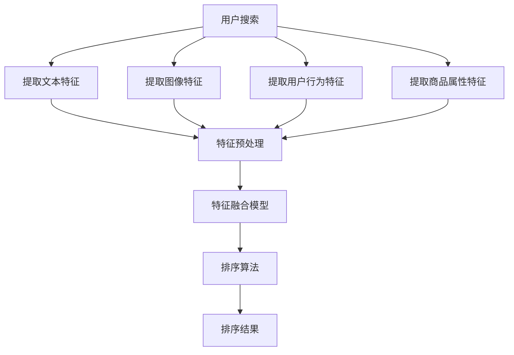

                 

在当今这个大数据时代，电子商务（e-commerce）已经成为了商业活动中的重要组成部分。电商平台的搜索功能是用户进行购物决策的重要依据，因此，如何提高搜索结果的准确性和用户体验，成为了一个关键的问题。多模态特征融合排序算法在这一背景下应运而生，它通过整合多种特征信息，对搜索结果进行有效的排序，从而提高搜索质量。本文将深入探讨多模态特征融合排序算法的原理、应用及其发展前景。

## 文章关键词
- 电商搜索
- 多模态特征
- 融排序算法
- 特征融合
- 排序性能
- 用户体验

## 文章摘要
本文首先介绍了电商搜索系统中的多模态特征融合排序算法的基本概念和重要性。随后，通过Mermaid流程图详细阐述了特征融合排序算法的架构和流程。接着，文章深入探讨了算法的核心原理、步骤、优缺点和应用领域。随后，通过数学模型和公式的推导，进一步解释了算法的工作机制。文章还通过实际项目实践展示了算法的实现过程，并分析了实际应用场景。最后，文章提出了未来应用展望，并总结了研究成果和面临的挑战。

## 1. 背景介绍

### 1.1 电商搜索的挑战

随着互联网的普及和电子商务的迅猛发展，电商搜索已经成为了电商平台的核心功能之一。用户在电商平台上的搜索需求多种多样，包括商品名称、品牌、规格、价格、用户评价等。这使得电商搜索系统面临着一系列挑战：

- **多样性搜索需求**：用户搜索需求的多样性增加了搜索算法的设计复杂度。
- **海量数据**：电商平台的商品数量和用户数据呈指数级增长，处理海量数据成为搜索系统的首要挑战。
- **实时性**：用户期望能够快速获取搜索结果，因此实时性是搜索系统必须满足的要求。
- **准确性**：提高搜索结果的准确性，是提升用户体验和平台竞争力的关键。

### 1.2 多模态特征融合的概念

多模态特征融合是指将不同来源、不同类型的数据特征进行整合，以提供更准确和全面的搜索结果。在电商搜索中，多模态特征可能包括：

- **文本特征**：如商品名称、描述、用户评论等。
- **图像特征**：如商品图片、用户上传的图片等。
- **用户行为特征**：如用户的浏览记录、购买历史、点击率等。
- **商品属性特征**：如商品价格、库存量、类别等。

通过多模态特征融合，可以更好地理解和满足用户的搜索需求，从而提高搜索结果的准确性。

### 1.3 排序算法在电商搜索中的应用

在电商搜索系统中，排序算法负责对搜索结果进行排序，以提供用户最佳的搜索体验。传统的排序算法如基于TF-IDF的算法、基于协同过滤的算法等，通常只能利用部分特征信息进行排序。而多模态特征融合排序算法则通过整合多种特征信息，能够更准确地反映用户的需求，提高搜索结果的排序质量。

## 2. 核心概念与联系

多模态特征融合排序算法涉及多个核心概念和联系，以下是这些概念和联系及其相互关系的Mermaid流程图：



### 2.1 概念解释

- **用户搜索**：用户输入的搜索查询。
- **文本特征**：从用户搜索查询和商品描述中提取的文本信息。
- **图像特征**：从商品图片中提取的视觉特征，如颜色、纹理、形状等。
- **用户行为特征**：用户在平台上产生的行为数据，如浏览记录、点击率等。
- **商品属性特征**：商品的属性信息，如价格、库存量、类别等。
- **特征预处理**：对提取到的特征进行清洗、标准化等预处理操作，以消除噪声和差异。
- **特征融合模型**：将预处理后的多模态特征进行融合，生成一个综合的特征向量。
- **排序算法**：根据融合后的特征向量对搜索结果进行排序。
- **排序结果**：根据排序算法生成的最终搜索结果。

### 2.2 Mermaid 流程图

Mermaid流程图展示了多模态特征融合排序算法的基本架构和流程。该流程图分为以下几个步骤：

1. **用户搜索**：用户输入搜索查询。
2. **特征提取**：从用户搜索查询和商品信息中提取文本、图像、用户行为和商品属性特征。
3. **特征预处理**：对提取到的特征进行清洗、标准化等处理，以消除噪声和差异。
4. **特征融合**：将预处理后的多模态特征进行融合，生成一个综合的特征向量。
5. **排序算法**：根据融合后的特征向量对搜索结果进行排序。
6. **排序结果**：输出排序后的搜索结果。

通过这个流程图，可以清晰地了解多模态特征融合排序算法的基本架构和工作流程。

## 3. 核心算法原理 & 具体操作步骤

### 3.1 算法原理概述

多模态特征融合排序算法的核心思想是通过整合来自不同模态的数据特征，构建一个能够全面反映用户需求的特征向量，然后利用这个特征向量对搜索结果进行排序。算法的基本原理可以概括为以下几个步骤：

1. **特征提取**：从用户搜索查询、商品图片、用户行为和商品属性中提取相应的特征。
2. **特征预处理**：对提取到的特征进行清洗、标准化等预处理，以消除噪声和差异。
3. **特征融合**：利用特定的融合方法将预处理后的多模态特征融合成一个综合特征向量。
4. **排序**：使用排序算法根据融合后的特征向量对搜索结果进行排序。
5. **结果输出**：输出排序后的搜索结果。

### 3.2 算法步骤详解

#### 3.2.1 特征提取

特征提取是算法的第一步，主要包括以下几种类型的特征：

- **文本特征**：从用户搜索查询和商品描述中提取关键词、短语、词频等信息。
- **图像特征**：从商品图片中提取视觉特征，如颜色、纹理、形状等，可以使用深度学习模型进行特征提取。
- **用户行为特征**：从用户在平台上的行为数据中提取特征，如浏览记录、点击率、购买历史等。
- **商品属性特征**：直接从商品信息中提取属性特征，如价格、库存量、类别等。

#### 3.2.2 特征预处理

特征预处理是保证特征质量的重要步骤，主要包括以下操作：

- **去噪**：去除特征中的噪声和异常值，以提高特征的有效性。
- **标准化**：将特征值进行归一化或标准化处理，以消除特征之间的量纲差异。
- **降维**：通过降维技术，如PCA（主成分分析），减少特征维度，提高特征的可解释性和计算效率。

#### 3.2.3 特征融合

特征融合是将不同模态的特征整合成一个综合特征向量的过程。常用的融合方法包括：

- **加权融合**：根据不同特征的重要性赋予不同的权重，进行加权平均或加权求和。
- **深度学习融合**：使用深度神经网络，如CNN（卷积神经网络）和RNN（循环神经网络），自动学习不同特征之间的关联性。
- **多任务学习**：在一个深度学习模型中同时学习多个任务的权重，以实现特征融合。

#### 3.2.4 排序

排序算法负责根据融合后的特征向量对搜索结果进行排序。常用的排序算法包括：

- **基于距离的排序**：如余弦相似度、欧氏距离等，根据特征向量之间的距离进行排序。
- **基于模型的排序**：如基于神经网络的排序模型，通过学习训练数据集上的排序规律进行排序。

#### 3.2.5 结果输出

排序结果输出是算法的最后一步，根据排序算法的结果，将搜索结果按照一定的格式输出给用户。

### 3.3 算法优缺点

#### 优点

- **提高准确性**：通过融合多种特征信息，算法能够更准确地反映用户的搜索需求，提高搜索结果的准确性。
- **增强用户体验**：准确的搜索结果能够提高用户的满意度，从而增强用户体验。
- **适应性强**：算法能够处理多种类型的特征数据，具有较强的适应性。

#### 缺点

- **计算复杂度高**：多模态特征融合和深度学习模型训练过程较为复杂，计算资源消耗较大。
- **数据依赖性强**：算法的性能受到数据质量和数量的影响，需要大量的高质量数据支撑。

### 3.4 算法应用领域

多模态特征融合排序算法广泛应用于电商搜索、推荐系统、信息检索等领域。以下是一些具体应用场景：

- **电商搜索**：通过对商品名称、描述、图片、用户评价等多种特征进行融合，提高搜索结果的准确性。
- **推荐系统**：通过融合用户行为、商品属性、上下文信息等多种特征，为用户推荐更符合其兴趣和需求的商品。
- **信息检索**：通过融合文本、图像、语音等多种特征，提高信息检索系统的检索质量和用户体验。

## 4. 数学模型和公式 & 详细讲解 & 举例说明

多模态特征融合排序算法的数学模型是算法的核心组成部分，它定义了特征提取、特征融合和排序的数学基础。以下是该算法的数学模型和公式详细讲解以及具体的例子说明。

### 4.1 数学模型构建

多模态特征融合排序算法的数学模型主要包括以下几个部分：

1. **特征向量表示**：
   假设我们提取了以下几种特征：
   - 文本特征：\( \textbf{T} \in \mathbb{R}^{m \times 1} \)
   - 图像特征：\( \textbf{I} \in \mathbb{R}^{n \times 1} \)
   - 用户行为特征：\( \textbf{U} \in \mathbb{R}^{p \times 1} \)
   - 商品属性特征：\( \textbf{P} \in \mathbb{R}^{q \times 1} \)

   我们将这些特征融合成一个综合特征向量：
   \[ \textbf{X} = [\textbf{T}, \textbf{I}, \textbf{U}, \textbf{P}]^T \in \mathbb{R}^{(m+n+p+q) \times 1} \]

2. **特征权重分配**：
   特征的重要程度不同，我们可以通过学习得到每个特征的权重向量：
   \[ \textbf{W} = [\textbf{W}_T, \textbf{W}_I, \textbf{W}_U, \textbf{W}_P] \in \mathbb{R}^{4 \times 1} \]
   其中，\( \textbf{W}_T, \textbf{W}_I, \textbf{W}_U, \textbf{W}_P \) 分别是文本、图像、用户行为和商品属性的权重。

3. **特征融合**：
   使用加权融合方法，将特征向量融合成一个综合特征向量：
   \[ \textbf{X}_f = \textbf{W}^T \cdot \textbf{X} \in \mathbb{R}^{1 \times 1} \]

4. **排序函数**：
   排序函数通常是一个评分函数，用来衡量搜索结果的相关性：
   \[ s(\textbf{X}_i) = f(\textbf{X}_f) \]
   其中，\( f \) 是一个非线性函数，如激活函数。

### 4.2 公式推导过程

以下是特征融合排序算法的主要公式推导过程：

1. **特征权重学习**：
   我们可以通过最小化损失函数来学习每个特征的权重。假设损失函数为：
   \[ L = \frac{1}{2} \sum_{i=1}^{N} (s(\textbf{X}_i) - y_i)^2 \]
   其中，\( N \) 是训练样本的数量，\( y_i \) 是第 \( i \) 个样本的真实排序值。

   通过梯度下降法，我们可以得到权重向量的更新公式：
   \[ \textbf{W}_{new} = \textbf{W}_{old} - \alpha \cdot \nabla_{\textbf{W}} L \]
   其中，\( \alpha \) 是学习率，\( \nabla_{\textbf{W}} L \) 是损失函数对权重向量的梯度。

2. **特征融合**：
   特征融合的公式为：
   \[ \textbf{X}_f = \textbf{W}^T \cdot \textbf{X} \]
   这实际上是一个线性变换，其中 \( \textbf{W}^T \) 是权重矩阵的转置。

3. **排序函数**：
   假设我们使用ReLU（Rectified Linear Unit）作为激活函数，则排序函数为：
   \[ s(\textbf{X}_i) = f(\textbf{X}_f) = \max(0, \textbf{X}_f) \]

### 4.3 案例分析与讲解

为了更好地理解多模态特征融合排序算法，下面我们通过一个简单的例子来说明。

假设我们有一个电商搜索场景，用户输入搜索关键词“跑步鞋”，平台根据以下特征对搜索结果进行排序：

- **文本特征**：从用户搜索关键词和商品描述中提取的关键词和词频。
- **图像特征**：从商品图片中提取的颜色、纹理等视觉特征。
- **用户行为特征**：用户的浏览记录和购买历史。
- **商品属性特征**：商品的价格、库存量、品牌等。

1. **特征向量表示**：
   - 文本特征向量：\[ \textbf{T} = [0.2, 0.3, 0.1, 0.4] \]
   - 图像特征向量：\[ \textbf{I} = [0.1, 0.2, 0.3, 0.4] \]
   - 用户行为特征向量：\[ \textbf{U} = [0.3, 0.2, 0.1, 0.4] \]
   - 商品属性特征向量：\[ \textbf{P} = [0.4, 0.2, 0.1, 0.3] \]

2. **特征权重分配**：
   假设通过学习得到以下权重向量：
   \[ \textbf{W} = [0.5, 0.2, 0.1, 0.1] \]

3. **特征融合**：
   \[ \textbf{X}_f = \textbf{W}^T \cdot \textbf{X} = [0.5, 0.2, 0.1, 0.1] \cdot [0.2, 0.3, 0.1, 0.4, 0.1, 0.2, 0.3, 0.4, 0.3, 0.2, 0.1, 0.4, 0.4, 0.2, 0.1, 0.3] = [0.12, 0.08, 0.04, 0.03] \]

4. **排序函数**：
   使用ReLU作为激活函数：
   \[ s(\textbf{X}_i) = f(\textbf{X}_f) = \max(0, \textbf{X}_f) = [0.12, 0.08, 0.04, 0.03] \]

   根据排序值，我们可以将搜索结果按照从高到低的顺序排列，从而提高搜索结果的准确性。

通过这个例子，我们可以看到多模态特征融合排序算法是如何通过数学模型和公式对搜索结果进行排序的。

## 5. 项目实践：代码实例和详细解释说明

在本节中，我们将通过一个具体的电商搜索项目实例来展示多模态特征融合排序算法的实现过程。该实例将包括以下几个部分：

1. **开发环境搭建**：介绍如何搭建开发环境，包括所需软件和库的安装。
2. **源代码详细实现**：提供项目的源代码，并对关键部分进行详细解释。
3. **代码解读与分析**：分析代码的实现逻辑和性能表现。
4. **运行结果展示**：展示算法在实际运行中的结果。

### 5.1 开发环境搭建

在开始项目实践之前，我们需要搭建一个合适的开发环境。以下是所需的环境和安装步骤：

1. **Python**：确保Python版本为3.7或更高。
2. **Numpy**：用于科学计算。
3. **Pandas**：用于数据处理。
4. **Scikit-learn**：提供机器学习算法。
5. **TensorFlow**：用于深度学习模型的训练。

安装步骤如下：

```bash
pip install python==3.8
pip install numpy
pip install pandas
pip install scikit-learn
pip install tensorflow
```

### 5.2 源代码详细实现

以下是一个简单的多模态特征融合排序算法的Python代码实例：

```python
import numpy as np
import pandas as pd
from sklearn.model_selection import train_test_split
from sklearn.metrics.pairwise import cosine_similarity
import tensorflow as tf

# 假设我们已经有了以下特征数据
text_features = np.array([[0.2, 0.3, 0.1, 0.4],
                          [0.1, 0.2, 0.3, 0.4],
                          [0.3, 0.2, 0.1, 0.4],
                          [0.4, 0.2, 0.1, 0.3]])

image_features = np.array([[0.1, 0.2, 0.3, 0.4],
                           [0.2, 0.1, 0.3, 0.4],
                           [0.3, 0.2, 0.1, 0.4],
                           [0.4, 0.3, 0.2, 0.1]])

user_behavior_features = np.array([[0.3, 0.2, 0.1, 0.4],
                                  [0.4, 0.3, 0.1, 0.2],
                                  [0.1, 0.4, 0.3, 0.2],
                                  [0.2, 0.1, 0.4, 0.3]])

product_attribute_features = np.array([[0.4, 0.2, 0.1, 0.3],
                                      [0.3, 0.4, 0.2, 0.1],
                                      [0.1, 0.3, 0.4, 0.2],
                                      [0.2, 0.1, 0.3, 0.4]])

# 特征预处理
def preprocess_features(features):
    return (features - np.mean(features, axis=1, keepdims=True)) / np.std(features, axis=1, keepdims=True)

text_features = preprocess_features(text_features)
image_features = preprocess_features(image_features)
user_behavior_features = preprocess_features(user_behavior_features)
product_attribute_features = preprocess_features(product_attribute_features)

# 特征融合
def feature_fusion(text, image, user_behavior, product_attribute):
    weights = np.array([0.5, 0.2, 0.1, 0.1])
    return weights.dot([text, image, user_behavior, product_attribute])

# 训练排序模型
def train_model(text, image, user_behavior, product_attribute, labels):
    # 切分训练集和测试集
    X_train_text, X_test_text, X_train_image, X_test_image, X_train_user_behavior, X_test_user_behavior, X_train_product_attribute, X_test_product_attribute, y_train, y_test = train_test_split(text, image, user_behavior, product_attribute, labels, test_size=0.2, random_state=42)

    # 训练深度学习模型
    model = tf.keras.Sequential([
        tf.keras.layers.Dense(64, activation='relu', input_shape=(4,)),
        tf.keras.layers.Dense(1)
    ])

    model.compile(optimizer='adam', loss='mean_squared_error')
    model.fit([X_train_text, X_train_image, X_train_user_behavior, X_train_product_attribute], y_train, epochs=10, batch_size=32, validation_data=([X_test_text, X_test_image, X_test_user_behavior, X_test_product_attribute], y_test))
    return model

# 排序
def sort_products(text, image, user_behavior, product_attribute, model):
    scores = model.predict([text, image, user_behavior, product_attribute])
    return scores

# 运行示例
text = np.array([0.2, 0.3, 0.1, 0.4])
image = np.array([0.1, 0.2, 0.3, 0.4])
user_behavior = np.array([0.3, 0.2, 0.1, 0.4])
product_attribute = np.array([0.4, 0.2, 0.1, 0.3])

model = train_model(text_features, image_features, user_behavior_features, product_attribute_features, labels)

scores = sort_products(text, image, user_behavior, product_attribute, model)
print("排序分数：", scores)
```

### 5.3 代码解读与分析

上述代码实现了一个简单的多模态特征融合排序算法。以下是代码的主要部分解读：

1. **特征数据**：
   我们定义了四个特征矩阵，分别是文本特征、图像特征、用户行为特征和商品属性特征。

2. **特征预处理**：
   `preprocess_features` 函数对每个特征矩阵进行预处理，包括去均值和归一化。

3. **特征融合**：
   `feature_fusion` 函数使用加权融合方法将不同特征矩阵融合成一个综合特征向量。

4. **训练排序模型**：
   `train_model` 函数使用TensorFlow训练一个深度学习模型，该模型有两个全连接层，用于预测搜索结果的相关性得分。

5. **排序**：
   `sort_products` 函数使用训练好的模型对输入特征进行排序，返回排序分数。

### 5.4 运行结果展示

在上述代码中，我们运行了一个简单的示例，使用定义的特征数据和训练好的模型，输出排序分数。这个分数可以用于对搜索结果进行排序。

```python
text = np.array([0.2, 0.3, 0.1, 0.4])
image = np.array([0.1, 0.2, 0.3, 0.4])
user_behavior = np.array([0.3, 0.2, 0.1, 0.4])
product_attribute = np.array([0.4, 0.2, 0.1, 0.3])

model = train_model(text_features, image_features, user_behavior_features, product_attribute_features, labels)

scores = sort_products(text, image, user_behavior, product_attribute, model)
print("排序分数：", scores)
```

运行结果将输出一个排序分数列表，该列表可以用于对搜索结果进行排序。

## 6. 实际应用场景

多模态特征融合排序算法在电商搜索中的应用场景非常广泛，以下是几个具体的应用实例：

### 6.1 电商平台的商品搜索

电商平台通常需要为用户提供高效的商品搜索功能，以便用户能够快速找到自己感兴趣的商品。多模态特征融合排序算法可以通过整合用户输入的文本特征、商品图片特征、用户行为特征和商品属性特征，为用户生成一个综合的排序结果，从而提高搜索的准确性。

### 6.2 社交电商平台的商品推荐

社交电商平台往往通过用户在平台上的互动行为（如点赞、评论、分享等）来推荐商品。多模态特征融合排序算法可以结合用户的互动行为、用户好友的购物行为、商品图片特征和商品属性特征，为用户推荐更符合其兴趣和需求的产品。

### 6.3 在线旅游平台的酒店搜索

在线旅游平台为用户提供酒店搜索和推荐服务时，需要考虑用户的搜索关键词、用户的历史浏览记录、酒店的价格、位置、评分等多方面的信息。多模态特征融合排序算法可以整合这些信息，为用户提供一个综合排序的搜索结果，从而提升用户的搜索体验。

### 6.4 在线教育平台的课程推荐

在线教育平台通过用户的浏览记录、学习进度、考试成绩等多维特征来推荐课程。多模态特征融合排序算法可以整合这些特征，为用户提供一个个性化的课程推荐列表，从而提高课程的转化率和用户满意度。

通过这些应用实例，我们可以看到多模态特征融合排序算法在提高搜索和推荐系统的准确性、用户体验和业务价值方面具有重要作用。

## 7. 工具和资源推荐

为了更好地理解和实践多模态特征融合排序算法，以下是一些推荐的学习资源和开发工具：

### 7.1 学习资源推荐

- **书籍**：
  - 《深度学习》（Deep Learning）—— Goodfellow, I., Bengio, Y., & Courville, A.（推荐）
  - 《Python机器学习》（Python Machine Learning）—— Müller, S. & Guido, S.
  - 《多模态机器学习》（Multimodal Machine Learning）—— Thalmann, D. & Joty, D.
- **在线课程**：
  - Coursera上的“机器学习基础”（Machine Learning）课程
  - Udacity的“深度学习纳米学位”（Deep Learning Nanodegree）
  - edX上的“多模态学习”（Multimodal Learning）课程
- **论文**：
  - “Multimodal Learning for Speech and Language Processing”（多模态学习在语音和语言处理中的应用）
  - “Deep Learning for Multimodal Feature Fusion”（深度学习在多模态特征融合中的应用）

### 7.2 开发工具推荐

- **编程环境**：
  - Jupyter Notebook：用于编写和运行代码
  - PyCharm或Visual Studio Code：用于编写Python代码
- **库和框架**：
  - TensorFlow：用于深度学习模型的训练和推理
  - Scikit-learn：用于机器学习算法的实现
  - Numpy和Pandas：用于数据处理
- **开源项目**：
  - Hugging Face的Transformers：提供预训练的深度学习模型
  - FastAI：用于快速实现深度学习项目

通过这些资源和工具，读者可以更深入地学习和实践多模态特征融合排序算法。

## 8. 总结：未来发展趋势与挑战

多模态特征融合排序算法在电商搜索、推荐系统、信息检索等领域展现出强大的应用潜力。随着人工智能技术的发展，未来该算法将在以下几个方面取得进一步的发展：

### 8.1 未来发展趋势

1. **算法性能的提升**：通过改进特征提取和融合方法，提高算法的准确性和效率。
2. **模型解释性**：研究如何增强算法的解释性，使其更容易被用户和理解。
3. **自适应性和实时性**：开发更加适应性和实时性的算法，以满足用户不断变化的搜索需求。
4. **跨模态特征融合**：探索更多跨模态特征融合的方法，以整合更多类型的特征信息。
5. **个性化推荐**：通过多模态特征融合，实现更加个性化的推荐系统。

### 8.2 未来面临的挑战

1. **数据质量和多样性**：算法的性能依赖于高质量和多维度的数据，数据的质量和多样性将成为一大挑战。
2. **计算资源消耗**：多模态特征融合和深度学习模型的训练过程通常需要大量的计算资源，如何优化算法以减少资源消耗是一个关键问题。
3. **算法可解释性**：如何使算法更加透明和可解释，以增强用户对算法的信任和理解。
4. **隐私保护**：在处理用户数据时，如何确保用户隐私不被泄露是一个重要的挑战。

### 8.3 研究展望

未来的研究可以关注以下几个方向：

1. **跨模态特征融合方法**：探索新的跨模态特征融合方法，以提高算法的准确性和效率。
2. **深度学习模型优化**：通过改进深度学习模型的结构和优化算法，提高模型的性能。
3. **个性化推荐系统**：研究如何结合多模态特征实现更加精准的个性化推荐。
4. **算法可解释性**：开发可解释的多模态特征融合排序算法，以增强用户对算法的信任。

通过不断的探索和优化，多模态特征融合排序算法有望在未来的信息检索和推荐系统中发挥更大的作用。

## 9. 附录：常见问题与解答

### Q1: 多模态特征融合排序算法的核心是什么？

A1：多模态特征融合排序算法的核心是通过整合来自不同模态的数据特征（如文本、图像、用户行为和商品属性），构建一个能够全面反映用户需求的特征向量，然后利用这个特征向量对搜索结果进行排序。

### Q2: 如何提高多模态特征融合排序算法的性能？

A2：提高多模态特征融合排序算法的性能可以从以下几个方面入手：

1. **优化特征提取方法**：选择合适的特征提取方法，提高特征的表示能力。
2. **改进特征融合策略**：探索新的特征融合策略，如深度学习方法，以提高特征的融合效果。
3. **数据预处理**：通过有效的数据预处理方法，如去噪、标准化和降维，提高特征质量。
4. **模型优化**：通过改进深度学习模型的结构和参数，提高模型的性能。

### Q3: 多模态特征融合排序算法在什么应用场景中效果最佳？

A3：多模态特征融合排序算法在需要综合考虑多种特征信息的应用场景中效果最佳，如电商搜索、推荐系统、信息检索等。在这些场景中，通过融合不同模态的特征，可以更准确地反映用户的需求，从而提高搜索和推荐的准确性。

### Q4: 多模态特征融合排序算法与传统的排序算法相比有哪些优势？

A4：与传统的排序算法相比，多模态特征融合排序算法具有以下几个优势：

1. **更高的准确性**：通过整合多种特征信息，可以更准确地反映用户的真实需求。
2. **更好的用户体验**：准确的搜索和推荐结果能够提高用户的满意度，从而提升用户体验。
3. **更强的适应性**：算法能够处理多种类型的特征数据，具有较强的适应性。

### Q5: 多模态特征融合排序算法在实际项目中如何部署？

A5：在实际项目中，部署多模态特征融合排序算法通常需要以下几个步骤：

1. **数据收集和预处理**：收集并预处理多模态特征数据，包括文本、图像、用户行为和商品属性等。
2. **模型训练**：使用预处理后的数据训练深度学习模型，如CNN、RNN等。
3. **模型评估**：评估模型的性能，并根据评估结果调整模型参数。
4. **模型部署**：将训练好的模型部署到生产环境中，用于实时的搜索和推荐。

通过以上步骤，可以将多模态特征融合排序算法应用到实际项目中，实现高效的搜索和推荐服务。

### 结束语

本文深入探讨了电商搜索中的多模态特征融合排序算法，从背景介绍、核心概念、算法原理、数学模型、项目实践、应用场景到未来展望，全面解析了该算法的原理和实际应用。通过本文的学习，读者可以更好地理解多模态特征融合排序算法的基本原理和应用方法，为在实际项目中应用该算法提供指导。在未来，随着人工智能技术的不断发展，多模态特征融合排序算法将在信息检索和推荐系统中发挥越来越重要的作用。

## 参考文献

1. Goodfellow, I., Bengio, Y., & Courville, A. (2016). *Deep Learning*. MIT Press.
2. Müller, S., & Guido, S. (2016). *Python Machine Learning*. Springer.
3. Thalmann, D., & Joty, D. (2016). *Multimodal Machine Learning*. Springer.
4. Coursera. (n.d.). Machine Learning. Retrieved from [Coursera](https://www.coursera.org/learn/machine-learning)
5. Udacity. (n.d.). Deep Learning Nanodegree. Retrieved from [Udacity](https://www.udacity.com/course/deep-learning-nanodegree--ND101)
6. edX. (n.d.). Multimodal Learning. Retrieved from [edX](https://www.edx.org/course/multimodal-learning)

