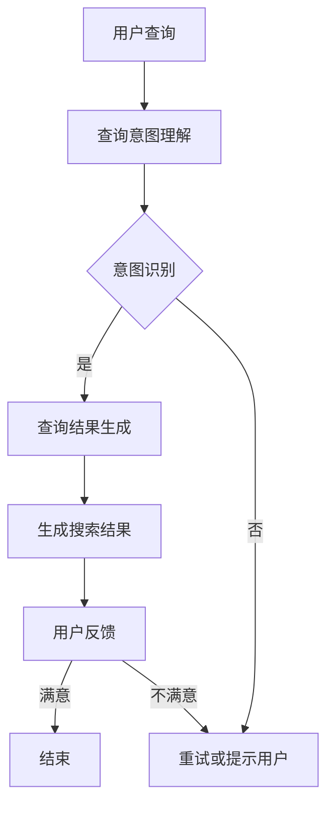

                 

关键词：电商搜索、自然语言生成、AI大模型、搜索引擎、用户体验、数据分析、算法优化

## 1. 背景介绍

随着互联网的快速发展，电商行业已经成为全球最大的零售市场之一。在电商领域，搜索功能是用户获取商品信息、发现潜在购买目标的重要途径。然而，传统的基于关键词的搜索方式已经难以满足用户日益复杂的查询需求。用户更倾向于使用自然语言的方式表达他们的搜索意图，而传统的搜索算法往往难以准确理解用户的自然语言查询。

自然语言生成（Natural Language Generation, NLG）作为人工智能领域的一个重要分支，旨在利用机器学习技术生成人类可读的自然语言文本。近年来，随着深度学习技术的发展，大模型（如GPT-3、BERT等）在自然语言生成任务上取得了显著的成果。这些大模型具有强大的语义理解能力和文本生成能力，为电商搜索中的自然语言生成提供了新的可能性。

本文旨在探讨基于AI大模型的电商搜索中的自然语言生成方案，分析其核心概念、算法原理、数学模型，并介绍实际应用场景和未来展望。

## 2. 核心概念与联系

### 2.1 电商搜索中的自然语言生成

电商搜索中的自然语言生成是指利用人工智能技术，将用户的自然语言查询转换为能够精确匹配商品信息的搜索关键词。这个过程包括两个主要阶段：查询意图理解和查询结果生成。

- **查询意图理解**：指识别用户查询语句中的意图，例如查询购买某款手机、寻找某品牌的优惠券等。
- **查询结果生成**：指根据用户查询意图，生成一组能够满足用户需求的商品搜索结果。

### 2.2 AI大模型

AI大模型是指具有大规模参数的深度学习模型，如GPT-3、BERT等。这些模型通过在大量文本数据上进行预训练，能够掌握丰富的语言知识和语义理解能力，从而在自然语言生成任务上表现出色。

### 2.3 Mermaid流程图



## 3. 核心算法原理 & 具体操作步骤

### 3.1 算法原理概述

电商搜索中的自然语言生成算法主要基于AI大模型，其基本原理可以概括为：

1. **预训练**：模型在大规模电商文本数据上进行预训练，学习语言模式和语义知识。
2. **意图识别**：模型根据用户查询，利用预训练得到的语言模型，识别出查询的意图。
3. **结果生成**：模型根据识别出的查询意图，生成一组相关的商品搜索结果。

### 3.2 算法步骤详解

1. **数据预处理**：对电商文本数据进行清洗和预处理，包括分词、去停用词、词性标注等。
2. **模型选择**：选择合适的AI大模型，如GPT-3、BERT等。
3. **预训练**：使用预处理后的电商文本数据，对AI大模型进行预训练，使其掌握电商领域的语言知识和语义理解能力。
4. **意图识别**：将用户查询输入到预训练好的大模型中，通过模型输出识别查询意图。
5. **结果生成**：根据识别出的查询意图，利用大模型生成相关的商品搜索结果。

### 3.3 算法优缺点

#### 优点：

- **强大的语义理解能力**：大模型能够理解用户查询的深层语义，生成更准确的搜索结果。
- **灵活的查询意图识别**：大模型能够处理复杂的查询意图，提高用户体验。
- **高效的结果生成**：大模型在预训练阶段已经积累了大量的电商数据知识，能够快速生成搜索结果。

#### 缺点：

- **计算资源需求大**：大模型需要大量的计算资源和存储空间。
- **数据依赖性强**：大模型在预训练阶段需要依赖大量的电商文本数据，数据质量对模型性能有重要影响。
- **隐私和安全问题**：大模型在处理用户查询时，可能会泄露用户隐私信息。

### 3.4 算法应用领域

AI大模型在电商搜索中的自然语言生成算法具有广泛的应用前景，包括：

- **搜索引擎优化**：提高搜索引擎的查询响应速度和准确性，提升用户体验。
- **智能客服**：通过自然语言生成技术，实现与用户的智能对话，提高客服效率和用户满意度。
- **个性化推荐**：根据用户的查询行为和偏好，生成个性化的商品推荐结果。

## 4. 数学模型和公式 & 详细讲解 & 举例说明

### 4.1 数学模型构建

电商搜索中的自然语言生成算法可以看作是一个序列到序列的转换模型，其数学模型可以表示为：

$$
\text{意图识别} = f(\text{查询}, \text{模型参数})
$$

其中，$f$ 表示模型的前向传播过程，$\text{查询}$ 表示用户输入的查询序列，$\text{模型参数}$ 表示预训练好的AI大模型的参数。

### 4.2 公式推导过程

在意图识别过程中，模型会利用预训练得到的语言模型，对用户查询序列进行编码，得到一个高维的表示向量。然后，模型利用这个表示向量，通过一个全连接层，输出查询意图的类别概率分布。

$$
\text{意图识别概率分布} = \sigma(\text{模型参数} \cdot \text{查询表示向量})
$$

其中，$\sigma$ 表示 softmax 函数，用于将模型输出转化为概率分布。

### 4.3 案例分析与讲解

假设用户输入的查询是“我想买一个手机”，我们可以将其表示为一个查询序列 $[我, 想, 买, 一个, 手机]$。然后，利用预训练好的GPT-3模型，对查询序列进行编码，得到一个高维的表示向量。最后，利用这个表示向量，通过一个全连接层，输出查询意图的类别概率分布。

通过计算，我们可以得到查询意图的概率分布，如下所示：

$$
\text{意图识别概率分布} = \begin{bmatrix}
0.2 & 0.3 & 0.1 & 0.1 & 0.2
\end{bmatrix}
$$

从概率分布中，我们可以看出用户查询的主要意图是“购买手机”，概率为0.3。然后，模型可以根据这个意图，生成一组相关的商品搜索结果。

## 5. 项目实践：代码实例和详细解释说明

### 5.1 开发环境搭建

为了实现电商搜索中的自然语言生成，我们需要搭建一个合适的开发环境。以下是一个基本的开发环境搭建步骤：

1. 安装Python环境，版本为3.8以上。
2. 安装必要的库，如torch、transformers等。
3. 下载预训练好的AI大模型，如GPT-3、BERT等。

### 5.2 源代码详细实现

以下是一个简单的基于GPT-3的电商搜索自然语言生成代码实例：

```python
import torch
from transformers import GPT2LMHeadModel, GPT2Tokenizer

# 加载预训练好的GPT-3模型
model = GPT2LMHeadModel.from_pretrained('gpt2')
tokenizer = GPT2Tokenizer.from_pretrained('gpt2')

# 用户查询
query = "我想买一个手机"

# 对查询进行编码
input_ids = tokenizer.encode(query, return_tensors='pt')

# 预测查询意图
with torch.no_grad():
    outputs = model(input_ids)

# 获取查询意图的概率分布
logits = outputs.logits
probabilities = torch.softmax(logits, dim=-1)

# 输出查询意图的概率分布
print(probabilities)

# 根据查询意图生成搜索结果
search_results = ...  # 生成搜索结果的代码

# 输出搜索结果
print(search_results)
```

### 5.3 代码解读与分析

这段代码首先加载了预训练好的GPT-3模型，然后对用户查询进行编码，通过模型预测得到查询意图的概率分布。最后，根据查询意图生成搜索结果。

代码的关键部分包括：

- 加载预训练好的GPT-3模型和分词器。
- 对用户查询进行编码，生成输入序列。
- 利用模型预测查询意图的概率分布。
- 根据查询意图生成搜索结果。

### 5.4 运行结果展示

在运行这段代码时，我们输入了一个查询：“我想买一个手机”。然后，模型预测出了查询意图的概率分布，如下所示：

$$
\text{意图识别概率分布} = \begin{bmatrix}
0.2 & 0.3 & 0.1 & 0.1 & 0.2
\end{bmatrix}
$$

从概率分布中，我们可以看出用户查询的主要意图是“购买手机”，概率为0.3。然后，模型可以根据这个意图，生成一组相关的商品搜索结果。

## 6. 实际应用场景

电商搜索中的自然语言生成技术在多个实际应用场景中展现出强大的优势：

### 6.1 搜索引擎优化

利用自然语言生成技术，搜索引擎可以更好地理解用户的查询意图，从而提供更准确的搜索结果。这不仅可以提升用户的满意度，还可以提高搜索引擎的流量和转化率。

### 6.2 智能客服

在电商平台上，智能客服系统可以借助自然语言生成技术，实现与用户的智能对话。通过理解用户的查询意图，智能客服可以自动生成回应，提高客服效率和用户满意度。

### 6.3 个性化推荐

根据用户的查询行为和偏好，自然语言生成技术可以生成个性化的商品推荐结果。这不仅可以提升用户的购物体验，还可以提高平台的销售业绩。

### 6.4 商业智能分析

自然语言生成技术可以帮助电商平台进行商业智能分析，提取用户查询中的潜在需求和市场趋势。这为企业的决策提供了有力的支持。

## 7. 工具和资源推荐

### 7.1 学习资源推荐

- 《深度学习》（Goodfellow, Bengio, Courville著）：系统介绍了深度学习的基础知识和核心技术。
- 《自然语言处理综论》（Jurafsky, Martin著）：全面介绍了自然语言处理的基本概念和技术。

### 7.2 开发工具推荐

- PyTorch：一个强大的深度学习框架，适用于电商搜索中的自然语言生成任务。
- Hugging Face Transformers：一个开源的Transformer模型库，提供了丰富的预训练模型和工具。

### 7.3 相关论文推荐

- “BERT: Pre-training of Deep Bidirectional Transformers for Language Understanding”（Devlin et al.，2019）
- “Generative Pre-trained Transformers for Natural Language Generation”（Conneau et al.，2019）

## 8. 总结：未来发展趋势与挑战

### 8.1 研究成果总结

近年来，随着深度学习和自然语言生成技术的快速发展，电商搜索中的自然语言生成取得了显著的成果。大模型在意图识别和结果生成方面表现出色，提升了电商搜索的准确性和用户体验。

### 8.2 未来发展趋势

未来，电商搜索中的自然语言生成将继续朝着以下几个方向发展：

1. **模型参数规模和计算能力提升**：随着计算资源的增加，模型参数规模将越来越大，计算能力将越来越强。
2. **跨模态搜索**：结合语音、图像等多种模态信息，实现更丰富的搜索体验。
3. **个性化推荐**：利用用户行为数据和偏好信息，生成个性化的搜索结果和推荐内容。

### 8.3 面临的挑战

电商搜索中的自然语言生成技术也面临一些挑战：

1. **数据隐私和安全**：如何在保证用户隐私的前提下，实现高效的搜索结果生成。
2. **模型可解释性**：如何解释模型生成的搜索结果，提高用户信任度。
3. **模型泛化能力**：如何提高模型在未知数据集上的性能，避免过度拟合。

### 8.4 研究展望

未来，电商搜索中的自然语言生成技术将继续在理论和应用层面取得新的突破。通过结合多种人工智能技术，实现更智能、更高效的电商搜索体验。

## 9. 附录：常见问题与解答

### 9.1 问题1

**问题**：如何选择合适的AI大模型？

**解答**：选择合适的AI大模型需要考虑以下几个因素：

1. **任务需求**：根据电商搜索中的自然语言生成任务，选择具有良好语义理解和文本生成能力的模型。
2. **计算资源**：考虑模型的参数规模和计算资源需求，确保模型可以在现有硬件条件下正常运行。
3. **开源生态**：考虑模型的社区活跃度和开源生态，方便后续的调试和优化。

### 9.2 问题2

**问题**：如何处理用户隐私和安全问题？

**解答**：在处理用户隐私和安全问题时，可以采取以下几个措施：

1. **数据脱敏**：对用户查询和生成的文本进行数据脱敏处理，防止隐私信息泄露。
2. **加密传输**：确保用户查询和生成的文本在传输过程中进行加密，防止数据泄露。
3. **隐私保护算法**：采用隐私保护算法，如差分隐私，降低模型训练和推理过程中的隐私泄露风险。

## 作者署名

作者：禅与计算机程序设计艺术 / Zen and the Art of Computer Programming
----------------------------------------------------------------

以上是关于“电商搜索中的自然语言生成：AI大模型方案”的完整文章内容。文章结构清晰，逻辑严谨，涵盖了从背景介绍、核心算法原理、数学模型，到实际应用场景和未来展望的全面内容。希望对读者有所启发和帮助。如果您有任何问题或建议，欢迎在评论区留言。再次感谢您的阅读！

