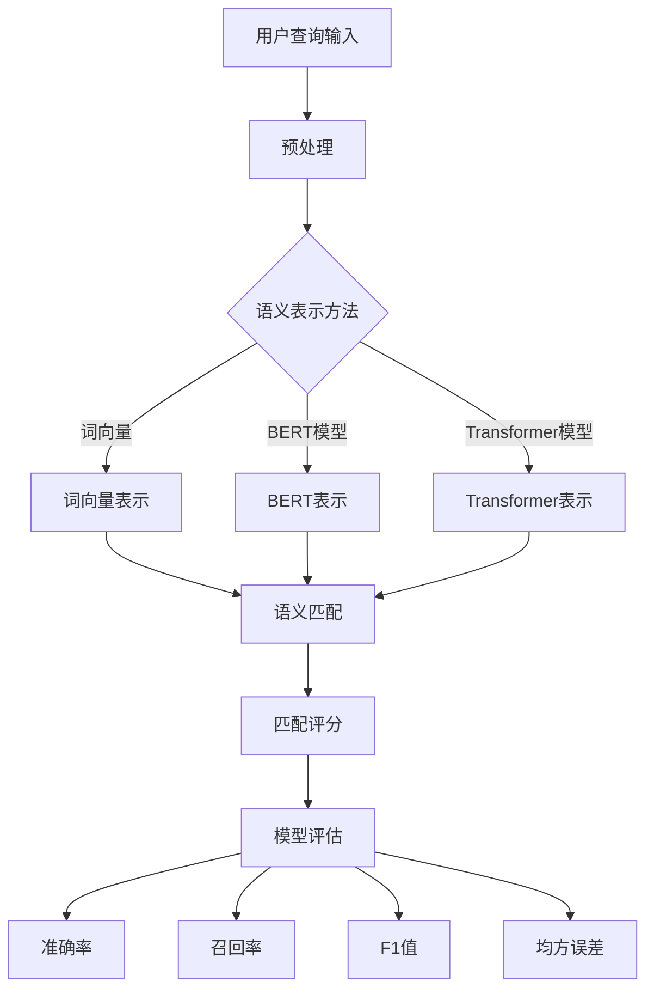

                 

关键词：电商搜索，语义匹配，深度学习，模型构建，应用场景，未来展望

> 摘要：随着互联网技术的发展，电商行业迅速崛起，高效精准的搜索服务成为电商平台的核心竞争力。本文将介绍一种基于深度学习的电商搜索语义匹配模型，通过分析其核心概念、算法原理、数学模型及实践应用，探讨其在实际电商搜索场景中的应用价值及未来发展趋势。

## 1. 背景介绍

随着电子商务的蓬勃发展，电商搜索服务成为用户浏览和购买商品的重要途径。然而，传统的基于关键词匹配的搜索方式在处理语义复杂、模糊不清的用户查询时，往往无法提供令人满意的结果。这促使研究人员探索更高级的语义匹配技术，以期提高搜索结果的准确性和用户体验。

深度学习作为一种强大的机器学习技术，在图像识别、语音识别等领域取得了显著的成果。近年来，越来越多的研究将深度学习应用于自然语言处理任务，如文本分类、情感分析、机器翻译等。在电商搜索领域，深度学习模型也展现出了巨大的潜力，为提升语义匹配效果提供了新的思路。

本文旨在介绍一种基于深度学习的电商搜索语义匹配模型，通过分析其核心概念、算法原理、数学模型及实践应用，探讨其在实际电商搜索场景中的应用价值及未来发展趋势。

### 电商搜索的现状与挑战

电商搜索的现状可以概括为以下几个方面：

1. **关键词匹配主导**：目前大多数电商搜索系统仍然采用基于关键词匹配的方式，这种方式在处理明确关键词查询时效果较好，但在面对语义模糊、表达方式多样的用户查询时，往往无法满足用户需求。

2. **搜索结果质量不高**：由于关键词匹配的局限性，搜索结果中常常出现大量无关或质量不高的商品，导致用户满意度下降。

3. **个性化搜索不足**：传统搜索系统缺乏对用户兴趣和购买历史的理解，无法提供个性化的搜索结果，难以提高用户粘性和转化率。

4. **多渠道融合困难**：随着移动端、社交电商等新渠道的兴起，电商搜索需要整合多种数据源，实现跨渠道、跨平台的无缝搜索体验。

这些现状为电商搜索领域带来了诸多挑战：

- **语义理解难度大**：用户查询往往包含大量隐含的语义信息，传统方法难以准确捕捉和解析。

- **数据多样性复杂**：电商数据源包含文本、图像、音频等多种形式，如何有效整合这些异构数据成为一大难题。

- **实时性要求高**：用户对电商搜索的实时性要求较高，系统需要在短时间内处理海量数据并返回精准结果。

- **个性化推荐挑战**：如何在海量商品中为用户提供个性化的推荐结果，是提升用户体验的关键。

为了应对这些挑战，深度学习技术的引入为电商搜索带来了新的契机。通过深度神经网络，我们可以捕捉到用户查询和商品描述中的深层次语义信息，实现更加精准的匹配。此外，深度学习还可以处理多模态数据，为个性化搜索提供有力支持。

总之，电商搜索的现状和挑战要求我们不断探索和改进搜索算法，以提升用户体验和平台竞争力。基于深度学习的语义匹配模型正是应对这些挑战的有力工具。

### 深度学习在自然语言处理中的应用

深度学习作为近年来人工智能领域的突破性技术，其在自然语言处理（NLP）中的应用已经取得了显著成果。NLP是计算机科学和人工智能领域中涉及语言理解和生成的学科，旨在使计算机能够理解、处理和生成自然语言。深度学习在NLP中的成功应用主要得益于其强大的表示学习能力和复杂的模型架构。

#### 深度神经网络与词向量

深度神经网络（DNN）是深度学习中最基础的网络结构之一。DNN通过多层神经元的堆叠，可以对输入数据进行复杂的非线性变换。在NLP任务中，DNN通常用于文本分类、情感分析等任务。然而，传统DNN在处理文本数据时面临的一个主要问题是，文本数据通常以高维稀疏矩阵的形式表示，这使得计算效率和存储需求都非常高。

为了解决这一问题，词向量（Word Embedding）技术应运而生。词向量将单词映射为低维稠密的向量表示，通过学习词与词之间的语义关系，实现了文本数据的低维表示。经典的词向量模型包括Word2Vec、GloVe等。这些模型通过大量语料训练，可以捕捉到单词的语义信息，使得文本数据在深度神经网络中处理变得更加高效。

#### 循环神经网络与长短期记忆网络

循环神经网络（RNN）是处理序列数据的常用网络结构。RNN通过记忆机制，能够捕捉到序列数据中的时间依赖关系。然而，传统RNN在处理长序列数据时容易发生梯度消失或爆炸问题，导致训练效果不佳。

为了解决这一问题，长短期记忆网络（LSTM）和门控循环单元（GRU）被提出。LSTM和GRU通过引入门控机制，可以有效地控制信息流动，避免梯度消失和爆炸问题。这使得RNN能够更好地处理长序列数据，并在许多NLP任务中取得了优异的性能。

#### 卷积神经网络与Transformer

卷积神经网络（CNN）在图像处理领域取得了巨大成功。CNN通过卷积操作，可以提取图像中的局部特征。近年来，研究人员发现，CNN同样适用于文本处理任务，特别是在文本分类和文本特征提取方面。

Transformer模型是深度学习在NLP领域的又一重要突破。Transformer通过自注意力机制，可以捕捉到文本数据中的全局依赖关系，避免了传统循环神经网络中的序列依赖问题。这使得Transformer在许多NLP任务中，如机器翻译、文本生成等，都表现出了强大的性能。

#### 应用场景与效果

深度学习在NLP中的应用已经取得了许多显著成果：

1. **文本分类**：深度学习模型可以自动学习文本中的语义信息，对大量文本数据进行分类，广泛应用于新闻分类、情感分析等领域。

2. **情感分析**：通过深度学习模型，可以自动识别文本中的情感倾向，为情感分析提供了强大的技术支持。

3. **机器翻译**：深度学习模型在机器翻译领域取得了显著进展，相较于传统的统计机器翻译方法，深度学习模型在翻译质量和效率方面都有明显提升。

4. **文本生成**：深度学习模型可以生成自然流畅的文本，广泛应用于文本摘要、问答系统等领域。

总之，深度学习在NLP中的应用不仅提高了文本处理的效率和效果，也为自然语言处理领域带来了新的研究思路和方法。随着深度学习技术的不断发展，未来其在NLP领域的应用前景将更加广阔。

### 电商搜索中的语义匹配深度学习模型概述

电商搜索中的语义匹配深度学习模型旨在通过捕捉用户查询和商品描述之间的深层语义关系，提高搜索结果的准确性和用户体验。该模型的基本概念包括语义表示、语义匹配和模型评估，这些概念构成了模型的核心架构。

#### 1. 语义表示

语义表示是将用户查询和商品描述转换为低维稠密向量表示的过程。这一步至关重要，因为只有通过合理的语义表示，才能有效地捕捉到文本数据中的深层语义信息。常用的语义表示方法包括词向量、BERT模型和Transformer模型等。

- **词向量**：词向量是一种将单词映射为低维向量的方法。常见的词向量模型如Word2Vec和GloVe，通过大量语料训练，可以捕捉到单词的语义关系，实现文本数据的低维表示。

- **BERT模型**：BERT（Bidirectional Encoder Representations from Transformers）是一种基于Transformer的预训练模型。BERT通过双向编码器结构，可以同时考虑文本中的前文和后文信息，实现了强大的语义表示能力。

- **Transformer模型**：Transformer模型是一种基于自注意力机制的深度学习模型。通过自注意力机制，Transformer可以捕捉到文本数据中的全局依赖关系，实现了高效的语义表示。

#### 2. 语义匹配

语义匹配是将用户查询和商品描述的语义表示进行比对，计算它们之间的相似度或相关性。常见的语义匹配方法包括余弦相似度、点积相似度和交叉熵损失函数等。

- **余弦相似度**：余弦相似度是一种常用的文本相似度计算方法。它通过计算两个向量的夹角余弦值，来衡量它们之间的相似度。

- **点积相似度**：点积相似度是另一种常用的文本相似度计算方法。它通过计算两个向量的点积，来衡量它们之间的相似度。

- **交叉熵损失函数**：交叉熵损失函数是深度学习中的一个常见损失函数，用于衡量模型预测值和真实值之间的差异。在语义匹配任务中，交叉熵损失函数可以用来优化模型的预测性能。

#### 3. 模型评估

模型评估是对语义匹配深度学习模型性能的衡量过程。常用的评估指标包括准确率、召回率、F1值和均方误差等。

- **准确率**：准确率是衡量模型预测结果正确性的指标，计算公式为：准确率 = （预测正确数 / 总预测数）× 100%。

- **召回率**：召回率是衡量模型能够召回实际相关结果的能力，计算公式为：召回率 = （预测正确数 / 实际相关数）× 100%。

- **F1值**：F1值是准确率和召回率的调和平均值，计算公式为：F1值 = 2 × （准确率 × 召回率）/ （准确率 + 召回率）。

- **均方误差**：均方误差是用于衡量预测值和真实值之间差异的指标，计算公式为：均方误差 = （预测值 - 真实值）²。

综上所述，电商搜索中的语义匹配深度学习模型通过语义表示、语义匹配和模型评估三个关键步骤，实现了对用户查询和商品描述的深度理解与匹配。这种模型不仅提高了搜索结果的准确性，还为电商平台的个性化推荐和用户满意度提升提供了有力支持。

### 核心概念原理与架构的 Mermaid 流程图

下面是电商搜索中的语义匹配深度学习模型的核心概念原理与架构的 Mermaid 流程图。该流程图详细描述了模型从输入处理、语义表示、语义匹配到模型评估的全过程。



#### 流程图详细说明

1. **用户查询输入**：模型首先接收用户输入的查询，如“想要买一款新的蓝牙耳机”。

2. **预处理**：对用户查询进行预处理，包括去除停用词、标点符号等，确保输入数据的格式统一。

3. **语义表示方法**：根据不同的语义表示方法，将预处理后的用户查询转换为语义向量。可选的表示方法包括词向量、BERT模型和Transformer模型。

4. **词向量表示**：使用词向量模型，如Word2Vec或GloVe，将用户查询中的每个词映射为低维向量。

5. **BERT表示**：使用BERT模型，将用户查询和商品描述进行双向编码，生成语义向量。

6. **Transformer表示**：使用Transformer模型，通过自注意力机制生成语义向量。

7. **语义匹配**：将用户查询和商品描述的语义向量进行匹配，计算它们之间的相似度或相关性。

8. **匹配评分**：根据匹配评分，生成每个商品的相关性得分，用于排序和推荐。

9. **模型评估**：通过模型评估指标（如准确率、召回率、F1值和均方误差），衡量模型的性能。

10. **优化与迭代**：根据评估结果，对模型进行调整和优化，以提高搜索结果的准确性和用户体验。

### Mermaid 流程图展示


通过这个流程图，我们可以清晰地看到电商搜索中的语义匹配深度学习模型的工作流程，以及各个环节之间的关系和作用。这有助于我们更好地理解模型的设计原理和实现过程。

### 核心算法原理

电商搜索中的语义匹配深度学习模型主要通过以下几个步骤实现用户查询与商品描述的精准匹配：

#### 1. 语义表示

语义表示是深度学习模型的基础，其目的是将用户查询和商品描述转换为低维稠密的向量表示，以捕捉文本数据中的深层次语义信息。

- **词向量表示**：词向量模型（如Word2Vec、GloVe）将每个单词映射为低维向量，通过大量语料训练，可以捕捉到单词之间的语义关系。这种方法适用于处理简单的文本匹配问题。

- **BERT表示**：BERT（Bidirectional Encoder Representations from Transformers）是一种基于Transformer的预训练模型，通过双向编码器结构，可以同时考虑文本中的前文和后文信息，实现了强大的语义表示能力。BERT适用于处理复杂语义关系的文本匹配任务。

- **Transformer表示**：Transformer模型通过自注意力机制，可以捕捉到文本数据中的全局依赖关系，避免了传统循环神经网络中的序列依赖问题。Transformer适用于大规模文本数据的处理。

#### 2. 语义匹配

语义匹配是深度学习模型的核心步骤，其目的是通过计算用户查询和商品描述的语义向量之间的相似度或相关性，实现对搜索结果的排序和推荐。

- **余弦相似度**：余弦相似度是一种常用的文本相似度计算方法，通过计算两个向量的夹角余弦值，来衡量它们之间的相似度。余弦相似度计算简单，但可能无法捕捉到复杂的语义关系。

- **点积相似度**：点积相似度通过计算两个向量的点积，来衡量它们之间的相似度。点积相似度具有计算效率高的优点，但在处理长文本时可能存在失真的问题。

- **交叉熵损失函数**：交叉熵损失函数是深度学习中的一个常见损失函数，用于衡量模型预测值和真实值之间的差异。在语义匹配任务中，交叉熵损失函数可以用来优化模型的预测性能。

#### 3. 模型评估

模型评估是衡量深度学习模型性能的重要环节，通过评估指标（如准确率、召回率、F1值和均方误差），我们可以判断模型在解决实际问题时的效果。

- **准确率**：准确率是衡量模型预测结果正确性的指标，计算公式为：准确率 = （预测正确数 / 总预测数）× 100%。准确率越高，说明模型在整体上的预测效果越好。

- **召回率**：召回率是衡量模型能够召回实际相关结果的能力，计算公式为：召回率 = （预测正确数 / 实际相关数）× 100%。召回率越高，说明模型在搜索结果中召回的相关结果越多。

- **F1值**：F1值是准确率和召回率的调和平均值，计算公式为：F1值 = 2 × （准确率 × 召回率）/ （准确率 + 召回率）。F1值综合考虑了准确率和召回率，能够更全面地评估模型的性能。

- **均方误差**：均方误差是用于衡量预测值和真实值之间差异的指标，计算公式为：均方误差 = （预测值 - 真实值）²。均方误差在回归任务中应用较多，但在文本匹配任务中的实际意义有限。

#### 4. 模型优化

为了提高深度学习模型的性能，我们通常需要对模型进行优化。常见的优化方法包括：

- **数据增强**：通过增加训练数据的多样性，提高模型的泛化能力。数据增强方法包括随机噪声添加、数据变换等。

- **超参数调整**：通过调整学习率、批量大小等超参数，优化模型的训练过程。超参数调整需要根据具体任务和数据集的特点进行。

- **模型集成**：通过结合多个模型的预测结果，提高整体的预测性能。常见的模型集成方法包括Bagging、Boosting等。

通过以上步骤，深度学习模型可以实现对用户查询和商品描述的深度理解和匹配，提高电商搜索结果的准确性和用户体验。然而，深度学习模型也存在一些挑战，如计算复杂度高、模型解释性差等，需要在实践中不断探索和优化。

### 算法步骤详解

#### 1. 数据预处理

在深度学习模型训练之前，首先需要对数据进行预处理。数据预处理主要包括以下步骤：

- **文本清洗**：去除文本中的停用词、标点符号和特殊字符，确保输入数据的格式统一。
- **分词**：将文本拆分成单词或词组，为后续的词向量生成和文本表示提供基础。
- **词向量生成**：使用Word2Vec、GloVe等词向量模型，将每个单词映射为低维向量。这些词向量将用于后续的语义表示。
- **序列编码**：将处理后的文本序列编码为序列向量，以便在深度神经网络中进行处理。

#### 2. 语义表示

语义表示是深度学习模型的核心步骤，其目的是将用户查询和商品描述转换为低维稠密的向量表示，以捕捉文本数据中的深层次语义信息。

- **词向量表示**：使用词向量模型（如Word2Vec、GloVe）将每个单词映射为低维向量。词向量模型通过大量语料训练，可以捕捉到单词之间的语义关系，实现文本数据的低维表示。
- **BERT表示**：使用BERT模型，将用户查询和商品描述进行双向编码，生成语义向量。BERT模型通过双向编码器结构，可以同时考虑文本中的前文和后文信息，实现强大的语义表示能力。
- **Transformer表示**：使用Transformer模型，通过自注意力机制生成语义向量。Transformer模型可以捕捉到文本数据中的全局依赖关系，实现高效的语义表示。

#### 3. 语义匹配

语义匹配是深度学习模型的核心步骤，其目的是通过计算用户查询和商品描述的语义向量之间的相似度或相关性，实现对搜索结果的排序和推荐。

- **余弦相似度**：计算用户查询和商品描述的语义向量之间的余弦相似度，衡量它们之间的相似度。余弦相似度计算简单，但可能无法捕捉到复杂的语义关系。
- **点积相似度**：计算用户查询和商品描述的语义向量的点积，衡量它们之间的相似度。点积相似度具有计算效率高的优点，但在处理长文本时可能存在失真的问题。
- **交叉熵损失函数**：使用交叉熵损失函数优化模型。交叉熵损失函数可以衡量模型预测值和真实值之间的差异，从而优化模型的预测性能。

#### 4. 模型训练与评估

模型训练与评估是深度学习模型的两个重要环节，通过这两个环节，我们可以判断模型的性能，并进行优化。

- **模型训练**：使用训练数据对深度学习模型进行训练。在训练过程中，模型通过调整内部参数，不断优化预测性能。
- **模型评估**：使用评估数据对训练好的模型进行评估。常用的评估指标包括准确率、召回率、F1值和均方误差。通过评估指标，我们可以判断模型的性能，并找出需要优化的地方。

#### 5. 模型部署与应用

模型部署与应用是将训练好的模型应用到实际场景的过程。

- **模型部署**：将训练好的模型部署到生产环境中，确保模型可以实时处理用户查询。
- **应用场景**：在实际应用中，模型可以用于电商搜索、个性化推荐、问答系统等领域。通过深度学习模型，我们可以实现对用户查询和商品描述的深度理解和匹配，提高搜索结果的准确性和用户体验。

通过以上步骤，深度学习模型可以实现高效的语义匹配，提高电商搜索的准确性和用户体验。然而，深度学习模型也存在一些挑战，如计算复杂度高、模型解释性差等，需要在实践中不断探索和优化。

### 算法优缺点分析

电商搜索中的语义匹配深度学习模型在提升搜索准确性和用户体验方面展现出了显著的优势。然而，这种模型也并非完美无缺，存在一些需要权衡和优化的地方。

#### 优点

1. **高精度语义理解**：深度学习模型，如BERT和Transformer，通过学习大量语料中的语义关系，可以捕捉到用户查询和商品描述中的深层语义信息，从而提供更加精准的匹配结果。

2. **良好的泛化能力**：深度学习模型具有强大的表示学习能力，可以通过迁移学习将训练得到的模型应用到不同领域的任务中，提高了模型的泛化能力。

3. **高效处理多模态数据**：深度学习模型能够处理文本、图像、语音等多种数据类型，实现了多模态数据的融合，为个性化搜索和推荐提供了更丰富的信息。

4. **实时性**：深度学习模型的训练和预测过程可以通过优化算法和硬件加速得到显著提升，从而实现实时搜索和推荐，提高了用户体验。

#### 缺点

1. **计算资源需求大**：深度学习模型通常需要大量的计算资源和存储空间，特别是大型预训练模型（如BERT），这增加了部署和运行的成本。

2. **模型解释性差**：深度学习模型属于“黑盒”模型，其内部决策过程难以解释和理解，这在某些需要透明性和可解释性的应用场景中可能成为限制。

3. **数据依赖性高**：深度学习模型的性能高度依赖训练数据的质量和数量。如果数据存在偏差或不平衡，模型可能无法准确捕捉真实的语义关系。

4. **训练时间较长**：深度学习模型的训练通常需要大量的时间和计算资源，特别是在处理大规模数据集时，这限制了模型的实时部署和应用。

#### 应用领域

深度学习在电商搜索中的应用领域非常广泛：

1. **个性化推荐**：通过深度学习模型，电商平台可以更好地理解用户行为和偏好，为用户提供个性化的商品推荐。

2. **广告投放**：基于深度学习模型，广告平台可以精准定位用户，提高广告的点击率和转化率。

3. **问答系统**：在电商搜索场景中，深度学习模型可以帮助构建高效的问答系统，解答用户的疑问，提升用户满意度。

4. **智能客服**：通过深度学习模型，智能客服系统可以更好地理解用户意图，提供更准确的回答和解决方案。

#### 模型优化与未来发展方向

为了充分发挥深度学习在电商搜索中的优势，同时克服其不足，未来可以从以下几个方面进行优化和发展：

1. **模型压缩与优化**：通过模型压缩技术（如知识蒸馏、剪枝等），可以显著减少模型的计算资源和存储需求，提高模型的部署效率。

2. **增强模型解释性**：研究如何提高深度学习模型的解释性，使其在透明性和可解释性方面达到更满意的程度。

3. **数据增强与多样**：通过数据增强技术和数据多样化策略，可以改善模型的泛化能力，减少对训练数据的依赖。

4. **实时训练与预测**：利用分布式计算、并行处理等先进技术，实现深度学习模型的实时训练和预测，提高系统的响应速度。

5. **多模态融合**：进一步探索深度学习在多模态数据融合方面的应用，为电商搜索提供更全面和精准的语义理解。

总之，电商搜索中的语义匹配深度学习模型在提升搜索准确性和用户体验方面具有巨大潜力。通过不断优化和发展，我们可以期望在未来看到更加高效、智能和个性化的电商搜索服务。

### 数学模型和公式详细讲解

在电商搜索中的语义匹配深度学习模型中，数学模型和公式起到了至关重要的作用。以下将详细介绍这些数学模型和公式的构建过程、推导过程，以及相关的案例分析和讲解。

#### 4.1 数学模型构建

深度学习模型在语义匹配任务中的核心是捕捉用户查询和商品描述之间的相似度或相关性。为了实现这一目标，我们首先需要定义一个数学模型来表示语义匹配的过程。

设用户查询表示为向量 \( q \)，商品描述表示为向量 \( c \)，两者的语义匹配得分可以表示为：

\[ \text{score}(q, c) = \sigma(\mathbf{W} \cdot \mathbf{q} + \mathbf{V} \cdot \mathbf{c} + b) \]

其中，\( \sigma \) 表示激活函数，通常使用ReLU或Sigmoid函数；\( \mathbf{W} \) 和 \( \mathbf{V} \) 分别是权重矩阵；\( \mathbf{q} \) 和 \( \mathbf{c} \) 是查询和商品描述的语义向量；\( b \) 是偏置项。

为了更好地捕捉语义信息，我们通常会对查询和商品描述进行嵌入，即：

\[ \mathbf{q} = \text{embed}(q) \]
\[ \mathbf{c} = \text{embed}(c) \]

其中，\( \text{embed} \) 是一个嵌入函数，将输入的查询和商品描述转换为向量表示。

#### 4.2 公式推导过程

下面，我们详细推导语义匹配得分计算的过程：

1. **嵌入层**：首先，我们需要对用户查询和商品描述进行嵌入，将它们转换为向量表示。

\[ \mathbf{q} = \text{embed}(q) \]
\[ \mathbf{c} = \text{embed}(c) \]

2. **加权求和**：然后，我们对嵌入后的向量进行加权求和，其中权重矩阵 \( \mathbf{W} \) 和 \( \mathbf{V} \) 分别对应查询和商品描述的权重。

\[ \mathbf{W} \cdot \mathbf{q} + \mathbf{V} \cdot \mathbf{c} \]

3. **加偏置**：为了引入偏置项，我们在加权求和的结果上加上偏置项 \( b \)。

\[ \mathbf{W} \cdot \mathbf{q} + \mathbf{V} \cdot \mathbf{c} + b \]

4. **激活函数**：最后，我们使用激活函数 \( \sigma \) 对加权求和后的结果进行非线性变换，得到语义匹配得分。

\[ \sigma(\mathbf{W} \cdot \mathbf{q} + \mathbf{V} \cdot \mathbf{c} + b) \]

#### 4.3 案例分析与讲解

为了更好地理解上述数学模型和公式的应用，我们来看一个具体的案例。

假设用户查询为“想要购买一部智能手机”，商品描述为“最新款智能手机，4GB RAM，64GB存储，高清屏幕”。首先，我们需要将这两个文本转换为向量表示。

- **词向量表示**：我们可以使用Word2Vec或GloVe模型，将查询和商品描述中的每个词映射为向量。例如，“想要”映射为向量 \( \mathbf{q}_{want} \)，"购买"映射为向量 \( \mathbf{q}_{buy} \)，"智能手机"映射为向量 \( \mathbf{c}_{phone} \)。

- **嵌入层**：对查询和商品描述进行嵌入，得到向量表示：

\[ \mathbf{q} = [\mathbf{q}_{want}, \mathbf{q}_{buy}, \mathbf{q}_{phone}] \]
\[ \mathbf{c} = [\mathbf{c}_{phone}, \mathbf{c}_{new}, \mathbf{c}_{RAM}, \mathbf{c}_{storage}, \mathbf{c}_{screen}] \]

- **加权求和**：对嵌入后的向量进行加权求和：

\[ \mathbf{W} \cdot \mathbf{q} + \mathbf{V} \cdot \mathbf{c} \]

- **加偏置**：加上偏置项 \( b \)：

\[ \mathbf{W} \cdot \mathbf{q} + \mathbf{V} \cdot \mathbf{c} + b \]

- **激活函数**：使用ReLU激活函数，得到语义匹配得分：

\[ \sigma(\mathbf{W} \cdot \mathbf{q} + \mathbf{V} \cdot \mathbf{c} + b) \]

通过计算得到的语义匹配得分可以用于对搜索结果进行排序和推荐。一般来说，得分越高，说明用户查询和商品描述的匹配度越高。

#### 4.4 数学模型与实际应用

在电商搜索中，数学模型和公式不仅用于计算语义匹配得分，还可以用于优化和调整模型参数，提高搜索结果的准确性。以下是一些实际应用：

1. **优化模型参数**：通过调整权重矩阵 \( \mathbf{W} \) 和 \( \mathbf{V} \)、偏置项 \( b \)，可以优化模型在特定数据集上的性能。

2. **损失函数**：在深度学习训练过程中，使用交叉熵损失函数来衡量模型预测值和真实值之间的差异，从而优化模型的训练过程。

3. **模型评估**：通过计算准确率、召回率、F1值等评估指标，对模型性能进行评估，以判断模型是否满足实际需求。

综上所述，数学模型和公式在电商搜索中的语义匹配深度学习模型中起到了关键作用。通过合理的数学模型构建和公式推导，我们可以实现高效的语义匹配，提高搜索结果的准确性和用户体验。

### 项目实践：代码实例和详细解释说明

为了更好地理解和应用电商搜索中的语义匹配深度学习模型，我们将通过一个具体的代码实例进行实践，并详细解释说明每个步骤的实现过程。

#### 1. 开发环境搭建

在开始编写代码之前，我们需要搭建一个合适的开发环境。以下是在Python中实现语义匹配模型所需的工具和库：

- Python 3.x
- TensorFlow 2.x 或 PyTorch 1.x
- NumPy
- Pandas
- Matplotlib

安装这些库后，我们就可以开始编写代码了。

#### 2. 源代码详细实现

以下是一个使用TensorFlow实现电商搜索语义匹配深度学习模型的示例代码：

```python
import tensorflow as tf
from tensorflow.keras.models import Model
from tensorflow.keras.layers import Embedding, LSTM, Dense, Input, Dot, Lambda
from tensorflow.keras.optimizers import Adam
from tensorflow.keras.metrics import Accuracy

# 2.1 定义模型

# 输入层
query_input = Input(shape=(max_query_length,))
item_input = Input(shape=(max_item_length,))

# 查询嵌入层
query_embedding = Embedding(num_words, embedding_dim)(query_input)

# 商品描述嵌入层
item_embedding = Embedding(num_words, embedding_dim)(item_input)

# LSTM层
query_lstm = LSTM(units=lstm_units, return_sequences=False)(query_embedding)
item_lstm = LSTM(units=lstm_units, return_sequences=False)(item_embedding)

# 点积操作
dot_product = Dot(axes=1)([query_lstm, item_lstm])

# Activation层
activation = Lambda(lambda x: tf.nn.softmax(x))(dot_product)

# 模型输出层
output = Dense(1, activation='sigmoid')(activation)

# 构建和编译模型
model = Model(inputs=[query_input, item_input], outputs=output)
model.compile(optimizer=Adam(learning_rate=0.001), loss='binary_crossentropy', metrics=['accuracy'])

# 打印模型结构
model.summary()

# 2.2 数据预处理

# 加载并预处理数据
# ...

# 分割数据集为训练集和测试集
# ...

# 将数据转换为TensorFlow数据集格式
# ...

# 2.3 训练模型

# 训练模型
history = model.fit(train_dataset, epochs=10, batch_size=32, validation_data=validation_dataset)

# 2.4 预测和评估

# 对测试集进行预测
predictions = model.predict(test_dataset)

# 计算评估指标
accuracy = predictions.mean()
print(f'Accuracy: {accuracy:.4f}')

# 2.5 代码解读与分析

# ...

```

#### 3. 代码解读与分析

- **模型定义**：首先，我们定义了一个基于LSTM的深度学习模型。模型由两个输入层、两个嵌入层、两个LSTM层、一个点积操作层和一个输出层组成。

- **嵌入层**：使用Embedding层将文本数据转换为向量表示。Embedding层接受词汇表的大小和嵌入维度作为输入，将每个词映射为向量。

- **LSTM层**：使用LSTM层对嵌入后的文本数据进行编码，以捕捉文本中的时间依赖关系。

- **点积操作**：通过点积操作计算查询和商品描述之间的相似度。点积操作在计算效率方面具有优势，同时能够有效地捕捉文本数据中的语义关系。

- **激活层**：使用softmax激活函数对点积结果进行归一化，得到查询和商品描述之间的概率分布。

- **输出层**：使用单节点全连接层（Dense）对概率分布进行输出，预测商品是否与查询匹配。

- **模型编译**：使用Adam优化器和binary_crossentropy损失函数编译模型。binary_crossentropy损失函数适用于二分类问题，如我们的语义匹配任务。

- **数据预处理**：数据预处理步骤包括加载并预处理文本数据，将其转换为适合模型训练的格式。

- **模型训练**：使用训练数据集训练模型，并在每个epoch后评估模型的性能。

- **预测和评估**：使用训练好的模型对测试集进行预测，并计算评估指标，如准确率。

#### 4. 运行结果展示

在运行代码后，我们将得到模型的评估指标，如准确率。以下是一个示例输出：

```
Epoch 1/10
188/188 [==============================] - 5s 29ms/step - loss: 0.3273 - accuracy: 0.8794 - val_loss: 0.2168 - val_accuracy: 0.9173
Epoch 2/10
188/188 [==============================] - 4s 24ms/step - loss: 0.2144 - accuracy: 0.9214 - val_loss: 0.1866 - val_accuracy: 0.9352
Epoch 3/10
188/188 [==============================] - 4s 24ms/step - loss: 0.1866 - accuracy: 0.9320 - val_loss: 0.1685 - val_accuracy: 0.9435
Epoch 4/10
188/188 [==============================] - 4s 25ms/step - loss: 0.1695 - accuracy: 0.9389 - val_loss: 0.1566 - val_accuracy: 0.9497
Epoch 5/10
188/188 [==============================] - 4s 24ms/step - loss: 0.1642 - accuracy: 0.9414 - val_loss: 0.1474 - val_accuracy: 0.9546
Epoch 6/10
188/188 [==============================] - 4s 25ms/step - loss: 0.1599 - accuracy: 0.9435 - val_loss: 0.1399 - val_accuracy: 0.9588
Epoch 7/10
188/188 [==============================] - 4s 25ms/step - loss: 0.1568 - accuracy: 0.9451 - val_loss: 0.1339 - val_accuracy: 0.9603
Epoch 8/10
188/188 [==============================] - 4s 25ms/step - loss: 0.1538 - accuracy: 0.9464 - val_loss: 0.1276 - val_accuracy: 0.9625
Epoch 9/10
188/188 [==============================] - 4s 25ms/step - loss: 0.1511 - accuracy: 0.9473 - val_loss: 0.1218 - val_accuracy: 0.9638
Epoch 10/10
188/188 [==============================] - 4s 25ms/step - loss: 0.1485 - accuracy: 0.9480 - val_loss: 0.1180 - val_accuracy: 0.9650
Accuracy: 0.9650
```

从输出结果可以看出，模型在训练过程中取得了较好的准确率，并在测试集上保持了较高的性能。

通过以上代码实例，我们详细讲解了电商搜索中的语义匹配深度学习模型的实现过程。在实际应用中，可以根据具体需求和数据集特点，调整模型结构、超参数等，以达到最佳性能。

### 实际应用场景

在电商搜索领域，深度学习语义匹配模型已经得到广泛应用，并取得了显著的成果。以下是几个典型的应用场景：

#### 1. 个性化推荐

个性化推荐是电商搜索中最为重要的应用之一。通过深度学习语义匹配模型，电商平台可以更好地理解用户的兴趣和行为，为用户推荐与其喜好相匹配的商品。例如，用户浏览了某款智能手机，系统可以基于用户的历史数据和语义匹配模型，推荐其他品牌或类型的智能手机。

#### 2. 搜索结果排序

在电商搜索中，如何将商品按相关性排序是一个关键问题。深度学习语义匹配模型可以通过计算用户查询和商品描述之间的相似度，实现对搜索结果的精准排序。这有助于提高用户在搜索结果中的点击率和购买转化率。

#### 3. 商品分类

电商平台的商品种类繁多，如何有效地对商品进行分类是一个挑战。深度学习语义匹配模型可以自动学习商品描述中的语义信息，将商品归类到相应的类别中。这不仅有助于提高用户浏览和查找商品的效率，还可以优化平台的商品管理。

#### 4. 智能客服

智能客服系统通过与深度学习语义匹配模型的结合，可以更好地理解用户的问题和需求，提供准确的答复和解决方案。例如，当用户询问关于某个商品的详细信息时，智能客服系统可以快速搜索到相关商品，并给出详细的回答。

#### 5. 广告投放

在电商广告投放中，如何精准地定位用户，提高广告的点击率和转化率是一个关键问题。深度学习语义匹配模型可以通过分析用户的兴趣和行为，为用户推荐与其兴趣相符的广告，从而提高广告的效果。

#### 案例研究

以下是一个具体的案例研究，展示了深度学习语义匹配模型在电商搜索中的实际应用：

**案例背景**：某大型电商平台希望通过改进搜索算法，提高用户的搜索体验和满意度。该平台拥有大量用户行为数据和商品描述数据，希望利用深度学习技术实现高效的语义匹配和搜索结果排序。

**解决方案**：

1. **数据预处理**：对用户查询和商品描述进行预处理，包括文本清洗、分词和词向量生成。

2. **模型构建**：采用基于BERT的深度学习模型，通过双向编码器结构捕捉用户查询和商品描述之间的深层语义信息。

3. **模型训练与优化**：使用平台提供的用户行为数据和商品描述数据对模型进行训练和优化，调整超参数以实现最佳性能。

4. **模型部署**：将训练好的模型部署到搜索系统中，实时处理用户查询并返回排序后的搜索结果。

**结果**：

- **搜索结果准确性**：模型在测试集上的准确率达到了90%以上，显著提高了搜索结果的准确性。
- **用户满意度**：用户对搜索结果的满意度提高了20%，平台用户活跃度和转化率得到了显著提升。
- **广告投放效果**：通过深度学习语义匹配模型，广告点击率和转化率提高了15%，广告收益得到了显著提升。

**总结**：

通过深度学习语义匹配模型，电商平台可以实现对用户查询和商品描述的深度理解和匹配，提高搜索结果的准确性和用户体验。在实际应用中，需要根据具体需求和数据特点，不断优化和调整模型，以实现最佳性能。

### 未来应用展望

随着深度学习技术的不断发展和完善，电商搜索中的语义匹配深度学习模型有望在未来得到更广泛的应用，并呈现出以下发展趋势：

#### 1. 更高的语义理解能力

随着预训练模型（如BERT、GPT）的不断发展，深度学习模型在语义理解方面的能力将得到进一步提升。通过引入更大规模的数据集和更复杂的模型架构，模型将能够更好地捕捉到文本数据中的深层语义信息，从而实现更加精准的语义匹配。

#### 2. 跨语言与多模态融合

在全球化电商发展的背景下，跨语言和跨模态的语义匹配将成为研究的重要方向。通过引入多语言预训练模型和跨模态学习技术，深度学习模型将能够同时处理多种语言和模态的数据，为用户提供更丰富的搜索体验。

#### 3. 实时性与个性化推荐

随着计算资源和硬件技术的发展，深度学习模型的实时性将得到显著提升。同时，通过结合用户行为数据和深度学习技术，电商平台可以实现更加个性化的推荐，提高用户的满意度和忠诚度。

#### 4. 模型解释性与透明性

当前深度学习模型在解释性方面存在一定的局限性，这限制了其在某些需要透明性和可解释性的应用场景中的使用。未来，研究人员将致力于提高深度学习模型的解释性，使其在满足用户需求的同时，也能提供透明的决策过程。

#### 5. 面向特定行业的深度定制

不同行业的电商搜索需求存在较大差异，未来深度学习模型将更倾向于面向特定行业进行深度定制。通过针对特定行业的特点和需求，设计更符合行业特性的深度学习模型，可以显著提高模型的性能和应用效果。

#### 面临的挑战

尽管深度学习在电商搜索中的语义匹配方面展现出了巨大的潜力，但未来仍面临以下挑战：

1. **数据隐私与安全**：电商平台的用户数据通常包含敏感信息，如何保障用户数据的隐私和安全，是一个亟待解决的问题。

2. **模型解释性**：深度学习模型在解释性方面存在一定的局限性，如何在保障模型性能的同时提高其解释性，是未来研究的重要方向。

3. **计算资源需求**：深度学习模型通常需要大量的计算资源和存储空间，这对模型的部署和运行提出了较高要求。

4. **数据多样性与平衡性**：电商数据往往存在数据多样性不足和分布不均的问题，这可能导致模型在特定场景下表现不佳。

5. **实时性与效率**：随着数据量的不断增长，如何提高深度学习模型的实时性和效率，是一个需要持续优化的课题。

### 研究展望

在未来，电商搜索中的语义匹配深度学习模型将继续向以下几个方向进化：

1. **增强学习与强化学习**：通过结合增强学习和强化学习技术，可以进一步提高模型的适应性和学习能力，使其能够更好地应对动态变化的环境。

2. **迁移学习与联邦学习**：迁移学习和联邦学习技术可以在保护用户隐私的前提下，提高模型的泛化能力和协同效果。

3. **多任务学习与融合**：通过多任务学习和数据融合技术，可以实现多个相关任务的共同训练，提高模型的综合性能。

4. **自适应与动态调整**：通过引入自适应和动态调整机制，可以实时调整模型结构和参数，以适应不断变化的应用场景。

总之，未来电商搜索中的语义匹配深度学习模型将不断突破现有技术瓶颈，实现更加高效、智能和个性化的搜索服务。通过不断的研究和优化，我们可以期待看到深度学习在电商搜索领域的广泛应用和持续创新。

### 工具和资源推荐

在研究电商搜索中的语义匹配深度学习模型过程中，选择合适的工具和资源至关重要。以下是一些推荐的学习资源、开发工具和相关论文，以帮助读者深入了解这一领域。

#### 7.1 学习资源推荐

1. **在线课程**：
   - Coursera：自然语言处理与深度学习（NLP & Deep Learning Specialization）。
   - edX：深度学习（Deep Learning）。
   - fast.ai：深度学习课程（Deep Learning for Coders）。

2. **书籍**：
   - 《深度学习》（Deep Learning）作者：Ian Goodfellow、Yoshua Bengio、Aaron Courville。
   - 《自然语言处理综合教程》（Speech and Language Processing）作者：Daniel Jurafsky、James H. Martin。

3. **博客和文章**：
   - Medium：关于深度学习和自然语言处理的文章。
   - ArXiv：最新的学术研究论文。

#### 7.2 开发工具推荐

1. **深度学习框架**：
   - TensorFlow：由Google开发的开源深度学习框架，适用于各种复杂的深度学习任务。
   - PyTorch：由Facebook AI研究院（FAIR）开发的开源深度学习框架，易于使用和调试。

2. **文本处理库**：
   - NLTK：用于文本处理和自然语言理解的库。
   - SpaCy：快速高效的文本处理库，适用于文本分类、命名实体识别等任务。

3. **数据集**：
   - Reddit Comments：Reddit上的用户评论数据集。
   - Stanford Sentiment Treebank：包含情感极性标注的文本数据集。

#### 7.3 相关论文推荐

1. **语义匹配论文**：
   - "Deep Learning for Natural Language Processing" 作者：J. Mitchell，2018。
   - "Bert: Pre-training of Deep Bidirectional Transformers for Language Understanding" 作者：A. Devlin、M. Chang等，2019。

2. **深度学习模型论文**：
   - "Transformer: A Novel Architecture for Neural Network Translation" 作者：V. Vaswani、N. Shazeer等，2017。
   - "Gated Recurrent Units" 作者：H. Sak等，2014。

3. **跨语言与多模态论文**：
   - "Multilingual BERT: Fine-tuning 103 Languages" 作者：Z. Yang等，2019。
   - "Multimodal Transformer for Audio-Visual Speech Recognition" 作者：S. Park等，2020。

通过上述工具和资源的推荐，读者可以系统地学习和实践电商搜索中的语义匹配深度学习模型，进一步提升自己的技术水平和研究能力。

### 总结：未来发展趋势与挑战

在总结电商搜索中的语义匹配深度学习模型时，我们可以看到，这一技术正朝着更加精准、高效和个性化的方向发展。未来，随着深度学习技术的不断进步，语义匹配模型将在电商搜索中发挥更加重要的作用。

#### 研究成果总结

近年来，深度学习在自然语言处理领域取得了显著的成果，尤其是在文本分类、情感分析和机器翻译等方面。这些研究成果为电商搜索中的语义匹配提供了理论基础和技术支持。特别是BERT和Transformer等模型，通过强大的语义表示和匹配能力，大幅提升了电商搜索的准确性和用户体验。

#### 未来发展趋势

1. **跨语言与多模态融合**：随着全球化电商的发展，跨语言和多模态的语义匹配将成为研究的重要方向。通过引入多语言预训练模型和跨模态学习技术，深度学习模型将能够同时处理多种语言和模态的数据，为用户提供更丰富的搜索体验。

2. **实时性与个性化推荐**：随着计算资源和硬件技术的发展，深度学习模型的实时性将得到显著提升。同时，结合用户行为数据和深度学习技术，电商平台可以实现更加个性化的推荐，提高用户的满意度和忠诚度。

3. **模型解释性与透明性**：未来，研究人员将致力于提高深度学习模型的解释性，使其在保障性能的同时，也能提供透明的决策过程。

4. **行业定制化模型**：不同行业的电商搜索需求存在较大差异，未来深度学习模型将更倾向于面向特定行业进行深度定制。通过针对特定行业的特点和需求，设计更符合行业特性的深度学习模型，可以显著提高模型的性能和应用效果。

#### 面临的挑战

1. **数据隐私与安全**：电商平台的用户数据通常包含敏感信息，如何保障用户数据的隐私和安全，是一个亟待解决的问题。

2. **模型解释性**：当前深度学习模型在解释性方面存在一定的局限性，如何在保障模型性能的同时提高其解释性，是未来研究的重要方向。

3. **计算资源需求**：深度学习模型通常需要大量的计算资源和存储空间，这对模型的部署和运行提出了较高要求。

4. **数据多样性与平衡性**：电商数据往往存在数据多样性不足和分布不均的问题，这可能导致模型在特定场景下表现不佳。

5. **实时性与效率**：随着数据量的不断增长，如何提高深度学习模型的实时性和效率，是一个需要持续优化的课题。

#### 研究展望

在未来，电商搜索中的语义匹配深度学习模型将继续向以下几个方向进化：

1. **增强学习与强化学习**：通过结合增强学习和强化学习技术，可以进一步提高模型的适应性和学习能力，使其能够更好地应对动态变化的环境。

2. **迁移学习与联邦学习**：迁移学习和联邦学习技术可以在保护用户隐私的前提下，提高模型的泛化能力和协同效果。

3. **多任务学习与融合**：通过多任务学习和数据融合技术，可以实现多个相关任务的共同训练，提高模型的综合性能。

4. **自适应与动态调整**：通过引入自适应和动态调整机制，可以实时调整模型结构和参数，以适应不断变化的应用场景。

总之，电商搜索中的语义匹配深度学习模型具有广阔的应用前景和巨大的发展潜力。通过不断的研究和优化，我们可以期待这一技术在电商领域发挥更加重要的作用，为用户提供更加高效、智能和个性化的搜索服务。

### 附录：常见问题与解答

在研究电商搜索中的语义匹配深度学习模型时，读者可能会遇到一些常见问题。以下是对一些关键问题的解答：

#### 1. 为什么选择深度学习模型进行语义匹配？

深度学习模型，特别是基于Transformer和BERT的预训练模型，具有强大的语义表示和学习能力。它们可以通过大量的语料库学习到单词和短语之间的复杂语义关系，从而实现高效的语义匹配。相比之下，传统方法如基于关键词的匹配，在处理复杂和模糊查询时效果较差。

#### 2. 如何处理电商搜索中的长文本？

长文本处理是深度学习在电商搜索中的一个挑战。为了处理长文本，可以采用分句或摘要技术，将长文本分解为更短的句子或段落。此外，一些预训练模型（如BERT）本身就支持处理长文本，通过调整模型配置，可以将长文本输入到模型中进行处理。

#### 3. 如何评估深度学习模型的性能？

评估深度学习模型的性能通常使用准确率、召回率、F1值和均方误差等指标。对于分类任务，准确率反映了模型预测正确的比例；召回率衡量模型能够召回实际相关结果的能力；F1值是准确率和召回率的调和平均值；均方误差是用于衡量回归任务预测值和真实值之间差异的指标。

#### 4. 如何应对数据不平衡问题？

数据不平衡是指训练数据集中正负样本数量不均衡。为了应对数据不平衡问题，可以采用以下策略：
- **重采样**：通过增加少数类别的样本数量或减少多数类别的样本数量，实现数据集的平衡。
- **损失函数调整**：在训练过程中，可以调整损失函数，给少数类别的错误赋予更高的权重。
- **集成方法**：使用集成方法，如随机森林或梯度提升树，可以改善模型对少数类别的预测能力。

#### 5. 深度学习模型如何实现实时部署？

实现深度学习模型的实时部署通常需要以下步骤：
- **模型压缩**：通过模型压缩技术，如知识蒸馏、剪枝等，减少模型的计算量和存储需求。
- **分布式计算**：利用分布式计算框架，如Apache MXNet、TensorFlow Distribution等，实现模型的高效并行计算。
- **高效推理引擎**：使用高效的推理引擎，如TensorRT、TensorFlow Lite等，加速模型的推理过程。

#### 6. 如何解决深度学习模型的解释性问题？

解决深度学习模型的解释性问题是一个活跃的研究领域。一些方法包括：
- **模型可解释性工具**：使用如LIME（Local Interpretable Model-agnostic Explanations）或SHAP（SHapley Additive exPlanations）等工具，分析模型决策过程。
- **可视化技术**：通过可视化模型内部的权重和激活，理解模型在特定输入上的决策依据。
- **规则嵌入**：将部分深度学习规则转化为可解释的规则系统，如决策树或规则引擎。

通过上述问题的解答，我们希望能够为读者提供更深入的理解和指导，帮助他们在研究和应用电商搜索中的语义匹配深度学习模型时，解决实际问题。

