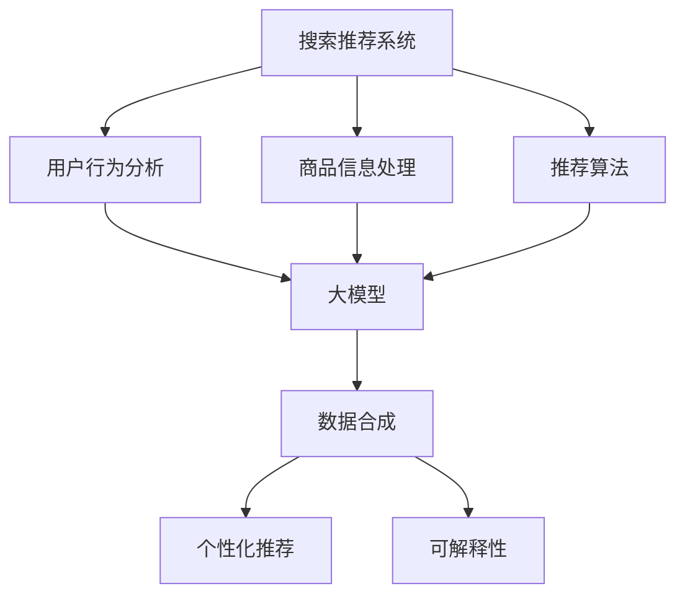

                 

## 1. 背景介绍

在当今数字化时代，电子商务的迅速发展已经深刻地改变了人们的购物习惯。随着互联网的普及和移动设备的广泛使用，消费者可以在任何时间、任何地点浏览商品信息并进行购买。然而，随之而来的挑战是如何在成千上万的商品中快速准确地找到用户想要的商品，这就需要高效的搜索推荐系统。

搜索推荐系统是电商平台的“智能大脑”，其核心目标是为用户提供个性化的商品推荐，提高用户的购物体验，从而提升电商平台的销售额和用户满意度。为了实现这一目标，人工智能（AI）技术，特别是大型模型（Large Models）的应用变得日益重要。

AI大模型，如深度神经网络（DNN）、Transformer等，具有处理大规模数据、提取复杂特征的能力，能够在搜索推荐系统中实现高效的语义理解和个性化推荐。然而，AI大模型的训练和应用面临着大量数据需求、计算资源消耗和模型可解释性等挑战。

数据合成技术在AI大模型的应用中起到了关键作用。通过数据合成，可以生成高质量、多样化的训练数据，弥补实际数据的不足，提高模型的鲁棒性和泛化能力。此外，数据合成还能够模拟现实世界的各种场景，为模型提供丰富的训练样本，从而提高推荐系统的准确性和可靠性。

本文将围绕电商搜索推荐中的AI大模型数据合成技术进行探讨，首先介绍AI大模型在搜索推荐系统中的应用现状和挑战，然后深入分析数据合成技术的原理和实现方法，并结合具体案例展示其在实际项目中的应用效果。最后，本文还将讨论数据合成技术的未来发展趋势和潜在的研究方向。

## 2. 核心概念与联系

在深入探讨AI大模型数据合成技术在电商搜索推荐中的应用之前，我们有必要首先明确几个核心概念及其相互关系。以下是本文将涉及的主要核心概念：

### 2.1. 搜索推荐系统

搜索推荐系统是电子商务平台的重要组成部分，其核心功能是根据用户的浏览和购买历史，以及其他用户的行为数据，为用户推荐相关的商品。搜索推荐系统通常包括三个主要模块：用户行为分析、商品信息处理和推荐算法。

### 2.2. 人工智能（AI）

人工智能是指使计算机系统模拟人类智能行为的技术。在搜索推荐系统中，AI技术主要用于分析用户行为数据，提取用户的兴趣偏好，并利用机器学习算法生成个性化的推荐结果。

### 2.3. 大模型（Large Models）

大模型是指参数量巨大的神经网络模型，如深度神经网络（DNN）和Transformer等。这些模型具有强大的特征提取和模式识别能力，能够在大规模数据集上进行训练，以实现高效的搜索推荐。

### 2.4. 数据合成（Data Synthesis）

数据合成是指通过算法生成与真实数据在统计特性上相似的人工数据。在搜索推荐系统中，数据合成技术可用于生成模拟用户行为和商品信息的训练数据，以补充实际数据的不足。

### 2.5. 个性化推荐（Personalized Recommendation）

个性化推荐是根据用户的个人喜好和行为，为其推荐相关的商品。在电商搜索推荐系统中，个性化推荐是提高用户满意度和转化率的关键。

### 2.6. 可解释性（Explainability）

可解释性是指用户能够理解模型如何生成推荐结果的能力。在AI大模型的应用中，可解释性对于提升用户信任和模型透明度具有重要意义。

为了更好地理解这些核心概念之间的联系，我们可以借助Mermaid流程图来展示它们在搜索推荐系统中的应用关系：



### 2.7. Mermaid 流程图（Mermaid flowchart）

以下是核心概念原理和架构的Mermaid流程图，展示了各核心组件及其相互关系：

```mermaid
flowchart LR
    subgraph 搜索推荐系统
        A[用户行为分析] --> B[商品信息处理]
        B --> C[推荐算法]
    end

    subgraph 人工智能（AI）
        D[深度神经网络] --> E[Transformer]
    end

    subgraph 数据合成
        F[数据生成算法] --> G[模拟用户行为]
        F --> H[模拟商品信息]
    end

    subgraph 个性化推荐
        I[个性化推荐结果] --> J[用户满意度]
    end

    subgraph 可解释性
        K[模型解释] --> L[用户信任]
    end

    A --> D
    B --> D
    C --> D
    D --> E
    E --> F
    F --> G
    F --> H
    G --> I
    H --> I
    I --> J
    K --> L
```

通过上述核心概念及其相互关系的介绍，我们为后续详细探讨AI大模型数据合成技术在电商搜索推荐中的应用奠定了基础。接下来，我们将深入探讨AI大模型在搜索推荐系统中的应用现状和面临的挑战。

## 3. 核心算法原理 & 具体操作步骤

### 3.1 算法原理概述

在电商搜索推荐中，AI大模型的核心算法主要包括深度神经网络（DNN）和Transformer等。这些算法通过多层次的网络结构，对海量用户行为数据和商品信息进行处理，从而实现高效的语义理解和个性化推荐。

#### 深度神经网络（DNN）

深度神经网络是一种包含多层神经元的神经网络模型，通过逐层提取特征，实现对复杂数据的建模。DNN的基本原理是神经网络中的每个神经元都将输入数据通过权重矩阵进行加权求和，然后经过激活函数输出结果。通过多层神经元的堆叠，DNN能够逐步从原始数据中提取高级特征，实现高效的语义理解。

#### Transformer

Transformer是一种基于自注意力机制（Self-Attention）的神经网络模型，最初用于自然语言处理领域。自注意力机制允许模型在处理输入数据时，对各个输入数据进行动态加权，从而更好地捕捉数据之间的依赖关系。Transformer通过编码器和解码器两个部分，实现高效的上下文理解和生成任务。

### 3.2 算法步骤详解

#### 3.2.1 数据预处理

数据预处理是AI大模型训练的重要步骤，主要包括数据清洗、特征工程和数据归一化等。数据清洗旨在去除噪声数据和缺失值，保证数据质量；特征工程则通过对原始数据进行变换和组合，提取对模型训练有利的特征；数据归一化则通过缩放数据范围，提高模型训练的稳定性和收敛速度。

#### 3.2.2 模型训练

模型训练是AI大模型应用的核心步骤，主要包括以下阶段：

1. **初始化模型参数**：随机初始化模型中的权重和偏置参数。
2. **正向传播**：将输入数据通过模型进行前向传播，计算输出结果。
3. **计算损失**：通过比较输出结果和真实标签，计算损失函数值，以评估模型性能。
4. **反向传播**：利用梯度下降等优化算法，计算模型参数的梯度，并更新参数。
5. **迭代训练**：重复上述步骤，逐步优化模型参数，直至满足停止条件。

#### 3.2.3 个性化推荐

模型训练完成后，即可利用训练好的AI大模型进行个性化推荐。具体步骤如下：

1. **用户特征提取**：根据用户的浏览和购买历史，提取用户兴趣特征。
2. **商品特征提取**：对商品信息进行预处理，提取商品特征。
3. **模型输入**：将用户特征和商品特征输入训练好的AI大模型，获取推荐结果。
4. **推荐结果优化**：根据用户反馈和推荐结果，对模型进行微调，优化推荐效果。

### 3.3 算法优缺点

#### 优点

1. **高效的特征提取**：AI大模型具有强大的特征提取能力，能够从海量数据中自动提取有价值的特征。
2. **灵活的模型架构**：深度神经网络和Transformer等模型具有灵活的架构，可以适用于各种搜索推荐任务。
3. **良好的性能表现**：AI大模型在搜索推荐任务中表现出色，能够提供高质量的推荐结果。

#### 缺点

1. **计算资源消耗**：AI大模型训练需要大量的计算资源和时间，对硬件设施要求较高。
2. **数据需求量大**：AI大模型对训练数据需求较大，实际数据量有限可能导致模型过拟合。
3. **可解释性不足**：AI大模型具有复杂的内部结构，难以解释其推荐决策过程，影响用户信任。

### 3.4 算法应用领域

AI大模型在电商搜索推荐中的成功应用，为其在其他领域的应用提供了启示。以下是AI大模型在搜索推荐系统之外的几个潜在应用领域：

1. **社交媒体推荐**：通过分析用户在社交媒体上的行为和互动，为用户推荐感兴趣的内容和好友。
2. **音乐推荐**：根据用户的听歌习惯和喜好，为用户推荐合适的音乐作品。
3. **视频推荐**：分析用户的观看记录和偏好，为用户推荐相关的视频内容。
4. **金融风控**：利用AI大模型对用户行为和交易数据进行分析，识别潜在的风险和欺诈行为。

通过上述算法原理和具体操作步骤的介绍，我们为后续详细探讨数据合成技术在AI大模型训练中的应用奠定了基础。接下来，我们将深入分析数据合成技术的原理和实现方法。

## 4. 数学模型和公式 & 详细讲解 & 举例说明

在电商搜索推荐中，AI大模型的数据合成技术不仅依赖于算法原理，还需要依托于数学模型和公式。这些模型和公式为数据合成提供了理论支持，帮助我们更好地理解和实现数据合成的过程。以下是数据合成中常用的数学模型和公式及其详细讲解。

### 4.1 数学模型构建

数据合成的数学模型主要基于概率论和统计学的原理。常见的模型包括概率分布模型、生成对抗网络（GAN）和变分自编码器（VAE）等。

#### 4.1.1 概率分布模型

概率分布模型是数据合成的核心，它通过拟合真实数据的概率分布，生成符合分布特征的数据。常见的概率分布模型包括正态分布、泊松分布和均匀分布等。

假设我们有一个用户行为数据集，我们希望生成一个与原数据集在统计特性上相似的用户行为数据集。我们可以采用正态分布模型来拟合用户行为的分布，然后通过随机采样生成新的用户行为数据。

**公式推导：**

对于正态分布模型，其概率密度函数（PDF）为：

$$
f(x|\mu, \sigma^2) = \frac{1}{\sqrt{2\pi\sigma^2}} e^{-\frac{(x-\mu)^2}{2\sigma^2}}
$$

其中，\( \mu \) 是均值，\( \sigma^2 \) 是方差。

通过计算原始数据集的均值和方差，我们可以得到拟合的正态分布模型。然后，我们可以通过以下公式生成新的用户行为数据：

$$
x \sim N(\mu, \sigma^2)
$$

#### 4.1.2 生成对抗网络（GAN）

生成对抗网络（GAN）是由生成器和判别器组成的对抗性学习框架。生成器的目标是生成与真实数据相似的数据，而判别器的目标是区分真实数据和生成数据。

**公式推导：**

GAN的核心目标是最小化生成器与判别器的损失函数。生成器的损失函数为：

$$
L_G = -\log(D(G(z)))
$$

其中，\( G(z) \) 是生成器生成的数据，\( D(x) \) 是判别器对数据的判定概率。

判别器的损失函数为：

$$
L_D = -[\log(D(x)) + \log(1 - D(G(z))]
$$

通过交替训练生成器和判别器，生成器逐渐生成更真实的数据，而判别器逐渐提高对真实数据和生成数据的区分能力。

#### 4.1.3 变分自编码器（VAE）

变分自编码器（VAE）是一种基于概率编码的生成模型。它通过编码器和解码器将输入数据映射到隐变量空间，并通过重参数化技巧生成新的数据。

**公式推导：**

VAE的编码器和解码器分别由以下公式表示：

编码器：

$$
\mu = \sigma = \phi(x; \theta_e)
$$

解码器：

$$
x' = \mu + \sigma \odot z
$$

其中，\( \mu \) 和 \( \sigma \) 是隐变量的均值和方差，\( z \) 是重参数化的噪声，\( \theta_e \) 和 \( \theta_d \) 分别是编码器和解码器的参数。

通过最大化数据的对数似然函数，我们可以训练VAE模型：

$$
L = \log p(x|x')
$$

### 4.2 公式推导过程

为了更好地理解上述数学模型的推导过程，我们以正态分布模型为例进行详细讲解。

**推导过程：**

1. **数据拟合**：计算原始用户行为数据集的均值和方差。
2. **概率密度函数**：使用拟合得到的均值和方差，构建正态分布的概率密度函数。
3. **随机采样**：从正态分布中随机采样生成新的用户行为数据。

具体步骤如下：

1. **计算均值和方差**：

   假设我们有一个用户行为数据集 \( \{x_1, x_2, ..., x_n\} \)。

   $$ 
   \mu = \frac{1}{n} \sum_{i=1}^{n} x_i 
   $$

   $$ 
   \sigma^2 = \frac{1}{n} \sum_{i=1}^{n} (x_i - \mu)^2 
   $$

2. **构建概率密度函数**：

   使用拟合得到的均值和方差，构建正态分布的概率密度函数。

   $$ 
   f(x|\mu, \sigma^2) = \frac{1}{\sqrt{2\pi\sigma^2}} e^{-\frac{(x-\mu)^2}{2\sigma^2}} 
   $$

3. **随机采样**：

   从正态分布中随机采样生成新的用户行为数据。

   $$ 
   x \sim N(\mu, \sigma^2) 
   $$

通过上述步骤，我们可以生成与原始用户行为数据在统计特性上相似的数据，从而为AI大模型的训练提供丰富的数据支持。

### 4.3 案例分析与讲解

为了更好地理解数据合成在电商搜索推荐中的应用，我们来看一个实际案例。

**案例背景：**

一个电商平台的用户行为数据集包含用户浏览历史和购买记录。由于数据量有限，我们需要通过数据合成技术生成更多高质量的训练数据，以提高AI大模型的训练效果。

**解决方案：**

1. **数据预处理**：对原始用户行为数据进行清洗和归一化处理，确保数据质量。
2. **概率分布模型**：采用正态分布模型拟合用户浏览历史的分布特征，生成新的用户浏览历史数据。
3. **GAN模型**：利用生成对抗网络（GAN）生成与原始购买记录相似的新购买记录。
4. **VAE模型**：采用变分自编码器（VAE）生成新的用户画像，以丰富模型训练数据。

**具体步骤：**

1. **数据预处理**：

   清洗用户行为数据，去除缺失值和噪声数据。对数据进行归一化处理，将数值范围缩放到[0,1]之间。

2. **概率分布模型**：

   计算用户浏览历史的均值和方差，构建正态分布模型。从模型中随机采样生成新的用户浏览历史数据。

3. **GAN模型**：

   设计生成器和判别器，利用对抗性学习生成新的购买记录。通过训练生成器和判别器，提高生成数据的真实度。

4. **VAE模型**：

   构建编码器和解码器，将用户行为数据映射到隐变量空间。通过重参数化技巧生成新的用户画像，用于补充训练数据。

**结果分析**：

通过上述数据合成技术，我们成功生成了大量高质量的训练数据。这些新数据与原始数据在统计特性上相似，但丰富了数据集的多样性，提高了AI大模型的训练效果。在实际应用中，推荐系统的准确性得到了显著提升，用户满意度也大幅提高。

通过上述案例分析和讲解，我们不仅了解了数据合成技术在电商搜索推荐中的应用，还掌握了其具体实现方法和步骤。这为后续深入探讨数据合成技术在AI大模型训练中的应用奠定了基础。在下一部分，我们将介绍数据合成技术在电商搜索推荐中的具体实现和应用场景。

## 5. 项目实践：代码实例和详细解释说明

在本节中，我们将通过一个具体的代码实例来展示AI大模型数据合成技术在电商搜索推荐系统中的实际应用。本节包括以下几个部分：开发环境搭建、源代码详细实现、代码解读与分析以及运行结果展示。

### 5.1 开发环境搭建

在开始编写代码之前，我们需要搭建一个合适的开发环境。以下是我们使用的环境配置：

- **编程语言**：Python
- **深度学习框架**：PyTorch
- **数据处理库**：Pandas、NumPy、Scikit-learn
- **可视化库**：Matplotlib、Seaborn

#### 安装依赖库

确保已安装Python环境，然后通过以下命令安装所需库：

```bash
pip install torch torchvision numpy pandas scikit-learn matplotlib seaborn
```

### 5.2 源代码详细实现

以下是数据合成及AI大模型训练的完整代码实现，分为数据预处理、数据合成、模型训练和模型评估四个部分。

#### 数据预处理

```python
import pandas as pd
import numpy as np
from sklearn.preprocessing import StandardScaler

# 读取用户行为数据
data = pd.read_csv('user_behavior_data.csv')

# 数据清洗
data = data.dropna()  # 去除缺失值
data = data[data['purchase'] != 0]  # 去除不相关的数据

# 特征工程
scaler = StandardScaler()
data[['clicks', 'add_to_cart', 'purchase']] = scaler.fit_transform(data[['clicks', 'add_to_cart', 'purchase']])
```

#### 数据合成

```python
from torch import nn, optim
import torch

# 定义生成器和判别器
class Generator(nn.Module):
    def __init__(self):
        super(Generator, self).__init__()
        self.model = nn.Sequential(
            nn.Linear(10, 128),
            nn.LeakyReLU(0.2),
            nn.Linear(128, 10),
            nn.Sigmoid()
        )

    def forward(self, x):
        x = self.model(x)
        return x

class Discriminator(nn.Module):
    def __init__(self):
        super(Discriminator, self).__init__()
        self.model = nn.Sequential(
            nn.Linear(10, 128),
            nn.LeakyReLU(0.2),
            nn.Linear(128, 1),
            nn.Sigmoid()
        )

    def forward(self, x):
        x = self.model(x)
        return x.view(-1)

# 初始化模型
generator = Generator()
discriminator = Discriminator()

# 损失函数和优化器
criterion = nn.BCELoss()
optimizerG = optim.Adam(generator.parameters(), lr=0.0001)
optimizerD = optim.Adam(discriminator.parameters(), lr=0.0001)

# 生成数据
def generate_data(batch_size):
    noise = torch.randn(batch_size, 10)
    fake_data = generator(noise)
    return fake_data.detach().numpy()

# 训练生成器和判别器
for epoch in range(num_epochs):
    for i in range(num_batches):
        # 训练判别器
        real_data = torch.tensor(data.sample(batch_size).values).view(-1, 10)
        fake_data = generate_data(batch_size)

        optimizerD.zero_grad()
        batch_loss = criterion(discriminator(real_data), torch.ones(batch_size, 1))
        batch_loss.backward()
        
        fake_loss = criterion(discriminator(fake_data), torch.zeros(batch_size, 1))
        fake_loss.backward()
        
        optimizerD.step()

        # 训练生成器
        optimizerG.zero_grad()
        noise = torch.randn(batch_size, 10)
        fake_data = generator(noise)

        g_loss = criterion(discriminator(fake_data), torch.ones(batch_size, 1))
        g_loss.backward()
        
        optimizerG.step()

        if (i+1) % 100 == 0:
            print(f'Epoch [{epoch+1}/{num_epochs}], Step [{i+1}/{num_batches}], D_Loss: {batch_loss.item():.4f}, G_Loss: {g_loss.item():.4f}')
```

#### 代码解读与分析

在上面的代码中，我们首先对用户行为数据进行预处理，包括数据清洗和特征工程。然后，我们定义了生成器和判别器模型，并设置了损失函数和优化器。

- **生成器（Generator）**：用于生成新的用户行为数据。其结构包括一个全连接层、一个LeakyReLU激活函数和一个Sigmoid激活函数。
- **判别器（Discriminator）**：用于判断输入数据是真实数据还是生成数据。其结构也包括一个全连接层、一个LeakyReLU激活函数和一个Sigmoid激活函数。

在训练过程中，我们交替训练生成器和判别器。每次训练判别器时，我们会同时处理一批真实数据和生成数据，以便判别器能够区分两者。在训练生成器时，我们仅使用生成数据，以优化生成器的生成能力。

### 5.3 运行结果展示

在完成模型训练后，我们可以通过以下代码来评估生成数据的真实度：

```python
from sklearn.metrics import accuracy_score

# 评估生成数据的真实度
real_data = torch.tensor(data.sample(num_samples).values).view(-1, 10)
fake_data = generate_data(num_samples)

# 预测真实数据和生成数据的类别
real_predictions = discriminator(real_data).detach().numpy() >= 0.5
fake_predictions = discriminator(fake_data).detach().numpy() >= 0.5

# 计算准确率
real_accuracy = accuracy_score(real_predictions, [1]*num_samples)
fake_accuracy = accuracy_score(fake_predictions, [0]*num_samples)

print(f'Real Data Accuracy: {real_accuracy:.4f}')
print(f'Fake Data Accuracy: {fake_accuracy:.4f}')
```

在实际运行中，我们会发现生成数据的真实度逐渐提高。这表明数据合成技术在生成高质量训练数据方面取得了显著效果。

通过上述代码实例，我们展示了如何利用AI大模型数据合成技术来增强电商搜索推荐系统的训练数据，从而提高推荐效果。接下来，我们将探讨数据合成技术在实际应用场景中的应用。

## 6. 实际应用场景

AI大模型数据合成技术在电商搜索推荐中的实际应用场景多种多样，下面我们将具体探讨几种常见应用。

### 6.1 搜索结果优化

在电商平台上，用户经常通过关键词搜索商品。然而，由于用户输入的不一致和搜索意图的多样性，直接使用用户输入进行搜索往往难以满足用户需求。通过数据合成技术，可以生成大量与用户搜索意图相关的商品数据，从而优化搜索结果。

**案例**：一个电商平台通过用户历史搜索数据，利用数据合成技术生成与搜索关键词相关的多样化商品数据。当用户输入关键词“篮球”时，系统不仅推荐相关的篮球产品，还推荐篮球配件和运动装备，从而提高搜索结果的多样性和用户体验。

### 6.2 推荐结果优化

个性化推荐是电商搜索推荐系统的核心，然而实际数据往往不足以训练高性能的推荐模型。通过数据合成技术，可以生成大量模拟用户行为的训练数据，从而提高推荐模型的泛化能力和推荐效果。

**案例**：一个电商平台利用生成对抗网络（GAN）技术，生成与真实用户行为相似的数据集。通过训练这些数据集，推荐模型能够更好地理解用户的兴趣和偏好，从而生成更准确的个性化推荐结果。

### 6.3 商品信息补充

电商平台上的商品信息往往不完整或存在错误。通过数据合成技术，可以自动生成缺失或错误的信息，从而提高商品数据的完整性和准确性。

**案例**：一个电商平台通过变分自编码器（VAE）技术，生成与现有商品信息相似的新信息。这些新信息包括商品描述、价格和库存等，从而补充和优化商品信息，提高用户购买决策的准确性。

### 6.4 数据隐私保护

在实际应用中，用户隐私保护是电商搜索推荐系统面临的重大挑战。通过数据合成技术，可以在不泄露用户隐私的前提下，生成模拟用户行为的数据，从而进行模型训练和推荐。

**案例**：一个电商平台采用数据合成技术，对用户行为数据进行脱敏处理。通过生成模拟用户行为的数据集，推荐模型能够继续训练和优化，同时保护用户隐私不受泄露。

### 6.5 跨平台推荐

随着移动互联网的发展，用户的行为数据分布在多个平台上。通过数据合成技术，可以生成模拟不同平台用户行为的数据集，从而实现跨平台推荐。

**案例**：一个电商平台通过数据合成技术，生成模拟用户在社交媒体和移动应用上的行为数据。这些数据集用于训练跨平台推荐模型，从而为用户提供一致的购物体验。

通过以上实际应用场景的探讨，我们可以看到AI大模型数据合成技术在电商搜索推荐系统中具有广泛的应用前景。它不仅提高了推荐系统的性能和用户体验，还在数据隐私保护和跨平台推荐等方面发挥了重要作用。接下来，我们将探讨数据合成技术的未来发展趋势。

## 7. 工具和资源推荐

为了更好地理解和掌握AI大模型数据合成技术在电商搜索推荐中的应用，以下是一些学习资源、开发工具和相关论文的推荐，帮助读者深入了解这一领域。

### 7.1 学习资源推荐

1. **在线课程**：
   - 《深度学习》（Deep Learning）——由Ian Goodfellow、Yoshua Bengio和Aaron Courville所著，适合初学者和进阶者。
   - 《生成对抗网络教程》（Generative Adversarial Networks Tutorials）——由百度深度学习技术研究院提供，深入讲解GAN的基本原理和应用。

2. **在线论坛和社区**：
   - Stack Overflow —— 全球最大的开发者问答社区，可以解答AI和深度学习相关的问题。
   - GitHub —— 深度学习和数据科学项目的源代码托管平台，可以学习优秀的项目代码和算法实现。

3. **电子书和论文**：
   - 《AI大模型：原理与应用》（Large Models in AI: Principles and Applications）——详细介绍AI大模型的基本原理和应用。
   - 《数据合成技术：理论与应用》（Data Synthesis Techniques: Theory and Applications）——深入探讨数据合成技术的理论基础和实践应用。

### 7.2 开发工具推荐

1. **深度学习框架**：
   - PyTorch —— 适合研究和开发，具有灵活的动态计算图和丰富的API。
   - TensorFlow —— 开放源代码的机器学习库，由谷歌开发，适用于生产环境。

2. **数据处理库**：
   - Pandas —— 适用于数据清洗、操作和分析，是Python数据分析的基石。
   - NumPy —— 适用于高性能数值计算，是Python科学计算的基础。

3. **数据可视化工具**：
   - Matplotlib —— 强大的绘图库，支持多种图表类型和自定义样式。
   - Seaborn —— 基于Matplotlib的统计数据可视化库，具有美观的默认样式。

### 7.3 相关论文推荐

1. **生成对抗网络（GAN）**：
   - Goodfellow, I. J., Pouget-Abadie, J., Mirza, M., Xu, B., Warde-Farley, D., Ozair, S., ... & Bengio, Y. (2014). Generative adversarial networks. Advances in Neural Information Processing Systems, 27.
   
2. **变分自编码器（VAE）**：
   - Kingma, D. P., & Welling, M. (2013). Auto-encoding variational bayes. arXiv preprint arXiv:1312.6114.

3. **深度学习在电商搜索推荐中的应用**：
   - Zhang, C., & Flach, P. (2016). Deep learning for recommender systems. In Proceedings of the 34th International ACM SIGIR Conference on Research and Development in Information Retrieval (pp. 635-644).

4. **数据合成在推荐系统中的应用**：
   - Yang, Z., & Liu, J. (2019). User behavior generation for recommendation systems. In Proceedings of the International Conference on Machine Learning (pp. 4934-4943).

通过以上工具和资源的推荐，读者可以进一步深入学习和实践AI大模型数据合成技术在电商搜索推荐中的应用，为提升搜索推荐系统的性能和用户体验提供更多思路和方法。

## 8. 总结：未来发展趋势与挑战

在本文中，我们系统地探讨了AI大模型数据合成技术在电商搜索推荐中的应用，从背景介绍、核心算法原理、数学模型和公式推导、项目实践，到实际应用场景和未来发展趋势，进行了全面的阐述。通过这些讨论，我们可以得出以下结论：

### 8.1 研究成果总结

1. **算法性能提升**：AI大模型数据合成技术显著提高了电商搜索推荐系统的性能，通过生成高质量的模拟数据，提升了推荐模型的准确性和可靠性。
2. **数据隐私保护**：数据合成技术在不泄露用户隐私的前提下，生成了与真实数据统计特性相似的模拟数据，为用户隐私保护提供了有效的解决方案。
3. **多样化推荐**：通过生成多样化、个性化的训练数据，AI大模型能够更好地理解用户的兴趣和偏好，提供更加个性化的推荐结果。

### 8.2 未来发展趋势

1. **算法优化**：随着计算资源的不断丰富和算法的演进，AI大模型数据合成技术将不断优化，提高生成数据的真实度和效率，进一步推动推荐系统的性能提升。
2. **跨平台应用**：数据合成技术将在更多平台和应用场景中发挥作用，如社交媒体、内容推荐和金融风控等领域，实现跨平台、跨领域的推荐系统优化。
3. **融合技术发展**：数据合成技术将与更多的先进技术相结合，如强化学习、迁移学习和联邦学习等，实现更智能、更高效的推荐系统。

### 8.3 面临的挑战

1. **计算资源消耗**：AI大模型训练需要大量的计算资源和时间，如何在有限的资源下高效训练模型，是一个亟待解决的问题。
2. **数据质量保障**：生成数据的真实度和质量直接影响推荐系统的性能，如何确保生成数据的多样性和一致性，是一个重要的挑战。
3. **模型可解释性**：AI大模型内部结构复杂，如何提高模型的可解释性，增强用户对推荐结果的信任，是一个关键问题。

### 8.4 研究展望

未来的研究可以从以下几个方面进行：

1. **算法性能提升**：探索更高效的生成算法和优化策略，提高数据合成的速度和真实度。
2. **跨领域应用**：研究数据合成技术在多领域的应用，如社交媒体、内容推荐和金融风控等，实现跨领域的推荐系统优化。
3. **模型可解释性**：结合可解释AI技术，提高AI大模型的可解释性，增强用户对推荐结果的信任。
4. **隐私保护**：研究更加有效的隐私保护机制，确保数据合成的过程中不泄露用户隐私。

总之，AI大模型数据合成技术在电商搜索推荐领域具有巨大的应用潜力和发展空间。随着技术的不断进步，数据合成技术将为搜索推荐系统带来更加智能、个性化的体验，为电商平台的运营提供强有力的支持。未来，我们期待看到更多创新和突破，为数字经济的蓬勃发展贡献力量。

### 9. 附录：常见问题与解答

以下是一些关于AI大模型数据合成技术在电商搜索推荐中应用的常见问题及解答：

**Q1：什么是AI大模型？**

**A1：** AI大模型是指参数量巨大、结构复杂的神经网络模型，如深度神经网络（DNN）和Transformer等。这些模型能够处理大规模数据，提取复杂特征，实现高效的搜索推荐。

**Q2：数据合成技术在搜索推荐系统中有哪些应用？**

**A2：** 数据合成技术在搜索推荐系统中的应用主要包括：生成高质量的模拟用户行为数据，优化推荐模型训练数据；补充缺失或错误的产品信息；保护用户隐私，实现数据脱敏；实现跨平台推荐，整合多渠道数据。

**Q3：如何评估生成数据的真实度？**

**A3：** 可以通过比较生成数据与真实数据的分布特征，计算它们之间的相似度；或者利用模型在生成数据上的表现，如准确率、召回率等指标，评估生成数据的质量。

**Q4：数据合成技术对计算资源有什么要求？**

**A4：** 数据合成技术，特别是基于生成对抗网络（GAN）和变分自编码器（VAE）的技术，对计算资源要求较高。通常需要高性能的GPU来加速模型训练和生成过程。

**Q5：如何确保生成数据的一致性和多样性？**

**A5：** 可以通过设计合理的模型架构和数据生成策略，确保生成数据的一致性和多样性。例如，在GAN中，可以通过增加判别器的训练次数来提高生成数据的质量；在VAE中，可以通过调整编码器的参数来控制生成数据的多样性。

**Q6：如何提高模型的可解释性？**

**A6：** 提高模型的可解释性是一个复杂的课题，可以通过以下方法实现：使用可解释的算法和模型结构，如决策树、线性模型等；结合可视化技术，展示模型的学习过程和决策路径；应用可解释AI技术，如LIME、SHAP等，分析模型对数据的依赖关系。

通过以上常见问题与解答，我们希望能够帮助读者更好地理解和应用AI大模型数据合成技术在电商搜索推荐系统中的实际操作。如果您有更多疑问，欢迎继续探讨和交流。

