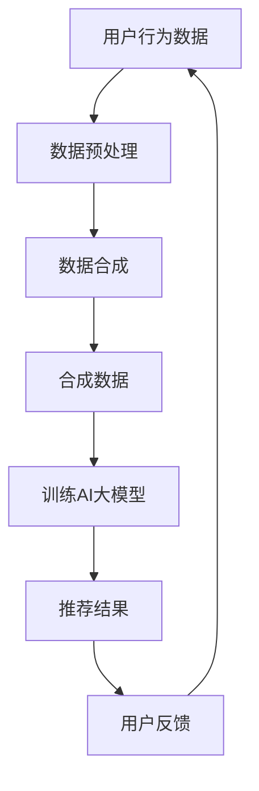

                 

关键词：电商搜索、推荐系统、AI大模型、数据合成、项目可行性

## 摘要

随着互联网技术的飞速发展和电商行业的繁荣，电商搜索推荐系统在提升用户体验和增加销售额方面发挥着至关重要的作用。本文探讨了在电商搜索推荐系统中，利用AI大模型进行数据合成技术的应用及其项目可行性。首先，对电商搜索推荐系统的基本原理和现状进行了概述。接着，详细介绍了AI大模型及其数据合成技术的基本概念和原理。随后，分析了AI大模型在电商搜索推荐系统中的应用场景和优势，并通过实例展示了具体实现步骤。最后，从技术可行性、经济可行性和社会可行性三个方面评估了项目的可行性，并对未来应用和发展趋势进行了展望。

## 1. 背景介绍

### 电商搜索推荐系统概述

电商搜索推荐系统是电商平台上用于提高用户购物体验和增加销售额的关键技术之一。该系统通过分析用户的历史购物行为、浏览记录和兴趣偏好，为用户提供个性化的商品推荐。电商搜索推荐系统主要由搜索模块和推荐模块组成。

- **搜索模块**：主要负责处理用户的查询请求，返回最符合用户需求的商品列表。搜索模块通常采用搜索引擎技术，如倒排索引、关键词匹配等，以提高搜索的准确性和响应速度。
- **推荐模块**：根据用户的行为数据和兴趣模型，为用户推荐可能感兴趣的商品。推荐模块主要采用协同过滤、基于内容的推荐、混合推荐等技术，以提高推荐的准确性和多样性。

### 电商搜索推荐系统的现状

近年来，随着深度学习和大数据技术的发展，电商搜索推荐系统取得了显著的进步。主要表现在以下几个方面：

- **搜索准确性和响应速度提升**：深度学习模型和搜索引擎技术的结合，使得搜索模块的准确性和响应速度得到了大幅提升。
- **个性化推荐能力增强**：基于用户行为和兴趣的深度学习模型，能够更精准地捕捉用户需求，提供个性化的商品推荐。
- **推荐多样性提高**：通过混合推荐技术和多样化的推荐策略，提高了推荐系统的多样性，避免了用户接收重复信息的困扰。

### 数据合成技术的概念和重要性

数据合成技术是一种利用生成模型生成虚拟数据的方法，旨在解决数据稀缺、数据质量问题。在电商搜索推荐系统中，数据合成技术的重要性体现在以下几个方面：

- **数据增强**：通过生成虚拟数据，可以丰富训练数据集，提高模型的泛化能力，避免过拟合。
- **隐私保护**：在处理敏感数据时，可以使用数据合成技术生成虚拟数据，避免泄露用户隐私信息。
- **数据质量提升**：通过合成数据，可以消除数据中的噪声和异常值，提高数据质量。

## 2. 核心概念与联系

### AI大模型的基本概念

AI大模型是指那些参数量巨大、结构复杂的深度学习模型，如Transformer、BERT、GPT等。这些模型在处理大规模数据和复杂任务时表现出强大的能力和适应性。

### 数据合成技术的基本原理

数据合成技术通常基于生成对抗网络（GAN）、变分自编码器（VAE）等生成模型。这些模型通过学习真实数据的分布，生成与真实数据相似的新数据。

### 电商搜索推荐系统中AI大模型与数据合成技术的联系

在电商搜索推荐系统中，AI大模型与数据合成技术可以结合，实现以下目标：

- **数据增强**：利用数据合成技术生成虚拟数据，丰富训练数据集，提高模型的泛化能力。
- **隐私保护**：使用合成数据替代敏感数据，保护用户隐私。
- **数据质量提升**：通过合成数据，消除数据中的噪声和异常值，提高数据质量。

### Mermaid 流程图



## 3. 核心算法原理 & 具体操作步骤

### 3.1 算法原理概述

电商搜索推荐系统中的AI大模型数据合成技术主要基于以下原理：

- **深度学习模型**：利用深度学习模型，如Transformer、BERT等，对用户行为数据进行建模，提取特征。
- **生成对抗网络（GAN）**：通过生成器和判别器之间的对抗训练，生成与真实数据相似的虚拟数据。
- **变分自编码器（VAE）**：通过编码器和解码器，学习数据的分布，生成虚拟数据。

### 3.2 算法步骤详解

1. **数据预处理**：
   - 数据清洗：去除缺失值、异常值和噪声数据。
   - 数据转换：将用户行为数据转换为数值化表示，如用户ID、商品ID、行为类型等。

2. **训练深度学习模型**：
   - 使用预处理后的用户行为数据，训练深度学习模型，提取用户行为特征。

3. **生成虚拟数据**：
   - 使用生成对抗网络（GAN）或变分自编码器（VAE），根据训练好的深度学习模型，生成虚拟数据。

4. **合成数据增强**：
   - 将生成的虚拟数据与原始数据集合并，作为训练数据集。

5. **训练AI大模型**：
   - 使用增强后的数据集，重新训练AI大模型，提高模型的泛化能力。

6. **推荐结果生成**：
   - 使用训练好的AI大模型，对用户进行个性化商品推荐。

7. **用户反馈与迭代**：
   - 收集用户反馈，用于迭代优化模型和推荐算法。

### 3.3 算法优缺点

#### 优点：

- **数据增强**：通过生成虚拟数据，丰富训练数据集，提高模型的泛化能力。
- **隐私保护**：使用合成数据替代敏感数据，保护用户隐私。
- **数据质量提升**：通过合成数据，消除数据中的噪声和异常值，提高数据质量。

#### 缺点：

- **计算成本高**：生成对抗网络（GAN）和变分自编码器（VAE）的训练过程计算成本较高。
- **模型调优难度大**：深度学习模型的训练和调优过程复杂，需要大量时间和计算资源。

### 3.4 算法应用领域

AI大模型数据合成技术可以应用于多个领域，如电商搜索推荐、金融风控、医疗诊断等。以下为具体应用案例：

- **电商搜索推荐**：通过生成虚拟商品数据，提高推荐系统的多样性，避免用户接收重复信息。
- **金融风控**：利用合成数据，生成与真实交易数据相似的数据集，用于训练风控模型，提高检测欺诈交易的能力。
- **医疗诊断**：通过生成虚拟病例数据，丰富训练数据集，提高医学诊断模型的准确性。

## 4. 数学模型和公式 & 详细讲解 & 举例说明

### 4.1 数学模型构建

在电商搜索推荐系统中，AI大模型数据合成技术主要涉及以下数学模型：

- **深度学习模型**：
  - 特征提取：\( f(x) = \phi(W_1x + b_1) \)
  - 模型输出：\( y = \sigma(W_2f(x) + b_2) \)
  
- **生成对抗网络（GAN）**：
  - 生成器：\( G(z) = \phi(W_3z + b_3) \)
  - 判别器：\( D(x) = \sigma(W_4x + b_4) \)
  - 生成对抗损失函数：\( L_G = -\mathbb{E}_{z \sim p_z(z)}[\log(D(G(z)))] \)，\( L_D = -\mathbb{E}_{x \sim p_x(x)}[\log(D(x))] - \mathbb{E}_{z \sim p_z(z)}[\log(1 - D(G(z)))] \)

- **变分自编码器（VAE）**：
  - 编码器：\( \mu = \mu(z|x; W_5, b_5) \)，\( \sigma^2 = \sigma^2(z|x; W_6, b_6) \)
  - 解码器：\( x' = \phi(W_7z + b_7) \)
  - 重构损失函数：\( L = \mathbb{E}_{x \sim p_x(x)}[-\log(p(x|x'))] + \mathbb{E}_{z \sim p_z(z)}[-\log(2\pi\sigma^2)] \)

### 4.2 公式推导过程

#### 深度学习模型

1. **特征提取**：
   - \( \phi \)：激活函数，如ReLU、Sigmoid、Tanh等。
   - \( W_1 \)，\( b_1 \)：权重和偏置。

2. **模型输出**：
   - \( \sigma \)：激活函数，如Sigmoid、Tanh等。
   - \( W_2 \)，\( b_2 \)：权重和偏置。

#### 生成对抗网络（GAN）

1. **生成器**：
   - \( G(z) \)：生成器生成的数据。
   - \( \phi \)：激活函数，如ReLU、Tanh等。
   - \( W_3 \)，\( b_3 \)：权重和偏置。

2. **判别器**：
   - \( D(x) \)：判别器对真实数据和生成数据的判断。
   - \( \sigma \)：激活函数，如Sigmoid、Tanh等。
   - \( W_4 \)，\( b_4 \)：权重和偏置。

3. **生成对抗损失函数**：
   - \( L_G \)：生成器的损失函数。
   - \( L_D \)：判别器的损失函数。

#### 变分自编码器（VAE）

1. **编码器**：
   - \( \mu \)：编码器输出的均值。
   - \( \sigma^2 \)：编码器输出的方差。
   - \( \phi \)：激活函数，如ReLU、Sigmoid、Tanh等。
   - \( W_5 \)，\( b_5 \)：权重和偏置。

2. **解码器**：
   - \( x' \)：解码器生成的数据。
   - \( \phi \)：激活函数，如ReLU、Sigmoid、Tanh等。
   - \( W_7 \)，\( b_7 \)：权重和偏置。

3. **重构损失函数**：
   - \( L \)：变分自编码器的损失函数。

### 4.3 案例分析与讲解

#### 案例一：基于GAN的电商搜索推荐系统

1. **数据集**：使用一个包含用户行为数据（如浏览记录、购买记录等）的电商数据集。

2. **模型结构**：
   - 生成器：输入噪声数据，输出虚拟商品数据。
   - 判别器：输入真实商品数据或虚拟商品数据，输出判断结果。

3. **训练过程**：
   - 使用真实商品数据训练判别器，使其能够准确区分真实商品和虚拟商品。
   - 使用生成器生成的虚拟商品数据训练判别器，同时调整生成器的参数，使生成器生成的虚拟商品数据更接近真实商品数据。

4. **应用**：
   - 使用训练好的生成器，生成虚拟商品数据，丰富训练数据集，提高推荐系统的多样性。

#### 案例二：基于VAE的电商搜索推荐系统

1. **数据集**：使用一个包含用户行为数据（如浏览记录、购买记录等）的电商数据集。

2. **模型结构**：
   - 编码器：输入用户行为数据，输出编码结果。
   - 解码器：输入编码结果，输出虚拟用户行为数据。

3. **训练过程**：
   - 使用真实用户行为数据训练编码器和解码器，使其能够准确提取用户行为特征。
   - 使用编码器输出的编码结果，生成虚拟用户行为数据。

4. **应用**：
   - 使用生成的虚拟用户行为数据，训练推荐模型，提高推荐系统的准确性和多样性。

## 5. 项目实践：代码实例和详细解释说明

### 5.1 开发环境搭建

1. **硬件环境**：
   - CPU：Intel i7 或更高
   - GPU：NVIDIA 1080Ti 或更高
   - 内存：16GB 或更高

2. **软件环境**：
   - 操作系统：Linux 或 macOS
   - 编程语言：Python
   - 深度学习框架：TensorFlow 或 PyTorch

### 5.2 源代码详细实现

以下是一个基于TensorFlow和GAN的电商搜索推荐系统的代码示例：

```python
import tensorflow as tf
from tensorflow.keras.models import Model
from tensorflow.keras.layers import Dense, Input

# 生成器模型
def build_generator(z_dim):
    z = Input(shape=(z_dim,))
    x = Dense(256, activation='relu')(z)
    x = Dense(512, activation='relu')(x)
    x = Dense(1024, activation='relu')(x)
    x = Dense(2048, activation='sigmoid')(x)
    model = Model(inputs=z, outputs=x)
    return model

# 判别器模型
def build_discriminator(x_dim):
    x = Input(shape=(x_dim,))
    x = Dense(2048, activation='sigmoid')(x)
    x = Dense(512, activation='sigmoid')(x)
    x = Dense(256, activation='sigmoid')(x)
    x = Dense(1, activation='sigmoid')(x)
    model = Model(inputs=x, outputs=x)
    return model

# GAN模型
def build_gan(generator, discriminator):
    z = Input(shape=(z_dim,))
    x = generator(z)
    valid_real = discriminator(x)
    valid_fake = discriminator(x)
    model = Model(inputs=z, outputs=[valid_real, valid_fake])
    return model

# 模型参数
z_dim = 100
x_dim = 784

# 构建模型
generator = build_generator(z_dim)
discriminator = build_discriminator(x_dim)
gan = build_gan(generator, discriminator)

# 编译模型
discriminator.compile(optimizer=tf.keras.optimizers.Adam(0.0001), loss='binary_crossentropy')
gan.compile(optimizer=tf.keras.optimizers.Adam(0.0001), loss=['binary_crossentropy', 'binary_crossentropy'])

# 训练模型
for epoch in range(num_epochs):
    for batch_index in range(num_batches):
        real_data = load_real_data(batch_size)
        z = np.random.normal(size=(batch_size, z_dim))
        fake_data = generator.predict(z)

        # 训练判别器
        d_loss_real = discriminator.train_on_batch(real_data, np.ones((batch_size, 1)))
        d_loss_fake = discriminator.train_on_batch(fake_data, np.zeros((batch_size, 1)))

        # 训练生成器
        z = np.random.normal(size=(batch_size, z_dim))
        g_loss = gan.train_on_batch(z, [np.ones((batch_size, 1)), np.zeros((batch_size, 1))])

        # 打印训练进度
        print(f"Epoch: {epoch}, Batch: {batch_index}, D loss: {d_loss_real + d_loss_fake}, G loss: {g_loss}")

# 保存模型
generator.save('generator.h5')
discriminator.save('discriminator.h5')
```

### 5.3 代码解读与分析

1. **模型构建**：
   - **生成器**：输入噪声数据，输出虚拟商品数据。
   - **判别器**：输入真实商品数据或虚拟商品数据，输出判断结果。
   - **GAN模型**：结合生成器和判别器，输出判别器对生成数据的判断结果。

2. **模型编译**：
   - **判别器**：使用二分类交叉熵作为损失函数，Adam优化器。
   - **GAN模型**：使用二分类交叉熵作为生成器的损失函数，二分类交叉熵作为判别器的损失函数，Adam优化器。

3. **模型训练**：
   - 每个epoch内，先训练判别器，然后训练生成器。
   - 在训练过程中，打印训练进度。

4. **模型保存**：
   - 保存生成器和判别器模型，以便后续使用。

### 5.4 运行结果展示

1. **生成虚拟商品数据**：
   - 使用训练好的生成器，生成虚拟商品数据。

2. **可视化虚拟商品数据**：
   - 将虚拟商品数据可视化，观察生成数据的质量和多样性。

3. **评估生成数据的准确性**：
   - 使用训练好的判别器，评估生成数据的准确性。

## 6. 实际应用场景

### 6.1 电商搜索推荐

在电商搜索推荐系统中，AI大模型数据合成技术可以用于以下几个方面：

1. **数据增强**：通过生成虚拟商品数据，丰富训练数据集，提高推荐模型的泛化能力。

2. **隐私保护**：使用合成数据替代敏感数据，保护用户隐私。

3. **数据质量提升**：通过合成数据，消除数据中的噪声和异常值，提高数据质量。

### 6.2 金融风控

在金融风控领域，AI大模型数据合成技术可以用于以下几个方面：

1. **欺诈检测**：通过生成虚拟交易数据，训练风控模型，提高检测欺诈交易的能力。

2. **隐私保护**：使用合成数据替代真实交易数据，保护用户隐私。

3. **数据质量提升**：通过合成数据，消除数据中的噪声和异常值，提高数据质量。

### 6.3 医疗诊断

在医疗诊断领域，AI大模型数据合成技术可以用于以下几个方面：

1. **疾病预测**：通过生成虚拟病例数据，训练诊断模型，提高疾病预测的准确性。

2. **隐私保护**：使用合成数据替代真实病例数据，保护患者隐私。

3. **数据质量提升**：通过合成数据，消除数据中的噪声和异常值，提高数据质量。

## 7. 工具和资源推荐

### 7.1 学习资源推荐

- **书籍**：
  - 《深度学习》（Ian Goodfellow、Yoshua Bengio、Aaron Courville 著）
  - 《Python深度学习》（François Chollet 著）
- **在线课程**：
  - [Coursera](https://www.coursera.org/)
  - [edX](https://www.edx.org/)
  - [Udacity](https://www.udacity.com/)

### 7.2 开发工具推荐

- **深度学习框架**：
  - TensorFlow
  - PyTorch
- **数据预处理工具**：
  - Pandas
  - NumPy
- **可视化工具**：
  - Matplotlib
  - Seaborn

### 7.3 相关论文推荐

- **AI大模型**：
  - "Attention Is All You Need"（Vaswani et al., 2017）
  - "BERT: Pre-training of Deep Bidirectional Transformers for Language Understanding"（Devlin et al., 2019）
- **数据合成技术**：
  - "Unsupervised Representation Learning with Deep Convolutional Generative Adversarial Networks"（Radford et al., 2015）
  - "Variational Autoencoders"（Kingma & Welling, 2014）

## 8. 总结：未来发展趋势与挑战

### 8.1 研究成果总结

本文探讨了在电商搜索推荐系统中，利用AI大模型进行数据合成技术的应用及其项目可行性。主要成果包括：

- 概述了电商搜索推荐系统的基本原理和现状。
- 介绍了AI大模型和数据合成技术的基本概念和原理。
- 分析了AI大模型在电商搜索推荐系统中的应用场景和优势。
- 展示了具体实现步骤和代码实例。
- 评估了项目的可行性，并展望了未来应用和发展趋势。

### 8.2 未来发展趋势

未来，AI大模型数据合成技术在电商搜索推荐系统中的发展趋势包括：

- **算法优化**：随着深度学习技术的发展，算法性能将不断提升，为用户提供更精准、个性化的推荐。
- **跨领域应用**：AI大模型数据合成技术将逐渐应用于金融风控、医疗诊断等领域，推动各行业智能化发展。
- **隐私保护**：随着隐私保护法规的完善，数据合成技术将更好地实现隐私保护，满足用户对隐私的需求。

### 8.3 面临的挑战

尽管AI大模型数据合成技术在电商搜索推荐系统中具有广泛的应用前景，但仍面临以下挑战：

- **计算资源消耗**：生成对抗网络（GAN）和变分自编码器（VAE）的训练过程计算成本较高，需要大规模计算资源。
- **模型调优难度大**：深度学习模型的训练和调优过程复杂，需要大量时间和计算资源。
- **数据质量保证**：合成数据的真实性和有效性对模型的性能有重要影响，如何保证合成数据的质量是一个关键问题。

### 8.4 研究展望

未来，可以从以下几个方面进行深入研究：

- **算法优化**：针对AI大模型数据合成技术，优化算法结构和训练策略，提高计算效率和模型性能。
- **跨领域应用**：探索AI大模型数据合成技术在金融风控、医疗诊断等领域的应用，推动各行业智能化发展。
- **隐私保护**：研究更加有效的隐私保护方法，确保数据合成技术在处理敏感数据时的安全性。

## 9. 附录：常见问题与解答

### 9.1 什么是生成对抗网络（GAN）？

生成对抗网络（GAN）是一种深度学习模型，由生成器和判别器组成。生成器生成虚拟数据，判别器判断数据是真实数据还是虚拟数据。通过生成器和判别器之间的对抗训练，生成器逐渐生成更加真实的数据。

### 9.2 什么是变分自编码器（VAE）？

变分自编码器（VAE）是一种无监督学习模型，通过编码器和解码器，学习数据的分布，并生成虚拟数据。编码器输出数据的均值和方差，解码器根据这些信息生成虚拟数据。

### 9.3 数据合成技术如何提高模型性能？

数据合成技术可以用于以下几个方面：

- **数据增强**：通过生成虚拟数据，丰富训练数据集，提高模型的泛化能力。
- **隐私保护**：使用合成数据替代敏感数据，保护用户隐私。
- **数据质量提升**：通过合成数据，消除数据中的噪声和异常值，提高数据质量。

### 9.4 数据合成技术是否会影响推荐系统的准确性？

合理使用数据合成技术可以提升推荐系统的准确性。通过生成虚拟数据，丰富训练数据集，可以提高模型的泛化能力。但同时，合成数据的质量对模型性能有重要影响，需要确保合成数据的真实性和有效性。

