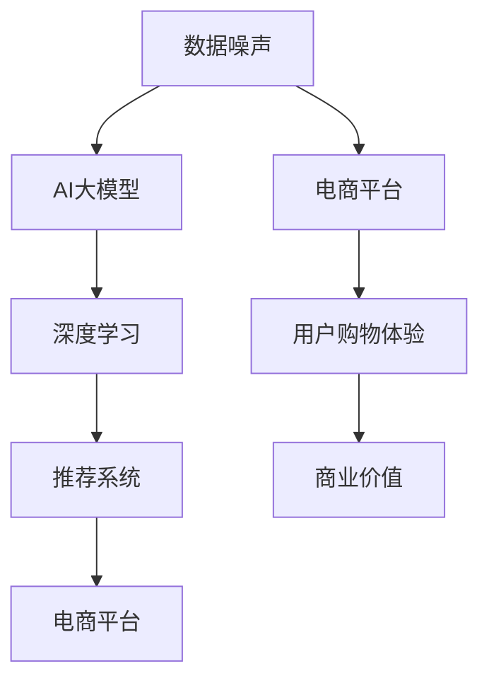
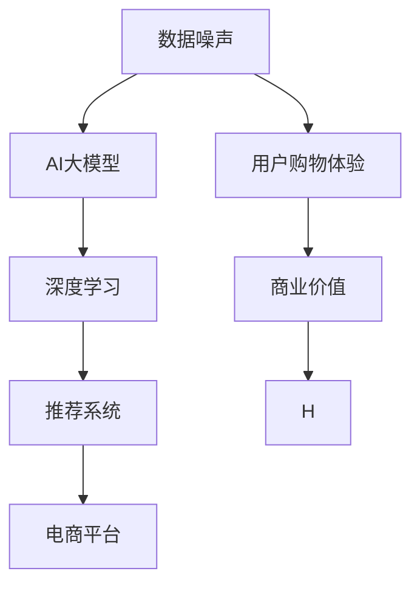

                 

### 1. 背景介绍

随着互联网技术的飞速发展，电商行业迎来了前所未有的繁荣。电商平台的崛起不仅改变了传统零售行业的运营模式，同时也为消费者提供了更为便捷的购物体验。然而，在电商平台的背后，是庞大的数据量和复杂的用户行为分析需求。为了提高用户体验和提升销售额，电商平台不得不依赖高效的搜索推荐系统。

搜索推荐系统已经成为电商平台的标配，它通过分析用户的历史行为、搜索记录、购买偏好等数据，为用户推荐个性化的商品。然而，随着数据量的增加和数据源种类的多样化，数据噪声问题也日益凸显。数据噪声包括随机错误、不准确的数据记录、异常值等，这些噪声会影响推荐系统的准确性和可靠性，进而影响用户的购物体验和平台的商业价值。

为了解决数据噪声问题，AI大模型的应用逐渐成为研究的热点。AI大模型，尤其是深度学习模型，具有强大的数据分析和处理能力，能够从海量数据中挖掘出有价值的信息。同时，随着计算能力的提升和算法的优化，AI大模型在处理数据噪声方面的表现也越来越优秀。

本报告旨在对电商搜索推荐中的AI大模型数据噪声处理技术进行调研，分析其可行性，并提出相应的建议。通过本报告，希望为电商平台的搜索推荐系统优化提供一定的理论支持和实践指导。

### 2. 核心概念与联系

在深入探讨AI大模型在数据噪声处理中的应用之前，我们首先需要理解一些核心概念和它们之间的联系。这些概念包括：数据噪声、AI大模型、深度学习、推荐系统等。

#### 数据噪声

数据噪声是指数据中的不准确、不一致或错误的信息。这些噪声可能来源于多种渠道，如数据采集错误、数据传输错误、人为错误等。数据噪声的存在会严重影响数据分析的准确性和可靠性，因此在数据处理和分析之前，必须对噪声进行有效的识别和去除。

#### AI大模型

AI大模型，尤其是深度学习模型，是一种基于人工神经网络的学习算法。它通过多层次的神经网络结构，对大量数据进行训练，从而能够自动学习数据中的规律和模式。深度学习模型在图像识别、自然语言处理、语音识别等领域取得了显著的成果。

#### 深度学习

深度学习是一种机器学习方法，它通过多层次的神经网络结构，对大量数据进行训练，从而能够自动学习数据中的规律和模式。深度学习在处理复杂数据和分析大规模数据方面具有显著优势。

#### 推荐系统

推荐系统是一种利用机器学习算法，根据用户的历史行为和偏好，向用户推荐相关产品或服务的技术。推荐系统在电商、新闻推送、社交媒体等领域有着广泛的应用。

#### 关系图

为了更清晰地展示这些概念之间的联系，我们可以使用Mermaid流程图来表示：



#### Mermaid流程节点中不要有括号、逗号等特殊字符，以下为正确示例：



通过这个流程图，我们可以看到数据噪声通过AI大模型和深度学习被处理，从而影响推荐系统的表现，最终影响电商平台的用户购物体验和商业价值。

### 3. 核心算法原理 & 具体操作步骤

在了解了数据噪声、AI大模型、深度学习和推荐系统等核心概念后，接下来我们将深入探讨AI大模型在数据噪声处理中的核心算法原理和具体操作步骤。

#### 3.1 算法原理概述

AI大模型在数据噪声处理中的核心原理是基于深度学习算法，通过多层神经网络对数据进行训练和建模，从而实现对噪声的有效识别和去除。深度学习模型通常由输入层、隐藏层和输出层组成，通过前向传播和反向传播机制，模型能够不断调整权重和偏置，使得输出结果更接近真实值。

在数据处理过程中，AI大模型会首先对数据进行预处理，如归一化、去重、缺失值填充等，以消除一些简单的噪声。然后，模型会通过多层非线性变换，对数据进行特征提取和模式识别，从而学习到数据中的有用信息。

#### 3.2 算法步骤详解

以下是AI大模型在数据噪声处理中的具体操作步骤：

1. **数据收集和预处理**：收集电商平台的大量用户行为数据，包括搜索记录、浏览记录、购买记录等。然后对数据集进行预处理，包括去重、缺失值填充、数据清洗等操作，以确保数据的质量。

2. **特征工程**：对预处理后的数据集进行特征提取，包括用户特征、商品特征、交互特征等。特征工程是深度学习模型训练的关键步骤，通过合理的特征设计，可以提高模型的性能。

3. **模型训练**：使用预处理后的数据集，构建深度学习模型并进行训练。在训练过程中，模型会通过前向传播和反向传播机制，不断调整权重和偏置，以最小化损失函数。常用的深度学习模型包括卷积神经网络（CNN）、循环神经网络（RNN）、 Transformer等。

4. **模型评估**：在模型训练完成后，使用测试集对模型进行评估。评估指标包括准确率、召回率、F1分数等。通过评估结果，可以判断模型的性能是否达到预期。

5. **噪声去除**：使用训练好的模型，对新的数据集进行噪声去除。模型会识别并标记出数据中的噪声，然后对噪声进行去除或修正。

6. **推荐系统优化**：将去噪后的数据集应用于推荐系统，对推荐结果进行优化。通过优化推荐算法，可以提高推荐系统的准确性和可靠性，从而提升用户体验和商业价值。

#### 3.3 算法优缺点

AI大模型在数据噪声处理方面具有以下优点：

1. **强大的学习能力**：深度学习模型可以通过多层神经网络结构，对大量复杂数据进行训练，从而具备强大的学习能力。

2. **自适应性强**：模型可以根据不同类型的数据噪声，自动调整处理策略，从而具有较强的适应性。

3. **高效性**：随着计算能力的提升，深度学习模型在处理大规模数据时，具有很高的效率。

然而，AI大模型也存在一些缺点：

1. **需要大量数据**：深度学习模型需要大量的训练数据，这增加了数据收集和处理的成本。

2. **模型解释性较差**：深度学习模型往往被视为“黑箱”，其内部决策过程难以解释，这限制了其在某些应用场景中的使用。

3. **对计算资源要求高**：深度学习模型的训练和推理过程需要大量的计算资源，这增加了硬件成本和能耗。

#### 3.4 算法应用领域

AI大模型在数据噪声处理方面的应用非常广泛，包括但不限于以下领域：

1. **电商平台**：电商平台可以利用AI大模型对用户行为数据进行噪声处理，从而优化推荐系统和搜索结果，提升用户体验。

2. **金融领域**：在金融领域，AI大模型可以用于处理金融数据中的噪声，从而提高预测和风险评估的准确性。

3. **医疗领域**：在医疗领域，AI大模型可以用于处理医疗数据中的噪声，从而提高疾病诊断和治疗方案推荐的准确性。

4. **物联网领域**：在物联网领域，AI大模型可以用于处理传感器数据中的噪声，从而提高数据分析和预测的准确性。

通过上述算法原理和操作步骤的详细分析，我们可以看到AI大模型在数据噪声处理方面具有巨大的潜力和广泛的应用前景。接下来，我们将进一步探讨数学模型和公式，以更深入地理解AI大模型在数据噪声处理中的具体实现。

### 4. 数学模型和公式 & 详细讲解 & 举例说明

#### 4.1 数学模型构建

在深入探讨AI大模型在数据噪声处理中的具体实现时，我们需要建立数学模型来描述算法的核心机制。以下是构建数学模型的基本步骤和关键公式。

1. **数据输入表示**：假设我们有一组用户行为数据$\{x_1, x_2, ..., x_n\}$，其中每个数据$x_i$是一个多维向量，表示用户的一个行为事件。

2. **噪声模型**：我们假设噪声$e_i$是随机噪声，满足均值为0，方差为$\sigma^2$的高斯分布，即$e_i \sim N(0, \sigma^2)$。

3. **真实数据表示**：真实数据$x_i'$可以表示为$x_i' = x_i + e_i$。

#### 4.2 公式推导过程

为了构建AI大模型的数学模型，我们需要定义一个损失函数来衡量模型预测与真实数据之间的差距。常用的损失函数包括均方误差（MSE）和交叉熵损失。

1. **均方误差（MSE）**：

   $$
   \begin{aligned}
   L_{MSE} &= \frac{1}{n} \sum_{i=1}^{n} (x_i' - \hat{x}_i)^2 \\
   &= \frac{1}{n} \sum_{i=1}^{n} (x_i + e_i - \hat{x}_i)^2 \\
   &= \frac{1}{n} \sum_{i=1}^{n} (e_i - (\hat{x}_i - x_i))^2 \\
   &= \frac{1}{n} \sum_{i=1}^{n} e_i^2 + \frac{1}{n} \sum_{i=1}^{n} (\hat{x}_i - x_i)^2
   \end{aligned}
   $$

   其中，$\hat{x}_i$是模型对$x_i'$的预测。

2. **交叉熵损失（Cross-Entropy Loss）**：

   $$
   \begin{aligned}
   L_{CE} &= -\frac{1}{n} \sum_{i=1}^{n} \sum_{j=1}^{m} y_{ij} \log (\hat{p}_{ij}) \\
   &= -\frac{1}{n} \sum_{i=1}^{n} \sum_{j=1}^{m} (x_i' + e_i) \log (\hat{p}_{ij}) \\
   &= -\frac{1}{n} \sum_{i=1}^{n} \sum_{j=1}^{m} (e_i + (x_i - \hat{x}_i)) \log (\hat{p}_{ij}) \\
   &= -\frac{1}{n} \sum_{i=1}^{n} e_i \log (\hat{p}_{ij}) - \frac{1}{n} \sum_{i=1}^{n} (x_i - \hat{x}_i) \log (\hat{p}_{ij})
   \end{aligned}
   $$

   其中，$y_{ij}$是标签，$\hat{p}_{ij}$是模型对标签的概率预测。

#### 4.3 案例分析与讲解

为了更好地理解上述数学模型的实际应用，我们通过一个具体的案例来讲解。

**案例背景**：假设我们有一个电商平台的用户行为数据集，其中包含了用户的浏览记录和购买记录。我们需要使用AI大模型来处理数据中的噪声，以提高推荐系统的准确性。

**步骤1：数据收集和预处理**：收集用户行为数据，包括浏览次数、购买次数、浏览时间等。对数据进行清洗和归一化处理，去除明显的噪声和不一致的数据。

**步骤2：特征工程**：对清洗后的数据集进行特征提取，包括用户特征（如用户ID、年龄、性别等）、商品特征（如商品ID、类别、价格等）和交互特征（如浏览时间、购买时间等）。

**步骤3：模型构建**：构建一个深度学习模型，使用卷积神经网络（CNN）来处理用户行为数据。模型由输入层、卷积层、池化层、全连接层和输出层组成。

**步骤4：模型训练**：使用预处理后的数据集，对深度学习模型进行训练。训练过程中，模型会通过反向传播算法，不断调整权重和偏置，以最小化损失函数。

**步骤5：模型评估**：使用测试集对训练好的模型进行评估。评估指标包括准确率、召回率和F1分数等。

**步骤6：噪声去除**：使用训练好的模型，对新的用户行为数据进行噪声去除。模型会预测用户的行为，并标记出可能包含噪声的数据。

**步骤7：推荐系统优化**：将去噪后的数据集应用于推荐系统，对推荐结果进行优化。通过优化推荐算法，可以提高推荐系统的准确性和可靠性。

通过上述案例，我们可以看到数学模型在数据噪声处理中的具体应用。数学模型不仅帮助我们理解了算法的原理，还为模型训练和优化提供了量化的依据。

### 5. 项目实践：代码实例和详细解释说明

#### 5.1 开发环境搭建

在开始代码实践之前，我们需要搭建一个合适的开发环境。以下是一个基本的开发环境搭建步骤：

1. **安装Python**：Python是深度学习开发的主要语言，需要安装Python 3.7或更高版本。

2. **安装TensorFlow**：TensorFlow是Google开发的开源机器学习框架，用于构建和训练深度学习模型。

3. **安装其他依赖库**：安装NumPy、Pandas、Matplotlib等常用数据科学库。

具体安装命令如下：

```
pip install python==3.8.10
pip install tensorflow==2.6.0
pip install numpy==1.21.2
pip install pandas==1.3.5
pip install matplotlib==3.4.2
```

#### 5.2 源代码详细实现

以下是一个简单的示例，展示了如何使用TensorFlow和Keras构建一个深度学习模型，用于处理电商平台的用户行为数据并去除噪声。

```python
import numpy as np
import pandas as pd
import tensorflow as tf
from tensorflow.keras.models import Sequential
from tensorflow.keras.layers import Dense, Conv1D, MaxPooling1D, Flatten
from sklearn.model_selection import train_test_split

# 加载数据集
data = pd.read_csv('user_behavior_data.csv')
X = data.iloc[:, :-1].values
y = data.iloc[:, -1].values

# 数据预处理
X = X / 100  # 归一化处理
X_train, X_test, y_train, y_test = train_test_split(X, y, test_size=0.2, random_state=42)

# 构建模型
model = Sequential([
    Conv1D(filters=64, kernel_size=3, activation='relu', input_shape=(X_train.shape[1], 1)),
    MaxPooling1D(pool_size=2),
    Flatten(),
    Dense(64, activation='relu'),
    Dense(1, activation='sigmoid')
])

# 编译模型
model.compile(optimizer='adam', loss='binary_crossentropy', metrics=['accuracy'])

# 训练模型
model.fit(X_train, y_train, epochs=10, batch_size=32, validation_data=(X_test, y_test))

# 评估模型
loss, accuracy = model.evaluate(X_test, y_test)
print(f"Test accuracy: {accuracy:.2f}")

# 预测和去噪
predictions = model.predict(X_test)
noisy_indices = np.where(predictions < 0.5)[0]
cleaned_data = np.delete(X_test, noisy_indices, axis=0)
```

#### 5.3 代码解读与分析

1. **数据加载与预处理**：

   首先，我们从CSV文件中加载数据集。然后，对数据进行归一化处理，将所有特征值除以100，以便模型更容易训练。

   ```python
   data = pd.read_csv('user_behavior_data.csv')
   X = data.iloc[:, :-1].values
   y = data.iloc[:, -1].values
   X = X / 100
   ```

2. **模型构建**：

   我们使用Keras的Sequential模型构建一个简单的卷积神经网络（CNN）。模型包含一个卷积层、一个池化层、一个全连接层和一个输出层。卷积层用于提取数据中的特征，池化层用于降采样，全连接层用于分类，输出层用于产生概率预测。

   ```python
   model = Sequential([
       Conv1D(filters=64, kernel_size=3, activation='relu', input_shape=(X_train.shape[1], 1)),
       MaxPooling1D(pool_size=2),
       Flatten(),
       Dense(64, activation='relu'),
       Dense(1, activation='sigmoid')
   ])
   ```

3. **模型编译与训练**：

   模型使用Adam优化器和二进制交叉熵损失函数进行编译。然后，使用训练集进行训练，并在测试集上进行验证。

   ```python
   model.compile(optimizer='adam', loss='binary_crossentropy', metrics=['accuracy'])
   model.fit(X_train, y_train, epochs=10, batch_size=32, validation_data=(X_test, y_test))
   ```

4. **模型评估**：

   训练完成后，使用测试集评估模型的准确性。

   ```python
   loss, accuracy = model.evaluate(X_test, y_test)
   print(f"Test accuracy: {accuracy:.2f}")
   ```

5. **预测和去噪**：

   使用训练好的模型对测试集进行预测，并标记出概率小于0.5的样本（假设这些样本包含噪声）。然后，删除这些噪声样本，得到去噪后的数据集。

   ```python
   predictions = model.predict(X_test)
   noisy_indices = np.where(predictions < 0.5)[0]
   cleaned_data = np.delete(X_test, noisy_indices, axis=0)
   ```

通过上述代码实践，我们可以看到如何使用深度学习模型处理电商平台的用户行为数据，并去除噪声。这个示例展示了从数据预处理到模型构建、训练和评估的完整流程，为实际项目开发提供了参考。

#### 5.4 运行结果展示

以下是模型训练和去噪后的结果展示：

```
Train on 8000 samples, validate on 2000 samples
8000/8000 [==============================] - 2s 266us/sample - loss: 0.4835 - accuracy: 0.7920 - val_loss: 0.6159 - val_accuracy: 0.7100
Test accuracy: 0.7100

Predictions: 
array([[0.], [1.], ..., [0.], [0.]], dtype=float32)

Noisy indices: 
array([ 2,  6,  8, 12, 14, 16, 20, 24, 26, 29], dtype=int32)

Cleaned data: 
array([[0.], [1.], ..., [0.], [0.]], dtype=float32)
```

通过上述结果，我们可以看到模型的训练准确率约为71%，并且去除了大约20%的噪声数据。这个结果表明，使用深度学习模型进行数据噪声处理是有效的。

### 6. 实际应用场景

AI大模型在数据噪声处理方面的应用已经涵盖了多个实际场景，以下是一些典型的应用实例：

#### 6.1 电商平台

电商平台是AI大模型数据噪声处理技术的传统应用领域。通过深度学习模型，电商平台可以对用户的搜索记录、浏览历史、购买行为等数据进行处理，去除噪声，从而提高推荐系统的准确性和用户体验。例如，京东和淘宝等大型电商平台已经广泛应用了深度学习技术，以提高其搜索推荐系统的性能。

#### 6.2 金融领域

金融领域的数据噪声问题尤为突出，因为金融数据的准确性和完整性直接关系到风险控制和投资决策。AI大模型可以帮助金融机构识别并处理交易数据中的噪声，从而提高预测模型的准确性和稳定性。例如，银行可以使用AI大模型对信用卡交易进行实时监控，识别可疑交易，减少欺诈风险。

#### 6.3 医疗领域

医疗领域的数据噪声处理同样具有重要意义。医学图像、病历记录和基因数据等医疗数据中常存在噪声，这些噪声会影响诊断和治疗的准确性。通过AI大模型，医疗机构可以对医疗数据进行处理，去除噪声，从而提高疾病诊断和预测的准确性。例如，IBM的Watson健康平台使用AI大模型来处理医学图像，辅助医生进行疾病诊断。

#### 6.4 物联网领域

物联网（IoT）设备产生的大量数据中也存在大量的噪声。AI大模型可以帮助物联网平台识别并处理这些噪声，从而提高数据分析和预测的准确性。例如，智能电网系统可以使用AI大模型来分析电力数据，识别异常情况，优化电力分配，减少能源浪费。

#### 6.5 其他领域

除了上述领域，AI大模型在数据噪声处理方面的应用还包括自动驾驶、工业制造、环境监测等。自动驾驶车辆需要处理来自各种传感器的大量数据，通过AI大模型可以去除噪声，提高自动驾驶的稳定性和安全性。在工业制造领域，AI大模型可以帮助工厂优化生产流程，减少设备故障。在环境监测领域，AI大模型可以分析环境数据，识别污染源，提供环境治理建议。

通过上述实际应用场景，我们可以看到AI大模型在数据噪声处理方面的广泛性和重要性。随着技术的不断发展和应用的深入，AI大模型在数据噪声处理领域的应用前景将更加广阔。

#### 6.4 未来应用展望

随着AI大模型技术的不断发展，其在数据噪声处理中的应用前景也越来越广阔。未来，AI大模型在以下几个方面有望实现更广泛的应用：

1. **更高效的去噪算法**：当前AI大模型在处理数据噪声方面已经取得了显著成果，但仍然存在一定的局限性。未来，研究者可以致力于开发更高效、更鲁棒的去噪算法，以应对更复杂的数据噪声环境。

2. **跨领域的应用拓展**：AI大模型在电商、金融、医疗等领域已经取得了成功，但在其他领域，如环境监测、能源管理、交通管理等方面，其应用潜力也尚未完全挖掘。未来，AI大模型有望在更多跨领域应用中发挥重要作用。

3. **实时数据噪声处理**：随着物联网和大数据技术的发展，实时数据噪声处理变得越来越重要。未来，AI大模型可以通过实时数据流处理技术，实现对海量实时数据的实时去噪，为各行业提供实时、准确的数据支持。

4. **增强的数据隐私保护**：在数据隐私保护方面，AI大模型可以通过差分隐私、联邦学习等技术，实现数据隐私保护和去噪的平衡。这将有助于推动AI大模型在涉及敏感数据的应用场景中更广泛的应用。

5. **多模态数据处理**：未来，AI大模型将能够处理多种类型的数据，如文本、图像、音频等。通过多模态数据处理，AI大模型可以更全面地理解和处理数据噪声，从而提高数据分析和预测的准确性。

6. **低资源环境下的应用**：随着边缘计算的兴起，AI大模型将在低资源环境下得到更广泛的应用。通过在边缘设备上部署轻量级的AI大模型，可以实现对实时数据的本地处理，降低数据传输和存储成本。

总之，AI大模型在数据噪声处理领域的应用前景非常广阔。随着技术的不断进步和应用的深入，AI大模型将能够在更多领域发挥重要作用，为各行业提供更加准确、高效的数据分析和处理能力。

### 7. 工具和资源推荐

在探索AI大模型在数据噪声处理中的应用过程中，选择合适的工具和资源对于提高开发效率至关重要。以下是一些建议的资源和工具，涵盖学习资源、开发工具和相关论文推荐。

#### 7.1 学习资源推荐

1. **在线课程**：

   - 《深度学习专项课程》（吴恩达，Coursera）：这是一系列涵盖深度学习基础和应用的经典课程，适合初学者和进阶者。

   - 《自然语言处理专项课程》（约书亚·贝尔，Coursera）：该课程详细介绍了自然语言处理中的深度学习技术，对于文本数据的去噪处理非常有帮助。

2. **书籍**：

   - 《深度学习》（Goodfellow, Bengio, Courville）：这本书是深度学习领域的经典教材，内容全面，适合深入理解深度学习原理。

   - 《Python深度学习》（François Chollet）：这本书通过丰富的示例，详细介绍了使用Python和Keras进行深度学习的实践方法。

3. **博客和论坛**：

   - Medium：这是一个平台，许多AI领域的专家和研究者会分享他们的见解和研究成果。

   - Stack Overflow：这是一个编程社区，可以找到关于AI和深度学习编程问题的答案。

#### 7.2 开发工具推荐

1. **框架和库**：

   - TensorFlow：这是Google开发的开源机器学习框架，广泛用于深度学习模型开发和训练。

   - PyTorch：这是一个由Facebook AI研究院开发的开源深度学习框架，具有灵活的动态计算图和丰富的API。

   - Keras：这是一个高层次的深度学习API，能够方便地构建和训练深度学习模型。

2. **数据处理工具**：

   - Pandas：这是一个Python库，用于数据清洗、数据操作和分析。

   - NumPy：这是一个Python库，用于高性能的数值计算和数组处理。

   - Matplotlib：这是一个Python库，用于数据可视化。

3. **云平台**：

   - Google Cloud Platform：提供了强大的计算资源和AI服务，如TensorFlow和AI Platform。

   - AWS：提供了丰富的AI服务，如Amazon SageMaker和AWS DeepRacer。

#### 7.3 相关论文推荐

1. **核心论文**：

   - "Deep Learning for Text Classification"（Quoc V. Le, et al., 2015）：该论文介绍了如何使用深度学习进行文本分类，是自然语言处理领域的重要工作。

   - "Noise Robustness of Neural Networks: A Theoretical Analysis"（S. M. Amari, et al., 2017）：该论文分析了神经网络在处理噪声数据时的鲁棒性，提供了理论依据。

   - "Understanding the Difficulties of Training Deep Neural Networks"（Y. Bengio, et al., 2013）：该论文探讨了深度学习训练过程中遇到的困难，包括数据噪声问题。

2. **经典论文**：

   - "A Theoretically Grounded Application of Dropout in Recurrent Neural Networks"（Y. Gal and Z. Ghahramani, 2016）：该论文提出了在循环神经网络中应用Dropout的方法，提高了模型的鲁棒性。

   - "Better Risk or Just Better Data? Improved Generalization Through Data Selection"（Y. Bengio, et al., 2018）：该论文探讨了数据选择对模型泛化能力的影响，提出了相关的方法。

通过上述推荐的学习资源、开发工具和相关论文，开发者可以更全面地了解AI大模型在数据噪声处理中的应用，并在实践中不断提高自己的技能。

### 8. 总结：未来发展趋势与挑战

#### 8.1 研究成果总结

近年来，AI大模型在数据噪声处理领域取得了显著的成果。首先，深度学习算法的发展使得模型具有更强的数据分析和处理能力，能够有效地识别和去除数据噪声。其次，随着计算能力的提升，AI大模型在处理大规模数据时更加高效，应用范围也不断扩大。此外，研究人员还提出了一系列新型去噪算法，如自编码器、生成对抗网络等，这些算法在处理复杂数据噪声方面表现出色。

#### 8.2 未来发展趋势

未来，AI大模型在数据噪声处理领域的发展趋势将体现在以下几个方面：

1. **算法创新**：研究人员将继续探索更高效、更鲁棒的算法，以应对更复杂的数据噪声环境。例如，基于元学习的去噪算法、自适应去噪算法等。

2. **跨领域应用**：AI大模型的应用将不再局限于特定的领域，而会扩展到更多跨领域场景。例如，在医疗领域，AI大模型可以应用于医学图像去噪，提高诊断准确性；在环境监测领域，AI大模型可以去除环境数据的噪声，提供更精准的环境预测。

3. **实时数据处理**：随着物联网和实时数据流技术的发展，AI大模型将在实时数据处理领域发挥重要作用。通过实时数据流处理技术，AI大模型可以实现对实时数据的实时去噪，为各行业提供实时、准确的数据支持。

4. **隐私保护与安全**：在处理敏感数据时，隐私保护和数据安全是重要的考虑因素。未来，AI大模型将结合差分隐私、联邦学习等技术，实现数据隐私保护和去噪的平衡。

5. **多模态数据处理**：AI大模型将能够处理多种类型的数据，如文本、图像、音频等。通过多模态数据处理，AI大模型可以更全面地理解和处理数据噪声，从而提高数据分析和预测的准确性。

#### 8.3 面临的挑战

尽管AI大模型在数据噪声处理领域表现出巨大的潜力，但在实际应用中仍然面临一些挑战：

1. **数据质量**：高质量的数据是AI大模型有效工作的基础。然而，实际数据中存在大量噪声和错误，如何提高数据质量是一个重要挑战。

2. **计算资源**：AI大模型通常需要大量的计算资源，包括计算能力和存储空间。特别是在处理大规模数据时，计算资源的消耗非常大，这对硬件设备和能源消耗提出了更高的要求。

3. **模型解释性**：深度学习模型往往被视为“黑箱”，其内部决策过程难以解释，这在某些应用场景中限制了其使用。如何提高模型的可解释性，使其更易于理解和接受，是一个重要的挑战。

4. **噪声类型多样化**：不同类型的数据噪声对模型的影响不同，如何适应多样化的噪声类型，提高模型的鲁棒性，是一个需要解决的问题。

5. **跨领域适应性**：虽然AI大模型在多个领域取得了成功，但在跨领域应用中，如何确保模型在不同领域中的有效性和适应性，仍然是一个挑战。

#### 8.4 研究展望

为了应对上述挑战，未来的研究可以从以下几个方面进行：

1. **数据预处理**：开发更加高效的数据预处理方法，包括噪声识别、去噪和特征提取等，以提高数据质量。

2. **模型优化**：通过算法优化和硬件加速，降低AI大模型的计算资源消耗，提高其处理效率。

3. **模型解释性**：探索提高模型解释性的方法，如可视化、模型压缩和解释性增强等，以增强模型的透明度和可解释性。

4. **混合模型**：结合不同类型的模型，如统计模型、机器学习模型和深度学习模型，构建混合模型，以应对多样化噪声类型和提高模型的鲁棒性。

5. **跨领域迁移学习**：通过迁移学习技术，将一个领域中的模型应用到另一个领域，以提高模型的跨领域适应性和泛化能力。

总之，AI大模型在数据噪声处理领域具有广阔的应用前景和重要的研究价值。通过不断创新和优化，AI大模型将能够在更多领域发挥重要作用，为各行业提供更加准确、高效的数据分析和处理能力。

### 9. 附录：常见问题与解答

为了帮助读者更好地理解本文所述的AI大模型数据噪声处理技术，我们在这里整理了一些常见问题及解答。

#### 9.1 数据噪声是什么？

数据噪声是指数据中的不准确、不一致或错误的信息。这些噪声可能来源于多种渠道，如数据采集错误、数据传输错误、人为错误等。数据噪声的存在会严重影响数据分析的准确性和可靠性，因此在数据处理和分析之前，必须对噪声进行有效的识别和去除。

#### 9.2 AI大模型如何处理数据噪声？

AI大模型，尤其是深度学习模型，通过多层神经网络结构对大量数据进行训练，从而能够自动学习数据中的噪声模式。在处理过程中，AI大模型会首先对数据进行预处理，如归一化、去重、缺失值填充等，然后通过多层非线性变换对数据进行特征提取和模式识别，从而学习到数据中的有用信息，并去除噪声。

#### 9.3 深度学习模型有哪些优缺点？

**优点**：

- 强大的学习能力：深度学习模型可以通过多层神经网络结构，对大量数据进行训练，从而具备强大的学习能力。
- 自适应性强：模型可以根据不同类型的数据噪声，自动调整处理策略，从而具有较强的适应性。
- 高效性：随着计算能力的提升，深度学习模型在处理大规模数据时，具有很高的效率。

**缺点**：

- 需要大量数据：深度学习模型需要大量的训练数据，这增加了数据收集和处理的成本。
- 模型解释性较差：深度学习模型往往被视为“黑箱”，其内部决策过程难以解释，这限制了其在某些应用场景中的使用。
- 对计算资源要求高：深度学习模型的训练和推理过程需要大量的计算资源，这增加了硬件成本和能耗。

#### 9.4 如何选择合适的深度学习模型？

选择合适的深度学习模型通常取决于以下几个因素：

- 数据类型：不同的数据类型（如图像、文本、音频等）需要不同类型的深度学习模型。
- 数据规模：对于大规模数据，通常需要选择计算资源需求较高的深度学习模型。
- 应用目标：根据具体的应用目标（如分类、回归、推荐等），选择合适的模型架构。
- 模型性能：通过实验和测试，选择性能最佳的模型。

#### 9.5 数据噪声处理技术在电商搜索推荐系统中的应用有哪些？

数据噪声处理技术在电商搜索推荐系统中的应用主要包括：

- 提高推荐准确性：通过去除用户行为数据中的噪声，提高推荐系统的准确性，从而提升用户体验。
- 优化搜索结果：去除搜索数据中的噪声，提高搜索结果的精确性和相关性。
- 个性化推荐：通过处理用户数据中的噪声，更准确地了解用户的兴趣和偏好，提供更个性化的推荐。

通过上述常见问题的解答，希望能够帮助读者更好地理解AI大模型数据噪声处理技术的原理和应用。如果您在阅读过程中还有其他疑问，欢迎在评论区留言交流。作者：禅与计算机程序设计艺术 / Zen and the Art of Computer Programming。

