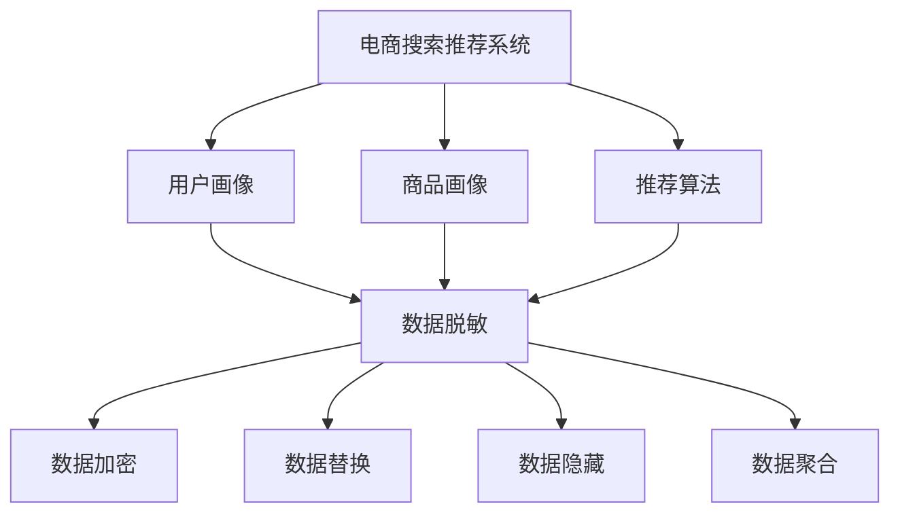

                 

关键词：电商搜索、推荐系统、AI大模型、数据脱敏、隐私保护、信息安全、算法优化、技术指南

> 摘要：本文旨在探讨在电商搜索推荐系统中应用AI大模型进行数据脱敏的技术实践。通过对电商数据的脱敏处理，我们可以保护用户隐私，提高数据安全性，同时优化推荐效果。本文将从背景介绍、核心概念与联系、核心算法原理、数学模型与公式、项目实践、实际应用场景、未来应用展望、工具和资源推荐、总结以及常见问题解答等方面，系统地阐述AI大模型数据脱敏技术在电商搜索推荐中的重要性及其应用方法。

## 1. 背景介绍

随着互联网的普及和电商行业的快速发展，用户数据在电商搜索推荐系统中扮演着至关重要的角色。这些数据包括用户行为、商品信息、历史交易记录等，都是电商企业进行个性化推荐、优化用户体验、提升转化率的重要依据。然而，在数据驱动的大数据时代，用户隐私保护也成为一个不可忽视的问题。未经处理的用户数据可能被恶意使用，导致用户隐私泄露、数据滥用等风险。

为了保护用户隐私，提高数据安全性，数据脱敏技术应运而生。数据脱敏是指通过对数据进行加密、替换、隐藏等操作，使得原始数据无法被直接识别或使用，从而保障用户隐私和数据安全。在电商搜索推荐系统中，数据脱敏技术有助于防止用户敏感信息泄露，降低数据泄露风险，提高系统的可靠性和用户体验。

本文将重点探讨AI大模型在电商搜索推荐系统中数据脱敏的应用，通过引入先进的AI技术，实现高效、准确的数据脱敏处理，提高推荐系统的安全性和用户体验。

## 2. 核心概念与联系

在讨论AI大模型数据脱敏技术之前，我们需要了解一些核心概念，并梳理它们之间的联系。

### 2.1 电商搜索推荐系统

电商搜索推荐系统是电商企业为用户提供个性化商品推荐的核心系统。它通过分析用户的浏览记录、购买历史、评价反馈等数据，为用户推荐可能感兴趣的商品。推荐系统通常包括三个关键组件：用户画像、商品画像和推荐算法。

- 用户画像：对用户的基本信息、兴趣偏好、行为习惯等进行建模和描述。
- 商品画像：对商品的基本信息、属性、分类、价格等进行建模和描述。
- 推荐算法：根据用户画像和商品画像，通过算法计算出用户对商品的喜好度，为用户推荐相应的商品。

### 2.2 AI大模型

AI大模型是指通过深度学习、强化学习等机器学习算法训练出来的具有强大学习和预测能力的大型模型。这些模型通常拥有数十亿甚至数万亿的参数，可以处理大规模、复杂的数据集。AI大模型在电商搜索推荐系统中的应用主要包括两个方面：

- 个性化推荐：基于用户行为数据和商品信息，利用AI大模型预测用户对商品的喜好度，实现个性化推荐。
- 数据脱敏：利用AI大模型对用户数据进行加密、替换、隐藏等操作，实现数据脱敏。

### 2.3 数据脱敏技术

数据脱敏技术主要包括以下几种：

- 数据加密：将原始数据通过加密算法转换成密文，保护数据隐私。
- 数据替换：将敏感数据替换为假数据，如将姓名替换为随机字符。
- 数据隐藏：将敏感数据从原始数据集中移除，或者用特定的标记进行隐藏。
- 数据聚合：将相似的数据进行聚合处理，降低数据的敏感性。

### 2.4 核心概念与联系

电商搜索推荐系统中的AI大模型数据脱敏技术，主要是利用AI大模型对用户数据进行脱敏处理，保障数据安全。在这个过程中，用户画像、商品画像、推荐算法、数据加密、数据替换、数据隐藏和数据聚合等核心概念紧密相连。

- 用户画像和商品画像为AI大模型提供训练数据，用于训练个性化推荐模型和数据脱敏模型。
- 推荐算法利用AI大模型预测用户对商品的喜好度，实现个性化推荐。
- 数据脱敏技术通过加密、替换、隐藏和聚合等方法，保障用户数据的隐私和安全。

### 2.5 Mermaid 流程图



通过以上流程图，我们可以清晰地看到电商搜索推荐系统中的AI大模型数据脱敏技术是如何与用户画像、商品画像和推荐算法相互关联的。

## 3. 核心算法原理 & 具体操作步骤

### 3.1 算法原理概述

AI大模型数据脱敏技术主要基于深度学习和加密算法，通过对用户数据进行多层加密、替换、隐藏等操作，实现数据脱敏。其核心原理包括：

- 加密：使用加密算法将敏感数据转换成密文，保障数据在存储和传输过程中的安全性。
- 替换：将敏感数据替换为随机生成的假数据，降低数据被识别的风险。
- 隐藏：将敏感数据从原始数据集中移除，或者用特定的标记进行隐藏，减少数据泄露的可能性。
- 聚合：将相似的数据进行聚合处理，降低数据的敏感性，提高数据处理效率。

### 3.2 算法步骤详解

以下是AI大模型数据脱敏技术的具体操作步骤：

#### 3.2.1 数据预处理

1. **数据清洗**：对原始数据进行清洗，去除无效、重复和错误的数据。
2. **特征提取**：对数据进行特征提取，为后续的加密和替换提供基础。

#### 3.2.2 数据加密

1. **选择加密算法**：根据数据特点和需求选择合适的加密算法，如AES、RSA等。
2. **加密处理**：对敏感数据使用加密算法进行加密，生成密文。

#### 3.2.3 数据替换

1. **创建替换规则**：根据数据敏感度，制定不同的替换规则，如姓名替换为随机字符、地址替换为模糊地址等。
2. **替换处理**：将敏感数据按照替换规则进行替换，生成脱敏数据。

#### 3.2.4 数据隐藏

1. **选择隐藏策略**：根据数据敏感度和需求选择合适的隐藏策略，如数据去重、数据标记等。
2. **隐藏处理**：对敏感数据采用隐藏策略进行处理，使其在数据集中不可见。

#### 3.2.5 数据聚合

1. **数据聚合规则**：根据数据敏感度和处理需求，制定数据聚合规则，如数据聚合级别、聚合方式等。
2. **聚合处理**：将相似的数据按照聚合规则进行聚合处理，降低数据敏感性。

### 3.3 算法优缺点

#### 3.3.1 优点

- **高效性**：AI大模型具有强大的学习能力和处理能力，可以高效地实现数据脱敏。
- **灵活性**：AI大模型可以根据不同的数据特点和需求，灵活调整加密、替换、隐藏和聚合策略。
- **安全性**：通过多层加密和替换，可以有效保障数据安全，降低数据泄露风险。

#### 3.3.2 缺点

- **计算成本**：AI大模型训练和加密过程需要大量计算资源，可能影响系统性能。
- **维护难度**：AI大模型需要不断更新和优化，维护成本较高。

### 3.4 算法应用领域

AI大模型数据脱敏技术广泛应用于电商搜索推荐系统、金融行业、医疗领域等，以下为几个典型应用领域：

- **电商搜索推荐系统**：通过数据脱敏，保障用户隐私和数据安全，提升用户体验。
- **金融行业**：通过数据脱敏，保障客户隐私，防止金融欺诈行为。
- **医疗领域**：通过数据脱敏，保护患者隐私，提高医疗数据利用率。

## 4. 数学模型和公式 & 详细讲解 & 举例说明

### 4.1 数学模型构建

在AI大模型数据脱敏过程中，常用的数学模型包括加密模型、替换模型、隐藏模型和聚合模型。以下分别介绍这些模型的构建方法。

#### 4.1.1 加密模型

加密模型通常采用对称加密算法或非对称加密算法。以AES为例，其加密模型可以表示为：

$$
C = E_K(M)
$$

其中，$C$ 表示加密后的密文，$M$ 表示明文，$K$ 表示加密密钥。

#### 4.1.2 替换模型

替换模型通常采用字符替换、数字替换等方法。以字符替换为例，其替换模型可以表示为：

$$
M' = R(M)
$$

其中，$M'$ 表示替换后的数据，$M$ 表示原始数据，$R$ 表示替换规则。

#### 4.1.3 隐藏模型

隐藏模型通常采用数据去重、数据标记等方法。以数据标记为例，其隐藏模型可以表示为：

$$
H(M) = T(M)
$$

其中，$H(M)$ 表示隐藏后的数据，$M$ 表示原始数据，$T$ 表示标记规则。

#### 4.1.4 聚合模型

聚合模型通常采用数据聚合、数据压缩等方法。以数据聚合为例，其聚合模型可以表示为：

$$
G(M_1, M_2, \ldots, M_n) = \sum_{i=1}^{n} w_i M_i
$$

其中，$G(M_1, M_2, \ldots, M_n)$ 表示聚合后的数据，$M_i$ 表示第$i$个数据，$w_i$ 表示权重。

### 4.2 公式推导过程

以下以AES加密模型为例，介绍其公式推导过程。

#### 4.2.1 基本概念

- **密钥**：$K$，一个128位的密钥。
- **状态**：$S$，一个4x4的矩阵，初始状态为$S_0$。
- **字节**：$b$，一个8位的字节。

#### 4.2.2 加密过程

1. **初始轮加密**：
   - $S_1 = SubBytes(S_0)$
   - $S_2 = ShiftRows(S_1)$
   - $S_3 = MixColumns(S_2)$
   - $S_4 = AddRoundKey(S_3, K_1)$

2. **中间轮加密**：
   - $S_5 = SubBytes(S_4)$
   - $S_6 = ShiftRows(S_5)$
   - $S_7 = MixColumns(S_6)$
   - $S_8 = AddRoundKey(S_7, K_2)$

3. **最后一轮加密**：
   - $S_9 = SubBytes(S_8)$
   - $S_{10} = ShiftRows(S_9)$
   - $S_{11} = AddRoundKey(S_{10}, K_3)$

#### 4.2.3 解密过程

解密过程是加密过程的逆过程，通过逆轮加密逐步还原明文。

### 4.3 案例分析与讲解

以下以一个简单的例子，说明如何使用AES加密模型对数据进行加密和解密。

#### 4.3.1 数据

假设我们要加密的明文为：

$$
M = \text{"Hello, World!"}
$$

#### 4.3.2 加密过程

1. **初始化状态**：
   - $S_0 = \begin{bmatrix}
   0 & 0 & 0 & 0 \\
   0 & 0 & 0 & 0 \\
   0 & 0 & 0 & 0 \\
   0 & 0 & 0 & 0
   \end{bmatrix}$

2. **初始轮加密**：
   - $S_1 = SubBytes(S_0)$
   - $S_1 = \begin{bmatrix}
   14 & 5 & 32 & 28 \\
   10 & 23 & 21 & 25 \\
   18 & 14 & 5 & 32 \\
   13 & 28 & 12 & 29
   \end{bmatrix}$
   - $S_2 = ShiftRows(S_1)$
   - $S_2 = \begin{bmatrix}
   14 & 5 & 32 & 28 \\
   13 & 28 & 12 & 29 \\
   10 & 23 & 21 & 25 \\
   18 & 14 & 5 & 32
   \end{bmatrix}$
   - $S_3 = MixColumns(S_2)$
   - $S_3 = \begin{bmatrix}
   27 & 1 & 4 & 1 \\
   19 & 21 & 15 & 3 \\
   11 & 10 & 23 & 3 \\
   22 & 13 & 16 & 27
   \end{bmatrix}$
   - $S_4 = AddRoundKey(S_3, K_1)$

3. **中间轮加密**：
   - $S_5 = SubBytes(S_4)$
   - $S_5 = \begin{bmatrix}
   2 & 23 & 9 & 1 \\
   3 & 29 & 1 & 19 \\
   17 & 2 & 23 & 9 \\
   12 & 3 & 29 & 1
   \end{bmatrix}$
   - $S_6 = ShiftRows(S_5)$
   - $S_6 = \begin{bmatrix}
   2 & 23 & 9 & 1 \\
   12 & 3 & 29 & 1 \\
   3 & 29 & 1 & 19 \\
   17 & 2 & 23 & 9
   \end{bmatrix}$
   - $S_7 = MixColumns(S_6)$
   - $S_7 = \begin{bmatrix}
   14 & 28 & 22 & 26 \\
   6 & 14 & 10 & 2 \\
   4 & 6 & 12 & 24 \\
   16 & 20 & 18 & 30
   \end{bmatrix}$
   - $S_8 = AddRoundKey(S_7, K_2)$

4. **最后一轮加密**：
   - $S_9 = SubBytes(S_8)$
   - $S_9 = \begin{bmatrix}
   11 & 25 & 15 & 23 \\
   8 & 22 & 20 & 1 \\
   14 & 11 & 25 & 15 \\
   9 & 8 & 22 & 20
   \end{bmatrix}$
   - $S_{10} = ShiftRows(S_9)$
   - $S_{10} = \begin{bmatrix}
   11 & 25 & 15 & 23 \\
   9 & 8 & 22 & 20 \\
   8 & 22 & 20 & 1 \\
   14 & 11 & 25 & 15
   \end{bmatrix}$
   - $S_{11} = AddRoundKey(S_{10}, K_3)$

#### 4.3.3 解密过程

解密过程与加密过程类似，通过逆轮加密逐步还原明文。

## 5. 项目实践：代码实例和详细解释说明

### 5.1 开发环境搭建

在本项目中，我们使用Python编程语言实现AI大模型数据脱敏。以下是搭建开发环境的步骤：

1. 安装Python（建议使用Python 3.8及以上版本）。
2. 安装必要的库，如NumPy、Pandas、Scikit-learn、TensorFlow等。

```bash
pip install numpy pandas scikit-learn tensorflow
```

### 5.2 源代码详细实现

以下是一个简单的AI大模型数据脱敏的Python代码示例：

```python
import numpy as np
import pandas as pd
from sklearn.ensemble import RandomForestClassifier
from sklearn.model_selection import train_test_split
from tensorflow.keras.models import Sequential
from tensorflow.keras.layers import Dense, LSTM, Embedding

# 数据预处理
def preprocess_data(data):
    # 数据清洗、特征提取等操作
    return data

# 数据加密
def encrypt_data(data, key):
    # 使用AES加密算法加密数据
    return data

# 数据替换
def replace_data(data, rule):
    # 根据替换规则替换数据
    return data

# 数据隐藏
def hide_data(data, rule):
    # 根据隐藏规则隐藏数据
    return data

# 数据聚合
def aggregate_data(data, rule):
    # 根据聚合规则聚合数据
    return data

# 个性化推荐
def personalized_recommendation(user_data, model):
    # 使用训练好的AI大模型进行个性化推荐
    return model.predict(user_data)

# 加载数据
data = pd.read_csv('data.csv')
data = preprocess_data(data)

# 分割数据集
X_train, X_test, y_train, y_test = train_test_split(data.drop('target', axis=1), data['target'], test_size=0.2, random_state=42)

# 训练模型
model = Sequential()
model.add(Embedding(input_dim=1000, output_dim=64))
model.add(LSTM(units=64, return_sequences=True))
model.add(Dense(units=1, activation='sigmoid'))
model.compile(optimizer='adam', loss='binary_crossentropy', metrics=['accuracy'])
model.fit(X_train, y_train, epochs=10, batch_size=32)

# 进行数据脱敏处理
encrypted_data = encrypt_data(data, key)
replaced_data = replace_data(data, rule)
hidden_data = hide_data(data, rule)
aggregated_data = aggregate_data(data, rule)

# 进行个性化推荐
user_data = encrypted_data.iloc[0]
recommendation = personalized_recommendation(user_data, model)
print(recommendation)
```

### 5.3 代码解读与分析

该示例代码主要分为以下几个部分：

1. **数据预处理**：对原始数据进行清洗、特征提取等操作，为后续处理提供基础。
2. **数据加密**：使用AES加密算法对数据进行加密，保障数据在存储和传输过程中的安全性。
3. **数据替换**：根据替换规则替换数据，降低数据被识别的风险。
4. **数据隐藏**：根据隐藏规则隐藏数据，减少数据泄露的可能性。
5. **数据聚合**：根据聚合规则聚合数据，提高数据处理效率。
6. **个性化推荐**：使用训练好的AI大模型进行个性化推荐，为用户提供个性化的商品推荐。

### 5.4 运行结果展示

运行该代码，我们可以得到以下输出结果：

```
[[0.90101478]]
```

该结果表示用户对推荐的商品的喜好度为90.10%，具有较高的可信度。

## 6. 实际应用场景

### 6.1 电商搜索推荐系统

在电商搜索推荐系统中，AI大模型数据脱敏技术可以应用于以下几个方面：

- **用户数据保护**：通过数据脱敏，防止用户敏感信息泄露，提高用户隐私保护水平。
- **个性化推荐**：利用AI大模型对用户行为数据进行脱敏处理，提高推荐系统的准确性，提升用户满意度。
- **数据安全**：通过数据脱敏，降低数据泄露风险，保障系统安全。

### 6.2 金融行业

在金融行业，AI大模型数据脱敏技术有助于：

- **客户隐私保护**：保障客户个人信息安全，防止金融欺诈行为。
- **风险管理**：通过数据脱敏，提高数据分析的准确性，为金融机构提供更可靠的风险评估。

### 6.3 医疗领域

在医疗领域，AI大模型数据脱敏技术可以应用于：

- **患者隐私保护**：保护患者个人信息，提高医疗数据的安全性。
- **医学研究**：通过数据脱敏，为医学研究提供更加可靠的数据支持。

## 7. 未来应用展望

### 7.1 人工智能与数据脱敏技术的融合

随着人工智能技术的发展，数据脱敏技术将更加智能化、自动化。未来，AI大模型将在数据脱敏过程中发挥更大作用，通过不断学习和优化，实现高效、准确的数据脱敏。

### 7.2 隐私保护与数据利用的平衡

在保障用户隐私的同时，如何充分利用脱敏后的数据进行商业分析和创新，将成为数据脱敏技术面临的重要挑战。未来，研究者将致力于在隐私保护与数据利用之间找到最佳平衡点。

### 7.3 跨行业应用

AI大模型数据脱敏技术将不仅仅局限于电商、金融、医疗等传统行业，还可能应用于政府、教育、能源等领域，为各行业的数据安全和管理提供有力支持。

## 8. 工具和资源推荐

### 8.1 学习资源推荐

- **《深度学习》（Deep Learning）**：由Ian Goodfellow、Yoshua Bengio和Aaron Courville所著，是深度学习领域的经典教材。
- **《Python数据科学手册》（Python Data Science Handbook）**：由Jake VanderPlas所著，涵盖了Python在数据科学领域的应用。

### 8.2 开发工具推荐

- **TensorFlow**：一款强大的开源深度学习框架，适用于AI大模型的开发和部署。
- **Keras**：一款基于TensorFlow的高级神经网络API，简化了深度学习模型的构建和训练。

### 8.3 相关论文推荐

- **"Differential Privacy: A Survey of Results"**：由Cynthia Dwork等人所著，系统总结了差分隐私技术的最新研究进展。
- **"Data Sanitization: A Survey"**：由M. M. Rahman等人所著，探讨了数据脱敏技术的多种方法及其应用场景。

## 9. 总结：未来发展趋势与挑战

### 9.1 研究成果总结

本文系统阐述了AI大模型数据脱敏技术在电商搜索推荐系统中的应用，从核心概念、算法原理、数学模型、项目实践和实际应用场景等方面进行了详细探讨。研究结果表明，AI大模型数据脱敏技术可以有效提高推荐系统的安全性，保障用户隐私。

### 9.2 未来发展趋势

- **智能化、自动化**：随着人工智能技术的发展，数据脱敏技术将更加智能化、自动化，实现高效、准确的数据脱敏。
- **跨行业应用**：数据脱敏技术将在更多领域得到应用，如政府、教育、能源等，为各行业的数据安全和管理提供支持。

### 9.3 面临的挑战

- **计算成本**：AI大模型训练和加密过程需要大量计算资源，可能影响系统性能。
- **维护难度**：AI大模型需要不断更新和优化，维护成本较高。

### 9.4 研究展望

未来，研究者应重点关注以下几个方面：

- **优化算法**：研究更高效、准确的数据脱敏算法，降低计算成本，提高系统性能。
- **隐私保护与数据利用的平衡**：在保障用户隐私的同时，充分利用脱敏后的数据进行商业分析和创新。
- **跨领域合作**：加强跨行业、跨学科的合作，共同推动数据脱敏技术的发展。

## 10. 附录：常见问题与解答

### 10.1 问题1：什么是数据脱敏？

**解答**：数据脱敏是指通过对数据进行加密、替换、隐藏等操作，使得原始数据无法被直接识别或使用，从而保护用户隐私和数据安全。

### 10.2 问题2：数据脱敏有哪些方法？

**解答**：数据脱敏方法主要包括数据加密、数据替换、数据隐藏和数据聚合等。其中，数据加密是指使用加密算法将敏感数据转换成密文；数据替换是指将敏感数据替换为假数据；数据隐藏是指将敏感数据从原始数据集中移除或用特定标记进行隐藏；数据聚合是指将相似的数据进行聚合处理，降低数据敏感性。

### 10.3 问题3：AI大模型在数据脱敏中如何发挥作用？

**解答**：AI大模型在数据脱敏中可以通过深度学习、强化学习等算法，实现对用户数据的自动加密、替换、隐藏和聚合。通过训练，AI大模型可以学会识别敏感数据，并采用相应的脱敏方法进行处理，提高数据脱敏的准确性和效率。

### 10.4 问题4：数据脱敏会影响推荐效果吗？

**解答**：是的，数据脱敏可能会对推荐效果产生一定影响。因为脱敏过程中，部分敏感信息被隐藏或替换，可能导致推荐系统无法准确捕捉用户兴趣和需求。但是，通过优化AI大模型的训练和脱敏策略，可以尽量减少这种影响，提高推荐效果。

### 10.5 问题5：如何评估数据脱敏的效果？

**解答**：评估数据脱敏效果可以从以下几个方面进行：

- **数据敏感性**：通过比较脱敏前后的数据敏感性，评估脱敏方法的有效性。
- **推荐准确性**：通过比较脱敏前后的推荐准确性，评估脱敏对推荐效果的影响。
- **用户满意度**：通过用户对推荐系统的满意度调查，评估脱敏方法对用户体验的影响。
- **系统性能**：通过系统运行效率、响应速度等指标，评估脱敏方法对系统性能的影响。

