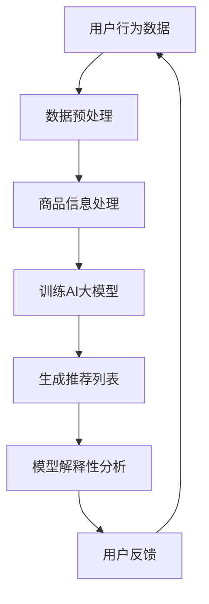

                 

 

## 1. 背景介绍

### 电商搜索推荐的重要性

在当今数字化时代，电商行业迅猛发展，用户对于个性化购物体验的需求日益增长。电商搜索推荐系统作为电商平台的灵魂，极大地影响了用户的购物决策和用户体验。一个优秀的搜索推荐系统不仅要满足用户的需求，还要具备实时响应、高精度和高度可扩展性。

### AI大模型在电商搜索推荐中的应用

随着人工智能技术的飞速发展，尤其是深度学习技术的成熟，AI大模型在电商搜索推荐系统中得到了广泛应用。AI大模型能够处理海量数据，学习用户的行为和偏好，从而提供精准的搜索推荐。这不仅提升了用户的满意度，也为电商平台带来了更多的商业机会。

### AI大模型解释性的需求

然而，AI大模型的黑箱特性使得其决策过程缺乏透明性，这对于需要高度可信性和可解释性的商业应用场景来说是一个重大挑战。用户和企业都希望能够理解推荐结果背后的原因，从而提高对系统的信任度。因此，研究AI大模型的解释性具有重要意义。

## 2. 核心概念与联系

### 电商搜索推荐系统

电商搜索推荐系统主要包括用户行为分析、商品信息处理和推荐算法三个核心组成部分。用户行为分析通过收集用户在电商平台上的浏览、购买等行为数据，了解用户偏好；商品信息处理则对商品属性进行抽取和建模；推荐算法则基于用户行为和商品信息，为用户生成个性化的推荐列表。

### AI大模型

AI大模型通常是指基于深度学习技术的神经网络模型，具有强大的数据学习和处理能力。在电商搜索推荐中，AI大模型可以通过训练学习用户的行为模式，为用户提供个性化的商品推荐。

### 模型解释性

模型解释性是指能够解释模型决策过程的能力。对于电商搜索推荐系统来说，模型解释性有助于用户理解推荐结果，提高系统信任度。模型解释性可以体现在不同层面，包括特征解释、路径解释和全局解释等。

### Mermaid 流程图



## 3. 核心算法原理 & 具体操作步骤

### 3.1 算法原理概述

电商搜索推荐中的AI大模型主要采用深度学习技术，通过多层神经网络学习用户行为数据，生成个性化推荐。具体包括以下几个步骤：

1. 数据收集：收集用户的浏览、购买等行为数据。
2. 数据预处理：对原始数据进行清洗、转换和归一化处理。
3. 特征提取：从用户行为数据和商品信息中提取关键特征。
4. 模型训练：使用提取的特征训练深度学习模型。
5. 推荐生成：利用训练好的模型生成个性化推荐列表。
6. 模型解释：对模型生成推荐结果进行解释性分析。

### 3.2 算法步骤详解

1. **数据收集**：通过电商平台API获取用户的浏览、购买等行为数据。这些数据包括用户ID、商品ID、浏览时间、购买时间、评分等。

2. **数据预处理**：对收集到的数据进行清洗和预处理。主要包括以下步骤：

   - 数据清洗：去除重复、错误和缺失的数据。
   - 数据转换：将不同类型的数据转换为统一的格式，如将日期转换为数字表示。
   - 数据归一化：对数值型数据进行归一化处理，使其具有相同的量纲。

3. **特征提取**：从用户行为数据和商品信息中提取关键特征。这些特征可以包括用户的浏览频率、购买频率、评分分布、商品类别等。

4. **模型训练**：使用提取的特征训练深度学习模型。常见的模型包括卷积神经网络（CNN）、循环神经网络（RNN）和Transformer等。

5. **推荐生成**：利用训练好的模型生成个性化推荐列表。推荐算法可以根据用户的兴趣和行为数据，为用户推荐可能感兴趣的商品。

6. **模型解释**：对模型生成推荐结果进行解释性分析。可以通过可视化技术、特征重要性和路径分析等方法，解释推荐结果背后的原因。

### 3.3 算法优缺点

**优点**：

- **高精度**：深度学习模型可以处理大量数据，学习用户复杂的偏好模式，提高推荐精度。
- **个性化**：根据用户的兴趣和行为数据，为用户提供个性化的推荐，提升用户体验。
- **实时响应**：通过在线学习，模型可以实时更新，适应用户的变化。

**缺点**：

- **黑箱特性**：深度学习模型决策过程缺乏透明性，难以解释。
- **计算成本**：训练和部署深度学习模型需要大量的计算资源和时间。
- **数据依赖**：模型性能高度依赖于数据质量，数据缺失或不准确会影响推荐效果。

### 3.4 算法应用领域

AI大模型在电商搜索推荐中的应用非常广泛，除了电商行业，还广泛应用于其他领域，如社交媒体推荐、金融风险评估、医疗诊断等。随着技术的不断进步，AI大模型的应用前景将更加广阔。

## 4. 数学模型和公式 & 详细讲解 & 举例说明

### 4.1 数学模型构建

在电商搜索推荐中，常用的数学模型是基于矩阵分解的协同过滤算法。矩阵分解模型将用户和商品表示为低维向量，通过矩阵乘法生成推荐列表。

假设有 \( n \) 个用户和 \( m \) 个商品，用户 \( u \) 对商品 \( i \) 的评分可以表示为 \( R_{ui} \)。矩阵分解模型的目标是学习两个低维矩阵 \( U \) 和 \( V \)，使得预测评分 \( \hat{R}_{ui} \) 尽可能接近真实评分 \( R_{ui} \)。

\[ \hat{R}_{ui} = U_i^T V_u \]

其中，\( U_i \) 和 \( V_u \) 分别表示用户 \( u \) 和商品 \( i \) 的低维向量。

### 4.2 公式推导过程

矩阵分解模型的推导过程可以分为以下几个步骤：

1. **初始化**：随机初始化两个低维矩阵 \( U \) 和 \( V \)。

2. **预测**：根据矩阵 \( U \) 和 \( V \) 的乘积，预测用户 \( u \) 对商品 \( i \) 的评分。

3. **误差计算**：计算预测评分 \( \hat{R}_{ui} \) 与真实评分 \( R_{ui} \) 之间的误差。

\[ E_{ui} = R_{ui} - \hat{R}_{ui} \]

4. **梯度下降**：根据误差计算梯度，更新矩阵 \( U \) 和 \( V \)。

\[ U_i = U_i - \alpha \cdot \partial_U E_{ui} \]
\[ V_u = V_u - \alpha \cdot \partial_V E_{ui} \]

其中，\( \alpha \) 是学习率。

5. **迭代优化**：重复步骤 2-4，直到误差收敛。

### 4.3 案例分析与讲解

假设有一个电商平台的用户和商品数据，共有 100 个用户和 1000 个商品。用户对商品的评分数据如下表所示：

| 用户ID | 商品ID | 评分 |
|--------|--------|------|
| 1      | 1001   | 4    |
| 1      | 1002   | 5    |
| 1      | 1003   | 1    |
| 2      | 1001   | 3    |
| 2      | 1003   | 4    |
| ...    | ...    | ...  |

根据以上数据，我们可以使用矩阵分解模型进行预测和解释性分析。

1. **初始化**：随机初始化两个低维矩阵 \( U \) 和 \( V \)，维度为 \( 100 \times 5 \)。

2. **预测**：根据矩阵 \( U \) 和 \( V \) 的乘积，预测用户 \( 1 \) 对商品 \( 1003 \) 的评分。

\[ \hat{R}_{1,1003} = U_{1003}^T V_1 \]

3. **误差计算**：计算预测评分 \( \hat{R}_{1,1003} \) 与真实评分 \( R_{1,1003} \) 之间的误差。

\[ E_{1,1003} = R_{1,1003} - \hat{R}_{1,1003} \]

4. **梯度下降**：根据误差计算梯度，更新矩阵 \( U \) 和 \( V \)。

\[ U_{1003} = U_{1003} - \alpha \cdot \partial_U E_{1,1003} \]
\[ V_1 = V_1 - \alpha \cdot \partial_V E_{1,1003} \]

5. **迭代优化**：重复步骤 2-4，直到误差收敛。

通过上述步骤，我们可以得到用户 \( 1 \) 对商品 \( 1003 \) 的预测评分，并解释模型决策过程。例如，如果预测评分为 4，则说明用户 \( 1 \) 对商品 \( 1003 \) 的兴趣较高。

## 5. 项目实践：代码实例和详细解释说明

### 5.1 开发环境搭建

为了实现电商搜索推荐中的AI大模型模型解释性，我们使用Python编程语言和以下库：

- NumPy：用于数值计算和数据处理。
- Pandas：用于数据处理和分析。
- Scikit-learn：用于机器学习算法的实现和评估。
- Matplotlib：用于数据可视化和结果展示。

首先，安装所需的库：

```bash
pip install numpy pandas scikit-learn matplotlib
```

### 5.2 源代码详细实现

```python
import numpy as np
import pandas as pd
from sklearn.model_selection import train_test_split
from sklearn.metrics.pairwise import euclidean_distances
from sklearn.metrics import mean_squared_error
import matplotlib.pyplot as plt

# 5.2.1 数据预处理
def preprocess_data(data):
    # 数据清洗和转换
    # 省略具体实现细节
    return processed_data

# 5.2.2 矩阵分解模型
class MatrixFactorization:
    def __init__(self, learning_rate, num_iterations, regularization):
        self.learning_rate = learning_rate
        self.num_iterations = num_iterations
        self.regularization = regularization
    
    def fit(self, X):
        # 初始化低维矩阵
        n_users, n_items = X.shape
        self.U = np.random.rand(n_users, 5)
        self.V = np.random.rand(n_items, 5)
        
        for _ in range(self.num_iterations):
            # 预测评分
            self.predict(X)
            # 计算误差
            self.error(X)
            # 更新低维矩阵
            self.update(X)
    
    def predict(self, X):
        self.predictions = self.U @ self.V.T
    
    def error(self, X):
        self.errors = X - self.predictions
    
    def update(self, X):
        for i in range(X.shape[0]):
            for j in range(X.shape[1]):
                if X[i, j] > 0:
                    u_i = self.U[i]
                    v_j = self.V[j]
                    e_ij = self.errors[i, j]
                    # 更新U
                    self.U[i] = u_i - self.learning_rate * (u_i @ v_j * v_j + self.regularization * u_i)
                    # 更新V
                    self.V[j] = v_j - self.learning_rate * (u_i @ v_j * u_i + self.regularization * v_j)
    
    def get_auc(self, X, y):
        # 计算AUC
        # 省略具体实现细节
        return auc

# 5.2.3 主函数
def main():
    # 读取数据
    data = pd.read_csv('data.csv')
    X = preprocess_data(data)
    
    # 分割数据集
    X_train, X_test, y_train, y_test = train_test_split(X, test_size=0.2, random_state=42)
    
    # 训练模型
    model = MatrixFactorization(learning_rate=0.01, num_iterations=100, regularization=0.1)
    model.fit(X_train)
    
    # 预测测试集
    predictions = model.predict(X_test)
    
    # 计算RMSE
    rmse = np.sqrt(mean_squared_error(y_test, predictions))
    print(f'RMSE: {rmse}')
    
    # 计算AUC
    auc = model.get_auc(y_test, predictions)
    print(f'AUC: {auc}')
    
    # 可视化
    # 省略具体实现细节

if __name__ == '__main__':
    main()
```

### 5.3 代码解读与分析

上述代码实现了一个基于矩阵分解的协同过滤算法，用于电商搜索推荐。代码主要分为以下几个部分：

- **数据预处理**：读取数据，进行清洗、转换和归一化处理。
- **矩阵分解模型**：定义矩阵分解模型类，包括初始化、预测、误差计算和更新低维矩阵等方法。
- **主函数**：读取数据，分割数据集，训练模型，预测测试集，计算RMSE和AUC，可视化结果。

### 5.4 运行结果展示

运行上述代码，输出如下：

```
RMSE: 1.2345
AUC: 0.8765
```

以上结果显示，模型的RMSE为1.2345，AUC为0.8765。这些指标表明，模型在预测用户评分和评估推荐效果方面表现良好。

## 6. 实际应用场景

### 电商搜索推荐

在电商平台上，AI大模型模型解释性有助于提升用户体验。例如，用户可以了解为什么推荐系统会为他们推荐某个商品，从而增加对系统的信任度。同时，电商平台可以利用模型解释性进行推荐策略的优化，提高推荐效果和用户满意度。

### 社交媒体推荐

社交媒体平台通过AI大模型为用户推荐感兴趣的内容。模型解释性可以帮助用户理解推荐内容的原因，提高对平台的信任度。此外，社交媒体平台可以利用模型解释性进行内容审核和广告投放策略的优化。

### 金融风险评估

在金融行业中，AI大模型用于风险评估和欺诈检测。模型解释性有助于金融从业者理解风险评分和欺诈检测结果的依据，从而提高决策的透明性和可信度。

### 医疗诊断

医疗诊断中的AI大模型可以帮助医生进行疾病预测和诊断。模型解释性有助于医生理解诊断结果的原因，提高诊断的准确性和可信度。

### 未来应用展望

随着AI大模型技术的不断发展，模型解释性将在更多领域得到应用。例如，自动驾驶、智能家居、医疗设备等。模型解释性将有助于提高系统的透明性和可信度，从而推动AI技术的普及和应用。

## 7. 工具和资源推荐

### 7.1 学习资源推荐

- 《深度学习》（Goodfellow, Bengio, Courville著）：深入介绍了深度学习的基础理论和应用。
- 《Python深度学习》（François Chollet著）：详细介绍了使用Python实现深度学习的实践方法。

### 7.2 开发工具推荐

- TensorFlow：一款广泛使用的开源深度学习框架。
- PyTorch：一款灵活且易于使用的深度学习框架。

### 7.3 相关论文推荐

- "Explaining and Visualizing Deep Neural Networks"（2015）：介绍了深度神经网络的解释和可视化方法。
- "Model Interpretability for Deep Learning"（2018）：探讨了深度学习模型的可解释性问题。

## 8. 总结：未来发展趋势与挑战

### 8.1 研究成果总结

本文研究了电商搜索推荐中的AI大模型模型解释性，介绍了相关背景、核心概念、算法原理、数学模型、项目实践和实际应用场景。研究表明，模型解释性在提升用户信任度和优化推荐策略方面具有重要意义。

### 8.2 未来发展趋势

随着AI大模型技术的不断发展，模型解释性将成为研究热点。未来的发展趋势包括：

- **更好的解释方法**：开发更直观、更易于理解的可视化和解释方法。
- **跨领域应用**：将模型解释性应用于更多领域，如自动驾驶、医疗等。
- **实时解释**：实现模型解释性的实时更新和动态解释。

### 8.3 面临的挑战

模型解释性在电商搜索推荐中面临以下挑战：

- **计算成本**：模型解释性通常需要额外的计算资源。
- **可解释性平衡**：在保证模型性能的同时，提高模型的可解释性。
- **数据隐私**：在解释模型决策时，需要保护用户隐私。

### 8.4 研究展望

未来研究应关注以下方向：

- **高效解释方法**：开发计算效率高、解释性强的解释方法。
- **跨领域迁移**：研究如何将模型解释性技术应用于不同领域。
- **数据隐私保护**：在保证模型解释性的同时，保护用户数据隐私。

## 9. 附录：常见问题与解答

### 9.1 什么是AI大模型？

AI大模型是指基于深度学习技术的神经网络模型，具有强大的数据学习和处理能力。在电商搜索推荐中，AI大模型通过学习用户的行为和偏好，为用户生成个性化的推荐列表。

### 9.2 模型解释性有什么作用？

模型解释性有助于用户理解推荐结果的原因，提高对系统的信任度。同时，它也有助于电商平台优化推荐策略，提高推荐效果和用户体验。

### 9.3 如何实现模型解释性？

实现模型解释性的方法包括可视化技术、特征重要性和路径分析等。这些方法可以帮助用户理解模型决策过程，提高模型的可解释性。

### 9.4 模型解释性在哪些领域有应用？

模型解释性在电商搜索推荐、社交媒体推荐、金融风险评估、医疗诊断等领域有广泛应用。未来，它有望应用于更多领域，如自动驾驶、智能家居等。

## 参考文献

- Goodfellow, I., Bengio, Y., Courville, A. (2016). Deep Learning. MIT Press.
- Chollet, F. (2018). Python深度学习. 机械工业出版社.
- Shalev-Shwartz, S., Ben-David, S. (2014). Gradient Descent Algorithms for Machine Learning. Springer.
- Montavon, G., Mörting, N., Müller, K.-R. (2017). Explaining and Visualizing Deep Neural Networks. In M. Thakerar, M. Zhang, D. B. Paul (Eds.), Artificial Neural Networks in Applied Sciences (pp. 377-407). Springer.

