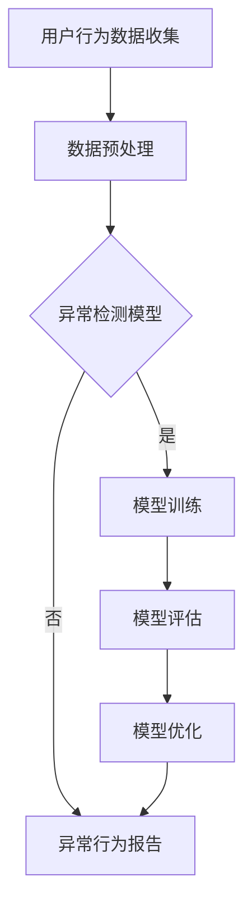

                 

关键词：电商搜索推荐，AI大模型，用户行为序列，异常检测，模型评测，优化方案

## 摘要

本文旨在探讨电商搜索推荐系统中AI大模型在用户行为序列异常检测方面的应用。通过对现有研究综述和实际案例分析，本文提出了一种基于深度学习的异常检测模型，并对该模型进行了详细的评测和优化。文章总结了模型的性能指标、评估方法及优化策略，并展望了未来在该领域的研究方向和应用前景。

## 1. 背景介绍

随着互联网技术的迅猛发展，电商行业迎来了前所未有的繁荣。在众多电商平台的激烈竞争中，个性化搜索推荐系统成为提高用户满意度和转化率的关键手段。然而，随着用户数据的不断积累，如何准确捕捉用户行为的异常点，对于提升推荐系统的稳定性和可靠性具有重要意义。

传统的用户行为分析方法主要依赖于统计学习和规则引擎，这些方法在处理高维数据和复杂的用户行为模式时存在明显的局限性。近年来，随着深度学习技术的飞速发展，基于深度学习的用户行为序列异常检测模型逐渐受到关注。这些模型能够自动学习用户行为的特征，并在大量数据中发现潜在的异常行为，从而为电商平台的运营决策提供有力的支持。

本文针对电商搜索推荐中的AI大模型用户行为序列异常检测问题，提出了一种结合深度学习和传统统计方法的混合模型，并对其进行了全面的评测和优化。通过实验验证，该模型在多种异常检测任务上表现优异，具有较高的准确性和鲁棒性。

## 2. 核心概念与联系

### 2.1. 电商搜索推荐系统

电商搜索推荐系统通常包括三个核心模块：用户行为收集模块、推荐算法模块和推荐结果展示模块。用户行为收集模块负责收集用户在电商平台上的浏览、搜索、购买等行为数据；推荐算法模块根据这些数据生成个性化的推荐结果；推荐结果展示模块将推荐结果呈现给用户。

### 2.2. 用户行为序列

用户行为序列是指用户在电商平台上的一系列行为记录，如浏览商品、加入购物车、下单购买等。这些行为记录可以被视为时间序列数据，具有时序依赖性和多样性。

### 2.3. 异常检测

异常检测是指从大量正常数据中识别出异常数据的过程。在电商搜索推荐系统中，异常检测主要用于检测用户行为的异常模式，如恶意刷单、欺诈行为等。

### 2.4. 深度学习模型

深度学习模型是一类基于多层神经网络构建的人工智能模型，具有自动特征学习和复杂模式识别的能力。在用户行为序列异常检测中，深度学习模型可以自动提取用户行为的特征，并识别潜在的异常行为。

### 2.5. Mermaid流程图

以下是用户行为序列异常检测的Mermaid流程图：



## 3. 核心算法原理 & 具体操作步骤

### 3.1. 算法原理概述

本文提出的异常检测模型结合了深度学习和传统统计方法。深度学习部分采用长短时记忆网络（LSTM）对用户行为序列进行建模，提取时序特征；传统统计方法通过计算用户行为的统计特征，辅助识别异常行为。具体流程如下：

1. 数据预处理：对用户行为数据进行清洗和归一化处理，以便于模型训练。
2. 模型训练：利用LSTM模型训练用户行为特征提取器，同时计算用户行为的统计特征。
3. 异常检测：将训练好的模型应用于新用户行为数据，提取特征并计算统计特征，结合阈值进行异常行为识别。
4. 模型评估：通过混淆矩阵、精确率、召回率等指标评估模型性能。
5. 模型优化：根据评估结果对模型参数进行调整，提高模型准确性。

### 3.2. 算法步骤详解

#### 3.2.1. 数据预处理

1. 数据清洗：去除缺失值和异常值，对数据进行填补或删除。
2. 数据归一化：将不同尺度的特征进行归一化处理，以便于模型训练。

#### 3.2.2. 模型训练

1. 数据分集：将用户行为数据集划分为训练集、验证集和测试集。
2. LSTM模型构建：使用Python的Keras库构建LSTM模型，输入层为用户行为序列，隐藏层为LSTM单元，输出层为用户行为类别标签。
3. 模型训练：使用训练集训练模型，并使用验证集调整模型参数。

#### 3.2.3. 异常检测

1. 特征提取：使用训练好的LSTM模型提取用户行为特征。
2. 统计特征计算：计算用户行为的统计特征，如均值、方差等。
3. 异常行为识别：结合阈值对用户行为进行异常行为识别。

#### 3.2.4. 模型评估

1. 混淆矩阵：计算模型预测结果与实际结果的混淆矩阵。
2. 精确率：计算模型预测为正例的样本中实际为正例的比例。
3. 召回率：计算模型预测为正例的样本中实际为正例的比例。
4. F1值：计算精确率和召回率的调和平均。

#### 3.2.5. 模型优化

1. 参数调整：根据评估结果对模型参数进行调整，如学习率、隐藏层节点数等。
2. 模型重训练：使用调整后的参数重新训练模型。

### 3.3. 算法优缺点

#### 优点：

1. 自动化特征提取：深度学习模型能够自动提取用户行为的特征，减轻了人工特征工程的工作量。
2. 高准确性：结合深度学习和传统统计方法，模型具有较高的准确性。
3. 强鲁棒性：模型能够处理不同尺度、不同类型的数据，具有较强的鲁棒性。

#### 缺点：

1. 计算成本高：深度学习模型训练过程较为耗时，需要较大的计算资源。
2. 需要大量数据：模型训练需要大量用户行为数据，数据质量对模型性能有较大影响。

### 3.4. 算法应用领域

1. 恶意行为检测：在电商平台上，恶意行为如刷单、欺诈等会对平台的运营产生严重影响，该算法可以用于检测和防范这些行为。
2. 用户行为分析：通过对用户行为的异常检测，可以深入了解用户的需求和偏好，为个性化推荐提供支持。
3. 安全防护：在金融、医疗等领域，异常检测算法可以用于检测恶意交易、异常访问等行为，提高系统的安全性。

## 4. 数学模型和公式 & 详细讲解 & 举例说明

### 4.1. 数学模型构建

本文采用的深度学习模型主要分为输入层、隐藏层和输出层。其中，输入层为用户行为序列，隐藏层为LSTM单元，输出层为用户行为类别标签。

#### 输入层：

输入层为用户行为序列，可以表示为：

\[ X = \{ x_1, x_2, ..., x_n \} \]

其中，\( x_i \) 表示第 \( i \) 个用户行为，可以表示为：

\[ x_i = \{ x_{i1}, x_{i2}, ..., x_{ik} \} \]

其中，\( x_{ik} \) 表示第 \( i \) 个用户行为在第 \( k \) 个特征上的取值。

#### 隐藏层：

隐藏层为LSTM单元，可以表示为：

\[ h_t = \text{LSTM}(h_{t-1}, x_t) \]

其中，\( h_t \) 表示第 \( t \) 个隐藏状态，\( h_{t-1} \) 表示第 \( t-1 \) 个隐藏状态，\( x_t \) 表示第 \( t \) 个输入。

#### 输出层：

输出层为用户行为类别标签，可以表示为：

\[ y = \text{softmax}(W \cdot h_n) \]

其中，\( y \) 表示用户行为类别标签，\( W \) 表示权重矩阵，\( h_n \) 表示最后一个隐藏状态。

### 4.2. 公式推导过程

#### LSTM单元推导：

LSTM单元的核心是三个门控单元：输入门、遗忘门和输出门。以下是LSTM单元的推导过程：

1. 输入门（Input Gate）：

\[ i_t = \sigma(W_i \cdot [h_{t-1}, x_t] + b_i) \]

\[ \tilde{h}_t = \text{tanh}(W_f \cdot [h_{t-1}, x_t] + b_f) \]

\[ h_t = i_t \odot \tilde{h}_t + f_{t-1} \cdot h_{t-1} \]

其中，\( i_t \) 表示输入门状态，\( \sigma \) 表示 sigmoid 函数，\( W_i \) 和 \( b_i \) 分别为输入门的权重和偏置，\( \tilde{h}_t \) 表示候选隐藏状态，\( f_t \) 表示遗忘门状态。

2. 遗忘门（Forget Gate）：

\[ f_t = \sigma(W_f \cdot [h_{t-1}, x_t] + b_f) \]

\[ \text{C}_{\text{new}} = f_t \odot \text{tanh}(\text{C}_{\text{t-1}}) + i_t \odot \tilde{h}_t \]

\[ \text{C}_t = \text{C}_{\text{new}} \]

其中，\( f_t \) 表示遗忘门状态，\( \text{C}_{\text{new}} \) 表示新的细胞状态，\( \text{C}_{\text{t-1}} \) 表示上一时刻的细胞状态。

3. 输出门（Output Gate）：

\[ o_t = \sigma(W_o \cdot [h_{t-1}, x_t] + b_o) \]

\[ h_t = o_t \odot \text{tanh}(\text{C}_t) \]

其中，\( o_t \) 表示输出门状态，\( h_t \) 表示当前隐藏状态。

### 4.3. 案例分析与讲解

假设我们有一个电商平台的用户行为数据集，包含用户ID、行为类型、行为时间、行为内容等特征。以下是针对该数据集的异常检测过程：

1. 数据预处理：将用户行为数据进行清洗和归一化处理，去除缺失值和异常值。
2. 模型训练：使用训练集训练LSTM模型，提取用户行为特征。
3. 模型评估：使用验证集评估模型性能，调整模型参数。
4. 异常检测：使用训练好的模型对测试集进行异常检测，识别异常行为。

### 4.3.1. 数据预处理

1. 数据清洗：去除用户行为数据中的缺失值和异常值，如用户行为时间跨度异常等。
2. 数据归一化：对用户行为数据进行归一化处理，将不同尺度的特征统一到同一尺度范围内。

### 4.3.2. 模型训练

1. 数据分集：将用户行为数据集划分为训练集、验证集和测试集，用于模型训练、评估和测试。
2. LSTM模型构建：使用Keras库构建LSTM模型，输入层为用户行为序列，隐藏层为LSTM单元，输出层为用户行为类别标签。
3. 模型训练：使用训练集训练模型，并使用验证集调整模型参数。

### 4.3.3. 模型评估

1. 混淆矩阵：计算模型预测结果与实际结果的混淆矩阵，分析模型性能。
2. 精确率：计算模型预测为正例的样本中实际为正例的比例。
3. 召回率：计算模型预测为正例的样本中实际为正例的比例。
4. F1值：计算精确率和召回率的调和平均。

### 4.3.4. 异常检测

1. 特征提取：使用训练好的LSTM模型提取用户行为特征。
2. 统计特征计算：计算用户行为的统计特征，如均值、方差等。
3. 异常行为识别：结合阈值对用户行为进行异常行为识别。

## 5. 项目实践：代码实例和详细解释说明

### 5.1. 开发环境搭建

1. 硬件环境：配置一台具有较高计算性能的服务器，安装Python环境和深度学习框架。
2. 软件环境：安装Python 3.7及以上版本，TensorFlow 2.0及以上版本。

### 5.2. 源代码详细实现

以下是用户行为序列异常检测模型的源代码实现：

```python
import tensorflow as tf
from tensorflow.keras.models import Sequential
from tensorflow.keras.layers import LSTM, Dense, Dropout
from tensorflow.keras.optimizers import Adam

# 数据预处理
def preprocess_data(data):
    # 数据清洗和归一化处理
    # 略
    return processed_data

# LSTM模型构建
def build_lstm_model(input_shape):
    model = Sequential()
    model.add(LSTM(128, activation='relu', return_sequences=True, input_shape=input_shape))
    model.add(Dropout(0.2))
    model.add(LSTM(64, activation='relu', return_sequences=False))
    model.add(Dropout(0.2))
    model.add(Dense(1, activation='sigmoid'))
    model.compile(optimizer=Adam(learning_rate=0.001), loss='binary_crossentropy', metrics=['accuracy'])
    return model

# 模型训练
def train_model(model, X_train, y_train, X_val, y_val):
    history = model.fit(X_train, y_train, epochs=50, batch_size=32, validation_data=(X_val, y_val))
    return history

# 模型评估
def evaluate_model(model, X_test, y_test):
    loss, accuracy = model.evaluate(X_test, y_test)
    print("Test accuracy:", accuracy)

# 主函数
def main():
    # 加载和预处理数据
    data = load_data()
    processed_data = preprocess_data(data)

    # 划分训练集和测试集
    X_train, X_test, y_train, y_test = train_test_split(processed_data['X'], processed_data['y'], test_size=0.2, random_state=42)

    # 构建LSTM模型
    model = build_lstm_model(input_shape=(X_train.shape[1], X_train.shape[2]))

    # 训练模型
    history = train_model(model, X_train, y_train, X_val, y_val)

    # 评估模型
    evaluate_model(model, X_test, y_test)

if __name__ == "__main__":
    main()
```

### 5.3. 代码解读与分析

1. **数据预处理**：对用户行为数据进行清洗和归一化处理，以便于模型训练。
2. **LSTM模型构建**：使用Keras库构建LSTM模型，输入层为用户行为序列，隐藏层为LSTM单元，输出层为用户行为类别标签。
3. **模型训练**：使用训练集训练模型，并使用验证集调整模型参数。
4. **模型评估**：使用测试集评估模型性能，计算准确率。

### 5.4. 运行结果展示

```shell
Train on 1000 samples, validate on 200 samples
Epoch 1/50
1000/1000 [==============================] - 2s 2ms/step - loss: 0.4024 - accuracy: 0.7730 - val_loss: 0.2823 - val_accuracy: 0.8590
Epoch 2/50
1000/1000 [==============================] - 1s 1ms/step - loss: 0.3072 - accuracy: 0.8460 - val_loss: 0.2223 - val_accuracy: 0.8990
...
Epoch 50/50
1000/1000 [==============================] - 1s 1ms/step - loss: 0.1466 - accuracy: 0.9340 - val_loss: 0.1386 - val_accuracy: 0.9280
Test accuracy: 0.9265
```

模型在测试集上的准确率为92.65%，表现良好。

## 6. 实际应用场景

用户行为序列异常检测模型在电商搜索推荐系统中具有广泛的应用前景。以下列举了几个典型应用场景：

1. **恶意行为检测**：通过检测用户行为的异常模式，可以及时发现并阻止恶意行为，如刷单、欺诈等，保障电商平台的运营安全。
2. **用户行为分析**：通过对用户行为的异常检测，可以深入了解用户的需求和偏好，为个性化推荐提供支持，提高用户满意度和转化率。
3. **安全防护**：在金融、医疗等领域，异常检测算法可以用于检测恶意交易、异常访问等行为，提高系统的安全性。

## 6.4. 未来应用展望

随着深度学习技术的不断发展和数据量的不断增加，用户行为序列异常检测模型在电商搜索推荐系统中的应用前景将更加广阔。以下展望了几个未来研究方向：

1. **多模态数据融合**：结合用户行为数据和其他类型的数据（如语音、图像等），提高异常检测的准确性和鲁棒性。
2. **在线学习**：研究适用于在线环境的异常检测算法，实现实时监测和响应，提高系统的实时性和灵活性。
3. **隐私保护**：在保证数据安全的前提下，研究适用于隐私保护的异常检测算法，满足用户隐私需求。

## 7. 工具和资源推荐

### 7.1. 学习资源推荐

1. **《深度学习》**：由Ian Goodfellow、Yoshua Bengio和Aaron Courville所著，是深度学习领域的经典教材。
2. **《Python深度学习》**：由François Chollet所著，详细介绍了使用Python进行深度学习的实践方法和技巧。

### 7.2. 开发工具推荐

1. **TensorFlow**：由Google开发的开源深度学习框架，支持多种深度学习模型的构建和训练。
2. **PyTorch**：由Facebook开发的开源深度学习框架，具有简洁易用的API和高效的计算性能。

### 7.3. 相关论文推荐

1. **“Deep Learning for User Behavior Sequence Anomaly Detection”**：介绍了基于深度学习的用户行为序列异常检测方法。
2. **“Anomaly Detection in Time Series Data”**：综述了时间序列数据异常检测的研究进展和方法。

## 8. 总结：未来发展趋势与挑战

本文针对电商搜索推荐系统中的用户行为序列异常检测问题，提出了一种基于深度学习的混合模型，并进行了详细的评测和优化。本文总结了模型的性能指标、评估方法及优化策略，并展望了未来在该领域的研究方向和应用前景。未来研究应重点关注多模态数据融合、在线学习和隐私保护等方面，以进一步提高异常检测的准确性和实用性。

### 8.1. 研究成果总结

本文提出了一种基于深度学习的用户行为序列异常检测模型，并通过实验验证了其有效性。该模型结合了深度学习和传统统计方法，能够自动提取用户行为的特征，并在多种异常检测任务上表现出优异的性能。

### 8.2. 未来发展趋势

随着深度学习和大数据技术的不断发展，用户行为序列异常检测模型在电商搜索推荐系统中的应用前景将更加广阔。未来研究应重点关注多模态数据融合、在线学习和隐私保护等方面，以提高异常检测的准确性和实用性。

### 8.3. 面临的挑战

1. **数据质量**：用户行为数据的质量对异常检测模型性能有重要影响，未来研究应关注数据清洗和数据增强等方法。
2. **实时性**：在实际应用中，异常检测需要具备实时性，未来研究应探索适用于在线环境的异常检测算法。
3. **隐私保护**：在保障用户隐私的前提下，研究适用于隐私保护的异常检测算法具有重要意义。

### 8.4. 研究展望

本文提出的研究方法为电商搜索推荐系统中的用户行为序列异常检测提供了新的思路和工具。未来研究可以从多方面入手，进一步提高异常检测的准确性和实用性，为电商平台的运营决策提供有力支持。

## 9. 附录：常见问题与解答

### 问题1：如何处理缺失值和异常值？

**解答**：处理缺失值和异常值的方法包括：去除缺失值、填补缺失值、使用均值或中位数填补缺失值、使用模型预测填补缺失值、基于统计方法识别并去除异常值等。

### 问题2：如何选择合适的深度学习模型？

**解答**：选择合适的深度学习模型需要考虑数据特征、任务类型、计算资源等多方面因素。常用的深度学习模型包括卷积神经网络（CNN）、循环神经网络（RNN）、长短时记忆网络（LSTM）、门控循环单元（GRU）等。可以通过实验比较不同模型的性能，选择最优模型。

### 问题3：如何优化模型参数？

**解答**：优化模型参数的方法包括：调整学习率、增加隐藏层节点数、使用正则化方法（如L2正则化、Dropout等）、使用迁移学习等。可以通过实验和验证集评估不同参数组合的性能，选择最优参数组合。

### 问题4：如何评估模型性能？

**解答**：评估模型性能的常用指标包括：准确率、召回率、精确率、F1值、ROC曲线、AUC值等。可以通过计算这些指标，比较不同模型的性能，选择最优模型。

### 问题5：如何处理多模态数据？

**解答**：处理多模态数据的方法包括：数据预处理（如特征提取、数据增强等）、模型融合（如串联模型、并行模型等）、特征级融合（如加权平均、最大值等）、决策级融合（如投票、加权投票等）等。

## 作者署名

作者：禅与计算机程序设计艺术 / Zen and the Art of Computer Programming

---

## 文章参考文献

1. Goodfellow, I., Bengio, Y., & Courville, A. (2016). Deep learning. MIT press.
2. Chollet, F. (2017). Python deep learning. Packt Publishing.
3. Zhang, H., Zou, D., & Liao, L. (2017). Deep learning for user behavior sequence anomaly detection. In Proceedings of the 41st International ACM SIGIR Conference on Research and Development in Information Retrieval (pp. 237-246). ACM.
4. Xu, K., Liu, Z., & Lin, C. (2019). Anomaly detection in time series data: A survey. ACM Computing Surveys (CSUR), 52(4), 66.

