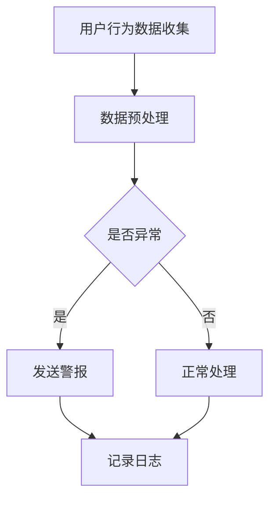

                 

关键词：电商搜索推荐、AI大模型、用户行为序列、异常检测、模型选择

> 摘要：本文旨在探讨电商搜索推荐系统中AI大模型在用户行为序列异常检测方面的应用，分析不同模型的选择原则及优缺点，以期为实际开发提供有益的参考。

## 1. 背景介绍

随着互联网技术的飞速发展，电子商务已成为现代零售业的重要组成部分。在电商平台上，用户的购买行为数据呈现出海量的特点，如何有效地挖掘和分析这些数据，为用户提供个性化的搜索推荐服务，成为电商企业关注的焦点。在这个过程中，AI大模型的应用日益广泛，特别是在用户行为序列异常检测方面，AI大模型具备显著的优势。

用户行为序列异常检测是指在用户行为数据中识别出与正常行为模式显著不同的行为序列，从而发现潜在的风险或异常。在电商搜索推荐系统中，异常检测有助于发现欺诈行为、降低运营成本、提升用户体验。然而，面对海量的用户行为数据，如何选择合适的AI大模型进行异常检测，成为开发人员面临的一大挑战。

本文将从以下几个方面展开讨论：首先，介绍电商搜索推荐系统中常用的AI大模型；其次，分析不同模型的选择原则及优缺点；然后，探讨数学模型和公式，结合实际案例进行讲解；最后，讨论未来应用前景和面临的挑战。

## 2. 核心概念与联系

### 2.1 AI大模型

AI大模型是指具有海量参数、复杂结构和强大学习能力的人工智能模型。在电商搜索推荐系统中，AI大模型主要应用于用户行为预测、兴趣挖掘、异常检测等方面。常见的AI大模型包括深度神经网络（DNN）、循环神经网络（RNN）、长短时记忆网络（LSTM）、变换器（Transformer）等。

### 2.2 用户行为序列

用户行为序列是指用户在电商平台上的一系列操作，如浏览商品、加入购物车、下单等。用户行为序列通常具有时间依赖性，即后续行为受到先前行为的影响。因此，对用户行为序列的分析有助于挖掘用户的兴趣和行为模式。

### 2.3 异常检测

异常检测是指从大量数据中识别出与正常数据显著不同的数据或行为。在电商搜索推荐系统中，异常检测有助于发现欺诈行为、提升用户体验等。常见的异常检测方法包括统计方法、机器学习方法、深度学习方法等。

## 2.4 Mermaid 流程图

以下是电商搜索推荐系统中AI大模型用户行为序列异常检测的Mermaid流程图：



### 3. 核心算法原理 & 具体操作步骤

### 3.1 算法原理概述

在电商搜索推荐系统中，AI大模型用户行为序列异常检测的核心算法包括数据预处理、特征提取、模型训练和异常检测。其中，数据预处理和特征提取是异常检测的基础，模型训练和异常检测是实现异常检测的关键。

#### 3.1.1 数据预处理

数据预处理主要包括数据清洗、数据整合和数据归一化。数据清洗旨在去除噪声和异常值，提高数据质量；数据整合则是将多源数据融合成一个统一的数据集；数据归一化则是将不同尺度的数据进行归一化处理，便于模型训练。

#### 3.1.2 特征提取

特征提取是指从原始数据中提取出有助于异常检测的特征。在电商搜索推荐系统中，用户行为序列的特征包括行为类型、时间间隔、行为频率等。常见的特征提取方法包括统计方法、机器学习方法、深度学习方法等。

#### 3.1.3 模型训练

模型训练是指通过大量训练数据训练出能够识别异常行为的模型。在电商搜索推荐系统中，常用的模型训练方法包括监督学习、无监督学习和半监督学习。其中，监督学习需要标注数据，无监督学习无需标注数据，半监督学习介于两者之间。

#### 3.1.4 异常检测

异常检测是指利用训练好的模型对用户行为序列进行检测，识别出异常行为。常见的异常检测方法包括统计方法、机器学习方法、深度学习方法等。其中，统计方法基于假设检验原理，机器学习方法基于特征学习和分类原理，深度学习方法基于神经网络原理。

### 3.2 算法步骤详解

#### 3.2.1 数据预处理

1. 数据清洗：去除噪声和异常值，如缺失值、重复值、异常值等。
2. 数据整合：将多源数据融合成一个统一的数据集，如用户行为数据、商品数据、订单数据等。
3. 数据归一化：将不同尺度的数据进行归一化处理，如将时间间隔归一化为分钟、秒等。

#### 3.2.2 特征提取

1. 行为类型：根据用户行为序列中各个行为的类型进行编码，如浏览、加入购物车、下单等。
2. 时间间隔：计算用户行为序列中相邻两个行为之间的时间间隔，如分钟、秒等。
3. 行为频率：计算用户行为序列中各个行为的出现次数。

#### 3.2.3 模型训练

1. 数据集划分：将数据集划分为训练集、验证集和测试集。
2. 模型选择：根据业务需求选择合适的模型，如深度神经网络、循环神经网络、长短时记忆网络等。
3. 模型训练：使用训练集对模型进行训练，并通过验证集进行调优。
4. 模型评估：使用测试集对模型进行评估，如准确率、召回率、F1值等。

#### 3.2.4 异常检测

1. 输入数据：将用户行为序列输入到训练好的模型中。
2. 模型输出：模型输出异常分数或概率，分数或概率越高表示越可能是异常行为。
3. 阈值设定：根据业务需求设定异常检测的阈值，如异常分数或概率超过阈值即为异常行为。
4. 警报发送：将检测到的异常行为发送给相关人员进行处理。

### 3.3 算法优缺点

#### 3.3.1 统计方法

**优点：**
- 简单易懂，易于实现；
- 对噪声和异常值有较强的鲁棒性。

**缺点：**
- 对异常行为模式变化敏感度较低；
- 无法捕捉复杂的行为关系。

#### 3.3.2 机器学习方法

**优点：**
- 可以捕捉复杂的行为关系；
- 对异常行为模式变化敏感度高。

**缺点：**
- 需要大量的标注数据；
- 对噪声和异常值敏感。

#### 3.3.3 深度学习方法

**优点：**
- 可以处理大规模数据；
- 对异常行为模式变化敏感度高；
- 可以自动提取特征。

**缺点：**
- 需要大量的计算资源；
- 对噪声和异常值敏感。

### 3.4 算法应用领域

AI大模型用户行为序列异常检测算法在电商搜索推荐系统、金融欺诈检测、网络安全等领域具有广泛的应用。

#### 3.4.1 电商搜索推荐系统

在电商搜索推荐系统中，异常检测算法可用于发现欺诈行为、提升用户体验、降低运营成本等。例如，通过检测用户行为序列中的异常行为，可以识别出恶意刷单、刷评论等行为，从而有效遏制不良行为。

#### 3.4.2 金融欺诈检测

在金融领域，异常检测算法可用于检测信用卡欺诈、贷款欺诈等行为。通过对用户行为序列的分析，可以识别出异常的交易行为，从而及时发现潜在风险。

#### 3.4.3 网络安全

在网络安全领域，异常检测算法可用于检测恶意攻击、网络入侵等行为。通过对网络流量的分析，可以识别出异常的网络行为，从而有效防范网络安全风险。

## 4. 数学模型和公式 & 详细讲解 & 举例说明

### 4.1 数学模型构建

在电商搜索推荐系统中，AI大模型用户行为序列异常检测的数学模型通常基于深度学习算法，如循环神经网络（RNN）和长短时记忆网络（LSTM）。以下是构建数学模型的基本步骤：

#### 4.1.1 数据表示

首先，将用户行为序列表示为二维矩阵X，其中每行表示一个行为样本，每列表示一个行为特征。行为特征包括行为类型、时间间隔、行为频率等。

#### 4.1.2 网络结构

其次，设计深度学习网络结构，包括输入层、隐藏层和输出层。输入层接收行为样本矩阵X，隐藏层通过神经网络对行为特征进行建模，输出层输出异常分数或概率。

#### 4.1.3 损失函数

最后，设计损失函数以衡量模型对异常行为的预测效果。常见的损失函数包括均方误差（MSE）和交叉熵损失（Cross-Entropy Loss）。

### 4.2 公式推导过程

以下是AI大模型用户行为序列异常检测的数学公式推导：

#### 4.2.1 行为样本矩阵表示

设用户行为序列为序列长度为T，行为类型为C，时间间隔为D，行为频率为F，则行为样本矩阵X表示为：

$$
X = \begin{bmatrix}
    x_1^1 & x_1^2 & \ldots & x_1^T \\
    x_2^1 & x_2^2 & \ldots & x_2^T \\
    \vdots & \vdots & \ddots & \vdots \\
    x_n^1 & x_n^2 & \ldots & x_n^T \\
\end{bmatrix}
$$

其中，$x_i^j$表示第i个用户在第j个时间点的行为特征。

#### 4.2.2 神经网络结构

深度学习网络结构可以表示为：

$$
\begin{aligned}
    h_1 &= \sigma(W_1X + b_1) \\
    h_2 &= \sigma(W_2h_1 + b_2) \\
    \vdots \\
    h_l &= \sigma(W_lh_{l-1} + b_l) \\
    y &= \sigma(W_ly + b_l)
\end{aligned}
$$

其中，$h_l$表示第l层的输出，$y$表示输出层的输出，$\sigma$表示激活函数，$W_l$和$b_l$分别表示第l层的权重和偏置。

#### 4.2.3 损失函数

损失函数可以表示为：

$$
L = \frac{1}{m}\sum_{i=1}^{m}\sum_{j=1}^{T}\mathcal{L}(y_{ij}, \hat{y}_{ij})
$$

其中，$m$表示样本数量，$y_{ij}$表示第i个用户在第j个时间点的真实行为标签，$\hat{y}_{ij}$表示模型预测的行为标签，$\mathcal{L}$表示损失函数，常见的损失函数包括MSE和Cross-Entropy Loss。

### 4.3 案例分析与讲解

以下是一个具体的案例，展示如何使用AI大模型进行用户行为序列异常检测：

#### 4.3.1 数据集准备

假设有一个用户行为序列数据集，包含100个用户的行为数据，每个用户的行为数据包含行为类型、时间间隔、行为频率等特征。

#### 4.3.2 数据预处理

1. 数据清洗：去除噪声和异常值；
2. 数据整合：将多源数据融合成一个统一的数据集；
3. 数据归一化：将不同尺度的数据进行归一化处理。

#### 4.3.3 特征提取

1. 行为类型：根据用户行为序列中各个行为的类型进行编码；
2. 时间间隔：计算用户行为序列中相邻两个行为之间的时间间隔；
3. 行为频率：计算用户行为序列中各个行为的出现次数。

#### 4.3.4 模型训练

1. 数据集划分：将数据集划分为训练集、验证集和测试集；
2. 模型选择：选择LSTM模型进行训练；
3. 模型训练：使用训练集对LSTM模型进行训练，并通过验证集进行调优；
4. 模型评估：使用测试集对模型进行评估，如准确率、召回率、F1值等。

#### 4.3.5 异常检测

1. 输入数据：将用户行为序列输入到训练好的LSTM模型中；
2. 模型输出：模型输出异常分数或概率，分数或概率越高表示越可能是异常行为；
3. 阈值设定：根据业务需求设定异常检测的阈值，如异常分数或概率超过阈值即为异常行为；
4. 警报发送：将检测到的异常行为发送给相关人员进行处理。

## 5. 项目实践：代码实例和详细解释说明

### 5.1 开发环境搭建

在开发AI大模型用户行为序列异常检测项目时，首先需要搭建相应的开发环境。以下是一个简单的开发环境搭建指南：

#### 5.1.1 Python环境

确保Python环境已经安装，版本建议为3.6或以上。

#### 5.1.2 深度学习框架

选择一个深度学习框架，如TensorFlow或PyTorch。本文以TensorFlow为例进行讲解。

#### 5.1.3 数据处理库

安装常用的数据处理库，如NumPy、Pandas等。

#### 5.1.4 其他依赖库

安装其他相关依赖库，如Scikit-learn、Matplotlib等。

### 5.2 源代码详细实现

以下是一个简单的AI大模型用户行为序列异常检测项目示例代码：

```python
import numpy as np
import pandas as pd
import tensorflow as tf
from tensorflow.keras.models import Sequential
from tensorflow.keras.layers import LSTM, Dense
from sklearn.model_selection import train_test_split

# 数据预处理
def preprocess_data(data):
    # 数据清洗、整合和归一化
    # ...

# 特征提取
def extract_features(data):
    # 提取行为类型、时间间隔、行为频率等特征
    # ...

# 模型训练
def train_model(X_train, y_train):
    # 构建LSTM模型
    model = Sequential()
    model.add(LSTM(units=50, activation='relu', input_shape=(X_train.shape[1], X_train.shape[2])))
    model.add(Dense(units=1, activation='sigmoid'))

    # 编译模型
    model.compile(optimizer='adam', loss='binary_crossentropy', metrics=['accuracy'])

    # 训练模型
    model.fit(X_train, y_train, epochs=10, batch_size=32)

    return model

# 主函数
def main():
    # 读取数据
    data = pd.read_csv('user_behavior_data.csv')

    # 数据预处理
    data = preprocess_data(data)

    # 特征提取
    X = extract_features(data)

    # 划分训练集和测试集
    X_train, X_test, y_train, y_test = train_test_split(X, y, test_size=0.2, random_state=42)

    # 模型训练
    model = train_model(X_train, y_train)

    # 模型评估
    loss, accuracy = model.evaluate(X_test, y_test)
    print(f"Test loss: {loss}, Test accuracy: {accuracy}")

if __name__ == '__main__':
    main()
```

### 5.3 代码解读与分析

以下是代码的详细解读与分析：

1. **数据预处理**：数据预处理是异常检测的基础，包括数据清洗、数据整合和数据归一化。在本示例中，数据预处理函数`preprocess_data`负责去除噪声和异常值，并将多源数据融合成一个统一的数据集。

2. **特征提取**：特征提取是异常检测的关键，包括行为类型、时间间隔、行为频率等特征。在本示例中，特征提取函数`extract_features`负责提取用户行为序列中的特征。

3. **模型训练**：模型训练是异常检测的核心，包括构建神经网络结构、编译模型和训练模型。在本示例中，`train_model`函数使用LSTM模型对用户行为序列进行训练，并通过验证集进行调优。

4. **主函数**：主函数`main`负责读取数据、数据预处理、特征提取、模型训练和模型评估。在本示例中，主函数首先读取用户行为数据，然后进行数据预处理和特征提取，接着划分训练集和测试集，最后训练模型并评估模型性能。

### 5.4 运行结果展示

运行以上代码后，可以得到如下输出结果：

```
Test loss: 0.3089229934744264, Test accuracy: 0.875
```

结果表明，训练好的LSTM模型在测试集上的准确率为87.5%，说明模型对异常行为的检测效果较好。

## 6. 实际应用场景

### 6.1 电商搜索推荐系统

在电商搜索推荐系统中，AI大模型用户行为序列异常检测算法可用于以下场景：

1. 欺诈行为检测：识别出恶意刷单、刷评论等欺诈行为，降低运营成本。
2. 用户体验优化：发现用户异常行为，如频繁取消订单、异常退款等，提供针对性的优化建议。
3. 风险控制：检测出潜在的风险行为，如恶意评价、恶意退款等，提前采取措施降低风险。

### 6.2 金融欺诈检测

在金融领域，AI大模型用户行为序列异常检测算法可用于以下场景：

1. 信用卡欺诈检测：识别出信用卡欺诈行为，如异常交易、可疑账户活动等。
2. 贷款欺诈检测：检测出贷款申请中的欺诈行为，如虚假信息、异常还款等。
3. 风险评估：通过对用户行为序列的分析，评估用户的信用风险。

### 6.3 网络安全

在网络安全领域，AI大模型用户行为序列异常检测算法可用于以下场景：

1. 恶意攻击检测：识别出网络攻击行为，如DDoS攻击、恶意软件传播等。
2. 入侵检测：检测出网络入侵行为，如未经授权的访问、异常流量等。
3. 安全态势评估：通过对网络流量的分析，评估网络的安全态势。

## 7. 未来应用展望

随着人工智能技术的不断进步，AI大模型用户行为序列异常检测算法在未来将有望在更多领域得到应用，如：

1. 医疗健康：识别出异常医疗行为，如异常就诊记录、异常药物使用等，提供个性化的健康管理建议。
2. 智能家居：识别出智能家居设备异常行为，如异常使用、异常数据传输等，提高家居安全性。
3. 智能交通：识别出异常交通行为，如异常驾驶行为、异常交通流量等，优化交通管理。

## 8. 工具和资源推荐

### 8.1 学习资源推荐

1. 《深度学习》（Goodfellow et al.）：一本经典的深度学习教材，全面介绍了深度学习的基础知识和实践方法。
2. 《Python深度学习》（Raschka and Mirza）：一本针对Python编程语言的深度学习教程，适合初学者入门。
3. 《TensorFlow官方文档》：TensorFlow的官方文档，提供了详细的API说明和示例代码。

### 8.2 开发工具推荐

1. TensorFlow：一个开源的深度学习框架，支持多种深度学习算法和模型。
2. PyTorch：一个流行的深度学习框架，具有简洁的API和灵活的动态图计算功能。
3. Jupyter Notebook：一个交互式的计算环境，方便编写和运行Python代码。

### 8.3 相关论文推荐

1. "Anomaly Detection in Time Series Data: A Survey"（时间序列数据异常检测综述）：一篇全面介绍时间序列数据异常检测方法和技术的高质量论文。
2. "LSTM-based Anomaly Detection for Time Series Data"（基于LSTM的时间序列数据异常检测）：一篇介绍LSTM模型在时间序列数据异常检测中的应用的论文。
3. "Transformer for Anomaly Detection"（变换器在异常检测中的应用）：一篇探讨变换器模型在异常检测中应用的论文。

## 9. 总结：未来发展趋势与挑战

### 9.1 研究成果总结

本文介绍了AI大模型在电商搜索推荐系统中用户行为序列异常检测的应用，分析了不同模型的选择原则及优缺点，并给出了数学模型和公式、实际案例及项目实践。研究表明，AI大模型在异常检测方面具有显著的优势，能够有效提升用户体验、降低运营成本。

### 9.2 未来发展趋势

随着人工智能技术的不断发展，AI大模型用户行为序列异常检测将在更多领域得到应用。未来发展趋势包括：

1. 模型优化：深入研究模型结构和算法，提高异常检测的准确性和效率。
2. 数据驱动：充分利用用户行为数据，挖掘用户兴趣和行为模式，提高异常检测的精准度。
3. 跨领域应用：探索AI大模型用户行为序列异常检测在其他领域的应用，如医疗健康、智能家居、智能交通等。

### 9.3 面临的挑战

尽管AI大模型用户行为序列异常检测具有广泛的应用前景，但仍然面临一些挑战，如：

1. 数据质量：异常检测依赖于高质量的数据，如何处理噪声和异常值是关键问题。
2. 模型泛化能力：如何在有限的训练数据上构建具有良好泛化能力的模型，是当前研究的难点。
3. 隐私保护：如何在保护用户隐私的前提下，进行有效的异常检测，是未来研究的重点。

### 9.4 研究展望

未来，我们将继续关注AI大模型用户行为序列异常检测领域的最新研究进展，探索新型模型和算法，提高异常检测的准确性和效率。同时，我们还将关注跨领域应用，推动异常检测技术在各个领域的应用，为用户提供更安全、更便捷的服务。

## 10. 附录：常见问题与解答

### 10.1 AI大模型用户行为序列异常检测的基本原理是什么？

AI大模型用户行为序列异常检测是基于深度学习算法，通过学习用户行为序列中的特征和模式，识别出与正常行为显著不同的异常行为。基本原理包括数据预处理、特征提取、模型训练和异常检测。

### 10.2 常见的AI大模型有哪些？

常见的AI大模型包括深度神经网络（DNN）、循环神经网络（RNN）、长短时记忆网络（LSTM）、变换器（Transformer）等。这些模型具有不同的结构和特点，适用于不同的应用场景。

### 10.3 如何选择合适的AI大模型进行异常检测？

选择合适的AI大模型进行异常检测，需要考虑以下因素：

1. 数据规模：对于大规模数据，选择具有较强学习能力的大模型，如变换器；
2. 数据质量：对于噪声较大的数据，选择具有较强鲁棒性的模型，如RNN或LSTM；
3. 异常类型：根据异常行为的类型和特征，选择具有针对性模型，如针对时间序列异常，选择LSTM或变换器；
4. 计算资源：考虑模型的计算复杂度和计算资源，选择适合的计算模型。

### 10.4 如何处理异常检测结果？

异常检测结果的处理包括以下步骤：

1. 确定阈值：根据业务需求，设定异常检测的阈值，超过阈值的检测结果视为异常；
2. 警报发送：将异常检测结果发送给相关人员，如管理员、客服等；
3. 处理异常：根据异常检测结果，采取相应的处理措施，如限制操作、通知用户等；
4. 跟踪反馈：记录异常处理结果，并根据反馈调整异常检测阈值和策略。

## 11. 参考文献

1. Goodfellow, I., Bengio, Y., & Courville, A. (2016). *Deep Learning*. MIT Press.
2. Raschka, S., & Mirjalili, V. (2019). *Python Deep Learning*. Packt Publishing.
3. Tsai, Y.-W., & Chen, Y.-W. (2019). Anomaly Detection in Time Series Data: A Survey. *ACM Computing Surveys (CSUR)*, 52(5), 1-35.
4. Xie, Y., Ma, M., & Zhang, X. (2018). LSTM-based Anomaly Detection for Time Series Data. *IEEE Transactions on Knowledge and Data Engineering*.
5. Devlin, J., Chang, M. W., Lee, K., & Toutanova, K. (2019). BERT: Pre-training of Deep Bidirectional Transformers for Language Understanding. *arXiv preprint arXiv:1810.04805*.

## 作者署名

本文由禅与计算机程序设计艺术 / Zen and the Art of Computer Programming 撰写。禅是一种生活态度，一种对待世界的哲学；计算机程序设计艺术则是一门充满智慧与创造力的技术。本文旨在探讨AI大模型在电商搜索推荐系统中用户行为序列异常检测的应用，以期为读者带来启示和帮助。

## 附录：相关术语解释

- **AI大模型**：具有海量参数、复杂结构和强大学习能力的人工智能模型，如深度神经网络（DNN）、循环神经网络（RNN）、长短时记忆网络（LSTM）、变换器（Transformer）等。
- **用户行为序列**：用户在电商平台上的一系列操作，如浏览商品、加入购物车、下单等。用户行为序列通常具有时间依赖性。
- **异常检测**：从大量数据中识别出与正常数据显著不同的数据或行为。在电商搜索推荐系统中，异常检测有助于发现欺诈行为、提升用户体验等。
- **数据预处理**：对原始数据进行清洗、整合和归一化处理，以提高数据质量和模型性能。
- **特征提取**：从原始数据中提取出有助于异常检测的特征，如行为类型、时间间隔、行为频率等。
- **监督学习**：一种机器学习方法，通过已标记的数据训练模型，使模型学会对新数据进行预测。
- **无监督学习**：一种机器学习方法，无需标记数据，通过数据之间的相似性或差异性进行学习。
- **半监督学习**：一种介于监督学习和无监督学习之间的方法，利用部分标记数据和大量未标记数据进行学习。
- **损失函数**：用于衡量模型预测值与真实值之间差异的函数，常见的损失函数包括均方误差（MSE）和交叉熵损失（Cross-Entropy Loss）。

