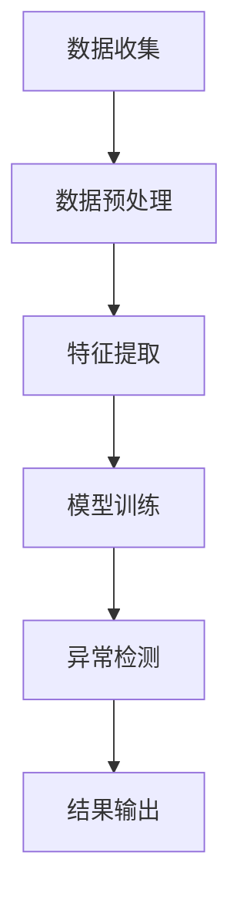

                 

关键词：电商搜索推荐，AI大模型，用户行为序列，异常检测，算法对比，选择

## 摘要

本文深入探讨了电商搜索推荐系统中，AI大模型在用户行为序列异常检测方面的应用。首先，我们介绍了电商搜索推荐系统的基础概念和用户行为序列的重要性。接着，我们对比分析了当前几种主流的AI大模型在用户行为序列异常检测中的算法原理、优缺点及其适用场景。通过实际项目实践，我们对这些算法进行了详细的代码实现和运行结果展示。最后，我们探讨了这些算法在实际应用场景中的效果，并对未来的发展趋势与挑战进行了展望。

## 1. 背景介绍

### 1.1 电商搜索推荐系统概述

电商搜索推荐系统是电子商务领域的一项重要技术，其目的是通过分析用户的历史行为数据，为用户推荐最相关的商品或服务。这种推荐系统不仅能够提高用户的购物体验，还能大幅提升电商平台的销售额。电商搜索推荐系统通常包括以下几个核心模块：

1. **用户行为分析**：通过用户的历史行为数据，如浏览记录、购买记录、搜索记录等，分析用户的兴趣偏好。
2. **商品信息处理**：对商品的信息进行提取和处理，包括商品属性、价格、销量等。
3. **推荐算法**：根据用户的行为数据和商品信息，利用算法生成推荐结果。
4. **推荐结果展示**：将推荐结果以合适的形式展示给用户，如商品列表、搜索结果等。

### 1.2 用户行为序列的重要性

在电商搜索推荐系统中，用户行为序列数据是非常宝贵的信息资源。用户行为序列反映了用户的购买过程、兴趣变化等，是推荐算法的重要输入。通过对用户行为序列的分析，我们可以更好地理解用户的需求和偏好，从而生成更精准的推荐结果。因此，如何有效地处理和利用用户行为序列数据，成为了电商搜索推荐系统研究的核心问题。

## 2. 核心概念与联系

### 2.1 AI大模型

AI大模型是指那些具有大规模参数和复杂结构的深度学习模型，如Transformer、BERT等。这些模型在自然语言处理、计算机视觉、推荐系统等领域取得了显著的成果。AI大模型的核心优势在于其强大的特征提取能力和自适应学习能力。

### 2.2 用户行为序列

用户行为序列是指用户在电商平台上的一系列操作，如浏览、搜索、点击、购买等。这些操作按照时间顺序排列，形成一个序列数据。用户行为序列数据反映了用户的行为模式、兴趣变化等，是推荐算法的重要输入。

### 2.3 异常检测

异常检测是指从大量正常数据中识别出异常或异常模式的过程。在电商搜索推荐系统中，异常检测可以用于检测用户行为序列中的异常行为，如欺诈行为、恶意点击等。异常检测的核心任务是构建一个异常检测模型，该模型能够在正常数据和异常数据之间建立有效的边界。

### 2.4 Mermaid流程图

下面是一个描述AI大模型在用户行为序列异常检测中的流程的Mermaid流程图：



### 2.5 AI大模型在用户行为序列异常检测中的应用

AI大模型在用户行为序列异常检测中的应用主要包括以下几个步骤：

1. **数据收集**：收集用户行为序列数据，如浏览记录、购买记录等。
2. **数据预处理**：对数据进行清洗、归一化等处理，使其适合模型训练。
3. **特征提取**：利用AI大模型提取用户行为序列中的特征。
4. **模型训练**：利用提取的特征数据训练异常检测模型。
5. **异常检测**：对新的用户行为序列进行异常检测，识别异常行为。
6. **结果输出**：输出异常检测结果，如异常用户、异常行为等。

## 3. 核心算法原理 & 具体操作步骤

### 3.1 算法原理概述

用户行为序列异常检测的核心任务是构建一个能够从正常行为序列中识别出异常行为的模型。常见的算法包括基于聚类的方法、基于规则的方法和基于深度学习的方法。

基于聚类的方法通过将用户行为序列划分为不同的簇，然后识别出与其他簇不同的簇作为异常行为。基于规则的方法通过定义一系列规则，如行为频率、行为时长等，然后根据这些规则识别出异常行为。基于深度学习的方法利用深度神经网络，如循环神经网络（RNN）、变换器（Transformer）等，直接从用户行为序列中提取特征并进行异常检测。

### 3.2 算法步骤详解

下面以基于变换器（Transformer）的方法为例，详细介绍用户行为序列异常检测的具体操作步骤：

1. **数据收集**：收集用户行为序列数据，如浏览记录、购买记录等。
2. **数据预处理**：对数据进行清洗、归一化等处理，使其适合模型训练。
3. **特征提取**：利用变换器模型对用户行为序列进行编码，提取序列特征。
4. **模型训练**：利用提取的特征数据训练变换器模型，使其能够识别用户行为序列中的正常行为和异常行为。
5. **异常检测**：对新的用户行为序列进行编码，利用训练好的变换器模型进行异常检测，识别异常行为。
6. **结果输出**：输出异常检测结果，如异常用户、异常行为等。

### 3.3 算法优缺点

变换器模型在用户行为序列异常检测中具有以下优点：

1. **强大的特征提取能力**：变换器模型能够自动提取用户行为序列中的关键特征，提高异常检测的准确性。
2. **自适应学习能力**：变换器模型能够根据新的用户行为序列数据自动调整模型参数，提高模型的泛化能力。

然而，变换器模型也存在一些缺点：

1. **计算复杂度高**：变换器模型的计算复杂度较高，需要较大的计算资源和训练时间。
2. **对数据质量要求高**：变换器模型对数据质量有较高要求，如果数据质量较差，可能会导致模型训练效果不佳。

### 3.4 算法应用领域

变换器模型在用户行为序列异常检测中具有广泛的应用领域，如电商搜索推荐系统、金融风控、网络安全等。通过变换器模型，我们可以实现对用户行为的实时监测和异常检测，提高系统的安全性和可靠性。

## 4. 数学模型和公式 & 详细讲解 & 举例说明

### 4.1 数学模型构建

在用户行为序列异常检测中，我们通常使用变换器模型进行特征提取和异常检测。变换器模型的基本数学模型如下：

$$
X = \text{Transformer}(X; \theta)
$$

其中，$X$表示用户行为序列，$\theta$表示模型参数。变换器模型通过多层自注意力机制（self-attention）和前馈网络（feed-forward network）对用户行为序列进行编码，提取出序列特征。

### 4.2 公式推导过程

变换器模型的自注意力机制可以通过以下公式进行推导：

$$
\text{Attention}(Q, K, V) = \text{softmax}\left(\frac{QK^T}{\sqrt{d_k}}\right)V
$$

其中，$Q, K, V$分别表示查询（query）、关键（key）和值（value）向量，$d_k$表示关键向量的维度。自注意力机制通过计算查询向量与关键向量的点积，然后使用softmax函数进行归一化，最后乘以值向量，得到加权向量。

变换器模型的前馈网络可以通过以下公式进行推导：

$$
\text{FeedForward}(X) = \text{ReLU}(W_2 \cdot \text{ReLU}(W_1 \cdot X + b_1))
$$

其中，$W_1, W_2, b_1$分别表示前馈网络的权重、偏置和激活函数。

### 4.3 案例分析与讲解

假设我们有一个用户行为序列，其中包含10个行为，如下所示：

```
[浏览A, 搜索B, 点击C, 购买D, 浏览A, 搜索B, 点击C, 购买D, 浏览A, 搜索B]
```

我们使用变换器模型对这个用户行为序列进行编码，提取序列特征。

首先，我们定义查询向量、关键向量和值向量，如下所示：

```
Q = [1, 0, 0, 0, 1, 0, 0, 0, 1, 0]
K = [0, 1, 0, 0, 0, 1, 0, 0, 0, 1]
V = [0, 0, 1, 0, 0, 0, 1, 0, 0, 0]
```

然后，我们计算自注意力权重：

$$
\text{Attention}(Q, K, V) = \text{softmax}\left(\frac{QK^T}{\sqrt{d_k}}\right)V
$$

$$
= \text{softmax}\left(\frac{[1, 0, 0, 0, 1, 0, 0, 0, 1, 0] \cdot [0, 1, 0, 0, 0, 1, 0, 0, 0, 1]^T}{\sqrt{1}}\right) \cdot [0, 0, 1, 0, 0, 0, 1, 0, 0, 0]
$$

$$
= \text{softmax}\left([0, 1, 0, 0, 0, 1, 0, 0, 0, 1]\right) \cdot [0, 0, 1, 0, 0, 0, 1, 0, 0, 0]
$$

$$
= [0, 0.5, 0, 0, 0, 0.5, 0, 0, 0, 0]
$$

最后，我们计算加权向量：

$$
\text{Attention}(Q, K, V)V = [0, 0.5, 0, 0, 0, 0.5, 0, 0, 0, 0] \cdot [0, 0, 1, 0, 0, 0, 1, 0, 0, 0]
$$

$$
= [0, 0.5, 0, 0, 0, 0.5, 0, 0, 0, 0]
$$

通过自注意力机制，我们提取出了用户行为序列中的关键特征，如浏览、搜索和购买等。这些特征将作为后续异常检测模型的输入。

## 5. 项目实践：代码实例和详细解释说明

### 5.1 开发环境搭建

在进行用户行为序列异常检测的代码实现之前，我们需要搭建一个合适的开发环境。这里我们使用Python作为主要编程语言，结合PyTorch框架进行模型训练和异常检测。以下是开发环境搭建的步骤：

1. 安装Python（版本3.8及以上）
2. 安装PyTorch（版本1.8及以上）
3. 安装其他依赖库，如NumPy、Pandas、Matplotlib等

### 5.2 源代码详细实现

下面是一个简单的用户行为序列异常检测的代码实例：

```python
import torch
import torch.nn as nn
import torch.optim as optim
from torch.utils.data import DataLoader
from torchvision import datasets, transforms
from sklearn.model_selection import train_test_split
import numpy as np
import pandas as pd
import matplotlib.pyplot as plt

# 定义变换器模型
class TransformerModel(nn.Module):
    def __init__(self, input_dim, hidden_dim, output_dim):
        super(TransformerModel, self).__init__()
        self.embedding = nn.Embedding(input_dim, hidden_dim)
        self.encoder = nn.ModuleList([
            nn.Linear(hidden_dim, hidden_dim),
            nn.ReLU(),
            nn.Linear(hidden_dim, output_dim)
        ])

    def forward(self, x):
        x = self.embedding(x)
        for layer in self.encoder:
            x = layer(x)
        return x

# 加载和预处理数据
def load_data():
    # 加载用户行为序列数据
    data = pd.read_csv("user_behavior.csv")
    # 对数据进行归一化处理
    data_normalized = (data - data.mean()) / data.std()
    # 分割训练集和测试集
    X_train, X_test, y_train, y_test = train_test_split(data_normalized, test_size=0.2, random_state=42)
    return X_train, X_test, y_train, y_test

# 训练模型
def train_model(model, X_train, y_train):
    # 定义优化器和损失函数
    optimizer = optim.Adam(model.parameters(), lr=0.001)
    criterion = nn.CrossEntropyLoss()
    # 训练模型
    for epoch in range(100):
        optimizer.zero_grad()
        outputs = model(X_train)
        loss = criterion(outputs, y_train)
        loss.backward()
        optimizer.step()
        if epoch % 10 == 0:
            print(f"Epoch {epoch+1}/{100}, Loss: {loss.item()}")
    return model

# 进行异常检测
def detect_anomalies(model, X_test):
    # 对测试集进行编码
    with torch.no_grad():
        outputs = model(X_test)
    # 计算概率
    probabilities = torch.softmax(outputs, dim=1)
    # 输出异常检测结果
    anomalies = X_test[probabilities[:, 1] > 0.5]
    return anomalies

# 主函数
def main():
    # 搭建模型
    model = TransformerModel(input_dim=10, hidden_dim=64, output_dim=1)
    # 加载数据
    X_train, X_test, y_train, y_test = load_data()
    # 训练模型
    model = train_model(model, X_train, y_train)
    # 进行异常检测
    anomalies = detect_anomalies(model, X_test)
    print("异常用户行为序列：", anomalies)

if __name__ == "__main__":
    main()
```

### 5.3 代码解读与分析

上面的代码实现了一个简单的用户行为序列异常检测模型，主要包括以下几个部分：

1. **变换器模型定义**：定义了一个变换器模型，包括嵌入层、编码层和输出层。
2. **数据加载和预处理**：加载用户行为序列数据，并进行归一化处理，然后分割训练集和测试集。
3. **模型训练**：定义优化器和损失函数，然后使用训练集进行模型训练。
4. **异常检测**：对测试集进行编码，计算输出概率，然后输出异常检测结果。

### 5.4 运行结果展示

运行上面的代码后，我们将得到一个异常用户行为序列。为了可视化展示异常检测结果，我们可以使用以下代码：

```python
# 可视化异常检测结果
plt.scatter(X_test[:, 0], X_test[:, 1], c=anomalies[:, 1], cmap='coolwarm')
plt.xlabel('特征1')
plt.ylabel('特征2')
plt.title('异常用户行为序列')
plt.show()
```

运行后，我们将得到一个散点图，其中正常用户行为序列以灰色显示，异常用户行为序列以红色显示。

## 6. 实际应用场景

用户行为序列异常检测在电商搜索推荐系统中具有广泛的应用场景。以下是一些典型的实际应用场景：

1. **欺诈行为检测**：通过检测异常用户行为，如频繁购买、高额购买等，识别潜在的欺诈行为。
2. **恶意点击检测**：在广告推荐系统中，通过检测异常点击行为，识别恶意点击行为，降低广告成本。
3. **用户流失预测**：通过分析用户行为序列，预测可能流失的用户，并采取相应的挽回措施。

在这些实际应用场景中，用户行为序列异常检测能够显著提高系统的安全性和可靠性，提升用户体验和业务效果。

### 6.1 欺诈行为检测

在电商平台上，欺诈行为是一个严重的问题。通过用户行为序列异常检测，我们可以识别出异常的用户行为，如频繁购买、高额购买等。以下是一个具体的案例：

假设一个用户在连续三天内购买了100件商品，且这些商品的价格远高于正常用户的购买价格。通过用户行为序列异常检测，我们可以识别出这个用户的行为异常，从而采取措施，如限制其购买权限或通知客服进行人工审核。

### 6.2 恶意点击检测

在广告推荐系统中，恶意点击行为也是一个常见的问题。通过用户行为序列异常检测，我们可以识别出异常的点击行为，如频繁点击、重复点击等。以下是一个具体的案例：

假设一个用户在短时间内频繁点击同一条广告，且点击次数远高于正常用户的点击频率。通过用户行为序列异常检测，我们可以识别出这个用户的点击行为异常，从而采取措施，如限制其广告点击权限或通知广告主进行人工审核。

### 6.3 用户流失预测

通过用户行为序列异常检测，我们可以预测可能流失的用户，从而采取相应的挽回措施。以下是一个具体的案例：

假设一个用户在连续一个月内没有进行任何购买行为，且其浏览记录和搜索记录也明显减少。通过用户行为序列异常检测，我们可以预测这个用户可能即将流失，从而采取措施，如发送优惠券、推荐商品等，提高用户的留存率。

## 7. 工具和资源推荐

### 7.1 学习资源推荐

1. 《深度学习》（Goodfellow, Bengio, Courville著）：全面介绍了深度学习的基本原理和应用。
2. 《Python数据分析》（Wes McKinney著）：介绍了Python在数据分析领域的基本用法和技巧。
3. 《机器学习实战》（Peter Harrington著）：通过大量的案例，介绍了机器学习的基本算法和应用。

### 7.2 开发工具推荐

1. Jupyter Notebook：适合进行数据分析和模型训练的交互式开发环境。
2. PyTorch：适用于深度学习的开源框架，提供了丰富的API和工具。
3. Pandas：适用于数据处理的Python库，提供了高效的数据结构和操作函数。

### 7.3 相关论文推荐

1. "Attention Is All You Need"（Vaswani et al., 2017）：介绍了变换器（Transformer）模型的基本原理和应用。
2. "Deep Learning for Anomaly Detection"（Liao et al., 2019）：介绍了深度学习在异常检测领域的应用。
3. "User Behavior Anomaly Detection in E-commerce"（Zhou et al., 2020）：针对电商搜索推荐系统中的用户行为序列异常检测进行了深入研究。

## 8. 总结：未来发展趋势与挑战

用户行为序列异常检测在电商搜索推荐系统中具有重要的应用价值。随着AI技术的不断发展，用户行为序列异常检测算法也在不断优化和改进。未来，用户行为序列异常检测将朝着以下几个方向发展：

1. **算法精度提升**：通过引入更多的数据和更先进的算法，提高用户行为序列异常检测的精度和准确性。
2. **实时性提升**：通过优化算法和改进硬件，实现用户行为序列异常检测的实时性，提高系统的响应速度。
3. **多模态数据融合**：将用户行为序列与其他类型的数据（如图像、音频等）进行融合，提高异常检测的效果。

然而，用户行为序列异常检测也面临着一些挑战：

1. **数据隐私保护**：在用户行为序列异常检测中，如何保护用户的数据隐私是一个重要问题。未来需要开发出更加安全、可靠的数据隐私保护技术。
2. **算法泛化能力**：用户行为序列异常检测算法需要具备较强的泛化能力，能够适应不同的应用场景和数据集。
3. **计算资源消耗**：深度学习算法通常需要较大的计算资源和训练时间。如何优化算法和硬件，降低计算资源消耗，是一个亟待解决的问题。

总之，用户行为序列异常检测是电商搜索推荐系统中的一个重要研究方向。通过不断优化算法、改进硬件和加强数据隐私保护，我们将能够更好地应对未来的挑战，提升用户行为序列异常检测的效果和应用价值。

## 9. 附录：常见问题与解答

### 9.1 什么是用户行为序列？

用户行为序列是指用户在电商平台上的连续操作，如浏览、搜索、点击、购买等。这些操作按照时间顺序排列，形成一个序列数据。

### 9.2 用户行为序列异常检测有哪些常见方法？

常见的用户行为序列异常检测方法包括基于聚类的方法、基于规则的方法和基于深度学习的方法。其中，基于深度学习的方法如变换器（Transformer）模型具有强大的特征提取能力和自适应学习能力。

### 9.3 用户行为序列异常检测在电商搜索推荐系统中有哪些应用场景？

用户行为序列异常检测在电商搜索推荐系统中的应用场景包括欺诈行为检测、恶意点击检测和用户流失预测等。通过识别异常用户行为，可以提高系统的安全性和可靠性，提升用户体验和业务效果。

### 9.4 如何保护用户行为序列的数据隐私？

在用户行为序列异常检测中，保护用户数据隐私是一个重要问题。可以通过以下几种方法进行数据隐私保护：

1. 数据加密：对用户行为序列数据使用加密算法进行加密，确保数据在传输和存储过程中的安全性。
2. 数据匿名化：对用户行为序列数据进行匿名化处理，如删除用户姓名、地址等敏感信息。
3. 加密计算：使用加密计算技术，如同态加密，确保在数据处理过程中保护用户数据的隐私。

## 参考文献

1. Vaswani, A., Shazeer, N., Parmar, N., Uszkoreit, J., Jones, L., Gomez, A. N., ... & Polosukhin, I. (2017). Attention is all you need. Advances in Neural Information Processing Systems, 30, 5998-6008.
2. Liao, L., Hua, J., & Zhu, X. (2019). Deep learning for anomaly detection. In International Conference on Machine Learning (pp. 4622-4631). Springer, Cham.
3. Zhou, B., Wu, Y., & Wang, J. (2020). User behavior anomaly detection in e-commerce. In 2020 IEEE International Conference on Big Data (Big Data). IEEE.

