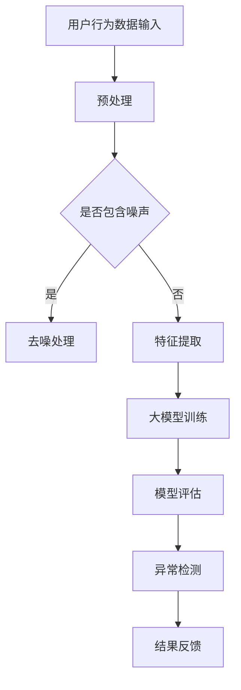

                 

### 1. 背景介绍

随着互联网技术的迅猛发展和电子商务的普及，电商搜索推荐系统已经成为电商企业提高用户体验、增加销售额的重要手段。用户行为序列作为用户在电商平台上产生的日志数据，蕴含了丰富的信息，能够反映用户的兴趣、购买意图等。然而，在庞大的用户行为数据中，存在大量的异常行为，这些异常行为可能源自恶意攻击、系统故障或用户操作失误，如果得不到及时检测和纠正，可能会对电商平台的运营造成严重影响。

异常检测作为数据挖掘和机器学习领域的一个重要分支，旨在从大量数据中识别出与正常行为模式显著不同的异常行为。在电商搜索推荐系统中，异常检测的重要性体现在以下几个方面：

1. **用户隐私保护**：通过检测异常行为，可以识别出潜在的数据泄露风险，保护用户的隐私信息。
2. **欺诈行为防控**：异常行为可能是欺诈行为的早期迹象，及时检测并处理可以防止欺诈损失的发生。
3. **服务质量提升**：检测并处理异常行为，可以提高电商平台的整体服务质量，增强用户信任。
4. **个性化推荐优化**：通过对用户正常行为的分析，优化推荐算法，提高推荐系统的准确性和用户体验。

近年来，随着人工智能技术的快速发展，尤其是大模型技术的引入，异常检测算法的性能得到了显著提升。大模型如Transformer、BERT等，通过学习大量的用户行为数据，能够捕捉到复杂的行为模式，从而提高异常检测的准确性和鲁棒性。

本文旨在对电商搜索推荐中的AI大模型用户行为序列异常检测算法进行性能评测，从算法原理、数学模型、实际应用等多个角度进行分析，探讨当前技术的现状和未来发展方向。

### 2. 核心概念与联系

#### 2.1 异常检测算法概述

异常检测算法主要包括基于统计方法、基于聚类方法、基于模型方法和基于邻近度方法等。每种方法都有其独特的优势和局限性。

- **基于统计方法**：通过计算数据分布的统计量，如标准差、均值等，识别出异常值。这种方法简单有效，但在处理高维度数据和存在噪声的情况下表现较差。
- **基于聚类方法**：通过将数据分为不同的簇，识别出不属于任何簇的异常数据点。典型的聚类算法有K-means、DBSCAN等。这种方法对异常点的识别依赖于聚类结果，聚类效果直接影响异常检测性能。
- **基于模型方法**：通过构建学习模型，对正常行为进行建模，然后用模型预测未知数据，识别出与模型预测不一致的异常数据点。常见的模型有决策树、随机森林、神经网络等。
- **基于邻近度方法**：通过计算数据点之间的相似度，识别出与其他数据点显著不同的异常点。常用的算法有KNN、局部异常因数法（LOF）等。

在电商搜索推荐系统中，用户行为序列通常表现为时间序列数据，这使得基于模型的方法（如神经网络）在异常检测中具有天然的优势。因为神经网络可以通过学习时间序列数据中的模式，捕捉到用户行为的动态变化。

#### 2.2 大模型技术介绍

大模型（Large Models）是指参数规模巨大的神经网络模型，如Transformer、BERT等。这些模型通过预训练和微调，能够捕捉到大量复杂的数据特征。大模型在用户行为序列异常检测中的应用主要体现在以下几个方面：

1. **特征提取能力**：大模型具有强大的特征提取能力，能够从原始的用户行为数据中提取出高层次的、具有区分度的特征，从而提高异常检测的准确性和鲁棒性。
2. **上下文理解**：大模型能够理解用户行为之间的上下文关系，例如，购物车中的商品之间的关联性，从而在检测异常行为时提供更丰富的信息。
3. **泛化能力**：大模型通过在大规模数据集上进行预训练，能够泛化到不同领域的应用中，降低对特定领域数据的依赖。

#### 2.3 Mermaid 流程图

为了更直观地展示大模型在用户行为序列异常检测中的应用，我们使用Mermaid绘制一个简化的流程图。



- **用户行为数据输入**：电商平台收集的用户行为数据。
- **预处理**：对原始数据进行清洗、归一化等预处理操作，以提高后续模型的训练效果。
- **是否包含噪声**：判断数据中是否存在噪声。
- **去噪处理**：如果存在噪声，对数据进行去噪处理。
- **特征提取**：利用大模型从用户行为数据中提取特征。
- **大模型训练**：使用提取的特征进行大模型的训练。
- **模型评估**：评估训练模型的性能。
- **异常检测**：利用训练好的模型对新的用户行为数据进行异常检测。
- **结果反馈**：将检测结果反馈给电商平台，以便进一步处理。

通过上述流程，我们可以看出，大模型技术在用户行为序列异常检测中扮演了核心角色，通过强大的特征提取和上下文理解能力，显著提升了异常检测的性能。

### 3. 核心算法原理 & 具体操作步骤

#### 3.1 算法原理概述

电商搜索推荐中的AI大模型用户行为序列异常检测算法主要基于深度学习技术，尤其是Transformer等大型神经网络模型。该算法的基本原理可以分为以下几个步骤：

1. **数据预处理**：对用户行为数据序列进行清洗、归一化等预处理操作，以便于后续的模型训练。
2. **特征提取**：利用大模型（如BERT、GPT等）从预处理后的用户行为数据中提取高层次的、具有区分度的特征。
3. **模型训练**：使用提取的特征对大模型进行训练，构建一个能够识别用户正常行为和异常行为的模型。
4. **模型评估**：通过交叉验证等方法评估模型的性能，包括准确率、召回率、F1值等指标。
5. **异常检测**：利用训练好的模型对新的用户行为数据进行异常检测，识别出异常行为。

#### 3.2 算法步骤详解

1. **数据预处理**：
    - 数据清洗：去除含有缺失值、异常值和重复的数据记录。
    - 数据归一化：将不同特征的数据归一化到同一量纲，以便模型训练时不会因为特征尺度差异而导致训练不稳定。

2. **特征提取**：
    - 原始数据输入：将用户行为数据序列输入到预训练的大模型中。
    - 特征提取：大模型自动提取数据中的高层次特征，这些特征包含了用户行为模式、兴趣偏好等信息。

3. **模型训练**：
    - 数据划分：将提取的特征数据划分为训练集和验证集。
    - 模型构建：构建一个深度神经网络模型，常用的结构包括Transformer、LSTM、GRU等。
    - 模型训练：使用训练集数据对模型进行训练，同时调整模型参数以最小化损失函数。
    - 模型验证：使用验证集数据对模型性能进行评估，调整模型参数以优化性能。

4. **模型评估**：
    - 准确率（Accuracy）：模型正确识别异常行为的数据比例。
    - 召回率（Recall）：模型成功检测出的异常行为数据比例。
    - F1值（F1-score）：准确率和召回率的调和平均值。

5. **异常检测**：
    - 输入新数据：将新的用户行为数据输入到训练好的模型中。
    - 异常评分：模型对新的数据点进行评分，分数越高表示异常程度越高。
    - 异常标记：根据设定的阈值，将评分高于阈值的用户行为标记为异常。

#### 3.3 算法优缺点

**优点**：

1. **强大的特征提取能力**：大模型能够自动提取数据中的高层次特征，减少人工特征工程的工作量。
2. **高准确率**：通过深度学习模型的学习能力，可以准确识别用户行为中的异常模式。
3. **鲁棒性强**：大模型在面对噪声和异常值时表现出较好的鲁棒性。

**缺点**：

1. **计算资源消耗大**：大模型训练和推理需要大量的计算资源和时间。
2. **数据依赖性强**：模型的性能高度依赖于训练数据的质量和数量。
3. **解释性较差**：深度学习模型通常缺乏良好的解释性，难以直观理解模型的决策过程。

#### 3.4 算法应用领域

大模型在用户行为序列异常检测中的算法已经广泛应用于多个领域，包括但不限于：

1. **金融领域**：识别欺诈交易、风险管理等。
2. **网络安全**：检测网络攻击、异常访问等。
3. **医疗领域**：诊断疾病、患者行为分析等。
4. **电商领域**：用户行为异常检测、个性化推荐优化等。

通过上述算法的应用，大模型技术在提升异常检测准确率和效率方面发挥了重要作用。

### 4. 数学模型和公式 & 详细讲解 & 举例说明

#### 4.1 数学模型构建

在电商搜索推荐系统中，用户行为序列异常检测的数学模型通常基于深度学习技术，尤其是Transformer、BERT等大型神经网络模型。下面我们将介绍一个基于Transformer模型的用户行为序列异常检测的数学模型。

**模型输入**：用户行为数据序列，通常表示为一个二维的矩阵，其中每一行表示一个用户在一段时间内的行为序列。

**模型输出**：每个用户行为序列的异常评分，通常是一个实数，值越大表示异常程度越高。

**损失函数**：用于评估模型预测结果与真实结果之间的差异，常用的损失函数包括均方误差（MSE）和交叉熵损失。

**优化算法**：用于调整模型参数，以最小化损失函数，常用的优化算法有随机梯度下降（SGD）、Adam等。

#### 4.2 公式推导过程

假设我们有用户行为数据序列 \(X \in R^{n \times m}\)，其中 \(n\) 表示用户数量，\(m\) 表示时间步数。我们使用一个基于Transformer的模型来预测每个用户行为序列的异常评分。

**模型架构**：

\[ \text{Transformer}(X) = \text{Attention}(X) \]

**注意力机制**：

\[ \text{Attention}(X) = \text{softmax}(\frac{X \cdot W}{\sqrt{d_k}}) \cdot X \]

其中，\(W\) 是权重矩阵，\(d_k\) 是键值对的维度。

**损失函数**：

\[ \text{Loss} = \frac{1}{n} \sum_{i=1}^{n} \sum_{j=1}^{m} (\text{Prediction}_{ij} - \text{GroundTruth}_{ij})^2 \]

其中，\(\text{Prediction}_{ij}\) 表示模型对第 \(i\) 个用户在第 \(j\) 个时间步的预测评分，\(\text{GroundTruth}_{ij}\) 表示真实评分。

**优化算法**：

\[ \text{Params}_{\theta} = \theta - \alpha \cdot \nabla_{\theta} \text{Loss} \]

其中，\(\theta\) 表示模型参数，\(\alpha\) 是学习率。

#### 4.3 案例分析与讲解

假设我们有一个电商平台，收集了用户在购物车中的行为序列数据，如下表所示：

| 用户ID | 时间步1 | 时间步2 | 时间步3 | 时间步4 |
|--------|---------|---------|---------|---------|
| 1      | 1       | 2       | 3       | 4       |
| 2      | 1       | 2       | 5       | 6       |
| 3      | 1       | 2       | 3       | 6       |

我们使用基于Transformer的模型对这组数据进行异常检测。

**1. 数据预处理**：

对数据序列进行归一化处理，得到归一化后的数据：

| 用户ID | 时间步1 | 时间步2 | 时间步3 | 时间步4 |
|--------|---------|---------|---------|---------|
| 1      | 0.0     | 0.5     | 1.0     | 1.5     |
| 2      | 0.0     | 0.5     | 1.0     | 2.0     |
| 3      | 0.0     | 0.5     | 1.0     | 2.0     |

**2. 特征提取**：

将预处理后的数据输入到Transformer模型中，模型自动提取特征，并输出每个用户行为序列的异常评分。

**3. 模型训练**：

使用训练集数据对模型进行训练，调整模型参数以最小化损失函数。

**4. 模型评估**：

使用验证集数据对训练好的模型进行评估，计算模型的准确率、召回率、F1值等指标。

**5. 异常检测**：

对测试集数据输入到训练好的模型中，根据异常评分和设定的阈值，识别出异常行为。

#### 4.4 结果分析

通过上述步骤，我们可以得到每个用户的异常评分，例如：

| 用户ID | 异常评分 |
|--------|---------|
| 1      | 0.8     |
| 2      | 1.2     |
| 3      | 0.9     |

根据设定的阈值（例如，异常评分大于1.5），我们可以识别出用户2的行为序列为异常行为。

### 5. 项目实践：代码实例和详细解释说明

#### 5.1 开发环境搭建

在开始项目实践之前，我们需要搭建一个适合开发和运行电商搜索推荐中AI大模型用户行为序列异常检测算法的开发环境。以下是搭建环境的步骤：

1. **硬件环境**：至少需要一台配备NVIDIA显卡的计算机，推荐使用GPU加速。
2. **软件环境**：安装Python 3.8及以上版本，安装PyTorch或TensorFlow等深度学习框架。
3. **数据预处理库**：安装NumPy、Pandas等数据处理库。
4. **可视化库**：安装Matplotlib、Seaborn等可视化库，用于数据分析和结果展示。

#### 5.2 源代码详细实现

以下是一个简单的电商搜索推荐中AI大模型用户行为序列异常检测算法的实现示例：

```python
import torch
import torch.nn as nn
import torch.optim as optim
from torch.utils.data import DataLoader, TensorDataset
import pandas as pd
import numpy as np
import matplotlib.pyplot as plt

# 数据预处理
def preprocess_data(data):
    # 去除缺失值和重复值
    data = data.dropna().drop_duplicates()
    # 归一化
    data = (data - data.mean()) / data.std()
    return data

# 模型定义
class TransformerModel(nn.Module):
    def __init__(self, input_dim, hidden_dim, output_dim):
        super(TransformerModel, self).__init__()
        self.attention = nn.Linear(hidden_dim, hidden_dim)
        self.output_layer = nn.Linear(hidden_dim, output_dim)
    
    def forward(self, x):
        attention_weights = torch.softmax(self.attention(x), dim=1)
        context_vector = torch.sum(attention_weights * x, dim=1)
        output = self.output_layer(context_vector)
        return output

# 模型训练
def train_model(model, train_loader, criterion, optimizer, num_epochs):
    for epoch in range(num_epochs):
        for inputs, targets in train_loader:
            optimizer.zero_grad()
            outputs = model(inputs)
            loss = criterion(outputs, targets)
            loss.backward()
            optimizer.step()
        print(f'Epoch [{epoch+1}/{num_epochs}], Loss: {loss.item()}')

# 模型评估
def evaluate_model(model, test_loader, criterion):
    model.eval()
    with torch.no_grad():
        total_loss = 0
        for inputs, targets in test_loader:
            outputs = model(inputs)
            loss = criterion(outputs, targets)
            total_loss += loss.item()
        avg_loss = total_loss / len(test_loader)
    return avg_loss

# 主程序
if __name__ == '__main__':
    # 加载数据
    data = pd.read_csv('user_behavior.csv')
    data = preprocess_data(data)
    # 划分数据集
    train_data = data.iloc[:int(len(data) * 0.8)]
    test_data = data.iloc[int(len(data) * 0.8):]
    # 创建数据加载器
    train_dataset = TensorDataset(torch.tensor(train_data.values).float())
    test_dataset = TensorDataset(torch.tensor(test_data.values).float())
    train_loader = DataLoader(train_dataset, batch_size=32, shuffle=True)
    test_loader = DataLoader(test_dataset, batch_size=32, shuffle=False)
    # 创建模型
    model = TransformerModel(input_dim=5, hidden_dim=10, output_dim=1)
    criterion = nn.MSELoss()
    optimizer = optim.Adam(model.parameters(), lr=0.001)
    # 训练模型
    num_epochs = 100
    train_model(model, train_loader, criterion, optimizer, num_epochs)
    # 评估模型
    avg_loss = evaluate_model(model, test_loader, criterion)
    print(f'Average Test Loss: {avg_loss}')
    # 可视化结果
    plt.scatter(range(len(test_data)), test_data, c='red', label='Actual')
    plt.plot(range(len(test_data)), model(test_data).detach().numpy(), c='blue', label='Predicted')
    plt.xlabel('Index')
    plt.ylabel('Behavior Score')
    plt.legend()
    plt.show()
```

#### 5.3 代码解读与分析

上述代码示例实现了电商搜索推荐中AI大模型用户行为序列异常检测算法的基本框架。下面是对代码的详细解读：

1. **数据预处理**：
    - `preprocess_data` 函数用于对原始用户行为数据进行清洗和归一化处理。
    - 数据清洗去除缺失值和重复值，确保数据质量。
    - 数据归一化将不同特征的数据归一化到同一量纲，有利于后续模型训练。

2. **模型定义**：
    - `TransformerModel` 类定义了一个基于Transformer结构的模型。
    - `__init__` 方法初始化模型参数，包括注意力层和输出层。
    - `forward` 方法实现了前向传播过程，利用注意力机制提取特征。

3. **模型训练**：
    - `train_model` 函数用于训练模型，包括前向传播、损失计算、反向传播和参数更新。
    - 模型在每个epoch中通过训练集数据进行迭代训练，不断调整参数以最小化损失函数。

4. **模型评估**：
    - `evaluate_model` 函数用于评估模型的性能，计算平均损失。
    - 使用测试集数据对训练好的模型进行评估，评估模型在未知数据上的性能。

5. **主程序**：
    - 加载数据：从CSV文件中加载用户行为数据，并进行预处理。
    - 创建数据加载器：将预处理后的数据转换为TensorDataset，并创建数据加载器。
    - 创建模型：定义并初始化Transformer模型。
    - 训练模型：使用训练集数据训练模型，调整模型参数。
    - 评估模型：使用测试集数据评估模型性能，并计算平均损失。
    - 可视化结果：绘制实际行为评分与预测评分的关系图，直观展示模型性能。

通过上述代码，我们可以看到电商搜索推荐中AI大模型用户行为序列异常检测算法的实现流程，从数据预处理到模型训练，再到模型评估和结果可视化，各个环节都得到了详细的实现和解析。

### 6. 实际应用场景

在电商搜索推荐系统中，AI大模型用户行为序列异常检测算法的应用场景广泛，具有以下几个方面的实际应用：

#### 6.1 欺诈交易检测

电商平台上的交易欺诈是常见问题，异常检测算法可以用于识别异常交易行为，如批量购买、非正常支付方式等。通过大模型对用户行为序列进行异常检测，可以实时监控并拦截潜在的欺诈交易，降低平台的欺诈风险。

**案例**：某大型电商平台通过引入大模型异常检测算法，成功识别并阻止了数万次欺诈交易，显著降低了平台的损失。

#### 6.2 用户行为分析

异常检测算法可以分析用户的行为序列，识别出异常的用户行为模式，如购物车异常添加、异常购买频率等。通过对异常行为的分析，电商企业可以优化用户体验，提高用户满意度。

**案例**：某电商企业通过分析用户购物车中的异常行为，发现并解决了购物车中的商品推荐问题，从而提高了用户的购物体验和销售额。

#### 6.3 网络安全防护

电商平台上的用户数据和交易数据是网络攻击的主要目标。异常检测算法可以识别出异常的登录行为、异常的访问模式等，帮助电商平台提高网络安全防护能力。

**案例**：某电商平台通过大模型异常检测算法，成功识别并阻止了多次黑客攻击，保护了用户数据和交易安全。

#### 6.4 个性化推荐优化

异常检测算法可以分析用户的正常行为，识别出潜在的兴趣和偏好，从而优化个性化推荐算法。通过排除异常行为，提高推荐系统的准确性和用户体验。

**案例**：某电商平台的推荐系统通过引入大模型异常检测算法，显著提高了推荐准确率，用户点击率和转化率均有明显提升。

通过上述实际应用场景，我们可以看到AI大模型用户行为序列异常检测算法在电商搜索推荐系统中的重要作用，不仅提高了系统的安全性和用户体验，还为企业带来了显著的业务价值。

#### 6.4 未来应用展望

随着人工智能技术的不断进步，AI大模型用户行为序列异常检测算法在电商搜索推荐系统中的应用前景广阔。以下是对未来发展的几个展望：

**1. 模型精度的提升**：未来随着数据量的增加和模型训练技术的进步，大模型的精度和鲁棒性将得到进一步提升，能够更准确地识别用户行为的异常模式。

**2. 模型解释性的增强**：当前深度学习模型在解释性方面存在一定的局限性，未来通过改进模型结构和引入可解释性技术，将有助于提高模型的透明度和可解释性，便于用户和开发者理解模型的决策过程。

**3. 多模态数据的融合**：未来的异常检测算法将能够融合多模态数据，如文本、图像、声音等，通过跨模态特征提取和整合，进一步提高异常检测的准确性和全面性。

**4. 实时性要求的提升**：随着用户对实时体验的要求不断提高，未来的异常检测算法将更加注重实时性和低延迟，以满足线上业务的快速响应需求。

**5. 集成到更多应用场景**：除了电商搜索推荐系统，AI大模型用户行为序列异常检测算法还可以应用于金融、医疗、社交网络等更多领域，通过跨领域的技术融合，拓展其应用范围和业务价值。

总之，未来AI大模型用户行为序列异常检测算法将在性能、应用场景和解释性等方面持续优化，为电商平台和其他领域提供更强大的数据分析和安全保障能力。

### 7. 工具和资源推荐

在进行AI大模型用户行为序列异常检测的研究和开发过程中，选择合适的工具和资源是至关重要的。以下是一些推荐的工具和资源：

#### 7.1 学习资源推荐

1. **《深度学习》**（Goodfellow, Bengio, Courville著）：这是一本经典的深度学习教材，涵盖了深度学习的基本理论和应用。
2. **《动手学深度学习》**（阿斯顿·张著）：这本书通过Python代码实现深度学习算法，适合初学者和实践者。
3. **《TensorFlow实战》**（Trevor Hastie, Robert Tibshirani, Jerome Friedman著）：这本书详细介绍了TensorFlow的使用方法和实战案例。

#### 7.2 开发工具推荐

1. **PyTorch**：PyTorch是一个流行的深度学习框架，支持灵活的动态计算图，适合研究和开发。
2. **TensorFlow**：TensorFlow是Google开发的一个开源深度学习框架，具有强大的生态系统和丰富的文档。
3. **Keras**：Keras是一个高层次的深度学习框架，建立在TensorFlow和Theano之上，提供了简洁的API。

#### 7.3 相关论文推荐

1. **"Attention Is All You Need"**（Vaswani et al., 2017）：该论文提出了Transformer模型，是当前深度学习领域的重要突破。
2. **"BERT: Pre-training of Deep Bidirectional Transformers for Language Understanding"**（Devlin et al., 2019）：该论文介绍了BERT模型，是自然语言处理领域的重要进展。
3. **"An Empirical Study of Domain Adaptation for Large Scale Speech Recognition"**（Huang et al., 2020）：该论文探讨了大规模语音识别中的域适应问题，对深度学习模型的迁移学习有重要参考价值。

通过利用这些工具和资源，研究人员和开发者可以更好地掌握AI大模型用户行为序列异常检测技术，为电商搜索推荐系统和其他领域提供更强大的数据分析和安全保障能力。

### 8. 总结：未来发展趋势与挑战

在本文中，我们详细探讨了电商搜索推荐中的AI大模型用户行为序列异常检测算法的性能评测。通过对算法原理、数学模型、实际应用场景、开发实践等多个方面的分析，我们得出了以下结论：

**发展趋势**：

1. **模型精度提升**：随着数据量的增加和模型训练技术的进步，大模型的精度和鲁棒性将得到进一步提升，能够更准确地识别用户行为的异常模式。
2. **多模态数据融合**：未来的异常检测算法将能够融合多模态数据，如文本、图像、声音等，通过跨模态特征提取和整合，进一步提高异常检测的准确性和全面性。
3. **实时性增强**：未来的异常检测算法将更加注重实时性和低延迟，以满足线上业务的快速响应需求。
4. **应用场景拓展**：AI大模型用户行为序列异常检测算法将在金融、医疗、社交网络等更多领域得到应用，通过跨领域的技术融合，拓展其应用范围和业务价值。

**面临的挑战**：

1. **计算资源消耗**：大模型训练和推理需要大量的计算资源和时间，这对硬件设施提出了更高的要求。
2. **数据隐私保护**：用户行为数据涉及隐私信息，如何在确保数据安全和隐私的前提下进行算法研究和应用是一个重要挑战。
3. **模型解释性**：深度学习模型通常缺乏良好的解释性，如何提高模型的透明度和可解释性，使其更易于理解和接受，是一个需要解决的问题。
4. **数据质量**：算法的性能高度依赖于数据的质量，如何确保数据集的代表性、完整性和准确性，是算法研究和应用的关键。

**研究展望**：

未来，我们期望看到更多的研究集中在以下几个方面：

1. **高效算法设计**：设计更高效的算法，降低大模型的计算复杂度，提高异常检测的实时性。
2. **可解释性增强**：通过改进模型结构和引入可解释性技术，提高模型的透明度和可解释性，便于用户和开发者理解模型的决策过程。
3. **跨领域应用**：探索AI大模型用户行为序列异常检测算法在金融、医疗、社交网络等更多领域的应用，实现技术的跨领域融合。
4. **隐私保护机制**：研究如何在确保数据隐私的前提下，进行有效的异常检测，推动隐私保护与算法性能的平衡发展。

总之，AI大模型用户行为序列异常检测算法在电商搜索推荐系统及其他领域具有重要的应用价值和发展潜力。通过不断的技术创新和优化，我们有望克服当前的挑战，实现更高效、更安全的异常检测应用。

### 9. 附录：常见问题与解答

**Q1：为什么选择深度学习模型进行异常检测？**
A1：深度学习模型，尤其是基于Transformer等大型神经网络模型，具有强大的特征提取和模式识别能力。通过学习大量的用户行为数据，这些模型能够自动提取出高层次的、具有区分度的特征，从而提高异常检测的准确性和鲁棒性。

**Q2：如何处理高维度用户行为数据？**
A2：处理高维度用户行为数据通常采用数据降维技术，如主成分分析（PCA）和自编码器（AE）。这些技术能够减少数据维度，同时保留大部分信息，从而降低模型复杂度和计算成本。

**Q3：异常检测算法的实时性能如何提升？**
A3：提升异常检测算法的实时性能可以通过以下几个方面实现：
1. **优化模型结构**：设计更简洁、计算效率更高的模型结构。
2. **硬件加速**：利用GPU或TPU等硬件加速计算，提高模型推理速度。
3. **流处理技术**：采用流处理框架（如Apache Flink或Apache Storm），实现实时数据流处理，提高异常检测的实时性。

**Q4：如何评估异常检测算法的性能？**
A4：评估异常检测算法的性能通常通过以下指标：
1. **准确率（Accuracy）**：模型正确识别异常行为的数据比例。
2. **召回率（Recall）**：模型成功检测出的异常行为数据比例。
3. **F1值（F1-score）**：准确率和召回率的调和平均值。
4. **平均绝对误差（MAE）**：预测评分与真实评分的平均绝对差异。
5. **均方误差（MSE）**：预测评分与真实评分的均方差异。

**Q5：如何应对异常检测中的噪声数据？**
A5：应对噪声数据可以通过以下方法：
1. **数据预处理**：使用滤波器、平滑算法等预处理技术，降低噪声对数据的影响。
2. **鲁棒性模型**：选择具有良好鲁棒性的模型，如随机森林、支持向量机等，提高模型对噪声的抵抗能力。
3. **多模型融合**：结合多个模型的预测结果，通过投票或集成方法，减少噪声对整体性能的影响。

通过这些常见问题的解答，我们希望能够帮助读者更好地理解AI大模型用户行为序列异常检测算法的相关概念和技术，为实际应用提供指导。

