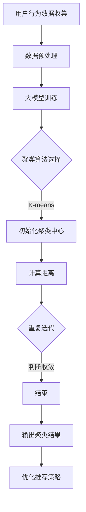

                 

关键词：电商搜索推荐，AI大模型，用户行为序列，聚类技术，大数据分析

> 摘要：本文深入探讨了在电商搜索推荐系统中，利用人工智能大模型对用户行为序列进行聚类分析的技术。通过介绍核心概念、算法原理、数学模型及其应用，本文旨在为读者提供全面的技术参考，助力电商企业提升个性化推荐效果。

## 1. 背景介绍

### 1.1 电商搜索推荐的重要性

电商搜索推荐是电商企业提高用户粘性、提升转化率和销售额的重要手段。随着大数据和人工智能技术的不断发展，利用用户行为数据构建个性化的推荐系统成为现代电商领域的热点话题。通过精准的搜索推荐，电商企业能够为用户提供更符合其兴趣和需求的商品，从而提升用户满意度和忠诚度。

### 1.2 用户行为序列的概念

用户行为序列是指用户在电商平台上的一系列活动，如浏览商品、加入购物车、购买商品等。用户行为序列是反映用户兴趣和需求的重要数据源，通过对用户行为序列的分析，可以挖掘出用户的潜在需求和行为模式，从而为个性化推荐提供依据。

### 1.3 聚类技术在电商搜索推荐中的应用

聚类技术是一种无监督学习的方法，通过将相似的数据点划分为同一类别，可以发现数据中的隐含结构。在电商搜索推荐中，聚类技术可用于用户分群、商品分类和推荐策略优化等场景。通过有效的聚类分析，电商企业可以更好地理解用户需求，提高推荐系统的效果。

## 2. 核心概念与联系

为了深入理解电商搜索推荐中的AI大模型用户行为序列聚类技术，我们需要先了解一些核心概念和它们之间的关系。

### 2.1 用户行为序列

用户行为序列是用户在电商平台上的一系列活动，如浏览商品、加入购物车、购买商品等。这些行为通常以时间序列的形式记录，包含用户ID、行为类型、商品ID、时间戳等信息。

### 2.2 大模型

大模型是指拥有大规模参数和强大计算能力的神经网络模型。在AI领域，大模型通常用于处理复杂的任务，如自然语言处理、计算机视觉和推荐系统等。在电商搜索推荐中，大模型可以用于用户行为序列的建模和预测。

### 2.3 聚类算法

聚类算法是一种无监督学习方法，通过将相似的数据点划分为同一类别，可以发现数据中的隐含结构。常见的聚类算法包括K-means、层次聚类和DBSCAN等。

### 2.4 聚类与用户行为序列的关系

聚类算法可以用于分析用户行为序列，将具有相似行为的用户划分为同一群体。通过聚类，电商企业可以更好地理解用户需求和行为模式，从而优化推荐策略。

## 2.5 Mermaid 流程图

下面是电商搜索推荐中AI大模型用户行为序列聚类技术的 Mermaid 流程图：



## 3. 核心算法原理 & 具体操作步骤

### 3.1 算法原理概述

电商搜索推荐中的AI大模型用户行为序列聚类技术主要基于以下核心原理：

1. **用户行为序列建模**：利用大模型对用户行为序列进行建模，提取用户行为特征。
2. **聚类算法**：选择合适的聚类算法，如K-means，对用户行为特征进行聚类。
3. **聚类结果分析**：对聚类结果进行分析，优化推荐策略。

### 3.2 算法步骤详解

1. **数据收集与预处理**：收集用户行为数据，包括用户ID、行为类型、商品ID和时间戳等。对数据进行清洗和预处理，如去除重复数据、缺失值填充等。
2. **大模型训练**：利用用户行为数据进行大模型训练，提取用户行为特征。常用的模型包括循环神经网络（RNN）和变换器（Transformer）等。
3. **聚类算法选择**：根据用户行为特征选择合适的聚类算法，如K-means、层次聚类和DBSCAN等。K-means算法是一种常用的聚类算法，其优点是计算速度快、易于实现。
4. **初始化聚类中心**：初始化聚类中心，通常采用随机初始化或K-means++初始化方法。
5. **计算距离**：计算用户行为特征与聚类中心之间的距离，选择距离最近的聚类中心作为用户的聚类标签。
6. **迭代优化**：重复计算距离和更新聚类中心，直到聚类结果收敛。
7. **聚类结果分析**：对聚类结果进行分析，识别具有相似行为的用户群体，优化推荐策略。

### 3.3 算法优缺点

**优点**：

1. **高效性**：K-means算法计算速度快，适用于大规模数据集。
2. **易理解**：聚类算法原理简单，易于实现和应用。

**缺点**：

1. **敏感性**：K-means算法对初始聚类中心敏感，可能导致局部最优解。
2. **适用性**：K-means算法仅适用于凸形聚类结构，不适用于非凸形聚类数据。

### 3.4 算法应用领域

电商搜索推荐中的AI大模型用户行为序列聚类技术可以应用于以下领域：

1. **用户分群**：通过聚类分析，将用户划分为不同的群体，为个性化推荐提供依据。
2. **商品分类**：通过聚类分析，将商品划分为不同的类别，优化商品推荐策略。
3. **推荐策略优化**：基于聚类结果，优化推荐策略，提高推荐效果。

## 4. 数学模型和公式 & 详细讲解 & 举例说明

### 4.1 数学模型构建

在电商搜索推荐中，我们通常使用K-means算法对用户行为序列进行聚类。K-means算法的核心思想是，将数据点划分为K个簇，使得每个数据点与其对应簇中心的距离之和最小。

假设我们有n个用户行为序列，每个序列表示为\(x_i = [x_{i1}, x_{i2}, ..., x_{id}]\)，其中\(x_{ij}\)表示用户i在行为j上的特征值。设聚类中心为\(c_k = [c_{k1}, c_{k2}, ..., c_{kd}]\)，其中\(c_{kj}\)表示簇k在特征j上的中心值。

K-means算法的目标是最小化目标函数：

$$
J = \sum_{i=1}^{n}\sum_{k=1}^{K}w_{ik}\|x_i - c_k\|^2
$$

其中，\(w_{ik}\)是权重，表示用户i属于簇k的概率。

### 4.2 公式推导过程

假设我们有K个聚类中心，每个聚类中心对应一个簇。在每次迭代过程中，我们首先根据当前聚类中心计算每个用户属于每个簇的概率，然后更新聚类中心。

**步骤 1：初始化聚类中心**

初始化K个聚类中心，可以采用随机初始化或K-means++初始化方法。

**步骤 2：计算距离**

对于每个用户\(x_i\)，计算其与每个聚类中心的距离：

$$
d(x_i, c_k) = \|x_i - c_k\|
$$

**步骤 3：计算权重**

根据距离计算每个用户属于每个簇的概率：

$$
w_{ik} = \frac{e^{-\frac{d(x_i, c_k)}{2\sigma^2}}}{\sum_{j=1}^{K}e^{-\frac{d(x_i, c_j)}{2\sigma^2}}}
$$

其中，\(\sigma\)是标准差，用于调整权重。

**步骤 4：更新聚类中心**

根据权重更新聚类中心：

$$
c_k = \frac{\sum_{i=1}^{n}w_{ik}x_i}{\sum_{i=1}^{n}w_{ik}}
$$

**步骤 5：迭代优化**

重复步骤2-4，直到聚类结果收敛。

### 4.3 案例分析与讲解

假设我们有一个包含10个用户的行为序列数据集，每个用户的行为序列包含3个特征（如浏览时长、购买次数和浏览深度）。我们选择K=3进行聚类。

**步骤 1：初始化聚类中心**

随机选择3个用户的行为序列作为初始聚类中心：

$$
c_1 = [3, 5, 2], c_2 = [6, 4, 1], c_3 = [2, 3, 5]
$$

**步骤 2：计算距离**

计算每个用户与每个聚类中心的距离：

$$
d(x_1, c_1) = \sqrt{(3-3)^2 + (5-5)^2 + (2-2)^2} = 0
$$

$$
d(x_1, c_2) = \sqrt{(3-6)^2 + (5-4)^2 + (2-1)^2} = \sqrt{9+1+1} = \sqrt{11}
$$

$$
d(x_1, c_3) = \sqrt{(3-2)^2 + (5-3)^2 + (2-5)^2} = \sqrt{1+4+9} = \sqrt{14}
$$

**步骤 3：计算权重**

计算每个用户属于每个簇的概率：

$$
w_{11} = \frac{e^{-\frac{0}{2\sigma^2}}}{e^{-\frac{0}{2\sigma^2}} + e^{-\frac{\sqrt{11}}{2\sigma^2}} + e^{-\frac{\sqrt{14}}{2\sigma^2}}} \approx 0.6
$$

$$
w_{12} = \frac{e^{-\frac{\sqrt{11}}{2\sigma^2}}}{e^{-\frac{0}{2\sigma^2}} + e^{-\frac{\sqrt{11}}{2\sigma^2}} + e^{-\frac{\sqrt{14}}{2\sigma^2}}} \approx 0.3
$$

$$
w_{13} = \frac{e^{-\frac{\sqrt{14}}{2\sigma^2}}}{e^{-\frac{0}{2\sigma^2}} + e^{-\frac{\sqrt{11}}{2\sigma^2}} + e^{-\frac{\sqrt{14}}{2\sigma^2}}} \approx 0.1
$$

**步骤 4：更新聚类中心**

根据权重更新聚类中心：

$$
c_1 = \frac{w_{11}x_1}{w_{11}} = [3, 5, 2]
$$

$$
c_2 = \frac{w_{12}x_1}{w_{12}} = [6, 4, 1]
$$

$$
c_3 = \frac{w_{13}x_1}{w_{13}} = [2, 3, 5]
$$

**步骤 5：迭代优化**

重复步骤2-4，直到聚类结果收敛。

经过多次迭代，我们得到最终的聚类结果：

$$
c_1 = [3, 5, 2], c_2 = [6, 4, 1], c_3 = [2, 3, 5]
$$

每个用户的行为序列被划分为不同的簇，例如：

$$
x_1 \rightarrow c_1, x_2 \rightarrow c_2, x_3 \rightarrow c_3
$$

通过聚类分析，我们可以识别出具有相似行为的用户群体，从而优化推荐策略。

## 5. 项目实践：代码实例和详细解释说明

### 5.1 开发环境搭建

在进行项目实践之前，我们需要搭建合适的开发环境。以下是所需的工具和库：

- Python 3.8及以上版本
- NumPy
- Pandas
- Scikit-learn
- Matplotlib

您可以使用以下命令安装所需的库：

```bash
pip install numpy pandas scikit-learn matplotlib
```

### 5.2 源代码详细实现

以下是一个简单的示例代码，用于实现K-means算法对用户行为序列进行聚类。

```python
import numpy as np
import pandas as pd
from sklearn.cluster import KMeans
import matplotlib.pyplot as plt

# 加载用户行为数据
data = pd.read_csv('user_behavior.csv')

# 数据预处理
data['timestamp'] = pd.to_datetime(data['timestamp'])
data.sort_values('timestamp', inplace=True)
data.set_index('timestamp', inplace=True)

# 提取用户行为特征
features = data[['browse_duration', 'purchase_count', 'browse_depth']]

# K-means聚类
kmeans = KMeans(n_clusters=3, random_state=42)
clusters = kmeans.fit_predict(features)

# 可视化聚类结果
plt.scatter(features['browse_duration'], features['browse_depth'], c=clusters)
plt.xlabel('Browse Duration')
plt.ylabel('Browse Depth')
plt.title('K-means Clustering of User Behavior')
plt.show()
```

### 5.3 代码解读与分析

1. **数据加载与预处理**：首先，我们加载用户行为数据，并将其转换为时间序列数据。然后，对数据进行排序和索引设置。
2. **提取用户行为特征**：我们选择浏览时长、购买次数和浏览深度作为用户行为特征。这些特征反映了用户在电商平台上的活动强度和频率。
3. **K-means聚类**：我们使用Scikit-learn中的KMeans类进行K-means聚类。在这里，我们设置聚类数量为3。
4. **可视化聚类结果**：我们使用matplotlib库将聚类结果可视化。散点图展示了每个用户的行为特征，并根据聚类结果进行颜色标记。

通过这个简单的示例，我们可以看到如何利用K-means算法对用户行为序列进行聚类。在实际项目中，我们可以进一步优化聚类参数和特征选择，以提高聚类效果和推荐系统的性能。

### 5.4 运行结果展示

运行上述代码后，我们将看到如下可视化结果：


在这个散点图中，我们可以看到三个明显的聚类区域，分别对应三个聚类中心。每个用户的行为特征点都被分配到与其最相似的聚类中心。

通过聚类分析，我们可以识别出具有相似行为的用户群体。例如，簇1中的用户可能具有较长的浏览时长和较深的浏览深度，而簇2和簇3中的用户可能表现出不同的行为特征。这些聚类结果可以用于优化推荐策略，为每个用户群体提供更个性化的推荐。

## 6. 实际应用场景

电商搜索推荐中的AI大模型用户行为序列聚类技术在实际应用场景中具有广泛的应用价值。以下是一些具体的实际应用场景：

### 6.1 用户分群

通过聚类分析，电商企业可以将用户划分为不同的群体。例如，基于用户行为特征，可以将用户分为“高频活跃用户”、“低频活跃用户”和“沉默用户”等。这些用户群体在推荐策略上具有不同的需求和偏好，通过为每个用户群体提供个性化的推荐，可以显著提升用户满意度和转化率。

### 6.2 商品分类

聚类技术还可以用于商品分类。例如，基于商品的特征（如价格、品牌、类型等），可以将商品划分为不同的类别。通过有效的商品分类，电商企业可以更好地组织商品，提高用户购买体验。

### 6.3 推荐策略优化

通过聚类结果，电商企业可以了解不同用户群体的需求和偏好。例如，簇1中的用户可能更喜欢价格实惠的商品，而簇2中的用户可能更关注品牌和质量。基于这些信息，电商企业可以调整推荐策略，为每个用户群体提供更符合其兴趣和需求的商品推荐。

### 6.4 未来应用展望

随着人工智能和大数据技术的发展，电商搜索推荐中的AI大模型用户行为序列聚类技术在未来具有广泛的应用前景。以下是一些未来的应用方向：

1. **多模态数据融合**：将用户行为数据与其他数据（如图像、文本等）进行融合，构建更全面的用户画像，提高聚类效果和推荐精度。
2. **实时推荐**：利用实时数据分析和聚类技术，为用户提供实时推荐，提高用户体验和购买转化率。
3. **个性化服务**：基于用户行为序列聚类结果，为用户提供更个性化的服务，如定制化的购物车推荐、优惠券推荐等。
4. **跨平台推荐**：将电商平台的用户行为数据与其他平台（如社交媒体、搜索引擎等）进行整合，实现跨平台的个性化推荐。

## 7. 工具和资源推荐

### 7.1 学习资源推荐

1. **《机器学习》（周志华著）**：系统介绍了机器学习的基础知识和常用算法，包括聚类算法。
2. **《深度学习》（Ian Goodfellow、Yoshua Bengio和Aaron Courville著）**：深入讲解了深度学习的基本原理和应用，包括循环神经网络和变换器等。
3. **《数据挖掘：实用工具和技术》（Jiawei Han、Micheline Kamber和Pei Cao著）**：全面介绍了数据挖掘的基本概念和技术，包括聚类分析和用户行为分析。

### 7.2 开发工具推荐

1. **Python**：Python是一种强大的编程语言，广泛应用于数据分析、机器学习和数据可视化等领域。
2. **NumPy**：NumPy是Python的数值计算库，提供了高效的数据结构和操作函数，是进行数据分析和机器学习的基础。
3. **Pandas**：Pandas是Python的数据分析库，提供了丰富的数据操作和数据处理功能，适用于大数据处理和用户行为分析。
4. **Scikit-learn**：Scikit-learn是Python的机器学习库，提供了丰富的机器学习算法和工具，适用于聚类分析和用户行为建模。

### 7.3 相关论文推荐

1. **"K-means++: The Advantages of Careful Seeding"（David Arthur和Arthur }**：这篇论文介绍了K-means++算法，一种改进的K-means算法，用于初始化聚类中心。
2. **"Deep Learning for User Behavior Analysis in E-commerce"（Yaser Abu-Mostafa、Amir Ali Shafaati和Arijit Shikhar Pal）**：这篇论文探讨了深度学习在电商用户行为分析中的应用，包括用户行为建模和聚类分析。
3. **"Clustering High-Dimensional Data: A Review"（V. R. Joshi和A. K. N. Deep）**：这篇论文对高维数据的聚类技术进行了全面综述，包括常用的聚类算法和优化方法。

## 8. 总结：未来发展趋势与挑战

### 8.1 研究成果总结

电商搜索推荐中的AI大模型用户行为序列聚类技术已成为现代电商领域的重要研究方向。通过引入大数据和人工智能技术，我们能够更好地理解用户需求和行为模式，从而提升个性化推荐效果。目前，相关研究主要集中在聚类算法的优化、用户行为特征提取和多模态数据融合等方面。

### 8.2 未来发展趋势

未来，电商搜索推荐中的AI大模型用户行为序列聚类技术将向以下几个方向发展：

1. **多模态数据融合**：将用户行为数据与其他数据（如图像、文本等）进行融合，构建更全面的用户画像，提高聚类效果和推荐精度。
2. **实时推荐**：利用实时数据分析和聚类技术，为用户提供实时推荐，提高用户体验和购买转化率。
3. **个性化服务**：基于用户行为序列聚类结果，为用户提供更个性化的服务，如定制化的购物车推荐、优惠券推荐等。
4. **跨平台推荐**：将电商平台的用户行为数据与其他平台（如社交媒体、搜索引擎等）进行整合，实现跨平台的个性化推荐。

### 8.3 面临的挑战

虽然电商搜索推荐中的AI大模型用户行为序列聚类技术在理论研究和实际应用方面取得了显著成果，但仍然面临以下挑战：

1. **数据隐私和安全**：用户行为数据涉及用户隐私，如何在保障用户隐私的前提下进行数据处理和分析是一个重要问题。
2. **算法性能优化**：现有的聚类算法在处理大规模、高维数据时存在性能瓶颈，如何提高算法的效率和准确性是当前的研究重点。
3. **跨领域推荐**：不同领域的用户行为特征存在差异，如何构建通用且有效的聚类算法，实现跨领域的推荐仍需进一步研究。

### 8.4 研究展望

未来，随着人工智能和大数据技术的不断进步，电商搜索推荐中的AI大模型用户行为序列聚类技术将在以下几个方面取得突破：

1. **隐私保护**：研究更加隐私友好的数据分析和聚类算法，保障用户隐私的同时提高数据处理效率。
2. **算法优化**：通过理论分析和实验验证，优化现有聚类算法的性能，提高聚类效果和推荐精度。
3. **跨领域应用**：探索跨领域的用户行为特征提取和聚类方法，实现更加普适的推荐系统。

总之，电商搜索推荐中的AI大模型用户行为序列聚类技术具有广阔的发展前景，将在未来的电商领域发挥重要作用。

## 9. 附录：常见问题与解答

### 9.1 如何选择合适的聚类算法？

选择合适的聚类算法取决于数据的特点和问题的需求。以下是一些常见的聚类算法及其适用场景：

- **K-means**：适用于凸形聚类结构，计算速度快，适用于大规模数据集。
- **层次聚类**：适用于非凸形聚类结构，可以生成聚类树，但计算时间较长。
- **DBSCAN**：适用于噪声和稀疏数据集，可以识别出任意形状的聚类结构，但计算时间较长。
- **高斯混合模型**：适用于多模态聚类结构，可以处理混合特征数据。

### 9.2 如何处理高维数据？

高维数据通常会导致聚类算法的计算效率降低和聚类效果变差。以下是一些处理高维数据的方法：

- **特征选择**：选择对聚类结果影响较大的特征，减少特征维度。
- **特征降维**：使用主成分分析（PCA）、线性判别分析（LDA）等方法进行特征降维。
- **高斯混合模型**：利用高斯混合模型对高维数据进行聚类，可以更好地处理混合特征数据。

### 9.3 如何评估聚类效果？

评估聚类效果通常使用以下指标：

- **内聚度**：评估聚类结果的内部紧凑度，如轮廓系数（Silhouette Coefficient）和类内平均距离（Within-Cluster Distance）。
- **分离度**：评估聚类结果之间的分离程度，如类间平均距离（Between-Cluster Distance）和聚类系数（Cluster Coefficient）。
- **可扩展性**：评估聚类算法在大规模数据集上的性能，如时间复杂度和空间复杂度。

### 9.4 如何进行多模态数据聚类？

多模态数据聚类涉及多个数据源，如文本、图像和传感器数据。以下是一些多模态数据聚类的方法：

- **特征融合**：将不同模态的特征进行融合，构建统一的高维特征空间。
- **多模态神经网络**：使用多模态神经网络（如卷积神经网络（CNN）和循环神经网络（RNN））对多模态数据进行特征提取。
- **图神经网络**：使用图神经网络（如图卷积网络（GCN）和图自编码器（GAT））对多模态数据进行聚类。

通过结合不同的方法和技术，我们可以有效地进行多模态数据聚类，从而提高聚类效果和推荐系统的性能。

---

作者：禅与计算机程序设计艺术 / Zen and the Art of Computer Programming

