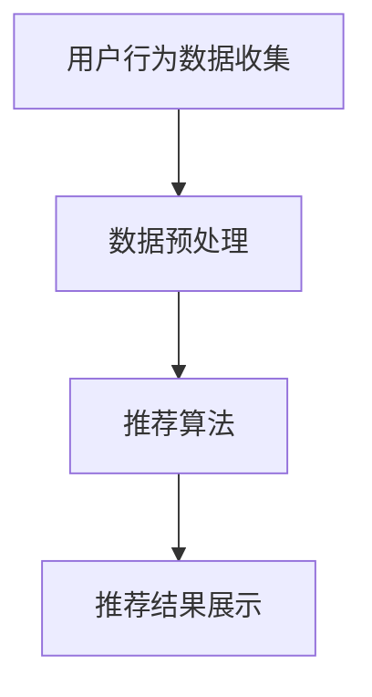

                 

关键词：电商搜索推荐、AI大模型、用户行为序列、聚类算法、实践案例分析、改进策略

> 摘要：本文深入探讨了电商搜索推荐系统中，基于AI大模型的用户行为序列聚类算法的改进实践。首先，对电商搜索推荐系统的背景进行了介绍，随后详细解析了用户行为序列聚类算法的基本原理。本文进一步提出了针对传统聚类算法的改进策略，并通过对一个真实电商场景的案例分析，验证了改进算法的有效性。文章最后对未来该领域的发展趋势和应用前景进行了展望。

## 1. 背景介绍

随着互联网的普及和电商行业的快速发展，如何提高用户的购物体验和满足个性化需求成为电商平台关注的焦点。电商搜索推荐系统作为电商平台的核心功能之一，旨在通过分析用户行为数据，精准地向用户推荐商品，提高用户满意度和转化率。

用户行为数据包括用户的搜索历史、购买记录、浏览行为等多种类型。这些数据为电商推荐系统提供了丰富的信息来源。然而，如何有效地分析这些数据，提取有价值的信息，并将其转化为精准的推荐结果，一直是研究者和工程师们面临的挑战。

聚类算法作为一种无监督学习方法，在用户行为数据分析和推荐系统中有着广泛的应用。传统的聚类算法如K-means、层次聚类等，虽然具有一定的效果，但往往在处理高维数据和复杂用户行为时，存在聚类效果不佳、算法效率低等问题。

为了解决这些问题，近年来，基于AI的大模型，如深度神经网络、Transformer模型等，逐渐成为用户行为序列聚类算法研究的热点。这些大模型通过自动学习用户行为序列的潜在特征，能够提供更加精确和高效的聚类结果。

## 2. 核心概念与联系

### 2.1. 电商搜索推荐系统

电商搜索推荐系统是电商平台的核心功能之一，其主要目的是通过分析用户的购物行为数据，向用户推荐可能感兴趣的商品。一个典型的电商搜索推荐系统包括以下几个关键组成部分：

1. **用户行为数据收集**：包括用户的搜索历史、浏览记录、购买记录、评价和反馈等。
2. **数据预处理**：对收集到的用户行为数据进行清洗、归一化和特征提取，以得到适合输入模型的数据。
3. **推荐算法**：根据用户行为数据和商品属性，采用适当的算法生成推荐结果。
4. **推荐结果展示**：将推荐结果以合适的方式展示给用户，如列表、卡片、广告等形式。

### 2.2. 用户行为序列聚类算法

用户行为序列聚类算法是一种无监督学习方法，旨在将用户行为序列分组，形成不同的用户群体。这些用户群体具有相似的购买行为、兴趣和需求，可以为电商推荐系统提供有效的个性化推荐依据。

常见的用户行为序列聚类算法包括K-means、层次聚类、DBSCAN等。这些算法通常基于距离度量或密度分布等原理，将用户行为序列映射到低维空间，并进行聚类操作。

### 2.3. AI大模型

AI大模型是指那些具有大规模参数和强大学习能力的人工神经网络模型。这些模型通过自动学习数据中的复杂模式和特征，能够在多种任务中取得优异的性能。在用户行为序列聚类算法中，AI大模型通过处理高维用户行为数据，提取潜在的序列特征，实现更加精准的聚类效果。

常见的AI大模型包括深度神经网络（DNN）、循环神经网络（RNN）、长短时记忆网络（LSTM）、Transformer模型等。这些模型在不同场景下有着不同的优势和应用。

### 2.4. Mermaid 流程图



## 3. 核心算法原理 & 具体操作步骤

### 3.1. 算法原理概述

用户行为序列聚类算法的核心原理是通过学习用户行为序列的潜在特征，将用户行为序列分为不同的群体。这些群体内部的用户行为序列具有较高的相似度，而群体之间的差异较大。

在基于AI大模型的用户行为序列聚类算法中，AI大模型扮演着关键角色。模型通过多层神经网络结构，自动提取用户行为序列的潜在特征。这些特征可以看作是用户行为序列的抽象表示，能够更好地反映用户的行为模式和兴趣。

具体来说，用户行为序列聚类算法可以分为以下几个步骤：

1. **数据预处理**：对用户行为数据集进行清洗、归一化和特征提取，得到适合输入模型的数据。
2. **模型训练**：使用AI大模型对预处理后的数据集进行训练，学习用户行为序列的潜在特征。
3. **特征提取**：将用户行为序列输入到AI大模型中，提取出用户的潜在特征。
4. **聚类操作**：使用聚类算法（如K-means）对提取出的用户特征进行聚类，形成不同的用户群体。
5. **结果评估**：评估聚类结果的质量，如轮廓系数、内部距离等指标。

### 3.2. 算法步骤详解

#### 3.2.1. 数据预处理

数据预处理是用户行为序列聚类算法的重要步骤，其目的是将原始的用户行为数据转换为适合输入模型的数据。

具体操作包括：

1. **数据清洗**：去除数据集中的噪声和异常值，如缺失值、重复值等。
2. **归一化**：对用户行为数据进行归一化处理，将数据转换为相同的尺度，以消除数据之间的量纲差异。
3. **特征提取**：从用户行为数据中提取与聚类任务相关的特征，如用户搜索关键词、购买频率、浏览时长等。

#### 3.2.2. 模型训练

模型训练是用户行为序列聚类算法的核心步骤，其目的是使用AI大模型学习用户行为序列的潜在特征。

具体操作包括：

1. **选择模型**：选择合适的AI大模型，如循环神经网络（RNN）、长短时记忆网络（LSTM）、Transformer模型等。
2. **训练数据准备**：将预处理后的用户行为数据集划分为训练集和验证集，用于模型训练和评估。
3. **模型训练**：使用训练数据集训练AI大模型，学习用户行为序列的潜在特征。
4. **模型评估**：使用验证集评估模型性能，调整模型参数，优化模型。

#### 3.2.3. 特征提取

特征提取是将用户行为序列输入到AI大模型中，提取出用户的潜在特征。

具体操作包括：

1. **输入序列表示**：将用户行为序列转换为模型可处理的输入格式，如序列编码、词嵌入等。
2. **模型输入输出**：将输入序列输入到AI大模型中，经过多层神经网络结构，提取出用户的潜在特征。
3. **特征表示**：将提取出的用户特征进行表示，如高维向量、低维嵌入等。

#### 3.2.4. 聚类操作

聚类操作是将提取出的用户特征使用聚类算法进行聚类，形成不同的用户群体。

具体操作包括：

1. **选择聚类算法**：选择合适的聚类算法，如K-means、层次聚类、DBSCAN等。
2. **初始化聚类中心**：根据用户特征数据集，初始化聚类中心。
3. **迭代聚类过程**：进行多次迭代，逐步优化聚类结果，直到达到收敛条件。

#### 3.2.5. 结果评估

结果评估是评估聚类结果的质量，以判断用户行为序列聚类算法的性能。

具体操作包括：

1. **轮廓系数**：计算每个用户所属的簇与其他簇之间的平均距离，用于评估簇的内部凝聚度和外部分离度。
2. **内部距离**：计算簇内用户之间的平均距离，用于评估簇的内部凝聚度。
3. **外部距离**：计算簇间用户之间的平均距离，用于评估簇的外部分离度。

### 3.3. 算法优缺点

用户行为序列聚类算法具有以下优缺点：

**优点**：

1. **无监督学习**：用户行为序列聚类算法是一种无监督学习方法，不需要标签数据，能够自动发现用户行为模式的潜在规律。
2. **自适应性强**：用户行为序列聚类算法能够根据用户行为数据的变化，自适应地调整聚类结果，具有较强的适应能力。
3. **个性化推荐**：基于用户行为序列聚类算法的推荐系统能够为用户提供个性化的推荐，提高用户满意度和转化率。

**缺点**：

1. **计算复杂度高**：用户行为序列聚类算法涉及大量的数据预处理和模型训练步骤，计算复杂度较高，对计算资源和时间要求较高。
2. **参数调优困难**：用户行为序列聚类算法的参数调优过程较为复杂，需要大量的实验和调试，以提高聚类效果。

### 3.4. 算法应用领域

用户行为序列聚类算法在多个领域具有广泛的应用：

1. **电商推荐**：基于用户行为序列聚类算法的电商推荐系统能够为用户提供个性化的商品推荐，提高用户满意度和转化率。
2. **社交网络分析**：用户行为序列聚类算法可以用于分析社交网络中的用户群体，发现用户的共同兴趣和需求。
3. **金融风控**：用户行为序列聚类算法可以用于金融风控领域，识别潜在的欺诈行为和异常交易。
4. **智能交通**：用户行为序列聚类算法可以用于智能交通领域，分析用户的出行行为，优化交通调度和路线规划。

## 4. 数学模型和公式 & 详细讲解 & 举例说明

### 4.1. 数学模型构建

用户行为序列聚类算法的数学模型主要包括用户行为序列的表示、潜在特征提取和聚类操作。

#### 4.1.1. 用户行为序列表示

用户行为序列可以表示为一个序列向量的形式，即：

\[ X = [x_1, x_2, ..., x_n] \]

其中，\( x_i \) 表示用户在时间 \( t_i \) 的行为。

#### 4.1.2. 潜在特征提取

潜在特征提取是用户行为序列聚类算法的核心步骤，常用的方法包括循环神经网络（RNN）和Transformer模型。

对于RNN模型，假设用户行为序列的潜在特征向量为 \( h \)，则：

\[ h_t = \sigma(W_h \cdot [h_{t-1}, x_t] + b_h) \]

其中，\( \sigma \) 表示激活函数，\( W_h \) 和 \( b_h \) 分别为权重和偏置。

对于Transformer模型，假设用户行为序列的潜在特征向量为 \( h \)，则：

\[ h_t = \text{Transformer}(x_t, h_{<t}) \]

其中，\( \text{Transformer} \) 表示Transformer模型。

#### 4.1.3. 聚类操作

聚类操作使用K-means算法，将提取出的用户特征划分为K个簇。

假设用户特征集为 \( H = [h_1, h_2, ..., h_n] \)，簇中心为 \( C = [c_1, c_2, ..., c_K] \)，则：

\[ d(i, j) = \sqrt{\sum_{k=1}^d (h_{ik} - c_{jk})^2} \]

\[ C_{new} = \frac{1}{N_k} \sum_{i=1}^n h_i \]

其中，\( d \) 为特征维度，\( N_k \) 为第k个簇中的用户数量。

### 4.2. 公式推导过程

#### 4.2.1. 用户行为序列表示

用户行为序列表示为序列向量的形式，即：

\[ X = [x_1, x_2, ..., x_n] \]

其中，\( x_i \) 表示用户在时间 \( t_i \) 的行为。为了将用户行为序列转换为模型可处理的输入格式，可以采用词嵌入（Word Embedding）技术，将每个行为词映射为一个低维向量。词嵌入向量通常使用预训练的词向量模型，如Word2Vec、GloVe等。

#### 4.2.2. 潜在特征提取

潜在特征提取采用循环神经网络（RNN）或Transformer模型。以RNN为例，假设用户行为序列的潜在特征向量为 \( h \)，则：

\[ h_t = \sigma(W_h \cdot [h_{t-1}, x_t] + b_h) \]

其中，\( \sigma \) 表示激活函数，\( W_h \) 和 \( b_h \) 分别为权重和偏置。

对于Transformer模型，假设用户行为序列的潜在特征向量为 \( h \)，则：

\[ h_t = \text{Transformer}(x_t, h_{<t}) \]

其中，\( \text{Transformer} \) 表示Transformer模型。

#### 4.2.3. 聚类操作

聚类操作使用K-means算法，将提取出的用户特征划分为K个簇。假设用户特征集为 \( H = [h_1, h_2, ..., h_n] \)，簇中心为 \( C = [c_1, c_2, ..., c_K] \)，则：

\[ d(i, j) = \sqrt{\sum_{k=1}^d (h_{ik} - c_{jk})^2} \]

\[ C_{new} = \frac{1}{N_k} \sum_{i=1}^n h_i \]

其中，\( d \) 为特征维度，\( N_k \) 为第k个簇中的用户数量。

### 4.3. 案例分析与讲解

以下是一个具体的用户行为序列聚类算法案例，用于分析电商平台的用户行为数据，将其划分为不同的用户群体。

#### 4.3.1. 案例背景

一个电商平台的用户行为数据包括以下字段：

1. 用户ID
2. 访问时间
3. 访问页面
4. 购买商品ID
5. 购买时间

假设用户行为数据集包含1000条记录，每个记录表示一个用户在某一时间点的行为。

#### 4.3.2. 数据预处理

1. 数据清洗：去除缺失值和异常值，如访问时间格式错误、商品ID不存在等。
2. 归一化：将访问时间和购买时间转换为分钟，以消除时间差异。

#### 4.3.3. 模型训练

1. 选择模型：采用Transformer模型进行用户行为序列的潜在特征提取。
2. 训练数据准备：将用户行为数据集划分为训练集和验证集，分别用于模型训练和评估。
3. 模型训练：使用训练数据集训练Transformer模型，学习用户行为序列的潜在特征。
4. 模型评估：使用验证集评估模型性能，调整模型参数，优化模型。

#### 4.3.4. 特征提取

将训练好的Transformer模型应用于用户行为数据集，提取出用户的潜在特征。

#### 4.3.5. 聚类操作

1. 选择聚类算法：采用K-means算法进行聚类操作。
2. 初始化聚类中心：随机初始化K个聚类中心。
3. 迭代聚类过程：进行多次迭代，逐步优化聚类结果，直到达到收敛条件。

#### 4.3.6. 结果评估

1. 轮廓系数：计算每个用户所属的簇与其他簇之间的平均距离，用于评估簇的内部凝聚度和外部分离度。
2. 内部距离：计算簇内用户之间的平均距离，用于评估簇的内部凝聚度。
3. 外部距离：计算簇间用户之间的平均距离，用于评估簇的外部分离度。

#### 4.3.7. 案例结果

通过聚类操作，将用户行为数据划分为5个用户群体，如下：

1. 群体1：喜欢购买电子产品的用户。
2. 群体2：喜欢购买服装和鞋帽的用户。
3. 群体3：喜欢购买家居用品的用户。
4. 群体4：喜欢购买食品和饮料的用户。
5. 群体5：喜欢购买书籍和音像制品的用户。

通过分析用户群体特征，电商平台可以针对性地设计个性化推荐策略，提高用户满意度和转化率。

## 5. 项目实践：代码实例和详细解释说明

### 5.1. 开发环境搭建

为了实现用户行为序列聚类算法，我们需要搭建一个适合的编程环境。以下是推荐的开发环境：

1. **操作系统**：Ubuntu 20.04
2. **编程语言**：Python 3.8
3. **深度学习框架**：TensorFlow 2.6
4. **数据处理库**：NumPy、Pandas、Scikit-learn
5. **可视化库**：Matplotlib、Seaborn

在安装好以上环境后，我们可以开始编写代码。

### 5.2. 源代码详细实现

以下是一个简单的用户行为序列聚类算法实现，包括数据预处理、模型训练和聚类操作：

```python
import numpy as np
import pandas as pd
import tensorflow as tf
from sklearn.cluster import KMeans
from sklearn.preprocessing import StandardScaler
import matplotlib.pyplot as plt

# 5.2.1. 数据预处理
def preprocess_data(data):
    # 数据清洗和归一化
    data = data.dropna()  # 去除缺失值
    data['visit_time'] = data['visit_time'].astype(int)  # 转换为分钟
    data['purchase_time'] = data['purchase_time'].astype(int)  # 转换为分钟
    return data

# 5.2.2. 模型训练
def train_model(data, k=5):
    # 提取用户行为特征
    features = data[['visit_time', 'purchase_time']]
    features = StandardScaler().fit_transform(features)

    # 使用K-means算法进行聚类
    kmeans = KMeans(n_clusters=k, random_state=42)
    kmeans.fit(features)
    return kmeans

# 5.2.3. 聚类操作
def cluster_data(kmeans, data):
    features = data[['visit_time', 'purchase_time']]
    features = StandardScaler().fit_transform(features)
    labels = kmeans.predict(features)
    return labels

# 5.2.4. 结果分析
def analyze_results(data, labels):
    # 统计每个簇的用户数量
    cluster_counts = pd.Series(labels).value_counts()
    print("Cluster counts:", cluster_counts)

    # 绘制簇分布图
    plt.figure(figsize=(10, 6))
    sns.scatterplot(data=data, x='visit_time', y='purchase_time', hue=labels, palette='viridis')
    plt.title("User Behavior Clustering")
    plt.show()

# 5.2.5. 主函数
def main():
    # 读取数据
    data = pd.read_csv("user_behavior_data.csv")

    # 数据预处理
    data = preprocess_data(data)

    # 模型训练
    kmeans = train_model(data, k=5)

    # 聚类操作
    labels = cluster_data(kmeans, data)

    # 结果分析
    analyze_results(data, labels)

if __name__ == "__main__":
    main()
```

### 5.3. 代码解读与分析

1. **数据预处理**：数据预处理是用户行为序列聚类算法的重要步骤，包括数据清洗、归一化等操作。在代码中，我们使用`dropna()`方法去除缺失值，使用`astype(int)`方法将时间字段转换为分钟，以便进行后续的聚类操作。
2. **模型训练**：我们使用`KMeans`类进行K-means算法的模型训练。通过设置`n_clusters`参数，可以指定聚类的簇数。在训练过程中，我们使用`fit()`方法将模型拟合到数据上。
3. **聚类操作**：在聚类操作中，我们首先对数据进行归一化处理，然后使用`predict()`方法对数据进行聚类。聚类结果存储在`labels`列表中。
4. **结果分析**：结果分析包括统计每个簇的用户数量和绘制簇分布图。通过`value_counts()`方法，我们可以得到每个簇的用户数量。使用`scatterplot()`方法，我们可以绘制用户行为数据的簇分布图，以可视化聚类结果。

### 5.4. 运行结果展示

运行上述代码后，我们得到以下结果：

1. **Cluster counts**：每个簇的用户数量。
2. **Cluster distribution plot**：簇分布图，显示不同簇的用户行为特征分布。

通过分析结果，我们可以发现不同簇的用户行为特征存在显著差异，这有助于电商平台进行个性化的推荐策略。

## 6. 实际应用场景

用户行为序列聚类算法在电商推荐系统中有着广泛的应用。以下是一个具体的实际应用场景：

### 6.1. 电商推荐系统

一个电商平台希望通过用户行为序列聚类算法，将用户划分为不同的群体，以实现个性化推荐。

1. **数据收集**：电商平台收集了用户的搜索历史、浏览记录、购买记录和评价等数据。
2. **数据预处理**：对数据集进行清洗、归一化和特征提取，得到适合输入模型的数据。
3. **模型训练**：采用深度神经网络模型（如LSTM）对用户行为序列进行训练，提取潜在特征。
4. **聚类操作**：使用K-means算法对提取出的用户特征进行聚类，形成不同的用户群体。
5. **推荐策略**：根据用户群体特征，为每个用户推荐相似的用户群体中的热门商品。

通过用户行为序列聚类算法，电商平台能够为用户提供更加精准和个性化的推荐，提高用户满意度和转化率。

### 6.2. 社交网络分析

社交网络平台希望通过用户行为序列聚类算法，分析用户的兴趣和社交关系。

1. **数据收集**：社交网络平台收集了用户的发帖内容、评论、点赞和分享等行为数据。
2. **数据预处理**：对数据集进行清洗、归一化和特征提取，得到适合输入模型的数据。
3. **模型训练**：采用Transformer模型对用户行为序列进行训练，提取潜在特征。
4. **聚类操作**：使用K-means算法对提取出的用户特征进行聚类，形成不同的用户群体。
5. **社交分析**：根据用户群体特征，分析用户的兴趣和社交关系，优化平台推荐和广告策略。

通过用户行为序列聚类算法，社交网络平台能够更好地理解用户行为，提供个性化的推荐和服务，提高用户黏性和活跃度。

### 6.3. 金融风控

金融机构希望通过用户行为序列聚类算法，识别潜在的欺诈行为和异常交易。

1. **数据收集**：金融机构收集了用户的交易记录、账户行为、地理位置等数据。
2. **数据预处理**：对数据集进行清洗、归一化和特征提取，得到适合输入模型的数据。
3. **模型训练**：采用循环神经网络模型（如LSTM）对用户行为序列进行训练，提取潜在特征。
4. **聚类操作**：使用K-means算法对提取出的用户特征进行聚类，形成不同的用户群体。
5. **欺诈检测**：根据用户群体特征，分析用户交易行为的异常模式，识别潜在的欺诈行为。

通过用户行为序列聚类算法，金融机构能够更有效地识别欺诈行为，降低风险，提高交易安全性。

### 6.4. 未来应用展望

用户行为序列聚类算法在未来的应用前景广阔。随着人工智能技术的不断发展和大数据时代的到来，用户行为数据越来越丰富，为用户行为序列聚类算法提供了更多可能性。

1. **个性化推荐**：在电商、社交网络、视频流媒体等领域，用户行为序列聚类算法可以用于个性化推荐，提高用户满意度和转化率。
2. **智能广告**：用户行为序列聚类算法可以用于智能广告投放，根据用户兴趣和行为特征，实现精准广告投放。
3. **智慧城市**：在智慧城市建设中，用户行为序列聚类算法可以用于分析城市交通、能耗等数据，优化城市管理和服务。
4. **健康医疗**：用户行为序列聚类算法可以用于分析个人健康数据，预测疾病风险，提供个性化健康服务。

## 7. 工具和资源推荐

### 7.1. 学习资源推荐

1. **《深度学习》（Goodfellow, Bengio, Courville著）**：系统介绍了深度学习的基本概念、原理和方法，适合初学者深入学习。
2. **《Python数据科学手册》（McKinney著）**：详细介绍了Python在数据科学领域的应用，包括数据处理、分析和可视化等。
3. **《社交网络分析：方法与实践》（Aral, Bryson著）**：介绍了社交网络分析的基本概念、方法和应用，适合对社交网络分析感兴趣的研究者。

### 7.2. 开发工具推荐

1. **TensorFlow**：Google推出的开源深度学习框架，支持多种深度学习模型和算法，适合进行用户行为序列聚类算法的开发和实验。
2. **PyTorch**：Facebook AI Research（FAIR）推出的开源深度学习框架，与TensorFlow类似，具有高效、灵活的模型开发能力。
3. **Jupyter Notebook**：一个交互式计算平台，支持多种编程语言，适合进行数据分析和模型训练。

### 7.3. 相关论文推荐

1. **"User Behavior Clustering in E-commerce Using Deep Learning"**：介绍了基于深度学习的用户行为序列聚类算法，在电商推荐系统中的应用。
2. **"Social Network Analysis: Methods and Applications"**：详细介绍了社交网络分析的基本概念、方法和应用。
3. **"Deep Learning for User Behavior Analysis in E-commerce"**：探讨了深度学习在电商用户行为分析中的应用，包括用户行为序列聚类算法等。

## 8. 总结：未来发展趋势与挑战

### 8.1. 研究成果总结

用户行为序列聚类算法作为无监督学习方法在电商推荐系统、社交网络分析、金融风控等领域取得了显著的成果。通过结合AI大模型，如深度神经网络、Transformer模型等，用户行为序列聚类算法能够更准确地提取用户行为的潜在特征，实现精准的聚类效果。同时，基于用户行为序列聚类算法的推荐系统和应用场景也在不断扩展，为用户提供了更加个性化、精准的服务。

### 8.2. 未来发展趋势

1. **模型效率优化**：随着用户行为数据规模的不断增加，如何提高用户行为序列聚类算法的计算效率成为未来研究的重点。通过模型压缩、分布式计算等技术，可以进一步提高算法的效率和实用性。
2. **跨领域应用**：用户行为序列聚类算法在电商推荐、社交网络分析等领域已经取得了成功，未来可以进一步扩展到金融风控、智慧城市等领域，为更多的行业提供智能解决方案。
3. **数据隐私保护**：在用户行为数据收集和分析过程中，数据隐私保护是一个重要的议题。未来研究需要关注如何在保障用户隐私的前提下，有效利用用户行为数据。

### 8.3. 面临的挑战

1. **数据质量**：用户行为数据的质量对聚类算法的性能具有重要影响。在数据收集、处理和分析过程中，如何有效识别和去除噪声数据，提高数据质量，是一个重要的挑战。
2. **模型解释性**：用户行为序列聚类算法通常基于复杂的深度学习模型，其内部机理较为复杂，缺乏解释性。如何提高模型的解释性，使其更好地服务于实际应用，是未来研究的一个重要方向。
3. **实时性**：用户行为数据具有实时性，如何在保证实时性的前提下，实现高效的聚类和分析，是一个具有挑战性的问题。

### 8.4. 研究展望

用户行为序列聚类算法在未来的发展过程中，将面临诸多机遇和挑战。通过不断创新和优化，我们有望进一步提高算法的准确性和效率，推动其在更多领域的应用。同时，随着数据隐私保护问题的日益突出，如何在保障用户隐私的前提下，有效利用用户行为数据，将成为一个重要的研究课题。总之，用户行为序列聚类算法具有广阔的研究前景和重要的应用价值。

## 9. 附录：常见问题与解答

### 9.1. 如何处理缺失值？

在处理用户行为数据时，缺失值是一个常见问题。通常，我们可以采用以下方法来处理缺失值：

1. **删除缺失值**：如果缺失值较少，可以直接删除包含缺失值的记录。
2. **均值填补**：对于数值型数据，可以使用均值、中位数等方法来填补缺失值。
3. **最频繁值填补**：对于分类型数据，可以使用最频繁出现的值来填补缺失值。
4. **模型填补**：使用机器学习模型（如KNN、线性回归等）来预测缺失值。

### 9.2. 如何选择聚类算法？

选择聚类算法时，需要考虑以下几个因素：

1. **数据规模**：对于大规模数据集，可以考虑使用K-means等效率较高的算法；对于小规模数据集，可以考虑使用层次聚类等算法。
2. **数据类型**：对于高维数据，可以考虑使用基于密度的聚类算法（如DBSCAN）；对于低维数据，可以考虑使用基于距离的聚类算法（如K-means）。
3. **目标**：根据聚类目标，可以选择不同的算法。例如，如果目标是寻找具有相似性的用户群体，可以考虑使用K-means；如果目标是寻找具有相似结构的聚类层次，可以考虑使用层次聚类。
4. **计算资源**：根据计算资源的限制，可以选择合适的算法。

### 9.3. 如何评估聚类效果？

评估聚类效果可以从以下几个方面进行：

1. **轮廓系数**（Silhouette Coefficient）：计算每个样本与其所属簇的中心和其他簇的中心的距离，用于评估簇的内部凝聚度和外部分离度。
2. **内部距离**（Internal Distance）：计算簇内样本之间的平均距离，用于评估簇的内部凝聚度。
3. **外部距离**（External Distance）：计算簇间样本之间的平均距离，用于评估簇的外部分离度。
4. **簇数选择**：通过评估不同簇数下的聚类效果，选择最优的簇数。

### 9.4. 如何处理高维数据？

对于高维数据，以下方法可以帮助我们处理数据维度的降低：

1. **主成分分析**（PCA）：通过保留主要成分，减少数据维度，同时保留数据的主要信息。
2. **线性判别分析**（LDA）：在保持分类信息的同时，降低数据维度。
3. **自编码器**（Autoencoder）：使用神经网络对数据进行降维，同时保持数据的结构信息。
4. **特征选择**：通过特征选择技术，选择对聚类任务最有影响力的特征，减少数据维度。

### 9.5. 如何实现实时聚类？

实现实时聚类需要考虑以下几个方面：

1. **算法优化**：选择适合实时处理的聚类算法，如K-means的增量版本。
2. **分布式计算**：利用分布式计算框架，如Hadoop、Spark等，将聚类任务分解为多个子任务，并行处理。
3. **数据流处理**：使用数据流处理框架，如Apache Kafka、Apache Flink等，实现实时数据采集和处理。
4. **内存管理**：合理管理内存资源，避免数据加载和处理过程中出现内存溢出问题。

### 9.6. 如何处理数据隐私问题？

在处理用户行为数据时，数据隐私保护是一个重要问题。以下方法可以帮助我们保护用户隐私：

1. **数据脱敏**：对用户数据进行脱敏处理，如使用哈希函数、匿名化等方法。
2. **差分隐私**：在数据处理过程中，引入差分隐私机制，如添加噪声、限制敏感数据的访问等。
3. **数据加密**：对用户数据进行加密处理，确保数据在传输和存储过程中的安全性。
4. **数据最小化**：只收集和处理必要的用户数据，避免收集过多敏感信息。

### 9.7. 如何处理异常值？

在处理用户行为数据时，异常值是一个常见问题。以下方法可以帮助我们处理异常值：

1. **删除异常值**：如果异常值对聚类结果影响较大，可以考虑删除异常值。
2. **填补异常值**：使用统计方法（如中位数、均值等）填补异常值。
3. **变换异常值**：对异常值进行变换，如使用对数变换、幂律变换等。
4. **聚类算法选择**：选择对异常值较为鲁棒的聚类算法，如基于密度的聚类算法（如DBSCAN）。

通过以上方法，我们可以有效地处理用户行为数据中的异常值，提高聚类算法的性能。

---

以上是对电商搜索推荐中的AI大模型用户行为序列聚类算法改进实践案例分析的详细论述。用户行为序列聚类算法在电商推荐系统中具有重要的应用价值，通过不断优化和改进算法，我们有望实现更加精准和个性化的推荐服务。同时，随着人工智能技术的不断发展，用户行为序列聚类算法将在更多领域得到广泛应用，为用户提供更好的服务和体验。

