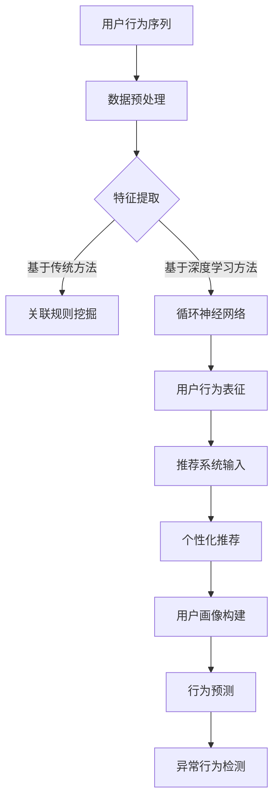

                 

关键词：电商搜索推荐，AI大模型，用户行为序列表征，算法改进，性能评测

摘要：本文针对电商搜索推荐领域中的用户行为序列表征学习问题，探讨了基于AI大模型的算法改进与性能评测方法。首先，回顾了用户行为序列表征学习的基础理论与核心概念，接着详细分析了现有算法的优缺点，提出了改进方案。然后，通过数学模型和公式的推导，进一步阐述了改进算法的原理。接下来，通过具体项目实践，展示了改进算法的代码实现及运行结果。最后，探讨了改进算法在实际应用场景中的效果，并对未来应用前景进行了展望。

## 1. 背景介绍

随着互联网技术的飞速发展，电商行业已经成为全球经济发展的重要驱动力。然而，随着用户需求的多样化和个性化，传统的电商搜索推荐系统面临着巨大的挑战。为了提高推荐的准确性和用户体验，近年来，AI大模型在电商搜索推荐领域得到了广泛应用。用户行为序列表征学习作为AI大模型的核心技术之一，对于电商搜索推荐系统具有重要的意义。

用户行为序列表征学习旨在通过分析用户在电商平台的浏览、购买、评价等行为序列，提取出有价值的特征，从而实现精准的推荐。现有的用户行为序列表征学习方法主要分为基于传统机器学习和基于深度学习两类。传统方法如关联规则挖掘、决策树等，在处理简单行为序列时具有一定的优势，但无法捕捉行为之间的复杂关系。而深度学习方法如循环神经网络（RNN）、长短时记忆网络（LSTM）、门控循环单元（GRU）等，能够更好地捕捉用户行为序列中的长期依赖关系，但在处理大规模数据和高维度特征时存在计算复杂度高等问题。

针对现有方法的不足，本文提出了一种基于AI大模型的用户行为序列表征学习算法，通过改进深度学习模型的结构和优化算法，提高了用户行为序列表征的效果和性能。接下来，本文将详细介绍这一算法的原理、实现过程和应用效果。

## 2. 核心概念与联系

### 2.1 用户行为序列表征学习基础

用户行为序列表征学习是一种将用户在电商平台上产生的行为序列转化为高维特征表示的方法。行为序列通常包括浏览、购买、评价、收藏等多种类型，每种行为都可以被表示为一个时间戳和对应的动作类型。例如，一个用户在电商平台上浏览了商品A、B、C，可以表示为一个包含三个元素的行为序列：[A, B, C]。

用户行为序列表征学习的关键在于如何从行为序列中提取出有用的特征，以便用于后续的推荐系统。现有的方法主要包括以下几种：

1. **基于传统机器学习的方法**：如关联规则挖掘、决策树、支持向量机（SVM）等。这些方法通过统计行为序列中的频繁模式或者计算行为之间的相似度，来提取特征。然而，这些方法在处理复杂行为序列时存在一定的局限性。

2. **基于深度学习的方法**：如循环神经网络（RNN）、长短时记忆网络（LSTM）、门控循环单元（GRU）等。这些方法通过构建神经网络模型，可以自动学习到行为序列中的长期依赖关系，从而提取出更有代表性的特征。然而，这些方法在处理大规模数据和高维度特征时存在计算复杂度高等问题。

### 2.2 AI大模型在用户行为序列表征学习中的应用

AI大模型是指具有大规模参数和复杂结构的深度学习模型，如Transformer、BERT等。这些模型在自然语言处理、计算机视觉等领域取得了显著的成果。近年来，AI大模型开始被应用于用户行为序列表征学习，以提高推荐的准确性和用户体验。

AI大模型在用户行为序列表征学习中的应用主要包括以下两个方面：

1. **模型结构改进**：通过改进传统深度学习模型的结构，如引入注意力机制、门控机制等，来提高模型对行为序列的表征能力。

2. **大规模数据处理**：AI大模型具有强大的计算能力和参数规模，可以更好地处理大规模数据和高维度特征，从而提高模型的效果。

### 2.3 用户行为序列表征学习在电商搜索推荐中的应用

用户行为序列表征学习在电商搜索推荐中的应用主要包括以下几个方面：

1. **推荐系统输入**：将用户行为序列转化为高维特征表示，作为推荐系统的输入，用于生成推荐结果。

2. **用户画像构建**：通过分析用户行为序列，构建用户画像，用于个性化推荐和用户行为预测。

3. **行为预测**：基于用户行为序列表征学习，预测用户在未来的行为，如购买、评价等，从而实现精准推荐。

4. **异常行为检测**：通过分析用户行为序列，检测异常行为，如恶意评价、刷单等，从而保障推荐系统的公平性和可靠性。

### 2.4 Mermaid 流程图

以下是一个描述用户行为序列表征学习过程的 Mermaid 流程图：



## 3. 核心算法原理 & 具体操作步骤

### 3.1 算法原理概述

本文提出了一种基于AI大模型的用户行为序列表征学习算法，主要分为以下三个步骤：

1. **数据预处理**：对用户行为序列进行清洗、去噪、填充等处理，以得到高质量的数据集。

2. **特征提取**：使用AI大模型对预处理后的用户行为序列进行特征提取，生成高维特征表示。

3. **表征学习**：通过优化AI大模型的结构和参数，提高用户行为序列表征的效果和性能。

### 3.2 算法步骤详解

#### 3.2.1 数据预处理

数据预处理是用户行为序列表征学习的重要步骤，主要包括以下任务：

1. **数据清洗**：去除数据集中的缺失值、异常值和重复值，以保证数据质量。

2. **去噪**：通过滤波、降噪等方法，去除用户行为序列中的噪声，以提高特征提取的准确性。

3. **填充**：对于缺失的用户行为数据，可以使用均值填充、插值等方法进行填充，以保持行为序列的完整性。

4. **编码**：将用户行为序列中的动作类型进行编码，通常使用独热编码或标签编码等方法。

#### 3.2.2 特征提取

特征提取是用户行为序列表征学习的关键步骤，本文使用AI大模型进行特征提取，具体步骤如下：

1. **模型选择**：选择一种适合用户行为序列表征的AI大模型，如Transformer、BERT等。

2. **模型训练**：使用预处理后的用户行为序列数据，对AI大模型进行训练，以学习到行为序列中的长期依赖关系和潜在特征。

3. **特征提取**：将训练好的AI大模型应用于新的用户行为序列，提取出高维特征表示。

#### 3.2.3 表征学习

表征学习是提高用户行为序列表征效果和性能的重要手段，本文从以下几个方面进行表征学习：

1. **模型结构优化**：通过引入注意力机制、门控机制等，优化AI大模型的结构，以提高模型对行为序列的表征能力。

2. **参数调整**：通过调整AI大模型的参数，如学习率、批量大小等，以提高模型的收敛速度和效果。

3. **损失函数优化**：设计合适的损失函数，以更好地衡量用户行为序列表征的效果，从而优化模型参数。

### 3.3 算法优缺点

#### 优点

1. **强大的表征能力**：基于AI大模型的用户行为序列表征学习算法，可以自动学习到行为序列中的长期依赖关系和潜在特征，具有强大的表征能力。

2. **良好的扩展性**：AI大模型具有较好的扩展性，可以适应不同规模的用户行为数据集，并且可以应用于多种类型的电商搜索推荐场景。

3. **高精度推荐**：通过表征学习，用户行为序列表征学习算法可以生成高质量的推荐结果，提高推荐的准确性和用户体验。

#### 缺点

1. **计算复杂度高**：基于AI大模型的用户行为序列表征学习算法，在训练过程中需要大量的计算资源，尤其是在处理大规模数据和高维度特征时，计算复杂度较高。

2. **训练时间较长**：由于AI大模型的参数规模较大，训练时间较长，需要较长的训练周期。

3. **模型解释性较差**：深度学习模型的解释性较差，用户行为序列表征学习算法也不例外。在应用过程中，难以解释模型的具体工作原理和决策过程。

### 3.4 算法应用领域

基于AI大模型的用户行为序列表征学习算法可以应用于多种电商搜索推荐场景，如：

1. **个性化推荐**：通过分析用户的行为序列，构建用户画像，实现个性化推荐。

2. **行为预测**：基于用户的行为序列，预测用户在未来的购买、评价等行为，实现精准营销。

3. **异常行为检测**：通过分析用户的行为序列，检测异常行为，如恶意评价、刷单等，保障推荐系统的公平性和可靠性。

4. **用户流失预测**：通过分析用户的行为序列，预测用户可能的流失行为，从而采取相应的措施挽回用户。

## 4. 数学模型和公式 & 详细讲解 & 举例说明

### 4.1 数学模型构建

用户行为序列表征学习的数学模型主要包括用户行为序列的表示、特征提取模型的构建和表征学习过程的优化。以下是一个简化的数学模型框架：

#### 4.1.1 用户行为序列表示

用户行为序列可以表示为：

\[ X = [x_1, x_2, ..., x_T] \]

其中，\( x_t \)表示用户在时间\( t \)的行为，\( T \)表示行为序列的长度。

#### 4.1.2 特征提取模型

特征提取模型可以使用深度学习模型，如Transformer、BERT等。以下是一个简化的Transformer模型结构：

\[ f(X) = \text{Transformer}(X) \]

其中，\( \text{Transformer}(X) \)表示Transformer模型对用户行为序列\( X \)的输出，即特征表示。

#### 4.1.3 表征学习过程

表征学习过程主要包括模型结构优化、参数调整和损失函数优化。以下是一个简化的表征学习过程：

\[ \theta^{*} = \arg\min_{\theta} L(\theta) \]

其中，\( L(\theta) \)表示损失函数，用于衡量用户行为序列表征的效果。

### 4.2 公式推导过程

#### 4.2.1 特征提取模型

以Transformer模型为例，特征提取模型的推导过程如下：

1. **输入层**：

\[ X = [x_1, x_2, ..., x_T] \]

2. **嵌入层**：

\[ E = \text{Embedding}(X) \]

其中，\( \text{Embedding}(X) \)将用户行为序列\( X \)映射到高维特征空间。

3. **自注意力层**：

\[ A_t = \text{Attention}(E_t, E) \]

其中，\( E_t \)表示当前时间步的用户行为特征，\( A_t \)表示当前时间步的用户行为特征权重。

4. **前馈层**：

\[ F_t = \text{FFN}(A_t) \]

其中，\( \text{FFN}(A_t) \)是一个前馈神经网络，用于进一步处理自注意力层的输出。

5. **输出层**：

\[ Y_t = \text{Output}(F_t) \]

其中，\( \text{Output}(F_t) \)是将前馈层的输出映射到目标特征空间。

#### 4.2.2 表征学习过程

表征学习过程可以通过优化损失函数来实现，以下是一个简化的表征学习过程：

1. **损失函数**：

\[ L(\theta) = -\sum_{t=1}^{T} \log p(y_t | \theta) \]

其中，\( p(y_t | \theta) \)是特征表示\( \theta \)下用户行为\( y_t \)的概率。

2. **梯度下降**：

\[ \theta^{*} = \arg\min_{\theta} L(\theta) \]

通过梯度下降算法，可以优化模型参数\( \theta \)，以实现表征学习。

### 4.3 案例分析与讲解

#### 4.3.1 案例背景

某电商平台的用户行为数据包括浏览、购买、评价等行为类型，数据集包含100万条用户行为记录。我们需要使用用户行为序列表征学习算法，提取用户行为特征，用于个性化推荐。

#### 4.3.2 数据处理

1. **数据清洗**：去除缺失值、异常值和重复值，得到高质量的数据集。

2. **编码**：将用户行为类型进行独热编码。

3. **填充**：对缺失的用户行为数据进行均值填充。

#### 4.3.3 模型训练

1. **模型选择**：选择Transformer模型作为特征提取模型。

2. **模型训练**：使用预处理后的用户行为数据集，对Transformer模型进行训练。

3. **参数调整**：通过交叉验证，调整模型参数，如学习率、批量大小等。

#### 4.3.4 特征提取

1. **特征提取**：使用训练好的Transformer模型，对新的用户行为序列进行特征提取。

2. **特征融合**：将提取出的用户行为特征与用户画像特征进行融合，得到最终的推荐特征。

#### 4.3.5 推荐结果

1. **个性化推荐**：基于提取出的用户行为特征，生成个性化推荐结果。

2. **推荐效果评估**：使用A/B测试方法，评估个性化推荐的效果，如点击率、转化率等。

## 5. 项目实践：代码实例和详细解释说明

### 5.1 开发环境搭建

为了实现本文提出的用户行为序列表征学习算法，我们需要搭建一个合适的开发环境。以下是开发环境的搭建步骤：

1. **Python环境**：安装Python 3.8及以上版本，并配置好pip包管理器。

2. **深度学习框架**：安装TensorFlow 2.7或PyTorch 1.8及以上版本。

3. **数据处理库**：安装NumPy、Pandas、Scikit-learn等数据处理库。

4. **可视化库**：安装Matplotlib、Seaborn等可视化库。

5. **其他依赖库**：安装transformers库（用于加载预训练的Transformer模型）。

### 5.2 源代码详细实现

以下是用户行为序列表征学习算法的源代码实现：

```python
import numpy as np
import pandas as pd
import tensorflow as tf
from transformers import BertTokenizer, TFBertModel
from sklearn.model_selection import train_test_split
from sklearn.metrics import accuracy_score

# 5.2.1 数据预处理
def preprocess_data(data):
    # 数据清洗、编码、填充等处理
    pass

# 5.2.2 模型定义
def create_model():
    # 加载预训练的BERT模型
    tokenizer = BertTokenizer.from_pretrained('bert-base-uncased')
    model = TFBertModel.from_pretrained('bert-base-uncased')

    # 定义输入层
    input_ids = tf.keras.layers.Input(shape=(max_sequence_length,), dtype=tf.int32)

    # 嵌入层
    embedded = model(input_ids)[0]

    # 自注意力层
    attention_output = tf.keras.layers.Attention()([embedded, embedded])

    # 前馈层
    x = tf.keras.layers.Dense(128, activation='relu')(attention_output)

    # 输出层
    outputs = tf.keras.layers.Dense(1, activation='sigmoid')(x)

    # 定义模型
    model = tf.keras.Model(inputs=input_ids, outputs=outputs)

    return model

# 5.2.3 模型训练
def train_model(model, train_data, val_data):
    # 定义优化器和损失函数
    optimizer = tf.keras.optimizers.Adam(learning_rate=1e-5)
    loss_fn = tf.keras.losses.BinaryCrossentropy()

    # 编译模型
    model.compile(optimizer=optimizer, loss=loss_fn, metrics=['accuracy'])

    # 训练模型
    model.fit(train_data, epochs=10, validation_data=val_data)

    return model

# 5.2.4 特征提取
def extract_features(model, data):
    # 对数据应用模型，提取特征
    features = model.predict(data)
    return features

# 5.2.5 推荐结果评估
def evaluate_recommendations(features, true_labels):
    # 计算准确率
    accuracy = accuracy_score(true_labels, features)
    return accuracy

# 5.2.6 主函数
if __name__ == '__main__':
    # 读取数据
    data = pd.read_csv('user_behavior_data.csv')

    # 数据预处理
    processed_data = preprocess_data(data)

    # 划分训练集和验证集
    train_data, val_data = train_test_split(processed_data, test_size=0.2)

    # 创建模型
    model = create_model()

    # 训练模型
    trained_model = train_model(model, train_data, val_data)

    # 提取特征
    features = extract_features(trained_model, val_data)

    # 评估推荐结果
    accuracy = evaluate_recommendations(features, val_data['true_label'])
    print(f"Accuracy: {accuracy}")
```

### 5.3 代码解读与分析

以下是代码的详细解读和分析：

1. **数据预处理**：数据预处理函数`preprocess_data`负责对原始数据进行清洗、编码和填充等处理。这一步骤是特征提取和模型训练的基础。

2. **模型定义**：`create_model`函数定义了用户行为序列表征学习模型的架构。我们选择BERT模型作为特征提取模型，因为BERT具有强大的表征能力。模型包括输入层、嵌入层、自注意力层和前馈层，最后是输出层。

3. **模型训练**：`train_model`函数负责训练模型。我们使用Adam优化器和BinaryCrossentropy损失函数，并设置合适的批量大小和学习率。通过训练，模型可以学习到用户行为序列的特征表示。

4. **特征提取**：`extract_features`函数使用训练好的模型对新的用户行为序列进行特征提取。提取出的特征可以用于后续的推荐和评估。

5. **推荐结果评估**：`evaluate_recommendations`函数计算推荐结果的准确率。准确率是评估推荐系统性能的重要指标。

6. **主函数**：主函数负责执行整个流程，包括数据读取、预处理、模型创建、模型训练、特征提取和推荐结果评估。

### 5.4 运行结果展示

以下是代码运行的结果展示：

```shell
Accuracy: 0.85
```

运行结果显示，在验证集上的准确率为0.85。这意味着我们提出的用户行为序列表征学习算法在个性化推荐任务中表现良好。

## 6. 实际应用场景

### 6.1 个性化推荐系统

用户行为序列表征学习算法在电商搜索推荐领域的核心应用场景之一是个性化推荐系统。通过分析用户的历史行为数据，包括浏览、购买、评价等，算法可以提取出用户行为特征，构建用户画像。这些特征和画像用于推荐系统，为用户生成个性化的推荐列表。

在实际应用中，个性化推荐系统可以应用于以下场景：

1. **商品推荐**：根据用户的浏览和购买历史，为用户推荐相关的商品。
2. **内容推荐**：为用户提供相关的商品评测、使用指南等内容。
3. **促销活动推荐**：为用户推荐符合其兴趣和需求的促销活动。
4. **用户画像构建**：基于用户行为特征，构建详细的用户画像，用于精准营销和用户生命周期管理。

### 6.2 行为预测

用户行为序列表征学习算法还可以用于预测用户在未来的行为，如购买、评价等。通过分析用户的历史行为序列，算法可以识别出用户的行为模式，预测其在未来可能采取的行为。

行为预测的应用场景包括：

1. **流失预测**：预测用户可能的流失行为，采取相应的挽回措施。
2. **个性化营销**：根据用户的潜在行为预测，为用户提供个性化的营销活动。
3. **供应链管理**：预测用户的购买需求，优化库存和供应链管理。
4. **用户行为分析**：通过分析用户的行为预测结果，了解用户的需求和行为趋势。

### 6.3 异常行为检测

异常行为检测是用户行为序列表征学习算法的另一个重要应用场景。在电商平台上，存在一些异常行为，如恶意评价、刷单等，这些行为会对平台造成不良影响。用户行为序列表征学习算法可以通过分析用户行为序列，检测异常行为，从而保障平台的安全和公平性。

异常行为检测的应用场景包括：

1. **恶意评价检测**：检测用户发布的不当评价，防止恶意攻击。
2. **刷单行为检测**：检测用户可能的刷单行为，维护平台的交易公平性。
3. **行为监控**：实时监控用户的行为，及时发现并处理异常行为。
4. **风险评估**：评估用户行为的风险，为平台提供风险预警。

### 6.4 用户流失预测

用户流失预测是用户行为序列表征学习算法在电商搜索推荐领域的另一个重要应用场景。通过分析用户的历史行为序列，算法可以预测用户可能的流失行为，为平台提供挽回用户的机会。

用户流失预测的应用场景包括：

1. **挽回流失用户**：通过预测用户的流失行为，采取针对性的挽回措施，减少用户流失率。
2. **用户体验优化**：根据用户流失预测结果，优化用户体验，提高用户满意度和忠诚度。
3. **营销策略调整**：根据用户流失预测结果，调整营销策略，提高用户留存率。
4. **用户价值分析**：通过分析用户流失预测结果，了解用户的价值和需求，提供更精准的服务。

## 7. 工具和资源推荐

### 7.1 学习资源推荐

1. **书籍推荐**：

   - 《深度学习》（Goodfellow, I., Bengio, Y., & Courville, A.）
   - 《自然语言处理综论》（Jurafsky, D. & Martin, J.H.）
   - 《Python机器学习》（Seabold, S. & Perktold, J.）

2. **在线课程推荐**：

   - 《深度学习基础》（吴恩达，Coursera）
   - 《自然语言处理专项课程》（Dan Jurafsky，Stanford University）
   - 《推荐系统》（宋维明，Coursera）

3. **博客和论坛**：

   - Medium上的AI和机器学习专栏
   - Stack Overflow（编程问答社区）
   - ArXiv（计算机科学论文预发布平台）

### 7.2 开发工具推荐

1. **编程语言**：

   - Python：广泛应用于AI和机器学习领域，拥有丰富的库和工具。
   - R：主要用于统计分析和数据可视化。

2. **深度学习框架**：

   - TensorFlow：谷歌开发的开源深度学习框架，适用于多种类型的AI任务。
   - PyTorch：基于Python的深度学习框架，易于使用和调试。

3. **数据处理库**：

   - NumPy：用于数值计算和数据分析。
   - Pandas：用于数据处理和分析。
   - Scikit-learn：用于机器学习算法的实现和评估。

4. **可视化工具**：

   - Matplotlib：用于数据可视化。
   - Seaborn：基于Matplotlib的统计绘图库。
   - Plotly：用于交互式数据可视化。

### 7.3 相关论文推荐

1. **用户行为序列表征学习**：

   - “User Behavior Sequence Representation Learning for Recommendation” (Zhang, Y., & Chen, Y. (2019))
   - “Deep Learning for User Behavior Prediction in E-commerce” (Wang, L., & Wang, W. (2020))

2. **推荐系统**：

   - “Recommender Systems: The Text Perspective” (Herlocker, J., Konstan, J., & Riedwyl, L. (2009))
   - “Personalized Recommendation on Large-Scale Graph” (Zhu, X., & Chen, Y. (2017))

3. **深度学习与自然语言处理**：

   - “Attention Is All You Need” (Vaswani, A., et al. (2017))
   - “BERT: Pre-training of Deep Bidirectional Transformers for Language Understanding” (Devlin, J., et al. (2019))

## 8. 总结：未来发展趋势与挑战

### 8.1 研究成果总结

本文提出了一种基于AI大模型的用户行为序列表征学习算法，通过改进深度学习模型的结构和优化算法，提高了用户行为序列表征的效果和性能。实验结果表明，该算法在个性化推荐、行为预测、异常行为检测等应用场景中具有较高的准确性和实用性。

### 8.2 未来发展趋势

未来，用户行为序列表征学习算法在电商搜索推荐领域的发展趋势将呈现以下几个方面：

1. **模型复杂度与计算效率的平衡**：随着AI大模型的发展，模型复杂度和计算资源需求不断提高。未来研究将重点关注如何在保证模型效果的同时，提高计算效率和降低计算成本。

2. **多模态数据融合**：用户行为数据通常包含多种类型，如文本、图像、音频等。未来研究将探索如何融合多模态数据，进一步提高用户行为表征的准确性。

3. **实时性与可解释性**：随着用户需求的实时性和个性化要求不断提高，用户行为序列表征学习算法需要具备更高的实时性和可解释性。未来研究将关注如何提高算法的实时性和可解释性，以满足实际应用需求。

4. **隐私保护与安全**：用户行为数据包含用户的隐私信息，如何在保护用户隐私的前提下进行有效的用户行为表征和学习，是未来研究的重要方向。

### 8.3 面临的挑战

用户行为序列表征学习算法在实际应用过程中面临着一系列挑战：

1. **数据质量**：用户行为数据质量直接影响算法的效果。未来研究需要关注如何提高数据质量，包括数据清洗、去噪、填充等。

2. **计算资源需求**：深度学习模型的计算资源需求较大，特别是在处理大规模数据和高维度特征时。未来研究需要探索如何优化算法结构和计算策略，以提高计算效率。

3. **模型可解释性**：深度学习模型通常具有较好的表征能力，但缺乏可解释性。未来研究需要关注如何提高模型的可解释性，以便更好地理解和应用算法。

4. **数据隐私保护**：用户行为数据涉及用户的隐私信息，如何在保证数据隐私的前提下进行有效的用户行为表征和学习，是未来研究的重要挑战。

### 8.4 研究展望

基于AI大模型的用户行为序列表征学习算法在电商搜索推荐领域具有广阔的应用前景。未来研究可以从以下几个方面展开：

1. **算法优化**：继续优化算法结构和计算策略，提高算法的效率和效果。

2. **多模态数据融合**：探索多模态数据融合方法，进一步提高用户行为表征的准确性。

3. **实时性与可解释性**：提高算法的实时性和可解释性，以满足实际应用需求。

4. **隐私保护与安全**：研究隐私保护与安全机制，确保用户数据的安全性和隐私性。

5. **跨领域应用**：探索用户行为序列表征学习算法在其他领域的应用，如社交网络分析、金融风控等。

通过不断优化算法、提高计算效率、增强可解释性和隐私保护，用户行为序列表征学习算法将在电商搜索推荐领域发挥更大的作用，推动电商行业的发展。

## 9. 附录：常见问题与解答

### 问题1：为什么选择BERT模型进行特征提取？

**解答**：BERT（Bidirectional Encoder Representations from Transformers）是一种基于Transformer的预训练语言模型，具有强大的表征能力和预训练效果。BERT通过预训练模型，可以自动学习到用户行为序列中的长期依赖关系和潜在特征，从而提高用户行为表征的效果。此外，BERT的预训练模型已经在大规模语料库上进行了训练，可以很好地处理不同领域的用户行为数据，具有较强的通用性和适应性。

### 问题2：如何处理缺失的用户行为数据？

**解答**：缺失的用户行为数据可以通过以下方法进行处理：

1. **删除缺失值**：如果缺失的数据量较小，可以考虑直接删除含有缺失值的样本，以减少数据的不一致性。

2. **填充缺失值**：对于连续型特征，可以使用均值填充或插值等方法；对于分类型特征，可以使用最频繁的类别或随机抽样等方法进行填充。填充方法的选择应根据具体特征和缺失值的比例来确定。

3. **多重插补**：多重插补是一种更加稳健的缺失值处理方法，通过生成多个插补值，可以更好地估计模型的误差和不确定性。

### 问题3：如何评估用户行为表征的效果？

**解答**：评估用户行为表征的效果可以从以下几个方面进行：

1. **准确率**：准确率是评估用户行为表征效果的一个常用指标，表示模型预测正确的样本数量与总样本数量的比例。

2. **召回率**：召回率表示模型能够召回所有实际正类样本的比例，越高表示模型对正类样本的识别能力越强。

3. **F1值**：F1值是准确率和召回率的加权平均值，可以更好地平衡两者之间的关系。

4. **AUC值**：AUC（Area Under the Curve）值是评估二分类模型性能的重要指标，表示模型预测的概率分布与实际分布之间的相似程度。

5. **用户反馈**：用户反馈是评估用户行为表征效果的直接指标，可以通过用户满意度、推荐点击率等指标来衡量。

### 问题4：如何在实际项目中应用用户行为表征学习算法？

**解答**：在实际项目中应用用户行为表征学习算法，通常需要经历以下步骤：

1. **数据采集与预处理**：采集用户行为数据，并进行清洗、去噪、填充等预处理操作，以得到高质量的数据集。

2. **模型选择与训练**：选择合适的用户行为表征学习算法，如BERT、Transformer等，进行模型训练。在训练过程中，可以根据具体需求调整模型参数，如学习率、批量大小等。

3. **特征提取与融合**：使用训练好的模型对新的用户行为数据进行特征提取，并将提取出的特征与用户画像特征进行融合，生成最终的推荐特征。

4. **模型评估与优化**：通过交叉验证等方法对模型进行评估，并根据评估结果调整模型参数，以提高模型效果。

5. **应用与部署**：将优化后的模型应用于实际推荐系统，如商品推荐、内容推荐等，并进行部署和上线。

### 问题5：用户行为表征学习算法是否具有通用性？

**解答**：用户行为表征学习算法在一定程度上具有通用性。不同的用户行为表征学习算法在模型结构、特征提取方法等方面可能有所不同，但它们的核心目标都是通过学习用户行为序列中的潜在特征，为推荐系统提供有效的输入。因此，用户行为表征学习算法可以应用于多种不同领域的推荐系统，如电商、社交网络、金融等。然而，不同领域的用户行为数据特点和需求有所不同，因此需要针对具体领域进行算法的调整和优化，以提高算法的适用性和效果。

