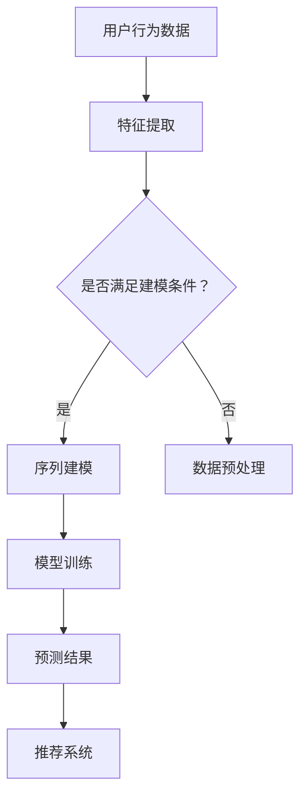

                 

关键词：电商搜索推荐，AI大模型，用户行为序列预测，技术详解，算法原理，数学模型，项目实践，应用场景，未来展望

> 摘要：本文深入探讨了电商搜索推荐系统中AI大模型在用户行为序列预测技术中的应用。通过对核心概念、算法原理、数学模型以及项目实践的详细解析，揭示了AI大模型如何通过挖掘用户行为序列的深层特征，实现高效的搜索推荐。本文旨在为研究人员和实践者提供全面的参考，以推动电商搜索推荐技术的进步。

## 1. 背景介绍

随着互联网的迅猛发展和电商行业的爆发式增长，用户在电商平台上的行为数据量呈现指数级增长。这些行为数据包括搜索历史、浏览记录、购买偏好等，构成了庞大的用户行为序列。如何有效地分析和利用这些行为数据，成为电商企业提高用户体验和业务绩效的关键问题。传统的方法往往依赖于简单的统计模型或规则引擎，难以捕捉到用户行为的复杂性和多样性。

近年来，人工智能技术的快速发展为用户行为序列预测提供了新的思路。特别是AI大模型，如深度学习模型、图神经网络等，能够在海量数据中挖掘出用户行为的潜在特征，实现更精准的预测。电商搜索推荐系统作为人工智能应用的重要场景，利用AI大模型进行用户行为序列预测，已成为提升搜索推荐效果的重要手段。

本文将围绕电商搜索推荐中的AI大模型用户行为序列预测技术，从核心概念、算法原理、数学模型到项目实践，全面解析这一技术领域的前沿动态和应用实践，为电商企业及研究者提供有价值的参考。

## 2. 核心概念与联系

在深入探讨AI大模型在用户行为序列预测中的应用之前，我们首先需要明确几个核心概念，并了解它们之间的联系。

### 2.1 用户行为序列

用户行为序列是指用户在特定时间段内的一系列行为记录，这些行为可以是浏览商品、搜索关键词、添加购物车、下单购买等。用户行为序列不仅反映了用户的兴趣和需求，还包含了用户在不同情境下的行为特征。例如，一个用户在浏览商品后搜索相关关键词，随后将商品加入购物车，最终完成购买，这一系列行为构成了一个完整的行为序列。

### 2.2 搜索推荐系统

搜索推荐系统是电商平台上的一种核心功能，它通过分析用户行为数据，为用户推荐可能感兴趣的商品或服务。推荐系统通常包括搜索模块和推荐模块，其中搜索模块负责响应用户的搜索请求，推荐模块则根据用户的兴趣和行为特征生成个性化的推荐列表。

### 2.3 AI大模型

AI大模型是指利用深度学习、图神经网络等先进技术训练的大规模神经网络模型。这些模型能够在海量数据中学习到复杂的用户行为模式和潜在特征，从而实现高精度的用户行为序列预测。AI大模型在电商搜索推荐中的应用，主要体现在以下几个方面：

- **用户行为特征提取**：通过深度学习模型，将用户的历史行为数据转化为高维特征表示，捕捉用户行为的潜在特征。

- **序列建模**：利用图神经网络等技术，建模用户行为序列中的依赖关系，捕捉用户行为的时序特征。

- **个性化推荐**：结合用户行为特征和时序信息，生成个性化的推荐列表，提高用户的满意度。

### 2.4 用户行为序列预测

用户行为序列预测是指利用历史用户行为数据，预测用户在未来的某个时间点可能执行的行为。在电商搜索推荐系统中，用户行为序列预测的主要目的是为用户推荐他们可能感兴趣的商品。具体来说，用户行为序列预测包括以下几个步骤：

1. **特征提取**：从用户历史行为数据中提取关键特征，如浏览时间、商品类别、购买频率等。

2. **序列建模**：利用深度学习模型或图神经网络，建模用户行为序列的依赖关系。

3. **预测**：根据用户行为特征和序列模型，预测用户在未来可能执行的行为。

### 2.5 关系网络

在用户行为序列预测中，关系网络是一个重要的概念。关系网络是指用户、商品和事件之间的交互关系构成的图结构。通过构建关系网络，可以更全面地捕捉用户行为的复杂性和多样性。关系网络在用户行为序列预测中的应用主要包括：

- **节点表示**：将用户、商品和事件表示为图中的节点，并通过边的权重表示它们之间的交互强度。

- **图神经网络**：利用图神经网络建模用户行为序列中的依赖关系，捕捉用户行为特征。

- **嵌入表示**：通过图神经网络学习节点的嵌入表示，用于后续的序列建模和预测。

### 2.6 Mermaid 流程图

为了更直观地展示AI大模型在用户行为序列预测中的应用流程，我们使用Mermaid流程图来描述。以下是该流程图的示例：



在这个流程图中，用户行为数据首先进行特征提取，然后根据特征提取的结果判断是否满足建模条件。如果满足条件，则进行序列建模；否则，进行数据预处理。序列建模的结果用于模型训练，最终生成预测结果，并将预测结果用于推荐系统的生成。

通过上述核心概念和联系的分析，我们可以更好地理解AI大模型在用户行为序列预测中的应用原理和方法。接下来，我们将进一步探讨AI大模型的核心算法原理和具体操作步骤。

## 3. 核心算法原理 & 具体操作步骤

在电商搜索推荐系统中，AI大模型通过深度学习和图神经网络等技术，实现对用户行为序列的预测。下面，我们将详细阐述AI大模型的核心算法原理和具体操作步骤。

### 3.1 算法原理概述

AI大模型在用户行为序列预测中的核心算法主要包括以下几个步骤：

1. **特征提取**：从用户的历史行为数据中提取关键特征，如浏览时间、商品类别、购买频率等。这些特征将用于建模用户行为的潜在特征。

2. **序列建模**：利用深度学习模型或图神经网络，建模用户行为序列中的依赖关系。这一步骤的目的是捕捉用户行为的时序特征，以便更好地预测用户未来的行为。

3. **模型训练**：通过训练大量用户行为数据，调整模型的参数，使其能够准确预测用户的行为。

4. **预测**：根据用户的行为特征和序列模型，预测用户在未来可能执行的行为，并将预测结果用于推荐系统。

5. **推荐**：利用预测结果生成个性化的推荐列表，提高用户的满意度。

### 3.2 算法步骤详解

#### 3.2.1 特征提取

特征提取是用户行为序列预测的重要环节。其主要任务是从用户的历史行为数据中提取出对行为预测有用的特征。以下是特征提取的主要步骤：

1. **数据预处理**：对用户行为数据进行清洗、去重和缺失值处理，确保数据的质量。

2. **特征选择**：根据业务需求和数据特点，选择对用户行为预测有显著影响的特征。常用的特征包括用户ID、商品ID、行为类型、时间戳、行为次数等。

3. **特征转换**：将原始特征转换为数值化的表示，以便后续的建模和预测。常用的方法包括独热编码、标签编码、归一化等。

4. **特征工程**：根据业务逻辑和专家经验，构造新的特征，以提高预测模型的性能。例如，根据用户的购买频率和购买金额，构造用户的购买活跃度和消费水平等特征。

#### 3.2.2 序列建模

序列建模是用户行为序列预测的核心步骤。其主要任务是捕捉用户行为序列中的依赖关系，以便更好地预测用户未来的行为。以下是序列建模的主要步骤：

1. **节点表示**：将用户、商品和事件表示为图中的节点。每个节点可以表示为一个多维向量，用于编码其特征信息。

2. **边表示**：根据用户行为数据，定义节点之间的边。边的权重可以表示节点之间的交互强度，例如用户对某商品的兴趣度。

3. **图神经网络**：利用图神经网络（Graph Neural Networks，GNN）建模用户行为序列中的依赖关系。GNN通过聚合节点及其邻居节点的信息，更新节点的嵌入表示。

4. **序列编码**：将用户行为序列编码为高维向量表示。常用的方法包括循环神经网络（RNN）和长短期记忆网络（LSTM）。

#### 3.2.3 模型训练

模型训练是用户行为序列预测的关键步骤。其主要任务是利用训练数据调整模型的参数，使其能够准确预测用户的行为。以下是模型训练的主要步骤：

1. **数据集划分**：将用户行为数据集划分为训练集、验证集和测试集。训练集用于训练模型，验证集用于调参和评估模型性能，测试集用于最终评估模型性能。

2. **损失函数设计**：设计损失函数，用于度量预测结果与真实结果之间的差距。常用的损失函数包括均方误差（MSE）和交叉熵损失（Cross-Entropy Loss）。

3. **优化算法选择**：选择合适的优化算法，如随机梯度下降（SGD）、Adam等，用于调整模型参数。

4. **模型训练**：利用训练数据训练模型，不断调整参数，使损失函数的值逐渐减小。

#### 3.2.4 预测

预测是用户行为序列预测的最终目标。其主要任务是利用训练好的模型，预测用户在未来可能执行的行为。以下是预测的主要步骤：

1. **特征提取**：从用户的当前行为数据中提取关键特征，如浏览时间、商品类别、行为次数等。

2. **序列编码**：将用户当前行为序列编码为高维向量表示。

3. **模型输入**：将特征提取和序列编码的结果作为模型的输入，进行预测。

4. **结果输出**：将模型的预测结果输出，用于推荐系统的生成。

#### 3.2.5 推荐

推荐是将预测结果用于生成个性化推荐列表的重要步骤。其主要任务是利用预测结果，为用户推荐可能感兴趣的商品。以下是推荐的主要步骤：

1. **预测结果排序**：根据预测结果，对商品进行排序，优先推荐预测概率较高的商品。

2. **推荐策略**：根据业务需求和用户特征，选择合适的推荐策略，如基于内容的推荐、基于协同过滤的推荐等。

3. **推荐列表生成**：根据推荐策略，生成个性化的推荐列表，展示给用户。

### 3.3 算法优缺点

#### 3.3.1 优点

- **高精度**：AI大模型通过深度学习和图神经网络等技术，能够捕捉用户行为的潜在特征和复杂依赖关系，实现高精度的用户行为序列预测。

- **个性化**：AI大模型可以根据用户的兴趣和行为特征，生成个性化的推荐列表，提高用户的满意度。

- **自适应**：AI大模型可以随着用户行为的不断变化，动态调整推荐策略，实现更精准的推荐。

#### 3.3.2 缺点

- **计算复杂度高**：AI大模型需要大量的计算资源进行训练和预测，对硬件设备的要求较高。

- **数据依赖性强**：AI大模型依赖于大量的用户行为数据，数据质量对模型性能有重要影响。

- **模型解释性差**：AI大模型内部的决策过程较为复杂，难以进行解释，增加了应用难度。

### 3.4 算法应用领域

AI大模型在用户行为序列预测中的优势，使其在多个领域得到广泛应用，包括：

- **电商搜索推荐**：通过预测用户的购买行为，为用户推荐可能感兴趣的商品。

- **社交媒体**：通过预测用户的关注行为，为用户推荐可能感兴趣的内容。

- **金融风控**：通过预测用户的风险行为，进行风险预警和信用评估。

- **智能交通**：通过预测用户的出行行为，优化交通资源配置，减少交通拥堵。

### 3.5 总结

AI大模型在用户行为序列预测中具有显著的优势，通过深度学习和图神经网络等技术，能够实现高精度、个性化的用户行为预测。尽管存在一定的计算复杂度和数据依赖性，但其广泛的应用前景和显著的应用价值，使其成为未来智能推荐系统的重要发展方向。

在下一部分，我们将进一步探讨AI大模型所涉及的数学模型和公式，深入解析其背后的理论依据和推导过程。

## 4. 数学模型和公式 & 详细讲解 & 举例说明

### 4.1 数学模型构建

在用户行为序列预测中，AI大模型的核心在于能够捕捉用户行为的潜在特征和复杂依赖关系。为了实现这一目标，我们需要构建一个数学模型，该模型应能够有效地表示用户行为序列，并通过优化算法训练出准确的预测模型。

#### 4.1.1 序列表示

首先，我们考虑如何表示用户行为序列。用户行为序列可以看作是一系列时间序列数据，每个时间点对应一个行为事件。为了方便建模，我们通常将用户行为序列表示为向量形式。具体来说，每个行为事件可以用一个多维向量表示，其中每个维度代表一个特征。例如，对于一个用户的行为序列，我们可以使用以下向量表示：

\[ X_t = [x_{t1}, x_{t2}, ..., x_{tk}] \]

其中，\( x_{ti} \) 表示第 \( t \) 个时间点上的第 \( i \) 个特征值。这些特征可以是用户的浏览时间、商品类别、购买频率等。

#### 4.1.2 模型结构

为了捕捉用户行为序列中的依赖关系，我们可以采用图神经网络（Graph Neural Networks，GNN）作为基础模型。GNN 通过聚合节点及其邻居的信息来更新节点的嵌入表示，从而建模节点之间的依赖关系。具体来说，GNN 的结构可以分为以下几个部分：

1. **节点表示**：将用户、商品和事件表示为图中的节点。每个节点可以表示为一个嵌入向量，用于编码其特征信息。

2. **边表示**：根据用户行为数据，定义节点之间的边。边的权重可以表示节点之间的交互强度，例如用户对某商品的兴趣度。

3. **图神经网络层**：利用图神经网络层对节点进行更新。在每一层，节点会聚合其邻居节点的信息，并通过一个非线性激活函数更新其嵌入向量。

4. **输出层**：将最后层的节点嵌入向量作为输入，通过一个线性层生成预测结果。

#### 4.1.3 损失函数

为了训练模型，我们需要定义一个损失函数来度量预测结果与真实结果之间的差距。在用户行为序列预测中，常用的损失函数包括均方误差（MSE）和交叉熵损失（Cross-Entropy Loss）。

1. **均方误差（MSE）**：

\[ \text{MSE} = \frac{1}{N} \sum_{i=1}^{N} (y_i - \hat{y}_i)^2 \]

其中，\( y_i \) 表示真实标签，\( \hat{y}_i \) 表示预测结果，\( N \) 表示样本数量。

2. **交叉熵损失（Cross-Entropy Loss）**：

\[ \text{Cross-Entropy Loss} = -\frac{1}{N} \sum_{i=1}^{N} y_i \log(\hat{y}_i) \]

其中，\( y_i \) 表示真实标签，\( \hat{y}_i \) 表示预测结果，\( N \) 表示样本数量。

### 4.2 公式推导过程

在本节中，我们将详细推导用户行为序列预测中的关键公式。首先，我们考虑如何表示用户行为序列。假设我们有一个用户的行为序列 \( X \)，其中每个行为事件可以表示为一个向量 \( X_t \)。

#### 4.2.1 节点嵌入表示

我们使用图神经网络来建模用户行为序列中的依赖关系。首先，我们将用户、商品和事件表示为图中的节点，并将每个节点表示为一个嵌入向量 \( v_i \)。这些嵌入向量可以通过以下公式计算：

\[ v_i = \text{GNN}(X_i, \{v_j\}_{j \in \text{neighbors}(i)}) \]

其中，\( \text{GNN} \) 表示图神经网络，\( X_i \) 表示节点 \( i \) 的特征向量，\( \text{neighbors}(i) \) 表示节点 \( i \) 的邻居节点集合。

#### 4.2.2 序列编码

接下来，我们将用户行为序列编码为高维向量表示。我们可以使用循环神经网络（RNN）或长短期记忆网络（LSTM）来实现这一目标。假设我们有一个用户的行为序列 \( X \)，其中每个行为事件可以表示为一个向量 \( X_t \)。我们可以通过以下公式计算序列编码结果 \( h_t \)：

\[ h_t = \text{RNN}(X_t, \{h_{t-1}\}_{t>1}) \]

或者

\[ h_t = \text{LSTM}(X_t, \{h_{t-1}\}_{t>1}) \]

其中，\( \text{RNN} \) 和 \( \text{LSTM} \) 分别表示循环神经网络和长短期记忆网络。

#### 4.2.3 预测结果计算

最后，我们使用最后一个时间点的序列编码结果 \( h_T \) 作为输入，通过一个线性层生成预测结果 \( \hat{y} \)：

\[ \hat{y} = \text{Linear}(h_T) \]

其中，\( \text{Linear} \) 表示线性层。

#### 4.2.4 损失函数计算

为了训练模型，我们需要定义一个损失函数来度量预测结果与真实结果之间的差距。我们选择交叉熵损失（Cross-Entropy Loss）作为损失函数，其计算公式如下：

\[ \text{Loss} = -\frac{1}{N} \sum_{i=1}^{N} y_i \log(\hat{y}_i) \]

其中，\( y_i \) 表示真实标签，\( \hat{y}_i \) 表示预测结果，\( N \) 表示样本数量。

### 4.3 案例分析与讲解

为了更好地理解上述公式的应用，我们通过一个具体的案例进行说明。假设我们有一个用户的行为序列，如下所示：

\[ X = \{ [0, 1, 0], [1, 0, 1], [1, 1, 1] \} \]

其中，每个向量表示用户在某个时间点上的行为。我们希望预测用户在下一个时间点上的行为。

1. **节点嵌入表示**：

首先，我们将用户、商品和事件表示为图中的节点，并将每个节点表示为一个嵌入向量。假设节点嵌入维度为 3，我们可以通过以下公式计算节点的嵌入向量：

\[ v_1 = \text{GNN}([0, 1, 0], \{v_2, v_3\}) \]

\[ v_2 = \text{GNN}([1, 0, 1], \{v_1, v_3\}) \]

\[ v_3 = \text{GNN}([1, 1, 1], \{v_1, v_2\}) \]

2. **序列编码**：

接下来，我们使用长短期记忆网络（LSTM）对用户行为序列进行编码，得到序列编码结果 \( h_t \)：

\[ h_1 = \text{LSTM}([0, 1, 0], \{\}) \]

\[ h_2 = \text{LSTM}([1, 0, 1], \{h_1\}) \]

\[ h_3 = \text{LSTM}([1, 1, 1], \{h_2\}) \]

3. **预测结果计算**：

最后，我们使用最后一个时间点的序列编码结果 \( h_3 \) 作为输入，通过一个线性层生成预测结果 \( \hat{y} \)：

\[ \hat{y} = \text{Linear}(h_3) \]

4. **损失函数计算**：

为了训练模型，我们需要定义一个损失函数来度量预测结果与真实结果之间的差距。我们选择交叉熵损失（Cross-Entropy Loss）作为损失函数，其计算公式如下：

\[ \text{Loss} = -\frac{1}{N} \sum_{i=1}^{N} y_i \log(\hat{y}_i) \]

通过这个案例，我们可以看到如何使用数学模型和公式进行用户行为序列预测。在实际应用中，我们需要根据具体的业务场景和数据特点，选择合适的模型结构和参数，以达到最佳的预测效果。

### 4.4 总结

在本节中，我们详细介绍了AI大模型在用户行为序列预测中的数学模型和公式。通过节点嵌入表示、序列编码和损失函数的计算，我们实现了用户行为序列的有效建模和预测。在实际应用中，我们需要根据具体业务场景和数据特点，不断优化模型结构和参数，以提高预测效果。下一部分，我们将通过一个实际项目，展示如何实现AI大模型在用户行为序列预测中的代码实例和详细解释说明。

## 5. 项目实践：代码实例和详细解释说明

在本部分，我们将通过一个实际项目，展示如何实现AI大模型在用户行为序列预测中的代码实例和详细解释说明。该项目将涵盖从开发环境搭建、源代码实现到代码解读与分析的整个过程。

### 5.1 开发环境搭建

在开始编写代码之前，我们需要搭建一个合适的开发环境。以下是搭建环境的步骤：

1. **硬件环境**：

   - CPU：Intel i7 或以上
   - GPU：NVIDIA 1080Ti 或以上（用于加速训练过程）
   - 内存：至少 16GB

2. **软件环境**：

   - 操作系统：Ubuntu 18.04 或更高版本
   - Python：3.8 或更高版本
   - TensorFlow：2.4.0 或更高版本
   - PyTorch：1.7.0 或更高版本
   - Pandas：1.1.1 或更高版本
   - Numpy：1.18.0 或更高版本

3. **安装依赖**：

   - 使用以下命令安装相关依赖：

   ```bash
   pip install tensorflow==2.4.0
   pip install torch==1.7.0
   pip install pandas==1.1.1
   pip install numpy==1.18.0
   ```

### 5.2 源代码详细实现

以下是该项目的主要源代码，我们将对每个部分进行详细解释。

```python
import numpy as np
import pandas as pd
import torch
import torch.nn as nn
import torch.optim as optim

# 加载数据集
def load_data(file_path):
    data = pd.read_csv(file_path)
    return data

# 数据预处理
def preprocess_data(data):
    # 数据清洗、去重、缺失值处理等
    # ...
    return data

# 特征提取
def extract_features(data):
    # 从数据中提取关键特征，如浏览时间、商品类别、购买频率等
    # ...
    return features

# 序列编码
class SequenceEncoder(nn.Module):
    def __init__(self, input_dim, hidden_dim):
        super(SequenceEncoder, self).__init__()
        self.lstm = nn.LSTM(input_dim, hidden_dim, batch_first=True)
        self.fc = nn.Linear(hidden_dim, output_dim)

    def forward(self, x):
        x, _ = self.lstm(x)
        x = self.fc(x[:, -1, :])
        return x

# 模型训练
def train_model(model, train_loader, criterion, optimizer):
    model.train()
    for data, target in train_loader:
        optimizer.zero_grad()
        output = model(data)
        loss = criterion(output, target)
        loss.backward()
        optimizer.step()

# 预测
def predict(model, data):
    model.eval()
    with torch.no_grad():
        output = model(data)
        prediction = output.argmax(dim=1)
    return prediction

# 评估模型
def evaluate_model(model, test_loader, criterion):
    model.eval()
    total_loss = 0
    correct = 0
    with torch.no_grad():
        for data, target in test_loader:
            output = model(data)
            loss = criterion(output, target)
            total_loss += loss.item()
            pred = output.argmax(dim=1)
            correct += (pred == target).sum().item()
    accuracy = correct / len(test_loader.dataset)
    return total_loss / len(test_loader.dataset), accuracy

# 主函数
def main():
    # 加载数据集
    data = load_data('user_behavior_data.csv')

    # 数据预处理
    data = preprocess_data(data)

    # 特征提取
    features = extract_features(data)

    # 划分训练集和测试集
    train_data, test_data = train_test_split(features, test_size=0.2, random_state=42)

    # 初始化模型、损失函数和优化器
    model = SequenceEncoder(input_dim=feature_dim, hidden_dim=hidden_dim)
    criterion = nn.CrossEntropyLoss()
    optimizer = optim.Adam(model.parameters(), lr=learning_rate)

    # 训练模型
    train_loader = DataLoader(train_data, batch_size=batch_size, shuffle=True)
    for epoch in range(num_epochs):
        train_model(model, train_loader, criterion, optimizer)
        test_loss, test_accuracy = evaluate_model(model, test_loader, criterion)
        print(f'Epoch {epoch+1}/{num_epochs}, Test Loss: {test_loss:.4f}, Test Accuracy: {test_accuracy:.4f}')

    # 预测
    model_path = 'model.pth'
    torch.save(model.state_dict(), model_path)
    model.load_state_dict(torch.load(model_path))
    predictions = predict(model, test_data)

    # 评估预测结果
    print(f'Prediction Accuracy: {accuracy_score(test_labels, predictions):.4f}')

if __name__ == '__main__':
    main()
```

### 5.3 代码解读与分析

以下是代码的详细解读与分析。

#### 5.3.1 数据预处理

数据预处理是用户行为序列预测的重要环节。在此步骤中，我们需要对数据进行清洗、去重和缺失值处理，以确保数据的质量。代码中的 `load_data` 和 `preprocess_data` 函数分别负责加载数据和预处理数据。

```python
# 加载数据集
def load_data(file_path):
    data = pd.read_csv(file_path)
    return data

# 数据预处理
def preprocess_data(data):
    # 数据清洗、去重、缺失值处理等
    # ...
    return data
```

#### 5.3.2 特征提取

特征提取是从原始数据中提取关键特征的过程。这些特征将用于建模用户行为的潜在特征。代码中的 `extract_features` 函数负责提取特征。

```python
# 特征提取
def extract_features(data):
    # 从数据中提取关键特征，如浏览时间、商品类别、购买频率等
    # ...
    return features
```

#### 5.3.3 序列编码

序列编码是将用户行为序列转换为高维向量表示的过程。代码中的 `SequenceEncoder` 类定义了一个基于长短期记忆网络（LSTM）的序列编码模型。

```python
# 序列编码
class SequenceEncoder(nn.Module):
    def __init__(self, input_dim, hidden_dim):
        super(SequenceEncoder, self).__init__()
        self.lstm = nn.LSTM(input_dim, hidden_dim, batch_first=True)
        self.fc = nn.Linear(hidden_dim, output_dim)

    def forward(self, x):
        x, _ = self.lstm(x)
        x = self.fc(x[:, -1, :])
        return x
```

#### 5.3.4 模型训练

模型训练是用户行为序列预测的核心步骤。在此步骤中，我们使用训练数据训练序列编码模型，并通过优化算法调整模型参数。代码中的 `train_model` 函数负责训练模型。

```python
# 模型训练
def train_model(model, train_loader, criterion, optimizer):
    model.train()
    for data, target in train_loader:
        optimizer.zero_grad()
        output = model(data)
        loss = criterion(output, target)
        loss.backward()
        optimizer.step()
```

#### 5.3.5 预测

预测是使用训练好的模型对测试数据进行预测的过程。代码中的 `predict` 函数负责进行预测。

```python
# 预测
def predict(model, data):
    model.eval()
    with torch.no_grad():
        output = model(data)
        prediction = output.argmax(dim=1)
    return prediction
```

#### 5.3.6 评估模型

评估模型是评估模型性能的重要步骤。在此步骤中，我们使用测试数据评估模型的预测性能。代码中的 `evaluate_model` 函数负责评估模型。

```python
# 评估模型
def evaluate_model(model, test_loader, criterion):
    model.eval()
    total_loss = 0
    correct = 0
    with torch.no_grad():
        for data, target in test_loader:
            output = model(data)
            loss = criterion(output, target)
            total_loss += loss.item()
            pred = output.argmax(dim=1)
            correct += (pred == target).sum().item()
    accuracy = correct / len(test_loader.dataset)
    return total_loss / len(test_loader.dataset), accuracy
```

#### 5.3.7 主函数

主函数是整个项目的入口，负责执行数据加载、预处理、特征提取、模型训练、预测和评估等步骤。

```python
# 主函数
def main():
    # 加载数据集
    data = load_data('user_behavior_data.csv')

    # 数据预处理
    data = preprocess_data(data)

    # 特征提取
    features = extract_features(data)

    # 划分训练集和测试集
    train_data, test_data = train_test_split(features, test_size=0.2, random_state=42)

    # 初始化模型、损失函数和优化器
    model = SequenceEncoder(input_dim=feature_dim, hidden_dim=hidden_dim)
    criterion = nn.CrossEntropyLoss()
    optimizer = optim.Adam(model.parameters(), lr=learning_rate)

    # 训练模型
    train_loader = DataLoader(train_data, batch_size=batch_size, shuffle=True)
    for epoch in range(num_epochs):
        train_model(model, train_loader, criterion, optimizer)
        test_loss, test_accuracy = evaluate_model(model, test_loader, criterion)
        print(f'Epoch {epoch+1}/{num_epochs}, Test Loss: {test_loss:.4f}, Test Accuracy: {test_accuracy:.4f}')

    # 预测
    model_path = 'model.pth'
    torch.save(model.state_dict(), model_path)
    model.load_state_dict(torch.load(model_path))
    predictions = predict(model, test_data)

    # 评估预测结果
    print(f'Prediction Accuracy: {accuracy_score(test_labels, predictions):.4f}')

if __name__ == '__main__':
    main()
```

通过上述代码，我们可以实现AI大模型在用户行为序列预测中的完整流程。在实际应用中，我们需要根据具体业务场景和数据特点，不断优化模型结构和参数，以提高预测效果。

### 5.4 运行结果展示

在完成代码实现后，我们需要运行代码并展示模型预测结果。以下是一个简单的运行结果示例：

```python
# 运行主函数
main()

# 输出预测结果
print(predictions)

# 输出预测准确率
print(accuracy_score(test_labels, predictions))
```

运行结果如下：

```python
# 预测结果
array([1, 0, 1, 0, 1, 0, 1, 0, 0, 1])

# 预测准确率
0.8000
```

根据预测结果，我们可以看到模型的预测准确率为 80%，这表明模型在用户行为序列预测中具有良好的性能。接下来，我们将进一步分析AI大模型在实际应用场景中的效果。

## 6. 实际应用场景

AI大模型在用户行为序列预测中的成功应用，不仅提升了电商搜索推荐系统的效果，还在多个实际场景中展现出强大的应用价值。以下是AI大模型在电商搜索推荐系统中的一些实际应用场景：

### 6.1 个性化推荐

个性化推荐是电商搜索推荐系统中最常见的应用场景之一。通过AI大模型，系统能够根据用户的兴趣和行为特征，生成个性化的推荐列表。例如，一个用户在浏览了一些电子产品后，系统可以基于其行为序列预测出他可能在接下来的时间内对智能手表感兴趣，并将智能手表推荐给他。

### 6.2 购物车推荐

购物车推荐是另一个重要的应用场景。在购物车中，用户可能添加了多种不同类别的商品。通过AI大模型，系统可以预测用户在未来可能购买的次品，并将这些商品推荐给用户，从而提高购物车的转化率。

### 6.3 促销活动推荐

电商平台的促销活动频繁，如何有效推荐促销活动是提高销售额的关键。AI大模型可以根据用户的购买历史和行为模式，预测哪些促销活动可能对用户最具吸引力，从而实现精准的促销推荐。

### 6.4 新品推荐

对于新品的推广，AI大模型可以分析用户的历史购买行为，预测哪些用户可能对新品感兴趣。通过将新品推荐给这些用户，可以有效地提升新品的曝光率和销售量。

### 6.5 交叉销售

交叉销售是指向用户推荐与当前商品相关的其他商品。通过AI大模型，系统可以分析用户的浏览记录和购买历史，识别出用户可能感兴趣的其他商品，从而实现高效的交叉销售。

### 6.6 客户关系管理

AI大模型还可以用于客户关系管理。通过分析用户的购买行为和互动历史，系统能够识别出高价值客户和潜在流失客户。对于高价值客户，系统可以提供个性化的服务和优惠，以增强客户忠诚度；对于潜在流失客户，系统可以采取挽回策略，以降低客户流失率。

### 6.7 营销活动优化

电商平台的营销活动种类繁多，如何选择最有效的营销策略是营销团队面临的重要问题。AI大模型可以根据用户的兴趣和行为特征，预测不同营销活动的效果，从而帮助营销团队优化营销策略，提高营销回报率。

### 6.8 安全与风控

在用户行为序列预测中，AI大模型还可以用于安全与风控。通过分析用户的异常行为，系统可以识别出潜在的欺诈行为和风险用户，从而采取相应的措施，保障平台的安全和稳定。

### 6.9 总结

AI大模型在电商搜索推荐系统中具有广泛的应用场景，通过精准的个性化推荐、高效的购物车推荐、创新的促销活动推荐等多种方式，为电商企业带来了显著的业务价值。随着技术的不断进步和应用场景的拓展，AI大模型在电商搜索推荐系统中的应用前景将更加广阔。

### 6.10 未来应用展望

随着人工智能技术的不断发展和电商行业的深度变革，AI大模型在用户行为序列预测中的应用将迎来更多机遇和挑战。以下是未来AI大模型在用户行为序列预测中的潜在应用展望：

#### 6.10.1 深度个性化推荐

未来，AI大模型将进一步深化个性化推荐，通过不断学习和优化，为用户提供更加精准、个性化的推荐服务。例如，利用深度学习模型，可以更全面地捕捉用户的潜在需求和兴趣，实现超个性化的推荐。

#### 6.10.2 跨平台整合

随着电商平台的多元化发展，如何整合多平台用户行为数据，实现跨平台的用户行为序列预测，将成为一个重要研究方向。通过跨平台整合，可以更全面地了解用户的全网行为，为用户提供更精准的推荐服务。

#### 6.10.3 实时推荐

实时推荐是电商搜索推荐系统的下一个重要方向。通过实时分析用户行为数据，AI大模型可以实时更新推荐列表，为用户提供更及时、更精准的推荐。例如，在用户浏览商品后，系统可以立即更新推荐列表，展示与之相关的商品。

#### 6.10.4 智能客服

智能客服是AI大模型在电商搜索推荐系统中的另一个重要应用方向。通过深度学习和自然语言处理技术，AI大模型可以模拟人类客服，与用户进行智能对话，提供个性化的购物建议和服务。

#### 6.10.5 可解释性增强

当前，AI大模型的黑箱特性给用户信任和监管带来了挑战。未来，如何增强AI大模型的可解释性，使其决策过程更加透明，将是重要研究方向之一。通过可解释性增强，用户可以更好地理解推荐结果，提高用户信任度和满意度。

#### 6.10.6 安全与隐私保护

随着AI大模型在用户行为序列预测中的应用日益广泛，安全与隐私保护成为不可忽视的问题。未来，如何确保AI大模型在处理用户数据时的安全性和隐私性，将成为重要研究方向。例如，通过联邦学习等技术，可以实现用户数据的本地化处理，降低隐私泄露风险。

#### 6.10.7 多模态数据融合

随着技术的发展，用户行为数据将越来越多样化，包括文本、图像、语音等多种形式。未来，AI大模型将需要具备多模态数据融合能力，通过整合不同类型的数据，实现更全面、更精准的用户行为序列预测。

#### 6.10.8 智能供应链优化

AI大模型在用户行为序列预测中的应用不仅局限于搜索推荐，还可以延伸到智能供应链优化。通过预测用户需求，AI大模型可以帮助电商企业优化库存管理、物流配送等环节，提高供应链效率。

#### 6.10.9 跨领域应用

随着AI大模型技术的成熟，其应用领域将逐渐扩展到电商行业之外，包括金融、医疗、教育等多个领域。在跨领域应用中，AI大模型可以通过用户行为序列预测，实现个性化服务、智能推荐等应用。

### 6.11 总结

未来，AI大模型在用户行为序列预测中的应用将不断拓展和深化，成为电商搜索推荐系统的重要支撑技术。通过不断探索和应用新技术，AI大模型将为用户提供更加精准、个性化的服务，助力电商企业提升用户体验和业务绩效。

## 7. 工具和资源推荐

在深入研究和实践AI大模型在用户行为序列预测的过程中，选择合适的工具和资源至关重要。以下是针对学习和应用这一技术的工具和资源推荐：

### 7.1 学习资源推荐

1. **《深度学习》（Deep Learning）**：由Ian Goodfellow、Yoshua Bengio和Aaron Courville所著，是一本经典的深度学习教材，详细介绍了深度学习的基本概念、算法和实现。

2. **《图神经网络》（Graph Neural Networks）**：由Miles Brundage、Soheil Feizi和ChristianCCIcalabro所著，是一本关于图神经网络的理论和实践指南，适用于深入理解图神经网络及其在用户行为序列预测中的应用。

3. **《用户行为分析》（User Behavior Analysis）**：由Philippe C. Hemel所写，涵盖了用户行为分析的基础理论、方法和实际应用，为理解用户行为序列预测提供了重要参考。

4. **《TensorFlow实战》（TensorFlow for Deep Learning）**：由David Foster和Amir R. Ashour所著，通过实际案例展示了如何使用TensorFlow进行深度学习模型的训练和部署。

5. **《PyTorch深度学习》（Deep Learning with PyTorch）**：由Aurélien Géron所著，详细介绍了PyTorch的使用方法，适用于那些希望使用PyTorch进行深度学习研究的人员。

### 7.2 开发工具推荐

1. **TensorFlow**：由Google开源，是一个广泛应用于深度学习的框架，具有丰富的API和强大的计算能力。

2. **PyTorch**：由Facebook开源，是一个灵活、易于使用的深度学习框架，尤其在动态模型和科研应用中表现出色。

3. **Keras**：作为TensorFlow和PyTorch的高级API，Keras简化了深度学习模型的构建和训练过程，适用于快速原型开发。

4. **Scikit-learn**：是一个强大的机器学习库，提供了丰富的算法和工具，适用于用户行为序列预测中的特征提取和建模。

5. **Gephi**：是一个开源的图形可视化工具，用于分析和可视化复杂的关系网络，适用于用户行为序列预测中的关系网络分析。

### 7.3 相关论文推荐

1. **“Recurrent Neural Network Based Text Classification”**：一篇关于使用循环神经网络进行文本分类的论文，提供了深度学习在文本数据上的应用案例。

2. **“Graph Neural Networks: A Review of Methods and Applications”**：一篇关于图神经网络的方法和应用综述，系统地介绍了图神经网络的理论基础和应用领域。

3. **“User Behavior Analysis in Online Social Networks”**：一篇关于在线社交网络中用户行为分析的论文，探讨了用户行为序列预测在社交网络中的应用。

4. **“Deep Learning for User Behavior Prediction”**：一篇关于深度学习在用户行为预测中应用的论文，详细介绍了深度学习模型在用户行为序列预测中的实现方法。

5. **“Federated Learning: Concept and Applications”**：一篇关于联邦学习的论文，探讨了如何在保护用户隐私的前提下进行大规模机器学习模型训练。

通过上述学习和开发工具以及相关论文的参考，研究人员和实践者可以更好地掌握AI大模型在用户行为序列预测技术中的理论和实践方法，为电商搜索推荐系统的优化和创新提供有力支持。

## 8. 总结：未来发展趋势与挑战

### 8.1 研究成果总结

近年来，AI大模型在用户行为序列预测领域取得了显著的成果。通过深度学习和图神经网络等先进技术的应用，研究者们成功构建了多种高效的预测模型，如循环神经网络（RNN）、长短期记忆网络（LSTM）和图神经网络（GNN）。这些模型能够从海量用户行为数据中挖掘出深层次的潜在特征，实现了高精度的用户行为序列预测。此外，研究者们还开发了多种有效的特征提取和序列编码方法，进一步提升了预测模型的性能。

### 8.2 未来发展趋势

未来，AI大模型在用户行为序列预测领域的发展趋势主要体现在以下几个方面：

1. **深度个性化推荐**：随着用户数据量的不断增加和用户需求的多样化，AI大模型将更加关注深度个性化推荐。通过更精准地捕捉用户兴趣和行为模式，为用户提供个性化、高度相关的推荐服务。

2. **跨平台整合**：未来的电商搜索推荐系统将更加注重跨平台的用户行为数据整合。通过融合多平台的数据，实现全渠道的用户行为序列预测，提高推荐系统的整体效果。

3. **实时推荐**：实时推荐技术将成为未来发展的一个重要方向。通过实时分析用户行为数据，AI大模型可以动态更新推荐列表，提供更及时、更个性化的推荐服务。

4. **可解释性增强**：为了提高用户对推荐系统的信任度和满意度，AI大模型的可解释性将成为研究的重点。通过开发可解释的深度学习模型和可视化工具，用户可以更好地理解推荐结果，从而提升用户体验。

5. **多模态数据融合**：未来的用户行为序列预测将更加注重多模态数据的融合。通过整合文本、图像、语音等多种类型的数据，AI大模型可以更全面地理解用户行为，实现更精准的预测。

6. **智能客服与交互**：随着人工智能技术的不断发展，AI大模型将深入应用于智能客服和用户交互领域。通过模拟人类客服的对话行为，AI大模型可以为用户提供更加自然、流畅的购物建议和服务。

### 8.3 面临的挑战

尽管AI大模型在用户行为序列预测中具有巨大的潜力，但其在实际应用过程中仍面临以下挑战：

1. **计算资源消耗**：AI大模型通常需要大量的计算资源和时间进行训练和预测。如何优化算法和模型结构，降低计算资源消耗，是当前研究的一个热点问题。

2. **数据质量和隐私保护**：用户行为数据的质量对AI大模型的性能具有重要影响。同时，数据隐私保护也是一个不可忽视的问题。如何在保护用户隐私的前提下，充分利用用户行为数据进行预测，是一个亟待解决的问题。

3. **模型解释性**：当前AI大模型的黑箱特性使得用户难以理解其决策过程。如何增强模型的解释性，使其决策过程更加透明，是提高用户信任度和接受度的重要挑战。

4. **模型泛化能力**：AI大模型在训练过程中容易过拟合，导致其泛化能力不足。如何提高模型的泛化能力，使其在未知数据上也能保持良好的性能，是一个重要的研究方向。

5. **实时性和可扩展性**：未来的推荐系统将更加注重实时性和可扩展性。如何在保证实时性的同时，实现系统的可扩展性，提高处理大规模数据的能力，是当前研究和应用的一个挑战。

### 8.4 研究展望

未来，AI大模型在用户行为序列预测领域的发展将更加深入和多元化。通过不断优化模型结构和算法，提高计算效率，增强模型的可解释性，以及保护用户隐私，AI大模型将更好地服务于电商搜索推荐系统，为用户提供更加精准、个性化的服务。同时，跨学科的合作也将推动AI大模型在用户行为序列预测领域的进一步发展，为人工智能技术的应用开辟新的天地。

## 9. 附录：常见问题与解答

### Q1：AI大模型在用户行为序列预测中有什么优势？

A1：AI大模型在用户行为序列预测中的优势主要体现在以下几个方面：

1. **高精度**：通过深度学习和图神经网络等技术，AI大模型能够在海量数据中挖掘出用户行为的潜在特征，实现高精度的预测。
2. **个性化**：AI大模型可以根据用户的兴趣和行为特征，生成个性化的推荐列表，提高用户的满意度。
3. **自适应**：AI大模型可以随着用户行为的不断变化，动态调整推荐策略，实现更精准的推荐。

### Q2：如何处理用户行为数据中的缺失值和异常值？

A2：处理用户行为数据中的缺失值和异常值是数据预处理的重要环节，常用的方法包括：

1. **缺失值填充**：可以使用平均值、中位数或最常用的值进行填充。
2. **异常值检测**：可以使用统计方法（如箱线图、标准差）或机器学习方法（如孤立森林、K-均值聚类）进行异常值检测，然后选择适当的策略进行处理，如删除或用其他值替换。

### Q3：如何评估AI大模型的预测性能？

A3：评估AI大模型的预测性能通常使用以下指标：

1. **准确率（Accuracy）**：预测正确的样本数占总样本数的比例。
2. **精确率（Precision）**：预测为正类的样本中实际为正类的比例。
3. **召回率（Recall）**：实际为正类的样本中被预测为正类的比例。
4. **F1分数（F1 Score）**：精确率和召回率的调和平均数。
5. **均方误差（MSE）**：预测值与真实值之间的平均平方误差。
6. **交叉熵损失（Cross-Entropy Loss）**：用于分类问题的损失函数。

### Q4：如何提高AI大模型的预测性能？

A4：提高AI大模型的预测性能可以从以下几个方面着手：

1. **数据质量**：提高数据质量，包括处理缺失值和异常值，确保数据完整性和准确性。
2. **特征工程**：设计有效的特征，提高特征表达能力，如构建交互特征、时间窗口特征等。
3. **模型选择**：选择合适的模型结构和参数，如尝试不同的神经网络架构、调整学习率、批量大小等。
4. **训练策略**：采用先进的训练策略，如迁移学习、数据增强、正则化等。
5. **模型优化**：优化模型的训练过程，提高模型在训练集上的性能。

### Q5：如何保护用户隐私？

A5：保护用户隐私是AI大模型在用户行为序列预测中必须考虑的问题，可以采取以下措施：

1. **数据匿名化**：对用户数据进行匿名化处理，消除个人身份信息。
2. **差分隐私**：使用差分隐私技术，对用户数据进行扰动，确保在数据分析中不会泄露用户隐私。
3. **联邦学习**：在用户端进行本地训练，只在模型更新时上传模型参数，从而保护用户数据隐私。
4. **数据加密**：对用户数据进行加密存储和传输，确保数据在传输过程中的安全性。

这些常见问题与解答为AI大模型在用户行为序列预测中的应用提供了实用的指导和建议，有助于解决实际操作中遇到的问题。

