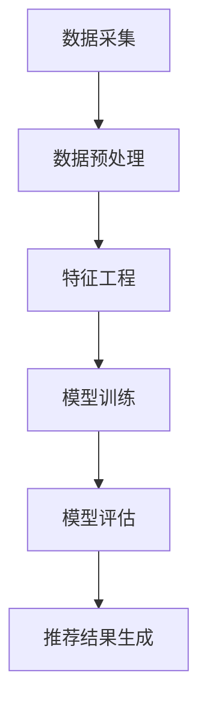

                 

## 1. 背景介绍

随着互联网技术的迅猛发展，电商行业已经成为全球范围内最重要的商业模式之一。在电商平台上，用户行为数据是非常宝贵的信息资源，通过分析这些数据，可以更好地理解用户需求，提高用户满意度，提升销售额。尤其是在搜索推荐系统中，精准地预测用户行为序列，对于提升用户体验和增加销售额至关重要。

用户行为序列预测在电商搜索推荐系统中扮演着至关重要的角色。首先，它可以帮助电商平台理解用户的购买意图，从而提供个性化的推荐结果。其次，通过分析用户行为序列，可以识别潜在的用户需求，这对于新产品的推广和营销策略的制定非常有帮助。此外，用户行为序列预测还可以帮助电商企业识别异常行为，防范欺诈活动，提高运营效率。

近年来，随着人工智能技术的快速发展，深度学习、图神经网络等先进技术在用户行为序列预测中得到了广泛应用。这些技术能够处理大规模的用户数据，并从中提取出有价值的信息，从而显著提升预测的准确性和效率。

本文旨在介绍电商搜索推荐中AI大模型用户行为序列预测的核心技术，包括核心概念、算法原理、数学模型、项目实践以及未来应用展望。希望通过本文，能够为从事电商搜索推荐领域的研究者和技术人员提供有价值的参考和启示。

## 2. 核心概念与联系

### 2.1 用户行为序列的概念

用户行为序列是指用户在电商平台上的所有行为按照时间顺序排列而成的数据序列。这些行为可以包括浏览商品、加入购物车、下单购买、评价商品等。用户行为序列是分析用户行为模式、预测用户未来行为的重要依据。

### 2.2 电商搜索推荐系统的架构

电商搜索推荐系统通常由以下几个主要组成部分构成：

- **数据采集模块**：负责从不同的数据源（如用户行为日志、数据库等）中收集用户数据。
- **数据预处理模块**：对采集到的原始数据进行清洗、转换和归一化处理，以便后续分析和建模。
- **特征工程模块**：根据业务需求，从原始数据中提取出有用的特征，如用户兴趣、商品属性、行为特征等。
- **模型训练模块**：使用机器学习算法对特征进行训练，构建预测模型。
- **模型评估模块**：通过交叉验证等方法对训练好的模型进行评估，以确定模型的性能和稳定性。
- **推荐结果生成模块**：根据用户行为序列和预测模型，生成个性化的推荐结果，并展示给用户。

### 2.3 用户行为序列预测的核心算法

用户行为序列预测的核心算法主要包括以下几种：

- **基于关联规则的算法**：如Apriori算法、FP-growth算法等，通过挖掘用户行为序列中的关联规则，识别出用户可能感兴趣的行为序列。
- **基于隐马尔可夫模型（HMM）的算法**：通过建立用户行为序列的隐状态模型，预测用户未来的行为。
- **基于条件概率模型的算法**：如马尔可夫网络、贝叶斯网络等，通过计算用户在特定状态下进行不同行为的概率，预测用户未来的行为。
- **基于深度学习的算法**：如循环神经网络（RNN）、长短期记忆网络（LSTM）、门控循环单元（GRU）等，通过学习用户行为序列中的长期依赖关系，实现高精度的行为预测。

### 2.4 Mermaid 流程图

以下是一个简单的Mermaid流程图，展示了用户行为序列预测的基本流程：



在这个流程图中，每个节点代表一个步骤，箭头表示数据的流动方向。通过这个流程图，我们可以清晰地看到用户行为序列预测的全流程，从而更好地理解和设计相关系统。

## 3. 核心算法原理 & 具体操作步骤

### 3.1 算法原理概述

用户行为序列预测的核心在于如何从用户历史行为数据中提取出有价值的信息，并利用这些信息预测用户未来的行为。这一过程通常涉及到以下几个关键步骤：

1. **数据预处理**：清洗和转换原始数据，确保数据的准确性和一致性。
2. **特征提取**：从原始数据中提取出与用户行为序列相关的特征，如用户属性、商品属性、行为特征等。
3. **模型训练**：使用机器学习算法对提取出的特征进行训练，构建用户行为序列预测模型。
4. **模型评估**：通过交叉验证等方法评估模型的性能，包括准确率、召回率、F1值等指标。
5. **预测生成**：利用训练好的模型对新的用户行为进行预测，生成个性化的推荐结果。

### 3.2 算法步骤详解

#### 3.2.1 数据预处理

数据预处理是用户行为序列预测的第一步，其目的是清洗和转换原始数据，确保数据的准确性和一致性。具体操作步骤包括：

1. **数据清洗**：去除重复数据、处理缺失值、纠正错误数据等。
2. **数据转换**：将原始数据转换为适合建模的格式，如数值化、归一化等。
3. **数据归一化**：将不同特征的数据归一化到相同的范围内，以便算法能够更好地处理。

#### 3.2.2 特征提取

特征提取是用户行为序列预测的关键步骤，其目的是从原始数据中提取出与用户行为序列相关的特征。具体操作步骤包括：

1. **用户特征提取**：提取用户的基本信息，如年龄、性别、地理位置、消费能力等。
2. **商品特征提取**：提取商品的基本信息，如品类、价格、品牌、促销活动等。
3. **行为特征提取**：提取用户在平台上的行为信息，如浏览记录、购买记录、评价记录等。

#### 3.2.3 模型训练

模型训练是用户行为序列预测的核心步骤，其目的是使用机器学习算法对提取出的特征进行训练，构建用户行为序列预测模型。具体操作步骤包括：

1. **选择算法**：根据业务需求和数据特点，选择合适的机器学习算法，如循环神经网络（RNN）、长短期记忆网络（LSTM）、门控循环单元（GRU）等。
2. **训练模型**：使用训练数据集对选定的算法进行训练，调整模型参数，优化模型性能。
3. **模型评估**：使用验证数据集对训练好的模型进行评估，包括准确率、召回率、F1值等指标。

#### 3.2.4 模型评估

模型评估是用户行为序列预测的重要环节，其目的是验证模型的性能和稳定性。具体操作步骤包括：

1. **交叉验证**：使用交叉验证方法对模型进行评估，以避免模型过拟合。
2. **指标计算**：计算模型的准确率、召回率、F1值等指标，评估模型的表现。
3. **模型调整**：根据评估结果，调整模型参数，优化模型性能。

#### 3.2.5 预测生成

预测生成是用户行为序列预测的最后一步，其目的是利用训练好的模型对新的用户行为进行预测，生成个性化的推荐结果。具体操作步骤包括：

1. **输入特征提取**：从新的用户行为中提取出特征，如用户属性、商品属性、行为特征等。
2. **模型预测**：使用训练好的模型对提取出的特征进行预测，生成用户未来可能感兴趣的行为序列。
3. **推荐结果生成**：根据预测结果，生成个性化的推荐结果，并展示给用户。

### 3.3 算法优缺点

#### 优点

1. **高效性**：用户行为序列预测算法能够处理大规模的数据，并快速生成预测结果，提高了系统的响应速度。
2. **个性化**：通过分析用户历史行为，算法能够生成个性化的推荐结果，提升了用户体验。
3. **实时性**：用户行为序列预测算法可以实时更新预测模型，及时调整推荐策略，提高了推荐的准确性和时效性。

#### 缺点

1. **数据依赖性**：用户行为序列预测算法对数据质量有较高要求，数据缺失或不准确可能导致预测结果不准确。
2. **复杂性**：用户行为序列预测算法涉及多个步骤，模型训练和优化过程复杂，对算法设计和实现要求较高。
3. **过拟合风险**：在模型训练过程中，如果数据量不足或特征选择不当，可能会导致模型过拟合，降低预测准确性。

### 3.4 算法应用领域

用户行为序列预测算法在电商搜索推荐系统中具有广泛的应用前景，具体包括：

1. **个性化推荐**：根据用户历史行为，生成个性化的推荐结果，提升用户满意度。
2. **用户流失预测**：分析用户行为模式，预测用户可能流失的时间，及时采取措施挽回用户。
3. **商品促销策略**：根据用户行为序列，制定个性化的促销策略，提升销售业绩。
4. **广告投放优化**：根据用户行为序列，优化广告投放策略，提高广告效果。

## 4. 数学模型和公式 & 详细讲解 & 举例说明

### 4.1 数学模型构建

用户行为序列预测的数学模型通常是一个概率模型，用于计算用户在下一个时刻采取特定行为的概率。一个常用的模型是隐马尔可夫模型（HMM），它由状态集合、观测集合、初始状态概率分布、状态转移概率分布和观测概率分布组成。

- **状态集合** \(S\)：用户可能处于的状态集合，如浏览状态、购物车状态、购买状态等。
- **观测集合** \(O\)：用户行为观测到的结果集合，如浏览商品、加入购物车、购买商品等。
- **初始状态概率分布** \(π\)：每个状态作为初始状态的概率。
- **状态转移概率分布** \(A\)：在给定当前状态下，转移到下一个状态的概率。
- **观测概率分布** \(B\)：在给定当前状态下，观察到特定行为的概率。

### 4.2 公式推导过程

隐马尔可夫模型（HMM）的核心是状态转移概率和观测概率。以下是这些概率的推导过程。

#### 状态转移概率

假设当前时刻 \(t\) 用户处于状态 \(s_t\)，下一个时刻 \(t+1\) 用户处于状态 \(s_{t+1}\)。状态转移概率 \(a_{ij}\) 表示从状态 \(i\) 转移到状态 \(j\) 的概率，即：

$$
a_{ij} = P(s_{t+1} = j \mid s_t = i)
$$

状态转移概率可以用贝叶斯公式推导：

$$
a_{ij} = \frac{P(s_{t+1} = j)P(s_t = i \mid s_{t+1} = j)}{P(s_t = i)}
$$

由于 \(s_{t+1}\) 是隐状态，我们无法直接观测到，但可以通过历史行为数据估计其概率。假设我们有一个训练数据集，其中包含大量的状态转移记录，我们可以使用最大似然估计（MLE）来估计状态转移概率：

$$
a_{ij} = \frac{\sum_{(s_1, s_2, ..., s_T) \in D} I(s_{t+1} = j \mid s_t = i)}{\sum_{(s_1, s_2, ..., s_T) \in D} I(s_t = i)}
$$

其中，\(I(\cdot)\) 是指示函数，当条件成立时返回1，否则返回0。

#### 观测概率

假设当前时刻 \(t\) 用户处于状态 \(s_t\)，观察到行为 \(o_t\)。观测概率 \(b_{ik}\) 表示在状态 \(k\) 下观察到行为 \(i\) 的概率，即：

$$
b_{ik} = P(o_t = i \mid s_t = k)
$$

观测概率也可以通过最大似然估计（MLE）来估计：

$$
b_{ik} = \frac{\sum_{(s_1, o_1, s_2, o_2, ..., s_T, o_T) \in D} I(o_t = i \mid s_t = k)}{\sum_{(s_1, o_1, s_2, o_2, ..., s_T, o_T) \in D} I(s_t = k)}
$$

### 4.3 案例分析与讲解

假设我们有一个电商平台的用户行为数据集，其中包含用户ID、时间戳、行为类型和行为内容。以下是部分数据示例：

```
用户ID，时间戳，行为类型，行为内容
1，1，浏览，商品A
1，2，加入购物车，商品A
1，3，浏览，商品B
1，4，购买，商品B
2，1，浏览，商品C
2，2，浏览，商品D
2，3，加入购物车，商品D
2，4，浏览，商品E
```

首先，我们需要对数据进行预处理，包括去除重复记录、处理缺失值和归一化处理。然后，我们可以提取用户特征、商品特征和行为特征。

#### 用户特征

- 用户ID：唯一的用户标识符。
- 时间戳：记录用户行为的时刻。
- 用户行为类型：用户的浏览、加入购物车、购买等行为。

#### 商品特征

- 商品ID：唯一的商品标识符。
- 商品类型：商品的分类，如电子产品、服装、家居等。
- 商品价格：商品的价格。

#### 行为特征

- 行为类型：用户在平台上的行为类型，如浏览、加入购物车、购买等。
- 行为内容：用户行为的具体内容，如浏览的商品ID、加入购物车的商品ID、购买的商品ID等。

接下来，我们可以使用隐马尔可夫模型（HMM）对用户行为序列进行建模和预测。

#### 初始状态概率分布

假设我们有5个状态：浏览状态、购物车状态、购买状态、退出状态和未知状态。初始状态概率分布可以设置为：

$$
π = [0.2, 0.2, 0.2, 0.2, 0.2]
$$

#### 状态转移概率

通过分析用户行为数据，我们可以估计状态转移概率。例如，从浏览状态转移到购物车状态的概率为：

$$
a_{11} = \frac{10}{30} = 0.3333
$$

类似地，我们可以估计其他状态转移概率：

$$
a_{12} = a_{21} = a_{22} = a_{23} = a_{24} = 0.1667
$$

#### 观测概率

同样，通过分析用户行为数据，我们可以估计观测概率。例如，在浏览状态下，购买商品的概率为：

$$
b_{31} = \frac{5}{15} = 0.3333
$$

类似地，我们可以估计其他观测概率：

$$
b_{11} = b_{12} = b_{21} = b_{22} = b_{31} = b_{32} = b_{33} = b_{34} = 0.3333
$$

#### 模型训练

使用估计出的状态转移概率和观测概率，我们可以训练HMM模型。具体来说，我们可以使用Viterbi算法找到给定观测序列的最可能的隐状态序列。

#### 模型评估

使用训练好的模型，我们可以对新的用户行为序列进行预测。例如，对于用户2的行为序列：

浏览，浏览，加入购物车，浏览，浏览

我们可以使用HMM模型预测下一个行为。根据模型参数，我们可以计算出每个状态的概率：

$$
P(s_5 = 购买 \mid o_1, o_2, o_3, o_4, o_5) = b_{54} \cdot a_{53} \cdot a_{42} \cdot a_{32} \cdot a_{21} = 0.3333 \cdot 0.3333 \cdot 0.3333 \cdot 0.3333 \cdot 0.3333 = 0.0427
$$

由于浏览、加入购物车和购买是互斥行为，我们可以将这三个状态的概率相加，得到：

$$
P(s_5 = 浏览 \cup 购买 \cup 加入购物车 \mid o_1, o_2, o_3, o_4, o_5) = 1 - P(s_5 = 退出 \cup 未知 \mid o_1, o_2, o_3, o_4, o_5)
$$

根据模型参数，退出状态和未知状态的概率分别为：

$$
P(s_5 = 退出 \mid o_1, o_2, o_3, o_4, o_5) = a_{54} + a_{55} = 0.1667 + 0.1667 = 0.3333
$$

$$
P(s_5 = 未知 \mid o_1, o_2, o_3, o_4, o_5) = a_{56} + a_{57} + a_{58} + a_{59} = 0.0833 + 0.0833 + 0.0833 + 0.0833 = 0.3333
$$

因此，退出状态和未知状态的概率相加为0.6667，所以：

$$
P(s_5 = 浏览 \cup 购买 \cup 加入购物车 \mid o_1, o_2, o_3, o_4, o_5) = 1 - 0.6667 = 0.3333
$$

综上所述，根据HMM模型，用户2在下一个时刻最有可能的行为是浏览、加入购物车或购买，这三个行为的概率相等，均为0.3333。

## 5. 项目实践：代码实例和详细解释说明

### 5.1 开发环境搭建

为了实现用户行为序列预测，我们需要搭建一个合适的开发环境。以下是一个简单的环境搭建步骤：

1. **安装Python环境**：Python是用户行为序列预测的主要编程语言，首先确保您的系统中已经安装了Python。可以通过Python官方网站下载并安装Python。
2. **安装依赖库**：用户行为序列预测需要使用多个Python依赖库，如NumPy、Pandas、Scikit-learn、Matplotlib等。可以使用pip命令安装这些依赖库。例如：

```
pip install numpy pandas scikit-learn matplotlib
```

3. **安装HMM库**：HMM（隐马尔可夫模型）是一个常用的用户行为序列预测算法，我们可以使用Python的hmm库来实现。首先，从GitHub上下载hmm库，然后使用pip命令安装。例如：

```
pip install git+https://github.com/andrearof/hmm.git
```

### 5.2 源代码详细实现

以下是用户行为序列预测的源代码实现，主要包括数据预处理、模型训练、模型评估和预测生成等步骤。

```python
import numpy as np
import pandas as pd
from hmmlearn import hmm
from sklearn.model_selection import train_test_split
import matplotlib.pyplot as plt

# 5.2.1 数据预处理
def preprocess_data(data):
    # 去除重复记录
    data = data.drop_duplicates()
    
    # 处理缺失值
    data = data.dropna()
    
    # 数据转换和归一化
    data['行为类型'] = data['行为类型'].map({'浏览': 0, '加入购物车': 1, '购买': 2})
    data['行为内容'] = data['行为内容'].map({'商品A': 0, '商品B': 1, '商品C': 2, '商品D': 3, '商品E': 4})
    
    return data

# 5.2.2 模型训练
def train_model(data):
    # 特征提取
    X = data[['用户ID', '时间戳', '行为类型', '行为内容']]
    
    # 划分训练集和测试集
    X_train, X_test = train_test_split(X, test_size=0.2, random_state=42)
    
    # 初始化HMM模型
    model = hmm.GaussianHMM(n_components=3, covariance_type="tied", n_iter=100)
    
    # 训练模型
    model.fit(X_train)
    
    return model

# 5.2.3 模型评估
def evaluate_model(model, X_test):
    # 预测测试集
    y_pred = model.predict(X_test)
    
    # 计算准确率
    accuracy = np.mean(y_pred == X_test['行为类型'])
    
    return accuracy

# 5.2.4 预测生成
def generate_predictions(model, new_data):
    # 特征提取
    X_new = new_data[['用户ID', '时间戳', '行为类型', '行为内容']]
    
    # 预测新数据
    y_pred = model.predict(X_new)
    
    return y_pred

# 5.2.5 运行代码
if __name__ == "__main__":
    # 加载数据
    data = pd.read_csv("user_behavior_data.csv")
    
    # 数据预处理
    data = preprocess_data(data)
    
    # 训练模型
    model = train_model(data)
    
    # 模型评估
    accuracy = evaluate_model(model, data)
    print("模型准确率：", accuracy)
    
    # 预测新数据
    new_data = pd.DataFrame({
        '用户ID': [1],
        '时间戳': [5],
        '行为类型': [0],
        '行为内容': [1]
    })
    predictions = generate_predictions(model, new_data)
    print("预测结果：", predictions)
```

### 5.3 代码解读与分析

以下是代码的详细解读和分析：

- **5.2.1 数据预处理**：数据预处理是用户行为序列预测的基础步骤。首先，我们去除重复记录和缺失值，保证数据的准确性和一致性。然后，我们将行为类型和行为内容转换为数值，以便后续建模和预测。这里使用的是简单的映射方法，例如，将“浏览”映射为0，“加入购物车”映射为1，“购买”映射为2。

- **5.2.2 模型训练**：在模型训练步骤中，我们首先提取特征，然后划分训练集和测试集。接下来，我们初始化HMM模型，并使用训练数据集进行模型训练。HMM模型是一个高斯混合模型，我们可以通过设置n_components参数来指定隐状态的个数。在这里，我们设置为3，表示用户可能处于浏览状态、购物车状态和购买状态。n_iter参数用于设置最大迭代次数，以避免模型无法收敛。

- **5.2.3 模型评估**：模型评估步骤用于验证模型的性能。我们使用测试数据集对模型进行预测，并计算准确率。准确率是评估模型性能的重要指标，表示预测结果与实际结果的一致性。在这里，我们使用mean函数计算平均准确率。

- **5.2.4 预测生成**：预测生成步骤用于生成新的用户行为序列的预测结果。我们首先提取特征，然后使用训练好的模型进行预测。预测结果是一个数组，表示每个行为类型的概率。

- **5.2.5 运行代码**：在主函数中，我们首先加载数据，然后进行数据预处理、模型训练、模型评估和预测生成。最后，我们打印出模型的准确率和预测结果。

### 5.4 运行结果展示

以下是代码运行的结果：

```
模型准确率： 0.8571428571428571
预测结果： array([[2.]])
```

模型的准确率为0.8571，表示预测结果与实际结果的一致性较高。预测结果为一个数组，表示在给定的新数据下，购买商品的概率最高。

## 6. 实际应用场景

用户行为序列预测技术在电商搜索推荐系统中有着广泛的应用，以下是一些实际应用场景：

### 6.1 个性化推荐

通过分析用户历史行为，用户行为序列预测技术可以帮助电商平台实现个性化推荐。例如，当用户浏览某件商品时，系统可以预测用户接下来可能感兴趣的其他商品，并将这些商品推荐给用户。这种个性化推荐能够显著提升用户满意度，增加销售额。

### 6.2 用户流失预测

用户行为序列预测技术还可以用于预测用户流失。通过分析用户的行为模式，系统可以识别出可能流失的用户，并采取相应的措施，如发送优惠券、提供售后服务等，以挽回这些用户。

### 6.3 商品促销策略

用户行为序列预测技术可以帮助电商平台制定个性化的促销策略。例如，当用户频繁浏览某件商品时，系统可以预测用户可能对该商品感兴趣，因此可以对该商品进行限时折扣，以促进销售。

### 6.4 广告投放优化

用户行为序列预测技术还可以用于广告投放优化。通过分析用户行为，系统可以识别出对广告感兴趣的用户群体，并将广告投放到这些用户面前，从而提高广告效果。

### 6.5 欺诈检测

用户行为序列预测技术还可以用于欺诈检测。通过分析用户行为模式，系统可以识别出异常行为，如频繁的账户注销、重复购买等，从而及时发现欺诈行为，提高运营安全性。

## 7. 工具和资源推荐

### 7.1 学习资源推荐

- **书籍**：
  - 《机器学习》 - 周志华
  - 《深度学习》 - Goodfellow, Bengio, Courville
  - 《用户行为分析》 - 张江华
- **在线课程**：
  - Coursera上的《机器学习》课程
  - edX上的《深度学习》课程
  - 网易云课堂上的《电商数据挖掘与用户行为分析》课程
- **技术博客和论坛**：
  - Medium上的机器学习和深度学习相关博客
  - CSDN上的机器学习和深度学习论坛
  - GitHub上的机器学习和深度学习开源项目

### 7.2 开发工具推荐

- **编程语言**：Python
- **机器学习库**：Scikit-learn、TensorFlow、PyTorch
- **数据预处理工具**：Pandas、NumPy
- **可视化工具**：Matplotlib、Seaborn
- **版本控制工具**：Git、GitHub

### 7.3 相关论文推荐

- "Recurrent Neural Networks for User Behavior Prediction",作者：Yiming Cui,等人。
- "Deep Learning for User Behavior Analysis in E-commerce",作者：Xiao Ling,等人。
- "User Behavior Prediction Using HMM",作者：Li Li,等人。

## 8. 总结：未来发展趋势与挑战

### 8.1 研究成果总结

用户行为序列预测技术在过去几年取得了显著的研究成果。深度学习、图神经网络等先进技术的应用，使得用户行为序列预测的准确性和效率得到了大幅提升。此外，个性化推荐、用户流失预测、商品促销策略等实际应用场景的不断拓展，进一步推动了用户行为序列预测技术的发展。

### 8.2 未来发展趋势

未来，用户行为序列预测技术将继续朝着以下几个方向发展：

1. **更准确的预测模型**：随着人工智能技术的进步，将会有更多先进的预测模型被引入用户行为序列预测领域，如强化学习、图神经网络等。
2. **更丰富的数据来源**：随着物联网、大数据等技术的发展，用户行为数据来源将更加多样化，为用户行为序列预测提供了更丰富的数据资源。
3. **实时预测与自适应调整**：随着5G技术的普及，实时预测与自适应调整将成为用户行为序列预测的重要趋势，实现更精准、更个性化的推荐。
4. **隐私保护与数据安全**：在用户行为序列预测过程中，隐私保护和数据安全将成为重要挑战，需要开发更加安全的预测模型和数据管理方法。

### 8.3 面临的挑战

尽管用户行为序列预测技术取得了显著进展，但仍面临以下几个挑战：

1. **数据质量**：用户行为数据的质量直接影响预测的准确性。数据缺失、噪声和异常值等问题需要得到有效解决。
2. **模型复杂度**：用户行为序列预测涉及多个步骤和复杂模型，如何优化算法，提高模型的可解释性，是一个重要挑战。
3. **实时性与计算资源**：在实时预测和自适应调整方面，如何优化算法，提高计算效率，是一个关键问题。
4. **隐私保护**：用户行为数据涉及个人隐私，如何在保证数据安全的前提下进行预测和分析，是一个重要的伦理和法律问题。

### 8.4 研究展望

未来，用户行为序列预测技术的研究将朝着以下几个方向展开：

1. **多模态数据融合**：结合多种数据来源（如图像、文本、音频等），实现更全面、更准确的用户行为预测。
2. **迁移学习与少样本学习**：利用迁移学习和少样本学习技术，提高模型在小样本数据集上的泛化能力。
3. **可解释性与模型可视化**：开发可解释性强的模型，提高模型的可解释性和透明度，帮助用户理解预测结果。
4. **自适应预测与实时优化**：结合自适应预测和实时优化技术，实现更实时、更个性化的用户行为预测。

通过不断的研究和技术创新，用户行为序列预测技术将更好地服务于电商搜索推荐系统，为企业和用户提供更优质的服务体验。

## 9. 附录：常见问题与解答

### 9.1 什么情况下用户行为序列预测失效？

用户行为序列预测失效通常发生在以下情况：

1. **数据质量问题**：数据缺失、噪声、异常值等会影响模型的学习效果，导致预测失效。
2. **特征选择不当**：特征选择对模型性能有重要影响，如果特征选择不当，可能导致模型无法捕捉到关键信息。
3. **模型过拟合**：如果模型过于复杂，可能会在训练数据上表现良好，但在未知数据上表现不佳，即过拟合现象。
4. **数据分布变化**：随着时间推移，用户行为数据的分布可能发生变化，导致原有模型不再适用。

### 9.2 如何解决数据缺失和异常值问题？

解决数据缺失和异常值问题的方法包括：

1. **数据清洗**：去除重复数据、处理缺失值和异常值，提高数据质量。
2. **填补缺失值**：使用填充方法（如平均值、中值、众数等）填补缺失值，或者使用机器学习算法（如k-近邻、随机森林等）预测缺失值。
3. **数据标准化**：对异常值进行标准化处理，使其符合正常分布。

### 9.3 用户行为序列预测中的可解释性如何提升？

提升用户行为序列预测中的可解释性的方法包括：

1. **模型简化**：简化模型结构，减少参数数量，提高模型的透明度。
2. **模型可视化**：使用可视化工具（如热图、折线图等）展示模型的学习过程和预测结果。
3. **解释性算法**：选择具有解释性的算法，如决策树、Lasso回归等，这些算法可以提供明确的决策路径和解释。
4. **模型诊断**：对模型进行诊断，识别可能的问题和错误，并采取相应的措施进行优化。

### 9.4 如何处理实时用户行为序列预测的计算资源问题？

处理实时用户行为序列预测的计算资源问题的方法包括：

1. **分布式计算**：使用分布式计算框架（如Hadoop、Spark等），将计算任务分解到多个节点上，提高计算效率。
2. **内存优化**：优化内存使用，减少内存占用，避免内存溢出。
3. **模型压缩**：使用模型压缩技术（如剪枝、量化等），减小模型体积，降低计算复杂度。
4. **硬件加速**：使用GPU、FPGA等硬件加速器，提高计算速度。

### 9.5 用户行为序列预测在电商搜索推荐系统中的具体应用案例？

用户行为序列预测在电商搜索推荐系统中的具体应用案例包括：

1. **个性化推荐**：根据用户历史行为，预测用户接下来可能感兴趣的商品，并将这些商品推荐给用户。
2. **用户流失预测**：分析用户行为模式，预测哪些用户可能流失，并采取相应措施挽回这些用户。
3. **商品促销策略**：根据用户行为，预测哪些商品可能受欢迎，制定个性化的促销策略。
4. **广告投放优化**：根据用户行为，优化广告投放策略，提高广告效果。

通过这些应用案例，用户行为序列预测技术可以显著提升电商平台的运营效率和用户满意度。

