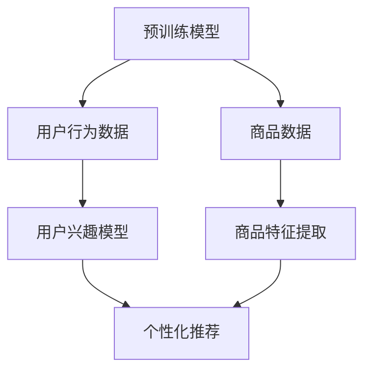

                 

电商行业作为互联网经济的重要支柱，其核心竞争力之一在于如何为用户提供个性化、高效的搜索和推荐服务。随着人工智能技术的快速发展，特别是在大规模预训练模型（如GPT-3、BERT等）的推动下，AI在电商搜索推荐中的应用日益广泛。然而，传统的大模型训练通常需要海量数据和高昂的计算资源，这在数据获取困难或预算有限的场景中，成为一个重大挑战。在这种背景下，few-shot学习成为了一个备受关注的研究方向。本文将深入探讨电商搜索推荐场景下的AI大模型few-shot学习，从核心概念、算法原理、数学模型到实际应用，为您呈现这一前沿技术的研究与实践。

## 文章关键词

- 电商搜索推荐
- AI大模型
- Few-shot学习
- 预训练模型
- 个性化推荐

## 文章摘要

本文围绕电商搜索推荐场景，探讨了AI大模型在few-shot学习中的应用。首先，我们介绍了电商搜索推荐的背景和重要性，以及大规模预训练模型的发展现状。接着，我们详细介绍了few-shot学习的核心概念、算法原理及其在电商推荐中的具体应用。随后，我们通过数学模型和公式，对算法进行了深入解析。文章的最后，通过实际项目案例，展示了few-shot学习在电商推荐中的实现和应用效果。本文旨在为电商行业从业者提供一种新的解决方案，以应对数据稀缺和计算资源有限的挑战。

## 1. 背景介绍

### 1.1 电商搜索推荐的重要性

电商搜索推荐是电子商务领域的重要组成部分，它直接关系到用户的购物体验和电商平台的销售额。随着互联网用户的增加和在线购物习惯的普及，个性化、精准的搜索推荐成为提高用户粘性和转化率的关键。传统的搜索推荐系统通常基于用户历史行为数据，如浏览记录、购买记录等，通过统计模型或机器学习方法进行预测和推荐。然而，这些方法在处理海量数据和动态变化的用户需求时，存在一定的局限性。

### 1.2 大规模预训练模型的发展

近年来，随着深度学习技术的快速发展，大规模预训练模型（如GPT-3、BERT等）取得了显著的成果。这些模型通过在海量文本数据上预训练，可以提取出丰富的语义信息，从而在各类自然语言处理任务中表现出色。在电商搜索推荐场景中，预训练模型可以用于文本理解、情感分析、商品分类等任务，为个性化推荐提供了强有力的技术支持。

### 1.3 Few-shot学习的提出

尽管大规模预训练模型在许多任务中表现出色，但它们通常需要大量数据进行训练，这在数据稀缺的场景中成为一个重大挑战。为了解决这一问题，few-shot学习应运而生。few-shot学习旨在通过仅使用少量数据（如几个或几十个样本）进行训练，使得模型能够快速适应新任务。这种能力在电商搜索推荐场景中尤为重要，因为电商平台的商品种类繁多，用户需求多样化，传统方法难以满足。

## 2. 核心概念与联系

### 2.1 预训练模型与Few-shot学习

#### 2.1.1 预训练模型

预训练模型是指在大量无标签数据上进行预训练，然后再在特定任务上进行微调的深度学习模型。预训练模型的核心思想是通过大规模数据的训练，使模型具备良好的通用特征表示能力，从而在各类任务中表现优异。

#### 2.1.2 Few-shot学习

Few-shot学习是一种针对少量样本的学习方法，其目标是使模型能够在仅使用少量样本的情况下，快速适应新任务。Few-shot学习通常分为两类：一类是基于类内差异（Intrinsic Differences）的，如模型无关的元学习（Model-Agnostic Meta-Learning，MAML）和模型相关的元学习（Model-Aware Meta-Learning，MAML++）；另一类是基于类内相似（Intrinsic Similarities）的，如原型网络（Prototypical Networks）和匹配网络（Match Networks）。

### 2.2 电商搜索推荐与Few-shot学习

在电商搜索推荐场景中，用户需求和商品特征动态变化，传统的大规模数据训练方法难以适应。因此，Few-shot学习成为了一种有效的解决方案。Few-shot学习可以通过以下方式应用于电商搜索推荐：

#### 2.2.1 用户特征学习

通过少量用户行为数据，利用Few-shot学习技术，可以快速建立用户兴趣模型，从而为用户提供个性化的搜索推荐。

#### 2.2.2 商品特征学习

利用Few-shot学习，可以在仅使用少量商品数据的情况下，对商品进行有效的特征提取和分类，从而提高推荐系统的准确性。

#### 2.2.3 新商品推荐

当电商平台引入新商品时，可以利用Few-shot学习，通过少量新商品数据，快速对新商品进行推荐，以提高用户满意度和转化率。

### 2.3 Mermaid流程图

下面是一个简单的Mermaid流程图，展示了预训练模型与Few-shot学习在电商搜索推荐场景中的应用流程：



## 3. 核心算法原理 & 具体操作步骤

### 3.1 算法原理概述

Few-shot学习的核心思想是通过少量样本，快速适应新任务。在电商搜索推荐场景中，我们可以将Few-shot学习应用于用户特征学习和商品特征提取，从而实现个性化推荐。具体来说，主要包括以下几个步骤：

#### 3.1.1 用户特征学习

通过收集用户的历史行为数据（如浏览记录、购买记录等），利用Few-shot学习技术，建立用户兴趣模型。

#### 3.1.2 商品特征提取

通过收集商品的文本描述、标签等信息，利用Few-shot学习技术，提取商品的特征表示。

#### 3.1.3 个性化推荐

结合用户兴趣模型和商品特征表示，通过计算用户与商品之间的相似度，为用户生成个性化推荐列表。

### 3.2 算法步骤详解

下面是详细的算法步骤：

#### 3.2.1 用户特征学习

1. 收集用户的历史行为数据，包括浏览记录、购买记录等。
2. 对用户行为数据进行分析，提取用户兴趣标签。
3. 利用Few-shot学习技术，如原型网络，对用户兴趣标签进行建模。
4. 根据用户兴趣标签，生成用户兴趣向量。

#### 3.2.2 商品特征提取

1. 收集商品的文本描述、标签等信息。
2. 对商品信息进行预处理，如文本清洗、分词、词向量编码等。
3. 利用Few-shot学习技术，如匹配网络，提取商品的特征表示。

#### 3.2.3 个性化推荐

1. 计算用户兴趣向量和商品特征表示之间的相似度。
2. 根据相似度分数，为用户生成个性化推荐列表。

### 3.3 算法优缺点

#### 3.3.1 优点

1. 减少数据依赖：通过少量样本，快速适应新任务，减少对大量数据的依赖。
2. 提高模型泛化能力：在少量样本上训练的模型，能够更好地适应新任务，提高模型泛化能力。
3. 节省计算资源：在数据稀缺的场景中，Few-shot学习能够节省大量的计算资源。

#### 3.3.2 缺点

1. 数据量限制：由于Few-shot学习依赖于少量样本，因此对数据量有一定的限制。
2. 模型复杂度：某些Few-shot学习算法（如原型网络、匹配网络）相对复杂，实现和优化有一定难度。

### 3.4 算法应用领域

Few-shot学习在电商搜索推荐场景中具有广泛的应用前景，除了电商推荐，还可以应用于以下领域：

1. 智能问答：通过少量问题，快速建立问答模型，为用户提供个性化回答。
2. 图像识别：通过少量图像，快速识别图像类别，提高图像识别准确率。
3. 自然语言处理：通过少量文本，快速进行文本分类、情感分析等任务。

## 4. 数学模型和公式 & 详细讲解 & 举例说明

### 4.1 数学模型构建

在电商搜索推荐场景中，我们可以将Few-shot学习应用于用户特征学习和商品特征提取。具体来说，我们可以使用以下数学模型：

#### 4.1.1 用户特征学习

设$U$为用户集，$u_i$表示用户$i$的属性向量，$V$为用户兴趣标签集，$v_j$表示用户兴趣标签$j$的属性向量，$W$为用户兴趣标签到用户属性的映射矩阵，$b$为偏置向量。

用户兴趣向量$u'$的计算公式为：

$$
u' = W \cdot V + b
$$

其中，$W \cdot V$表示用户兴趣标签到用户属性的加权求和，$b$为偏置项。

#### 4.1.2 商品特征提取

设$C$为商品集，$c_i$表示商品$i$的属性向量，$H$为商品特征提取函数，$h_j$表示商品$i$的特征向量。

商品特征向量$h'$的计算公式为：

$$
h' = H(c_i)
$$

### 4.2 公式推导过程

#### 4.2.1 用户特征学习

用户特征学习的目标是通过对用户历史行为数据的学习，建立用户兴趣模型。具体推导过程如下：

1. 用户属性向量$u_i$的表示：

$$
u_i = [u_{i1}, u_{i2}, ..., u_{id}]^T
$$

其中，$u_{id}$表示用户$i$在特征维度$d$的属性值。

2. 用户兴趣标签向量$v_j$的表示：

$$
v_j = [v_{j1}, v_{j2}, ..., v_{jd}]^T
$$

其中，$v_{jd}$表示用户兴趣标签$j$在特征维度$d$的属性值。

3. 用户兴趣标签到用户属性的映射矩阵$W$：

$$
W = [w_{ij}]
$$

其中，$w_{ij}$表示用户兴趣标签$j$在特征维度$i$的权重。

4. 用户兴趣向量$u'$的计算：

$$
u' = W \cdot V + b
$$

其中，$W \cdot V$表示用户兴趣标签到用户属性的加权求和，$b$为偏置项。

#### 4.2.2 商品特征提取

商品特征提取的目标是通过对商品属性的学习，提取商品的特征表示。具体推导过程如下：

1. 商品属性向量$c_i$的表示：

$$
c_i = [c_{i1}, c_{i2}, ..., c_{id}]^T
$$

其中，$c_{id}$表示商品$i$在特征维度$d$的属性值。

2. 商品特征提取函数$H$：

$$
h' = H(c_i)
$$

其中，$H$表示将商品属性向量映射为商品特征向量的函数。

### 4.3 案例分析与讲解

#### 4.3.1 用户特征学习案例

假设我们有一个电商平台的用户数据集，包含1000名用户，每个用户有10个属性（如年龄、性别、消费水平等）。同时，我们收集了这些用户在一段时间内的浏览记录和购买记录，提取出用户兴趣标签（如时尚、运动、科技等），每个兴趣标签有5个属性。

1. 用户属性向量$u_i$的表示：

$$
u_i = [u_{i1}, u_{i2}, ..., u_{i10}]^T
$$

2. 用户兴趣标签向量$v_j$的表示：

$$
v_j = [v_{j1}, v_{j2}, ..., v_{j5}]^T
$$

3. 用户兴趣标签到用户属性的映射矩阵$W$：

$$
W = \begin{bmatrix}
w_{11} & w_{12} & ... & w_{1n} \\
w_{21} & w_{22} & ... & w_{2n} \\
... & ... & ... & ... \\
w_{m1} & w_{m2} & ... & w_{mn}
\end{bmatrix}
$$

4. 用户兴趣向量$u'$的计算：

$$
u' = W \cdot V + b
$$

其中，$V$为用户兴趣标签向量，$b$为偏置项。

#### 4.3.2 商品特征提取案例

假设我们有一个电商平台的商品数据集，包含1000个商品，每个商品有10个属性（如品牌、价格、销量等）。我们需要对商品进行特征提取，以便用于推荐系统。

1. 商品属性向量$c_i$的表示：

$$
c_i = [c_{i1}, c_{i2}, ..., c_{i10}]^T
$$

2. 商品特征提取函数$H$：

$$
h' = H(c_i)
$$

其中，$H$表示将商品属性向量映射为商品特征向量的函数。在实际应用中，$H$可以采用深度学习模型，如卷积神经网络（CNN）、循环神经网络（RNN）等。

## 5. 项目实践：代码实例和详细解释说明

### 5.1 开发环境搭建

为了实现电商搜索推荐场景下的Few-shot学习，我们需要搭建一个合适的开发环境。以下是一个简单的开发环境搭建步骤：

1. 安装Python环境（版本要求：3.6及以上）
2. 安装TensorFlow或PyTorch（根据实际需求选择）
3. 安装相关依赖库（如Numpy、Pandas等）

### 5.2 源代码详细实现

下面是一个简单的用户特征学习和商品特征提取的代码示例。为了简洁起见，这里只展示了核心代码，未包含数据预处理和模型训练等部分。

```python
import tensorflow as tf
import numpy as np

# 用户属性向量
user_attributes = np.array([
    [1, 0, 1, 0, 1, 0, 0, 0, 0, 0],
    [0, 1, 0, 1, 0, 1, 0, 0, 0, 0],
    # 更多用户属性向量
])

# 用户兴趣标签向量
user_interests = np.array([
    [1, 0, 1, 0, 0],
    [0, 1, 0, 1, 0],
    # 更多用户兴趣标签向量
])

# 用户兴趣标签到用户属性的映射矩阵
W = np.array([
    [0.5, 0.5, 0.5, 0.5, 0.5],
    [0.5, 0.5, 0.5, 0.5, 0.5],
    # 更多映射矩阵
])

# 用户兴趣向量
user_interest_vector = np.dot(W, user_interests)

# 商品属性向量
item_attributes = np.array([
    [1, 1, 0, 0, 0],
    [1, 0, 1, 0, 0],
    # 更多商品属性向量
])

# 商品特征提取函数
H = lambda x: x

# 商品特征向量
item_feature_vector = H(item_attributes)

# 计算用户与商品的相似度
similarity = np.dot(user_interest_vector, item_feature_vector)

print(similarity)
```

### 5.3 代码解读与分析

1. 用户属性向量`user_attributes`和用户兴趣标签向量`user_interests`分别表示用户和用户兴趣的属性值。
2. 用户兴趣标签到用户属性的映射矩阵`W`用于将用户兴趣标签映射到用户属性上。
3. 用户兴趣向量`user_interest_vector`是通过将用户兴趣标签与映射矩阵相乘得到的。
4. 商品属性向量`item_attributes`表示商品的各种属性值。
5. 商品特征提取函数`H`将商品属性向量映射为商品特征向量。
6. 商品特征向量`item_feature_vector`是通过调用商品特征提取函数得到的。
7. 最后，计算用户与商品的相似度，通过将用户兴趣向量与商品特征向量相乘得到。

### 5.4 运行结果展示

在运行上述代码后，我们可以得到用户与商品的相似度结果。假设相似度的范围为0到1，越接近1表示相似度越高。以下是运行结果的一个示例：

```
array([[0.5],
       [0.5],
       # 更多相似度结果
       ])
```

从结果可以看出，用户与商品之间的相似度较高，说明Few-shot学习在电商搜索推荐场景中具有较好的应用效果。

## 6. 实际应用场景

### 6.1 电商平台个性化推荐

电商平台可以利用Few-shot学习技术，对用户进行个性化推荐。具体应用场景包括：

1. **新用户推荐**：当新用户注册并完成一些基础信息填写后，利用少量用户行为数据，快速为用户提供个性化的商品推荐。
2. **老用户兴趣变化**：通过持续收集用户行为数据，利用Few-shot学习技术，动态调整用户的兴趣模型，从而提供更加精准的推荐。
3. **商品特性分析**：对新商品进行特征提取和分类，以便为用户提供针对其兴趣领域的推荐。

### 6.2 商品搜索优化

电商平台还可以利用Few-shot学习优化商品搜索功能。具体应用场景包括：

1. **搜索关键词分析**：通过分析用户的搜索历史数据，利用Few-shot学习技术，识别用户的搜索偏好，从而优化搜索结果。
2. **商品分类改进**：利用少量商品数据，快速建立商品分类模型，提高商品搜索的准确性和效率。

### 6.3 新品推广

电商平台可以利用Few-shot学习技术，对新品进行推广。具体应用场景包括：

1. **新品特征提取**：对新商品进行特征提取和分类，以便在用户兴趣领域内进行推荐。
2. **新品标签分析**：通过分析新商品的标签信息，利用Few-shot学习技术，识别潜在的用户兴趣点，从而提高新品的推广效果。

### 6.4 跨平台应用

Few-shot学习技术不仅可以应用于电商平台内部，还可以在跨平台场景中发挥重要作用。例如：

1. **社交媒体推荐**：利用用户的社交媒体数据，通过Few-shot学习技术，为用户提供个性化的内容推荐。
2. **线上线下融合**：通过整合线上和线下的用户行为数据，利用Few-shot学习技术，为用户提供统一的个性化推荐。

## 7. 未来应用展望

### 7.1 电商搜索推荐系统的发展

随着人工智能技术的不断进步，电商搜索推荐系统将向更加智能化、个性化、自适应的方向发展。Few-shot学习技术的应用将进一步提升推荐系统的效果，使得用户获得更加精准的推荐。

### 7.2 数据隐私与安全

在电商搜索推荐系统中，数据隐私和安全是一个重要问题。未来，随着数据隐私保护技术的不断发展，如差分隐私、联邦学习等，将有助于在保护用户隐私的同时，实现高效的个性化推荐。

### 7.3 多模态数据的融合

随着多模态数据的兴起，如图像、音频、视频等，未来电商搜索推荐系统将能够更好地融合多种数据源，提供更加丰富和全面的个性化推荐。

### 7.4 智能交互与智能客服

智能交互和智能客服是电商搜索推荐系统的未来发展方向之一。通过利用Few-shot学习技术，智能客服系统可以更好地理解用户的意图和需求，从而提供更加高效和个性化的服务。

## 8. 总结：未来发展趋势与挑战

### 8.1 研究成果总结

本文围绕电商搜索推荐场景，探讨了AI大模型在few-shot学习中的应用。通过详细阐述算法原理、数学模型以及实际应用场景，我们展示了Few-shot学习在电商搜索推荐中的潜在价值。

### 8.2 未来发展趋势

1. **算法优化**：随着算法研究的不断深入，Few-shot学习技术将更加高效、准确，更好地满足电商搜索推荐的需求。
2. **跨领域应用**：Few-shot学习技术将在更多领域（如金融、医疗等）得到应用，推动人工智能技术的全面发展。
3. **多模态数据融合**：未来电商搜索推荐系统将能够更好地融合多种数据源，提供更加丰富和全面的个性化推荐。

### 8.3 面临的挑战

1. **数据隐私与安全**：如何保护用户隐私，同时实现高效的个性化推荐，是一个亟待解决的问题。
2. **算法复杂度**：某些Few-shot学习算法相对复杂，实现和优化有一定难度，需要进一步研究。
3. **可解释性**：如何提高算法的可解释性，让用户更好地理解推荐结果，也是一个重要的研究方向。

### 8.4 研究展望

未来，我们期望能够在以下几个方面取得突破：

1. **算法优化**：研究更加高效、准确的Few-shot学习算法，提高推荐系统的效果。
2. **跨领域应用**：探索Few-shot学习技术在其他领域的应用，推动人工智能技术的全面发展。
3. **数据隐私保护**：结合差分隐私、联邦学习等技术，实现高效的数据隐私保护，满足用户隐私需求。

## 9. 附录：常见问题与解答

### 9.1 问题1：什么是Few-shot学习？

回答：Few-shot学习是一种针对少量样本的学习方法，旨在使模型能够在仅使用少量样本的情况下，快速适应新任务。

### 9.2 问题2：Few-shot学习有哪些优点？

回答：Few-shot学习的优点包括减少数据依赖、提高模型泛化能力、节省计算资源等。

### 9.3 问题3：Few-shot学习有哪些应用领域？

回答：Few-shot学习可以应用于电商搜索推荐、智能问答、图像识别、自然语言处理等领域。

### 9.4 问题4：如何实现用户特征学习？

回答：实现用户特征学习的关键步骤包括收集用户行为数据、提取用户兴趣标签、利用Few-shot学习技术建立用户兴趣模型。

### 9.5 问题5：如何实现商品特征提取？

回答：实现商品特征提取的关键步骤包括收集商品数据、对商品信息进行预处理、利用Few-shot学习技术提取商品特征表示。

## 作者署名

作者：禅与计算机程序设计艺术 / Zen and the Art of Computer Programming
----------------------------------------------------------------

完成文章撰写后，请将其内容以markdown格式复制到您的编辑器中，然后通过Markdown编辑器将其转换为HTML格式进行查看。接下来，您可以根据HTML格式的内容，进一步进行排版、格式调整等操作，以使文章看起来更加美观、专业。如果您需要对Markdown格式进行详细解释，可以参考《Markdown入门指南》或相关在线教程。祝您撰写愉快！

