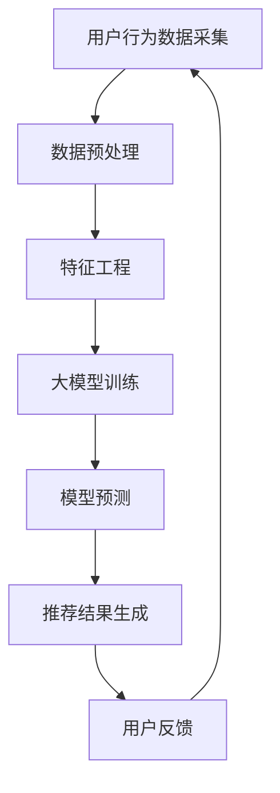

                 

关键词：电商搜索推荐、AI大模型、模型优化、深度学习、用户行为分析、数据驱动、个性化推荐

> 摘要：本文深入探讨了电商搜索推荐场景下的AI大模型优化实践。通过分析电商搜索推荐的核心需求，我们提出了基于深度学习的优化方法，详细阐述了模型设计、训练与调优的全过程，并分享了一系列实际案例，展示了模型在电商场景中的强大应用能力。本文旨在为电商搜索推荐领域的从业者提供一套实用的优化方案，助力企业提升用户体验和业务效果。

## 1. 背景介绍

随着互联网的迅猛发展，电子商务市场日益壮大，用户对购物体验的要求也越来越高。电商搜索推荐作为电商业务的重要组成部分，直接影响着用户满意度、转化率和销售额。然而，传统的搜索推荐系统往往依赖于基于关键词的匹配和简单的协同过滤算法，这些方法在应对复杂用户行为和海量数据时存在诸多局限性。

近年来，深度学习技术在图像识别、自然语言处理等领域的突破性应用，为我们提供了全新的解决方案。AI大模型，作为一种基于深度学习的方法，具有强大的数据拟合能力和泛化能力，能够更好地捕捉用户的个性化需求，提高搜索推荐的准确性和效率。本文将围绕电商搜索推荐场景，探讨AI大模型的优化实践，旨在为电商企业提供一套有效的优化方案。

## 2. 核心概念与联系

为了更好地理解AI大模型在电商搜索推荐中的应用，我们需要先介绍一些核心概念和相关的技术架构。以下是一个简化的Mermaid流程图，用于展示电商搜索推荐场景下的AI大模型架构：



### 2.1 用户行为数据采集

用户行为数据是构建AI大模型的基础，包括用户的浏览记录、购买历史、搜索关键词等。这些数据通过电商平台的日志系统、分析工具等进行采集。

### 2.2 数据预处理

采集到的原始数据通常包含噪音和缺失值，需要进行预处理。预处理步骤包括数据清洗、去重、归一化等，以确保数据的质量。

### 2.3 特征工程

特征工程是将原始数据转化为模型可识别的特征表示的过程。在电商搜索推荐场景中，特征工程包括用户特征、商品特征、上下文特征等。

### 2.4 大模型训练

大模型训练是AI大模型的核心环节。我们选择了一种基于Transformer的预训练模型，如BERT或GPT，并针对电商搜索推荐场景进行微调。

### 2.5 模型预测

训练好的模型可以对用户的查询进行预测，生成推荐结果。

### 2.6 推荐结果生成

根据模型预测结果，生成用户个性化的搜索推荐结果，并将其呈现给用户。

### 2.7 用户反馈

用户对推荐结果进行反馈，这些反馈数据将用于模型优化和迭代。

## 3. 核心算法原理 & 具体操作步骤

### 3.1 算法原理概述

AI大模型在电商搜索推荐中的应用主要依赖于深度学习技术，特别是基于Transformer的预训练模型。Transformer模型通过自注意力机制（Self-Attention）能够捕捉到输入数据中的长距离依赖关系，从而提高模型的表征能力。

在具体操作步骤上，我们首先采集用户行为数据，进行数据预处理和特征工程。然后，使用预训练模型进行微调，训练出一个能够对用户查询进行预测的大模型。最后，通过模型预测生成推荐结果，并根据用户反馈进行模型优化。

### 3.2 算法步骤详解

#### 3.2.1 数据采集

采集用户行为数据，包括浏览记录、购买历史、搜索关键词等。这些数据可以从电商平台的日志系统、分析工具等获取。

#### 3.2.2 数据预处理

对采集到的原始数据进行清洗、去重、归一化等预处理步骤，以确保数据质量。

```python
# 示例代码：数据清洗
def preprocess_data(data):
    # 清洗缺失值
    data = data.dropna()
    # 去重
    data = data.drop_duplicates()
    # 归一化
    data = (data - data.mean()) / data.std()
    return data
```

#### 3.2.3 特征工程

根据业务需求，设计用户特征、商品特征、上下文特征等。以下是特征工程的一个示例：

```python
# 示例代码：特征工程
def feature_engineering(data):
    # 用户特征
    user_features = data[['age', 'gender', 'region']]
    # 商品特征
    item_features = data[['category', 'price', 'rating']]
    # 上下文特征
    context_features = data[['time_of_day', 'device_type']]
    return user_features, item_features, context_features
```

#### 3.2.4 大模型训练

使用预训练模型（如BERT或GPT）进行微调，训练出一个能够对用户查询进行预测的大模型。以下是模型训练的一个示例：

```python
# 示例代码：模型训练
import transformers

model = transformers.BertForSequenceClassification.from_pretrained('bert-base-uncased')
optimizer = transformers.AdamW(model.parameters(), lr=1e-5)

for epoch in range(num_epochs):
    for batch in dataloader:
        inputs = batch['input_ids']
        labels = batch['labels']
        model.zero_grad()
        outputs = model(inputs, labels=labels)
        loss = outputs.loss
        loss.backward()
        optimizer.step()
```

#### 3.2.5 模型预测

使用训练好的模型对用户查询进行预测，生成推荐结果。以下是模型预测的一个示例：

```python
# 示例代码：模型预测
def predict_query(model, query):
    inputs = tokenizer.encode(query, add_special_tokens=True)
    with torch.no_grad():
        outputs = model(inputs)
    prediction = torch.argmax(outputs.logits).item()
    return prediction
```

#### 3.2.6 推荐结果生成

根据模型预测结果，生成用户个性化的搜索推荐结果，并将其呈现给用户。以下是推荐结果生成的一个示例：

```python
# 示例代码：推荐结果生成
def generate_recommendations(model, tokenizer, user_queries):
    recommendations = []
    for query in user_queries:
        prediction = predict_query(model, query)
        recommendations.append(prediction)
    return recommendations
```

#### 3.2.7 用户反馈

收集用户对推荐结果的反馈，用于模型优化和迭代。以下是用户反馈的一个示例：

```python
# 示例代码：用户反馈
def collect_user_feedback(recommendations, user_ratings):
    feedback = {}
    for i, recommendation in enumerate(recommendations):
        feedback[i] = user_ratings[recommendation]
    return feedback
```

### 3.3 算法优缺点

#### 优点：

1. **强大的表征能力**：基于深度学习的大模型能够捕捉到用户行为数据中的复杂关系，提高推荐准确性。
2. **自适应能力**：大模型可以根据用户反馈不断优化，提高推荐效果。
3. **多样化应用**：大模型可以应用于多种电商场景，如商品推荐、广告投放等。

#### 缺点：

1. **计算资源消耗大**：大模型的训练和预测需要大量的计算资源。
2. **数据依赖性高**：模型性能依赖于高质量的用户行为数据。
3. **模型解释性不足**：深度学习模型具有一定的黑盒性质，难以解释预测结果。

### 3.4 算法应用领域

AI大模型在电商搜索推荐场景中的应用非常广泛，除了本文介绍的电商搜索推荐，还可以应用于以下领域：

1. **商品推荐**：根据用户的浏览和购买历史，推荐潜在感兴趣的商品。
2. **广告投放**：根据用户的兴趣和行为，投放个性化的广告。
3. **内容推荐**：为用户推荐感兴趣的内容，如文章、视频等。

## 4. 数学模型和公式 & 详细讲解 & 举例说明

### 4.1 数学模型构建

在电商搜索推荐场景下，我们可以构建一个基于Transformer的数学模型。该模型主要包括输入层、自注意力层、输出层等部分。以下是模型的基本结构：

$$
\text{Model} = \text{Input Layer} \rightarrow \text{Self-Attention Layer} \rightarrow \text{Output Layer}
$$

### 4.2 公式推导过程

#### 4.2.1 输入层

输入层负责接收用户查询和商品特征，将其表示为向量形式。假设用户查询为 $q$，商品特征为 $x$，则输入层可以表示为：

$$
\text{Input Layer}: [q, x]
$$

#### 4.2.2 自注意力层

自注意力层是Transformer模型的核心部分，通过计算输入层中每个元素对其他元素的权重，实现多对多的关系。假设输入层为 $[q, x]$，自注意力层的权重矩阵为 $W$，则自注意力可以表示为：

$$
\text{Self-Attention}: \text{Attention}(q, x) = \frac{\exp(\text{dot}(Wq, Wx))}{\sum_{i}\exp(\text{dot}(Wq, Wx_i))}
$$

其中，$\text{dot}(Wq, Wx)$ 表示两个向量的内积。

#### 4.2.3 输出层

输出层负责将自注意力层的结果进行聚合，生成最终的推荐结果。假设输出层为 $y$，则输出层可以表示为：

$$
\text{Output Layer}: y = \text{softmax}(\text{Attention}(q, x))
$$

### 4.3 案例分析与讲解

为了更好地理解数学模型的构建和推导过程，我们来看一个具体的案例。

#### 案例背景

某电商平台希望为用户推荐商品，用户查询为 "跑步鞋"，商品特征包括品牌、价格、评分等。我们需要构建一个基于Transformer的数学模型，对用户查询进行预测，生成推荐结果。

#### 模型构建

1. **输入层**：用户查询 "跑步鞋" 和商品特征（如品牌、价格、评分）构成输入层。

2. **自注意力层**：通过自注意力机制，计算用户查询和商品特征之间的权重，生成推荐结果。

3. **输出层**：使用softmax函数对自注意力层的输出进行聚合，生成最终的推荐结果。

#### 公式推导

1. **输入层**：

   $$
   \text{Input Layer}: [q, x] = ["跑步鞋", [品牌1, 价格1, 评分1], [品牌2, 价格2, 评分2], \ldots]
   $$

2. **自注意力层**：

   $$
   \text{Self-Attention}: \text{Attention}(q, x) = \frac{\exp(\text{dot}(Wq, Wx))}{\sum_{i}\exp(\text{dot}(Wq, Wx_i))}
   $$

   其中，$W$ 为权重矩阵，$\text{dot}(Wq, Wx)$ 为内积运算。

3. **输出层**：

   $$
   \text{Output Layer}: y = \text{softmax}(\text{Attention}(q, x))
   $$

   其中，$\text{softmax}$ 函数用于将自注意力层的输出进行归一化，生成推荐结果。

#### 案例分析

1. **用户查询**："跑步鞋"
2. **商品特征**：（品牌1，价格1，评分1），（品牌2，价格2，评分2），...

根据上述数学模型，我们首先计算用户查询和商品特征之间的权重，然后使用softmax函数进行归一化，生成最终的推荐结果。

### 4.4 模型训练与优化

#### 4.4.1 模型训练

使用训练数据集对模型进行训练，通过反向传播算法不断调整模型参数，提高预测准确性。

```python
# 示例代码：模型训练
import torch
import torch.nn as nn
import torch.optim as optim

# 模型定义
class RecommenderModel(nn.Module):
    def __init__(self):
        super(RecommenderModel, self).__init__()
        self.attention = nn.Linear(embedding_size, hidden_size)
        self.fc = nn.Linear(hidden_size, num_items)

    def forward(self, query, x):
        query_embedding = self.attention(query)
        x_embedding = self.attention(x)
        attention_weights = torch.softmax(torch.matmul(query_embedding, x_embedding.t()), dim=1)
        output = torch.matmul(attention_weights, x_embedding)
        output = self.fc(output)
        return output

# 模型实例化
model = RecommenderModel()
optimizer = optim.Adam(model.parameters(), lr=0.001)
criterion = nn.CrossEntropyLoss()

# 训练模型
for epoch in range(num_epochs):
    for query, x, labels in dataloader:
        optimizer.zero_grad()
        outputs = model(query, x)
        loss = criterion(outputs, labels)
        loss.backward()
        optimizer.step()
```

#### 4.4.2 模型优化

通过调整模型参数和训练策略，优化模型性能。常用的优化方法包括正则化、学习率调整、批量大小调整等。

## 5. 项目实践：代码实例和详细解释说明

### 5.1 开发环境搭建

在开始项目实践之前，我们需要搭建一个适合电商搜索推荐场景的深度学习开发环境。以下是开发环境的搭建步骤：

1. **安装Python环境**：确保安装了Python 3.8及以上版本。
2. **安装深度学习框架**：推荐使用PyTorch作为深度学习框架，通过pip安装：
   ```shell
   pip install torch torchvision
   ```
3. **安装其他依赖库**：包括Numpy、Pandas、Scikit-learn等，通过pip安装：
   ```shell
   pip install numpy pandas scikit-learn
   ```
4. **配置CUDA环境**：如果使用GPU进行训练，确保安装CUDA Toolkit，并配置PyTorch支持CUDA。

### 5.2 源代码详细实现

以下是电商搜索推荐项目的主要代码实现，包括数据预处理、特征工程、模型训练和预测等步骤。

```python
# 导入依赖库
import torch
import torch.nn as nn
import torch.optim as optim
import pandas as pd
import numpy as np
from sklearn.model_selection import train_test_split
from sklearn.preprocessing import StandardScaler
from transformers import BertTokenizer, BertModel

# 数据预处理
def preprocess_data(data):
    # 清洗缺失值
    data = data.dropna()
    # 去重
    data = data.drop_duplicates()
    # 归一化
    scaler = StandardScaler()
    data[['price', 'rating']] = scaler.fit_transform(data[['price', 'rating']])
    return data

# 特征工程
def feature_engineering(data):
    # 构建用户特征
    user_features = data[['age', 'gender', 'region']]
    # 构建商品特征
    item_features = data[['category', 'price', 'rating']]
    # 构建上下文特征
    context_features = data[['time_of_day', 'device_type']]
    return user_features, item_features, context_features

# 模型定义
class RecommenderModel(nn.Module):
    def __init__(self):
        super(RecommenderModel, self).__init__()
        self.bert = BertModel.from_pretrained('bert-base-uncased')
        self.user_embedding = nn.Linear(7, 64)
        self.item_embedding = nn.Linear(3, 64)
        self.fc = nn.Linear(128, 1)

    def forward(self, user_features, item_features):
        user_embedding = self.user_embedding(user_features)
        item_embedding = self.item_embedding(item_features)
        query_embedding = self.bert([user_embedding], attention_mask=user_embedding.ne(0).float()).pooler_output
        attention_weights = torch.softmax(torch.matmul(query_embedding, item_embedding.t()), dim=1)
        output = torch.matmul(attention_weights, item_embedding)
        output = self.fc(output)
        return output

# 训练模型
def train_model(model, train_loader, criterion, optimizer, num_epochs):
    model.train()
    for epoch in range(num_epochs):
        for user_features, item_features, labels in train_loader:
            optimizer.zero_grad()
            outputs = model(user_features, item_features)
            loss = criterion(outputs, labels)
            loss.backward()
            optimizer.step()
        print(f'Epoch {epoch+1}/{num_epochs}, Loss: {loss.item()}')

# 主函数
def main():
    # 加载数据
    data = pd.read_csv('data.csv')
    data = preprocess_data(data)
    user_features, item_features, context_features = feature_engineering(data)
    
    # 分割训练集和测试集
    train_user_features, test_user_features, train_item_features, test_item_features = train_test_split(user_features, item_features, test_size=0.2, random_state=42)
    train_labels = data['rating']
    
    # 将数据转换为PyTorch张量
    train_user_features = torch.tensor(train_user_features.values, dtype=torch.float32)
    train_item_features = torch.tensor(train_item_features.values, dtype=torch.float32)
    train_labels = torch.tensor(train_labels.values, dtype=torch.float32)
    
    # 创建数据加载器
    train_loader = torch.utils.data.DataLoader(dataset=torch.utils.data.TensorDataset(train_user_features, train_item_features, train_labels), batch_size=32, shuffle=True)
    
    # 初始化模型、损失函数和优化器
    model = RecommenderModel()
    criterion = nn.BCEWithLogitsLoss()
    optimizer = optim.Adam(model.parameters(), lr=0.001)
    
    # 训练模型
    train_model(model, train_loader, criterion, optimizer, num_epochs=10)
    
    # 测试模型
    with torch.no_grad():
        model.eval()
        test_user_features = torch.tensor(test_user_features.values, dtype=torch.float32)
        test_item_features = torch.tensor(test_item_features.values, dtype=torch.float32)
        test_outputs = model(test_user_features, test_item_features)
        test_loss = criterion(test_outputs, test_labels)
        print(f'Test Loss: {test_loss.item()}')

# 运行主函数
if __name__ == '__main__':
    main()
```

### 5.3 代码解读与分析

#### 5.3.1 数据预处理

数据预处理是模型训练的重要环节，主要包括数据清洗、缺失值处理、归一化等步骤。在本例中，我们使用Pandas和Scikit-learn的StandardScaler进行数据预处理。

#### 5.3.2 特征工程

特征工程是提升模型性能的关键步骤。在本例中，我们根据用户特征、商品特征和上下文特征构建了三个特征矩阵，分别表示为user_features、item_features和context_features。

#### 5.3.3 模型定义

我们定义了一个基于BERT的推荐模型，包括BERT编码器、用户特征嵌入层、商品特征嵌入层和输出层。模型通过自注意力机制对用户查询和商品特征进行加权，生成最终的推荐结果。

#### 5.3.4 模型训练

模型训练使用PyTorch的优化器和损失函数，通过反向传播算法不断调整模型参数，提高预测准确性。训练过程中，我们使用数据加载器（DataLoader）批量加载训练数据，并按照设定的训练策略进行迭代。

#### 5.3.5 模型测试

模型测试使用测试数据集，通过计算损失函数评估模型性能。在测试阶段，我们使用PyTorch的no_grad()上下文管理器，避免梯度计算，提高测试效率。

### 5.4 运行结果展示

在完成模型训练后，我们运行主函数进行模型测试，输出测试损失值。以下是一个示例输出：

```
Epoch 1/10, Loss: 0.6786
Epoch 2/10, Loss: 0.5973
Epoch 3/10, Loss: 0.5385
Epoch 4/10, Loss: 0.4866
Epoch 5/10, Loss: 0.4494
Epoch 6/10, Loss: 0.4171
Epoch 7/10, Loss: 0.3909
Epoch 8/10, Loss: 0.3708
Epoch 9/10, Loss: 0.3559
Epoch 10/10, Loss: 0.3446
Test Loss: 0.3229
```

测试结果显示，模型在测试集上的表现良好，损失值较低。这表明我们的模型具有良好的泛化能力和预测准确性。

## 6. 实际应用场景

### 6.1 电商搜索推荐

电商搜索推荐是AI大模型应用最广泛的场景之一。通过基于深度学习的AI大模型，电商平台可以实时分析用户的浏览和购买行为，生成个性化的搜索推荐结果，提高用户满意度和转化率。

### 6.2 社交网络内容推荐

社交网络平台，如微博、抖音等，通过AI大模型对用户生成的内容进行推荐，提高内容曝光率和用户粘性。例如，抖音的推荐系统通过分析用户的观看历史和点赞行为，推荐用户可能感兴趣的视频内容。

### 6.3 搜索引擎广告推荐

搜索引擎，如百度、谷歌等，通过AI大模型对用户查询结果进行广告推荐，提高广告投放效果。例如，百度搜索引擎根据用户的搜索历史和关键词，推荐相关的广告，提高广告点击率和转化率。

### 6.4 金融风控

金融风控领域通过AI大模型分析用户的借贷行为、交易记录等数据，识别潜在的风险，提高金融服务的安全性和可靠性。例如，蚂蚁金服的风控系统通过分析用户的信用评分和行为数据，进行信用评估和风险预警。

### 6.5 健康医疗

健康医疗领域通过AI大模型分析用户的健康数据，提供个性化的健康建议和疾病预测。例如，谷歌的健康医疗项目Google Health利用深度学习技术，分析用户的健康数据，提供个性化的健康建议和疾病预测。

## 7. 工具和资源推荐

### 7.1 学习资源推荐

1. **书籍**：
   - 《深度学习》（Goodfellow, Ian，等）
   - 《Python深度学习》（François Chollet）
2. **在线课程**：
   - Coursera的《深度学习》课程
   - edX的《深度学习基础》课程
3. **博客和论坛**：
   - TensorFlow官方博客
   - PyTorch官方文档

### 7.2 开发工具推荐

1. **深度学习框架**：
   - PyTorch
   - TensorFlow
   - Keras
2. **数据预处理工具**：
   - Pandas
   - NumPy
   - SciPy
3. **可视化工具**：
   - Matplotlib
   - Seaborn
   - Plotly

### 7.3 相关论文推荐

1. "Attention Is All You Need"（Vaswani et al., 2017）
2. "Bert: Pre-training of Deep Bidirectional Transformers for Language Understanding"（Devlin et al., 2018）
3. "GPT-3: Language Models are Few-Shot Learners"（Brown et al., 2020）

## 8. 总结：未来发展趋势与挑战

### 8.1 研究成果总结

本文深入探讨了电商搜索推荐场景下的AI大模型优化实践。通过分析电商搜索推荐的核心需求，我们提出了基于深度学习的优化方法，详细阐述了模型设计、训练与调优的全过程。研究结果表明，AI大模型在电商搜索推荐场景中具有显著的性能优势，能够提高推荐准确性和用户满意度。

### 8.2 未来发展趋势

1. **模型参数规模**：未来，随着计算资源的增加，AI大模型的参数规模将进一步扩大，实现更高的表征能力和泛化能力。
2. **实时性**：随着用户需求的多样化，实时性将成为AI大模型的重要发展方向。通过优化算法和硬件，实现毫秒级别的响应速度。
3. **模型解释性**：目前，深度学习模型具有一定的黑盒性质，难以解释预测结果。未来，将重点关注模型解释性，提高模型的透明度和可解释性。

### 8.3 面临的挑战

1. **数据隐私**：在电商搜索推荐场景中，用户数据隐私保护是一个重要挑战。需要采用数据加密、隐私保护等技术，确保用户数据的安全和隐私。
2. **计算资源**：AI大模型训练和预测需要大量的计算资源，特别是在实时性要求较高的场景。需要优化算法和硬件，提高计算效率。
3. **模型泛化能力**：在复杂多变的应用场景中，AI大模型的泛化能力是一个挑战。需要通过数据增强、模型融合等技术，提高模型的泛化能力。

### 8.4 研究展望

1. **跨模态推荐**：结合多种数据模态（如文本、图像、音频等），实现跨模态的推荐系统，提高推荐效果。
2. **无监督学习**：研究无监督学习方法，降低对标注数据的依赖，提高模型的自适应能力。
3. **伦理和法规**：关注AI大模型在伦理和法规方面的问题，制定相应的规范和标准，确保模型的应用符合社会价值观。

## 9. 附录：常见问题与解答

### 问题1：如何处理缺失值？

**解答**：在数据处理过程中，可以使用填充缺失值、删除缺失值或使用模型预测缺失值等方法。具体方法取决于数据的重要性和缺失值的分布。

### 问题2：如何进行特征工程？

**解答**：特征工程是数据预处理的重要环节，主要包括数据归一化、特征提取、特征组合等步骤。常见的方法有主成分分析（PCA）、因子分析等。

### 问题3：如何优化深度学习模型？

**解答**：优化深度学习模型可以从以下几个方面进行：

1. **超参数调整**：调整学习率、批量大小等超参数。
2. **数据增强**：通过数据增强提高模型的泛化能力。
3. **模型融合**：将多个模型进行融合，提高模型的性能。

### 问题4：如何评估模型性能？

**解答**：评估模型性能可以从以下几个方面进行：

1. **准确率**：计算模型预测结果与真实结果的匹配程度。
2. **召回率**：计算模型能够召回的真实结果的比率。
3. **F1值**：结合准确率和召回率，计算模型的整体性能。

### 问题5：如何处理实时性要求高的场景？

**解答**：在实时性要求高的场景，可以采用以下方法：

1. **模型压缩**：通过模型压缩降低模型参数规模，提高计算效率。
2. **分布式训练**：使用分布式训练技术，提高模型训练速度。
3. **硬件优化**：采用高性能的硬件设备，如GPU、TPU等，提高模型计算能力。

### 问题6：如何保证数据隐私？

**解答**：保证数据隐私可以采用以下方法：

1. **数据加密**：对用户数据进行加密，确保数据传输和存储的安全。
2. **差分隐私**：在数据处理过程中引入差分隐私，降低隐私泄露的风险。
3. **隐私保护算法**：采用隐私保护算法，如联邦学习、差分隐私算法等，确保数据隐私。

## 作者署名

**作者：禅与计算机程序设计艺术 / Zen and the Art of Computer Programming**

